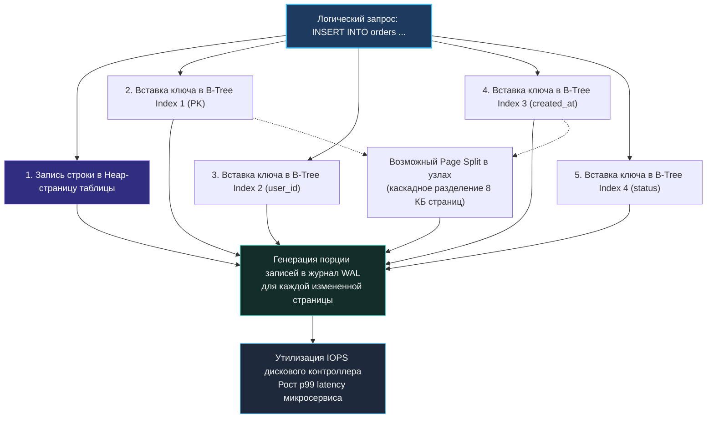

Среди начинающих инженеров и разработчиков, пришедших из мира абстрактных ORM, бытует стойкое заблуждение: «Если запрос работает медленно, добавь индекс. Если запросов много — добавь индексы на все поля». На первый взгляд кажется, что индекс — это бесплатная таблетка от всех болезней базы данных.

В реальной инженерной практике всё обстоит с точностью до наоборот. В компьютерных системах не бывает бесплатных ускорений. Каждый индекс в реляционной базе данных — это сложная, непрерывно мутирующая на диске и в оперативной памяти структура. Это долгосрочный контракт, за который вы платите ресурсами процессора, дисковой пропускной способностью (IOPS) и драгоценным пространством оперативной памяти при каждой операции модификации данных.

**Переизбыток индексов способен парализовать высоконагруженную систему гораздо быстрее и надежнее, чем их полное отсутствие.** В этой главе мы детально разберем, когда и почему индексы превращаются в яд, как они уничтожают аппаратную производительность серверов (Mechanical Sympathy), и как выявлять и безопасно ликвидировать мертвый индексный балласт в production-окружении Go-сервисов.

---

### Цена записи: множитель стоимости

Самая очевидная и разрушительная плата за индексы — это деградация операций записи (`INSERT`, `UPDATE`, `DELETE`).

Всякий раз, когда ваше Go-приложение выполняет простую вставку строки:
```sql
INSERT INTO orders (user_id, status, amount, created_at) VALUES (...);
```
наивный взгляд видит лишь одну операцию. Но если на таблице висит 5 индексов, СУБД обязана выполнить целую лавину работы:
1. Записать строку в страницу кучи (Heap page) таблицы.
2. Для **каждого из 5 индексов** найти соответствующую листовую страницу B-Tree.
3. Вставить новый ключ и указатель на строку (`ctid`).
4. Если листовая страница переполнена, выполнить ее расщепление (**Page Split**) и обновить родительские узлы дерева.
5. Для каждого измененного блока сформировать записи в журнале предзаписи WAL ([[8. WAL. Write Ahead Log]]) и сбросить их на диск при коммите.

В итоге один логический `INSERT` превращается в 6–10 физических модификаций страниц памяти и генерацию сотен килобайт WAL. В высоконагруженных OLTP-системах с тысячами транзакций в секунду пропускная способность базы данных мгновенно упирается в дисковый ввод-вывод и задержки синхронизации.



> [!info] Под капотом: Блокировки страниц (Latches) и расщепление узлов
> Расщепление страницы (Page Split) — это не просто выделение нового 8-килобайтного блока на диске. Это тяжелая блокировка на уровне страниц памяти (**Buffer Latches**). Пока ядро СУБД делит страницу пополам и перелинковывает двусвязный список соседних листьев B-Tree, все остальные транзакции, пытающиеся прочитать или записать данные в этот узел, встают в очередь ожидания (Contention). При высокой конкурентности это вызывает лавинообразный всплеск задержек (Latency Spikes).

---

### Влияние на буферный кэш

Оперативная память сервера конечна. Под кэш страниц базы данных отводится фиксированный пул: `shared_buffers` в PostgreSQL или `buffer pool` в MySQL InnoDB.

Каждый индекс занимает место в этом пуле. Если у вас есть таблица объемом 10 ГБ и 6 индексов, суммарно весящих еще 15 ГБ, то для удержания их в памяти требуется 25 ГБ RAM.

Когда индексы раздуты:
1. Бесполезные и редко используемые страницы индексов **вымывают из оперативной памяти горячие страницы данных** (Heap pages) и страниц активных B-Tree.
2. Доля попаданий в кэш (Cache Hit Ratio) катастрофически падает.
3. Каждый промах мимо кэша вынуждает СУБД обращаться к ядру операционной системы, выполняя системный вызов `pread()`.
4. Происходит смена контекста ядра, процесс СУБД блокируется в ожидании NVMe-накопителя, процессор простаивает в I/O Wait, а задержки API вашего бэкенда улетают в небеса.

---

### Неиспользуемые индексы: балласт

Часто индексы создаются разработчиками под разовую аналитическую выгрузку, в ходе давних экспериментов или «про запас». Проходят месяцы, код приложения меняется, функционал удаляется, а индекс остается жить в базе данных вечно.

Такой «зомби-индекс» продолжает поглощать ресурсы CPU и диска при каждой вставке и модификации, не принося ровным счетом никакой пользы на чтении.

В PostgreSQL для обнаружения мертвого груза существует системное представление `pg_stat_user_indexes`. Атрибут `idx_scan` накапливает количество обращений к индексу с момента последнего сброса статистики:

```sql
SELECT 
    schemaname, 
    tablename, 
    indexname, 
    idx_scan, 
    idx_tup_read, 
    idx_tup_fetch,
    pg_size_pretty(pg_relation_size(indexrelid)) AS index_size
FROM pg_stat_user_indexes
WHERE idx_scan = 0
  AND indexrelname NOT LIKE '%pkey'
ORDER BY pg_relation_size(indexrelid) DESC;
```

> [!warning] Ловушка / Gotcha: Ложное ощущение ненужности индекса
> Значение `idx_scan = 0` — мощный индикатор, но перед удалением индекса всегда проводите фактчекинг:
> 1. Уникальные индексы (`UNIQUE`, `PRIMARY KEY`) могут иметь `idx_scan = 0`, если по ним нет выборок, но они обеспечивают фундаментальную бизнес-целостность данных, блокируя вставку дубликатов! Удалять их категорически запрещено.
> 2. Индекс может использоваться в редких, но критически важных квартальных или годовых отчетах (например, расчет налогов или биллинг 1-го числа месяца). Если статистика сбрасывалась неделю назад, `idx_scan` будет равен нулю, но удаление индекса приведет к падению биллинга при следующем запуске.

---

### Низкая селективность: когда индекс не помогает

Представьте колонку `gender` с двумя значениями `'M'` и `'F'`, распределенными примерно 50/50. 

Если неопытный разработчик создаст B-Tree индекс на поле `gender`, запрос:
```sql
SELECT * FROM users WHERE gender = 'M';
```
вернет половину таблицы. Для таблицы на 1 000 000 строк это 500 000 записей.

Если бы база данных использовала индекс, ей пришлось бы:
1. Пройти по B-Tree и собрать 500 000 адресов строк.
2. Совершить **500 000 случайных прыжков (Random I/O)** по блокам таблицы на диске.

Оптимизатор PostgreSQL понимает это с математической точностью. Ему в 10 раз дешевле прочитать таблицу линейным последовательным сканированием (`Seq Scan`), задействовав потоковый упреждающий буфер (Read-Ahead) ядра Linux.

Индекс на колонке `gender` или на полях типа `boolean` с равномерным распределением значений **никогда не будет использован оптимизатором** для выборки данных. Он превращается в чистый, 100% пассивный убыток: сжигает диск, оперативную память и замедляет запись.

---

### Дублирующие и избыточные индексы

Еще одна классическая болезнь реляционных баз данных — избыточность:

1. **Поглощение левым префиксом:**  
   Если у вас есть составной индекс на `(a, b)`, отдельный индекс на `(a)` является абсолютным мусором. Согласно правилу левого префикса ([[5. Composite индексы]]), индекс `(a, b)` идеально обслуживает любые запросы по колонке `a`. Хранить оба индекса — значит совершать двойную работу на каждый `INSERT`/`UPDATE` без малейшего профита для чтения.
2. **Перестановки `(a, b)` и `(b, a)`:**  
   Два индекса с противоположным порядком колонок имеют право на жизнь только в том случае, если на оба ведущих столбца идут независимые высокочастотные запросы. В 90% случаев один из них создан по ошибке и должен быть немедленно удален.
3. **Индексы поверх внешних ключей и первичных ключей:**  
   Создание дополнительного индекса на поле `id`, когда оно уже является `PRIMARY KEY`.

Обнаружить дубликаты можно прямым анализом системного каталога `pg_index` или с помощью специализированных аналитических инструментов, таких как расширение `pg_duckdb` для кросс-анализа телеметрии.

---

### Индексы на часто обновляемых столбцах

Каждое обновление значения индексированной колонки через `UPDATE` — это не модификация на месте. В архитектуре MVCC это физическое удаление старого ключа из B-Tree и вставка нового ключа в новое место дерева.

Если колонка меняется непрерывно (например, поле `updated_at`, счетчик просмотров `views_count`, баланс счета или статус сердцебиения агента `last_ping`), индекс на таком столбце испытывает колоссальный стресс:
1. Листовые страницы B-Tree стремительно раздуваются (**Index Bloat**), наполняясь мусорными версиями.
2. Происходит лавина расщеплений страниц (`Page Split`).
3. **Уничтожается оптимизация HOT (Heap-Only Tuples):** В PostgreSQL, если обновляемая колонка не входит ни в один индекс, новая версия строки пишется на ту же страницу таблицы, а индексы не трогаются вовсе. Но стоит повесить индекс на `updated_at` — и HOT полностью отключается для всей таблицы! Каждый чих начинает переписывать все индексы сущности.

Для борьбы с таким распуханием администраторам приходится регулярно запускать тяжелые процедуры `REINDEX CONCURRENTLY` или блокирующий `VACUUM FULL`.

---

### Влияние на VACUUM и Index Only Scan

Как мы выяснили при разборе [[6. Covering индекс]], покрывающий индекс обеспечивает `Index Only Scan` только тогда, когда карта видимости (Visibility Map) подтверждает отсутствие мертвых версий строк на странице.

Если таблица перегружена индексами, фоновый процесс `VACUUM` тратит колоссальное количество времени и ресурсов на очистку индексных страниц от мусора. Он не успевает за потоком обновлений, биты карты видимости сбрасываются, и запросы, которые должны были летать за 0.1 мс без обращений к таблице, сваливаются в `Index Scan` с лавиной `Heap Fetches`. Избыточные индексы рикошетом убивают эффективность полезных покрывающих индексов.

---

### Конкурентность и блокировки при создании

Добавление индекса в работающую базу данных — операция высокой опасности.

Если выполнить стандартную команду:
```sql
CREATE INDEX idx_orders_created ON orders (created_at);
```
PostgreSQL наложит на таблицу жесткую блокировку `ShareLock`. Она запрещает любые операции записи (`INSERT`, `UPDATE`, `DELETE`). Если таблица содержит сотни миллионов строк, построение индекса может занять 30–60 минут. Все это время ваше Go-приложение будет зависать на попытках записи, пулы соединений переполнятся, и весь бэкенд рухнет с отказом в обслуживании (Downtime).

В боевых системах индексы создаются **исключительно с директивой `CONCURRENTLY`**:
```sql
CREATE INDEX CONCURRENTLY idx_orders_created ON orders (created_at);
```

Директива `CONCURRENTLY` строит индекс в два прохода, не блокируя операции записи. Однако помните:
- Она потребляет больше процессорного времени и оперативной памяти.
- Если во время построения транзакция завершится сбоем или нарушится уникальность, индекс останется в базе в статусе **INVALID**. Он продолжит замедлять запись, но никогда не будет использован планировщиком для чтения! Невалидные индексы необходимо находить и пересоздавать.

---

### Mechanical Sympathy: каскадный эффект на железо

Давайте посчитаем физическую нагрузку на кремний и накопители.

Представим рядовую таблицу аудита или событий, в которую сервис на Go пишет 10 000 строк в секунду. Пусть на таблице создано 6 индексов:
- 1 запись в Heap-страницу таблицы.
- 6 независимых записей в листовые страницы шести B-Tree индексов.
- Запись измененных страниц в журнал WAL.

Итого при каждой вставке модифицируется минимум 7 блоков по 8 КБ:
$$\text{Поток данных} = 10\,000 \times 7 \times 8 \text{ КБ} \approx 560 \text{ МБ/сек}$$

Поток записи в 560 МБ/с полностью исчерпывает предел стандартного SATA/SAS SSD! Более того, если вставки в таблицу идут последовательно в конец файла, то вставки в 6 индексов адресованы в разные случайные страницы деревьев. Дисковый контроллер упирается в потолок случайных операций ввода-вывода (IOPS), контроллер кэша захлебывается, и микросервис встает в глухой ступор.

Удалив 4 ненужных индекса, вы снижаете нагрузку на дисковую подсистему в три раза, возвращая системе былую легкость.

---

### Как выявить вредные индексы в Go-окружении

Профессиональный инженер не гадает на кофейной гуще, а опирается на точную телеметрию:

1. **Мониторинг через `pg_stat_statements`:**  
   Отслеживайте медленные запросы с аномальным временем выполнения и высоким показателем `shared_blks_read`.
2. **Анализ системных представлений:**  
   Регулярно запрашивайте `pg_stat_user_indexes` (для счетчиков чтений `idx_scan` и `idx_tup_read`) и `pg_statio_user_indexes` (для анализа дискового I/O каждого индекса).
3. **Журналирование медленных запросов:**  
   Установите параметр `log_min_duration_statement = '250ms'` для фиксации деградирующих операций.
4. **Фоновый аудит из Go-сервиса:**  
   Встройте периодическую диагностику в служебный воркер вашего приложения:

```go
package main

import (
	"context"
	"database/sql"
	"log"

	_ "github.com/jackc/pgx/v5/stdlib"
)

type UnusedIndex struct {
	TableName string
	IndexName string
	Size      string
	Scans     int64
}

// Поиск кандидатов на удаление: индексы без единого сканирования
func AuditUnusedIndexes(ctx context.Context, db *sql.DB) ([]UnusedIndex, error) {
	query := `
		SELECT 
			tablename, 
			indexname, 
			pg_size_pretty(pg_relation_size(indexrelid)) AS index_size,
			idx_scan
		FROM pg_stat_user_indexes
		WHERE idx_scan = 0
		  AND schemaname = 'public'
		  AND indexrelname NOT LIKE '%pkey'
		ORDER BY pg_relation_size(indexrelid) DESC;
	`

	rows, err := db.QueryContext(ctx, query)
	if err != nil {
		return nil, err
	}
	defer rows.Close()

	var result []UnusedIndex
	for rows.Next() {
		var idx UnusedIndex
		if err := rows.Scan(&idx.TableName, &idx.IndexName, &idx.Size, &idx.Scans); err != nil {
			return nil, err
		}
		result = append(result, idx)
	}

	return result, rows.Err()
}
```

---

### Стратегия работы с вредными индексами

Чтобы очистить базу данных без риска устроить аварию на проде, следуйте проверенному чек-листу:

1. **Аудит на длинной дистанции:** Анализируйте статистику `idx_scan` минимум за 2–4 недели, чтобы случайно не удалить индекс, нужный для ежемесячного отчета.
2. **Изоляция ограничений:** Никогда не удаляйте индексы, поддерживающие `UNIQUE` или `PRIMARY KEY`.
3. **Безопасное удаление:** Удаляйте индексы строго через `DROP INDEX CONCURRENTLY`:
   ```sql
   DROP INDEX CONCURRENTLY idx_orders_status_legacy;
   ```
   Это предотвратит блокировку таблицы для пишущих транзакций.
4. **Замена узкими альтернативами:** Если индекс нужен только для 2% строк, замените его на компактный частичный индекс ([[7. Partial индекс]]). Если индекс дублирует другой — удалите менее широкий.
5. **Пост-мониторинг:** В течение 48 часов после удаления внимательно следите за CPU базы данных и графиками задержек API в Prometheus/Grafana.

> [!tip] Собеседование: Индексирование Append-Only таблиц
> **Вопрос:** Мы проектируем сервис логирования и аудита безопасности на Go, который генерирует 50 000 вставок в секунду в PostgreSQL/TimescaleDB. Чтение данных происходит крайне редко (в случае инцидентов безопасности аналитиками). Какова оптимальная индексная стратегия для такой таблицы?
> 
> **Ответ:** Минималистичная! На append-only таблицах с интенсивным потоком записи каждый дополнительный индекс — это преступление против throughput. Достаточно оставить суррогатный `PRIMARY KEY` (или блочное сжатие по времени без PK) и, возможно, один BRIN-индекс (Block Range Index) по колонке `created_at`. BRIN-индексы занимают в сотни раз меньше места, не испытывают page splits и практически не замедляют вставки, при этом позволяя быстро находить временные диапазоны логов при расследованиях.

---

### Инструменты для автоматизации

Для поддержания чистоты схемы в современных enterprise-системах применяются автоматизированные решения:
- **`pg_stat_statements`:** фундаментальное расширение для анализа частоты и стоимости всех запросов.
- **`pg_qualstats`:** собирает статистику предикатов в блоках `WHERE` и `JOIN`, математически вычисляя недостающие и избыточные индексы.
- **pg_repack:** утилита для онлайн-устранения распухания (Bloat) таблиц и индексов без эксклюзивных блокировок.

---

### Заключение

Индекс — это не бесплатное украшение схемы, а тяжелый производственный станок. Хороший инженер помнит: каждый созданный индекс замедляет запись, отнимает оперативную память и увеличивает энтропию системы. Относитесь к индексам так же строго, как к коду в продакшене: не держите мертвого груза, регулярно проводите ревизию и безжалостно удаляйте всё, что не приносит измеримой пользы.

В следующей лекции мы откроем капот планировщика запросов и научимся читать мысли базы данных: [[10. План выполнения запроса. EXPLAIN]] — детальный гид по анализу и интерпретации планов выполнения SQL-запросов.
