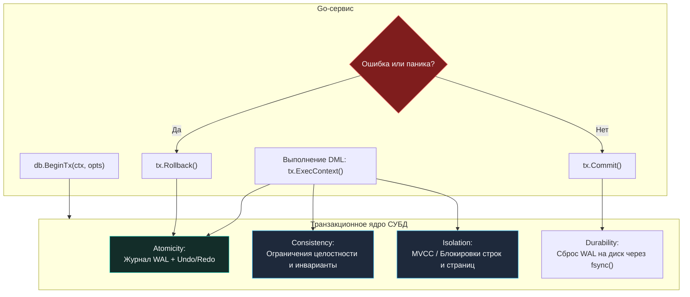
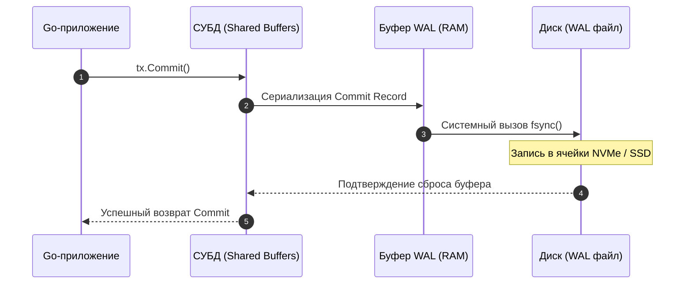

## Введение: Почему ACID — это не просто аббревиатура

Когда вы пишете сервис на Go, который обрабатывает банковские платежи, списывает товары со склада или регистрирует сессии пользователей, вы неявно заключаете контракт с базой данных. Вы надеетесь, что в случае внезапного отключения питания в серверной, сбоя в сети или одновременного наплыва тысячи клиентов баланс кошелька не станет отрицательным, а деньги не растворятся в воздухе.

Эти фундаментальные гарантии надежности были сформулированы пионерами компьютерных наук Джимом Грэем (Jim Gray) и Андреасом Рейтером (Andreas Reuter) еще на заре 1980-х годов и упакованы в акроним **ACID** — **Atomicity** (Атомарность), **Consistency** (Согласованность), **Isolation** (Изоляция) и **Durability** (Долговечность).

Для бэкенд-инженера уровня Senior/Lead понимание ACID — это не заучивание словарных определений для галочки. Это способность:
* Предсказывать поведение системы при падении процесса ОС, сбоях питания, сетевых партициях и конкурентных запросах.
* Осознанно балансировать на грани между строгостью гарантий и пропускной способностью (throughput) системы.
* Проектировать надежный Go-код, который гармонично сосуществует с транзакционным ядром СУБД, избегая зависших транзакций, утечек пула соединений и потерянных обновлений (Lost Updates).

В этой лекции мы разберем каждую составляющую ACID с точки зрения «механического сочувствия» к СУБД (PostgreSQL, MySQL/InnoDB) и рассмотрим их прямое отражение в коде на Go.



---

## Atomicity (Атомарность): Всё или ничего

**Атомарность** (Atomicity) декларирует неделимость транзакции как единого квантового скачка системы: либо **все** операции внутри транзакции успешно применяются к базе данных, либо **ни одна** из них не оставляет видимого следа. Промежуточные, «полусырые» состояния никогда не должны становиться видимыми для внешнего мира.

### Как это работает под капотом

Если во время выполнения сложного перевода средств из пяти SQL-запросов на третьем шаге исчезло электричество, таблица на диске не может остаться в состоянии, где с отправителя деньги списались, а получателю не зачислились.

Для гарантии атомарности СУБД использует архитектурный паттерн **Write-Ahead Log (WAL)** (в MySQL InnoDB это комбинация Redo-лога и Undo-лога). Подробно физику этого процесса мы разберем в лекции [[8. WAL. Write Ahead Log]].
Кратко базовый конвейер выглядит так:
1. **Запись вперед данных:** Прежде чем изменить хотя бы один байт в буферном кэше страниц таблицы, СУБД сериализует операцию в журнал упреждающей записи (WAL).
2. **Undo-информация:** Запись содержит как новые значения (Redo для наката изменений вперед), так и дельту предыдущего состояния (Undo для отката назад).
3. **Точка невозврата (`COMMIT`):** При фиксации транзакции в WAL пишется специальная запись фиксации (Commit Record). До тех пор пока эта запись не сброшена на диск, транзакция считается незавершенной.
4. **Откат (`ROLLBACK`) или аварийное восстановление:** Если транзакция прервана или сервер аварийно перезапустился, фоновый процесс Crash Recovery вычитывает лог и восстанавливает исходное состояние данных до начала транзакции.

> [!info] Под капотом: LSN и буферный пул
> В архитектуре PostgreSQL оперативная память разделена на страницы данных по **8 КБ** (Shared Buffers). Каждая страница снабжена 64-битным монотонным счетчиком — **LSN (Log Sequence Number)**.  
> СУБД строго соблюдает инвариант упреждающей записи: страница из `shared buffers` ни при каких обстоятельствах не может быть вытеснена на диск фоновым процессом BgWriter, пока WAL-файл не содержит записей с LSN, превышающим или равным LSN данной страницы данных! Это гарантирует возможность отката любых «грязных» изменений с контрольной точки [[9. Checkpointing]].

### Пример на Go: корректная обработка транзакции

В стандартной библиотеке Go пакет `database/sql` реализует транзакции через объект `*sql.Tx`. Типичная ошибка новичка — забыть вызвать откат при ошибках в середине функции или при возникновении паники (`panic`).

Ниже представлен канонический шаблон безопасной транзакции с гарантией атомарности:

```go
package main

import (
	"context"
	"database/sql"
	"errors"
	"fmt"

	"github.com/shopspring/decimal"
)

// TransferFunds выполняет перевод средств между счетами с гарантией атомарности
func TransferFunds(ctx context.Context, db *sql.DB, from, to int64, amount decimal.Decimal) (err error) {
	// Начинаем транзакцию с контекстом
	tx, err := db.BeginTx(ctx, nil)
	if err != nil {
		return fmt.Errorf("begin transaction: %w", err)
	}

	// Идиоматичный defer: защищает от утечек транзакций при panic и ранних return
	defer func() {
		if p := recover(); p != nil {
			_ = tx.Rollback()
			panic(p) // Пробрасываем панику дальше после освобождения ресурсов
		} else if err != nil {
			// Откат транзакции при возникновении любой ошибки бизнес-логики
			_ = tx.Rollback()
		}
	}()

	// 1. Списание средств с проверкой доступного баланса
	res, err := tx.ExecContext(ctx,
		"UPDATE accounts SET balance = balance - $1 WHERE id = $2 AND balance >= $1",
		amount, from,
	)
	if err != nil {
		return fmt.Errorf("debit failed: %w", err)
	}
	if rows, _ := res.RowsAffected(); rows == 0 {
		return errors.New("insufficient funds or account not found")
	}

	// 2. Зачисление средств на целевой счет
	_, err = tx.ExecContext(ctx,
		"UPDATE accounts SET balance = balance + $1 WHERE id = $2",
		amount, to,
	)
	if err != nil {
		return fmt.Errorf("credit failed: %w", err)
	}

	// 3. Фиксация: точка невозврата (Commit)
	if err = tx.Commit(); err != nil {
		return fmt.Errorf("commit failed: %w", err)
	}
	return nil
}
```

> [!warning] Ловушка / Gotcha: Зависшая транзакция (Idle in transaction)
> Если внутри тела функции между `BeginTx` и `Commit` вы вызовете долгий HTTP-запрос или забудете вызвать `tx.Rollback()` в ветке раннего возврата, соединение вернется в пул СУБД в статусе `idle in transaction`. Это заблокирует строки таблицы, задержит автоочистку мусора [[11. VACUUM и garbage collection]] и исчерпает доступные соединения СУБД! Всегда применяйте защитный `defer tx.Rollback()`. Повторный вызов `Rollback()` после успешного `Commit()` безопасен и возвращает `sql.ErrTxDone`.

---

## Consistency (Согласованность): Инварианты и ограничения

Буква **C** в слове ACID — пожалуй, самая неоднозначная и перегруженная концепция в Computer Science (в теореме CAP она означает совершенно другое — линеаризуемость чтений!).

В контексте транзакций **Согласованность** означает, что транзакция переводит базу данных из одного корректного, непротиворечивого состояния в другое корректное состояние, не нарушая ни одного декларированного правила:
* Ограничений схемы данных (`NOT NULL`, `FOREIGN KEY`, `UNIQUE`, `CHECK`).
* Системных триггеров (`BEFORE`/`AFTER`).
* Бизнес-инвариантов предметной области («баланс пользователя не может быть отрицательным», «сумма пополнений равна сумме остатков»).

### Разделение зон ответственности

1. **Согласованность на уровне СУБД:**  
   Обеспечивается декларативными средствами реляционной модели. Если вы объявили `FOREIGN KEY`, движок базы данных физически не позволит удалить запись родительской таблицы, пока на нее ссылаются дочерние строки в заказах.
2. **Согласованность на уровне приложения (Go-сервис):**  
   СУБД ничего не знает о специфике вашего бизнеса. Например, СУБД не знает, что пользователь не может совершать более трех переводов в минуту. Эти инварианты обязан проверять и валидировать ваш Go-код, опираясь на блокировки или уровни изоляции.

### Механика проверок под капотом

При выполнении операторов `INSERT` и `UPDATE` СУБД тратит драгоценные процессорные такты на валидацию инвариантов:
1. Проверка типов и `NOT NULL`, валидация выражений `CHECK`.
2. Поиск дубликатов в уникальных индексах (B-Tree, Hash), требующий блокировки узлов индексного дерева.
3. Проверка внешних ключей: движок выполняет поиск по индексу родительской таблицы.
4. Вызов триггеров.

> [!tip] Собеседование: Кто отвечает за букву C?
> **Вопрос**: Может ли транзакция завершиться с `COMMIT`, соблюсти все ограничения СУБД, но при этом нарушить согласованность данных?  
> **Ответ**: Безусловно! Если в таблице `accounts` не было объявлено ограничение `CHECK (balance >= 0)`, а разработчик в коде Go сначала прочитал баланс (`balance = 100`), затем в параллельной горутине тоже прочитал баланс (`100`), и обе горутины списали по 80 рублей, итоговый баланс станет `-60`. Все правила СУБД соблюдены, но бизнес-согласованность разрушена. Согласованность — это результат совместной работы СУБД и дисциплины разработчика!

---

## Isolation (Изоляция): Иллюзия одиночного выполнения

Если бы все транзакции выполнялись в базе данных строго последовательно (в один поток), жизнь инженеров была бы безоблачной, а пропускная способность баз данных упала бы до единиц запросов в секунду.

**Изоляция** гарантирует, что параллельно выполняющиеся транзакции изолированы друг от друга так, будто они выполняются последовательно (Serializability), создавая для каждой транзакции иллюзию единоличного владения базой данных.

Поскольку идеальная изоляция требует массивных блокировок и драматически снижает параллелизм, стандарт SQL-92 определил 4 классических уровня изоляции, балансирующих между строгостью и производительностью.

### Классические аномалии конкурентного доступа
* **Dirty Read (Грязное чтение):** Транзакция читает данные, измененные другой незафиксированной транзакцией. Если та выполнит `ROLLBACK`, прочитанные данные окажутся миражом.
* **Non-Repeatable Read (Неповторяющееся чтение):** Повторный запрос одной и той же строки внутри транзакции возвращает изменившиеся значения, зафиксированные параллельной транзакцией.
* **Phantom Read (Фантомное чтение):** Повторный запрос по диапазону `WHERE` возвращает новые строки («фантомы»), добавленные или удаленные другой зафиксированной транзакцией.

### Матрица уровней изоляции стандарта SQL и их реализация

| Уровень изоляции | Dirty Read | Non-Repeatable Read | Phantom Read | Реализация в PostgreSQL | Реализация в MySQL InnoDB |
|---|:---:|:---:|:---:|---|---|
| **Read Uncommitted** | Возможна | Возможна | Возможна | Работает как `Read Committed` | Чтение без блокировок и без снимков |
| **Read Committed** | ❌ Защищен | Возможна | Возможна | Снимок на начало каждого запроса | Снимок на начало каждого запроса (Consistent Nonlocking Read) |
| **Repeatable Read** | ❌ Защищен | ❌ Защищен | Возможна* | Снимок на начало транзакции + предикатные блокировки | Снимок на начало транзакции + Next-Key Locking |
| **Serializable** | ❌ Защищен | ❌ Защищен | ❌ Защищен | SSI (Serializable Snapshot Isolation) | Предикатные блокировки + проверка конфликтов (rw-antidependency) |

*\* Примечание: В PostgreSQL на уровне `Repeatable Read` фантомные чтения также математически невозможны благодаря реализации снимка MVCC на уровне начала всей транзакции!*

Подробный разбор механики снимков и блокировок ждет вас в лекциях [[3. Read Committed, Repeatable Read, Serializable]] и [[4. Dirty Read, Phantom Read, Lost Update]].

### Как управлять изоляцией в Go

В Go уровень изоляции задается через структуру `sql.TxOptions`:

```go
// Задаем строгий уровень Repeatable Read для финансового отчета
opts := &sql.TxOptions{
    Isolation: sql.LevelRepeatableRead,
    ReadOnly:  true, // Подсказка для оптимизатора СУБД
}

tx, err := db.BeginTx(ctx, opts)
if err != nil {
    return err
}
defer tx.Rollback()
```

> [!warning] Ловушка / Gotcha
> Не все драйверы базы данных поддерживают все уровни изоляции. Например, драйвер `github.com/lib/pq` для PostgreSQL корректно мапит `sql.Level*` на системную инструкцию `SET TRANSACTION ISOLATION LEVEL`, а вот некоторые драйверы для MySQL могут игнорировать `sql.LevelReadCommitted`, если не переданы специальные параметры в DSN. Всегда проверяйте документацию драйвера и тестируйте поведение.

---

## Durability (Долговечность): Данные переживут сбой

**Долговечность** гарантирует, что как только клиент получил от СУБД подтверждение успешного `COMMIT`, внесенные изменения становятся персистентными. Ни внезапное отключение электропитания, ни крах ядра операционной системы (Kernel Panic), ни падение процесса СУБД не приведут к потере этих данных.

### Механика: Путь байта из памяти на физический диск

Когда вы вызываете `Commit()`, происходит сложная последовательность аппаратных событий:

1. Страницы данных в оперативной памяти (в `shared buffers` PostgreSQL или `buffer pool` InnoDB) помечаются как «грязные» (Dirty Pages). Они **не сбрасываются** на диск немедленно, так как случайная запись (Random I/O) страниц по 8–16 КБ катастрофически замедлила бы систему!
2. Вместо этого в компактный кольцевой буфер упреждающей записи формируется последовательная WAL-запись.
3. Движок СУБД выполняет системный вызов `fsync()` (или `fdatasync()`) для дескриптора WAL-файла.
4. Ядро Linux сбрасывает кэш страниц ОС на физический контроллер диска (NVMe SSD).
5. Только после того, как физический накопитель подтвердил запись на энергонезависимый носитель, СУБД возвращает приложению `COMMIT OK`.



> [!info] Под капотом: Системный вызов fsync и групповой коммит
> Операция `fsync()` чрезвычайно дорога: даже на быстрых серверных NVMe накопителях она занимает от десятков микросекунд до единиц миллисекунд (а на старых магнитных HDD — до 10–15 мс!).  
> Чтобы тысячи транзакций в секунду не встали в очередь за `fsync()`, СУБД реализуют **групповой коммит (Group Commit)**: транзакции, финиширующие в одно и то же микросекундное окно, объединяют свои WAL-записи и сбрасывают их на диск одним совместным вызовом `fsync()`.

### Настройка durability в зависимости от требований

В высоконагруженных системах некоторые данные (аналитические счетчики, временные токены, кликстрим) не требуют абсолютной финансовой гарантии выживания при ядерном взрыве:

```sql
-- PostgreSQL: варианты синхронности коммита
ALTER SYSTEM SET synchronous_commit = remote_apply; -- Максимальная строгость: ждем fsync на реплике
ALTER SYSTEM SET synchronous_commit = on;           -- Стандарт: ждем локальный fsync WAL
ALTER SYSTEM SET synchronous_commit = off;          -- Асинхронный коммит: возврат без ожидания fsync!
```

В коде на Go вы можете локально ослаблять долговечность для некритичных вставок:

```go
// Для некритичных логов и метрик отключаем ожидание fsync
_, err = tx.ExecContext(ctx, "SET LOCAL synchronous_commit TO off")
_, err = tx.ExecContext(ctx, "INSERT INTO click_metrics (event, ts) VALUES ($1, $2)", "click", time.Now())
```

> [!tip] Собеседование: Чем опасен `synchronous_commit = off`?
> **Вопрос**: Что произойдет при аварии сервера, если транзакция была зафиксирована с `synchronous_commit = off`? Нарушится ли целостность базы?  
> **Ответ**: База данных **не будет повреждена**! Целостность (Consistency) и Атомарность (Atomicity) сохранятся полностью, поврежденных записей не появится. Однако вы потеряете последние изменения за небольшое окно времени (обычно до 3 * `wal_writer_delay`, около 600 мс), которые еще находились в буфере памяти и не успели сброситься на диск.

---

## Механическая симпатия: Как ACID влияет на производительность

Понимание аппаратной подоплеки ACID позволяет бэкенд-инженеру принимать взвешенные архитектурные решения:

1. **Атомарность через WAL:** Чем шире транзакция (тысячи строк в одном блоке), тем больше объем сгенерированного WAL, создающего нагрузку на дисковый контроллер и репликацию.
2. **Изоляция через блокировки или MVCC:**
   * Пессимистичные блокировки (`SELECT ... FOR UPDATE`) вызывают межгорутинное ожидание и чреваты дедлоками.
   * Оптимистичный MVCC сохраняет старые версии строк («мертвые кортежи» — dead tuples). Длинные транзакции не дают процессу автоочистки `VACUUM` освобождать дисковое пространство, порождая разрастание таблиц (**table bloat**).
3. **Долговечность через fsync:** Никогда не выполняйте одиночные `INSERT` в циклах без батчинга. Каждая отдельная транзакция заставит ядро ОС вызывать `fsync`.

### Пример: оптимизация пакетной вставки

```go
// ❌ Антипаттерн: 1 000 транзакций = 1 000 вызовов fsync
for _, item := range items {
    _, err := db.ExecContext(ctx, "INSERT INTO telemetry (val) VALUES ($1)", item)
}

// ✅ Оптимально: 1 транзакция на весь пакет = 1 вызов fsync
tx, err := db.BeginTx(ctx, nil)
if err != nil {
    return err
}
defer tx.Rollback()

stmt, err := tx.PrepareContext(ctx, "INSERT INTO telemetry (val) VALUES ($1)")
if err != nil {
    return err
}
defer stmt.Close()

for _, item := range items {
    if _, err = stmt.ExecContext(ctx, item); err != nil {
        return err
    }
}
return tx.Commit() // Ровно один групповой сброс WAL на диск!
```

> [!warning] Ловушка / Gotcha: Время жизни транзакции
> Ни при каких обстоятельствах не удерживайте транзакцию открытой во время походов во внешние сетевые сервисы (HTTP API, сторонние шлюзы, тяжелые вычисления на CPU). В режиме `REPEATABLE READ` или `SERIALIZABLE` открытая транзакция удерживает виртуальный моментальный снимок базы, замораживая горизонт видимости и блокируя `VACUUM`. Выполняйте сетевые запросы **до** вызова `BeginTx` или **после** `Commit`!

---

## ACID в распределённых системах: границы применимости

Классические гарантии ACID проектировались в предположении, что вся база данных функционирует на одном физическом сервере с общей оперативной памятью и общим дисковым контроллером.

В эпоху микросервисной архитектуры и распределенных баз данных, где логическая операция затрагивает 3–5 независимых микросервисов и хранилищ, обеспечить классический ACID невозможно без чудовищной деградации задержки и доступности.

Для распределенных сред разработаны альтернативные подходы и компромиссы:
* **Saga (Сага):** Последовательность локальных ACID-транзакций в каждом сервисе. В случае сбоя вызываются компенсирующие транзакции (Compensating Transactions), откатывающие предыдущие шаги в обратном порядке.
* **Two-Phase Commit (2PC):** Протокол двухфазной фиксации между координатором и участниками. Дает атомарность, но чрезвычайно хрупок при сетевых партициях и удерживает распределенные блокировки.
* **Event Sourcing + CQRS:** Разделение контуров записи и чтения с моделью согласованности в конечном счете (**Eventual Consistency**).

Эти фундаментальные механизмы мы детально разберем в разделах [[14. Распределенные системы на Go]], [[8. Distributed transactions]] и [[9. Two Phase Commit]].

---

## Итог

ACID — это надежный фундамент, на котором покоится вся индустрия высоконагруженного бэкенда. Каждая буква представляет собой конкретный физический и программный механизм:
1. **Atomicity (Атомарность):** Реализуется через журнал WAL и undo/redo информацию; на стороне Go обязательно защищается связкой `defer tx.Rollback()` и `recover()`.
2. **Consistency (Согласованность):** Совместная работа декларативных ограничений СУБД (`NOT NULL`, `CHECK`, `FOREIGN KEY`) и строгой валидации бизнес-инвариантов в коде приложения.
3. **Isolation (Изоляция):** Баланс между скоростью и аномалиями (`Read Committed`, `Repeatable Read`, `Serializable`), реализуемый через механизмы MVCC и блокировки строк.
4. **Durability (Долговечность):** Гарантируется аппаратным сбросом WAL на диск с помощью системного вызова `fsync()`; может гибко настраиваться параметром `synchronous_commit`.

В следующей лекции мы детально погрузимся в механику уровней изоляции: [[2. Транзакции и уровни изоляции]], где исследуем, как работают снимки данных, виртуальное время транзакций и видимость версий кортежей под капотом.
