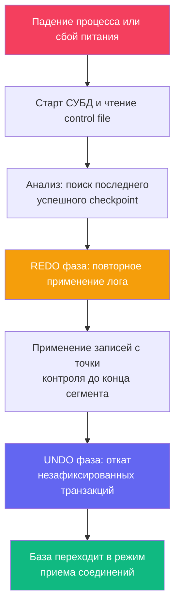

## Введение: Возвращение к консистентности после хаоса

В распределенных системах и серверной инфраструктуре сбой — это не досадная случайность, а неизбежная статистическая данность. Внезапное отключение питания в дата-центре, аварийная паника ядра Linux, безжалостный OOM-киллер, выбивающий процесс СУБД под нагрузкой, или сбой контроллера дискового массива — всё это происходит регулярно.

В момент аварии содержимое `shared_buffers` (оперативной памяти СУБД) бесследно испаряется, а страницы таблиц на физическом диске могут остаться в полузаписанном, разорванном состоянии.

Процесс автоматического восстановления после сбоя (**Crash Recovery**) — это инженерный шедевр, возвращающий базу данных в абсолютно предсказуемое, математически согласованное состояние без необходимости ручного вмешательства администратора. Для архитектора и старшего инженера понимание этого процесса критично, потому что:
* Оно напрямую определяет целевое время восстановления сервиса (**RTO**, Recovery Time Objective) и влияет на жесткие требования SLA.
* Неконтролируемое поведение микросервисов в момент перезапуска базы часто порождает лавину запросов (**thundering herd**) и провоцирует вторичные каскадные отказы.
* Настройки, управляющие скоростью восстановления (`checkpoint_timeout`, `synchronous_commit`), находятся в прямом архитектурном конфликте с пропускной способностью системы.

В этой лекции мы разберём фазы восстановления по алгоритму ARIES, физику проблемы «рваных страниц», поведение дисковых очередей и кэша CPU, а также освоим идиоматичные паттерны обработки процесса восстановления в Go-сервисах.



---

## 1. Фазы восстановления: Анализ, REDO, UNDO

Классический алгоритм восстановления реляционных СУБД, базирующийся на фундаментальной концепции **ARIES** (Algorithms for Recovery and Isolation Exploiting Semantics), состоит из трёх строго последовательных фаз.

### Фаза 1: Analysis

СУБД считывает служебный контрольный файл (в PostgreSQL это `global/pg_control`, в MySQL InnoDB — заголовок системного пространства `ibdata1`) и находит значение `redo_lsn` последней успешно завершённой контрольной точки [[9. Checkpointing]]. 

От этой точки движок начинает последовательное сканирование журнала упреждающей записи (WAL) вперед, чтобы:
* Восстановить в оперативной памяти точный список активных транзакций на момент катастрофы.
* Определить статус каждой транзакции: успела ли она сбросить запись `commit_lsn` в WAL до падения.
* Проверить контрольные суммы записей (CRC32/CRC64) и выявить физическую границу целостных сегментов лога.

### Фаза 2: REDO (Повторное применение)

СУБД проходит по всем записям WAL начиная с `redo_lsn` и накатывает их на страницы данных. Фундаментальный принцип ARIES гласит: **записи применяются независимо от того, были ли они уже сброшены на диск до аварии**. 

Это обеспечивает свойство идемпотентности:
* Перед применением каждой WAL-записи движок сравнивает метку `pd_lsn` в заголовке дисковой страницы с `record_lsn`.
* Если `page_lsn >= record_lsn`, значит, данная страница уже содержит указанную модификацию, и запись пропускается.
* Если `page_lsn < record_lsn`, операция повторно накладывается на страницу.

В финале фазы REDO состояние базы данных на страницах памяти в точности воспроизводит картину, существовавшую за микросекунду до аварии (включая изменения незафиксированных транзакций!).

### Фаза 3: UNDO (Откат)

Транзакции, которые были активны в момент падения и не успели зафиксировать запись `commit` в WAL, признаются прерванными. 

СУБД запускает обратную прокрутку (откатывает изменения через Undo-логи в InnoDB или проставляет метки отмененных транзакций в `clog`/`xmax` в PostgreSQL). После завершения фазы UNDO база данных переходит в статус `ready` и открывает сетевые сокеты для приема клиентских запросов.

> [!info] Под капотом
> В PostgreSQL `REDO` выполняется однопоточно процессом `startup`. Это не баг, а осознанный выбор: последовательное чтение и применение лога лучше упирается в пропускную способность дискового контроллера, а многопоточное применение требует сложной координации порядка модификаций. В MySQL/InnoDB лог также применяется последовательно, но параллелизм достигается за счёт фоновой отмены (`purge`) после открытия базы.

---

## 2. Механическая симпатия: Аппаратные угрозы и защита

В теоретических моделях восстановление выглядит прямолинейно. На практике СУБД сталкивается с суровыми ограничениями дискового кремния.

### Проблема «рваных страниц» (Torn Page)

Страница данных в реляционных базах имеет размер **8 КБ** (в PostgreSQL) или **16 КБ** (в MySQL InnoDB). Однако физические дисковые накопители и ядро операционной системы гарантируют атомарность записи только на уровне секторов — обычно **512 байт** или **4 КБ** (Advanced Format).

Если в момент, когда контроллер успел записать первые 4 КБ из 8 КБ страницы, питание внезапно пропало, на накопителе останется уродливый гибрид: половина страницы содержит свежие данные, а половина — старые! Контрольная сумма страницы не сойдется, а фаза REDO завершится фатальной ошибкой повреждения данных.

Решение в PostgreSQL: механизм **`full_page_writes`**.  
При первом изменении любой страницы данных после создания контрольной точки движок записывает в журнал WAL **полную 8-килобайтную копию страницы целиком**, а не просто дифференциальную дельту. При восстановлении после сбоя движок заменяет поврежденную «рваную страницу» чистой копией из WAL, после чего накатывает поверх последующие дельты.

Цена этой надежности — кратковременное удвоение объема генерируемого WAL после чекпоинта, но это единственная надежная защита от физического разрушения страниц.

### Влияние на кэш-линии CPU и предвыборку

Фаза `REDO` представляет собой преимущественно непрерывное последовательное чтение сегментов WAL с диска. Процессорные ядра задействуют аппаратный предвыборщик инструкций (`prefetcher`), а кэш `L2/L3` заполняется с высокой локальностью. 

Однако при наличии сбойных блоков накопителя контроллер диска начинает бесконечно повторять попытки чтения (`retry limit`), блокируя процесс `startup` в состоянии `D` (Uninterruptible Sleep) и превращая минутное восстановление в многочасовой простой.

> [!warning] Ловушка / Gotcha
> Если вы используете облачные SSD с burst-балансом IOPS, фаза `REDO` может исчерпать квоту. Облачный провайдер начнёт троттлить диск. Восстановление, которое на локальном NVMe занимает 2 минуты, в облаке может растянуться на 40 минут. Всегда закладывайте в RTO множитель 3-5 для burst-хранилищ и мониторьте `await` дисков.

---

## 3. Практика в Go: Обработка восстановления в приложении

Когда база данных падает и перезапускается, сотни подов вашего Go-приложения не должны слепо долбиться в закрытый порт. Если 100 реплик микросервиса одновременно попытаются открыть по 50 соединений, возникнет шторм подключений (**thundering herd**), который отнимет ресурсы диска и процессора у критически важного процесса `startup`.

### Паттерн: Умный пул с проверкой готовности

В промышленном коде подключение к восстанавливающейся базе оформляется через мягкий старт с прогревом и экспоненциальной задержкой:

```go
func ConnectWithRecoveryCheck(ctx context.Context, dsn string) (*sql.DB, error) {
    db, err := sql.Open("postgres", dsn)
    if err != nil {
        return nil, fmt.Errorf("open db: %w", err)
    }

    // Настройка пула для мягкого старта
    db.SetMaxOpenConns(5) // Начинаем с минимума
    db.SetConnMaxLifetime(15 * time.Minute)

    // Проверяем готовность СУБД с экспоненциальной задержкой
    backoff := 1 * time.Second
    maxBackoff := 30 * time.Second
    maxAttempts := 20

    for i := 0; i < maxAttempts; i++ {
        // Проверка штатной доступности
        if err := db.PingContext(ctx); err == nil {
            db.SetMaxOpenConns(50) // Расширяем пул до рабочих значений
            return db, nil
        }

        // Ждём экспоненциально, но не больше лимита
        select {
        case <-ctx.Done():
            return nil, fmt.Errorf("context cancelled during recovery wait: %w", ctx.Err())
        case <-time.After(backoff):
            // Увеличиваем задержку
            if backoff < maxBackoff {
                backoff *= 2
            }
        }
    }

    return nil, fmt.Errorf("database not ready after %d attempts", maxAttempts)
}
```

> [!tip] Собеседование
> **Вопрос:** Почему `db.Ping()` недостаточно для определения готовности во время восстановления?
> **Ответ:** В некоторых конфигурациях или версиях СУБД порт уже открыт, но база находится в режиме `recovery`. Запросы, кроме служебных, будут отклоняться с ошибкой `database is starting up` (SQLSTATE `57P03`). В PostgreSQL драйвер `pq` или `pgx` корректно обрабатывает это, но лучше явно проверять `pg_is_in_recovery()` или использовать `startup_probe` в Kubernetes. В `pgx` можно настроить `AfterConnect` hook, который выполнит `SELECT 1` и проверит, что статус `idle`, а не `recovery`.

### Паттерн: Идемпотентный запуск и миграции

После успешного восстановления СУБД сервисы часто запускают миграции схемы или фоновую очистку. Любая такая операция обязана быть строго идемпотентной и защищенной от параллельного запуска несколькими подами:

```go
func RunMigrationsSafe(ctx context.Context, db *sql.DB) error {
    // Использование сторонних библиотек (golang-migrate/goose) с блокировкой на уровне БД
    // или ручная проверка версии через advisory lock
    _, err := db.ExecContext(ctx, "SELECT pg_advisory_lock(123456789)")
    if err != nil {
        return fmt.Errorf("acquire lock: %w", err)
    }
    defer func() {
        _, _ = db.ExecContext(ctx, "SELECT pg_advisory_unlock(123456789)")
    }()

    // Логика миграций...
    return nil
}
```

---

## 4. Влияние настроек ACID на время восстановления

Выбор параметров надежности напрямую диктует, какой объем журнала СУБД обязана прочитать и переварить при рестарте:

| Настройка | Влияние на REDO | Влияние на UNDO | RTO |
|-----------|----------------|-----------------|-----|
| `checkpoint_timeout = 5min` | Короткий проигрыш лога | Быстрый откат | Низкий (секунды) |
| `checkpoint_timeout = 60min` | Длинный проигрыш, больше I/O | Больше незакоммиченных данных | Высокий (минуты) |
| `synchronous_commit = off` | Потеря последних записей при крахе | Меньше откатов, но возможна инконсистентность | Низкий, но с потерей данных (RPO > 0) |
| `full_page_writes = on` | Увеличивает объём WAL на 20-40% | Не влияет | Незначительно увеличивает фазу REDO |

> [!warning] Ловушка / Gotcha
> Никогда не отключайте `full_page_writes` в продакшене, даже если СУБД пишет на ZFS или Btrfs. Файловые системы с Copy-on-Write не гарантируют атомарность записи на уровне блока файловой системы так, как это ожидает движок БД. Вы рискуете получить повреждённые индексы после восстановления.

---

## 5. Итог

1. **Восстановление** состоит из фаз Analysis, REDO и UNDO. Оно полностью автоматическое и гарантирует возврат к последней консистентной точке.
2. **Защита от torn pages** реализуется через `full_page_writes`. Первая модификация после чекпоинта пишет полную страницу в WAL.
3. **Механика**: REDO последовательно читает лог, эффективно используя кэш CPU и prefetcher. UNDO откатывает незавершённые транзакции.
4. **В Go**: Не долбите БД при старте. Используйте `Ping` с экспоненциальным бэкоффом, расширяйте пул постепенно, проверяйте `pg_is_in_recovery`. Делайте миграции идемпотентными с `advisory lock`.
5. **Настройка**: Баланс между `checkpoint_timeout` и RTO. Для быстрого старта держите интервал 5-15 минут, но помните о цене частых чекпоинтов [[9. Checkpointing]].

Восстановление возвращает базу к рабочему состоянию, но оставляет после себя мёртвые версии строк и раздутые структуры индексов. Как СУБД очищает этот мусор в фоновом режиме, не блокируя основную работу, мы разберём в следующей статье: [[11. VACUUM и garbage collection]].
