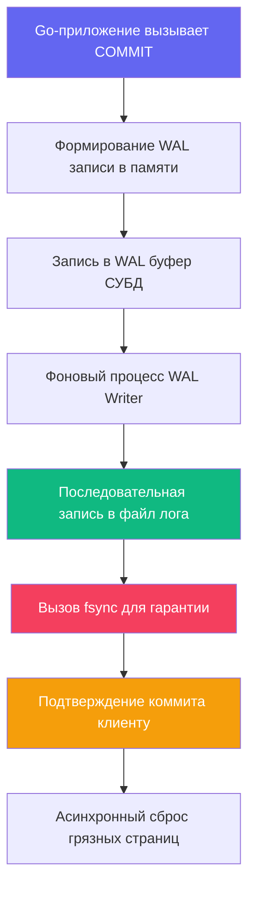

## Введение: Фундамент сохранности и атомарности

Журнал упреждающей записи (Write-Ahead Log, WAL) — это критический инженерный механизм, обеспечивающий две фундаментальные буквы из акронима ACID: **Atomicity** (Атомарность) и **Durability** (Долговечность). Если [[7. MVCC. Multi Version Concurrency Control]] объясняет, как транзакции видят друг друга в оперативной памяти без блокировок, то WAL гарантирует, что зафиксированные изменения не исчезнут при аварийном отключении электропитания, падении процесса СУБД или сбое файловой системы ядра Linux.

Для архитектора бэкенда понимание WAL — это не отвлеченная теория системного администрирования, а практическая основа проектирования высоконадежных систем и тонкой настройки производительности. Знание того, как СУБД сбрасывает байты на физический накопитель, позволяет:
* Осознанно балансировать между скоростью ответа (`latency`) и гарантией сохранности данных.
* Писать код на Go, который минимизирует накладные расходы на дисковый ввод-вывод через группировку операций.
* Предсказывать поведение базы при аномальных нагрузках, репликации и восстановлении после сбоев [[10. Recovery после сбоя]].



---

## Фундаментальный принцип: Лог раньше данных

Правило WAL звучит предельно строго и категорично: **любое изменение страницы данных должно быть записано в журнал на устойчивом носителе до того, как изменённая страница попадёт в основное хранилище**.

Почему эта архитектура столь эффективна?
1. При выполнении оператора `UPDATE` СУБД не пишет немедленно в файлы таблиц на диске. Вместо этого формируется предельно компактная бинарная запись лога: «по адресу `Page 402, Slot 15` заменить поле `balance` с `100` на `90`».
2. Эта запись падает в кольцевой `WAL Buffer` в разделяемой памяти (`shared memory`), а затем сбрасывается на диск.
3. Только после получения подтверждения физической записи на диск клиенту возвращается успешный статус фиксации (`COMMIT`).
4. Сама изменённая страница данных («грязная страница») спокойно остается в оперативной памяти (`Shared Buffer` или `Buffer Pool`) и будет сброшена на диск значительно позже, фоновым процессом Checkpointer или BgWriter.

Этот элегантный прием превращает случайную запись данных (Random I/O) в строго последовательную запись лога (Sequential I/O). А последовательная запись на 1-2 порядка быстрее случайной как на магнитных HDD, так и на современных флеш-накопителях NVMe SSD.

> [!info] Под капотом
> В структуре каждой страницы данных (8 КБ в PostgreSQL, 16 КБ в InnoDB) есть заголовок, содержащий поле `pd_lsn` (или аналог). При загрузке страницы в память СУБД сравнивает её `pd_lsn` с `LSN` записи в журнале. Если `LSN` в логе больше — значит, страница устарела, и при восстановлении необходимо «проиграть» (REDO) все записи лога для этой страницы. Это гарантирует идемпотентность восстановления: повторное применение лога к уже восстановленной странице не сломает данные.

---

## Архитектура и хранение под капотом

Журнал реализуется не как один бесконечный файл, а как кольцевой буфер сегментов фиксированного размера (обычно 16 МБ в PostgreSQL или десятки мегабайт в InnoDB).

1. **LSN (Log Sequence Number)**: 64-битный монотонно растущий счётчик. Каждый байт в журнале имеет свой уникальный адрес. Коммит транзакции всегда привязан к конкретному `commit_lsn`.
2. **Сегменты WAL**: Файлы вида `000000010000000A0000002D`. Когда текущий сегмент заполняется, СУБД переходит к следующему. Старые сегменты переиспользуются (перезаписываются с начала), если их содержимое уже сохранено на основных данных или отправлено репликам.
3. **Checkpoint**: Периодически СУБД выполняет контрольную точку. В этот момент все «грязные» страницы до определённого `LSN` принудительно сбрасываются на диск, а в журнале ставится метка. Это позволяет отрезать и удалить старые сегменты лога, которые больше не нужны для восстановления. Подробнее об этом механизме — в статье [[9. Checkpointing]].

> [!warning] Ловушка / Gotcha
> Если ваша база генерирует больше лога, чем может обработать архиватор или реплика, сегменты начнут накапливаться на диске. Это называется **WAL bloat**. В PostgreSQL это настраивается через `wal_keep_size`. При достижении лимита дискового пространства СУБД аварийно останавливается, так как не может гарантировать `Durability`. Мониторьте размер директории `pg_wal` или `innodb_log` в продакшене.

---

## Механическая симпатия: От буфера ОС до NAND ячеек

Реализация WAL напрямую зависит от взаимодействия ядра операционной системы и физических дисковых контроллеров.

### Цена `fsync()` и системных вызовов

Гарантия сохранности обеспечивается системным вызовом `fsync()`. Он заставляет ядро Linux принудительно сбросить страницы из своего `page cache` на физический контроллер накопителя:
* **Стоимость**: На современных серверных NVMe SSD вызов занимает от 100 до 500 микросекунд. На традиционных SATA SSD или магнитных HDD — от 2 до 10 миллисекунд.
* **Контекст выполнения**: При `fsync()` ядро блокирует вызывающий процесс, переводит тред в состояние `TASK_UNINTERRUPTIBLE`, отправляет команду контроллеру диска и ждет аппаратного прерывания. Если ваш Go-сервис ждет завершения коммита, горутина паркуется, а TCP-соединение из пула остается заблокированным.

### Групповой коммит (Group Commit)

Чтобы не платить полную цену `fsync()` за каждую транзакцию, СУБД использует групповой коммит:
1. Несколько транзакций, завершающихся в одно и то же микросекундное окно, выстраиваются в очередь ожидания.
2. Фоновый процесс (`WAL Writer`) сбрасывает накопленный буфер на диск **одним совместным вызовом `fsync()`**.
3. При аппаратном подтверждении запись пробуждает все транзакции пачки, возвращая им статус успеха.

Это позволяет масштабировать пропускную способность коммитов с ростом параллельной нагрузки практически линейно.

### Аппаратная ложь (Hardware Write Cache)

Многие потребительские SSD и недорогие RAID-контроллеры агрессивно кэшируют операции записи в собственной энергозависимой DRAM-памяти. Они рапортуют операционной системе об успешном завершении `fsync()` до того, как биты физически легли в ячейки кремния. При внезапном обесточивании такие данные бесследно испаряются, разрушая гарантию `Durability`.

> [!info] Под капотом
> Для настоящих гарантий требуется:
> 1. Диски с поддержкой `FUA` (Force Unit Access) и `PLP` (Power-Loss Protection).
> 2. В PostgreSQL: `wal_sync_method = open_datasync` или `fdatasync`.
> 3. В Go-конфигурации пула БД: настройка `synchronous_commit` с учётом репликации, а не только локального диска.

---

## Практика в Go: Управление надёжностью и скоростью

В стандартной библиотеке Go `database/sql` вы не управляете WAL напрямую, но можете влиять на его поведение через транзакционные инструкции.

### Паттерн: Снижение нагрузки для некритичных данных

Для второстепенных логов, кликстрима, метрик или временных кэшей можно осознанно ослабить гарантию долговечности, разрешив СУБД подтверждать коммит без ожидания завершения `fsync()`. Это повышает пропускную способность транзакций в 2–5 раз:

```go
func InsertMetricsBatch(ctx context.Context, db *sql.DB, metrics []Metric) error {
    tx, err := db.BeginTx(ctx, nil)
    if err != nil {
        return fmt.Errorf("begin tx: %w", err)
    }
    defer func() { _ = tx.Rollback() }()

    // Отключаем ожидание fsync только для этой транзакции
    _, err = tx.ExecContext(ctx, "SET LOCAL synchronous_commit TO OFF")
    if err != nil {
        return fmt.Errorf("set sync: %w", err)
    }

    stmt, err := tx.PrepareContext(ctx, 
        "INSERT INTO metrics (name, value, ts) VALUES ($1, $2, $3)")
    if err != nil {
        return fmt.Errorf("prepare: %w", err)
    }
    defer stmt.Close()

    for _, m := range metrics {
        _, err = stmt.ExecContext(ctx, m.Name, m.Value, m.Timestamp)
        if err != nil {
            return fmt.Errorf("exec insert: %w", err)
        }
    }
    return tx.Commit()
}
```
Инструкция `SET LOCAL` действует строго в границах текущей транзакции и автоматически аннулируется после `COMMIT` или `ROLLBACK`, не загрязняя настройки сессии в пуле соединений.

### Паттерн: Максимизация группового коммита

Хаотичные одиночные вставки вынуждают `WAL Writer` постоянно дергать системный вызов `fsync()`. Всегда группируйте логически связанные операции в общий транзакционный блок:

```go
// ПЛОХО: 1000 отдельных транзакций = 1000 вызовов fsync
for _, item := range items {
    db.ExecContext(ctx, "INSERT INTO logs ...", item)
}

// ХОРОШО: 1 транзакция = 1 групповой fsync (или близкий к нему)
tx, _ := db.BeginTx(ctx, nil)
for _, item := range items {
    tx.ExecContext(ctx, "INSERT INTO logs ...", item)
}
tx.Commit()
```

> [!tip] Собеседование
> **Вопрос:** Почему `WAL` пишется последовательно, а данные — случайно? Как это влияет на износ диска?
> **Ответ:** Логи всегда добавляются в конец текущего сегмента. Это линейный доступ к блокам диска, что минимизирует время поиска головки (HDD) и выравнивание износа (SSD). Грязные страницы сбрасываются асинхронно в случайные места файла данных, что создаёт высокий `random write IOPS`. Именно поэтому замена `fsync()` на `fdatasync` (синхронизация только данных, без метаданных) или использование быстрых NVMe критична для транзакционных нагрузок.

---

## Связь с восстановлением и репликацией

WAL — это не только механизм атомарности. Это единственный источник истины для:
* **Crash Recovery**: При старте после сбоя СУБД читает последний `checkpoint`, находит все сегменты лога новее него и последовательно применяет записи к страницам данных. Это называется REDO фаза.
* **Репликации**: В PostgreSQL (`WAL Streaming`) и MySQL (`Binlog`) реплики получают те же самые записи лога и применяют их локально. Это физическая репликация на уровне байт, а не SQL-запросов, что гарантирует бит-в-бит идентичность данных.

Если вы настраиваете синхронную репликацию (`synchronous_commit = remote_apply`), `COMMIT` в Go будет ждать, пока запись лога не упадёт на диск **и** ведущей, и ведомой ноды. Это увеличивает латентность на величину сетевого RTT, но гарантирует `Durability` даже при полном падении мастера.

---

## Итог

1. **Принцип**: Сначала лог, потом данные. Это превращает случайные записи в последовательные.
2. **Структура**: LSN, сегменты, кольцевой буфер. Лог хранит минимальные инструкции для восстановления состояния (`REDO`/`UNDO`).
3. **Производительность**: Групповой коммит снижает стоимость `fsync()`. Настройка `synchronous_commit` позволяет точечно балансировать между скоростью и надёжностью.
4. **Железо**: `fsync()` дорог, зависит от контроллера диска и кэша ОС. Используйте `PLP`-диски для критичных данных.
5. **В Go**: Объединяйте операции в транзакции, используйте `SET LOCAL` для ослабления гарантий там, где это допустимо, следите за размером `pg_wal`.

WAL обеспечивает надёжность, но бесконечный рост лога непрактичен. СУБД должна периодически сбрасывать накопленные в памяти изменения на диск и отрезать старые сегменты. Как именно происходит этот процесс согласования памяти и диска, мы разберём в следующей статье: [[9. Checkpointing]].
