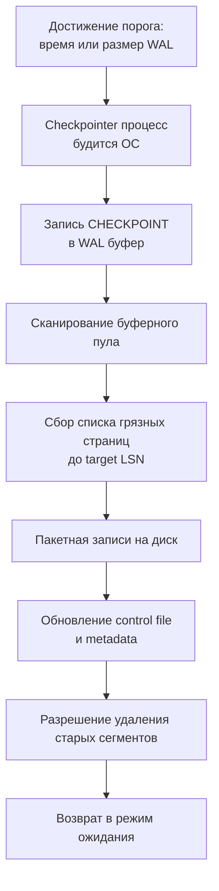

## Введение: Мост между памятью и диском

Журнал упреждающей записи (WAL) безупречно гарантирует атомарность и долговечность, но он принципиально не рассчитан на бесконечное хранение истории всех транзакций мира. Если бы СУБД только дописывала новые байты в конец лога и никогда не выгружала накопившиеся в оперативной памяти модифицированные страницы на физический диск, свободное дисковое пространство иссякло бы за считанные часы, а время аварийного восстановления после перезагрузки сервера растянулось бы на дни.

**Контрольная точка (Checkpoint)** — это жизненно важный механизм периодической синхронизации, который решает три ключевые инженерные задачи:
1. Фиксирует в журнале WAL маркер абсолютной согласованности данных.
2. Принудительно вытесняет «грязные» (измененные) страницы данных из буферного пула в постоянные файлы таблиц на накопителе.
3. Позволяет ядру СУБД безопасно удалить или переиспользовать устаревшие сегменты WAL, чьи данные уже гарантированно лежат на диске.

Для инженера уровня Senior/Lead глубокое понимание чекпоинтов критично, потому что этот процесс напрямую определяет предсказуемость задержек (Tail Latency), износ ячеек серверных SSD и целевое время восстановления сервиса (Recovery Time Objective, RTO). В этой лекции мы разберем механику контрольных точек, их влияние на подсистему ввода-вывода и кэш-линии CPU, а также покажем, как мониторить и настраивать этот процесс в реальных Go-приложениях.



---

## Механика: Как создаётся контрольная точка

Процесс создания чекпоинта строго детерминирован и состоит из нескольких последовательных фаз:

1. **Триггер события:** Контрольная точка инициируется по таймеру (`checkpoint_timeout`), по накопленному объёму WAL (`max_wal_size`) или по явной команде инженера (`CHECKPOINT`).
2. **Фиксация LSN:** В журнал упреждающей записи помещается специальная запись `XLOG_CHECKPOINT_ONLINE`, фиксирующая текущий `redo_lsn` — минимальную точку в логе, с которой потребуется начинать процедуру аварийного восстановления.
3. **Сканирование буфера:** Фоновый процесс (`checkpointer` в PostgreSQL или фоновый мастер-тред в InnoDB) обходит страницы разделяемой памяти, выявляет все блоки, где `LSN > checkpoint_lsn`, и формирует пакетную очередь на сброс.
4. **Пакетный сброс:** Измененные страницы выгружаются на диск. Чтобы не обрушить на контроллер накопителя лавину случайной записи (I/O Spike), СУБД растягивает процесс во времени, ориентируясь на параметр `checkpoint_completion_target`.
5. **Завершение:** Когда все страницы физически легли на диск, в журнал пишется маркер `XLOG_CHECKPOINT_DONE`. Контрольный файл СУБД (`global/pg_control`) обновляется, перенося границу безопасной очистки сегментов лога вперед.

> [!info] Под капотом
> В PostgreSQL за это отвечает выделенный процесс `checkpointer`, который общается с ядром ОС через сигналы и разделяемую память. В MySQL/InnoDB процесс встроен в главный тред (`srv_master_thread`), который циклически вызывает `flush_buffer_pool()`. Разница в архитектуре влияет на детерминизм: в PG вы можете точно настроить расписание, в InnoDB оно более эвристическое и привязано к активности пула.

---

## Механическая симпатия: Влияние на диск, кэш и латентность

Чекпоинты — один из самых ресурсоемких фоновых процессов СУБД. Ошибки в его конфигурации превращают ровную работу сервиса в мучительные «пилы» на графиках задержек.

### Дисковый I/O и выравнивание износа

При выгрузке десятков тысяч страниц движок базы данных генерирует интенсивный поток случайной записи (`random write`). 
* На магнитных HDD это вызывает механическое перемещение головок позиционера.
* На твердотельных SSD активизируются микроконтроллерные алгоритмы трансляции адресов (Flash Translation Layer, FTL) и циклы выравнивания износа (Wear Leveling). 

Если чекпоинты срабатывают слишком часто, контроллер SSD перегружается фоновым стиранием блоков, что приводит к деградации «хвостовой» латентности (`tail latency` p99/p99.9) пользовательских запросов.

### Кэш-линии CPU и предвыборка

Процедура сканирования буферного пула на предмет грязных страниц — классический источник промахов мимо кэша процессора (`cache misses`). 
Дескрипторы страниц (`BufferDesc` в PostgreSQL или `buf_block_t` в InnoDB) распределены по гигабайтам разделяемой памяти:
* Проход по ним вытесняет пользовательские горячие данные из кэша `L3` CPU.
* Аппаратный предвыборщик инструкций (`prefetcher`) теряет эффективность из-за хаотичного расположения страниц в оперативной памяти.
* Конкуренцию за шину памяти с основными процессами `backend`, что может увеличить время выполнения `SELECT/UPDATE` на 10–20% в момент чекпоинта.

### Влияние на latency Go-сервиса

Когда СУБД сбрасывает страницы на диск, она конкурирует за дисковые очереди (`I/O scheduler`). Если вы используете `direct I/O` или высоконагруженную базу с ограниченным `iops` (например, облачные тома), пользовательские транзакции начинают стоять в очереди `blkio`. В Go-сервисе это проявляется внезапным взлетом времени ожидания в `QueryRowContext` и `ExecContext`, даже если загрузка процессора базы данных далека от 100%.

---

## Стратегии сглаживания: От шторма к потоку

Чтобы избежать разрушительных всплесков нагрузки на дисковую подсистему, современные СУБД используют два скоординированных механизма:

1. **Фоновая запись (`bgwriter`):** Специальный фоновый процесс непрерывно и плавно выталкивает небольшие порции грязных страниц в операционную систему, заблаговременно освобождая буферы для новых запросов и облегчая задачу процесса `checkpointer`.
2. **Целевое время завершения (`checkpoint_completion_target`):** Движок не сбрасывает страницы с максимальной яростью в первую секунду. Он берет заданную долю интервала (обычно 0.9, то есть 90% времени от `checkpoint_timeout`) и равномерно распределяет дисковый ввод-вывод на протяжении всего интервала. Это превращает пиковый шторм ввода-вывода в предсказуемый и спокойный ламинарный поток.

> [!warning] Ловушка / Gotcha
> Установка `checkpoint_timeout` слишком большим (например, 24 часа) кажется полезной для снижения I/O, но это ловушка. При сбое СУБД придётся проигрывать гигантский объём WAL с последней точки. Время восстановления (RTO) может превысить допустимые 5-10 минут, что приведёт к длительному простою сервиса. Оптимальный баланс: 10-15 минут или объём 1-2 ГБ лога.

---

## Практика в Go: Мониторинг и влияние приложения

Разработчик бэкенда на Go не настраивает конфигурационные файлы СУБД напрямую, но архитектура приложения кардинально влияет на то, как часто и насколько тяжело базе приходится сбрасывать данные на диск.

### 1. Пакетные операции и `dirty ratio`

Неконтролируемые потоки массовых вставок (`INSERT` в циклах без пауз или огромные пакеты `COPY`) мгновенно забивают оперативную память грязными страницами, вынуждая СУБД запускать внеплановые чекпоинты по превышению квоты `max_wal_size`.

```go
// Оптимизация: явное ограничение размера пакета
// вместо бесконечного цикла, который может спровоцировать чекпоинтный шторм
const batchSize = 1000
for i := 0; i < len(records); i += batchSize {
    end := i + batchSize
    if end > len(records) {
        end = len(records)
    }
    batch := records[i:end]
    
    tx, err := db.BeginTx(ctx, nil)
    if err != nil {
        return fmt.Errorf("begin batch tx: %w", err)
    }
    if _, err := tx.ExecContext(ctx, "COPY logs FROM STDIN"); err != nil {
        _ = tx.Rollback()
        return fmt.Errorf("copy batch: %w", err)
    }
    if err := tx.Commit(); err != nil {
        return fmt.Errorf("commit batch: %w", err)
    }
}
```

### 2. Мониторинг через `pg_stat_bgwriter`

В продакшене критично отслеживать соотношение запланированных и принудительных контрольных точек. Если база постоянно сбрасывает данные по превышению лимита лога (`checkpoints_req`), значит, дисковая подсистема испытывает хронический стресс.

```go
type CheckpointStats struct {
    Timed     int64 `db:"checkpoints_timed"`
    Req       int64 `db:"checkpoints_req"`
    Buffers   int64 `db:"buffers_checkpoint"`
}

func GetCheckpointMetrics(ctx context.Context, db *sql.DB) (CheckpointStats, error) {
    var stats CheckpointStats
    err := db.QueryRowContext(ctx, `
        SELECT checkpoints_timed, checkpoints_req, buffers_checkpoint 
        FROM pg_stat_bgwriter
    `).Scan(&stats.Timed, &stats.Req, &stats.Buffers)
    if err != nil {
        return CheckpointStats{}, fmt.Errorf("query bgwriter stats: %w", err)
    }
    return stats, nil
}
```

Анализируйте соотношение: если доля внеплановых чекпоинтов `Req / (Timed + Req) > 30%`, необходимо либо увеличить параметр `max_wal_size`, либо оптимизировать объемы и частоту пакетных записей на стороне сервиса.

> [!tip] Собеседование
> **Вопрос:** Чем `checkpoint` отличается от `fsync()` при коммите транзакции?
> **Ответ:** `fsync()` при коммите гарантирует сохранность только конкретной транзакции (её записей в WAL). Чекпоинт гарантирует сохранность самих изменённых страниц данных на диске и позволяет отрезать старые сегменты лога. Коммит может происходить тысячи раз в секунду, чекпоинт — раз в 5-15 минут. Без чекпоинтов база не смогла бы ограничить время восстановления после сбоя.

---

## Архитектурные компромиссы в облачных средах

В современных облачных средах (AWS RDS, GCP Cloud SQL, managed PostgreSQL) доступ к файловой системе и параметрам `checkpoint_timeout` часто ограничен провайдером.

1. **IOPS-лимиты:** Если база упирается в квоту `burst balance` или `max IOPS`, чекпоинт будет выполняться крайне медленно, блокируя очистку лога. Это может привести к аварийной остановке СУБД с ошибкой `PANIC: could not write to WAL because of disk space`.
2. **Решение на уровне Go:** Реализуйте в коде паттерн обратного давления (**backpressure**). Если телеметрия показывает рост очереди записи (`pending_writes`), временно притормаживайте фоновые пакетные вставки или переключайтесь на буферизацию в очередях, давая СУБД возможность завершить контрольную точку без стресса.

---

## Итог

1. **Назначение**: Чекпоинт синхронизирует буферный пул с диском, ограничивает размер WAL и сокращает время восстановления после сбоя.
2. **Механика**: Запись маркера в лог → сканирование пула → пакетный сброс грязных страниц → обновление контрольного файла.
3. **Железо**: Вызывает случайные записи, конкурирует за шину памяти и дисковые очереди. Сглаживание через `completion_target` и `bgwriter` критично для стабильной латентности.
4. **В Go**: Пакетные вставки ускоряют срабатывание чекпоинтов. Мониторьте `checkpoints_req` через `pg_stat_bgwriter`, балансируйте размер пакетов и учитывайте квоты IOPS в облаках.
5. **Настройка**: Не гонитесь за редкими чекпоинтами. 10-15 минут или 1-2 ГБ WAL — золотая середина между производительностью и временем восстановления.

Понимание того, как СУБД согласовывает память и диск, подводит нас к финальной части жизненного цикла транзакции: что происходит, когда питание пропадает, а диск остаётся в неизвестном состоянии. В следующей статье мы детально разберём механизмы автоматического восстановления данных: [[10. Recovery после сбоя]].
