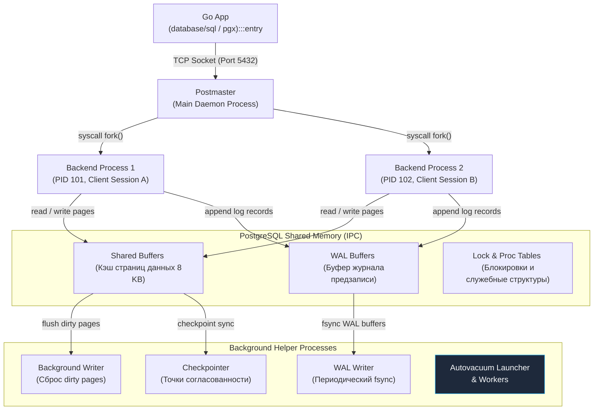
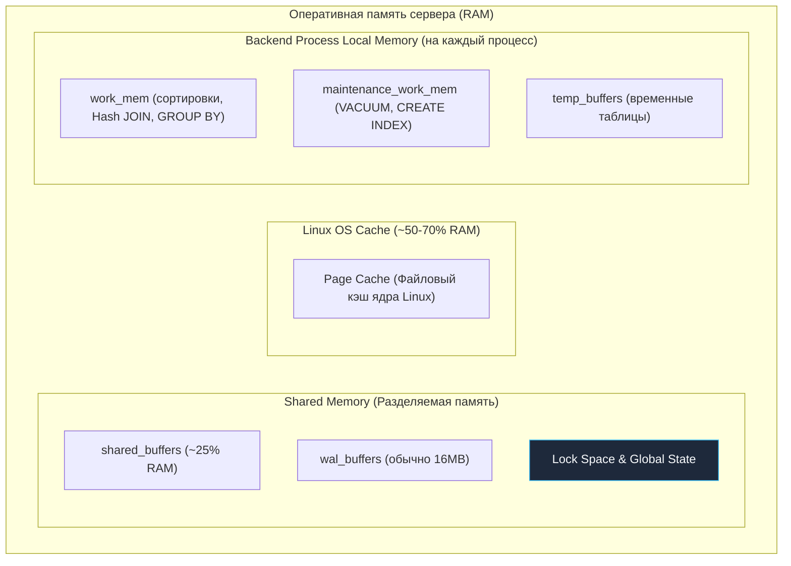
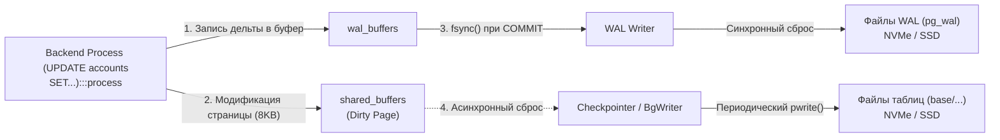
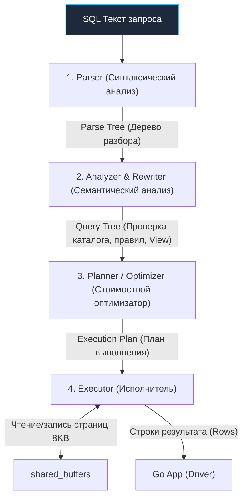

В отличие от вашего приложения на Go, где сотни тысяч горутин легковесно мультиплексируются на несколько системных потоков ОС силами планировщика рантайма (модель G-M-P), или от MySQL, где традиционно применяется многопоточная архитектура (thread-per-connection), PostgreSQL исторически пошел по бескомпромиссно надежному пути **Process-Per-Connection (выделенный процесс на каждое клиентское соединение)**.

Для бэкенд-инженера это фундаментальное архитектурное решение диктует жесткие правила игры: то, как мы настраиваем пулинг соединений в Go, как СУБД утилизирует оперативную память и почему тысячи наивных коннектов способны поставить сервер базы данных на колени быстрее, чем самые неоптимальные аналитические запросы.

---

## Process-Per-Connection: Анатомия запуска и изоляция

PostgreSQL принципиально не использует потоки выполнения (threads) внутри своих рабочих обработчиков. Вся его архитектура опирается на классические Unix-процессы и механизмы разделяемой памяти (Shared Memory IPC). 

Когда сервер базы данных инициализируется, операционная система запускает главный процесс — **Postmaster** (в современных версиях исполняемый файл называется просто `postgres`). Он открывает сетевой сокет, слушает заданный TCP-порт (по умолчанию 5432) и ожидает входящих клиентских подключений.

Когда ваше Go-приложение вызывает `sql.Open()`, инициализирует пул через `pgx` или выполняет `db.Query()`, происходит следующий каскад событий:

1. **Postmaster** принимает входящее TCP-соединение через системный вызов `accept()`.
2. Postmaster совершает системный вызов `fork()`, порождая точную копию своего адресного пространства.
3. Дочерний процесс превращается в **Backend Process** (индивидуальный серверный рабочий процесс с собственным PID), перехватывает файловый дескриптор клиентского сокета и берет на себя всю дальнейшую обработку SQL-команд данной сессии.
4. Этот процесс живет ровно столько, сколько активно данное сетевое соединение, после чего завершается (`exit()`), отдавая ресурсы операционной системе.

> [!info] Под капотом: Почему независимые процессы, а не потоки?
> Главная причина этого выбора, сделанного еще архитекторами проекта POSTGRES в Беркли, — **абсолютная надежность и изоляция памяти**. 
> В традиционной многопоточной C/C++ программе ошибка с "висячим" указателем (dangling pointer), повреждение памяти или сегфолт (`SIGSEGV`) в одном потоке немедленно крашат весь процесс целиком, унося с собой подключения всех пользователей. 
> В архитектуре PostgreSQL, если какой-то Backend Process падает из-за критического сбоя в стороннем C-расширении или аппаратной ошибки, погибает **исключительно этот изолированный процесс**. Сетевое соединение одного клиента аварийно обрывается, но сам сервер, Postmaster и сотни остальных клиентов продолжают функционировать без единой паузы. Ядро Linux самостоятельно и мгновенно очищает виртуальную память и закрывает дескрипторы погибшего процесса.

Однако за надежность и простоту отладки приходится платить существенную системную цену:
* **Накладные расходы `fork()`:** Системный вызов `fork()` требует от ядра ОС дублирования таблиц страниц памяти (Page Tables) процесса. Даже с оптимизацией Copy-On-Write (CoW) создание сотен процессов в секунду генерирует огромную нагрузку на подсистему управления памятью Linux.
* **Переключение контекста (Context Switching):** Переключение контекста между независимыми процессами (смена таблиц страниц в регистре `CR3`, сброс TLB-кэша процессора) стоит в разы дороже переключения потоков, и несоизмеримо дороже кооперативного планирования горутин Go в пространстве пользователя.
* **Базовый overhead памяти:** Каждый Backend Process резервирует индивидуальный стек, служебные структуры дескрипторов и локальные буферы (от 5–10 МБ оперативной памяти просто по факту своего существования).

> [!tip] Собеседование
> **Вопрос:** Почему при входящей нагрузке веб-сервиса в 10 000 RPS категорически нельзя открыть 10 000 параллельных соединений из Go напрямую к PostgreSQL?
> **Ответ:** 10 000 активных TCP-подключений трансформируются в 10 000 тяжелых процессов ОС Linux. Планировщик CFS/EEVDF ядра Linux захлебнется в попытках распределить кванты процессорного времени между ними (эффект CPU Thrashing). Более 80% времени процессора будет сгорать впустую на переключениях контекста и инвалидации кэшей процессора (L1/L2/L3), а полезная работа остановится. Сервер быстро исчерпает свободную RAM и упадет по OOM (Out Of Memory). Именно поэтому перед PostgreSQL всегда устанавливают пул соединений: встроенный в приложение [[2. Connection pool]] (ограниченный формулой `2 * CPU_Cores + Disk_Spindle_Depth`) либо внешний транзакционный прокси вроде **PgBouncer** или **Odyssey**.

---

## Архитектура памяти PostgreSQL

Вся оперативная память экземпляра PostgreSQL строго разделена на две изолированные категории: **Локальная память процессов** и **Разделяемая память инсталляции**.

### 1. Локальная память процесса (Local Memory)
Локальная память динамически выделяется внутри адресного пространства конкретного Backend-процесса при выполнении текущего запроса и мгновенно возвращается системе после завершения операции.

* **`work_mem`**: Критически важный параметр настройки. Это объем памяти, выделяемый для внутренних операций сортировки (`ORDER BY`), построения хэш-таблиц для соединений (`Hash JOIN`) и группировок (`GROUP BY`).
    * *Mechanical Sympathy:* Обратите внимание: `work_mem` выделяется **не на запрос, а на каждый отдельный узел плана выполнения**! Запрос с тремя сложными JOIN и двумя `ORDER BY` может затребовать `5 * work_mem`.
    * Если размер промежуточных данных превышает лимит `work_mem`, PostgreSQL не падает с ошибкой памяти. Он незаметно переключается на **сброс данных во временные файлы на диске (spill to disk)**. В результате производительность запроса драматически обваливается на порядки из-за дискового ввода-вывода. При анализе медленных запросов через `EXPLAIN ANALYZE` ищите ключевую фразу: `external merge Disk: ...kB`.
* **`maintenance_work_mem`**: Память для сервисных административных процедур: построения индексов (`CREATE INDEX`), изменения схем (`ALTER TABLE`) и фоновой сборки мусора (механизма очистки мертвых версий строк, подробно разобранного в [[10. VACUUM, ANALYZE]]).
* **`temp_buffers`**: Локальный кэш страниц для временных пользовательских таблиц (`CREATE TEMP TABLE`), не требующих координации с другими процессами.

### 2. Разделяемая память (Shared Memory)
Единый сегмент физической памяти, выделяемый Postmaster'ом на этапе инициализации СУБД (через POSIX `mmap` или System V `shmget`) и разделяемый между всеми дочерними бэкендами и фоновыми демонами.

* **`shared_buffers`**: Ключевой кэш страниц с данными (стандартный размер страницы — 8 КБ). PostgreSQL принципиально не читает данные напрямую с блочного устройства при обработке запросов. Сервер запрашивает блок с диска, помещает его в `shared_buffers`, и лишь оттуда отдает строки клиентскому запросу. Рекомендуемое значение для большинства серверов — около **25% от общего объема RAM**.
* **`wal_buffers`**: Буфер страниц журнала предзаписи ([[8. WAL. Write Ahead Log]]). Именно сюда помещаются дельты изменений перед тем, как они будут сброшены на постоянный носитель для обеспечения свойства Durability (буква D в гарантиях ACID).

> [!warning] Ловушка / Gotcha: Двойное буферизирование (Double Buffering)
> Попытка выделить под `shared_buffers` 80–90% всей доступной памяти машины (по аналогии с MySQL и его `InnoDB Buffer Pool`) — **катастрофическая ошибка** конфигурации PostgreSQL.
> В отличие от многих энтерпрайз-СУБД, PostgreSQL исторически не открывает файлы данных с флагом `O_DIRECT` (прямой ввод/вывод в обход кэша ОС). Он всецело полагается на **Page Cache ядра Linux**.
> При чтении блок данных с диска сначала попадает в файловый кэш Linux, а затем копируется ядром в `shared_buffers` PostgreSQL. Это и называется *двойным буферизированием*. Оставшиеся 70–75% оперативной памяти жизненно необходимы операционной системе, чтобы кэшировать файлы базы данных!

---

## Фоновые процессы (Background Workers)

Чтобы пользовательские Backend-процессы не простаивали в ожидании завершения медленных дисковых операций записи, в ядре PostgreSQL функционирует пул специализированных фоновых демонов:

1. **Background Writer (BgWriter):**
   Непрерывно и плавно сканирует `shared_buffers` по кольцевому алгоритму, выявляя "грязные" (измененные) страницы и асинхронно записывая их на накопитель. Главная цель BgWriter — сделать так, чтобы новый серверный процесс, которому потребовалось загрузить страницу с диска, всегда находил готовый чистый слот в `shared_buffers` и не тратил время на вытеснение чужих грязных страниц.
2. **WAL Writer:**
   Периодически сбрасывает накопившиеся дельты из `wal_buffers` на диск, инициируя системный вызов `fsync()`. Гарантирует, что даже при внезапном обесточивании стойки с серверами зафиксированные транзакции не будут утеряны. Для оптимизации пропускной способности WAL Writer объединяет коммиты разных транзакций в группы (Group Commit).
3. **Checkpointer:**
   Выполняет процедуру контрольной точки (Checkpoint): раз в заданный период времени (или по накоплению объема WAL) сбрасывает на накопитель *абсолютно все* грязные страницы из `shared_buffers` и ставит в журнале специальную метку согласованности. Это позволяет ограничить время восстановления БД после аварии (Recovery Time Objective): при старте после сбоя рантайму достаточно проиграть WAL только от последней контрольной точки (подробнее в [[9. Checkpointing]]).
4. **Autovacuum Launcher & Workers:**
   Координирующий процесс и пул воркеров, которые в фоновом режиме инспектируют таблицы на скопление "мертвых" кортежей (dead tuples), оставшихся после операций `UPDATE` и `DELETE`, собирают мусор и актуализируют статистику для оптимизатора. Это жизненно необходимая часть многоверсионного контроля конкурентности ([[3. MVCC в PostgreSQL]]).

---

## Жизненный цикл SQL-запроса

Когда ваше Go-приложение отправляет в соединение байты строки `"SELECT * FROM users WHERE id = 1"`, внутри обслуживающего Backend-процесса запрос проходит классический многостадийный конвейер:

1. **Parser (Парсер):** Проверяет лексику и грамматику SQL-выражения, генерируя абстрактное синтаксическое дерево разбора (Parse Tree).
2. **Analyzer & Rewriter (Анализатор и модуль перезаписи):** Проверяет схему данных по системному каталогу (существуют ли таблица `users` и атрибут `id`, есть ли у пользователя права доступа). Применяет правила перезаписи (подставляет реальные таблицы вместо представлений `VIEW`).
3. **Planner / Optimizer (Планировщик / Оптимизатор):** Интеллектуальное ядро базы данных. Опираясь на математическую статистику распределения значений (гистограммы, селективность колонок), оптимизатор вычисляет стоимость сотен альтернативных путей извлечения данных (Sequential Scan, Index Scan, Bitmap Scan) и формирует оптимальный план выполнения с наименьшей оценочной стоимостью (Cost Based Optimizer, подробно в [[11. Cost based optimizer]]).
4. **Executor (Исполнитель):** Рекурсивно обходит узлы плана выполнения, запрашивает страницы у подсистемы `shared_buffers`, применяет предикаты фильтрации и возвращает готовые кортежи в сокет Go-клиенту.

---

## Памятка для Go-разработчика

Понимание процессной природы и архитектуры памяти PostgreSQL формирует зрелый инженерный подход к интеграции:

1. **Управление пулом соединений:** Всегда явно конфигурируйте `db.SetMaxOpenConns()`, `db.SetMaxIdleConns()` и `db.SetConnMaxLifetime()`. Допущение бесконечного роста пула подключений превратит сервер БД в полигон борьбы за процессорные кванты и память.
2. **Внешний пул при микросервисах:** Если ваш кластер масштабируется на 50 подов Kubernetes, и каждый под по умолчанию открывает пул из 20 соединений (в сумме 1 000 коннектов к БД), прямое подключение противопоказано. Обязательно внедряйте транзакционный пулер (**PgBouncer** или **Odyssey**), который будет мультиплексировать тысячи клиентских сессий в десятки реальных Backend-процессов PostgreSQL.
3. **Диагностика памяти запросов:** Если сложный аналитический запрос с сортировкой или хэш-соединением неожиданно проседает по времени отклика, проверьте `EXPLAIN (ANALYZE, BUFFERS)`. Обнаружение `Sort Method: external merge  Disk` свидетельствует о том, что процессу не хватило `work_mem` и запрос начал бомбардировать диск временными файлами.

Поняв, как процессы PostgreSQL взаимодействуют с операционной системой и распределяют оперативную память, мы готовы спуститься на уровень хранения и разобрать, как устроены страницы данных на диске. Об этом — в следующей лекции: [[2. Storage engine PostgreSQL]].