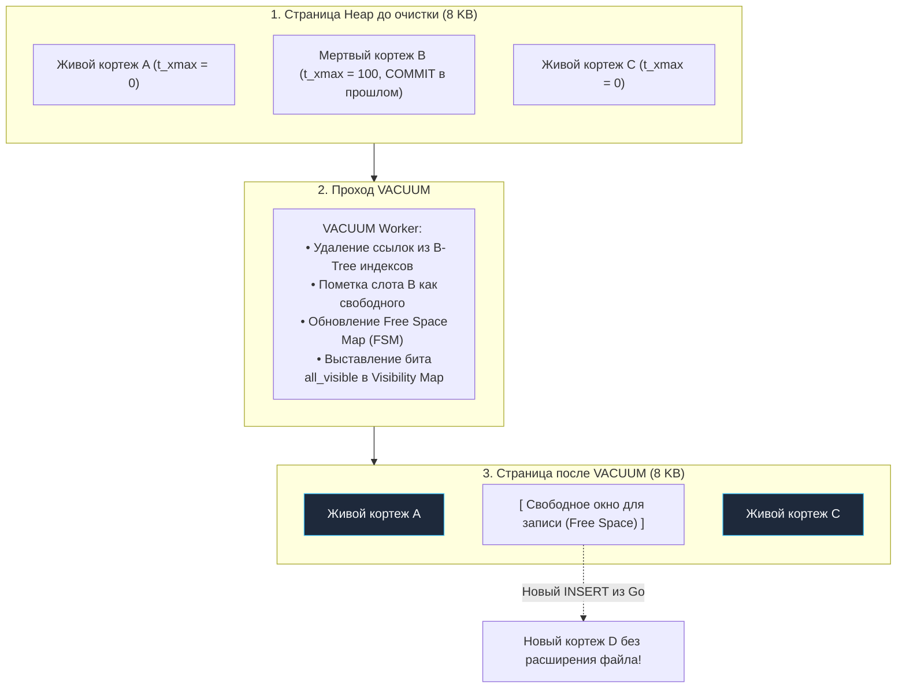
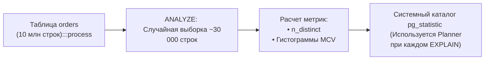

В лекции про многоверсионность [[3. MVCC в PostgreSQL]] мы столкнулись с фундаментальным архитектурным фактом: движок PostgreSQL никогда не модифицирует существующие данные «на месте» (in-place) и физически не стирает строки при вызове `DELETE`. Каждая операция обновления или удаления оставляет за собой «мертвый» кортеж (dead tuple), помеченный системным идентификатором транзакции `t_xmax`.

Если бы в архитектуре не было встроенного механизма непрерывной санитарной очистки, любая высоконагруженная база данных за считанные недели превратилась бы в гигантский мусорный полигон: полезные данные утонули бы в терабайтах мертвых версий, дисковое пространство исчерпалось, а эффективность кэша `shared_buffers` рухнула до нуля.

За поддержание физической чистоты страниц и математической зоркости планировщика отвечают две фундаментальные системные операции: **VACUUM** и **ANALYZE**. Для Go-разработчика понимание их внутренней механики — это граница, отделяющая стабильно работающий бэкенд от внезапного паралича продакшена посреди ночи.

---

## 1. VACUUM: Мусорщик в мире MVCC

**VACUUM** — это процесс, который сканирует таблицы и помечает место, занятое мертвыми строками, как свободное. 

Важно понимать: обычный `VACUUM` **не возвращает место операционной системе**. Он просто говорит PostgreSQL: *"Эти байты внутри 8-килобайтной страницы больше не нужны, сюда можно записать новый INSERT"*.



### Как физически работает конвейер VACUUM (пошагово)
1. **Сканирование Heap:** Воркер вакуума считывает страницы таблицы из `shared_buffers` или поднимает их с диска.
2. **Проверка горизонта транзакций:** Сверяясь с глобальным снимком активных транзакций, процесс выявляет мертвые кортежи, чей `t_xmax` гарантированно завершен и невидим ни для одной текущей или потенциальной сессии.
3. **Двухфазная очистка индексов:** Это критически важный шаг! Сначала вакуум собирает список адресов `CTID` мертвых строк в буфер `maintenance_work_mem`, обходит **все до единого индексы таблицы** (B-Tree, GIN, GiST) и вычищает из их листовых страниц указатели на эти мертвые кортежи.
4. **Очистка страниц Heap:** Только после того, как все ссылки из индексов гарантированно удалены, вакуум возвращается к страницам Heap и переводит слоты мертвых кортежей в статус свободного пространства.
5. **Обновление Free Space Map (FSM):** В специальный вспомогательный файл (`_fsm`) записывается точный объем свободного места на каждой странице, чтобы последующие операции `INSERT` мгновенно находили свободные блоки без линейного сканирования файлов.

---

### VACUUM FULL: Когда всё очень плохо

Существует специальная агрессивная форма очистки — команда `VACUUM FULL`. В отличие от обычного вакуума, она физически возвращает неиспользуемые байты операционной системе:
1. Создает **абсолютно новый файл таблицы** на диске.
2. Последовательно переносит в новый файл исключительно живые кортежи, упаковывая их максимально плотно без малейших зазоров.
3. С нуля перестраивает все индексы таблицы.
4. Физически удаляет старый раздутый файл, возвращая гигабайты пространства ОС.

> [!danger] Внимание: Смертоносный Exclusive Lock
> Команда `VACUUM FULL` захватывает жесткую исключительную блокировку таблицы — **AccessExclusiveLock**.  
> На все время выполнения операции (которое для терабайтной таблицы может растянуться на много часов) **запрещены любые параллельные операции, включая обычный `SELECT`**! Ваше Go-приложение намертво зависнет на попытке прочитать таблицу, а пул соединений исчерпается за секунды.  
> В современных промышленных системах `VACUUM FULL` под боевой нагрузкой практически никогда не вызывают вручную. Для дефрагментации таблиц "на лету" без блокировки читателей и писателей используют внешнюю утилиту **`pg_repack`**.

---

## 2. Autovacuum: Твой невидимый помощник

В современных версиях PostgreSQL администраторам редко приходится инициировать очистку вручную: за чистотой следит системный демон — **Autovacuum Launcher** и пул его дочерних воркеров.

Демон пробуждается раз в период времени, заданный параметром `autovacuum_naptime` (по умолчанию раз в 1 минуту), опрашивает статистику подсистемы сбора метрик и вычисляет, не пора ли запустить вакуум для конкретной таблицы.

> [!tip] Собеседование
> **Вопрос:** По какой математической формуле Autovacuum определяет, что наступил момент для очистки таблицы?
> **Ответ:** Запуск вакуума инициируется, когда число накопившихся мертвых кортежей превышает расчетный порог:
> $$\text{Порог запуска} = \text{autovacuum\_vacuum\_threshold} + (\text{autovacuum\_vacuum\_scale\_factor} \times \text{reltuples})$$
> * `autovacuum_vacuum_threshold`: Базовое минимальное количество мертвых строк (по умолчанию `50`).
> * `autovacuum_vacuum_scale_factor`: Доля изменений от общего числа строк в таблице `reltuples` (по умолчанию `0.2` или 20%).

### Mechanical Sympathy для Highload
Представьте таблицу на 100 миллионов строк. При стандартном коэффициенте `scale_factor = 0.2` Autovacuum запустится только тогда, когда в таблице накопится:
$$50 + (0.2 \times 100\,000\,000) \approx 20\,000\,000 \text{ мертвых строк!}$$
Накопление 20 миллионов мертвых строк означает чудовищное раздувание таблицы (Table Bloat), деградацию дискового ввода-вывода и засорение `shared_buffers`.  
В высоконагруженных проектах для тяжелых таблиц значение `scale_factor` принудительно снижают до **`0.01` (1%)** или даже `0.005` (0.5%), обеспечивая непрерывную, мягкую и незаметную для пользователей очистку.

---

## 3. ANALYZE: Глаза и математический компас планировщика

Если задача `VACUUM` — физическое освобождение дискового пространства внутри страниц, то миссия команды **ANALYZE** — обеспечение интеллектуальной работы планировщика запросов.

Как мы разбирали в [[9. Оптимизация PostgreSQL]], стоимостной оптимизатор принимает решение о выборе алгоритма (Index Scan, Bitmap Scan, Seq Scan, Hash Join, Merge Join) исключительно на базе **математической статистики**.  
Процесс **ANALYZE** инспектирует репрезентативную случайную выборку строк таблицы и рассчитывает:
* Общее число физических страниц и строк в таблице.
* **Selection Cardinality** (степень уникальности значений в каждом столбце — `n_distinct`).
* Список наиболее частых значений (Most Common Values, MCV) и их процентную частоту.
* Гистограммы квантилей распределения значений (Histogram Bounds).



### Почему актуальность статистики критична для Go-приложения?
Представьте таблицу задач `tasks` со столбцом `status`:
* 99% строк имеют статус `'COMPLETED'`.
* 1% строк имеют статус `'IN_PROGRESS'`.

Если статистика актуальна, то при выполнении запроса `SELECT * FROM tasks WHERE status = 'IN_PROGRESS'` планировщик безошибочно выберет точечный **Index Scan**, прочитав пару индексных страниц за 1 миллисекунду.  
Если же статистика устарела (например, база считает, что статусы распределены 50/50), оптимизатор решит, что индекс неэффективен, и запустит **Sequential Scan** по всей многогигабайтной таблице, превратив быстрый микросервисный запрос в катастрофическую блокировку ввода-вывода!

---

## 4. Защита целостности: Visibility Map и предотвращение Wraparound

Помимо базовой сборки мусора, Autovacuum выполняет две жизненно важные архитектурные функции, без которых надежное функционирование СУБД невозможно:

### 1. Актуализация карты видимости (Visibility Map)
Каждый раз, когда `VACUUM` обрабатывает страницу и убеждается, что на ней больше нет ни одного мертвого кортежа и незакоммиченных транзакций, он выставляет бит `all_visible` в файле Visibility Map.  
Как мы выяснили в [[4. Индексы в PostgreSQL]], именно этот бит позволяет планировщику применять сверхбыстрый **Index-Only Scan**, извлекая данные непосредственно из B-Tree индекса без единого обращения к диску за страницами Heap.

### 2. Заморозка транзакций (Freezing) и угроза Wraparound
Идентификаторы транзакций `xmin`/`xmax` имеют размер 32 бита (лимит около 4 миллиардов значений, закольцованных по модулю $2^{32}$). Если счетчик сделает полный оборот, старые транзакции окажутся «в будущем», и данные базы мгновенно исчезнут для всех правил видимости!  
Чтобы исключить эту катастрофу, вакуум регулярно выполняет процедуру **Freezing (Заморозку)**: он инспектирует старые строки и заменяет их `xmin` на фиксированный служебный маркер `FrozenTransactionId` (равный `2`), который навсегда закрепляет строку как видимую в абсолютном прошлом. Если Autovacuum не успевает за темпом генерации `xid`, PostgreSQL принудительно аварийно останавливается и переходит в режим read-only для спасения данных от переполнения.

---

## 5. Практические советы по тюнингу и конфигурированию

В высоконагруженных системах стандартная конфигурация Autovacuum требует осознанной калибровки:

1. **`maintenance_work_mem`**: Объем оперативной памяти, выделяемый воркеру вакуума для удержания буфера `CTID` мертвых строк при обходе индексов. Если памяти недостаточно, процессу придется совершать множественные проходы по тяжелым B-Tree деревьям. В промышленных серверах устанавливайте от **512 МБ до 2 ГБ**.
2. **`autovacuum_max_workers`**: По умолчанию равен `3`. Если в вашем кластере сотни активных таблиц с постоянными вставками и обновлениями, три воркера не справятся с нагрузкой. Увеличьте пул до **5–8 воркеров** (при наличии свободных ядер CPU).
3. **`autovacuum_vacuum_cost_limit`**: Ограничитель бюджета дискового ввода-вывода. По умолчанию вакуум делает паузы, чтобы не мешать пользовательским запросам. Если вакуум отстает от потока операций `UPDATE` из вашего Go-сервиса, увеличьте этот лимит (например, с 200 до 1000–2000 единиц) или снизьте задержку `autovacuum_vacuum_cost_delay`.

> [!warning] Ловушка / Gotcha: «Зависшие» транзакции блокируют очистку (Long-Running Transactions)
> Никакие тонкие настройки Autovacuum не помогут, если в вашем коде на Go есть транзакция, остающаяся открытой часами:
> ```go
> // АНТИПАТТЕРН: Открыли транзакцию и уснули / ушли в долгий сетевой запрос
> tx, _ := db.Begin()
> defer tx.Rollback()
> time.Sleep(2 * time.Hour) 
> ```
> Пока транзакция удерживает старый `xid`, **Autovacuum не имеет физического права удалить ни один мертвый кортеж**, модифицированный после ее старта. Одна «забытая» транзакция в сервисе на Go парализует очистку всего кластера и гарантированно раздует таблицы до отказа диска.

---

## Резюме для инженера

1. **VACUUM освобождает страницы изнутри:** Он не уменьшает размер файлов ОС, но открывает слоты для новых `INSERT` и `UPDATE`.
2. **ANALYZE питает планировщик:** Без актуальной статистики кардинальности и гистограмм распределения база неизбежно начнет деградировать на неоптимальных планах.
3. **Агрессивный Autovacuum:** Снижайте `scale_factor` на больших таблицах, чтобы не накапливать миллионы мертвых строк.
4. **Visibility Map и Freeze:** Регулярный вакуум делает возможным Index-Only Scan и предотвращает катастрофу Transaction ID Wraparound.
5. **Транзакционная гигиена в Go:** Строго контролируйте таймауты контекста и не допускайте долгоживущих открытых транзакций.

Мы завершили детальный разбор внутреннего устройства одиночного сервера PostgreSQL: от физического слоя страниц и MVCC до тонкостей планировщика и фоновой сборки мусора. Однако надежность критически важных информационных систем никогда не доверяется одной машине. В заключительной лекции раздела мы разберем, как объединять серверы в отказоустойчивые кластеры: [[11. Репликация в PostgreSQL]].