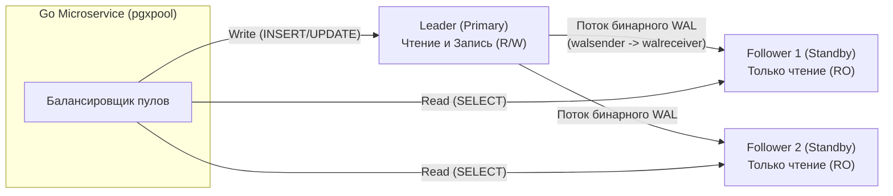
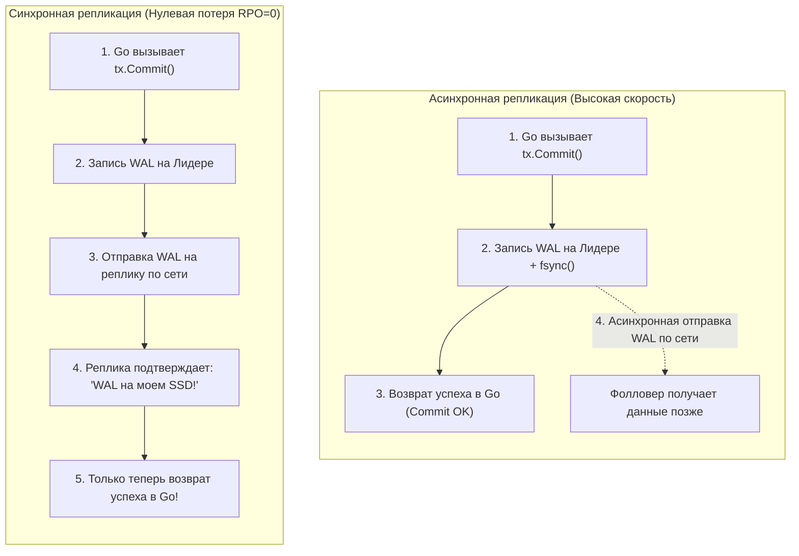

Завершая глубокое погружение во внутреннее устройство PostgreSQL, мы совершаем качественный переход: от механики работы одиночного сервера — к архитектуре распределенных, отказоустойчивых кластеров.

В современном промышленном бэкенде одиночный сервер базы данных — это классическая **единая точка отказа (Single Point of Failure, SPOF)**. Какой бы надежной ни была серверная платформа, физический диск может выйти из строя, оперативная память может пострадать от некорректируемой ошибки ECC, а экскаватор на улице может перерезать силовой кабель дата-центра. Если в вашей архитектуре есть лишь один узел БД, бизнес остановится в ту же секунду.

Механизм **Репликации (Replication)** решает две фундаментальные задачи распределенных систем:
1. **Высокая доступность (High Availability, HA):** Непрерывное поддержание актуальной копии данных на резервных узлах для мгновенного переключения трафика (**Failover**) в случае гибели Лидера.
2. **Масштабирование чтения (Read Scaling):** Возможность разгрузить основной узел, распределяя аналитические и тяжелые `SELECT`-запросы между пулом реплик.

---

## WAL: Физический фундамент репликации

Как мы выяснили в лекции [[8. WAL. Write Ahead Log]], ядро PostgreSQL фиксирует любое атомарное изменение сначала в журнале предзаписи (Write Ahead Log), и лишь затем модифицирует страницы данных в памяти `shared_buffers`. Этот упорядоченный, непрерывный поток бинарных дельт является безупречным «единым источником правды» для синхронизации удаленных узлов.

В PostgreSQL классическая модель репликации строится по принципу **Leader-Follower** (ранее называемая Master-Slave):
* **Лидер (Leader / Primary):** Единственный узел в кластере, принимающий операции изменения данных (`INSERT`, `UPDATE`, `DELETE`, DDL-миграции), а также запросы на чтение.
* **Фолловеры (Followers / Standby / Реплики):** Ведомые узлы, находящиеся в режиме «только для чтения» (Read-Only) и непрерывно догоняющие журнал изменений Лидера.

---

### 1. Физическая (Потоковая) репликация — Streaming Replication

Потоковая физическая репликация — это основной рабочий инструмент построения отказоустойчивых кластеров PostgreSQL. Лидер по специальному сетевому протоколу непрерывно транслирует бинарные страницы WAL на фолловеры, а фолловер применяет полученные байты к своим файлам данных в режиме постоянного наката восстановления (Recovery Mode).



* **Преимущества:**  
  * **Абсолютная надежность и идентичность:** Фолловер является побайтовой копией Лидера. Копируется абсолютно всё: системные каталоги, структуры B-Tree/GIN индексов, последовательности и временные таблицы.
  * **Минимальная нагрузка на CPU Лидера:** Лидеру не нужно пересчитывать SQL-запросы или транслировать данные — он просто пересылает готовые байты журнала предзаписи через фоновый процесс `walsender`.
* **Ограничения:**  
  * Невозможно реплицировать отдельную таблицу или схему — реплицируется строго весь кластер баз данных целиком.
  * Мажорные версии PostgreSQL на Лидере и Фолловерах обязаны строго совпадать (нельзя реплицировать с PG 14 на PG 16 из-за различий в физической структуре страниц).

---

## Синхронность vs Асинхронность: Фундаментальный компромисс

Выбор между синхронной и асинхронной репликацией — это классическая дилемма между абсолютной сохранностью данных и максимальной скоростью обработки запросов.



### Асинхронная репликация (Поведение по умолчанию)
Лидер подтверждает успешное завершение транзакции клиентскому Go-приложению немедленно после того, как сбросил WAL на свой локальный диск. Передача логов на фолловеры происходит асинхронно в фоне.
* **Производительность:** Максимальная. Сетевые задержки между серверами никак не влияют на время отклика `tx.Commit()`.
* **Риск потери данных:** При внезапной аппаратной гибели Лидера (сгорел процессор, отключилось питание) те транзакции, которые успели зафиксироваться локально, но еще не долетели по сети до реплики, **будут безвозвратно утеряны** (RPO > 0).

### Синхронная репликация
Лидер замораживает завершение транзакции до тех пор, пока хотя бы один фолловер не пришлет по сети сетевой пакет: *«Я принял эти LSN-байты и зафиксировал их на свой накопитель»*. Только после этого клиентское Go-приложение получает `nil` в ответ на вызов `tx.Commit()`.
* **Надежность:** Гарантируется нулевая потеря данных (Recovery Point Objective, RPO = 0).
* **Риск доступности:** Если сетевой канал между узлами начнет деградировать или фолловер зависнет, **любые пишущие транзакции на Лидере окажутся заблокированы**. База встанет колом.

> [!tip] Собеседование
> **Вопрос:** Как настроить репликацию в высоконагруженном кластере PostgreSQL, чтобы исключить потерю финансовых транзакций при аварии, но защитить кластер от паралича при падении одной из реплик?
> **Ответ:** Использовать синхронную репликацию с кворумным параметром `synchronous_standby_names`.  
> Например, директива `FIRST 1 (s1, s2, s3)` или `ANY 2 (s1, s2, s3)` инструктирует Лидер считать транзакцию закоммиченной, если подтверждение получено хотя бы от $N$ доступных реплик из пула. Если одна реплика упадет, Лидер продолжит обслуживать трафик с оставшимися узлами без деградации доступности.

---

## Логическая репликация (Logical Replication)

Начиная с версии PostgreSQL 10, в ядро был интегрирован механизм **Логической репликации**, функционирующий по архитектурному паттерну **Публикаций и Подписок (Publish / Subscribe)**.

Вместо пересылки сырых 8-килобайтных страниц накопителя, Лидер с помощью механизма логического декодирования (Logical Decoding) разбирает WAL-поток на высокоуровневые реляционные события: *«В таблицу `users` вставлен кортеж с полями `(id=1, email='a@b.com')`»*.

```sql
-- На узле-издателе (Publisher):
CREATE PUBLICATION pub_users FOR TABLE users, orders;

-- На узле-подписчике (Subscriber):
CREATE SUBSCRIPTION sub_users 
    CONNECTION 'host=leader_ip dbname=production user=replicator password=secret' 
    PUBLICATION pub_users;
```

**Где незаменима логическая репликация?**
1. **Бесшовный апгрейд между мажорными версиями:** Можно реплицировать данные с PostgreSQL 12 на новый инстанс с PostgreSQL 16 без длительного простоя (Zero-Downtime Upgrade).
2. **Выборочная репликация (Selective Replication):** Можно реплицировать не весь кластер, а лишь несколько публичных таблиц.
3. **Агрегация данных из микросервисов:** Сбор данных из десятков изолированных баз данных различных сервисов в единое аналитическое хранилище (DWH).
4. **Возможность записи на реплике:** На узле-подписчике можно локально создавать собственные таблицы и индексы.

---

## Проблемы эксплуатации

### 1. Задержка репликации (Replication Lag) и аномалия Read-Your-Own-Writes
В асинхронном кластере данные долетают до реплик с микросекундной или секундной задержкой.  
В Go-сервисе это порождает классический баг:
1. Пользователь обновляет свой профиль (`UPDATE users SET name = 'Brian'`). Запрос идет на Лидер и возвращает `success`.
2. Браузер тут же запрашивает обновленную страницу (`SELECT name FROM users`). Балансировщик направляет запрос на реплику.
3. Из-за отставания реплики в 20 миллисекунд пользователь видит старое имя и в панике нажимает кнопку обновления снова.

**Инженерное решение:**
* Критические операции (личный кабинет, проведение платежей, аутентификация) обязаны читать данные строго с **Лидера**.
* Тяжелые аналитические отчеты, публичные каталоги и витрины направляются на **Фолловеры**.
* Продвинутый паттерн: фиксация текущего `LSN` после записи и маршрутизация чтения на реплику только при условии, что ее `replay_lsn` догнал LSN транзакции.

---

### 2. Конфликты запросов (Query Conflicts)
Представьте: на реплике запущен тяжелый аналитический запрос `SELECT`, вычитывающий таблицу в течение 5 минут.  
В этот же момент на Лидере отрабатывает `VACUUM` и физически освобождает мертвые кортежи в этой таблице. Эта дельта записывается в WAL и прилетает на реплику.  
Возникает аппаратный конфликт: процесс восстановления реплики обязан применить изменения из WAL, но не может этого сделать, так как ваш `SELECT` удерживает разделяемую блокировку на эти страницы!

Если реплика не сможет применить WAL в течение таймаута, заданного параметром `max_standby_streaming_delay` (по умолчанию 30 секунд), она **принудительно убьет ваш аналитический SELECT**, вернув в Go ошибку:
```
ERROR: canceling statement due to conflict with recovery
```

---

## Использование в Go: Масштабирование

Для эффективного разделения потоков записи и чтения (Read/Write Splitting) в коде на Go идиоматично проектировать многопуловую обертку над драйвером `pgxpool`:

```go
package db

import (
	"context"
	"fmt"
	"math/rand/v2"

	"github.com/jackc/pgx/v5/pgxpool"
)

// DBCluster управляет пулами соединений к Лидеру и репликам
type DBCluster struct {
	Master   *pgxpool.Pool
	ReadOnly []*pgxpool.Pool
}

// NewCluster инициализирует соединения с узлами
func NewCluster(ctx context.Context, masterDSN string, replicaDSNs []string) (*DBCluster, error) {
	masterPool, err := pgxpool.New(ctx, masterDSN)
	if err != nil {
		return nil, fmt.Errorf("connect to master failed: %w", err)
	}

	var replicas []*pgxpool.Pool
	for _, dsn := range replicaDSNs {
		pool, err := pgxpool.New(ctx, dsn)
		if err != nil {
			return nil, fmt.Errorf("connect to replica %s failed: %w", dsn, err)
		}
		replicas = append(replicas, pool)
	}

	return &DBCluster{
		Master:   masterPool,
		ReadOnly: replicas,
	}, nil
}

// GetReader возвращает случайную реплику для распределения нагрузки
func (c *DBCluster) GetReader() *pgxpool.Pool {
	if len(c.ReadOnly) == 0 {
		return c.Master
	}
	return c.ReadOnly[rand.IntN(len(c.ReadOnly))]
}
```

> [!warning] Ловушка / Gotcha: Слоты репликации (Replication Slots) переполняют диск
> Чтобы Лидер гарантированно не удалил из каталога `pg_wal` сегменты журнала, которые упавшая реплика еще не успела вычитать, в PostgreSQL используются **Replication Slots**.  
> Слот удерживает минимальный LSN реплики. Однако если реплика упадет на несколько дней или будет выключена без удаления слота, Лидер продолжит накапливать файлы WAL на диске до бесконечности!  
> В результате на Лидере закончится 100% дискового пространства, и сервер PostgreSQL аварийно упадет в панику.  
> **Правило:** Всегда настраивайте лимит `max_slot_wal_keep_size` и внедряйте алерты мониторинга на размер слотов репликации.

---

## Итог раздела PostgreSQL

Мы прошли фундаментальный путь исследователя: от системного вызова `fork()` и 8-килобайтной страницы в памяти до распределенных кластеров высокой доступности:

1. **Архитектура процессов:** Изоляция памяти через Process-per-Connection гарантирует выживаемость базы при авариях расширений.
2. **Движок Heap и MVCC:** Многоверсионность устраняет взаимные блокировки читателей и писателей, но требует постоянной заботы о раздувании через `VACUUM`.
3. **Индексный спектр:** B-Tree для одномерного порядка, GIN для JSONB и полнотекста, GiST для геопространственных данных PostGIS.
4. **Отказоустойчивость:** Потоковая физическая репликация обеспечивает High Availability и масштабирование чтения.

PostgreSQL — признанный универсальный титан мира реляционных СУБД. Но в разработке бэкенда у него есть исторический и не менее великий соперник, чья многопоточная архитектура и бескомпромиссная скорость точечных операций завоевали половину мирового веба. О секретах и внутреннем устройстве MySQL — в следующем подразделе: [[1. Архитектура MySQL]].