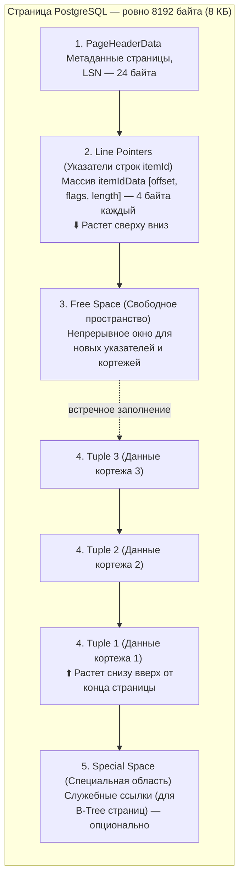
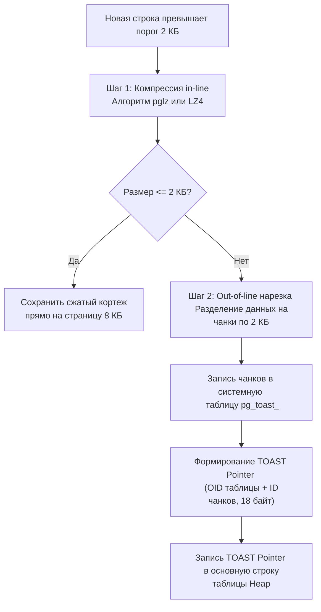

Если в вашем приложении на Go данные размещаются в оперативной памяти в виде компактных, выровненных по машинному слову структур (`struct`), массивов и срезов (`slice`), а управление их временем жизни берет на себя автоматический сборщик мусора (Go GC), то в реляционной СУБД ситуация выглядит принципиально иначе. База данных — это специализированная операционная система внутри операционной системы, чья главная задача — предельно надежно, экономно и предсказуемо упаковывать байты на постоянные блочные накопители (NVMe SSD).

В отличие от MySQL, где исторически существовала экосистема сменных подключаемых движков (MyISAM, Memory и ставший стандартом де-факто `InnoDB`), PostgreSQL изначально проектировался вокруг монолитного, кристально надежного механизма хранения — **Heap (Куча)**. Начиная с версии PostgreSQL 12, в ядре появился унифицированный интерфейс `tableam` (Table Access Method), открывший путь к созданию альтернативных движков (таких как `zheap` для борьбы с раздуванием таблиц при обновлениях), однако классический **Append-Only Heap** остается стандартом де-факто для 99% промышленных инсталляций.

Понимание того, как PostgreSQL раскладывает байты на накопителе, наделяет инженера механическим сочувствием к машине: вы начнете физически видеть, почему порядок объявления колонок в миграциях экономит гигабайты памяти, почему слепой `SELECT *` разрушает кэш ввода-вывода и как индексы за один шаг находят нужный кортеж на диске.

---

## Анатомия файлов: От базы данных к гигабайтным сегментам

Если вы заглянете внутрь каталога данных PostgreSQL (обычно `/var/lib/postgresql/data/base/`), вы не обнаружите там привычных файлов с человеческими именами `users.db` или `orders.dat`. Перед вами предстанет лес директорий и файлов с числовыми именами:

```bash
# Типичная структура директории base/
$ ls -l /var/lib/postgresql/data/base/16384/
-rw------- 1 postgres postgres 1073741824 Sep 14 10:00 16390
-rw------- 1 postgres postgres 1073741824 Sep 14 10:15 16390.1
-rw------- 1 postgres postgres  524288000 Sep 14 10:30 16390.2
-rw------- 1 postgres postgres      24576 Sep 14 10:30 16390_fsm
-rw------- 1 postgres postgres       8192 Sep 14 10:30 16390_vm
```

В реляционной теории и исходном коде PostgreSQL все сущности обобщаются понятием **Relation (Отношение)** — обычная таблица, индекс B-Tree, последовательность (`SEQUENCE`) или материализованное представление (`MATERIALIZED VIEW`). Каждому отношению при создании назначается уникальный системный идентификатор — **OID (Object Identifier)** или физический дескриптор **RelFileNode**.

Каждая таблица хранится в виде набора бинарных файлов, базовое имя которых совпадает с ее OID (например, `16384`). 
Однако операционные системы и утилиты резервного копирования исторически испытывали трудности при манипуляциях с монолитными файлами терабайтных размеров. Поэтому движок PostgreSQL жестко нарезает данные таблиц на сегменты фиксированного размера — ровно по **1 ГБ** (1 073 741 824 байта):

* Когда таблица с OID `16384` превышает объем в 1 ГБ, создается сегмент `16384.1`.
* Когда заполняется и он — открывается `16384.2`, `16384.3` и так далее.
* Рядом располагаются вспомогательные файлы: карта свободного пространства (`_fsm`, Free Space Map) и карта видимости (`_vm`, Visibility Map, необходимая для оптимизации Index-Only Scan и VACUUM).

> [!info] Под капотом: Mechanical Sympathy и размер в 1 ГБ
> Почему именно 1 ГБ? Это выверенный инженерный компромисс между расходом системных дескрипторов файлов (`ulimit -n`) и предсказуемостью работы файловой системы Linux. Сегменты по 1 ГБ элементарно перемещать, архивировать и восстанавливать. Главное же преимущество — системный вызов `fsync()`, гарантирующий физический сброс страниц памяти на диск при работе журнала предзаписи ([[8. WAL. Write Ahead Log]]), отрабатывает плавно и не вызывает катастрофических пауз дисковой подсистемы (I/O freezes), которые неизбежно возникали бы при попытке сбросить метаданные одного монолитного файла на 500 ГБ.

---

## Страница (Page): Неделимый квант ввода-вывода

Гигабайтный сегмент — это лишь внешняя оболочка. Физически любой файл таблицы в PostgreSQL строго нарезан на блоки фиксированного размера — **Страницы (Pages, или Blocks)**. По умолчанию размер страницы равен **8 КБ (8192 байта)**.

Запомните фундаментальный закон: **PostgreSQL никогда не читает и не записывает на диск отдельные строки или колонки**. Минимальной и неделимой единицей обмена между дисковым накопителем и оперативной памятью всегда является страница размером 8 КБ. 

Если в вашем запросе `SELECT email FROM users WHERE id = 1` требуется прочитать единственную строку длиной в 30 байт, движок загрузит с SSD в разделяемую память (`shared_buffers`, разобранную в [[1. Архитектура PostgreSQL]]) целиком всю 8-килобайтную страницу, содержащую эту запись.

### Внутреннее устройство 8-килобайтной страницы (Page Layout)

Структура страницы базы данных — это шедевр низкоуровневой системной инженерии. Она спроектирована по принципу **двунаправленного роста (slotted page)**, что позволяет эффективно хранить строки переменной длины и исключает внутреннюю фрагментацию.



Страница разделена на 5 четких зон:

1. **PageHeaderData (Заголовок страницы):** Занимает первые 24 байта. Содержит флаги состояния, смещения начала свободного места (`pd_lower`) и конца свободного места (`pd_upper`), а главное — **LSN (Log Sequence Number)**. LSN указывает на позицию последней записи в журнале WAL, изменившей данную страницу. По этому номеру рантайм определяет, нужно ли накатывать повтор изменений при восстановлении после аварии.
2. **Line Pointers (Указатели строк, `ItemIdData`):** Непрерывный массив 32-битных (4 байта) структур в начале страницы. Каждый указатель содержит три поля: байтовое смещение начала строки (`lp_off`), статус указателя (`lp_flags`: используется, мертв, перенаправлен) и физическую длину строки (`lp_len`). Массив растет **сверху вниз** (от заголовка к центру).
3. **Free Space (Свободное окно):** Область незанятой памяти между концом массива указателей и началом последней сохраненной строки. Когда массив указателей и область кортежей соприкасаются (`pd_lower == pd_upper`), страница считается заполненной.
4. **Tuples (Кортежи / Данные строк):** Непосредственно тела строк. В отличие от массива указателей, строки записываются **снизу вверх** (начиная от конца страницы к центру).
5. **Special Space (Специальная область):** Небольшой хвост страницы переменного размера. В обычных таблицах Heap он пуст, но в индексах (например, в B-Tree) здесь хранятся ссылки на левую и правую соседние страницы для организации двусвязного списка листовых узлов.

> [!tip] Собеседование
> **Вопрос:** Зачем в странице нужен уровень косвенности в виде массива `Line Pointers`? Почему бы записям в индексах не ссылаться напрямую на абсолютное смещение байтов строки внутри страницы?
> **Ответ:** Строки в реляционной базе данных имеют переменную длину (из-за типов `TEXT`, `VARCHAR`, массивов или `JSONB`). В ходе операций `UPDATE` или очистки `VACUUM` кортеж может сжаться или быть перемещен внутри страницы в процессе локальной дефрагментации. 
> Если бы индексы хранили точные физические смещения байтов строки, то малейший сдвиг кортежа внутри 8-килобайтной страницы потребовал бы перестроения десятков внешних индексов таблицы! 
> Вместо этого индексы ссылаются на **CTID (ItemPointer)** — логический идентификатор кортежа в формате `Номер_страницы + Индекс_Line_Pointer` (пару `BlockNumber + OffsetNumber`). Например, CTID `(42, 3)` означает: «Блок номер 42, 3-й элемент массива Line Pointer». Внутри блока мы можем как угодно перемещать байты строки — пока указатель под номером 3 указывает на новое смещение, внешние индексы остаются на 100% валидными.

---

## Внутреннее устройство строки (Heap Tuple)

Каждая физическая строка на странице состоит из двух компонентов: заголовка (`HeapTupleHeaderData`) и фактических пользовательских данных:

```
+-------------------------------------------------------------+-----------------------------+
|                     HeapTupleHeaderData                     |        User Payload         |
| t_xmin (4B) | t_xmax (4B) | t_cid/t_xvac (4B) | t_ctid (6B) | col1 | col2 | col3 | ...    |
| infomask (4B)| hoff (1B)  |   null_bitmap (вар.)            |                             |
+-------------------------------------------------------------+-----------------------------+
```

Заголовок строки занимает минимум 23 байта (с учетом обязательного выравнивания под 8-байтовую границу — фактически **24 байта** или более):

* **`t_xmin`** (4 байта): Идентификатор транзакции (`TransactionId`), которая создала данный кортеж в результате операции `INSERT`.
* **`t_xmax`** (4 байта): Идентификатор транзакции, которая удалила кортеж (`DELETE`) или создала новую версию при `UPDATE`. Для активной живой строки равен 0.
* **`t_cid`** (4 байта): Command Identifier — порядковый номер команды внутри одной транзакции (позволяет транзакции видеть собственные изменения).
* **`t_ctid`** (6 байт): Указатель на текущую версию строки. Если строка не модифицировалась, он указывает сам на себя `(block, offset)`. Если строка была обновлена через `UPDATE`, `t_ctid` указывает на новую версию строки (возможно, на совершенно другой странице).
* **`t_infomask`** (2 байта + 2 байта): Битовые флаги статуса кортежа (содержит ли строка NULL-поля, закоммичена ли создавшая транзакция `HEAP_XMIN_COMMITTED`, заблокирована ли строка).
* **`t_hoff`** (1 байт): Header Offset — смещение от начала кортежа до первого байта пользовательских данных с учетом битовой маски NULL-значений (`null_bitmap`).

Именно поля `t_xmin`, `t_xmax` и `t_ctid`, хранящиеся в каждом кортеже прямо на диске, обеспечивают феноменальную скорость неблокирующего параллельного чтения — фундаментальный механизм [[3. MVCC в PostgreSQL]].

---

## Выравнивание структур данных на диске (Data Alignment & Padding)

Инженеры, пишущие на Go, отлично знают: процессор читает оперативную память машинными словами (по 8 байт на 64-битной архитектуре). Если поле структуры не выровнено по адресу, кратному его размеру, процессор выполняет невыровненный доступ (unaligned access), что на многих архитектурах вызывает двойные циклы чтения или падение производительности. Поэтому компилятор Go добавляет между полями невидимые байты-заполнители (**Padding**).

В дисковом хранилище PostgreSQL действует **абсолютно то же правило**. Движок Heap строго выравнивает столбцы кортежа:
* 8-байтовые типы (`INT8`, `BIGINT`, `TIMESTAMP`, `DOUBLE PRECISION`, указатели) обязаны начинаться со смещения, кратного **8 байтам**.
* 4-байтовые типы (`INT4`, `INTEGER`, `REAL`, `DATE`) — кратного **4 байтам**.
* 2-байтовые типы (`INT2`, `SMALLINT`) — кратного **2 байтам**.
* 1-байтовые типы (`BOOLEAN`, `CHAR`) — не требуют выравнивания (кратность 1 байт).

> [!warning] Ловушка / Gotcha: Порядок объявления колонок в миграциях
> Посмотрим на неудачно спроектированную таблицу:
> 
> ```sql
> CREATE TABLE bad_padding (
>     id INT8,          -- 8 байт (смещение 0..7)
>     is_active BOOLEAN,-- 1 байт (смещение 8)
>                       -- [7 БАЙТ ПУСТОГО PADDING] -> выравнивание под INT8
>     user_id INT8,     -- 8 байт (смещение 16..23)
>     is_banned BOOLEAN -- 1 байт (смещение 24)
>                       -- [7 БАЙТ ПУСТОГО PADDING] -> выравнивание всего кортежа
> );
> ```
> 
> Полезные данные занимают: `8 + 1 + 8 + 1 = 18 байт`.  
> Но из-за двух интервалов выравнивания физический размер полезной нагрузки составит `32 байта`!  
> В каждой строке вы впустую теряете **14 байт** на пустые нули. При 100 миллионах строк это **1.4 ГБ чистого мусора** на NVMe-диске, в сетевом трафике репликации и в драгоценном кэше `shared_buffers`!
> 
> **Золотое правило верстки таблиц:** Объявляйте колонки **по убыванию их выравнивания**:
> 1. Сначала 8-байтовые: `BIGINT`, `TIMESTAMPTZ`, `FLOAT8`, `UUID`.
> 2. Затем 4-байтовые: `INTEGER`, `DATE`.
> 3. Затем 2-байтовые: `SMALLINT`.
> 4. В конце: 1-байтовые (`BOOLEAN`) и типы переменной длины (`TEXT`, `VARCHAR`, `JSONB`).
> 
> ```sql
> CREATE TABLE optimal_padding (
>     id INT8,          -- 8 байт
>     user_id INT8,     -- 8 байт
>     is_active BOOLEAN,-- 1 байт
>     is_banned BOOLEAN -- 1 байт
>                       -- [6 байт выравнивания в конце вместо 14 байт внутри]
> );
> ```

---

## TOAST: Хранение сверхбольших атрибутов (The Oversized-Attribute Storage Technique)

Мы установили, что максимальный размер страницы в PostgreSQL строго равен 8 КБ. При этом кортеж данных **не может пересекать границу страницы** — строка обязана целиком помещаться внутри одного блока.

Что произойдет, если пользователь загрузит документ размером 5 мегабайт в колонку `TEXT` или крупный JSONB-объект (с которым мы будем детально работать в [[5. JSONB и работа с JSON]])?

Для решения этой задачи в PostgreSQL встроен элегантный механизм **TOAST (The Oversized-Attribute Storage Technique)**.

Если размер кортежа превышает четверть страницы (порог `TOAST_TUPLE_THRESHOLD`, по умолчанию около **2 КБ**), движок активирует четырехуровневый протокол сжатия и выноса данных:



1. **In-line Compression (Внутреннее сжатие):** Движок пытается сжать тяжелый атрибут с помощью встроенного алгоритма `pglz` (или более быстрого `LZ4`, доступного начиная с PostgreSQL 14). Если после компрессии строка укладывается в целевой размер — она остается внутри обычной Heap-страницы.
2. **Out-of-line Splitting (Вынос во внешнюю таблицу):** Если сжатия недостаточно, PostgreSQL отсекает массив данных от основной строки.
3. Данные нарезаются на фиксированные фрагменты (чанки) размером около 2 КБ.
4. Чанки сохраняются в специальной изолированной системной таблице — **TOAST-таблице** (имеющей вид `pg_toast.pg_toast_<OID_таблицы>`).
5. В теле исходной строки на обычной странице Heap вместо мегабайта данных сохраняется крошечный **TOAST Pointer (указатель)** размером около 18 байт, содержащий OID соответствующей TOAST-таблицы и логический идентификатор чанков.

---

### Mechanical Sympathy: Почему `SELECT *` — архитектурный грех

Теперь, осознавая устройство TOAST и страничной организации памяти, легко понять, почему вызов `SELECT * FROM users` (когда вам нужны только `id` и `email`) наносит сокрушительный удар по производительности системы:

Представьте, что у пользователя есть колонка `bio TEXT` или `avatar_bytes BYTEA`, значения которых были вынесены в TOAST:

1. Исполнитель запросов (`Executor`) находит нужную 8-килобайтную страницу в кэше `shared_buffers` и читает заголовок строки.
2. Обнаружив запрос на выборку всех колонок (`*`), Executor видит TOAST Pointer для колонки `bio`.
3. База вынуждена выполнить **серию дополнительных случайных чтений (Random Disk I/O)**, обращаясь к системной таблице `pg_toast` за всеми связанными чанками.
4. Процессор тратит дорогостоящие такты на распаковку алгоритмом `LZ4`/`pglz`.
5. Выделяется оперативная память для склейки чанков в единый буфер, после чего мегабайты бесполезных байтов прокачиваются через сеть в ваше Go-приложение, провоцируя аллокации в куче Go и нагружая GC.

Если же вы выполните хирургически точный запрос `SELECT id, email FROM users`, PostgreSQL прочитает исключительно 8 КБ страницу из основной таблицы, проигнорирует наличие TOAST-указателя, не совершит ни единого лишнего дискового обращения к таблице TOAST и мгновенно вернет результат клиенту.

---

## Резюме для инженера

1. **Архитектура Heap:** Таблицы хранятся в 1-гигабайтных сегментах, состоящих из 8-килобайтных страниц со slotted-структурой (встречный рост массива `Line Pointers` и кортежей `Tuples`).
2. **Косвенная адресация CTID:** Индексы ссылаются на пару `(номер страницы, индекс указателя)`. Локальное перемещение байтов строки не требует инвалидации внешних индексов.
3. **Порядок атрибутов имеет значение:** Грамотное расположение столбцов от 8-байтовых к 1-байтовым устраняет внутренний padding и экономит до 20–30% дискового пространства и оперативной памяти `shared_buffers`.
4. **TOAST защищает страницы:** Объекты крупнее 2 КБ сжимаются и выносятся в скрытые таблицы `pg_toast`, оставляя в строке легковесный указатель.

Теперь, когда мы досконально изучили анатомию страницы и поняли, почему в заголовке строки постоянно присутствуют системные маркеры `t_xmin` и `t_xmax`, пришло время раскрыть главную тайну неблокирующего параллелизма: как разные транзакции видят различные версии одной и той же строки. О механизме многоверсионности — в следующей лекции: [[3. MVCC в PostgreSQL]].