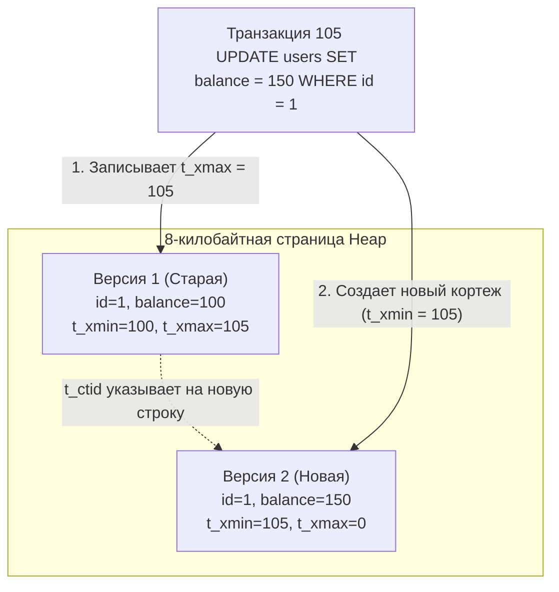
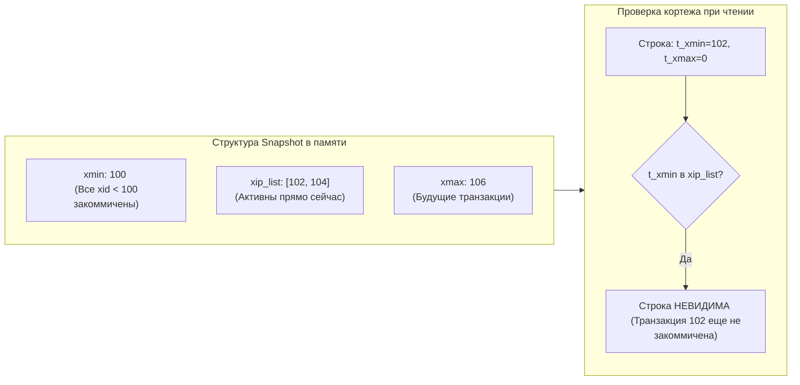
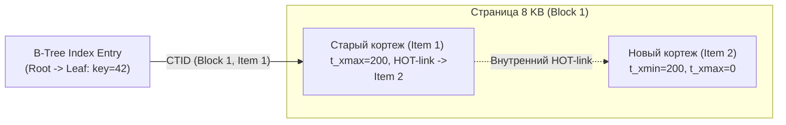

Когда вы проектируете многопоточное приложение на Go и вам требуется защитить разделяемое состояние в оперативной памяти (например, кэш на базе `map`), первым интуитивным решением становится мьютекс с разделением прав чтения и записи: `sync.RWMutex`. Логика проста: сотни горутин могут параллельно читать карту (`RLock()`), но как только одной горутине требуется обновить ключ, она захватывает эксклюзивную блокировку (`Lock()`), и **все читатели замирают в ожидании**.

В мире высоконагруженных реляционных баз данных подобная блокировочная модель привела бы к катастрофической деградации пропускной способности. Если бы транзакция, обновляющая баланс пользователя в онлайн-банкинге или статус заказа в интернет-магазине, замораживала чтение этой записи для всех остальных клиентов, система не выдержала бы и сотни конкурентных запросов.

Чтобы обеспечить высочайший параллелизм, современные СУБД опираются на парадигму **MVCC (Multi-Version Concurrency Control — управление конкурентным доступом с помощью многоверсионности)**. Золотое правило MVCC звучит так: **Читатели никогда не блокируют писателей, а писатели никогда не блокируют читателей.**

Мы уже разбирали теоретические основы многоверсионности в статье [[7. MVCC. Multi Version Concurrency Control]]. Однако физическая реализация MVCC в ядре PostgreSQL кардинально отличается от подходов MySQL (InnoDB) или Oracle. Это фундаментальное архитектурное отличие напрямую влияет на то, как бэкенд-инженер должен писать транзакционный код в Go и проектировать схемы реляционных таблиц.

---

## Философия PostgreSQL: Версии данных прямо в куче (In-Place Heap)

В большинстве классических реляционных СУБД (таких как MySQL с движком InnoDB или Oracle) при обновлении строки новая версия записывается непосредственно на место старой, а предыдущие значения столбцов вытесняются в специальный циклический журнал отката — **Undo Log**. Если параллельный запрос читает старый снимок данных, он на лету конструирует прежнюю версию строки, восстанавливая дельты изменений из Undo Log в оперативной памяти.

Архитекторы PostgreSQL избрали радикально иной, бескомпромиссно надежный путь: **в PostgreSQL вообще нет Undo Logs**. 
Все версии одной и той же строки (прошлая, текущая закоммиченная и будущая, модифицируемая незавершенной транзакцией) физически сосуществуют бок о бок в одном и том же файле таблицы — в той самой дисковой Куче (**Heap**), устройство которой мы детально изучали в [[2. Storage engine PostgreSQL]].

> [!info] Под капотом: Метаданные транзакций в заголовке кортежа
> Чтобы сервер точно понимал, какая именно транзакция имеет право видеть ту или иную версию строки, в заголовке *каждого* кортежа (`HeapTupleHeaderData`) резервируются скрытые системные поля. 
> Главными среди них являются 32-битные монотонно возрастающие идентификаторы транзакций (Transaction ID, или **`xid`**):
> * **`t_xmin`**: ID транзакции, создавшей (`INSERT`) данную физическую версию строки.
> * **`t_xmax`**: ID транзакции, удалившей (`DELETE`) или обновившей эту версию. Для актуальной "живой" строки, не подвергавшейся удалению, поле `t_xmax` строго равно **`0`**.

---

### Анатомия UPDATE: Почему обновление — это удаление плюс вставка

Поскольку старые версии строк не вытесняются в Undo Log, в движке PostgreSQL **на физическом уровне не существует операции перезаписи данных (In-place UPDATE)**!

Когда вы отправляете в базу запрос:
```sql
UPDATE users SET balance = 150 WHERE id = 1;
```

под капотом страничного хранилища разворачивается следующая цепочка низкоуровневых операций:

1. Движок отыскивает на 8-килобайтной странице текущую видимую версию кортежа (`t_xmax = 0`).
2. Вместо физической модификации байтов баланса, СУБД «мягко удаляет» старую версию: в ее системное поле `t_xmax` записывается ID текущей транзакции (допустим, `105`).
3. Рядом (на этой же странице, если хватает свободного места, либо на новой выделенной странице) создается **совершенно новый физический кортеж** со значением баланса `150`.
4. У нового кортежа атрибут `t_xmin` устанавливается в `105`, а поле `t_xmax` инициализируется нулем (`0`).
5. Старый кортеж получает физическую ссылку на новый через скрытое поле `t_ctid`, образуя цепочку версий.



Обе физические версии строки одновременно присутствуют на страницах накопителя. Любая параллельная транзакция, стартовавшая *до* фиксации (коммита) транзакции 105, будет прозрачно читать Версию 1. Все последующие транзакции, инициированные *после* успешного коммита, увидят Версию 2.

---

## Снимки данных (Snapshots) и правила видимости

Каким образом исполнитель запросов (`Executor`) при выполнении `SELECT` безошибочно определяет, какая из версий кортежа является видимой для текущего клиента?

В момент начала выполнения SQL-команды (или в момент старта транзакции — в зависимости от выбранного уровня изоляции, подробно разобранного в [[3. Read Committed, Repeatable Read, Serializable]]), PostgreSQL генерирует легковесный **Снимок данных (Snapshot)**.

Важно подчеркнуть: создание снимка — это **не физическое копирование данных**! Снимок представляет собой компактную структуру в оперативной памяти (в рантайме ядра СУБД), описывающую текущее состояние глобального счетчика транзакций:

* **`xmin` снимка:** Наименьший идентификатор транзакции (`xid`), которая еще активна (не закоммичена и не откачена) на момент фиксации снимка. Все транзакции с `xid < xmin` гарантированно завершены, и их результаты считаются видимыми в прошлом.
* **`xmax` снимка:** Следующий еще не назначенный идентификатор транзакции (`next_xid`). Ни одна транзакция с `xid >= xmax` еще не существовала в момент создания снимка, следовательно, ее изменения строго невидимы.
* **`xip_list` (active transactions list):** Срез идентификаторов всех транзакций, которые были активны (in-flight) ровно в момент снятия снапшота (между `xmin` и `xmax`).



Когда исполнитель запроса сканирует 8-килобайтную страницу и инспектирует заголовок кортежа, он применяет математически строгие **Правила видимости (Visibility Rules)**:

1. Если `t_xmin` кортежа больше или равен `xmax` снимка либо присутствует в списке активных транзакций `xip_list` (транзакция-создатель еще не зафиксирована) — **кортеж невидим**.
2. Если создавшая транзакция `t_xmin` успешно завершена (`COMMITTED`), но удалившая транзакция `t_xmax` активна в `xip_list` или принадлежит будущему (`>= xmax`) — **кортеж видим** (удаление для нас еще не произошло).
3. Если `t_xmin` зафиксирован в прошлом, а поле `t_xmax` равно `0` (или транзакция, удалившая строку, была отменена `ABORTED`) — **кортеж видим**.

Эта проверка выполняется со скоростью машинных инструкций в L1/L2-кэшах процессора над байтами заголовка строки, без системных вызовов к ядру ОС и без ожидания дисковых операций.

---

## Mechanical Sympathy: Раздувание таблиц (Table Bloat)

Хранение всех версий данных непосредственно в Куче дает невероятную скорость чтения и изоляцию, но имеет оборотную сторону: **раздувание таблиц и индексов (Table and Index Bloat)**.

Поскольку каждая операция `UPDATE` порождает новый физический кортеж, а `DELETE` лишь выставляет маркер `t_xmax`, таблица постоянно прирастает физическими страницами. Если ваша система интенсивно обновляет один и тот же набор из 10 000 строк (например, статусы очередей задач, остатки товаров или координаты курьеров), со временем таблица может разрастись до 10 гигабайт на диске, хотя полезных данных в ней по-прежнему содержится всего 10 000 записей!

**Чем опасно раздувание?**
* Резко возрастает дисковый ввод-вывод (I/O): чтобы прочитать 1 000 живых строк, базе приходится вычитывать с SSD сотни тысяч 8-килобайтных страниц с "мертвыми" кортежами.
* Катастрофически падает утилизация кэша `shared_buffers`: ценная оперативная память забивается страницами с мертвыми версиями, вытесняя полезные горячие данные.
* Растет задержка (Latency) клиентских запросов в Go-сервисах.

Для утилизации мертвых строк в рантайм PostgreSQL встроен компонент **Autovacuum** (фоновый сборщик мусора СУБД). Он обходит страницы, находит кортежи, чей `t_xmax` находится глубже горизонта видимости всех активных транзакций, и освобождает занимаемое ими пространство для новых записей (детально о его тонкой настройке — в [[10. VACUUM, ANALYZE]]).

> [!warning] Ловушка / Gotcha: «Зависшие» транзакции в Go и паралич базы данных
> Классическая авария в микросервисах на Go выглядит так:
> 
> ```go
> tx, err := db.Begin()
> if err != nil {
>     return err
> }
> // Выполнили быстрый SELECT
> rows, err := tx.Query("SELECT balance FROM accounts WHERE id = $1", accountID)
> // ... обработали строки ...
> 
> // ОШИБКА: Долгий сетевой вызов к внешнему платежному шлюзу без закрытия транзакции!
> resp, err := httpClient.Post("https://payment-gateway/charge", ...)
> if err != nil {
>     // Забыли вызвать tx.Rollback() при ошибке сетевого тайм-аута!
>     return err 
> }
> tx.Commit()
> ```
> 
> Пока транзакция в Go ждет ответа от внешнего шлюза (или зависает из-за отсутствия контекстных таймаутов), ее идентификатор `xid` удерживает **горизонт транзакций (Transaction Horizon)** всей базы данных.  
> Autovacuum не имеет права физически удалить ни один мертвый кортеж ни в одной таблице кластера, если этот кортеж был модифицирован после старта вашей "зависшей" транзакции! Вся база данных начинает лавинообразно раздуваться (Bloat), пожирая терабайты диска.  
> **Инженерный закон:** Никогда не выполняйте внешние сетевые вызовы (`http.Client`, gRPC, очереди сообщений) и тяжелые вычисления внутри активной транзакции БД. Всегда закрывайте транзакцию через `defer tx.Rollback()` немедленно после инициализации!

---

## Оптимизация HOT (Heap-Only Tuples)

Чтобы снизить чудовищный оверхед при обновлении записей, в PostgreSQL реализован элегантный механизм **HOT (Heap-Only Tuples — кортежи только в куче)**.

В стандартном сценарии при вставке нового кортежа СУБД обязана обновить **все до единого индексы таблицы** (B-Tree, Hash), вставив в них ссылки на новый `CTID`. Если у вас на таблице висит 6 вторичных индексов, один `UPDATE` вызывает лавину случайных записей в 6 индексных деревьев!

**Когда срабатывает HOT?**
HOT-оптимизация включается автоматически, если соблюдены два строгих условия:
1. Запрос `UPDATE` **не модифицирует ни одной колонки, по которой построен хотя бы один индекс**.
2. На текущей 8-килобайтной странице данных Heap имеется **достаточно свободного места** (`Free Space`) для размещения новой версии строки.



При HOT-обновлении база данных **вообще не касается индексных структур**! 
В листовом узле B-Tree остается прежний указатель на исходную строку (`Item 1`). Когда поисковый запрос по индексу приходит на страницу данных, он считывает заголовок старой строки, мгновенно видит флаг `HEAP_HOT_UPDATED` и переходит по внутренней ссылке к актуальной версии (`Item 2`). Экономия на дисковом вводе-выводе и блокировках индексов достигает 80–90%!

Чтобы обеспечить постоянное наличие свободного места для HOT-обновлений, на часто модифицируемых таблицах настраивают параметр заполнения страниц: `ALTER TABLE accounts SET (fillfactor = 70);`. Это оставляет 30% каждой страницы про запас специально для HOT-цепочек.

---

> [!tip] Собеседование
> **Вопрос:** Что такое переполнение счетчика транзакций (Transaction ID Wraparound) в PostgreSQL и чем оно смертельно опасно?
> **Ответ:** Идентификаторы транзакций `xmin` и `xmax` имеют физический размер 32 бита, что дает $2^{32} \approx 4.29$ миллиарда уникальных значений. Для корректного упорядочивания база трактует их как кольцевой буфер (modulo $2^{32}$): ровно 2 миллиарда транзакций считаются лежащими "в прошлом", а 2 миллиарда — "в будущем".  
> Если система выполнит более 2 миллиардов транзакций без специального обслуживания, счетчик сделает оборот (Wraparound). Внезапно исторические транзакции окажутся "в будущем", и с точки зрения правил видимости все данные таблицы **мгновенно исчезнут** (станут невидимыми)!  
> Чтобы предотвратить катастрофу, процесс Vacuum регулярно выполняет **Freezing (Заморозку)**: он подменяет старые `xmin` на специальный идентификатор `FrozenTransactionId` (значение `2`), который правилами видимости трактуется как "всегда закоммиченный в бесконечном прошлом". Если база приближается к лимиту в 2 млрд транзакций из-за сбоев Autovacuum или зависших транзакций, PostgreSQL принудительно аварийно останавливается и переходит в режим read-only для спасения целостности данных.

---

## Резюме для инженера

1. **Архитектура без Undo Log:** Все версии строк хранятся непосредственно в страницах Heap, что исключает накладные расходы на поддержание отдельного журнала отката.
2. **`UPDATE` — это дублирование:** Каждое обновление физически создает новый кортеж и помечает старый через `t_xmax`, неизбежно порождая раздувание (Bloat) при высокой частоте модификаций.
3. **Снимки (Snapshots):** Обеспечивают консистентное неблокирующее чтение через сравнение системных полей `t_xmin`/`t_xmax` со списком активных транзакций `xip_list`.
4. **HOT Updates:** Спасают производительность, исключая модификацию вторичных индексов при условии наличия свободного места на странице.
5. **Опасность долгих транзакций:** Зависшие транзакции в Go блокируют очистку мертвых строк Autovacuum'ом и могут привести к неконтролируемому раздуванию базы или даже угрозе Transaction ID Wraparound.

Зная, как хранятся и версионируются данные на диске, мы можем перейти к следующему краеугольному камню производительности — поисковым деревьям и индексам. В следующей лекции: [[4. Индексы в PostgreSQL]].