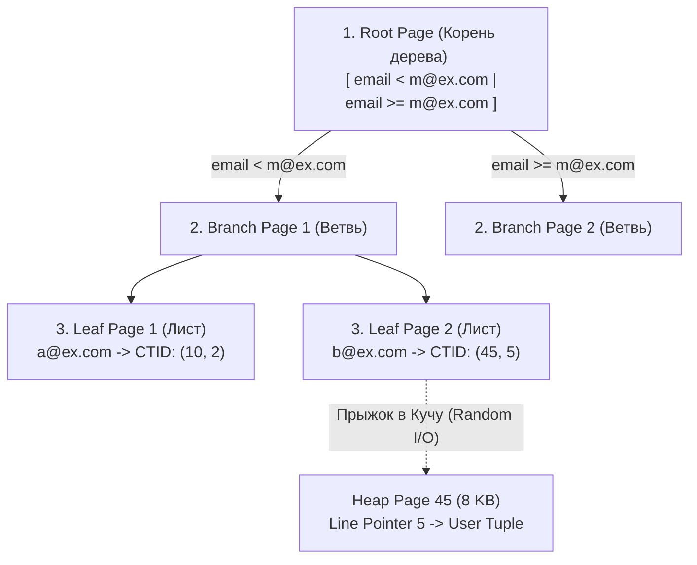
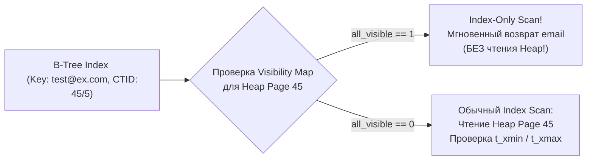
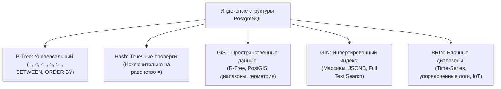

В предыдущих главах мы подробно исследовали, как данные физически укладываются в 8-килобайтные страницы дискового накопителя ([[2. Storage engine PostgreSQL]]) и как благодаря механизму многоверсионности [[3. MVCC в PostgreSQL]] внутри этих страниц мирно уживаются разные поколения одних и тех же строк.

Когда ваше Go-приложение отправляет в базу невинный на первый взгляд запрос:
```sql
SELECT * FROM users WHERE email = 'test@example.com';
```
и на колонке `email` нет индекса, исполнитель запросов (`Executor`) не имеет иного выбора, кроме как инициировать **Sequential Scan (Последовательное сканирование таблицы)**. Он методично считывает с блочного накопителя в оперативную память абсолютно *каждую* 8-килобайтную страницу Кучи (Heap), распаковывает каждый кортеж и проверяет системные поля `t_xmin`/`t_xmax`, выясняя, видна ли запись текущей транзакции.

Для таблицы объемом 10 гигабайт это означает физическую прокачку 10 ГБ данных через системную шину и дисковый контроллер ради поиска единственной 50-байтовой строки — классическая катастрофа алгоритмической сложности $O(N)$. Чтобы превратить линейный перебор в мгновенный логарифмический поиск $O(\log N)$, реляционные СУБД используют вспомогательные структуры быстрого доступа — **Индексы**.

---

## Физическая природа индекса в PostgreSQL

В архитектуре PostgreSQL индекс — это **полноценное независимое отношение (Relation)**. Он хранится в собственных бинарных файлах в директории `base/` (со своим индивидуальным OID) совершенно отдельно от файлов основной Кучи (Heap). Файлы индексов точно так же нарезаны на страницы фиксированного размера по **8 КБ**.

Если Куча представляет собой хаотичный склад пронумерованных ящиков с записями произвольной длины, то индекс — это строго упорядоченный алфавитный каталог в библиотеке. В этом каталоге каждой поисковой карточке сопоставлен точный физический адрес: *«Кортеж со значением ключа 'test@example.com' находится на странице №45, в слоте указателя №5»*.

Этот адрес в PostgreSQL называется **CTID (ItemPointer)**. Как мы помним, `CTID` кодируется парой целых чисел: `Номер_страницы` (BlockNumber) и `Индекс_Line_Pointer` (OffsetNumber), например `(45, 5)`.

Запомните важнейшее архитектурное правило: **Абсолютно любой индекс в PostgreSQL (будь то B-Tree, Hash, GIN, GiST или BRIN) никогда не хранит копию всей строки**. Индекс лишь упорядочивает поисковые ключи и сопоставляет им массив соответствующих `CTID`, по которым исполнитель запроса совершает точечный прыжок в Кучу (Heap) за пользовательскими данными.

---

## B-Tree: Индекс по умолчанию

Когда вы выполняете стандартную DDL-команду:
```sql
CREATE INDEX idx_email ON users(email);
```
PostgreSQL создает сбалансированное дерево поиска типа **B-Tree (B-дерево, вариант Lehman & Yao B-link tree)**. Этот алгоритм специально спроектирован для минимизации операций ввода-вывода при работе с блочными накопителями (HDD/SSD).

> [!info] Под капотом: Архитектура широкого дерева (Fanout)
> В традиционных двоичных деревьях поиска (AVL, Красно-черные деревья) каждый узел имеет не более двух потомков. Если упаковать такое дерево на диск, глубина для миллиарда записей превысит 30 уровней: чтобы найти элемент, процессору пришлось бы сделать 30 последовательных случайных чтений с диска!  
> В B-Tree узлом является **целая 8-килобайтная страница**, способная вмещать сотни ключей и указателей на дочерние узлы (высокий коэффициент ветвления — Fanout). Благодаря этому дерево получается исключительно плоским: даже для таблицы с миллиардом строк глубина B-Tree в PostgreSQL редко превышает **3–4 уровня**. Для извлечения произвольного ключа достаточно прочитать всего 3–4 страницы (24–32 КБ), которые, как правило, уже прогреты в оперативной памяти `shared_buffers`!



### Структура уровней B-Tree
1. **Root Page (Корневая страница):** Верхний узел дерева. Содержит граничные значения ключей и ссылки на страницы промежуточного уровня.
2. **Branch Pages (Промежуточные ветви):** Направляют поиск по диапазонам значений, сужая область сканирования.
3. **Leaf Pages (Листовые страницы):** Нижний уровень иерархии. Содержит упорядоченные пары `(значение ключа, CTID)`. Листовые страницы связаны между собой двусвязным списком (через служебную область `Special Space` в конце страницы 8 КБ), что позволяет тривиально быстро выполнять интервальные запросы вида `WHERE created_at BETWEEN ... AND ...`.

### Механика Index Scan шаг за шагом

1. Go-клиент отправляет запрос с фильтром по индексу.
2. Планировщик (`Planner`) выбирает стратегию **Index Scan**.
3. Исполнитель считывает корневую страницу B-Tree (`Root Page`), бинарным поиском внутри 8 КБ находит нужный диапазон, спускается к ветви (`Branch Page`) и достигает листовой страницы (`Leaf Page`).
4. В листовой странице отыскивается искомый ключ (`test@example.com`) и извлекается целевой `CTID` (например, `45/5`).
5. Движок обращается к странице Heap с номером `45` в `shared_buffers` (или запрашивает ее чтение с диска) и находит кортеж по указателю `Line Pointer 5`.
6. **Критический шаг MVCC:** Движок инспектирует заголовок кортежа (`t_xmin`, `t_xmax`) и сверяет его со снимком транзакции (`Snapshot`). Если кортеж был удален или модифицирован параллельной транзакцией, он отбрасывается, и база продолжает поиск по индексу.

---

## Mechanical Sympathy: Index-Only Scan и Visibility Map

Здесь раскрывается одно из самых глубоких архитектурных различий между PostgreSQL и MySQL (InnoDB):

В MySQL InnoDB вторичные индексы хранят значение первичного ключа, а сам кластерный индекс таблицы организован по принципу B-Tree, где листовые узлы содержат непосредственно тела строк.  
В PostgreSQL индексы принципиально **не содержат никакой метаинформации о версионности MVCC**. В индексе хранятся только значения ключей и "слепые" указатели `CTID`.

Отсюда вытекает фундаментальная проблема: обнаружив нужный ключ в B-Tree индексе, база данных **не может знать**, является ли эта строка живой и видимой для текущего снимка транзакции! Движок *вынужден* совершить случайное чтение страницы Heap и проверить поля `xmin`/`xmax`.

Представьте запрос:
```sql
SELECT email FROM users WHERE email = 'test@example.com';
```
Казалось бы, значение `email` уже прочитано из листовой страницы B-Tree. Зачем тратить драгоценный дисковый ввод-вывод на загрузку 8 КБ страницы Кучи?

Чтобы разрешить эту дилемму и избежать лишнего Random I/O, инженеры PostgreSQL разработали **Visibility Map (Карту видимости)**:



Visibility Map представляет собой компактный бинарный файл (`<relfilenode>_vm`), где на каждый 8-килобайтный блок Кучи отведено всего 2 бита памяти:
* Бит **`all_visible`**: Если он равен `1`, это гарантирует: *абсолютно все кортежи на данной странице Heap созданы давно закоммиченными транзакциями и не содержат незафиксированных изменений или мертвых версий*. Они гарантированно видны любой активной транзакции в системе!
* Бит **`all_frozen`**: Означает, что все кортежи страницы "заморожены" (Freezing) и защищены от Transaction ID Wraparound.

Если планировщик видит, что все запрашиваемые в `SELECT` колонки покрыты индексом, он инициирует **Index-Only Scan**:
1. Извлекает ключ из листового узла B-Tree.
2. Проверяет бит `all_visible` в Visibility Map (которая держится целиком в оперативной памяти и проверяется за микросекунды).
3. Если бит равен `1`, PostgreSQL **вообще не обращается к страницам Heap**! Значение отдается клиенту прямо из индекса. Это обеспечивает колоссальный выигрыш в RPS для аналитических запросов и агрегаций (`COUNT`, `SUM`), описанных в [[15. Оптимизация SELECT]].

---

## Штраф за запись (Write Penalty) и раздувание индексов

Индексы кардинально ускоряют выборку, но каждый созданный индекс — это прямой налог на операции модификации (`INSERT`, `UPDATE`, `DELETE`).

> [!tip] Собеседование
> **Вопрос:** Вы добавили 5 вспомогательных B-Tree индексов на разные колонки таблицы. Как изменится производительность запроса `UPDATE`, если он изменяет значение всего одной *неиндексируемой* колонки?
> **Ответ:** Все зависит от того, сработает ли HOT-оптимизация (Heap-Only Tuples).  
> Если на целевой 8-килобайтной странице Heap осталось свободное место, произойдет HOT-update: старая строка получит ссылку на новую внутри страницы, и **ни один из 5 индексов не будет затронут**.  
> Но если страница заполнена под завязку, СУБД выделит под новую версию строки новый блок Heap, сгенерировав новый `CTID`. В этот момент PostgreSQL будет вынужден совершить обход **всех 5 индексов** и вставить в каждый листовой узел новую запись с новым `CTID`! Это порождает драматическое явление — **Write Amplification (Усиление записи)**: одна логическая операция в Go превращается в серию случайных записей на диск.

Кроме того, B-Tree индексы подвержены **Bloat (Раздуванию)**. Когда строки удаляются или обновляются, в листовых узлах дерева остаются пустые диапазоны. Дерево неохотно сжимается обратно. Со временем физический размер индекса на диске может в разы превысить объем полезных данных, вытесняя горячие страницы из `shared_buffers`.  
В боевых системах раздутые индексы перестраивают на лету без блокировки пишущих транзакций с помощью команды `REINDEX CONCURRENTLY`:
```sql
REINDEX TABLE CONCURRENTLY users;
```

---

## Другие типы индексов

Архитектура PostgreSQL спроектирована по принципам модульности Bell Labs: интерфейс доступа к индексам абстрагирован, что позволило реализовать семейство мощных специализированных структур:



1. **Hash (Хэш-индекс):**
   Оптимизирован исключительно для точечных проверок на равенство (`WHERE id = 'uuid'`). Долгое время считался экспериментальным, но начиная с PostgreSQL 10 хэш-индексы получили полноценную поддержку WAL (Crash Recovery) и репликации. Работают чуть быстрее B-Tree на длинных строках, но не поддерживают сортировку и поиск по диапазонам.
2. **GiST (Generalized Search Tree):**
   Расширяемый каркас для иерархических структур данных (в частности, R-деревьев). Незаменим для геометрических запросов, поиска пересечений интервалов и пространственных выборок («найти все объекты в радиусе 5 км») в расширении PostGIS.
3. **BRIN (Block Range Index):**
   Гениальное решение для гигантских Time-Series таблиц и логов, данные в которые пишутся строго последовательно по времени. BRIN не индексирует каждую строку! Он сохраняет лишь минимальное и максимальное значение ключа на диапазон из нескольких сотен страниц (например, 1 МБ данных). BRIN-индекс занимает в сотни раз меньше памяти, чем B-Tree, помещаясь целиком в L3-кэш процессора.
4. **GIN (Generalized Inverted Index):**
   Инвертированный индекс — абсолютный чемпион при работе со сложноструктурированными типами: массивами, документами переменной схемы и полнотекстовым поиском.

---

## Резюме для инженера

1. **Индексы отделены от Кучи:** Индекс хранит отсортированные ключи и физические координаты `CTID`, но не содержит данных пользовательских колонок и служебных полей MVCC.
2. **Index-Only Scan ускоряется картой видимости:** Благодаря Visibility Map база может считывать данные напрямую из индекса, минуя обращения к диску за страницами Heap.
3. **Контролируйте Write Amplification:** Избыточные индексы превращают единичные `UPDATE` в шторм дисковых операций записи. Всегда следите за HOT-update и настраивайте `fillfactor`.
4. **Выбирайте правильный движок:** B-Tree — надежный универсал; GIN — для JSONB и массивов; BRIN — для гигантских неизменяемых временных рядов.

Мы упомянули, что современный бэкенд на Go постоянно сталкивается с полуструктурированными документами переменной схемы: полезной нагрузкой внешних webhook'ов, динамическими конфигурациями и событиями. Как PostgreSQL умудряется объединить строгость реляционной модели с гибкостью документоориентированных баз данных — разберем в следующей лекции: [[5. JSONB и работа с JSON]].