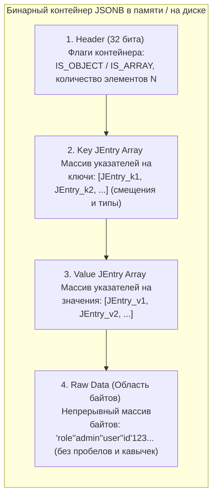

## Гибрид двух миров: SQL и NoSQL

В классической реляционной модели данных во главу угла ставится строгая схема (DDL): каждая колонка таблицы обязана иметь неизменный тип, размер и ограничения целостности. Это защищает базу от мусора, но в реальной разработке бэкенда мы непрерывно сталкиваемся с полуструктурированными данными переменного формата:
* Полезная нагрузка внешних вебхуков (`payload` от сторонних платежных шлюзов и API), чья внутренняя структура меняется без предупреждения.
* Пользовательские настройки и динамические флаги конфигурации, где новые параметры появляются каждую неделю.
* Аналитические события (Audit Logs, Events), набор атрибутов которых всецело зависит от конкретного типа совершенного действия.

Исторически для таких сценариев в архитектуру внедряли специализированные NoSQL-решения (подробнее об этом подходе мы рассуждаем в [[7. Document базы. MongoDB]]). Однако поддержка двух разнородных баз данных в одном контуре (реляционной СУБД для транзакций и NoSQL-кластера для документов) драматически усложняет эксплуатацию, настройку бэкапов и разрушает сквозную ACID-согласованность.

Инженеры PostgreSQL решили эту дилемму блестяще, внедрив нативную поддержку формата JSON. Настоящая технологическая революция произошла с релизом PostgreSQL 9.4, когда в ядре появился бинарный оптимизированный формат хранения **JSONB**.

---

## JSON vs JSONB: Почему вы должны забыть про тип JSON

В арсенале PostgreSQL присутствуют два типа данных для работы с документами: классический `json` и бинарный `jsonb`.

> [!tip] Собеседование
> **Вопрос:** В чем заключается принципиальная разница между типами `json` и `jsonb` в PostgreSQL, и какой из них следует выбирать в подавляющем большинстве задач?
> **Ответ:** Тип `json` сохраняет байт-в-байт точную копию входного текста (включая незначимые пробелы, табуляции, форматирование и даже дубликаты ключей). При каждом выполнении `SELECT`, фильтрации или извлечении вложенного поля сервер вынужден заново запускать синтаксический парсер по всей строке.  
> Тип `jsonb` (где суффикс **B** означает **Binary**) при выполнении `INSERT` берет на себя накладные расходы по первичному парсингу: валидирует синтаксис, удаляет пробелы, отбрасывает дубликаты ключей (сохраняя только последнее значение) и сортирует ключи по алфавиту. Зато данные упаковываются в специализированное бинарное дерево, которое поддерживает индексный доступ и позволяет извлекать вложенные поля за $O(1)$ или $O(\log N)$ без повторного парсинга. **В 99% случаев на практике следует безоговорочно использовать `jsonb`.**

---

### Mechanical Sympathy: Внутреннее устройство JSONB под капотом

Как физически `jsonb` укладывается в 8-килобайтную страницу дискового хранилища Heap ([[2. Storage engine PostgreSQL]])?

PostgreSQL не хранит внутри `jsonb` текстовые токены или кавычки. Данные компилируются в бинарную структуру, во главе которой находится плоский массив метаописателей — **JEntry (JSON Entry)**.

`JEntry` представляет собой 32-битное машинное слово, кодирующее тип элемента (число, строка, boolean, null, вложенный объект или массив) и байтовое смещение (`offset`) до его фактического тела в блоке полезной нагрузки:



Когда ваше Go-приложение отправляет запрос:
```sql
SELECT data->'user'->>'email' FROM events;
```
движок PostgreSQL не парсит текстовый JSON. Поскольку массив ключей в `Key JEntry Array` отсортирован на этапе вставки, PostgreSQL выполняет классический **бинарный поиск ($O(\log N)$)** прямо по смещениям в оперативной памяти, вычисляет точный диапазон байтов нужного ключа в секции `Raw Data` и мгновенно считывает значение.

Если результирующий размер документа `jsonb` превышает порог в 2 КБ, в дело автоматически вступает механизм **TOAST**: документ сжимается алгоритмом LZ4 или pglz и нарезается на чанки по 2 КБ в отдельной системной таблице, оставляя в Heap-странице легковесный указатель.

---

## Основные операторы извлечения и поиска

PostgreSQL предоставляет богатый инструментарий компактных операторов для навигации по бинарным JSONB-деревьям:

1. **`->` (Стрелка)**: Извлекает поле объекта или элемент массива по ключу/индексу. Возвращает результат в виде типа **`jsonb`**. Идеален для построения цепочек вложенной навигации (`data->'user'->'address'`).
2. **`->>` (Двойная стрелка)**: Извлекает поле и преобразует его в скалярный текст (**`text`**). Всегда ставится в самом конце цепочки выборки для получения прикладной строки в Go.
3. **`#>` и `#>>` (Решетка со стрелками)**: Извлечение значения по массиву путей. Например, выражение `data #>> '{user, profile, email}'` эквивалентно `data->'user'->'profile'->>'email'`, но записывается гораздо лаконичнее.
4. **`@>` (Оператор включения / Contains)**: Проверяет, содержит ли левый JSONB-документ внутри себя структуру правого JSONB-документа. **Это самый важный оператор для ускорения выборок через индексы!**

Примеры практических SQL-запросов:

```sql
-- Точечное извлечение текста из вложенного объекта
SELECT payload->'user'->>'email' AS email 
FROM events 
WHERE id = 1;

-- Поиск через оператор "содержит" (высочайшая скорость при наличии GIN-индекса)
SELECT id 
FROM events 
WHERE payload @> '{"user": {"role": "admin"}}';
```

---

## Индексация документов через GIN (Generalized Inverted Index)

Классический индекс B-Tree ([[4. Индексы в PostgreSQL]]) великолепен при сравнении скалярных значений (`=`, `<`, `>`). Но если перед нами стоит задача найти документ, в котором *где-то в глубине* ключ `role` равен `'admin'`, B-Tree бессилен: он может проиндексировать документ только как неделимый монолитный массив байтов.

Для полуструктурированных деревьев применяется **GIN (Generalized Inverted Index — Обобщенный инвертированный индекс)**.  
GIN «взрывает» документ на элементарные составляющие (пары "путь-ключ-значение") и формирует инвертированную карту: *какой термин в каких физических строках таблицы (`CTID`) встречается*.

В PostgreSQL предусмотрено два фундаментальных класса операторов (Operator Classes) для построения GIN-индексов по JSONB:

### 1. Дефолтный класс: `jsonb_ops`
```sql
CREATE INDEX idx_payload ON events USING gin (payload);
```
При таком определении GIN индексирует абсолютно каждый ключ и каждое отдельное значение как независимые элементы.  
* **Преимущества:** Поддерживает широкий спектр операторов поиска: проверку наличия ключа (`?`), проверку наличия любого из ключей (`?|`), всех ключей (`?&`) и оператор включения (`@>`).
* **Недостатки:** Индекс получается тяжелым, занимает огромный объем дискового пространства и существенно замедляет операции `INSERT`/`UPDATE`.

### 2. Оптимизированный класс путей: `jsonb_path_ops`
```sql
CREATE INDEX idx_payload_path ON events USING gin (payload jsonb_path_ops);
```
Вместо раздельного индексирования ключей и значений, `jsonb_path_ops` вычисляет 32-битный хэш от **полного пути к значению** (например, хэш цепочки `user.role.admin`).  
* **Преимущества:** Индекс получается в 2–3 раза компактнее, строится значительно быстрее и требует в разы меньше оперативной памяти в `shared_buffers`.
* **Ограничение:** Поддерживает **исключительно оператор включения `@>`**. Если ваша бизнес-логика в Go всегда формулирует условия вида `WHERE payload @> '{"status": "active"}'`, безоговорочно выбирайте `jsonb_path_ops`!

---

## Интеграция с языком Go

Взаимодействие Go с колонками `jsonb` не требует тяжеловесных ORM: стандартный интерфейс `database/sql` и современный драйвер `pgx` предоставляют два чистых архитектурных паттерна:

### Паттерн 1: Прозрачный проброс через `json.RawMessage`
Идеально подходит для шлюзов и API, когда Go-сервис выступает транзитным звеном: читает JSON из базы данных и без десериализации отдает его в HTTP-ответ:

```go
package main

import (
	"database/sql"
	"encoding/json"
)

type Event struct {
	ID      int
	Payload json.RawMessage // Алиас к []byte: откладывает десериализацию
}

func GetEvent(db *sql.DB, id int) (*Event, error) {
	var e Event
	err := db.QueryRow("SELECT id, payload FROM events WHERE id = $1", id).Scan(&e.ID, &e.Payload)
	if err != nil {
		return nil, err
	}
	return &e, nil
}
```

### Паттерн 2: Строгая типизация через `sql.Scanner` и `driver.Valuer`
Когда структура документа стабильна, идиоматично мапить `jsonb` непосредственно в строго типизированную структуру Go. Для этого тип обязан реализовать два интерфейса: `driver.Valuer` (маршалинг при записи в базу) и `sql.Scanner` (демаршалинг при вычитке из базы):

```go
package main

import (
	"database/sql/driver"
	"encoding/json"
	"errors"
	"fmt"
)

type Config struct {
	Theme string `json:"theme"`
	Limit int    `json:"limit"`
}

// Реализация driver.Valuer (Go -> PostgreSQL JSONB)
func (c Config) Value() (driver.Value, error) {
	return json.Marshal(c)
}

// Реализация sql.Scanner (PostgreSQL JSONB -> Go)
func (c *Config) Scan(value interface{}) error {
	b, ok := value.([]byte)
	if !ok {
		return errors.New("type assertion to []byte failed")
	}
	return json.Unmarshal(b, c)
}
```

---

## Ловушки и Антипаттерны

> [!warning] Ловушка / Gotcha: Мутация JSONB наносит сокрушительный удар по базе
> Самая опасная ошибка при работе с `jsonb` — попытка точечно обновлять поля гигантского документа частыми `UPDATE`-запросами:
> ```sql
> UPDATE users SET data = jsonb_set(data, '{last_login}', '"2026-04-24"');
> ```
> Вспомним устройство хранилища из лекции [[3. MVCC в PostgreSQL]]: PostgreSQL физически **не умеет модифицировать страницы на месте**.  
> Даже если ваш JSONB-документ весит 500 КБ, а вы обновили в нем метку времени длиной 10 байт, СУБД создаст **абсолютно новую физическую копию** всех 500 килобайт данных, запишет ее в новые чанки TOAST, сгенерирует новые записи в WAL и обновит индексные деревья, а старый полумегабайтный блок превратится в мертвый мусор для Autovacuum!  
> **Инженерный принцип:** Если колонка обновляется с высокой частотой (счетчики кликов, балансы, токены, статусы, даты последней активности) — выносите ее в отдельный реляционный столбец (`INT`, `TIMESTAMPTZ`). Оставляйте в `jsonb` только то, что читается как единое целое и изменяется редко.

**Другие типичные антипаттерны:**
1. **Массивы сущностей внутри JSONB:** Хранение списков `[{"id": 1}, {"id": 2}]` внутри `jsonb`. Если вашему коду требуется искать элемент по внутреннему ID, обновлять его статус или выполнять `JOIN` — это прямой сигнал, что вам необходима классическая нормализованная таблица со связью один-ко-многим.
2. **Схемы, поддающиеся нормализации:** Если все документы в вашей таблице имеют строго одинаковый набор полей `{"name": "...", "age": ...}`, использование `jsonb` является неоправданным усложнением. Вы теряете валидацию на уровне БД, контроль типов и тратите такты процессора на десериализацию.

---

## Резюме для инженера

1. **Только `jsonb`:** Забудьте про тип `json`. Бинарный `jsonb` форматируется при записи и обеспечивает мгновенный доступ к полям без разбора всей строки.
2. **JEntry и бинарный поиск:** Документ хранится в виде плоского массива указателей и значений, что превращает извлечение по ключу в эффективный бинарный поиск в памяти.
3. **Индексация GIN:** Для поиска подструктур через оператор `@>` используйте легковесный индекс `GIN (jsonb_path_ops)`: `CREATE INDEX idx_payload_path ON events USING gin (payload jsonb_path_ops);`.
4. **Осторожно с обновлениями:** Частые точечные `jsonb_set` приводят к лавинообразному раздуванию таблиц (Table Bloat) из-за особенностей MVCC.

GIN-индексы открывают дорогу не только к молниеносной работе с JSON, но и решают другую фундаментальную задачу современного бэкенда: поиск по неструктурированному тексту естественного языка (стемминг, словоформы, ранжирование). Как реализовать производительный поиск прямо внутри PostgreSQL без привлечения внешних тяжеловесных систем вроде Elasticsearch — разберем в следующей лекции: [[6. Full Text Search]].