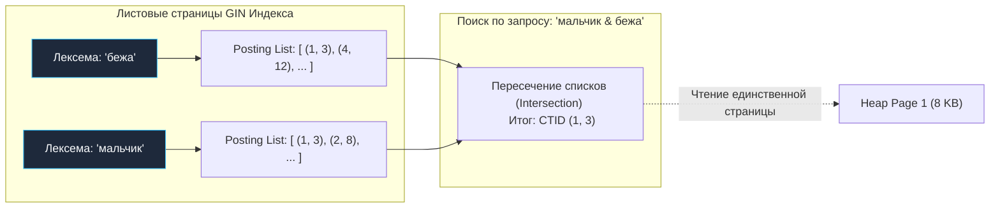

Если в вашем приложении на Go возникает бизнес-требование «реализовать быстрый поиск по каталогу товаров, статьям блога или сообщениям пользователей», первое интуитивное (и самое опасное) решение — написать запрос с оператором `LIKE '%query%'`:

```sql
SELECT * FROM articles WHERE content LIKE '%query%';
```

Однако оператор `LIKE '%...'` страдает двумя фатальными пороками:
1. **Алгоритмическая деградация $O(N)$:** Символ подстановки `%` в начале шаблона делает невозможным использование классического B-Tree индекса. Сервер вынужден запустить Sequential Scan, методично считывая с диска в память абсолютно каждую 8-килобайтную страницу таблицы Heap.
2. **Полная лингвистическая слепота:** `LIKE` производит побайтовое сравнение подстрок. Запрос `LIKE '%бег%'` никогда не найдет слово «бежал» или «бегущий», а поиск `LIKE '%apple%'` проигнорирует форму множественного числа «apples».

Второй порыв инженера — немедленно затащить в архитектуру внешний поисковый движок вроде **Elasticsearch** или OpenSearch. Но этот путь часто оказывается классическим преждевременным усложнением (Overengineering). Внешний кластер порождает болезненную проблему **двойной записи (Dual Write)**: транзакция в базе данных уже завершилась, а событие в поисковый индекс еще не доехало или потерялось из-за сетевого сбоя. В итоге данные неизбежно рассинхронизируются, а команда вынуждена обслуживать дополнительную распределенную систему на JVM с собственным мониторингом и репликацией.

В 95% прикладных задач бэкенда для полнотекстового поиска (Full Text Search, FTS) более чем достаточно встроенных возможностей PostgreSQL. Они работают транзакционно согласованно, не требуют сетевых прыжков и демонстрируют выдающуюся скорость, если понимать их физическое устройство.

---

## Фундаментальные типы данных: tsvector и tsquery

В ядре PostgreSQL полнотекстовый поиск базируется на двух специализированных типах данных, преобразующих неструктурированный текст в математически строгие множества лексем.

### 1. `tsvector` (Текстовый вектор документа)
PostgreSQL принципиально не производит поиск по сырым текстовым строкам `TEXT` или `VARCHAR`. Текст предварительно нормализуется и компилируется в тип **`tsvector`** — отсортированный массив уникальных нормальных форм слов (**лексем**, lexemes) с фиксацией их порядковых позиций в исходном документе:

```sql
SELECT to_tsvector('russian', 'Мальчик быстро бежал по улице, пока другие мальчики играли');
-- Результат: 'бежа':3 'быстр':2 'друг':7 'игра':9 'мальчик':1,8 'пок':6 'улиц':5
```

Обратите внимание: слова «Мальчик» и «мальчики» склеились в единую лексему `'мальчик'`, а числа `1,8` указывают, на каких позициях в предложении это слово встречалось.

> [!info] Под капотом: Конвейер лингвистической обработки
> Когда вызывается функция `to_tsvector()`, текст проходит через трехстадийный C-пайплайн:
> 1. **Парсер (Parser):** Разрезает поток символов на элементарные токены (слова, числа, email, пути файловой системы). Знаки препинания и спецсимволы отбрасываются.
> 2. **Словарь стоп-слов (Stop-words):** Служебные части речи, союзы и предлоги («по», «в», «на», «и»), которые не несут уникальной смысловой нагрузки и встречаются в каждом документе, безжалостно вычищаются, экономя память.
> 3. **Словарь стемминга (Snowball Stemmer):** По правилам морфологии выбранного языка (например, `'russian'` или `'english'`) отсекает окончания и суффиксы, приводя слова к неизменяемой основе (корню-лексеме).


---

### 2. `tsquery` (Дерево поискового запроса)
Поисковая фраза пользователя точно так же нормализуется и трансформируется в тип **`tsquery`**. Это не просто строка, а логическое булево дерево предикатов.

В `tsquery` поддерживаются классические логические операторы:
* `&` (AND — логическое И)
* `|` (OR — логическое ИЛИ)
* `!` (NOT — логическое отрицание)
* `<->` (Followed by — оператор фразового расстояния, требующий, чтобы слова следовали строго друг за другом)

```sql
SELECT to_tsquery('russian', 'мальчик & (бег | игра)');
-- Результат: 'мальчик' & ( 'бег' | 'игр' )
```

Сопоставление документа и запроса выполняется с помощью специализированного оператора совпадения **`@@`**:

```sql
SELECT to_tsvector('russian', 'Мальчик играл') @@ to_tsquery('russian', 'мальчик & игра');
-- Результат: true
```

---

## Индексация: GIN под капотом полнотекстового поиска

Вычисление функции `to_tsvector()` "на лету" при каждом пользовательском `SELECT` моментально сожжет ресурсы CPU. Полнотекстовые векторы обязаны быть проиндексированы.

Для этой задачи идеально подходит знакомый нам по лекции [[5. JSONB и работа с JSON]] инвертированный индекс **GIN (Generalized Inverted Index)**.  
В листовых узлах GIN-дерева в качестве ключей хранятся уникальные лексемы всех проиндексированных документов, а в качестве значений — упорядоченные списки физических адресов (`CTID`) страниц Heap, где эти лексемы присутствуют.



> [!warning] Ловушка / Gotcha: Индекс по выражению против Generated Columns
> Начинающие разработчики часто создают индекс прямо по функциональному выражению:
> ```sql
> CREATE INDEX idx_fts ON articles USING GIN (to_tsvector('russian', content));
> ```
> Это работает, но таит серьезные производственные риски. Если настройки словарей или локаль СУБД изменятся, функциональный индекс может стать невалидным, а функции `VACUUM` и оптимизатор не смогут адекватно собрать статистику.  
> 
> **Production-ready стандарт (начиная с PostgreSQL 12):** Использование генерируемых колонок (**Generated Columns**). Поле создается как постоянный физический атрибут таблицы, автоматически обновляемый движком при любых `INSERT`/`UPDATE`:

```sql
ALTER TABLE articles 
ADD COLUMN search_vector tsvector 
GENERATED ALWAYS AS (to_tsvector('russian', title || ' ' || content)) STORED;

CREATE INDEX idx_articles_search ON articles USING GIN (search_vector);
```

Теперь запрос вида `WHERE search_vector @@ to_tsquery('...')` будет выполняться за доли миллисекунды прямо по GIN-индексу.

---

## Ранжирование (Ranking): Сортировка по релевантности

Найти подходящие строки в базе — только половина дела. Пользователь ожидает увидеть наиболее релевантные совпадения на первых позициях выдачи.  
Для вычисления коэффициента релевантности в PostgreSQL используются функции:
* **`ts_rank(tsvector, tsquery)`**: Базовый подсчет частоты встречаемости лексем (TF-IDF модель).
* **`ts_rank_cd(tsvector, tsquery)`**: Функция Cover Density — дополнительно учитывает физическое расстояние между искомыми словами внутри текста (слова, стоящие рядом в одном предложении, получают существенно больший вес).

Обе функции возвращают число типа `float4`: чем значение выше, тем точнее совпадение.

```sql
SELECT id, title, ts_rank(search_vector, query) as rank
FROM articles, to_tsquery('russian', 'горутины & каналы') query
WHERE search_vector @@ query
ORDER BY rank DESC
LIMIT 10;
```

---

### Mechanical Sympathy: Почему ранжирование может обвалить базу?

> [!tip] Собеседование
> **Вопрос:** Вы внедрили полнотекстовый поиск по статьям с GIN-индексом. Поисковый запрос с фильтром `WHERE search_vector @@ ...` отрабатывает молниеносно за 2 миллисекунды. Однако стоит добавить сортировку `ORDER BY ts_rank(...)`, как время выполнения деградирует до 600 миллисекунд! В чем физическая причина просадки?
> **Ответ:** Это фундаментальное ограничение архитектуры GIN. Индекс GIN хранит информацию о том, *в каких строках таблицы* встречаются лексемы, но ради экономии оперативной памяти листовые узлы GIN **не содержат детальной позиционной информации обо всех контекстах слова**.  
> Чтобы вычислить математическую формулу `ts_rank()`, исполнитель запроса вынужден совершить «прыжок в Кучу» (**Heap Fetch**) для *каждой* совпавшей строки: поднять с SSD 8-килобайтную страницу, извлечь тело `search_vector` и выполнить расчет ранга на CPU. Если запросу соответствуют 50 000 статей, база совершит 50 000 случайных чтений страниц Heap!  
> **Инженерное решение:** Никогда не ранжируйте всю выборку целиком. Ограничьте предварительный пул кандидатов (например, топ-500 свежих статей по дате или релевантной категории) через подзапрос или CTE, и лишь затем применяйте `ts_rank` к компактному срезу строк.

---

## Безопасная интеграция с языком Go

Типичная авария в Go-сервисах: пользователь вводит в строку поиска `"iphone 15 pro"`. Если разработчик наивно передаст эту строку в стандартную функцию `to_tsquery('iphone 15 pro')`, PostgreSQL вернет ошибку синтаксиса `syntax error in tsquery: "iphone 15 pro"`, поскольку `to_tsquery` ожидает строгого наличия логических операторов (`&`, `|`), требуя формат вроде `iphone & 15 & pro`.

Попытка «чинить» это в коде на Go через наивную склейку:
```go
// АНТИПАТТЕРН: Приведет к падению при вводе скобок, амперсандов или кавычек!
safeQuery := strings.ReplaceAll(q, " ", " & ") 
```
недопустима в промышленном коде.

Начиная с версии PostgreSQL 11, введена специализированная функция **`websearch_to_tsquery()`**. Она реализует привычный всем синтаксис веб-поисковиков:
* Пробелы автоматически трактуются как оператор `AND`.
* Фразы в кавычках (`"go runtime"`) превращаются в оператор фразового поиска `<->`.
* Префикс минус (`-исключение`) трансформируется в оператор отрицания `!`.
* Функция **никогда не выбрасывает синтаксических исключений**, даже при наличии мусорных спецсимволов.

### Идиоматичный Go-репозиторий с оптимизацией ранжирования

```go
package repository

import (
	"context"
	"database/sql"
	"fmt"
)

type Article struct {
	ID    int
	Title string
	Rank  float32
}

// SearchArticles выполняет высокопроизводительный FTS с защитой от Random I/O
func SearchArticles(ctx context.Context, db *sql.DB, userInput string) ([]Article, error) {
	// 1. Используем websearch_to_tsquery для парсинга пользовательской строки
	// 2. С помощью CTE ограничиваем объем строк для ранжирования первыми 500 записями
	const query = `
		WITH matched AS (
			SELECT id, title, search_vector
			FROM articles
			WHERE search_vector @@ websearch_to_tsquery('russian', $1)
			ORDER BY created_at DESC 
			LIMIT 500
		)
		SELECT 
			id, 
			title, 
			ts_rank(search_vector, websearch_to_tsquery('russian', $1)) AS rank
		FROM matched
		ORDER BY rank DESC
		LIMIT 10;
	`

	rows, err := db.QueryContext(ctx, query, userInput)
	if err != nil {
		return nil, fmt.Errorf("search query failed: %w", err)
	}
	defer rows.Close()

	var results []Article
	for rows.Next() {
		var a Article
		if err := rows.Scan(&a.ID, &a.Title, &a.Rank); err != nil {
			return nil, fmt.Errorf("row scan failed: %w", err)
		}
		results = append(results, a)
	}

	if err := rows.Err(); err != nil {
		return nil, fmt.Errorf("rows iteration error: %w", err)
	}

	return results, nil
}
```

---

## Резюме для инженера

1. **Встроенный FTS решает проблему Dual Write:** Использование возможностей PostgreSQL избавляет систему от рассинхронизации данных и накладных расходов на кластер Elasticsearch.
2. **Тандем `tsvector` и `tsquery`:** Текст преобразуется в лексемы через стемминг и стоп-слова, а запросы строятся в виде булевых деревьев.
3. **Generated Columns + GIN:** Создавайте постоянные вычисляемые колонки `tsvector` и покрывайте их GIN-индексами для предсказуемой производительности.
4. **Безопасность ввода:** Всегда применяйте `websearch_to_tsquery` вместо `to_tsquery` при обработке данных от пользователей.
5. **Осторожность с `ts_rank`:** Функция требует физического чтения страниц Heap. Ограничивайте выборку кандидатов через CTE перед сортировкой по релевантности.

PostgreSQL впечатляет богатством стандартных возможностей — от JSONB до полнотекстового поиска. Но его истинное величие кроется в модульной природе: вы можете динамически загружать сторонние скомпилированные C-библиотеки прямо в рантайм базы данных, наделяя ее новыми типами данных, индексами и фоновыми процессами. О том, как устроена экосистема расширений — в следующей лекции: [[7. Расширения PostgreSQL]].