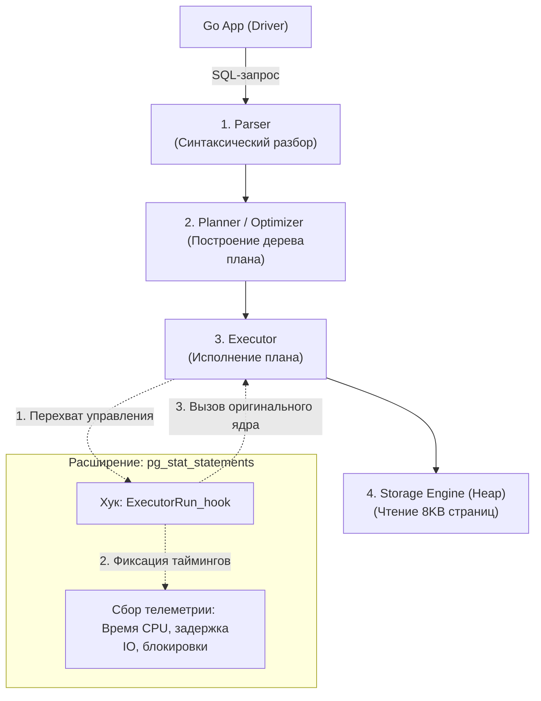
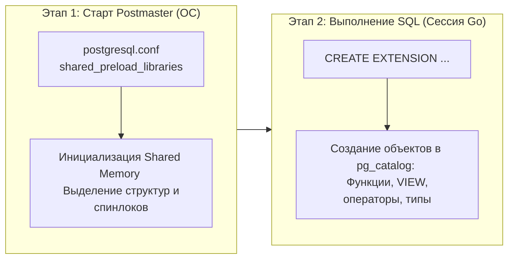
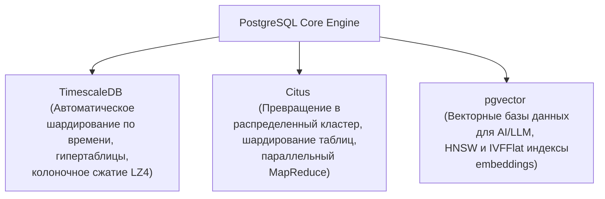

В предыдущей лекции мы увидели, как PostgreSQL реализует [[6. Full Text Search]] своими силами, без необходимости разворачивать внешний кластер. Однако истинная мощь и уникальность этой СУБД заключается не в том, сколько готовых возможностей разработчики успели «зашить» в базовый бинарник, а в том, что PostgreSQL изначально проектировался как **расширяемый программный каркас (фреймворк) для создания баз данных**.

Если вашей предметной области не хватает стандартных индексных структур, экзотических типов данных или даже классической строковой модели хранения (например, вам требуется колоночная аналитика, работа с графами, векторный поиск для LLM или хранилище временных рядов Time-Series), вам не нужно менять СУБД и переписывать бэкенд на Go. Вы можете изменить сам PostgreSQL, динамически подключив к нему **Расширение (Extension)**.

Для бэкенд-инженера понимание архитектуры расширений критически важно: именно они превращают «просто реляционную базу» в мощнейший швейцарский нож, способный в рамках единой инсталляции заменить Redis, Elasticsearch, ClickHouse или InfluxDB.

---

## Архитектура C-плагинов и система хуков (Hook System)

Ядро PostgreSQL написано на чистом языке C в строгих традициях Unix и Bell Labs. Архитектурно СУБД спроектирована так, чтобы динамически компоновать скомпилированные разделяемые C-библиотеки (файлы `.so` в Linux или `.dll` в Windows) прямо в виртуальное адресное пространство процессов PostgreSQL — как в дочерние серверные обработчики (Backend Processes), так и в управляющий процесс Postmaster (разобранный в [[1. Архитектура PostgreSQL]]).

Когда разделяемая библиотека подгружается в память, она получает прямой доступ к внутреннему API рантайма PostgreSQL через **Систему Хуков (Hook System)**.

### Как физически устроены хуки?
По всему исходному коду ядра PostgreSQL (в модуле синтаксического разбора `Parser`, логическом оптимизаторе `Planner` и конвейере выполнения `Executor`) объявлены глобальные указатели на функции. По умолчанию эти указатели равны `NULL` или ведут на базовые реализации ядра.

Когда расширение инициализируется в оперативной памяти:
1. Оно считывает адрес стандартного обработчика из глобального указателя.
2. Сохраняет этот адрес в собственной локальной переменной (чтобы не разорвать цепочку вызовов).
3. **Подменяет глобальный указатель на собственную функцию-перехватчик**.



Когда ядро доходит до шага выполнения плана, оно вызывает `ExecutorRun_hook`. Управление мгновенно передается в код расширения: плагин замеряет такты CPU, инспектирует буферы ввода-вывода, выполняет служебные действия и возвращает поток управления стандартному коду базы данных.

> [!info] Под капотом: Обратная сторона нативной C-скорости
> Поскольку расширения исполняются в том же пространстве пользователя (Ring 3) и в том же адресном пространстве процесса ОС, что и рабочий Backend-процесс, они обладают феноменальной скоростью: расширение читает буферы `shared_buffers` напрямую из оперативной памяти без единого системного вызова к ядру Linux.  
> Однако платой за эту скорость является **риск стабильности**. Если в коде стороннего C-расширения допущена ошибка с разыменованием нулевого указателя или порчей памяти, операционная система немедленно пошлет процессу сигнал `SIGSEGV` (Segmentation Fault). Рабочий процесс аварийно завершится, клиентское Go-приложение получит обрыв TCP-сокета (`connection reset by peer`), а Postmaster будет вынужден инициировать процедуру восстановления разделяемой памяти, сбросив соединения остальных параллельных клиентов. Всегда используйте только зрелые, проверенные сообществом расширения!

---

## Два этапа жизненного цикла расширения

Распространенная ошибка начинающих разработчиков — путаница между системной загрузкой разделяемой библиотеки и ее активацией в схеме базы данных. Это два принципиально разных этапа.



### 1. Загрузка разделяемой библиотеки (`shared_preload_libraries`)
Если расширению требуется глобальное разделяемое состояние (Shared Memory) для координации между всеми процессами БД или запуск собственных фоновых демонов (Background Workers), оно обязано быть загружено **в момент первичного старта Postmaster**.

Для этого библиотека явно прописывается в конфигурационном файле `postgresql.conf`:
```ini
shared_preload_libraries = 'pg_stat_statements, timescaledb'
```
*Изменение этого параметра требует обязательного физического перезапуска экземпляра PostgreSQL (`systemctl restart postgresql`).*

### 2. Регистрация объектов в каталоге (`CREATE EXTENSION`)
Даже если код библиотеки уже загружен в оперативную память Postmaster, конкретная логическая база данных не знает о доступных функциях, типах данных и представлениях. Для их регистрации в целевой БД выполняется SQL-команда:
```sql
CREATE EXTENSION IF NOT EXISTS pg_stat_statements;
```
Эта команда находит управляющий control-файл расширения (например, `pg_stat_statements.control`), исполняет SQL-скрипт установки и вносит сигнатуры функций и представлений в системный каталог `pg_catalog`.

> [!tip] Собеседование
> **Вопрос:** Разработчик выполнил команду `CREATE EXTENSION pg_stat_statements;` в новой базе данных, но при попытке сделать выборку `SELECT * FROM pg_stat_statements;` получает фатальную ошибку: `pg_stat_statements must be loaded via shared_preload_libraries`. В чем физическая причина ошибки?
> **Ответ:** Команда `CREATE EXTENSION` лишь регистрирует интерфейс: она создает системное представление `VIEW` и связывает его с сигнатурами C-функций в каталоге. Однако для своей фактической работы модуль `pg_stat_statements` обязан непрерывно агрегировать счетчики со *всех* параллельных Backend-процессов кластера.  
> Для этого ему требуется монолитный сегмент разделяемой памяти (Shared Memory), защищенный быстрыми атомарными счетчиками и спинлоками (spinlocks). Выделить такой разделяемый сегмент операционная система может только в момент инициализации главного процесса Postmaster через конфигурационный параметр `shared_preload_libraries`. Без перезапуска с этим флагом разделяемая память физически отсутствует.

---

## Промышленные расширения первой необходимости (Must-Have)

Среди тысяч доступных плагинов существует проверенная временем классика, присутствующая практически в любом высоконагруженном production-проекте:

### 1. `pg_stat_statements` (Сквозная наблюдаемость)
Без этого расширения профессиональная эксплуатация и оптимизация PostgreSQL в production попросту невозможны.  
Плагин перехватывает этап исполнения запросов (`ExecutorRun_hook`) и накапливает в разделяемой памяти сводную телеметрию по каждому уникальному шаблону SQL-запроса (параметры `$1, $2` заменяются плейсхолдерами, объединяя тысячи однотипных запросов в единую запись).

`pg_stat_statements` дает точные ответы на фундаментальные вопросы:
* Какие запросы генерируют наибольшую нагрузку на процессор (`total_exec_time` / `mean_exec_time`)?
* Какие запросы вымывают полезные страницы из кэша, вызывая шторм физического чтения с SSD (`shared_blks_read` против `shared_blks_hit`)?
* Подробнее об анализе этих метрик мы поговорим в лекции [[19. Observability БД]].

### 2. `pg_trgm` (Полнотекстовый и нечеткий поиск по триграммам)
В предыдущей статье мы выяснили, что префиксный `LIKE '%query%'` приводит к Sequential Scan. Расширение `pg_trgm` элегантно решает эту проблему, разбивая текст на триграммы — перекрывающиеся цепочки из 3 символов подряд (например, слово `'foo'` порождает триграммы `'  f'`, `' fo'`, `'foo'`, `'oo '`).

`pg_trgm` добавляет специализированный класс операторов для GIN-индексов (`gin_trgm_ops`), позволяя индексировать произвольные подстроки и производить нечеткий поиск (Fuzzy Search):

```sql
CREATE EXTENSION pg_trgm;

-- Создаем GIN-индекс по триграммам email
CREATE INDEX idx_users_email_trgm ON users USING GIN (email gin_trgm_ops);

-- Запрос с wildcard в начале теперь использует индекс и отрабатывает за доли миллисекунды:
SELECT * FROM users WHERE email ILIKE '%@gmail.com%';
```

### 3. `pgcrypto` (Криптография внутри базы данных)
Предоставляет криптографические примитивы (хеширование паролей алгоритмом bcrypt, HMAC, AES-шифрование), исполняемые непосредственно на сервере БД без передачи чувствительных открытых ключей и паролей по сети в Go-сервис.  
Исторически расширение использовалось для генерации случайных идентификаторов через `gen_random_uuid()`, но начиная с PostgreSQL 13 эта функция стала стандартной частью ядра (хотя модуль `uuid-ossp` по-прежнему востребован для генерации UUIDv1 по времени и MAC-адресу).

---

## Архитектурные расширения, меняющие парадигму СУБД

Некоторые расширения представляют собой настолько масштабные инженерные системы, что они полностью меняют внутреннее устройство хранилища и превращают PostgreSQL в специализированные платформы:



1. **TimescaleDB:**  
   Трансформирует классический PostgreSQL в мощнейшую платформу для обработки временных рядов (Time-Series Database, TSDB). Автоматически разрезает таблицы на временные интервалы («чанки»), реализует аналитические оконные функции и сжимает устаревшие данные в гибридный колоночный формат (Columnar Storage), уменьшая занимаемое дисковое пространство в 10–20 раз при сохранении полной поддержки SQL.
2. **Citus:**  
   Превращает одиночный PostgreSQL в горизонтально масштабируемый распределенный кластер. Citus прозрачно реализует шардирование данных ([[4. Sharding]]) по десяткам физических серверов: для Go-приложения кластер выглядит как один обычный инстанс PostgreSQL, а Citus самостоятельно распределяет SQL-запросы по координаторам и объединяет ответы по принципу MapReduce.
3. **pgvector:**  
   Современный стандарт де-факто для хранения и поиска векторных представлений (Embeddings) в эпоху искусственного интеллекта и Large Language Models (LLM). Внедряет векторные типы данных и алгоритмы приближенного поиска ближайших соседей (HNSW, IVFFlat), избавляя команды от необходимости эксплуатировать специализированные векторные БД вроде Pinecone или Milvus.

---

## Резюме для инженера

1. **Расширяемый каркас:** Архитектура PostgreSQL построена на модульных C-библиотеках и глобальной системе хуков (`ExecutorRun_hook`, `Planner_hook`), перехватывающих внутренние этапы обработки запросов.
2. **Низкоуровневая скорость и ответственность:** Плагины работают в общем адресном пространстве с ядром СУБД и читают `shared_buffers` напрямую, но аппаратный сбой или Segfault в коде расширения может вызвать аварийный перезапуск сессии.
3. **Разделяемая память требует рестарта:** Системные расширения (такие как `pg_stat_statements`) резервируют сегменты Shared Memory и настраиваются через параметр `shared_preload_libraries` с последующим перезапуском Postmaster.
4. **Универсальность экосистемы:** Расширения `pg_stat_statements`, `pg_trgm`, `TimescaleDB` и `pgvector` закрывают колоссальный спектр инфраструктурных потребностей силами единой реляционной платформы.

Способность PostgreSQL адаптировать специализированные структуры данных и алгоритмы поиска сделала его абсолютным мировым стандартом в еще одной сложнейшей инженерной дисциплине — обработке геопространственных данных, геометрии и картографии. О флагманском гео-расширении — в следующей лекции: [[8. PostGIS]].