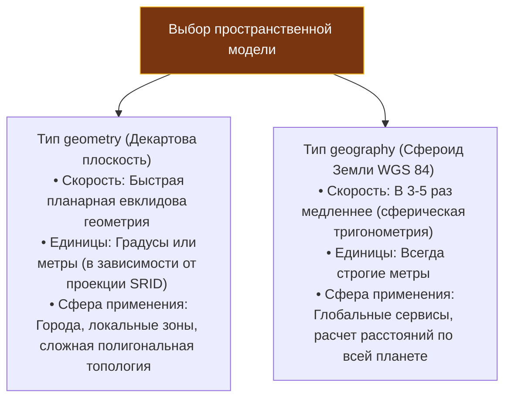
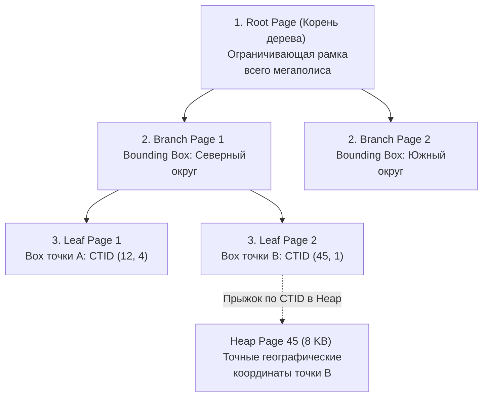

В предыдущей лекции мы выяснили, что архитектура PostgreSQL позволяет динамически менять поведение СУБД с помощью разделяемых C-библиотек ([[7. Расширения PostgreSQL]]). Самым грандиозным и признанным в мировой индустрии примером того, как плагин способен превратить реляционную систему в передовой географический информационный комплекс (ГИС), является **PostGIS**.

Если ваш сервис на Go решает задачи райдшеринга (такси), доставки заказов курьерами, шеринга самокатов или мониторинга телеметрии автопарков, вам непрерывно приходится оперировать геопространственными данными.  
Исторически многие разработчики совершали наивную попытку: объявляли в таблицах колонки `latitude FLOAT8` и `longitude FLOAT8`, а расстояние между точками высчитывали прямо в коде по школьной теореме Пифагора. Но Земля — это не плоский лист миллиметровки, а геоид (сфероид). Чтобы рассчитать честную дугу на поверхности геоида, требуется сложная сферическая тригонометрия — **формула гаверсинуса (Haversine formula)**.

Попытка вычислять тригонометрию «на лету» для миллиона строк при каждом поиске ближайшего курьера моментально раскаляет CPU сервера до предела. А классические индексы B-Tree ([[4. Индексы в PostgreSQL]]) оказываются абсолютно бессильны: они умеют сортировать ключи лишь вдоль одной числовой оси, тогда как пространство принципиально двумерно.

PostGIS снимает эти проблемы, внедряя в ядро PostgreSQL геометрические типы данных, пространственные индексы на базе R-деревьев и сотни высокооптимизированных функций вычислительной геометрии.

---

## Geometry против Geography: Фундаментальный выбор модели мира

Первое архитектурное решение при проектировании гео-схемы — выбор между двумя типами данных: `geometry` и `geography`. Ошибка на этом шаге обойдется системе в гигабайты напрасно потраченной памяти и десятки миллисекунд сетевой задержки.



### 1. Тип `geometry` (Плоскостная евклидова геометрия)
Рассматривает координаты как точки на бесконечной декартовой плоскости ($X, Y$).
* **Преимущества:** Математика плоских векторов элементарна и обсчитывается процессором молниеносно. Поддерживает полный спектр пространственных операций: буферизацию, объединение, вычитание и поиск пересечений сколь угодно сложных многоугольников (полигонов).
* **Специфика измерений:** Если вы запишете в `geometry` обычные GPS-координаты (долготу и широту), расстояние между точками будет рассчитано в **градусах**, а не в метрах! Чтобы оперировать метрами, координаты необходимо проецировать на локальную плоскость с помощью соответствующего идентификатора пространственной системы координат — **SRID (Spatial Reference System Identifier)**, например локальной зоны UTM. Для базовых GPS-координат общепринятым стандартом является **SRID 4326 (WGS 84)**.

### 2. Тип `geography` (Сферическая геометрия Земли)
Моделирует поверхность планеты как эллипсоид вращения (по стандарту WGS 84).
* **Преимущества:** Идеален для расчетов по всему земному шару без ручного пересчета проекций. Расчетная функция `ST_Distance` сразу возвращает физическое расстояние в **метрах**.
* **Цена решения:** Любое геометрическое сопоставление требует тяжелых тригонометрических вычислений на CPU. Вычисления для `geography` выполняются в 3–5 раз медленнее, чем для `geometry`, а набор поддерживаемых операций ограничен базовыми проверками взаимного расположения.

> [!tip] Собеседование
> **Вопрос:** В каком типе данных предпочтительнее хранить координаты курьеров и адреса ресторанов для сервиса экспресс-доставки еды?
> **Ответ:** Если сервис оперирует в масштабах одного мегаполиса или локального региона (где кривизной земной поверхности можно пренебречь), наилучшую производительность обеспечит тип **`geometry`**, спроецированный в местную метрическую координатную сетку (например, UTM-зону). Это сэкономит такты CPU и обеспечит доступ ко всем топологическим функциям.  
> Если же строится трансграничная система (например, отслеживание авиаперевозок или международный сервис бронирования от Москвы до Владивостока) и разработчикам критична простота кода без ручного жонглирования десятками локальных SRID, оптимально выбрать тип **`geography`**, сознательно заложив запас по вычислительной мощности CPU.

---

## Mechanical Sympathy: Индексы GiST и R-Tree под капотом

Как сервер PostgreSQL умудряется отыскать 10 ближайших свободных курьеров в радиусе 3 километров среди 5 миллионов активных точек за 2–3 миллисекунды?

Для этого PostGIS задействует каркас обобщенных деревьев поиска **GiST (Generalized Search Tree)**, разворачивая внутри него алгоритмическую структуру **R-Tree (Region Tree)**.

В основе R-Tree лежит элегантный принцип иерархической кластеризации пространства на вложенные прямоугольники — **Bounding Boxes (Ограничивающие рамки)**:



### Алгоритм пространственного поиска:
1. Вокруг целевой точки поиска программно очерчивается минимальный габаритный прямоугольник (Bounding Box) заданного радиуса.
2. Исполнитель спускается по дереву GiST, молниеносно отсекая целые ветви (районы и кварталы), чьи ограничивающие рамки даже не касаются рамки запроса.
3. Достигнув листовых страниц, СУБД извлекает `CTID` тех единичных точек, чьи рамки пересеклись с поисковым окном.
4. Сервер совершает выборочные чтения страниц Heap ([[2. Storage engine PostgreSQL]]), загружает точные координаты кортежей и производит финальную фильтрацию (так как радиус поиска — это круг, а первичное отсечение по R-Tree производилось по квадратному Bounding Box).

---

### Оператор пересечения `&&` против ловушки `ST_Distance`

В повседневной разработке кроется классическая ошибка, способная положить базу данных при первом всплеске трафика.

> [!warning] Ловушка / Gotcha: Наивный поиск через `ST_Distance`
> **КАТАСТРОФА ДЛЯ ПРОИЗВОДИТЕЛЬНОСТИ (Sequential Scan):**
> ```sql
> SELECT id FROM couriers 
> WHERE ST_Distance(location, 'SRID=4326;POINT(37.6 55.7)'::geography) < 3000;
> ```
> Данный запрос **полностью проигнорирует GiST-индекс**! Планировщик не может вывести границы для R-дерева из выражения с неравенством `<`. Сервер запустит последовательное сканирование таблицы, вычитает абсолютно каждую страницу с диска и для всех 5 миллионов строк выполнит дорогостоящую тригонометрию `ST_Distance`.
> 
> **ПРАВИЛЬНЫЙ ИНДЕКСНЫЙ ЗАПРОС:**
> ```sql
> SELECT id FROM couriers 
> WHERE ST_DWithin(location, 'SRID=4326;POINT(37.6 55.7)'::geography, 3000);
> ```
> Функция `ST_DWithin` (Distance Within) фундаментально оптимизирована. Под капотом она неявно инициирует пространственный оператор пересечения **`&&`**: GiST-индекс за доли миллисекунды отсекает 99.9% строк таблицы по Bounding Box, и лишь для оставшихся нескольких десятков кандидатов база вычисляет точное расстояние.

---

## Интеграция с Go

Внутри 8-килобайтных страниц PostgreSQL пространственные объекты хранятся в эффективном бинарном представлении **EWKB (Extended Well-Known Binary)** с обязательным заголовком SRID. Если полигон состоит из тысяч вершин и превышает 2 КБ, он автоматически фрагментируется подсистемой TOAST.

При выборке `SELECT location FROM couriers` сервер по умолчанию вернет нечитаемый бинарный срез байтов EWKB. Для взаимодействия с Go существуют два проверенных подхода:

### Путь 1: Конвертация в JSONB на стороне БД (Самый популярный)
Мы можем заставить PostgreSQL отдавать геометрию в формате стандартного GeoJSON:

```go
package main

import (
	"context"
	"database/sql"
	"encoding/json"
	"fmt"
)

type CourierLocation struct {
	ID      int
	GeoJSON json.RawMessage
}

func GetCourierLocation(ctx context.Context, db *sql.DB, id int) (*CourierLocation, error) {
	const query = `
		SELECT id, ST_AsGeoJSON(location)::jsonb 
		FROM couriers 
		WHERE id = $1;
	`
	var cl CourierLocation
	if err := db.QueryRowContext(ctx, query, id).Scan(&cl.ID, &cl.GeoJSON); err != nil {
		return nil, fmt.Errorf("query courier failed: %w", err)
	}
	return &cl, nil
}

func InsertCourier(ctx context.Context, db *sql.DB, geoJSON string) error {
	const insertQuery = `
		INSERT INTO couriers (location) 
		VALUES (ST_SetSRID(ST_GeomFromGeoJSON($1), 4326));
	`
	_, err := db.ExecContext(ctx, insertQuery, geoJSON)
	return err
}
```

---

### Путь 2: Нативная бинарная работа (Highload)
Преобразование бинарной геометрии в текстовый JSON на стороне БД нагружает процессор PostgreSQL и кратно раздувает сетевой трафик между базой и Go. В высоконагруженных системах данные вычитываются по бинарному протоколу с помощью отраслевой библиотеки `github.com/twpayne/go-geom`.  
Она реализует интерфейсы `sql.Scanner` и `driver.Valuer`, позволяя мапить типы EWKB из PostgreSQL напрямую в структуры Go:

```go
package main

import (
	"context"
	"database/sql"
	"database/sql/driver"
	"fmt"

	"github.com/twpayne/go-geom"
	"github.com/twpayne/go-geom/encoding/ewkb"
)

type Courier struct {
	ID       int
	Location *geom.Point
}

func FetchCourierBinary(ctx context.Context, db *sql.DB, id int) (*Courier, error) {
	// Библиотека go-geom реализует sql.Scanner и driver.Valuer для прямого парсинга байтов EWKB
	var p ewkb.Point
	err := db.QueryRowContext(ctx, "SELECT location FROM couriers WHERE id = $1", id).Scan(&p)
	if err != nil {
		return nil, fmt.Errorf("scan ewkb point failed: %w", err)
	}

	return &Courier{
		ID:       id,
		Location: p.Point,
	}, nil
}
```

Этот подход исключает промежуточную сериализацию в JSON, радикально снижает аллокации памяти в куче Go (Heap Allocations) и снимает паразитную нагрузку с ядра СУБД.

---

## Резюме для инженера

1. **PostGIS превосходит наивные решения:** Сферическая геометрия WGS 84 устраняет ошибки плоских формул Пифагора и гарантирует точные расчеты на сфероиде.
2. **`geometry` против `geography`:** Плоская `geometry` быстрее и функциональнее (идеальна для локальных городов в метрических SRID); `geography` берет на себя тригонометрию для глобальных координат Земли, требуя больше ресурсов CPU.
3. **GiST и R-Tree:** Пространственный индекс ускоряет поиск благодаря иерархии ограничивающих рамок (Bounding Boxes).
4. **Всегда `ST_DWithin`:** Никогда не фильтруйте результаты через `ST_Distance < ...` во избежание срыва в Sequential Scan.
5. **Эффективный транспорт в Go:** Для простых сервисов используйте `ST_AsGeoJSON`; для миллионных потоков координат — нативный бинарный декодер EWKB (`go-geom`).

Мы досконально изучили фундаментальные механизмы PostgreSQL: страничный движок, MVCC, индексы и мощнейшие расширения. Однако в боевой эксплуатации база данных никогда не работает идеально с настройками по умолчанию. Как грамотно сконфигурировать сервер под высокие нагрузки, диагностировать узкие места ввода-вывода и настроить параметры памяти — разберем в следующей лекции: [[9. Оптимизация PostgreSQL]].