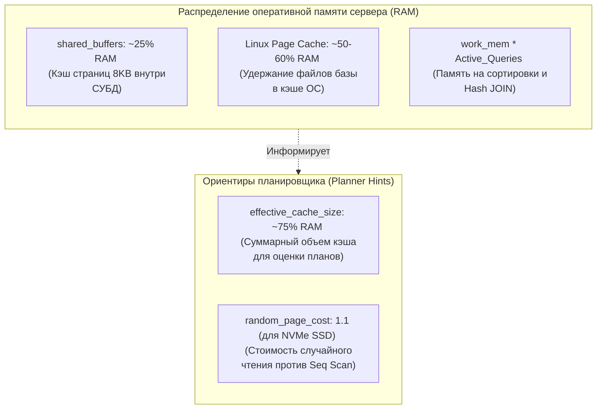

Заставить PostgreSQL работать с предельной производительностью под высокими нагрузками — это не эзотерическая магия и не шаманство с сотнями разрозненных флагов. Это осознанная инженерная дисциплина, опирающаяся на три кита: **механическое сочувствие к оборудованию (Mechanical Sympathy)**, глубокое понимание устройства планировщика запросов и грамотное взаимодействие со стороны клиентского Go-приложения.

Если ваш сервис на Go начинает демонстрировать тревожный рост задержек (Latency p99) на операциях с базой данных, корень проблемы редко кроется в сетевом драйвере или рантайме Go. В 9 случаях из 10 база данных попросту «задыхается» в смирительной рубашке консервативных настроек по умолчанию, либо планировщик генерирует чудовищные планы выполнения из-за устаревшей статистики.

В этой главе мы систематизируем принципы глубокого тюнинга PostgreSQL, превращая неповоротливый «черный ящик» в предсказуемый и послушный реактивный двигатель вашего бэкенда.

---

## 1. Конфигурация: Тюнинг параметров под современное железо

Конфигурационный файл по умолчанию (`postgresql.conf`) исторически настроен так, чтобы сервер гарантированно запустился даже на скромном виртуальном сервере с 512 МБ оперативной памяти. Для промышленного инженера понимание физического смысла ключевых директив — обязательный базовый навык.



### Память: `shared_buffers` и кэширование
* **`shared_buffers`**: Как мы выяснили в [[1. Архитектура PostgreSQL]], это сегмент разделяемой памяти для кэширования 8-килобайтных страниц данных. Для большинства промышленных инсталляций золотым стандартом является значение в **25% от общего объема физической RAM**.
  * *Почему не отдать все 80%, как в MySQL?* PostgreSQL намеренно не использует прямой ввод-вывод (`O_DIRECT`), всецело доверяя кэшированию страниц ядру Linux (Page Cache). Если забрать под `shared_buffers` почти всю память, вы спровоцируете эффект двойного буферизирования и лишите ядро ОС возможности кэшировать чтение файлов на системном уровне.
* **`effective_cache_size`**: Важнейший параметр, который **не выделяет память физически**, а служит эвристической подсказкой стоимостному оптимизатору. Он сообщает планировщику, какой суммарный объем памяти (включая `shared_buffers` и файловый Page Cache ОС) предположительно доступен для удержания индексов и таблиц. Обычно выставляется в **75% от всей RAM**. Если занизить этот параметр, планировщик решит, что индексы не поместятся в оперативной памяти, и начнет ошибочно выбирать медленный Sequential Scan.

### Работа с диском и WAL
* **`random_page_cost`**: По умолчанию равен `4.0`. Это исторический коэффициент, отражающий реалии эпохи вращающихся магнитных дисков (HDD), где перемещение магнитной головки (случайный доступ при Index Scan) стоило в 4 раза дороже линейного чтения дорожки (Seq Scan).  
  * *Тюнинг под NVMe SSD:* На современных твердотельных накопителях задержка случайного чтения микросекундна и практически не отличается от последовательного. **Смело выставляйте значение `1.1`**! Это снимет необоснованный штраф с индексов и заставит оптимизатор охотно задействовать B-Tree и GiST структуры.
* **`synchronous_commit`**: По умолчанию равен `on`. При каждом коммите транзакции сервер ожидает физического завершения системного вызова `fsync()` от дискового контроллера журнала WAL.  
  * *Highload-оптимизация:* Если ваша система обрабатывает поток некритичных событий (метрики, клики, аудит-логи), для которых потеря последних 100–200 миллисекунд данных при внезапном обесточивании стойки не является трагедией, установите `synchronous_commit = off`. Процессы перестанут синхронно замирать в ожидании диска, что поднимет пропускную способность записи (Write Throughput) в разы!

---

## 2. Анализ запросов: Когда планировщик ошибается

Даже идеально сконфигурированный кластер будет тормозить, если SQL-запросы составлены неграмотно. Главным диагностическим микроскопом инженера является команда `EXPLAIN (ANALYZE, BUFFERS)` (или просто `EXPLAIN ANALYZE`):

```sql
EXPLAIN (ANALYZE, BUFFERS)
SELECT * FROM orders WHERE user_id = 500 AND status = 'pending';
```

> [!tip] Собеседование
> **Вопрос:** На что в первую очередь следует обращать внимание при разборе плана `EXPLAIN ANALYZE`?
> **Ответ:**
> 1. **`Actual time`**: Реальное астрономическое время выполнения узла плана (в миллисекундах), в отличие от условных единиц `cost`.
> 2. **`Rows Removed by Filter`**: Если это число велико, индекс работает неэффективно: сервер вычитал тысячи лишних страниц, а затем отбросил строки предикатом фильтрации. Требуется составной индекс.
> 3. **`Buffers: shared hit / read`**: Ключевой индикатор ввода-вывода. `shared hit` показывает число 8 КБ страниц, мгновенно взятых из RAM (`shared_buffers`), а `shared read` — страницы, которые пришлось поднимать с физического диска. Наша цель — свести `read` к минимуму.
> 4. **`JIT (Just-In-Time Compilation)`**: Для простых высокочастотных OLTP-запросов время компиляции LLVM-байткода JIT может в разы превышать само время выполнения запроса. Если видите в плане задержки на фазе JIT, отключайте его для OLTP (`jit = off`).

### Проблема Cardinality и актуализация статистики
Оптимизатор вычисляет траекторию выполнения запроса на основе **математической статистики** (гистограмм распределения значений в столбцах, хранящихся в `pg_statistic`). Если распределение данных резко изменилось (например, ночной batch-воркер залил 10 миллионов новых заказов), планировщик ошибется в оценке мощности множества (Cardinality) и выберет катастрофический план (например, вложенные циклы `Nested Loop` вместо `Hash Join`).  
* **Решение:** После массивных пакетных вставок или миграций всегда инициируйте ручной сбор статистики:
```sql
ANALYZE table_name;
```

---

## 3. Оптимизация на уровне Go-приложения

Инженер, разрабатывающий сервис на Go, оказывает прямое влияние на здоровье базы данных через выбор драйвера и архитектуру взаимодействия с пулом соединений.

### Подготовленные выражения (Prepared Statements)
Использование параметризованных вызовов вроде `db.Query("SELECT ... WHERE id = $1", id)` решает две фундаментальные задачи:
1. Обеспечивает абсолютную защиту от атак класса [[21. SQL Injection]].
2. Задействует механизм **Prepared Statements (Подготовленных выражений)**.

При использовании драйвера `pgx` подготовка запросов происходит автоматически: сервер компилирует дерево синтаксического разбора и строит план выполнения **ровно один раз**, кэшируя его в памяти Backend-процесса, а при последующих вызовах лишь подставляет новые аргументы. Это экономит до 20–30% тактов CPU сервера на этапе парсинга.

> [!warning] Ловушка / Gotcha: Конфликт Prepared Statements и транзакционного PgBouncer
> Если в вашей архитектуре между Go-сервисом и PostgreSQL развернут **PgBouncer в режиме транзакций (transaction pooling)**, использование классических серверных Prepared Statements приведет к непредсказуемым ошибкам.  
> Подготовленные выражения привязаны к конкретной сессии Unix-процесса PostgreSQL. В транзакционном режиме PgBouncer может отправить ваш первый запрос в Backend-процесс `PID 101`, а второй запрос той же функции Go — в процесс `PID 102`, где этот стейтмент не подготовлен!  
> *Решение:* Настройте пул `pgx` на использование неименованных стейтментов или активируйте параметр `PreferSimpleProtocol: true`, либо используйте современные версии PgBouncer (1.21+), обладающие встроенной поддержкой трансляции prepared statements.

---

### Пакетная вставка (Batching)
Худшее, что может сделать Go-разработчик при вставке 10 000 строк — запустить цикл с единичными `Exec()`:

```mermaid
flowchart TD
    classDef process  fill:#1e293b,stroke:#38bdf8,stroke-width:1px,color:#f8fafc
    classDef success  fill:#064e3b,stroke:#34d399,stroke-width:1px,color:#f8fafc
    classDef error    fill:#7f1d1d,stroke:#f87171,stroke-width:1px,color:#f8fafc
    classDef warning  fill:#78350f,stroke:#fbbf24,stroke-width:1px,color:#f8fafc
    classDef entry    fill:#1e3a5f,stroke:#38bdf8,stroke-width:2px,color:#f8fafc
    classDef aux      fill:#334155,stroke:#64748b,stroke-width:1px,color:#f8fafc
    classDef system   fill:#312e81,stroke:#a78bfa,stroke-width:1px,color:#f8fafc
    classDef data     fill:#132d29,stroke:#2dd4bf,stroke-width:1px,color:#f8fafc
    classDef network  fill:#881337,stroke:#fb7185,stroke-width:1px,color:#f8fafc
    classDef accent   fill:#1e1b4b,stroke:#818cf8,stroke-width:1px,color:#f8fafc
    subgraph BadPattern ["Антипаттерн: Одиночные вставки в цикле (1000 запросов)"]
        direction LR
        G1["Go App"]:::data -->|"1. INSERT (TCP)"| PG1["Postgres"]
        PG1 -->|"fsync WAL"| PG1
        PG1 -->|"ACK (TCP)"| G1
        G1 -->|"2. INSERT (TCP)"| PG1
        PG1 -->|"fsync WAL"| PG1
        PG1 -->|"ACK (TCP)"| G1
    end

    subgraph GoodPattern ["Идиоматичный Batching: pgx.Batch (1 сетевой round-trip)"]
        direction LR
        G2["Go App"]:::data -->|"Batch Buffer (1000 записей за 1 TCP фрейм)"| PG2["Postgres Engine"]
        PG2 -->|"Один Group Commit в WAL"| PG2
        PG2 -->|"Единый Batch Response"| G2
    end
```



Одиночные вставки генерируют 1 000 сетевых пересылок (Round-trip time) и заставляют базу выполнять тысячи дорогостоящих блокировок.  
В драйвере `pgx` для этого реализован высокопроизводительный механизм `pgx.Batch`:

```go
package repository

import (
	"context"
	"fmt"

	"github.com/jackc/pgx/v5"
	"github.com/jackc/pgx/v5/pgxpool"
)

type Metric struct {
	Name  string
	Value float64
}

func InsertMetricsBatch(ctx context.Context, pool *pgxpool.Pool, metrics []Metric) error {
	batch := &pgx.Batch{}

	for _, m := range metrics {
		batch.Queue("INSERT INTO metrics (name, value) VALUES ($1, $2)", m.Name, m.Value)
	}

	br := pool.SendBatch(ctx, batch)
	defer br.Close()

	for range metrics {
		if _, err := br.Exec(); err != nil {
			return fmt.Errorf("batch execution failed: %w", err)
		}
	}

	return br.Close()
}
```
Пакетная вставка упаковывает данные в единый сетевой пакет и выполняет единый групповой коммит в WAL, ускоряя операции модификации в **10–50 раз**!

---

## 4. Эксплуатационное обслуживание: Предотвращение Bloat

Как мы подробно разбирали в [[3. MVCC в PostgreSQL]], операции `UPDATE` и `DELETE` оставляют на страницах Heap мертвые кортежи. Если фоновый демон Autovacuum отстает от темпа записи, таблицы катастрофически раздуваются (Bloat).

### Тюнинг для больших таблиц:
Если в таблице 100 млн строк, а вы обновляете 1% ежедневно, дефолтный Autovacuum может запускаться слишком редко.
```sql
ALTER TABLE large_table SET (
  autovacuum_vacuum_scale_factor = 0.01, -- запускать сборку уже при 1% изменений вместо 20%
  autovacuum_vacuum_cost_limit = 1000    -- дать процессу больше ресурсов и квот ввода-вывода
);
```

### Индексы: Качество против количества
* **Composite Indexes**: Если вы часто ищете по `user_id` и `status`, один составной индекс на `(user_id, status)` будет в разы эффективнее, чем два отдельных индекса.
* **Unused Indexes**: Каждый индекс замедляет операции `INSERT/UPDATE`. Системный каталог позволяет мгновенно выявить бесполезные индексы, потребляющие дисковое пространство:

```sql
SELECT 
    relname AS table_name,
    indexrelname AS index_name,
    idx_scan,
    pg_size_pretty(pg_relation_size(indexrelid)) AS index_size
FROM pg_stat_user_indexes
WHERE idx_scan = 0
ORDER BY pg_relation_size(indexrelid) DESC;
```
Если индекс имеет `idx_scan = 0` на протяжении месяцев промышленной эксплуатации, он должен быть безжалостно удален (`DROP INDEX CONCURRENTLY`).

---

## 5. Использование расширений для анализа

Как упоминалось в [[7. Расширения PostgreSQL]], расширение `pg_stat_statements` — ваш лучший друг. Оно позволяет найти "самые дорогие" запросы не в теории, а на реальном трафике.

**Топ-5 запросов по суммарному времени выполнения:**
```sql
SELECT query, calls, total_exec_time, mean_exec_time, shared_blks_hit
FROM pg_stat_statements
ORDER BY total_exec_time DESC
LIMIT 5;
```

Инспектируя этот отчет, вы безошибочно определите, где оптимизация даст максимальный финансовый и архитектурный эффект.

---

## Резюме для инженера

1. **Конфигурация под SSD:** Выделите 25% RAM под `shared_buffers`, 75% под `effective_cache_size` и обязательно понизьте `random_page_cost` до `1.1`.
2. **Диагностика планов:** Регулярно запускайте `EXPLAIN (ANALYZE, BUFFERS)` и стремитесь к минимизации параметра `shared read`.
3. **Паттерны в Go:** Используйте подготовленные выражения с осторожностью при транзакционных пулерах, применяйте `pgx.Batch` и избегайте удержания открытых транзакций.
4. **Управление раздуванием:** Агрессивно настраивайте `autovacuum_vacuum_scale_factor` на горячих таблицах и удаляйте неиспользуемые индексы с `idx_scan = 0`.
5. **Непрерывный мониторинг:** Анализируйте профиль нагрузки через `pg_stat_statements`.

Оптимизация параметров и планов имеет свои естественные физические пределы. Когда нагрузка на запись растет, на сцену выходит главный системный дворник PostgreSQL, от здоровья которого зависит выживание всего кластера. О том, как устроен и как настраивается сборщик мусора СУБД — в следующей лекции: [[10. VACUUM, ANALYZE]].