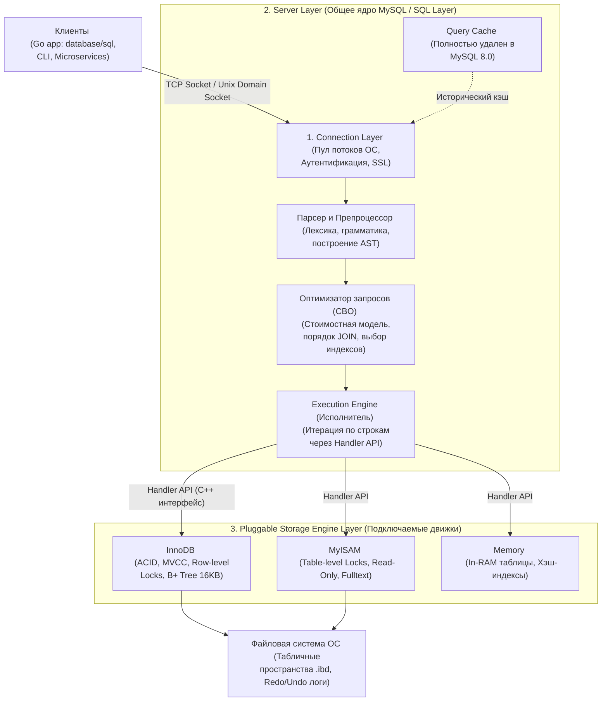
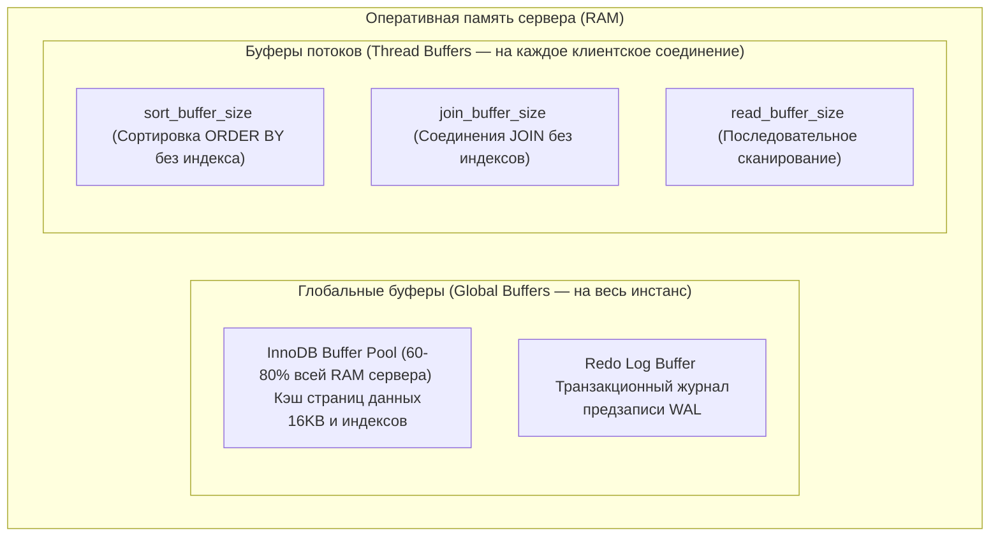

## Анатомия MySQL: Разделяй и властвуй

MySQL — одна из самых распространенных реляционных систем управления базами данных в истории вычислительной техники. Ее колоссальный успех в эпоху становления интернета и веб-сервисов во многом был предопределен уникальным архитектурным решением создателей (Монти Видениуса и Дэвида Аксмарка): концепцией **Pluggable Storage Engine Architecture (подключаемой модульной архитектуры подсистем хранения)**.

В отличие от монолитных СУБД (таких как PostgreSQL, где логика парсера, планировщика и страничного хранилища Heap жестко связаны воедино), в MySQL задачи синтаксического анализа SQL, оптимизации запросов и разграничения прав пользователей строго отделены от физического сохранения байтов на диск, управления транзакциями и низкоуровневых блокировок.

Для инженера, пишущего на Go, понимание этой архитектурной границы — ключ к разгадке поведения системы: вы начнете физически понимать, почему одни запросы выполняются за микросекунды, а другие парализуют кластер, несмотря на формальное наличие индексов.

---

### Глобальная архитектура: Трехуровневая модель

Архитектуру экземпляра MySQL принято разделять на три независимых логических уровня:



---

## Уровень 1. Сетевой уровень и обработка соединений (Connection Layer)

Когда ваше Go-приложение инициирует пул через `sql.Open("mysql", dsn)` и отправляет первый SQL-запрос, оно открывает TCP-сокет к сетевому порту сервера (по умолчанию 3306).

На этом уровне MySQL исторически реализует классическую модель **Thread-per-Connection (один поток операционной системы на каждое активное клиентское соединение)**. Когда поступает входящий TCP-пакет:
1. Сервер проверяет пул готовых свободных потоков — **Thread Cache**.
2. Если свободный поток найден, он немедленно назначается на обслуживание данного клиента.
3. Если кэш пуст, ядро базы данных обращается к Linux через системный вызов `clone()`, порождая новый тяжелый поток ОС.

> [!info] Под капотом: Потоки операционной системы против Горутин Go
> Сравните две модели: в среде Go запуск горутины обходится в микросекунды (начальный стек всего ~2 КБ, планирование выполняется рантаймом в пространстве пользователя без системных вызовов).  
> В MySQL создание потока ядра ОС требует системного вызова и резервирования мегабайтов памяти под стек потока (`thread_stack`).  
> Попытка запустить тысячи параллельных потоков ОС неизбежно приводит к эффекту **Thread Thrashing**: планировщик ядра Linux тратит все доступные кванты времени процессора на бесконечные переключения контекста (сохранение регистров в Ring 0, сброс TLB-кэшей страниц памяти), а полезная работа по исполнению SQL останавливается.

> [!warning] Ловушка / Gotcha: Connection Storm (Шторм подключений)
> Если в момент пиковой нагрузки ваш микросервис на Go без ограничений начнет открывать новые соединения к MySQL (потому что вы забыли явно задать лимиты пула), сервер базы данных мгновенно исчерпает оперативную память и рухнет по OOM, либо зависнет в борьбе за процессорные кванты.  
> **Инженерное правило:** Всегда жестко лимитируйте параметры `SetMaxOpenConns` и `SetMaxIdleConns` в Go (подробно в [[2. Connection pool]]). Для высоконагруженных систем перед MySQL устанавливают внешний интеллектуальный мультиплексор (например, **ProxySQL**), либо используют расширенные форки (такие как **Percona Server**), где реализован компонент **Thread Pool**, мультиплексирующий тысячи клиентских соединений на фиксированное количество рабочих потоков ОС — по образу и подобию планировщика Go.

---

## Уровень 2. Ядро СУБД (Server Layer / SQL Layer)

Этот слой представляет собой интеллектуальный процессор базы данных. Он абсолютно абстрагирован от физического хранения данных на диске, но виртуозно владеет логикой реляционной алгебры и синтаксисом стандарта SQL.

### 1. Парсер и Препроцессор
* **Парсер:** Выполняет лексический и синтаксический анализ входящего текста запроса, транслируя массив символов в абстрактное синтаксическое дерево (AST — Abstract Syntax Tree).
* **Препроцессор:** Проверяет корректность семантики: обращается к системному словарю данных (Data Dictionary), проверяя существование запрашиваемых таблиц и атрибутов, сопоставляет псевдонимы (алиасы) и валидирует права доступа пользователя (`GRANT`).

### 2. Оптимизатор запросов (Query Optimizer)
Интеллектуальный мозг MySQL. Оптимизатор функционирует на базе стоимостной модели — **Cost-Based Optimizer (CBO)** (подробнее в [[11. Cost based optimizer]]). Он анализирует сотни возможных траекторий исполнения запроса, перебирает порядок соединения таблиц в `JOIN` и оценивает альтернативные пути выборки по индексам. Оптимизатор переводит каждый вариант в условную «стоимость» (CPU-такты и I/O-операции чтения страниц) и выбирает план с наименьшим значением Cost.

> [!tip] Собеседование: Ошибка выбора индекса
> **Вопрос:** Почему MySQL иногда полностью игнорирует существующий B-Tree индекс и выполняет медленное сканирование всей таблицы (Full Table Scan), хотя колонка явно присутствует в блоке `WHERE`?
> **Ответ:** Оптимизатор опирается на статистику распределения значений (**Cardinality**). Если условие `WHERE status = 'active'` охватывает 80% всех записей таблицы, планировщик рассуждает механически: чтение по индексу потребует случайного чтения (Random I/O) с диска для каждой строки через указатели.  
> Последовательное считывание всей таблицы с диска подряд (**Sequential Read**) силами страничного кэша ОС сработает в разы быстрее благодаря упреждающему аппаратному чтению (Read-ahead). Поэтому при низкой селективности предиката выбор Full Table Scan является математически оправданным решением.

### 3. Исполнитель (Execution Engine)
Берет сформированный оптимизатором план выполнения (дерево операций, доступное для анализа через команду `EXPLAIN`, см. [[10. План выполнения запроса. EXPLAIN]]) и пошагово вызывает методы нижнего уровня через Handler API, извлекая строки и передавая их в сеть клиенту.

> [!warning] Ловушка / Gotcha: Смерть Query Cache
> Если в устаревших статьях вы встретите советы оптимизировать параметр `query_cache_size`, знайте: **в MySQL 8.0 компонент Query Cache был полностью и навсегда удален из кодовой базы**.  
> Причина этого решения — чистая физика многоядерных архитектур (Mechanical Sympathy). Исторический Query Cache кэшировал готовые результаты запросов, но был обязан моментально инвалидироваться при *любой* модификации целевой таблицы (`INSERT`/`UPDATE`). Для этой инвалидации требовался захват глобального мьютекса (**Global Mutex**). На многоядерных серверах (32–64 ядра) высококонкурентная борьба за этот единый мьютекс превращалась в главное бутылочное горлышко СУБД.

---

## Уровень 3. Подсистемы хранения (Storage Engine Layer)

Ключевая особенность и архитектурный триумф MySQL — полная абстракция уровня хранения данных через стандартизированный интерфейс **Handler API**.

В исходном коде сервера MySQL (написанном на C++) объявлен базовый абстрактный класс `handler`. Он содержит контракт виртуальных методов, определяющих операции над физическими кортежами:
* `rnd_next()`: Считать следующую физическую строку таблицы при полном сканировании.
* `index_read()`: Найти первую запись в индексе по заданному ключу.
* `index_next()`: Перейти к следующему элементу текущего диапазона индекса.
* `write_row()`: Записать новый кортеж на диск.
* `delete_row()` / `update_row()`: Удалить или обновить существующий кортеж.

Любой независимый инженер может написать собственную подсистему хранения, скомпилировать ее в разделяемую библиотеку и подключить к MySQL!

### Основные движки хранения:
1. **InnoDB:** Движок по умолчанию (начиная с версии MySQL 5.5). Предоставляет полный спектр ACID-гарантий, многоверсионность (MVCC), поддержку внешних ключей, блокировки на уровне отдельных строк (**Row-level locking**) и автоматическое восстановление после аппаратных сбоев (Crash Recovery). Это основной рабочий инструмент в 99% бэкенд-систем.
2. **MyISAM:** Исторический движок первых версий MySQL. Не поддерживает транзакции и при любой операции записи блокирует **таблицу целиком (Table-level lock)**. Сегодня считается устаревшим и применяется крайне редко (например, для специфичных неизменяемых архивов).
3. **Memory (HEAP):** Размещает таблицы исключительно в оперативной памяти (данные полностью исчезают при перезапуске сервера). Использует быстрые хэш-индексы и блокировки уровня таблицы. Движок часто задействуется самим ядром MySQL для неявного создания внутренних временных таблиц при сложных сортировках и группировках (`GROUP BY`).

### Как Исполнитель взаимодействует с движком?
Когда вы отправляете запрос `SELECT * FROM users WHERE age > 18`, Исполнитель ядра не знает, как физически уложены байты на SSD:
1. Он вызывает через Handler API метод `index_read()` для индекса `age`, запрашивая первое значение больше 18.
2. Под капотом InnoDB производит бинарный спуск по страницам своего сбалансированного B+ Tree дерева (размером 16 КБ) и возвращает строку в ядро.
3. Исполнитель запрашивает следующие строки через `index_next()`, пока предикат удовлетворяется.
*Вся внутренняя сложность дисковых структур InnoDB полностью инкапсулирована за контрактом Handler API.*

---

## Архитектура оперативной памяти MySQL (Memory Architecture)

Память экземпляра MySQL строго разделена на две принципиальные категории:



### 1. Глобальные буферы (Global Buffers)
Выделяются однократно при старте демона `mysqld` и разделяются между всеми рабочими потоками:
* **`InnoDB Buffer Pool`:** Сердце подсистемы памяти. Здесь InnoDB кэширует с диска 16-килобайтные страницы данных, адаптивные хэш-индексы и структуры отката Undo. В выделенных серверах БД под него резервируют **от 60% до 80% всей доступной физической RAM**.
* **`Redo Log Buffer`:** Буфер журнала предзаписи (WAL). Удерживает измененные страницы транзакций перед их сбросом на постоянный носитель.

### 2. Буферы потоков (Thread Buffers)
Выделяются динамически внутри адресного пространства конкретного потока ОС при выполнении специфических тяжелых операций:
* **`sort_buffer_size`**: Память, резервируемая для внутренней сортировки (`ORDER BY`), если запрос не может опереться на готовый порядок B-Tree индекса.
* **`join_buffer_size`**: Буфер для выполнения операций соединения (`Block Nested Loop / Hash Join`), когда для связываемых таблиц отсутствуют внешние индексы.
* **`read_buffer_size`**: Буфер для последовательного чтения данных при Full Table Scan.

> [!warning] Ловушка / Gotcha: Лавинообразный OOM при нехватке индексов
> Если ваш пул в Go держит 1 000 параллельных соединений, и все они одновременно выполнят тяжелый запрос `SELECT ... ORDER BY ...` по неиндексированному полю, MySQL выделит `sort_buffer_size` **индивидуально для каждого из 1 000 потоков**!  
> Если администратор неосмотрительно установил `sort_buffer_size = 64MB`, суммарный аппетит потоков составит $1000 \times 64\text{ МБ} = 64\text{ ГБ}$ оперативной памяти! Сервер мгновенно исчерпает свободную RAM и будет уничтожен демоном `OOM Killer` ядра Linux.  
> Если же памяти `sort_buffer_size` не хватает для удержания сортируемого набора, MySQL переключается на алгоритм **Filesort**, сбрасывая промежуточные куски во временные файлы на диск, что мгновенно обваливает производительность ввода-вывода (IOPS).

---

## Специфика работы с MySQL из языка Go: `database/sql`

Интеграция приложений на Go с MySQL через официальный драйвер `github.com/go-sql-driver/mysql` требует соблюдения важных прикладных правил:

### 1. Механика Prepared Statements
Когда вы выполняете параметризованный вызов:
```go
db.Query("SELECT * FROM users WHERE id = ?", id)
```
драйвер `go-sql-driver/mysql` под капотом инициирует два сетевых взаимодействия с Server Layer:
1. **Фаза `PREPARE`:** Текст запроса передается в MySQL. Сервер парсит выражение, строит абстрактное дерево AST, оптимизирует план и сохраняет структуру в памяти серверной сессии, возвращая Go уникальный численный идентификатор `statement_id`.
2. **Фаза `EXECUTE`:** Go передает по бинарному протоколу только `statement_id` и значение переменной `id`.

Это гарантирует абсолютную защиту от SQL-инъекций и снижает нагрузку на парсер. Однако если вы динамически компилируете подготовленные выражения в цикле и забываете закрывать дескрипторы через `stmt.Close()`, память сессий на стороне MySQL будет быстро исчерпана (см. [[1. Работа с БД в Go. database_sql]]).

### 2. Параметры строки подключения (DSN)
Исторически сетевой протокол MySQL возвращает дату и время в виде сырых ASCII-строк. Чтобы стандартный интерфейс `Scan()` мог автоматически распаковывать SQL-столбцы типов `DATETIME` и `TIMESTAMP` в нативные структуры Go `time.Time`, в строке подключения DSN **обязательно** указываются директивы `parseTime=true` и таймзона `loc`:

```go
dsn := "user:password@tcp(127.0.0.1:3306)/production?parseTime=true&loc=Local"
db, err := sql.Open("mysql", dsn)
```
Игнорирование `parseTime=true` приведет к ошибкам десериализации байтовых срезов `[]uint8` в прикладном коде.

---

## Резюме для инженера

1. **Модульность через Handler API:** Разделение на Server Layer (парсер, оптимизатор) и Storage Engine Layer (InnoDB, MyISAM) обеспечивает исключительную гибкость архитектуры.
2. **Thread-per-Connection:** Каждый клиент обслуживается отдельным системным потоком ОС. Требует обязательного лимитирования пула соединений в Go (`SetMaxOpenConns`).
3. **Двухуровневая память:** Глобальный `InnoDB Buffer Pool` кэширует горячие страницы данных (60–80% RAM), а локальные буферы потоков (`sort_buffer_size`) требуют жесткого контроля во избежание OOM.
4. **Конфигурация DSN в Go:** Параметр `parseTime=true` обязателен для корректной работы с временными типами.

Поскольку в 99% современных промышленных бэкендов на MySQL используется подсистема InnoDB, наш следующий шаг — спуститься на уровень физического хранения и разобрать, как устроены 16-килобайтные страницы, кластерные индексы и транзакционные логи: [[2. InnoDB storage engine]].