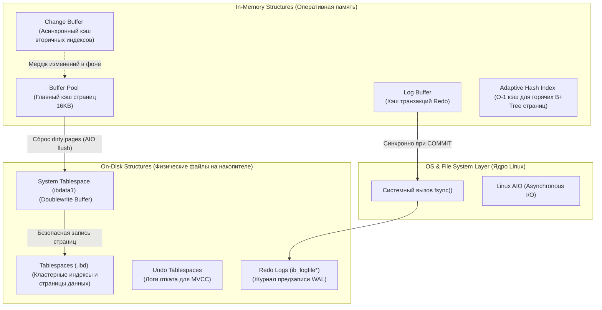
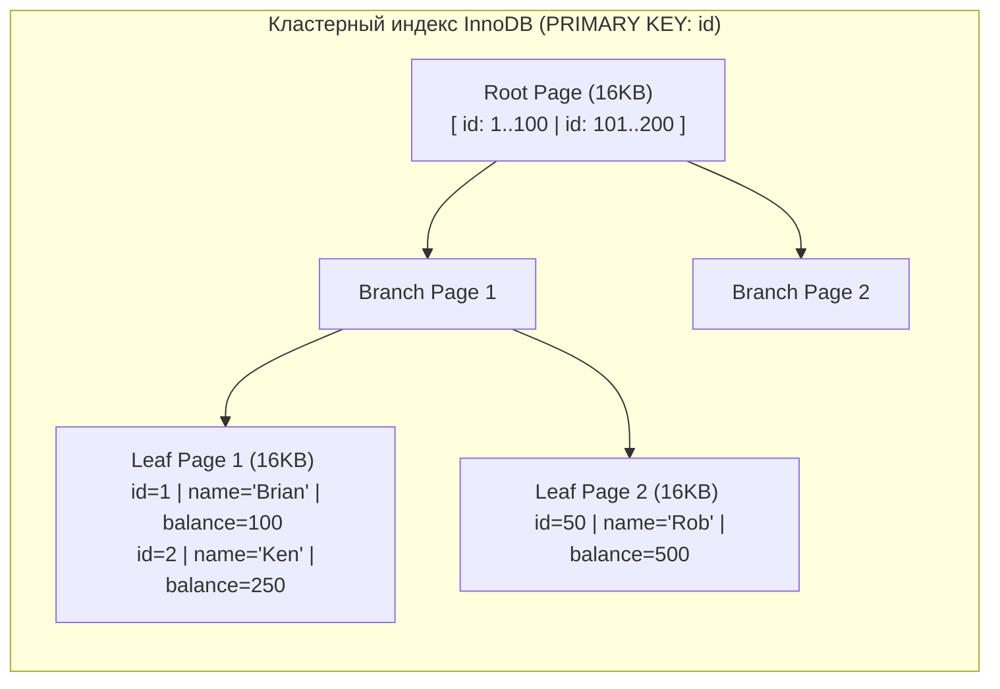
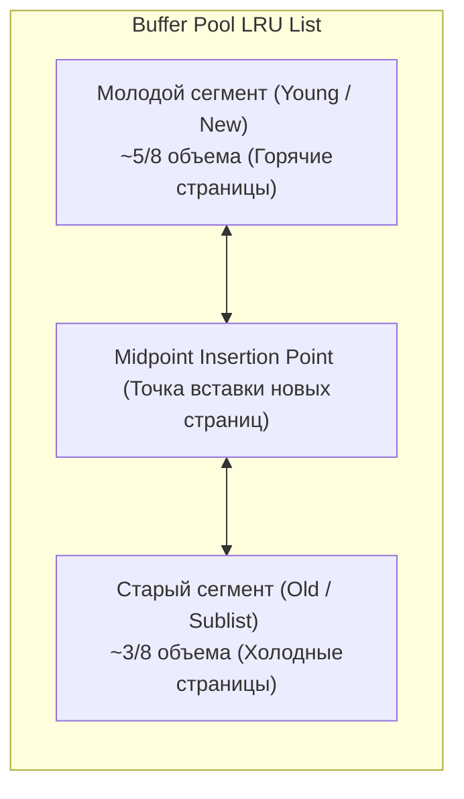
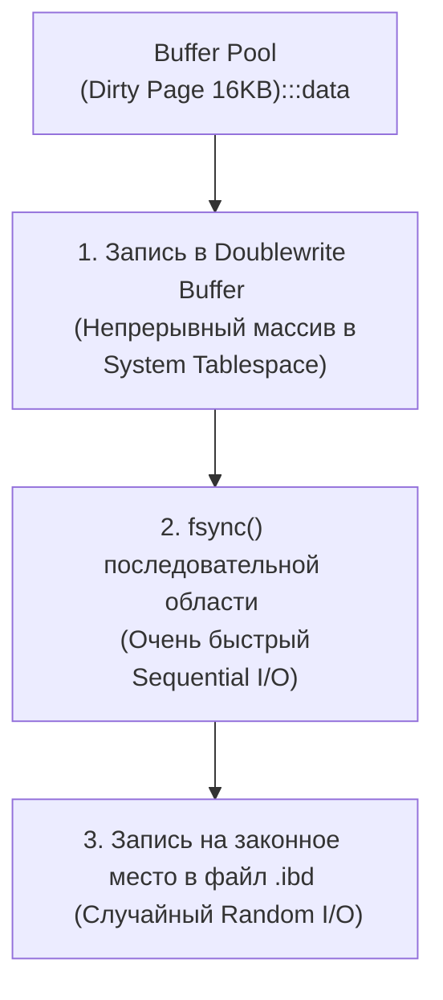
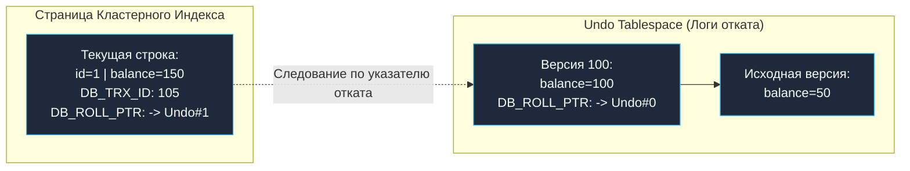

В предыдущей главе мы исследовали трехуровневую архитектуру MySQL и выяснили, что логическое ядро СУБД (Server Layer) делегирует всю физическую работу с накопителями и транзакционными гарантиями подключаемым подсистемам через унифицированный контракт Handler API. 

Сегодня мы погружаемся в святая святых современного MySQL — подсистему хранения **InnoDB**. Разработанный финским программистом Хейкки Туури (Heikki Tuuri) в конце 1990-х годов, InnoDB стал инженерным триумфом, превратившим легковесный MySQL в полноценную промышленную СУБД с бескомпромиссными транзакционными гарантиями ACID.

Если вы бэкенд-инженер, создающий высоконагруженные сервисы на Go, в 99% сценариев взаимодействия с MySQL вы будете работать именно с InnoDB. Понимание того, как этот движок раскладывает байты по 16-килобайтным страницам диска и как он управляет оперативной памятью, отличает зрелого Senior-инженера от новичка, слепо верящего в то, что база данных — это просто бездонный хэш-мап на диске.

---

## Анатомия InnoDB: Философия взаимодействия RAM и Disk

Движок InnoDB спроектирован вокруг фундаментального принципа **Mechanical Sympathy к подсистеме ввода-вывода (I/O)**: дисковый накопитель (даже самый передовой NVMe SSD) работает на порядки медленнее полупроводниковой оперативной памяти и многоуровневых кэшей CPU (L1/L2/L3). 

Главная философская максима InnoDB звучит так: **Любые операции чтения и модификации выполняются исключительно в оперативной памяти (RAM), а сброс данных на диск производится либо строго асинхронно, либо укрупненными последовательными блоками (Sequential I/O)**.



---

## 1. Дисковые структуры данных (On-Disk Structures)

### Страницы и экстенты (Pages & Extents)
Вся дисковая организация данных в InnoDB квантуется блоками строго фиксированного размера — **Страницами (Pages)**. По умолчанию размер страницы в InnoDB составляет ровно **16 КБ (16 384 байта)** — в два раза больше, чем в PostgreSQL (8 КБ).

> [!info] Под капотом: Mechanical Sympathy и размер страницы
> Операционная система Linux оперирует страницами виртуальной памяти по 4 КБ. Контроллеры современных SSD-накопителей читают и записывают флеш-память блоками по 4–8 КБ. Почему же архитектор InnoDB выбрал размер 16 КБ?  
> Исторически это решение принималось в эпоху магнитных дисков (HDD): прочитать за один физический оборот шпинделя 16 КБ последовательных данных стоило столько же, сколько прочитать 4 КБ, но давало четырехкратный выигрыш в объеме полезной информации.  
> Сегодня на NVMe-накопителях в базах с преобладанием точечного случайного чтения (Random Read) вы можете перенастроить экземпляр на страницу в 4 КБ (`innodb_page_size=4k`). Это устраняет чтение лишних байтов из шины PCIe и кардинально снижает коэффициент усиления записи (**Write Amplification**) на накопителе.

Страницы объединяются в более крупные физические кластеры — **Экстенты (Extents)** по 64 страницы подряд (ровно 1 МБ). Набор экстентов формирует **Табличные пространства (Tablespaces)** — индивидуальные файлы с расширением `.ibd`, в которых хранятся таблицы вашей базы данных (режим `innodb_file_per_table = ON`).

---

### Кластерный индекс (Clustered Index): Таблица — это B+ дерево

Это самое глубокое концептуальное отличие InnoDB от PostgreSQL и исторического MyISAM.  
В PostgreSQL таблица — это неупорядоченная Куча (Heap), а индексы — внешние вспомогательные файлы.  
В InnoDB **таблица физически и есть индекс!**

Вся таблица организована как сбалансированное **B+ Tree дерево**, упорядоченное строго по Первичному ключу (**Primary Key**):
* Во внутренних промежуточных узлах дерева хранятся ключи и указатели на дочерние 16 КБ страницы.
* В **листовых узлах (Leaf Nodes)** самого нижнего уровня B+ дерева физически размещаются **целиком все данные строк** (все остальные колонки таблицы).



Именно поэтому точечный запрос по первичному ключу `SELECT * FROM users WHERE id = 1` в InnoDB отрабатывает с запредельной скоростью: алгоритм совершает спуск по B+ дереву за 2–3 перехода по страницам и в листовом узле **сразу находит готовую строку со всеми колонками**, без вторичных скачков по оперативной памяти! Подробно геометрию вторичных индексов мы разберем в лекции [[3. Индексы в MySQL]].

---

## 2. Структуры в оперативной памяти (In-Memory Structures)

### Buffer Pool (Пул буферов)
Buffer Pool — центральный вычислительный резервуар InnoDB. Движок никогда не модифицирует байты прямо на накопителе. При выполнении любого `SELECT`, `UPDATE` или `DELETE` сервер сначала поднимает 16 КБ страницу с диска в Buffer Pool, вносит изменения в памяти (страница становится "грязной" — Dirty Page), а затем фоновый процесс асинхронно сбрасывает ее обратно на диск.

Для управления кэшем страниц Buffer Pool задействует модифицированный двухуровневый алгоритм **LRU (Least Recently Used)**:



> [!tip] Собеседование: Защита от деградации кэша при Full Table Scan
> **Вопрос:** Если фоновый аналитический скрипт запустит тяжелый запрос `SELECT * FROM huge_table` без индексов, вымоет ли это последовательное чтение терабайтной таблицы все горячие страницы из Buffer Pool?
> **Ответ:** Нет, благодаря **стратегии вставки в середину (Midpoint Insertion Strategy)**.  
> Список LRU в InnoDB разделен в пропорции 5/8 (горячая зона) и 3/8 (холодная зона). Вновь прочитанная с диска страница помещается не на вершину списка, а строго на границу (**Midpoint**), попадая в старую треть. Если страница была прочитана один раз в цикле полного сканирования таблицы и к ней больше не было повторных обращений в течение интервала `innodb_old_blocks_time` (по умолчанию 1000 мс), она быстро вытесняется из хвоста старой зоны, **не затронув ни единой горячей страницы** в молодой зоне!

### Change Buffer (Буфер отложенных модификаций)
Когда запрос обновляет строку, ему требуется обновить не только кластерный индекс, но и вторичные B-Tree индексы. Если целевой 16 КБ страницы вторичного индекса в данный момент нет в Buffer Pool, подъем этой страницы с диска ради изменения пары байтов вызвал бы губительный всплеск Random I/O.  
Вместо этого InnoDB буферизирует изменение в **Change Buffer** в оперативной памяти. Позже, когда эта страница индекса будет прочитана другим пользовательским запросом, InnoDB прозрачно выполнит **слияние (Merge)** изменений.

---

## 3. Транзакционность и ACID: Взаимодействие с операционной системой

Гарантии надежности и транзакционной изоляции ACID — самые ресурсоемкие операции СУБД, требующие постоянной координации с ядром ОС и дисковыми контроллерами.

### Atomicity & Durability: Redo Log и системный вызов `fsync`

Как гарантировать сохранность зафиксированных транзакций при внезапном обесточивании сервера, не сбрасывая тяжелые 16-килобайтные страницы на медленный диск при каждом `COMMIT`?

Решение строится на парадигме **Write-Ahead Logging (WAL)**, которая в InnoDB реализована циклическим журналом повтора — **Redo Log** (файлы `ib_logfile0`, `ib_logfile1` в MySQL 5.7 или директория `#innodb_redo` в MySQL 8.0).

При фиксации транзакции (`COMMIT`) InnoDB записывает в буфер памяти **Log Buffer** не саму страницу данных, а компактную дельту (физико-логический вектор изменений: «на странице №42 по смещению 128 записать байты 0xDEADBEEF»). Затем инициируется блокирующий системный вызов ядра Linux **`fsync()`**, который приказывает контроллеру накопителя физически сбросить буфер на диск. 

Запись в Redo Log идет строго последовательно (**Sequential I/O**), благодаря чему диск выжимает максимальную пропускную способность. Измененные же 16 КБ страницы данных (Dirty Pages) сбрасываются из Buffer Pool асинхронно, фоновыми воркерами `page_cleaner`. При аварийном рестарте InnoDB считывает Redo Log и накатывает дельты на базовые страницы (Crash Recovery, подробнее в [[8. WAL. Write Ahead Log]]).

> [!warning] Ловушка / Gotcha: Параметр `innodb_flush_log_at_trx_commit`
> Это важнейшая настройка производительности и надежности MySQL:
> * **`1` (По умолчанию):** Строгий, бескомпромиссный ACID. На каждый `COMMIT` вызывается системный вызов `fsync()`. Гарантируется 100% сохранность данных, но пропускная способность записи жестко упирается в предел IOPS дискового контроллера.
> * **`2`:** При вызове `COMMIT` данные сбрасываются из Log Buffer в кэш операционной системы Linux (быстрый системный вызов `write()`), а физический `fsync()` на накопитель вызывается фоновым потоком раз в секунду. **Крах процесса `mysqld` не приводит к потере данных!** Однако аварийное обесточивание физического сервера приведет к утрате транзакций за последнюю секунду. Производительность записи возрастает в 5–10 раз.
> * **`0`:** И вызов `write()`, и вызов `fsync()` производятся раз в секунду. Падение процесса MySQL уничтожит данные за последнюю секунду. Допустимо только для вспомогательных очередей и кэшей.

---

### Consistency: Защита от разорванных страниц через Doublewrite Buffer

Вспомните разницу в физических размерах блоков: страница InnoDB равна **16 КБ**, а страница дисковой подсистемы Linux — **4 КБ**.  
Когда фоновый воркер InnoDB сбрасывает 16-килобайтную страницу на SSD, для операционной системы это последовательность из **четырех независимых операций записи по 4 КБ**.

Представьте катастрофический сценарий: контроллер успел физически записать первые два блока по 4 КБ, и в этот момент в дата-центре вырубается питание.  
На накопителе образуется **Torn Page (Разорванная страница)**: ее первая половина содержит новые данные, а вторая — старые. Заголовок страницы и контрольная сумма повреждены.  
Журнал Redo Log бессилен восстановить такую страницу: Redo содержит лишь дифференциальные векторы изменений, для применения которых требуется заведомо валидная исходная страница!

Для предотвращения этой аварии в InnoDB встроен **Doublewrite Buffer**:



Перед тем как отправить измененную страницу в ее постоянное табличное пространство `.ibd`, InnoDB записывает ее в монолитный последовательный сегмент диска — **Doublewrite Buffer** (в системном файле `ibdata1`), и выполняет `fsync`. Если в момент записи в `.ibd` произойдет аппаратный сбой, при старте после аварии InnoDB обнаружит поврежденную страницу и восстановит ее эталонную 16-килобайтную копию из Doublewrite Buffer.

---

### Isolation: MVCC и сегменты Undo Logs

Для реализации неблокирующего чтения при параллельной записи InnoDB задействует многоверсионный контроль конкурентности ([[7. MVCC. Multi Version Concurrency Control]]).

В отличие от PostgreSQL, где старые версии плодятся прямо на страницах Кучи, в InnoDB **старые версии вытесняются в специализированные сегменты — Undo Logs**:

Каждый физический кортеж в кластерном индексе несет в заголовке два служебных указателя:
1. **`DB_TRX_ID`** (6 байт): Идентификатор последней транзакции, создавшей или изменившей данную строку.
2. **`DB_ROLL_PTR`** (7 байт): Roll Pointer — физический адрес обратного указателя на предыдущую версию строки в пространстве Undo Log.



Если транзакция A инициирует `SELECT`, а параллельная транзакция B обновляет баланс, транзакция A не блокируется: она переходит по цепочке указателей `DB_ROLL_PTR` в Undo Log и на лету воссоздает исторический снимок данных (Snapshot), актуальный на момент ее старта.

> [!tip] Собеседование: Почему `SELECT COUNT(*)` тормозит в InnoDB?
> **Вопрос:** Почему в старом MyISAM запрос `SELECT COUNT(*)` возвращал результат за микросекунду, а в InnoDB на миллионной таблице этот же запрос может выполняться секундами?
> **Ответ:** В MyISAM не было транзакций, поэтому общее количество строк хранилось как константа в заголовке файла таблицы ($O(1)$).  
> В InnoDB из-за архитектуры MVCC **физически не существует единого понятия «количество строк»**! В один и тот же астрономический момент времени для транзакции A в таблице может существовать 1 000 строк, а для незакоммиченной транзакции B — 1 005 строк.  
> Поэтому при выполнении `SELECT COUNT(*)` InnoDB вынужден физически обходить листовые узлы самого компактного вторичного B+ дерева и проверять видимость каждой отдельной строки по `DB_TRX_ID` относительно текущего снимка транзакции.

---

## Практика в Go: Идиоматичная работа с транзакциями

В стандартной библиотеке Go взаимодействие с транзакционным движком InnoDB инкапсулировано типом `*sql.Tx` (разобранным в [[1. Работа с БД в Go. database_sql]]). Безупречный код на Go требует строгого управления контекстами и обязательной защиты от утечек соединений в пуле:

```go
package repository

import (
	"context"
	"database/sql"
	"fmt"
)

// TransferMoney выполняет межбанковский перевод с фиксацией в InnoDB
func TransferMoney(ctx context.Context, db *sql.DB, fromID, toID int, amount float64) error {
	// 1. Задаем уровень изоляции транзакции (в MySQL по умолчанию — Repeatable Read)
	tx, err := db.BeginTx(ctx, &sql.TxOptions{Isolation: sql.LevelRepeatableRead})
	if err != nil {
		return fmt.Errorf("begin tx failed: %w", err)
	}

	// 2. Золотой паттерн Go: defer Rollback().
	// Если транзакция будет успешно закоммичена, вызов tx.Rollback() вернет sql.ErrTxDone
	// и завершится No-Op. Но при панике (panic) или преждевременном return по ошибке
	// defer гарантированно освободит Row-level блокировки InnoDB и вернет коннект в пул.
	defer tx.Rollback()

	// 3. Списываем средства (InnoDB накладывает Row-level X-lock на строку fromID, см. [[5. Блокировки. Locking]])
	_, err = tx.ExecContext(ctx, "UPDATE accounts SET balance = balance - ? WHERE id = ?", amount, fromID)
	if err != nil {
		return fmt.Errorf("debit failed: %w", err)
	}

	// 4. Зачисляем средства
	_, err = tx.ExecContext(ctx, "UPDATE accounts SET balance = balance + ? WHERE id = ?", amount, toID)
	if err != nil {
		return fmt.Errorf("credit failed: %w", err)
	}

	// 5. Фиксация транзакции: на этой строке InnoDB выполняет fsync() для Redo Log
	if err := tx.Commit(); err != nil {
		return fmt.Errorf("commit tx failed: %w", err)
	}

	return nil
}
```

---

## Резюме для инженера

1. **Кэширование в Buffer Pool:** Все чтения и модификации выполняются над 16 КБ страницами в оперативной памяти с защитой от вымывания через двухзонный LRU (Midpoint).
2. **Кластерная природа данных:** Таблица InnoDB — это сбалансированное B+ дерево первичного ключа. Поиск по `PRIMARY KEY` извлекает всю строку за один проход по дереву.
3. **Надежность через Redo Log и Doublewrite:** Последовательный журнал Redo гарантирует Durability, а Doublewrite Buffer предотвращает разрушение страниц при Torn Page.
4. **MVCC через Undo Logs:** Неблокирующее чтение достигается переходом по скрытым указателям `DB_ROLL_PTR` в изолированные таблицы отката.
5. **Транзакционная дисциплина в Go:** Конструкция `defer tx.Rollback()` защищает пул соединений от зависших блокировок строк.

Зная, как устроен страничный фундамент и транзакционный конвейер InnoDB, мы готовы перейти к исследованию поисковых структур: как организованы кластерные и вторичные индексы, что такое покрывающие выборки (Covering Index) и почему порядок колонок в составном ключе определяет судьбу запроса. В следующей лекции: [[3. Индексы в MySQL]].