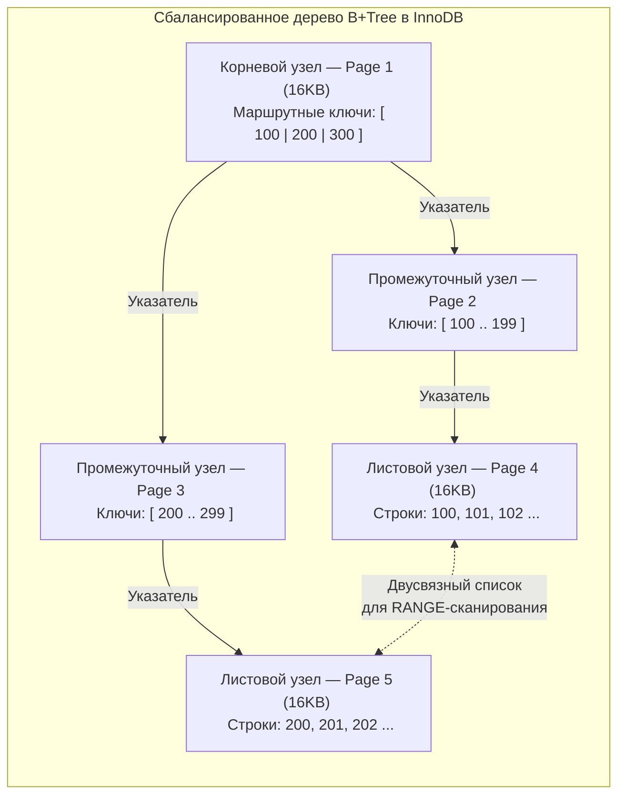

## Индексы в MySQL: B+ Деревья, Page Splits и покрывающие выборки

В предыдущей главе [[2. InnoDB storage engine]] мы детально разобрали, как движок InnoDB организует хранение данных блоками фиксированного размера по 16 КБ и как подсистема Buffer Pool в оперативной памяти сглаживает колоссальную разницу в скорости между кремнием CPU и постоянными накопителями.

Однако каким образом сервер отыскивает единичную запись среди сотен миллионов строк за доли миллисекунды, не считывая при этом гигабайты файлов с диска?  
Здесь на сцену выходят **Индексы**. Для профессионального инженера понимание индексов — это не заучивание синтаксической конструкции `CREATE INDEX`. Это ясное видение того, как физически раскладываются байты по страницам накопителя, почему случайный первичный ключ способен разорвать страницы таблицы в клочья и почему порядок объявления колонок в составном ключе определяет судьбу производительности вашего сервиса.

---

### Структура данных: Почему именно B+Tree?

В подавляющем большинстве реляционных СУБД (и в InnoDB в частности) стандартом де-факто является модифицированное сбалансированное дерево поиска — **B+Tree (B+ дерево)**.

> [!info] Под капотом: В чем фундаментальное отличие B-Tree от B+Tree?
> В классическом сбалансированном дереве Рудольфа Байера (B-Tree) пользовательские данные строк могут размещаться в абсолютно любом узле иерархии — в корне, промежуточных ветвях и листьях.  
> В структуре **B+Tree** действует железное разделение обязанностей:
> 1. **Промежуточные узлы (Branch / Non-leaf nodes):** Содержат *исключительно* ключи маршрутизации и указатели на дочерние страницы. Они не содержат пользовательских данных!
> 2. **Листовые узлы (Leaf nodes):** Размещаются строго на самом нижнем уровне и хранят фактические строки.
> 3. **Двусвязный список листьев (Double-linked list):** Все листовые страницы на физическом уровне сшиты между собой прямыми и обратными указателями в единую непрерывную ленту.



### В чем триумф B+Tree с точки зрения Mechanical Sympathy?
Размер страницы в InnoDB строго равен 16 КБ (16 384 байта).  
Поскольку в промежуточных узлах не хранятся тела строк, одна маршрутная запись состоит лишь из ключа (например, `BIGINT` = 8 байт) и физического указателя на дочернюю страницу (6 байт). С учетом служебного заголовка в одну 16-килобайтную страницу помещается **более 1 000 дочерних указателей**!

Это обеспечивает колоссальный **коэффициент ветвления (Branching Factor)**:
Дерево глубиной всего в 3 уровня может адресовать: `1000 * 1000 * 1000 = 1 миллиард` строк! 
Чтобы найти одну строку из миллиарда, нужно прочитать всего 3 страницы (3 * 16 KB).
При этом корневая страница и большинство ветвей постоянно прогреты в оперативной памяти Buffer Pool. Для извлечения произвольной строки из миллиардной таблицы базе требуется совершить всего **одно физическое чтение с SSD (Random I/O)** — загрузить целевую листовую страницу!

Наличие двусвязного списка между листьями решает проблему интервальных выборок (`RANGE`-запросы). Когда ваше Go-приложение выполняет `SELECT ... WHERE id BETWEEN 100 AND 200`, движок спускается по ветвям к ключу 100, а затем просто шагает вправо по цепочке листьев, считывая 16 КБ страницы последовательным чтением (**Sequential I/O**), пока не встретит ключ 200.

---

## 1. Кластерный индекс (Clustered Index)

Как мы уже подчеркивали, в подсистеме InnoDB **таблица — это и есть индекс**. Кластерный индекс всегда организуется вокруг Первичного Ключа (**Primary Key**).

В листовых страницах кластерного B+ дерева физически размещаются **абсолютно все колонки строки** (`id`, `name`, `email`, `created_at`). Данные на диске в файле `.ibd` упорядочены строго в порядке возрастания первичного ключа.

> [!warning] Ловушка / Gotcha: Отсутствие Primary Key
> Если разработчик создает таблицу без объявления `PRIMARY KEY` и без уникального `UNIQUE NOT NULL` индекса, InnoDB не откажется работать. Он молча сгенерирует скрытую 6-байтовую колонку **`ROW_ID`** и построит кластерное дерево вокруг нее.  
> В чем смертельная ловушка?  
> Этот скрытый счетчик `ROW_ID` является **единым глобальным ресурсом СУБД с общим мьютексом (Global Mutex)** для *всех* бесключевых таблиц инстанса! При параллельной вставке из сотен горутин потоки намертво заблокируют друг друга в борьбе за этот мьютекс (Mutex Contention).  
> **Инженерный стандарт:** Любая реляционная таблица в InnoDB обязана иметь явно объявленный первичный ключ.

---

## 2. Вторичные индексы (Secondary Indexes)

Любой индекс таблицы, не являющийся первичным (например, индекс по столбцу `email` или составной индекс по `(last_name, first_name)`), классифицируется как **вторичный индекс (Secondary Index)**.

**Фундаментальное отличие вторичного индекса:**  
Листовые узлы вторичного индекса содержат не тело строки, а исключительно само проиндексированное значение ключа и **значение Primary Key** соответствующей строки.

### Цена двойного прохода: Механика Bookmark Lookup

Представьте, что вы отправляете запрос:
```sql
SELECT age, phone FROM users WHERE email = 'test@email.com';
```
Если по колонке `email` создан вторичный индекс `idx_email`, MySQL выполняет двухфазную процедуру:

1. **Фаза 1:** Спускается по B+ дереву вторичного индекса `idx_email`, находит узел со значением `'test@email.com'` и считывает ассоциированный первичный ключ (например, `ID = 42`).
2. **Фаза 2 (Bookmark Lookup):** Сервер берет значение `ID = 42` и с ним идет в B+ дерево кластерного индекса, спускаясь от корня к листу, чтобы извлечь полные данные строки (`age` и `phone`).


> [!tip] Собеседование: Покрывающий индекс (Covering Index)
> **Вопрос:** Как модифицировать индексы, чтобы полностью устранить второй проход по кластерному дереву (Bookmark Lookup) в запросе `SELECT age, phone FROM users WHERE email = ?`?
> **Ответ:** Использовать **Покрывающий индекс (Covering Index)**.  
> Если изменить индекс на `INDEX(email, age, phone)`, то вторичный индекс будет содержать в своих листьях все данные, необходимые для ответа на `SELECT age, phone`. Движок найдет email, сразу возьмет `age` и `phone` из этого же узла и вернет результат. Это называется **Index-Only Scan** (в `EXPLAIN` будет написано `Using index`). Это один из самых мощных способов оптимизации `SELECT` запросов.  
> Именно поэтому `SELECT *` — это антипаттерн. Он почти всегда убивает возможность использовать покрывающий индекс, заставляя БД делать тяжелый Bookmark Lookup.

---

## 3. Проблема UUID v4 как Primary Key (Page Splits)

Это классический вопрос для позиций уровня Senior, где проверяется понимание структур на диске.

В распределенной архитектуре на Go часто возникает желание использовать UUID в качестве Primary Key, чтобы генерировать ID на стороне клиента и избегать централизованного счетчика.

Обычный UUID v4 генерируется случайно (Random). B+Tree кластерного индекса требует, чтобы данные вставлялись в **упорядоченном** виде.
Если мы используем автоинкрементный `BIGINT` (Sequential), новые строки всегда дописываются в конец последней страницы (Append-only). Когда страница 16 KB заполняется, InnoDB просто создает новую. Это сверхбыстро.

**Что происходит при вставке случайного UUID v4:**
1. InnoDB спускается по дереву и находит, что новый случайный `UUID: 550e...` должен лежать в середине какой-то существующей страницы, которая была заполнена час назад.
2. Эта страница читается с диска в Buffer Pool (Random I/O).
3. Если на странице нет свободного места (она заполнена), происходит **Page Split (Раскол страницы)**.
4. InnoDB выделяет новую пустую страницу.
5. Берет половину строк из старой страницы и переносит (копирует) их в новую страницу.
6. Вставляет новую строку.
7. Обновляет все указатели в родительских (branch) узлах и перестраивает двусвязный список.

**Системные последствия:**
* **Колоссальный Write Amplification:** Ради вставки 100 байтов случайного UUID движок переписывает десятки килобайтов памяти и диска.
* **Катастрофическая фрагментация:** После массовых расколов страницы оказываются заполненными лишь на 50–60%. База раздувается в два раза, а эффективность кэша Buffer Pool падает вдвое, так как ценная RAM расходуется на хранение полупустых блоков!

### Архитектурное решение в Go: Монотонные Time-ordered ID

Если бизнес-логика требует генерации уникальных идентификаторов на стороне сервиса Go, применяйте упорядоченные по времени ключи: **ULID** или современный стандарт **UUIDv7**.

В таких идентификаторах старшие 48 бит отданы под метку времени UNIX с миллисекундной точностью, а младшие биты заполняются криптографической или монотонной энтропией. В результате ключи лексикографически строго возрастают, гарантируя чистое последовательное добавление страниц без расколов:

```go
package main

import (
	"fmt"
	"math/rand"
	"time"

	"github.com/oklog/ulid/v2"
)

// GenerateDBEntityID создает монотонно возрастающий идентификатор для InnoDB
func GenerateDBEntityID() string {
	// Создаем источник монотонной энтропии
	entropy := ulid.Monotonic(rand.New(rand.NewSource(time.Now().UnixNano())), 0)
	
	// Старшие 48 бит — временная метка, младшие 80 бит — энтропия.
	// Ключи идеально упорядочены во времени, предотвращая Page Splits в B+Tree!
	id := ulid.MustNew(ulid.Timestamp(time.Now()), entropy)
	return id.String()
}
```

---

## 4. Составные индексы и Правило левого префикса (Left-Most Prefix Rule)

Составной индекс строится сразу по нескольким атрибутам: `INDEX(a, b, c)`.  
Внутри листовых страниц B+ дерева значения упорядочиваются по строгой лексикографической иерархии: сначала по столбцу `a`, при совпадении `a` — по столбцу `b`, а при равенстве `a` и `b` — по столбцу `c`.

Отсюда вытекает фундаментальный закон оптимизатора: **Правило левого префикса (Left-most prefix rule)**. База данных способна применить B+Tree индекс только в том случае, если предикаты фильтрации покрывают колонки индекса **строго слева направо без единого пропуска**!

| Запрос | Задействован ли `INDEX(a, b, c)`? | Механическое объяснение планировщика |
| :--- | :---: | :--- |
| `WHERE a = 1` | **Да (полностью)** | Левый префикс `a` соблюден идеально. |
| `WHERE a = 1 AND b = 2` | **Да (полностью)** | Префикс `(a, b)` соблюден без разрывов. |
| `WHERE a = 1 AND c = 3` | **Частично** | Индекс используется для поиска `a = 1`. Поиск по `c` требует фильтрации (пропущен столбец `b`). |
| `WHERE b = 2 AND c = 3` | **НЕТ (Full Scan)** | Левый префикс нарушен (нет `a`). Глобально данные по `b` не отсортированы! |
| `WHERE a > 5 AND b = 2` | **Частично** | Индекс используется для интервала `a > 5`. После оператора диапазона (`>`, `<`, `BETWEEN`) использовать индекс для последующей колонки `b` математически невозможно. |

> [!info] Под капотом: Index Condition Pushdown (ICP)
> Начиная с версии MySQL 5.6, для запросов с частичным префиксом (например, `WHERE a = 1 AND c = 3`) активируется оптимизация **Index Condition Pushdown (ICP)**.  
> Раньше движок извлекал по индексу все строки с `a = 1`, для каждой делал тяжелый Bookmark Lookup в кластерное дерево, поднимал всю строку с диска и лишь на уровне ядра отбрасывал строки с `c != 3`.  
> При включенном ICP ядро "проталкивает" предикат `c = 3` непосредственно в Storage Engine: InnoDB инспектирует значение `c` прямо в листовом узле вторичного индекса и выполняет Bookmark Lookup **только для тех строк, где условие истинно**, сокращая Random I/O в сотни раз!

---

## Резюме для инженера

1. **B+Tree — плоское и широкое:** Коэффициент ветвления свыше 1 000 позволяет адресовать миллиард строк при глубине всего в 3 страницы (минимум операций Random I/O).
2. **Кластерный каркас:** Таблица упорядочена по `PRIMARY KEY`. Вторичные индексы хранят только ключ и Primary Key, требуя Bookmark Lookup для извлечения остальных атрибутов.
3. **Покрывающий индекс (Covering Index):** Устраняет Bookmark Lookup, отдавая результат запроса прямо из вторичного дерева (`Using index`).
4. **Опасность случайных UUID:** UUIDv4 взрывает страницы таблицы через Page Splits. Используйте монотонные во времени идентификаторы (ULID, UUIDv7).
5. **Закон левого префикса:** Составной индекс `(a, b, c)` бесполезен для выборок без участия старшей колонки `a`.

Поняв, как данные с феноменальной скоростью отыскиваются на диске с помощью B+ деревьев, мы подошли к самому сложному и захватывающему аспекту высоконагруженного бэкенда: как обеспечить согласованность и изоляцию этих записей при одновременной атаке тысячами конкурентных горутин. О блокировках, уровнях изоляции и MVCC в MySQL — в следующей лекции: [[4. Транзакции в MySQL]].