В предыдущих статьях мы подробно разобрали, как движок InnoDB организует страницы в оперативной памяти и сбрасывает их на накопитель ([[2. InnoDB storage engine]]), а также как ускоряет поиск с помощью сбалансированных B+ деревьев ([[3. Индексы в MySQL]]). Но в реальных инженерных системах базы данных практически никогда не работают в вакууме или в однопоточном режиме. 

Ваш типовой Go-сервис держит пул из десятков или сотен открытых TCP-соединений к СУБД. Тысячи легковесных горутин каждую секунду одновременно обращаются к таблицам: списывают средства со счетов, бронируют остатки товаров на складе, переводят статусы заказов и читают аналитику. Без надежных правил этот параллельный поток неминуемо превратит хранилище в хаос — с отрицательными балансами, потерянными обновлениями и «фантомными» записями.

Чтобы предотвратить подобное разрушение, существует фундаментальная математическая и инженерная абстракция — **Транзакция**. Транзакция переводит состояние базы данных из одного строго непротиворечивого состояния в другое, гарантируя, что любая цепочка операций завершится либо триумфальным успехом, либо бесследным откатом. 

В этой главе мы с инженерной дотошностью разберем, как транзакции реализованы в недрах MySQL и подсистемы InnoDB: почему дефолтное поведение MySQL расходится со стандартами ANSI SQL, как работают хитроумные блокировки диапазонов (Next-Key Locks) и почему слепая вера в уровни изоляции может поставить на колени высоконагруженный production.

---

## ACID: Фундамент и анатомия транзакций

Каждая промышленная реляционная СУБД обещает разработчику соблюдение знаменитого акронима **ACID**. Давайте заглянем под капот и посмотрим, какими именно физическими структурами InnoDB гарантирует каждое из этих четырех качеств:

```mermaid
flowchart TD
    subgraph ACID["Гарантии ACID в движке InnoDB"]
        A["<b>Atomicity (Атомарность)</b><br>Undo Log (Rollback Segment)"]
        C["<b>Consistency (Консистентность)</b><br>B-Tree Constraints, F-Keys, Двойная запись"]
        I["<b>Isolation (Изоляция)</b><br>MVCC (Read View) + Lock Manager (Row/Gap Locks)"]
        D["<b>Durability (Долговечность)</b><br>Redo Log (WAL) + fsync + Doublewrite Buffer"]
    end

    style ACID fill:#0f172a,stroke:#38bdf8,stroke-width:2px
    style A fill:#1e293b,stroke:#818cf8,stroke-width:1px
    style C fill:#1e293b,stroke:#34d399,stroke-width:1px
    style I fill:#1e293b,stroke:#fbbf24,stroke-width:1px
    style D fill:#1e293b,stroke:#f87171,stroke-width:1px
```



1. **Atomicity (Атомарность):** Принцип «всё или ничего». Если при переводе средств мы успешно уменьшили баланс одного клиента, но операция начисления второму упала с ошибкой (например, из-за превышения лимита или сбоя сети), система обязана полностью аннулировать списание.  
   В InnoDB за атомарность отвечает **Undo Log** (сегменты отката). Прежде чем модифицировать любую страницу в буферном пуле, движок сохраняет дельту исходного состояния строки в Undo-страницы. Если транзакция завершается аварией или явной командой `ROLLBACK`, InnoDB последовательно применяет цепочку отката, возвращая строки к первозданному виду.
2. **Consistency (Консистентность):** Транзакция обязана переводить базу данных только между валидными состояниями, удовлетворяющими всем явным ограничениям схемы данных (первичные ключи, уникальные индексы, внешние ключи `FOREIGN KEY`, `CHECK`-констрейнты), а также внутренней целостности самого движка (корректность указателей B+ дерева). Если бизнес-правило или ограничение уникальности `idx_email` нарушено, вся транзакция прерывается и откатывается.
3. **Isolation (Изоляция):** Параллельно исполняемые транзакции не должны деструктивно вмешиваться в работу друг друга. Идеальная изоляция создает для каждой транзакции иллюзию того, что она является единственным клиентом во всей базе данных.  
   Это самая дорогая с точки зрения задержек характеристика. Для ее обеспечения InnoDB балансирует между двумя ключевыми механизмами: **MVCC (Multi-Version Concurrency Control)** для неблокирующего чтения и **Locking (Менеджер блокировок)** для модификаций.
4. **Durability (Долговечность):** Как только клиент получил подтверждение `COMMIT`, изменения считаются вечными. Ни внезапное исчезновение питания, ни падение ядра операционной системы, ни краш процесса `mysqld` не имеют права стереть зафиксированные данные.  
   В InnoDB долговечность гарантируется **Redo Log** (журналом упреждающей записи WAL) и периодическими системными вызовами `fsync` к дисковой подсистеме операционной системы.

---

## Уровни изоляции: Баланс между производительностью и аномалиями

Стандарт ANSI SQL-92 определил четыре классических уровня изоляции транзакций, ранжированных по степени защиты от феноменов параллельного доступа (грязное чтение, неповторяющееся чтение, фантомы). Однако реализация этих уровней в MySQL InnoDB имеет уникальные особенности, отличающие ее от большинства других СУБД.

### 1. Read Uncommitted (RU)
Самый слабый уровень изоляции. Транзакция способна наблюдать изменения, внесенные параллельными транзакциями, которые еще не были закоммичены.
* **Аномалия:** *Dirty Read (Грязное чтение)*. Представьте, что транзакция А перевела баланс счета на 1 000 000 рублей, но еще не зафиксировала результат. Транзакция Б читает этот баланс и одобряет выдачу кредита. Сразу после этого транзакция А ловит ошибку и откатывается (`ROLLBACK`). Транзакция Б оперировала деньгами, которых в действительности никогда не существовало на диске.
* **Применение:** В серьезной бэкенд-разработке практически не используется, за исключением крайне специфических сценариев грубого приближенного подсчета статистики, где погрешность не играет никакой роли, а блокировки недопустимы.

### 2. Read Committed (RC)
Транзакция видит только строго зафиксированные (закоммиченные) данные. Грязное чтение здесь математически исключено.
* **Как работает в InnoDB:** Для каждого отдельного `SELECT`-запроса внутри одной транзакции движок InnoDB генерирует свежий **Read View** (снимок видимости). Он обращается к системным полям строк (`DB_TRX_ID`, `DB_ROLL_PTR`) и к Undo Log, динамически отфильтровывая записи, созданные или измененные транзакциями, которые еще активны в этот конкретный момент времени.
* **Аномалия:** *Non-repeatable Read (Неповторяющееся чтение)*. Выполняя `SELECT balance FROM accounts WHERE id = 42`, вы получаете 100 рублей. Через мгновение параллельная транзакция списывает со счета 50 рублей и фиксирует `COMMIT`. Повторный `SELECT` в рамках вашей первой транзакции внезапно вернет 50 рублей. Данные изменились прямо посреди выполнения вашего бизнес-сценария.
* **Интересный факт:** Это стандартный уровень изоляции по умолчанию в PostgreSQL, Oracle и Microsoft SQL Server.

### 3. Repeatable Read (RR) — По умолчанию в MySQL
Транзакция изолирована от внешнего мира и наблюдает снимок базы данных строго в том состоянии, в котором он находился на момент старта (точнее, на момент выполнения самого первого оператора `SELECT` в транзакции).
* **Как работает в InnoDB:** **Read View** создается *ровно один раз* при первом чтении и сохраняется неизменным вплоть до завершения транзакции (`COMMIT` или `ROLLBACK`). Все последующие запросы `SELECT` обращаются к этому же неизменному снимку, воссоздавая старые версии строк из Undo Log. Сколько бы раз вы ни читали одну и ту же запись, результат останется гарантированно идентичным.

> [!tip] Собеседование: Фантомное чтение и магия InnoDB
> **Вопрос:** Стандарт ANSI SQL-92 прямо гласит, что уровень изоляции Repeatable Read допускает возникновение *Phantom Read (Фантомного чтения)* — когда при выполнении `SELECT ... WHERE age > 18` транзакция получает 10 строк, параллельная транзакция вставляет 11-ю запись с `age = 25` и коммитит, а повторный запрос вернет уже 11 строк. Происходит ли это в MySQL?
> 
> **Ответ:** **НЕТ.** В движке InnoDB на уровне Repeatable Read фантомное чтение предотвращено полностью:
> 1. Для обычных, неблокирующих запросов (`Consistent Nonlocking Reads`) защита достигается за счет **MVCC**: созданный в начале Read View просто игнорирует строки с системным идентификатором `DB_TRX_ID`, превышающим порог видимости снимка.
> 2. Для блокирующих запросов (`SELECT ... FOR UPDATE`, `SELECT ... FOR SHARE`, `UPDATE`, `DELETE`) защита обеспечивается блокировками диапазонов — **Next-Key Locks**, которые физически запрещают параллельным транзакциям вставлять новые строки в промежутки между существующими записями индекса.

### 4. Serializable
Абсолютная степень изоляции. Поведение параллельных транзакций эквивалентно их строго последовательному, однопоточному выполнению.
* **Как работает в InnoDB:** Если выключен режим `autocommit`, InnoDB неявно конвертирует абсолютно все простые запросы `SELECT` в блокирующие конструкции `SELECT ... FOR SHARE`. Это развешивает разделяемые блокировки (Shared Locks) на все сканируемые строки и диапазоны.
* **Применение:** Используется крайне редко. Полностью ликвидирует выгоды конкурентного многоядерного исполнения, превращая базу данных в гигантское узкое горлышко и порождая лавины таймаутов на блокировках.

---

## Под капотом: Блокировки и Next-Key Locks

Чтобы до конца осознать, почему MySQL на уровне Repeatable Read столь непримирим к фантомам, нам необходимо заглянуть в менеджер блокировок InnoDB и структуру листьев B+ дерева.

В реляционных базах данных блокировки разделяются по намерениям:
- **Shared Locks (S-блокировки):** Блокировки на чтение. Позволяют нескольким транзакциям одновременно читать одну строку, но блокируют любую запись.
- **Exclusive Locks (X-блокировки):** Блокировки на запись. Запрещают другим транзакциям и чтение (блокирующее), и изменение строки.
- **Intention Locks (IS / IX):** Намерения на уровне всей таблицы. Прежде чем повесить строчную блокировку S или X, транзакция обязана получить флаг намерения (IS или IX) на таблицу. Это избавляет движок от необходимости полного обхода миллионов строк таблицы при выполнении команд вроде `LOCK TABLES users WRITE` — достаточно проверить наличие флагов на уровне таблицы.

Но самое интересное происходит при поиске по индексам. Когда транзакция выполняет запрос вида `SELECT * FROM users WHERE id BETWEEN 10 AND 20 FOR UPDATE`, движок не может ограничиться блокировкой лишь существующих строк (Record Locks). Ведь если строка с `id = 12` сейчас отсутствует, параллельный поток запросто вставит ее в дерево, и транзакция получит фантом!

Для решения этой задачи InnoDB реализует три типа блокировок индекса:
1. **Record Lock:** Блокировка конкретной записи в индексном листе B+ дерева.
2. **Gap Lock (Блокировка зазора/пустоты):** Блокировка интервала между существующими записями индекса, либо интервала перед первой / после последней записи (`supremum`). Задача Gap Lock — одна: запретить вставку (`INSERT`) новых строк в этот интервал другими транзакциями. При этом два разных потока могут держать конфликтующие Gap Locks на один и тот же интервал — они блокируют только вставки, но не чтение друг друга.
3. **Next-Key Lock:** Комбинация блокировки самой записи (Record Lock) и зазора строго *перед* ней (Gap Lock). Например, если в индексе присутствуют значения 10, 15 и 22, то Next-Key блокировка для значения 15 накрывает полуинтервал `(10, 15]`.


> [!warning] Ловушка / Gotcha: Deadlocks из-за Gap Locks
> Блокировки зазоров (Gap Locks) в режиме Repeatable Read — это классическая «мина замедленного действия» для высоконагруженных систем. 
> 
> Предположим, две горутины одновременно выполняют проверку наличия уникального промокода или бронируют место:
> 1. Транзакция 1 делает `SELECT ... WHERE code = 'PROMO10' FOR UPDATE`. Записи нет — вешается Gap Lock на интервал `('PREV', 'NEXT')`.
> 2. Транзакция 2 делает точно такой же запрос на параллельный отсутствующий код в этом же диапазоне — и тоже успешно получает совместимый Gap Lock!
> 3. Транзакция 1 пытается сделать `INSERT INTO promo VALUES ('PROMO10')` — она засыпает, ожидая освобождения Gap Lock транзакции 2.
> 4. Транзакция 2 пытается вставить свое значение в этот же зазор — и обе транзакции оказываются во взаимной блокировке (**Deadlock**)!
> 
> Встроенный детектор взаимных блокировок (`innodb_deadlock_detect=ON`) мгновенно построит граф ожидания (*Wait-For Graph*), выберет жертву (обычно транзакцию с наименьшим числом модифицированных строк в Undo Log), сделает ей принудительный откат и вернет ошибку `Error 1213: Deadlock found when trying to get lock`.
> 
> **Решение Senior-уровня:** Инженерные команды гигантов масштаба GitHub, Uber, Shopify и Booking.com стандартно переводят свои базы данных MySQL на уровень изоляции **Read Committed** (`SET GLOBAL transaction_isolation = 'READ-COMMITTED'`). На этом уровне InnoDB полностью отключает использование Gap Locks для операций поиска и блокировок строк (оставляя их исключительно для валидации внешних ключей и проверки дубликатов). Это практически сводит на нет вероятность случайных дедлоков на пустых диапазонах, а возможные риски неповторяющегося чтения закрываются прикладными оптимистичными блокировками (через поле `version`).

---

## Идиоматичный Go: Управление транзакциями в `database/sql`

В стандартной библиотеке Go пакет `database/sql` предоставляет лаконичный и выразительный API для работы с транзакциями, однако за кажущейся простотой скрывается критически важная деталь реализации: **привязка к соединению**.

Когда вы вызываете метод `db.Begin()` или `db.BeginTx()`, менеджер соединений извлекает один физический TCP-сокет из пула и монопольно закрепляет его за объектом `*sql.Tx`. Все запросы в рамках транзакции будут направляться строго через этот сокет. Если разработчик допускает ошибку — например, забывает обработать ветку с `return err` до вызова `Commit()` или `Rollback()` — сокет навсегда зависает в занятом состоянии. Пул соединений исчерпывается за считанные минуты, и весь бэкенд перестает отвечать на запросы.

Посмотрим на эталонную реализацию транзакционной операции с явным контролем контекста и уровня изоляции:

```go
package repository

import (
	"context"
	"database/sql"
	"fmt"
)

// UpdateOrderStatus атомарно обновляет статус заказа с явным контролем изоляции.
func UpdateOrderStatus(ctx context.Context, db *sql.DB, orderID int, newStatus string) error {
	// 1. Явно определяем параметры транзакции.
	// Настоятельно рекомендуется задавать LevelReadCommitted, чтобы минимизировать Gap Locks в MySQL.
	opts := &sql.TxOptions{
		Isolation: sql.LevelReadCommitted,
		ReadOnly:  false,
	}

	tx, err := db.BeginTx(ctx, opts)
	if err != nil {
		return fmt.Errorf("begin tx: %w", err)
	}

	// 2. ЗОЛОТОЕ ПРАВИЛО GO: Всегда регистрируем отложенный Rollback!
	// Если транзакция будет успешно зафиксирована через tx.Commit(),
	// последующий вызов tx.Rollback() в defer вернет безопасную ошибку sql.ErrTxDone,
	// которую драйвер молча проигнорирует.
	// Но если функция завершится по panic, раннему return err или отмене контекста,
	// defer гарантированно пошлет команду отката в СУБД и вернет TCP-сокет обратно в пул.
	defer func() {
		_ = tx.Rollback()
	}()

	// 3. Используем строго контекстные методы ExecContext / QueryContext.
	// Если клиент разорвет соединение (timeout / client abort), Go передаст сигнал
	// отмены в драйвер, который прервет выполнение долгого запроса на стороне MySQL.
	res, err := tx.ExecContext(ctx, "UPDATE orders SET status = ? WHERE id = ?", newStatus, orderID)
	if err != nil {
		return fmt.Errorf("update status: %w", err)
	}

	affected, err := res.RowsAffected()
	if err != nil {
		return fmt.Errorf("get rows affected: %w", err)
	}
	if affected == 0 {
		return fmt.Errorf("order %d not found", orderID)
	}

	// 4. Фиксируем изменения.
	// На стороне MySQL это запускает двухфазную фиксацию (2PC): запись в Binlog и fsync Redo Log.
	if err := tx.Commit(); err != nil {
		return fmt.Errorf("commit tx: %w", err)
	}

	return nil
}
```

> [!info] Под капотом: Что происходит при `tx.Begin()`?
> Драйвер `go-sql-driver/mysql` берет свободное соединение из пула. Если `TxOptions` требует специфичного уровня изоляции, отличного от глобального конфига сервера, драйвер предварительно отправляет команду:
> ```sql
> SET TRANSACTION ISOLATION LEVEL ...; -- например, SET TRANSACTION ISOLATION LEVEL READ COMMITTED;
> ```
> Вслед за этим отправляется сетевой пакет с командой `START TRANSACTION`. 
> С этой секунды поток операционной системы внутри процесса `mysqld` (вспоминаем архитектуру Thread-per-Connection из [[1. Архитектура MySQL]]) привязан к вашей горутине, а его состояние переводится в транзакционный режим. Освободить его сможет только явный пакет `COMMIT` или `ROLLBACK`.

---

## Резюме

1. **ACID в InnoDB** опирается на две фундаментальные журнальные структуры: **Undo Log** гарантирует атомарность (`ROLLBACK`) и обеспечивает версионирование строк (MVCC), а **Redo Log** (WAL) гарантирует долговечность данных после перезагрузок или сбоев оборудования.
2. **Repeatable Read** — уровень изоляции по умолчанию в MySQL. В отличие от стандарта ANSI SQL, реализация InnoDB на этом уровне полностью исключает фантомные чтения как для снимков MVCC, так и для блокирующих выборок.
3. Защита от фантомов в блокирующих запросах достигается через **Next-Key Locks (Record Lock + Gap Lock)**. Блокировка пустых диапазонов между ключами является главным источником дедлоков в конкурентных средах. Переход на **Read Committed** — общепринятая инженерная практика оптимизации OLTP-нагрузок в MySQL.
4. В коде на Go транзакция неразрывно привязана к одному физическому сетевому сокету из пула `database/sql`. Шаблон с `defer tx.Rollback()` обязателен к применению для предотвращения утечек соединений и блокировок в базе данных.

Мы научились управлять транзакциями и блокировками в пределах одного инстанса СУБД. Однако в промышленной архитектуре любой одиночный сервер представляет собой единую точку отказа (SPOF) и физический потолок производительности. Чтобы обеспечить отказоустойчивость и распределение нагрузки на чтение, нам необходимо организовать согласованную передачу данных между узлами. 

В следующей лекции мы детально изучим сердце масштабирования MySQL — [[5. Репликация в MySQL]].