## Преодолевая пределы одного сервера

В предыдущей главе ([[4. Транзакции в MySQL]]) мы детально исследовали, как движок InnoDB гарантирует свойства ACID и управляет сложнейшими блокировками на уровне одного физического узла. Однако в реальной жизни любой одиночный сервер базы данных — даже вооруженный десятками терабайт NVMe и терабайтами RAM в Buffer Pool — быстро упирается в непреложные законы физики: лимиты тактовой частоты CPU, пропускную способность шины памяти и потолок дисковых IOPS.

Хуже того, одиночный сервер — это классическая единичная точка отказа (**SPOF — Single Point of Failure**). Сгоревшая материнская плата, обесточенная серверная стойка или авария в стойке ЦОД способны мгновенно парализовать весь бизнес. 

Для преодоления аппаратных ограничений и построения надежных высоконагруженных систем применяется **Репликация (Replication)** — механизм непрерывного, детерминированного копирования потока изменений с основного узла (**Master / Source**) на один или несколько подчиненных серверов (**Replica / Replica Nodes**). В экосистеме MySQL репликация исторически является фундаментальным фундаментом масштабирования операций чтения (Read Scaling), создания резервных копий и обеспечения катастрофоустойчивости (Disaster Recovery).

---

## Бинарный лог (Binlog): Источник истины

Прежде чем данные полетят по сетевому кабелю между дата-центрами, нам нужно ответить на фундаментальный вопрос: *в каком именно виде изменения фиксируются на диске для передачи?*

> [!tip] Собеседование: Redo Log против Binlog
> **Вопрос:** Зачем в архитектуре MySQL существуют сразу два независимых транзакционных лога? Почему нельзя реплицировать данные напрямую через привычный Redo Log (WAL), как это делают некоторые другие СУБД?
> 
> **Ответ:** Это классический вопрос на глубокое понимание слоистой архитектуры MySQL, разобранной нами в [[1. Архитектура MySQL]]:
> * **Redo Log** принадлежит исключительно подсистеме хранения (**Storage Engine**, например, InnoDB). Он содержит физические дельты страниц памяти (байт со смещением `offset 1024` перезаписать байтом `0xFA`...). Он привязан к конкретному формату страниц (16 KB) и служит строго одной цели: мгновенному восстановлению после аппаратного сбоя (**Crash Recovery**) конкретного локального инстанса.
> * **Binlog (Binary Log)** принадлежит верхнему уровню сервера (**Server Layer / SQL Layer**). Это логический журнал, не зависящий от конкретного движка хранения (он с одинаковым успехом логирует операции и для InnoDB, и для MyISAM, и для Memory). Binlog описывает изменения данных на уровне SQL-команд или строковых образов. Он необходим для репликации между версиями и узлами, а также для восстановления на произвольный момент времени (**Point-in-Time Recovery**).

Чтобы активировать репликацию, на мастере должен быть включен флаг `log_bin`. Любая транзакция, модифицирующая данные (`INSERT`, `UPDATE`, `DELETE`, `ALTER`), в момент коммита атомарно регистрируется в файлах бинарного журнала.

### Форматы Binlog: Эволюция и компромиссы

1. **Statement-Based Replication (SBR):**  
   В лог записывается исходный текст выполненного SQL-запроса (например: `UPDATE users SET status = 1 WHERE age > 18`).  
   * *Плюс:* Предельная компактность лога. Сетевой трафик и дисковые операции минимальны: даже если запрос обновил миллион строк, в лог пишется одна короткая строчка.
   * *Минус:* Проблема недетерминированности. Если SQL-запрос содержит недетерминированные функции вроде `NOW()`, `UUID()`, `RAND()` или подзапросы без строгого `ORDER BY`, то результат выполнения на мастере и реплике неизбежно разойдется. В данных возникнет тихий, катастрофический рассинхрон.
2. **Row-Based Replication (RBR):**  
   В лог записывается не SQL-запрос, а физические образы затронутых строк (Before-Image и After-Image).  
   * *Плюс:* 100% математическая гарантия идентичности данных между репликами. Никакие системные функции или условия гонки не могут вызвать рассинхрон.
   * *Минус:* Рост объема лога (Write Amplification). Если один запрос обновил 500 000 записей, в Binlog будет записано 500 000 полных образов строк, что создаст всплеск нагрузки на сеть и дисковый ввод-вывод.
3. **Mixed (Смешанный режим):**  
   MySQL по умолчанию использует Statement-формат, но если парсер встречает недетерминированную конструкцию (вызовы функций `UUID()`, использование триггеров или временных таблиц), он автоматически переключает текущую запись в Row-формат.

> [!important] Стандарт современного продакшена
> Начиная с версии MySQL 5.7.7, дефолтным, безальтернативным и промышленным стандартом является **Row-Based Replication (ROW)**. В связке с параметром `binlog_row_image=minimal` MySQL пишет в After-Image только реально измененные колонки, что существенно сокращает избыточность логов без потери надежности.

---

## Архитектура и потоки репликации: Механика под капотом

Классическая репликация MySQL опирается на модель **Publish/Subscribe (Push/Pull)** и реализуется согласованной работой трех системных потоков операционной системы:


1. **Binlog Dump Thread (на стороне Master):**  
   Когда реплика устанавливает сетевое соединение с мастером, процесс `mysqld` на мастере выделяет для нее персональный поток операционной системы. Этот поток открывает файлы Binlog, читает бинарные события и пересылает их по TCP-соединению. Если реплика отстает от мастера, поток непрерывно читает старые архивы логов; если реплика догнала мастер, поток переходит в спящий режим ожидания (wait) на системном условном мьютексе и мгновенно просыпается при записи новых данных в Binlog.
2. **IO Thread / Receiver Thread (на стороне Replica):**  
   Фоновый поток реплики принимает сетевые пакеты от мастера через TCP-сокет и сохраняет их в промежуточные локальные файлы — **Relay Log (Журнал ретрансляции)**. Это быстрая операция последовательной записи на накопитель (Sequential Disk Append), поэтому задержка на этапе приема сетевых пакетов обычно составляет доли миллисекунды.
3. **SQL Thread / Applier Thread (на стороне Replica):**  
   Этот поток последовательно читает записи из Relay Log, декодирует изменения строк и вызывает функции подсистемы хранения InnoDB, повторяя транзакции в локальных страницах данных.

---

## Проблема отставания (Replication Lag) и многопоточный Applier (MTS)

Исторически ахиллесовой пятой репликации MySQL был тот факт, что **SQL Thread на реплике работал в один-единственный поток**.

> [!warning] Ловушка / Gotcha: Бутылочное горлышко реплики
> Представьте типичную картину под нагрузкой: на мощном мастере работают 128 ядер CPU и сотни конкурентных горутин сервиса. Они параллельно изменяют данные в разных таблицах. Мастер справляется за счет параллелизма транзакций.  
> 
> Но когда этот непрерывный шторм транзакций попадает в Relay Log на реплику, одинокий SQL Thread пытается применить их **строго по очереди, друг за другом**.  
> 
> Результат: реплика начинает стремительно отставать от мастера. Метрика `Seconds_Behind_Master` улетает в космос (минуты или часы), запросы на чтение выдают безнадежно устаревшую информацию, а при внезапной смерти мастера переключение на реплику грозит потерей свежих данных!

### Спасение через Mechanical Sympathy: MTS и Logical Clock

Чтобы устранить этот фундаментальный дисбаланс, в современных версиях MySQL появился механизм **Multi-Threaded Slave / Multi-Threaded Applier (MTS)**:
- В MySQL 5.7+ и MySQL 8.0 одиночный SQL Thread трансформировался в **Coordinator-поток**, управляющий пулом воркеров (`slave_parallel_workers` в 5.7 или `replica_parallel_workers` в 8.0).

Но как параллельно исполнять зависимые транзакции на реплике и не нарушить хронологический порядок? Если транзакция 1 создала пользователя, а транзакция 2 сразу же списала с него деньги, воркеры не имеют права поменять их местами!

MySQL элегантно решает эту задачу с помощью алгоритма **Logical Clock** и механизма **Group Commit**:
1. На мастере транзакции группируются перед сбросом в Redo Log и Binlog. 
2. Если группа транзакций смогла одновременно закоммититься на мастере без взаимных блокировок, это служит математическим доказательством того, что **эти транзакции не пересекаются по строкам**.
3. В заголовок каждой транзакции в Binlog записываются два логических счетчика: `sequence_number` (номер транзакции) и `last_committed` (номер коммита, с которым она не конфликтовала).
4. Координатор на реплике видит: все транзакции с одинаковым `last_committed` полностью независимы! Он мгновенно распределяет их по свободным Worker-потокам, достигая десятков тысяч транзакций в секунду на реплике.

---

## Режимы синхронизации: Архитектурные Trade-offs

В распределенных системах мы неизбежно сталкиваемся с компромиссом между скоростью отклика (Latency) и надежностью хранения (Durability).

```mermaid
sequenceDiagram
    autonumber
    participant App as Go Application
    participant Master as Master Node
    participant Replica as Replica Node

    rect rgb(30, 41, 59)
    note right of App: Асинхронная репликация (Async)
    App->>Master: 1. COMMIT Transaction
    Master->>Master: 2. Write Engine & Binlog
    Master-->>App: 3. OK (Транзакция зафиксирована)
    Master-)Replica: 4. Отправка Binlog по сети (в фоне)
    end

    rect rgb(15, 23, 42)
    note right of App: Полусинхронная репликация (Semi-Sync AFTER_SYNC)
    App->>Master: 1. COMMIT Transaction
    Master->>Master: 2. Write Binlog & Flush Redo Log (Prepare)
    Master->>Replica: 3. Отправка пакета Binlog по сети
    Replica->>Replica: 4. Запись в Relay Log (fsync)
    Replica-->>Master: 5. ACK (Подтверждение записи)
    Master->>Master: 6. Commit в движке InnoDB
    Master-->>App: 7. OK (Ответ клиенту)
    end
```



### 1. Asynchronous Replication (Асинхронная, по умолчанию)
Мастер фиксирует транзакцию в движке и в локальном Binlog, немедленно возвращает `OK` клиенту и лишь затем в фоновом режиме пересылает события на реплику.
* **Плюсы:** Минимальная сетевая задержка. Скорость коммита на мастере абсолютно не зависит от задержек сети до реплик.
* **Минусы:** Риск потери данных при аварии (**Data Loss**). Если мастер сгорел через 1 миллисекунду после отправки ответа клиенту, а пакеты Binlog еще не покинули сетевой буфер, данные навсегда потеряны для мира.

### 2. Semi-Synchronous Replication (Полусинхронная)
Мастер ждет, пока хотя бы одна подключенная полусинхронная реплика не примет пакет данных и не запишет его в свой Relay Log.
* **Плюсы:** Нулевая потеря данных (**RPO = 0**). При падении мастера гарантируется, что хотя бы на одной реплике есть точная копия всех подтвержденных клиенту транзакций.
* **Минусы:** Задержка ответа клиенту на запись возрастает ровно на сетевой Round-Trip Time (RTT) до реплики плюс время вызова `fsync` Relay Log на стороне реплики.

> [!important] Эволюция Semi-Sync: AFTER_COMMIT против AFTER_SYNC
> В старых версиях MySQL использовался режим `AFTER_COMMIT` (мастер сначала коммитил транзакцию в InnoDB, а затем ждал ACK реплики). Это приводило к аномалии: параллельные клиенты на мастере уже видели новые данные, но если мастер падал до прихода ACK, происходил failover на реплику, где этих данных не было!  
> В современном MySQL стандартом является режим `rpl_semi_sync_master_wait_point = AFTER_SYNC`: мастер записывает Binlog, отправляет его реплике, получает подтверждение (ACK) и **только после этого** открывает видимость данных в InnoDB и возвращает `OK` пользователю. Это полностью устраняет фантомные подтверждения.

---

## GTID: Глобальные идентификаторы транзакций

Исторически репликация в MySQL настраивалась по координатам файлов: `MASTER_LOG_FILE='mysql-bin.000142', MASTER_LOG_POS=48201`. Это было кошмаром системных инженеров: при падении мастера было крайне сложно понять, на какой именно позиции в разных файлах остановились подчиненные реплики, чтобы переключить их на нового лидера.

Начиная с MySQL 5.6+, де-факто стандартом стал **GTID (Global Transaction Identifier)**.
Каждая закоммиченная транзакция получает уникальный на весь мир идентификатор вида:
```text
3E11FA47-71CA-11E1-9E33-C80AA9429562:23
```
(UUID инстанса мастера, породившего транзакцию, и монотонно возрастающий номер транзакции).

Благодаря GTID репликация настраивается буквально одной командой:
```sql
CHANGE REPLICATION SOURCE TO 
    SOURCE_HOST='master-host', 
    SOURCE_AUTO_POSITION=1;
```
Реплика сама сообщает мастеру список уже выполненных ею GTID-диапазонов (`Retrieved_Gtid_Set`), а мастер автоматически отсылает ей недостающие транзакции. Автоматический Failover (например, через Orchestrator или Patroni-подобные утилиты) с GTID стал простым и надежным.

---

## Инженерия на Go: Паттерн Read/Write Split и Read-After-Write

В архитектуре Go-микросервисов масштабирование чтения реализуется разделением потоков запросов (**Read/Write Splitting**): все модифицирующие операции (`INSERT`, `UPDATE`, `DELETE`) уходят на Master, а тяжелые выборки (`SELECT`) балансируются по пулу реплик.

Однако асинхронная природа репликаций создает классическую проблему консистентности:

> [!info] Под капотом: Аномалия Read-After-Write
> 1. Пользователь обновляет свой аватар или пароль в личном кабинете. HTTP POST-запрос уходит на Master.
> 2. Бэкенд на Go возвращает статус `200 OK`.
> 3. Браузер тут же делает редирект на страницу профиля и запрашивает актуальные данные через HTTP GET.
> 4. Go-сервис отправляет `SELECT` в ближайшую случайную реплику.
> 5. Из-за сетевой задержки реплика отстает от мастера всего на 30 миллисекунд — новые данные еще не доехали в Relay Log!
> 6. Пользователь видит свой СТАРЫЙ профиль и в недоумении начинает засыпать поддержку жалобами.

### Идиоматичный пул с маршрутизацией запросов в Go

Для решения этой проблемы в бэкенд закладывают абстракцию кластера и применяют паттерн **"Sticky Master" (Липкий мастер)**: если пользователь недавно внес изменения, его запросы на чтение временно (в течение 2–3 секунд) принудительно направляются на Master.

```go
package database

import (
	"context"
	"database/sql"
	"fmt"
	"sync/atomic"
	"time"
)

// DBCluster инкапсулирует мастер и пул доступных реплик для прозрачной маршрутизации.
type DBCluster struct {
	Master   *sql.DB
	Replicas []*sql.DB
	counter  uint64
}

// NewDBCluster инициализирует отказоустойчивый кластерный клиент.
func NewDBCluster(master *sql.DB, replicas []*sql.DB) *DBCluster {
	return &DBCluster{
		Master:   master,
		Replicas: replicas,
	}
}

// WriteDB возвращает пул соединений к Master-узлу для модифицирующих операций.
func (c *DBCluster) WriteDB() *sql.DB {
	return c.Master
}

// ReadDB возвращает соединение к реплике по алгоритму Round-Robin.
// Если реплики недоступны, прозрачно деградирует (fallback) до чтения с Master.
func (c *DBCluster) ReadDB() *sql.DB {
	if len(c.Replicas) == 0 {
		return c.Master
	}
	idx := atomic.AddUint64(&c.counter, 1) % uint64(len(c.Replicas))
	return c.Replicas[idx]
}

// QueryWithAffinity решает проблему Read-After-Write Consistency:
// если с момента последней записи пользователя прошло меньше stickyDuration,
// запрос на чтение принудительно направляется на Master.
func (c *DBCluster) QueryWithAffinity(
	ctx context.Context, 
	lastWriteTime time.Time, 
	stickyDuration time.Duration, 
	query string, 
	args ...any,
) (*sql.Rows, error) {
	db := c.ReadDB()
	if time.Since(lastWriteTime) < stickyDuration {
		// "Липкий мастер" гарантирует, что пользователь увидит свои собственные свежие изменения
		db = c.WriteDB()
	}
	return db.QueryContext(ctx, query, args...)
}
```

---

## Резюме

1. **Binlog (Server Layer)** — фундамент репликации в MySQL. Для продакшена обязателен формат **Row-Based Replication (ROW)** в сочетании с глобальными идентификаторами транзакций (**GTID**).
2. Репликация приводится в движение тремя системными потоками: **Binlog Dump Thread** (на мастере) отправляет байты по TCP, **IO Thread** (на реплике) сохраняет их в **Relay Log**, а **SQL Thread** накладывает изменения на локальный движок.
3. Отставание реплик (**Replication Lag**) минимизируется многопоточным применением транзакций (**MTS**), где алгоритм **Logical Clock** безопасно распараллеливает независимые группы коммитов.
4. Выбор между **Asynchronous** и **Semi-Synchronous (AFTER_SYNC)** репликацией — это фундаментальный архитектурный выбор между максимальным RPS и гарантией нулевой потери данных (RPO = 0).
5. Приложение на Go должно осознанно управлять разделением соединений на Master и Replicas и предотвращать аномалии **Read-After-Write** с помощью паттернов вроде Sticky Master или передачи GTID-метки в заголовках.

Теперь, когда мы досконально изучили устройство транзакций, блокировок и репликации в MySQL, самое время сопоставить эти знания с другим титаном мира Open Source — PostgreSQL. В следующей лекции мы проведем глубокое архитектурное вскрытие и сравним их внутренние механизмы: [[6. Отличия MySQL и PostgreSQL]].