## Священная война бэкенда: MySQL против PostgreSQL

В среде бэкенд-инженеров дискуссия о выборе между MySQL и PostgreSQL давно обрела статус почти религиозного спора. Однако для зрелого инженера выбор между этими двумя титанами — это вовсе не вопрос синтаксических предпочтений в диалектах SQL или личных привычек. Это фундаментальное архитектурное решение, которое предопределит поведение вашей системы под нагрузкой: как она будет утилизировать страницы оперативной памяти ядра Linux, насколько интенсивно расходовать дисковые циклы ввода-вывода (IOPS) и как поведет себя в момент, когда сотни тысяч горутин сервиса начнут бомбардировать базу конкурентными запросами.

И MySQL, и PostgreSQL — проверенные десятилетиями, феноменально надежные СУБД с открытым исходным кодом. Но под капотом они исповедуют диаметрально противоположные инженерные философии. В этой главе мы проведем глубокое архитектурное вскрытие обоих движков, опираясь на принципы **Mechanical Sympathy** — сочувствия к физическому железу, операционной системе и структурам данных.

---

## 1. Модель процессов: Threads против Processes

Первый контакт вашего Go-бэкенда с базой данных происходит на уровне сетевого стека операционной системы при открытии TCP-сокета. И уже на этом самом первом шаге мы видим фундаментальный водораздел в проектировании:

```mermaid
flowchart TD
    subgraph MySQLArch ["MySQL (Thread-per-Connection)"]
        MySQLProc["Процесс mysqld<br>Единое адресное пространство"]
        T1["Thread 1<br>(Стек ~1-3 MB)"]
        T2["Thread 2<br>(Стек ~1-3 MB)"]
        T3["Thread N<br>(Стек ~1-3 MB)"]
        MySQLProc --> T1
        MySQLProc --> T2
        MySQLProc --> T3
    end

    subgraph PGArch ["PostgreSQL (Process-per-Connection)"]
        Postmaster["Postmaster Process"]
        P1["Backend Process 1<br>(fork, ~5-15 MB RAM)"]
        P2["Backend Process 2<br>(fork, ~5-15 MB RAM)"]
        P3["Backend Process N<br>(fork, ~5-15 MB RAM)"]
        SharedMem["Shared Memory (shared_buffers)"]
        Postmaster --> P1
        Postmaster --> P2
        Postmaster --> P3
        P1 -.-> SharedMem
        P2 -.-> SharedMem
        P3 -.-> SharedMem
    end

    style MySQLArch fill:#0f172a,stroke:#38bdf8,stroke-width:2px
    style PGArch fill:#0f172a,stroke:#818cf8,stroke-width:2px
```



* **MySQL (Thread-per-Connection):** Как мы разбирали в [[1. Архитектура MySQL]], серверный процесс `mysqld` работает как единое многопоточное приложение. При подключении нового клиента в Linux ядро выполняет быстрый системный вызов `clone` с разделением виртуального адресного пространства. Все потоки делят общий пул памяти Buffer Pool. Накладные расходы на поддержание одного соединения минимальны: от 1 до 3 МБ на стек потока. Поэтому MySQL способен относительно безболезненно удерживать несколько тысяч открытых соединений напрямую.
* **PostgreSQL (Process-per-Connection):** PostgreSQL проектировался в стенах Беркли во времена, когда надежных POSIX-тредов в Unix-системах еще не существовало. Поэтому архитектура PG (подробнее мы разбирали ее в [[1. Архитектура PostgreSQL]]) строится на модели независимых процессов. На каждое входящее сетевое соединение демон `postmaster` выполняет системный вызов `fork`, порождая полноценный отдельный процесс операционной системы. Каждый бэкенд-процесс изолирован, обладает собственными локальными структурами (`work_mem`, каталожные кэши) и требует от 5 до 15 МБ (а иногда и больше) оперативной памяти.

> [!warning] Ловушка / Gotcha: OOM в PostgreSQL
> Если ваш Go-бэкенд с дефолтными настройками пула `database/sql` (`SetMaxOpenConns(0)` — без ограничений) внезапно под всплеском трафика откроет 2 000 параллельных соединений к PostgreSQL, ядро Linux создаст 2 000 процессов. 
> Накладные расходы на таблицы страниц памяти, контекстные переключения в планировщике ядра (CFS/EEVDF) и локальные аллокации мгновенно загонят сервер в тяжелый своп (Swap), после чего придет **OOM Killer** и принудительно пристрелит основной процесс PostgreSQL.
> 
> **Следствие:** Для PostgreSQL внешний легковесный пул соединений (такой как **PgBouncer** или **Odyssey**) — это не просто рекомендация, а критическая архитектурная необходимость для любой высоконагруженной системы. Для MySQL внешний пулер тоже полезен, но база вполне способна жить на средних нагрузках без посредников.

---

## 2. Физическое хранение: Clustered Index против Heap

Это наиболее существенное различие на уровне дисковой подсистемы, определяющее механику чтения, профиль кэширования и цену операций модификации.

```mermaid
flowchart TD
    subgraph MySQL ["MySQL - InnoDB"]
        PKTree["B+ Tree<br>Первичный ключ"]
        DataNode["Листовой узел B+ дерева<br>Полные данные строки на 16KB странице"]
        SecIdx["Вторичный индекс<br>(Лист хранит значение PK)"]
        
        PKTree -->|"Поиск по PK"| DataNode
        SecIdx -->|"Bookmark Lookup<br>Двойной спуск по дереву"| PKTree
    end

    subgraph PostgreSQL ["PostgreSQL"]
        PgIdx["B-Tree Индекс<br>(Любой индекс, включая PK)"]
        Heap["Heap Table (Куча)<br>Неупорядоченные страницы по 8KB"]
        Tuple["Физическая версия строки<br>TID = Номер страницы + Смещение"]
        
        PgIdx -->|"Хранит прямой TID"| Tuple
        Heap --- Tuple
    end

    style MySQL fill:#0f172a,stroke:#38bdf8,stroke-width:2px
    style PostgreSQL fill:#0f172a,stroke:#818cf8,stroke-width:2px
```



### MySQL (InnoDB): Кластерный индекс (Clustered Index)
Как мы видели в [[2. InnoDB storage engine]], таблица в InnoDB физически представляет собой B+ дерево первичного ключа.
* **Физическая организация:** Данные строк хранятся непосредственно внутри листовых страниц дерева первичного ключа (`PRIMARY KEY`).
* **Плюсы:** Точечный поиск по `Primary Key` или выборка узкого диапазона ключей (`WHERE id BETWEEN 100 AND 200`) работают молниеносно: как только алгоритм спустился к листовой странице, данные всей строки уже находятся в кэше L1/Buffer Pool. Никаких дополнительных дисковых обращений не требуется.
* **Минусы:** Вторичные индексы (Secondary Indexes) не могут хранить прямые физические смещения строк на диске, так как при сплите страниц B+ дерева адрес строки меняется. Поэтому вторичные индексы хранят лишь значение первичного ключа. Поиск по вторичному индексу требует двух проходов — так называемого **Bookmark Lookup** (спуск по вторичному B+ дереву, извлечение PK, затем спуск по кластерному B+ дереву, см. [[3. Индексы в MySQL]]).

### PostgreSQL: Куча (Heap)
В PostgreSQL нет жесткого понятия кластерного индекса в стиле InnoDB. Таблица представляет собой неструктурированную «кучу» (Heap) — набор 8-килобайтных страниц, куда новые строки складываются в любое первое попавшееся свободное место.
* **Физическая организация:** Индексы (все без исключения, включая Primary Key) хранятся в отдельных независимых B-Tree файлах. Листья этих деревьев содержат прямой адрес кортежа — **TID (Tuple ID)**, состоящий из пары: `[номер страницы в файле, индекс смещения внутри страницы]`.
* **Плюсы:** Все индексы равноправны. Поиск по любому индексу — будь то первичный ключ, email или хэш — выполняется с одинаковой скоростью: один спуск по индексу и мгновенный прыжок в страницу Heap'а по известному TID.
* **Минусы (Write Amplification):** Если при операции `UPDATE` новая версия строки не помещается в текущую страницу Heap'а, PostgreSQL вынужден переместить ее на другую страницу. У строки меняется физический адрес (TID). А это означает, что СУБД обязана обновить указатель TID **абсолютно во всех существующих индексах этой таблицы**, даже если проиндексированные колонки вообще не изменялись!

> [!info] Под капотом: HOT (Heap-Only Tuples) в PG
> Чтобы победить лавинообразное разрастание индексов (Write Amplification) при частых обновлениях, инженеры PostgreSQL разработали элегантный механизм **HOT (Heap-Only Tuples)**:
> Если операция `UPDATE` не модифицирует колонки, входящие в индексы, и на текущей странице Heap'а есть свободное пространство, новая версия строки записывается в ту же самую страницу. Вторичные индексы вообще не трогаются — старая версия строки получает микро-указатель внутри страницы, направляющий сканер на новую версию.  
> Вот почему для таблиц с интенсивными обновлениями в PostgreSQL критически важно выставлять параметр `fillfactor` (например, 80-85%), чтобы умышленно резервировать пустое место в страницах под будущие HOT-цепочки.

---

## 3. Реализация MVCC: Undo Logs против Append-Only

Обе СУБД обеспечивают многоверсионную конкурентность (Multi-Version Concurrency Control), гарантируя, что читатели не блокируют писателей, а писатели не блокируют читателей. Но фундаментальный механизм работы с версиями у них противоположен:

```mermaid
flowchart LR
    subgraph MySQL_MVCC ["MySQL MVCC (Undo Segments)"]
        MRow["Строка в таблице<br>(Обновляется In-Place)"]
        Undo1["Undo Log: v2"]
        Undo2["Undo Log: v1"]
        MRow -.->|"DB_ROLL_PTR"| Undo1
        Undo1 -.-> Undo2
    end

    subgraph PG_MVCC ["PostgreSQL MVCC (Append-Only Tuples)"]
        TupleV1["Tuple v1 (Dead)<br>xmin: 100, xmax: 101"]
        TupleV2["Tuple v2 (Live)<br>xmin: 101, xmax: 0"]
        TupleV1 -->|"t_ctid pointer"| TupleV2
    end

    style MySQL_MVCC fill:#0f172a,stroke:#38bdf8,stroke-width:2px
    style PG_MVCC fill:#0f172a,stroke:#818cf8,stroke-width:2px
```



* **MySQL (In-Place Update + Undo Log):**  
  При выполнении `UPDATE` движок InnoDB перезаписывает данные строки непосредственно в ее физической ячейке на странице. Старая версия байтов упаковывается в дельту и сохраняется в системную область — **Undo Log**.  
  * *Архитектурное следствие:* Сами таблицы MySQL практически никогда не страдают от «раздувания» (Bloat). Долгие читающие транзакции заставляют расти размер Undo-пространства, но файлы таблиц сохраняют компактность.
* **PostgreSQL (Append-Only Tuples):**  
  В PostgreSQL кортеж в куче иммутабелен. Любой `UPDATE` физически транслируется в связку: `DELETE` старой строки (в системном поле `xmax` проставляется ID текущей транзакции) плюс `INSERT` новой строки в конец страницы или кучи.  
  * *Архитектурное следствие:* Мертвые строки остаются лежать в страницах данных, порождая деградацию производительности — **Table Bloat (Раздувание таблиц)**. Для утилизации мертвого места необходим регулярный фоновый процесс очистки — **VACUUM**.

> [!tip] Собеседование: Цена долгих транзакций
> **Вопрос:** Что произойдет, если в PostgreSQL микросервис на Go откроет транзакцию (`BEGIN`), выполнит `SELECT` и из-за бага в коде оставит соединение открытым на двое суток, пока в базу непрерывно льется поток `UPDATE` от параллельных клиентов?
> 
> **Ответ:** Это классическая производственная катастрофа.  
> 1. Зависшая транзакция удерживает старый снимок времени (`Snapshot xmin`).
> 2. Фоновый демон `autovacuum` ориентируется на самую старую активную транзакцию в кластере. Он **не имеет права удалять** ни одну мертвую версию строк, созданную после старта этой «забытой» транзакции, ведь она теоретически может их прочитать!
> 3. За двое суток файлы таблиц и индексов на диске раздуются в разы или десятки раз, исчерпав свободное место в хранилище.
> 4. Даже когда разработчик убьет зависшее соединение и `autovacuum` наконец освободит мертвые строки, физический размер файлов на диске (на уровне файловой системы Linux) **не уменьшится ни на один байт**. Место лишь пометится во внутренних битовых картах как свободное для будущих вставок. Для возврата места операционной системе потребуется блокирующая эксклюзивная перестройка таблицы — `VACUUM FULL` (или сторонний инструмент `pg_repack`).

---

## 4. Транзакции и блокировки (Locking)

Как мы детально исследовали в [[4. Транзакции в MySQL]], стандартное поведение блокировок в базах данных различается кардинальным образом:

* **MySQL:**  
  Уровень изоляции по умолчанию — **Repeatable Read**.  
  Для исключения аномалии фантомов InnoDB активно использует предикатные блокировки зазоров — **Gap Locks** и **Next-Key Locks**. Это гарантирует строгую согласованность, но при конкурентных операциях вставки и модификации по индексам регулярно приводит к взаимным блокировкам (**Deadlocks**).
* **PostgreSQL:**  
  Уровень изоляции по умолчанию — **Read Committed**.  
  Здесь концепция Gap-блокировок в индексах отсутствует. Если приложению требуется наивысшая строгость без классических блокировок на чтение, PostgreSQL предлагает непревзойденный механизм **SSI (Serializable Snapshot Isolation)**. Алгоритм отслеживает граф конфликтов чтения и записи (rw-antidependencies) непосредственно в оперативной памяти и, при обнаружении потенциального цикла сериализации, безопасно прерывает одну из транзакций (`could not serialize access due to read/write dependencies among transactions`).

---

## 5. Типы данных и расширяемость

Исторически PostgreSQL создавался как объектно-реляционная СУБД (ORDBMS), делающая упор на расширяемость и математическую выразительность:

* **JSON против JSONB:** Обе СУБД умеют хранить JSON. Однако в PostgreSQL тип **JSONB** разбирается в эффективный бинарный формат прямо при вставке, поддерживает специализированные инвертированные индексы (**GIN — Generalized Inverted Index**) и позволяет выполнять мгновенный поиск по ключам и путям произвольной вложенности (`WHERE data @> '{"status": "active"}'`). В MySQL поиск по вложенным свойствам JSON обычно требует создания виртуальных колонок с последующим индексированием B+ деревом.
* **Массивы и пользовательские типы:** В PostgreSQL массивы примитивных типов (`TEXT[]`, `INT[]`, `UUID[]`) являются первоклассными гражданами с богатым набором операторов пересечения и включения.
* **Экосистема расширений:** Механизм расширений PostgreSQL не имеет равных в мире баз данных:
  - **PostGIS** превращает PostgreSQL в безоговорочного лидера для геопространственных вычислений (расчет расстояний на сфероиде, пересечение геозон, полигональные индексы GiST/SP-GiST).
  - **TimescaleDB** добавляет поддержку гипертаблиц для временных рядов (Time-Series).
  - **pgvector** превращает PG в векторную базу данных для поиска схожести эмбеддингов в задачах машинного обучения и LLM.
* **MySQL:** Более прагматичен и консервативен. Отлично оптимизирован под классические плоские реляционные структуры, электронную коммерцию и стандартные сценарии веба.

---

## 6. Идиоматичный Go: Драйверы и взаимодействие

Архитектура выбранной СУБД напрямую влияет на то, как выглядит сетевое взаимодействие в кодовой базе на Go.

### MySQL в Go
Стандартом де-факто является драйвер `go-sql-driver/mysql`, взаимодействующий с базой через стандартный интерфейс `database/sql`:
- Драйвер легок, стабилен и предельно надежен.
- Он ограничен стандартными интерфейсами `sql.DB` (сложности с передачей специфичных типов без кастомного `sql.Scanner`).

### PostgreSQL в Go: Доминирование pgx
В мире Go для PostgreSQL абсолютным лидером является библиотека `github.com/jackc/pgx` (актуальная версия v5):
- Хотя `pgx` может работать как драйвер для `database/sql` (возвращая `*sql.DB`), высоконагруженные сервисы используют нативный пул `pgxpool.Pool`.

**Ключевые преимущества нативного `pgx`:**
1. **Бинарный протокол (Binary Protocol):** Передача чисел, дат, UUID и массивов происходит в компактном бинарном виде, экономя такты CPU на сериализацию и парсинг текста как на клиенте, так и на сервере.
2. **Нативная поддержка типов Go:** Прямая передача срезов `[]string` или `[]int` в SQL-запросы без ручной склейки строк.
3. **Пакетная обработка (Batching):** Отправка пачки запросов за один сетевой round-trip (RTT).

Посмотрим на пример использования `pgxpool`:

```go
package database

import (
	"context"
	"fmt"

	"github.com/jackc/pgx/v5/pgxpool"
)

// UserRepository демонстрирует нативную работу с массивами и pgxpool в PostgreSQL.
type UserRepository struct {
	pool *pgxpool.Pool
}

func NewUserRepository(pool *pgxpool.Pool) *UserRepository {
	return &UserRepository{pool: pool}
}

// FindUsersByTags находит пользователей, обладающих всеми указанными тегами,
// используя бинарный оператор включения массивов PostgreSQL (@>).
func (r *UserRepository) FindUsersByTags(ctx context.Context, tags []string) ([]string, error) {
	// В pgx массив Go ([]string) прозрачно сериализуется в нативный тип TEXT[] в PostgreSQL
	query := `SELECT name FROM users WHERE tags @> $1`

	rows, err := r.pool.Query(ctx, query, tags)
	if err != nil {
		return nil, fmt.Errorf("query users by tags: %w", err)
	}
	defer rows.Close()

	var names []string
	for rows.Next() {
		var name string
		if err := rows.Scan(&name); err != nil {
			return nil, fmt.Errorf("scan user name: %w", err)
		}
		names = append(names, name)
	}

	if err := rows.Err(); err != nil {
		return nil, fmt.Errorf("rows iteration: %w", err)
	}

	return names, nil
}
```

---

## Итог: Что выбрать?

Сведем ключевые выводы в лаконичную инженерную таблицу:

| Характеристика | MySQL (InnoDB) | PostgreSQL |
|---|---|---|
| **Модель соединений** | Потоки (Thread-per-connection) | Процессы (Process-per-connection via `fork`) |
| **Оверхед соединения** | ~1–3 МБ на поток | ~5–15+ МБ на процесс (требуется PgBouncer) |
| **Физическое хранение** | Кластерный B+ индекс (Clustered) | Неупорядоченная куча (Heap) + TID |
| **Точечный поиск по PK** | Экстремально быстр (данные в листе) | Быстр (спуск по B-Tree + прыжок по TID в кучу) |
| **Вторичные индексы** | Двойной проход (Bookmark Lookup по PK) | Прямой указатель (TID) на строку кучи |
| **Реализация MVCC** | In-place update + Undo Log сегменты | Append-Only (новые версии строк в куче) |
| **Раздувание (Bloat)** | Минимальное (пухнет Undo Log) | Значительное (требуется регулярный autovacuum) |
| **Изоляция по умолчанию** | Repeatable Read (с защитой Gap Locks) | Read Committed (чистый MVCC) |
| **Сложные типы** | Ограничено (базовый JSON, пространственные B-Tree) | Богатейшие: JSONB, GIN, массивы, PostGIS, pgvector |
| **Драйвер для Go** | `go-sql-driver/mysql` (`database/sql`) | `github.com/jackc/pgx/v5` (`pgxpool`) |

* **Выбирайте MySQL (InnoDB), если:**  
  У вас классическая высоконагруженная OLTP-система с короткими точечными транзакциями, доминируют простые выборки по первичному ключу, критична простота масштабирования чтения через проверенную репликацию ([[5. Репликация в MySQL]]), и вам не нужны нестандартные типы данных или сложные аналитические запросы.
* **Выбирайте PostgreSQL, если:**  
  Ваша предметная область богата сложными связями, вам жизненно необходимы полуструктурированные документы (JSONB), массивы или геоданные (PostGIS), требуется строгая изоляция без риска ложных дедлоков на пустых зазорах, либо вы строите аналитические сервисы со сложными оконными функциями и CTE.

Мы детально изучили архитектурные компромиссы двух главных реляционных СУБД. Однако сама экосистема MySQL не ограничивается официальным дистрибутивом от Oracle. В корпоративном сегменте широчайшее признание получил специализированный форк, устраняющий узкие места оригинального сервера и вооруженный уникальным инструментарием диагностики. 

В следующей лекции мы разберем главный корпоративный форк — [[7. Percona Server]].