## Percona Server для MySQL: Тюнинг под Enterprise-нагрузки

Когда стандартного дистрибутива MySQL (Community Edition) перестает хватать для обслуживания требовательных высоконагруженных систем, а переход на проприетарную Enterprise-версию от корпорации Oracle блокируется бюджетами или строгими требованиями к Open Source лицензированию, в архитектурной практике на сцену выходит **Percona Server for MySQL**.

Percona Server — это полноценный, бескомпромиссный форк с открытым исходным кодом, спроектированный как **Drop-in replacement** (прямая бесшовная замена) для оригинального MySQL. Это означает, что вы можете заменить Docker-образ или системный пакет `mysqld` на аналогичный от Percona, не переписывая ни единой строчки прикладного кода на Go, сохранив 100% бинарную и протокольную совместимость, но мгновенно получив колоссальный прирост в пропускной способности, стабильности задержек (Latency) и глубине наблюдаемости (**Observability**).

---

## 1. Thread Pool: Решение проблемы тысяч соединений

Как мы выяснили при анализе [[1. Архитектура MySQL]], классический MySQL по умолчанию реализует модель «один поток операционной системы на одно клиентское соединение» (Thread-per-Connection). 

Если ваш масштабируемый Go-бэкенд под наплывом сотен тысяч пользователей разворачивает сотни экземпляров сервиса, каждый из которых держит пул соединений `database/sql`, суммарное число открытых TCP-сокетов к СУБД может легко перевалить за 5 000 – 10 000. В этот момент операционная система Linux сталкивается с физическим кошмаром планировщика:
- Тысячи потоков непрерывно борются за доступ к ядрам CPU.
- Каждое переключение контекста (Context Switch) обходится в 1–2 микросекунды, но главное — оно вымывает процессорные кэши L1d/L1i и буфер ассоциативной трансляции страниц (TLB).
- Наступает разрушительный эффект **Thrashing (пробуксовка)**: процессорные ядра тратят 70–80% своего времени не на выполнение полезных инструкций SQL, а на переключение контекстов и ожидание синхронизации в планировщике ядра Linux.

Для решения этой фундаментальной проблемы Percona бесплатно включает в свой дистрибутив **Thread Pool Plugin** (который в дистрибутиве от Oracle доступен исключительно в дорогостоящей коммерческой редакции Enterprise Edition).

```mermaid
flowchart TD
    subgraph Clients ["Go-микросервисы (Тысячи горутин)"]
        C1["TCP Conn 1"]
        C2["TCP Conn 2"]
        C3["TCP Conn 3"]
        CN["TCP Conn 10000"]
    end

    subgraph PerconaTP ["Percona Thread Pool Engine"]
        Queue["Приоритетная очередь входящих запросов<br>(Work Queue)"]
        
        subgraph Groups ["Thread Groups (привязаны к ядрам CPU)"]
            TG1["Group 1 (Core 0-3)<br>Фиксированный пул потоков"]
            TG2["Group 2 (Core 4-7)<br>Фиксированный пул потоков"]
        end
    end

    subgraph Hardware ["Физические ядра CPU"]
        CPU1["Cores: 100% полезного исполнения SQL<br>0% оверхеда на переключение 10K потоков"]
    end

    Clients --> Queue
    Queue --> TG1
    Queue --> TG2
    TG1 --> Hardware
    TG2 --> Hardware

    style Clients fill:#0f172a,stroke:#38bdf8,stroke-width:2px
    style PerconaTP fill:#0f172a,stroke:#818cf8,stroke-width:2px
    style Hardware fill:#0f172a,stroke:#34d399,stroke-width:2px
```

> [!info] Под капотом: Как работает Thread Pool
> Вместо порождения неконтролируемого числа тредов Percona инициализирует фиксированное количество групп потоков (**Thread Groups**), число которых обычно приравнивается к количеству физических ядер сервера (например, 32 или 64). 
> 
> Входящие запросы от клиентов попадают в компактную очередь задач. Свободный рабочий поток группы забирает SQL-запрос, быстро выполняет его в движке и немедленно возвращается в пул за следующим.  
> 
> Механистически эта модель поразительно похожа на планировщик самого Go (**модель G-M-P**): небольшое число системных потоков ядра ($M$) эффективно обслуживает гигантский поток задач ($G$) без разрушительного расхода памяти и деградации L1-кэшей.

---

## 2. XtraDB: Прокачанный InnoDB

Исторически Percona завоевала мир благодаря собственному оптимизированному движку хранения — **XtraDB**, который являлся форком InnoDB с сотнями низкоуровневых улучшений. В современных ветках MySQL 8.0 разработчики объединили лучшие наработки, однако Percona Server по-прежнему содержит глубокие патчи ядра InnoDB:

* **Масштабируемость Buffer Pool (LRU Scalability):** В классическом MySQL при высокой частоте чтения и записи страницы памяти конкурируют за глобальные мьютексы списков LRU. Percona разбивает операции сброса страниц (Page Flushing) на независимые алгоритмы, снижая влияние блокировок при работе на 64–128 ядерных серверах с быстрыми накопителями NVMe.
* **Doublewrite Buffer Tuning:** Буфер двойной записи жизненно необходим для защиты от частичной записи страниц (Torn Pages). Percona позволяет гибко разделять файлы Doublewrite Buffer по независимым накопителям или полностью отключать его на современных корпоративных хранилищах и файловых системах с атомарной записью (например, на ZFS или SSD с O_DIRECT поддержкой атомарных 16KB блоков), что кардинально уменьшает избыточную дисковую запись (Write Amplification).
* **Многопоточный Purge:** Фоновые процессы очистки старых записей Undo Log (Purge Threads) в Percona более агрессивно возвращают свободное пространство, не допуская деградации производительности в моменты пиковых апдейтов.

---

## 3. Наблюдаемость (Advanced Observability)

Главная причина признания Percona среди опытных инженеров и SRE — исключительный уровень наблюдаемости. Оригинальный MySQL славится своей скрытностью: когда в продакшене внезапно растет p99 latency, стандартные логи редко отвечают на вопрос, *почему именно* тормозит конкретный запрос.

### Расширенный Slow Query Log (Extended Slow Log)
В Percona журнал медленных запросов превращен в полноценный профилировщик. Он фиксирует исчерпывающую низкоуровневую диагностику:
* **Время ожидания блокировок (Lock time):** Детализация по блокировкам строк InnoDB и метаданных таблиц (MDL).
* **Количество прочитанных и измененных строк:** Точное соотношение `Rows_examined` к `Rows_sent`. Если запрос прочитал 1 000 000 строк, чтобы отдать 1 — это мгновенный сигнал отсутствия индекса.
* **Время в очередях Thread Pool:** Сколько микросекунд запрос простоял в ожидании свободного потока.
* **Встроенный Query Plan:** Percona умеет автоматически записывать снимок плана выполнения (`EXPLAIN`) прямо в лог медленного запроса, избавляя инженера от необходимости воспроизводить запрос вручную.

### Инструментарий Percona Toolkit: Золотой стандарт индустрии
Вместе с сервером поставляется признанный во всем мире набор CLI-утилит:
* **`pt-online-schema-change`:** Легендарная утилита, позволяющая выполнять миграции схемы данных (`ALTER TABLE`) на таблицах объемом в сотни гигабайт без блокировки чтения и записи. Она создает пустую теневую копию таблицы, накладывает триггеры на изменения (`INSERT`/`UPDATE`/`DELETE`), пачками (chunks) копирует исторические данные и затем в микросекундной атомарной операции `RENAME TABLE` подменяет исходную таблицу.
* **`pt-query-digest`:** Мощный агрегатор логов. Анализирует терабайтные журналы Slow Log или сетевые дампы пакетов MySQL, группирует запросы по структурным отпечаткам (Fingerprints) и формирует сводный рейтинг запросов по общему времени утилизации ресурсов базы.
* **`pt-kill`:** Автономный сторожевой таймер. Отслеживает и принудительно прерывает аномально долгие запросы, которые повисли на локах или исчерпывают системную память, защищая весь кластер от каскадного отказа.

---

## 4. Безопасность и Enterprise-фичи (Бесплатно)

В то время как в экосистеме Oracle Enterprise многие средства аудита и защиты требуют покупки дорогих коммерческих подписок, Percona Server предоставляет их в открытом доступе:

* **Audit Log Plugin:** Исчерпывающее протоколирование действий пользователей: кто, когда, с какого IP-адреса и какой конкретно SQL-запрос отправил. Этот функционал является обязательным требованием для прохождения строгого регуляторного аудита по стандартам PCI DSS, SOC 2 и HIPAA.
* **Data Masking:** Динамическая маскировка конфиденциальной информации (PII — персональные данные клиентов, номера кредитных карт, паспортные данные) «на лету» при выполнении запросов непривилегированными пользователями или аналитиками.
* **External Authentication:** Бесшовная интеграция аутентификации с корпоративными службами каталогов LDAP, Active Directory и Kerberos.

---

## 5. Взаимодействие с Go: Метрики и PMM

В современной архитектуре микросервисов на Go критически важно уметь коррелировать поведение прикладного кода с внутренним состоянием базы данных. Для этих целей экосистема Percona предлагает стек **PMM (Percona Monitoring and Management)** — готовое решение на базе Prometheus, Grafana и ClickHouse.

```mermaid
flowchart LR
    GoApp["Go Microservice<br>(database/sql metrics)"] --> Prometheus["Prometheus Server<br>(Time-Series Storage)"]
    Percona["Percona Server<br>(mysqld_exporter + PMM Client)"] --> Prometheus
    Prometheus --> Grafana["Grafana Unified Dashboard"]
    
    subgraph Analysis ["Архитектурный анализ инцидента"]
        Grafana -->|"Всплеск p99 HTTP latency"| Match["Корреляция:<br>Пик ожидания InnoDB Row Lock Waits<br>в очереди Thread Pool"]
    end

    style GoApp fill:#0f172a,stroke:#38bdf8,stroke-width:2px
    style Percona fill:#0f172a,stroke:#818cf8,stroke-width:2px
    style Grafana fill:#0f172a,stroke:#f59e0b,stroke-width:2px
```

Благодаря экспортеру метрик Percona в PMM, Go-инженер может на одном экране сопоставить:
1. Задержки вызовов `db.QueryContext` в Go-приложении.
2. Рост количества ожидающих горутин в пуле `database/sql`.
3. Точное количество блокировок строк InnoDB (`Innodb_row_lock_current_waits`), ожидание мьютексов и загрузку очередей Thread Pool на стороне СУБД.

> [!tip] Собеседование: Когда предлагать Percona?
> **Вопрос:** Сервис на Go вырос, трафик увеличился в 10 раз. Мы развернули базу на мощном 64-ядерном сервере, но под пиковой нагрузкой производительность не растет, а графики показывают скачки CPU User/System Time из-за тысяч горутин. Что предложить на архитектурном комитете?
> 
> **Ответ:** Первым делом стоит рассмотреть бесшовный переход на **Percona Server for MySQL**. 
> 1. Его **Thread Pool** кардинально снизит оверхед от Context Switching и стабилизирует работу с тысячами одновременных подключений.
> 2. Активация **Extended Slow Log** с автоматическим сбором планов исполнения (`EXPLAIN`) позволит моментально выявить запросы, вызывающие деградацию и блокировки строк.
> 3. Всё это достигается в формате **Drop-in replacement** без риска поломать совместимость с кодом и без необходимости закупки коммерческих лицензий.

---

## Итог

Percona Server — это эталон того, каким должен быть промышленный реляционный сервер:
1. **Thread Pool** ликвидирует узкое горлышко модели «один поток на соединение» и спасает сервер от паралича планировщика при тысячах конкурентных подключений из Go.
2. **XtraDB и патчи InnoDB** обеспечивают максимальную утилизацию многоядерных CPU и быстрых NVMe-накопителей, оптимизируя циклы сброса буферного пула.
3. **Percona Toolkit и PMM** вооружают инженера первоклассными инструментами диагностики (`pt-online-schema-change`, `pt-query-digest`), исключая гадание на кофейной гуще при авариях.
4. Это **Drop-in replacement**: стопроцентная бинарная совместимость с протоколом MySQL гарантирует безболезненный переход без переписывания прикладного кода.

Percona Server великолепен, когда вам требуется максимальная отдача от одного узла или классической репликации. Но что делать, если вам необходим полностью мультимастерный синхронный кластер без единой точки отказа, либо вы ищете независимый форк с собственным вектором развития движков хранения? Для этого существует другой великий наследник империи MySQL, созданный ее первоначальным автором: [[8. MariaDB]].