## MariaDB: Больше, чем просто форк

В мире свободного программного обеспечения история создания **MariaDB** читается как захватывающий роман. Когда в 2009 году корпорация Oracle поглотила Sun Microsystems, в руках гиганта оказалась и база данных MySQL. Опасаясь за судьбу своего детища и риски постепенной «коммерциализации» открытого кода, первоначальный создатель MySQL Майкл «Монти» Видениус покинул компанию и основал независимый проект. Он назвал его MariaDB — в честь своей младшей дочери Марии (напомним, что сам MySQL был назван в честь его старшей дочери Мю).

Хотя изначально MariaDB замышлялась как стопроцентная бинарная замена (Drop-in replacement) для оригинальной СУБД, сегодня это абсолютно самостоятельная, зрелая и самобытная инженерная экосистема. Во многих технологических аспектах — от подключаемых движков хранения и оптимизатора запросов до нативных распределенных мультимастер-кластеров — MariaDB ушла далеко вперед базовой ветки.

Для разработчиков высоконагруженных бэкендов на Go MariaDB представляет огромный интерес благодаря своей феноменальной архитектурной гибкости и смелым попыткам преодолеть фундаментальные ограничения классического MySQL.

---

## 1. Архитектурные отличия: Оптимизатор и Двигатели

В то время как развитие Oracle MySQL долгие годы шло по консервативному пути монолитного совершенствования InnoDB, создатели MariaDB сделали ставку на модульность уровня сервера (**Server Layer**) и плюрализм движков хранения.

### Оптимизатор запросов (Query Optimizer)
Оптимизатор MariaDB кардинально отличается от классического оптимизатора MySQL:
* **Постоянная статистика (Persistent Statistics):** Сбор и хранение метрик распределения данных по индексам в MariaDB происходит с глубоким учетом гистограмм и хранится в системных таблицах. Это позволяет оптимизатору формировать стабильные и предсказуемые планы выполнения, не страдающие от спонтанных перестроек при перезагрузке сервера.
* **Engine-Independent Table Statistics:** Статистика агрегируется на уровне сервера независимо от конкретной подсистемы хранения, что критично при объединении таблиц с разными движками.
* **Subquery Optimizations (Оптимизация подзапросов):** Исторически сложные вложенные конструкции (`WHERE id IN (SELECT ...)`) в MySQL вызывали деградацию и превращались в квадратичные сканирования. MariaDB внедрила продвинутые техники полусоединений (**Semi-joins**), материализации подзапросов и алгоритм **Batched Key Access (BKA)** задолго до того, как они появились в официальной ветке.

### Плюрализм движков (Pluggable Storage Engines)
MariaDB возвела концепцию сменных подсистем хранения в абсолют:

```mermaid
flowchart TD
    SQL["MariaDB SQL Layer (Parser, Optimizer, Thread Pool)"]
    
    subgraph Engines ["Специализированные движки хранения"]
        InnoDB["<b>InnoDB</b><br>Классический OLTP, B+ дерево"]
        Aria["<b>Aria Engine</b><br>Crash-safe замена MyISAM, temp tables"]
        ColumnStore["<b>ColumnStore</b><br>Колоночный OLAP, аналитика Big Data"]
        MyRocks["<b>MyRocks (RocksDB)</b><br>LSM-Tree, минимальный Write Amplification"]
    end

    SQL --> InnoDB
    SQL --> Aria
    SQL --> ColumnStore
    SQL --> MyRocks

    style SQL fill:#0f172a,stroke:#38bdf8,stroke-width:2px
    style Engines fill:#0f172a,stroke:#818cf8,stroke-width:1px
    style InnoDB fill:#1e293b,stroke:#38bdf8,stroke-width:1px
    style Aria fill:#1e293b,stroke:#34d399,stroke-width:1px
    style ColumnStore fill:#1e293b,stroke:#fbbf24,stroke-width:1px
    style MyRocks fill:#1e293b,stroke:#f87171,stroke-width:1px
```



1. **Aria:** Разработан как прямая замена устаревшему движку MyISAM. В отличие от своего предка, Aria устойчив к внезапным сбоям оборудования (**crash-safe**), протоколирует транзакционный журнал и активно используется сервером для быстрого материализованного выполнения сложных сортировок и группировок во временных таблицах.
2. **ColumnStore:** Полноценный колоночный движок для аналитики больших данных (Big Data) и сверхбыстрых OLAP-запросов. Он организует хранение данных по столбцам с высокой степенью сжатия, позволяя MariaDB конкурировать со специализированными аналитическими базами вроде ClickHouse (см. [[11. ClickHouse. OLAP база]]).
3. **MyRocks:** Движок хранения на базе встраиваемой библиотеки **RocksDB** (разработанной в Meta), использующий архитектуру **LSM-дерева** (Log-Structured Merge-tree). Если InnoDB при частых апдейтах страдает от коэффициента перезаписи (Write Amplification) в 20–30 раз, то MyRocks сокращает его до 2–4 раз и обеспечивает 2–3 кратное сжатие данных, продлевая жизнь твердотельным накопителям (SSD/NVMe).

---

## 2. Ключевые фичи для Highload

### Thread Pool (Масштабируемость соединений)
Как и в Percona Server (см. [[7. Percona Server]]), в MariaDB с самых ранних версий встроена высокопроизводительная реализация **Thread Pool**. В отличие от закрытой редакции MySQL Enterprise от Oracle, в MariaDB пул потоков абсолютно бесплатен и входит в стандартный дистрибутив. Это избавляет операционную систему от лавинообразных переключений контекста и позволяет легко выдерживать свыше 10 000 параллельных TCP-соединений от распределенного кластера микросервисов на Go.

### Виртуальные колонки (Virtual Columns)
MariaDB стала пионером индустрии в реализации вычисляемых колонок:
* **Virtual (VIRTUAL):** Значение колонки физически не занимает места на накопителе, а вычисляется процессором на лету в момент чтения строки.
* **Persistent (STORED):** Значение вычисляется один раз при вставке или обновлении строки и сохраняется на диск. По таким колонкам можно строить стандартные B+Tree индексы.

> [!tip] Собеседование: Индексация JSON
> **Вопрос:** Как добиться максимальной скорости поиска по вложенным полям внутри больших JSON-документов в MariaDB?
> 
> **Ответ:** Поскольку накладывать B+Tree индекс на сырую JSON-строку неэффективно, в MariaDB используется элегантный паттерн с виртуальными колонками:
> 1. Создается вычисляемая колонка, извлекающая значение с помощью встроенной функции `JSON_VALUE()`:
>    ```sql
>    ALTER TABLE orders ADD COLUMN customer_id INT AS (JSON_VALUE(payload, '$.customer.id')) STORED;
>    ```
> 2. По созданной колонке строится обычный B+Tree индекс: `CREATE INDEX idx_orders_customer ON orders(customer_id);`
> 3. Теперь любые селекты с условием по полю внутри JSON будут отрабатывать с логарифмической сложностью $O(\log N)$ за доли миллисекунды, как по обычному первичному ключу.

---

## 3. Galera Cluster: Настоящий Multi-Master

Одной из главных причин промышленного триумфа MariaDB является глубокая нативная интеграция с технологией **Galera Cluster**.

В то время как классическая репликация в MySQL ([[5. Репликация в MySQL]]) опирается на асинхронную передачу бинарного журнала, порождая задержки (Replication Lag) и риски потери последних коммитов, Galera реализует **строго синхронную репликацию** по принципу **Multi-Master (Active-Active)**.

```mermaid
flowchart TD
    subgraph AppLayer ["Слой приложений на Go"]
        App1["Go Service Node A"]
        App2["Go Service Node B"]
    end

    subgraph GaleraCluster ["Galera Synchronous Cluster"]
        Node1["MariaDB Node 1<br>(Master / Read-Write)"]
        Node2["MariaDB Node 2<br>(Master / Read-Write)"]
        Node3["MariaDB Node 3<br>(Master / Read-Write)"]
        
        Node1 <-->|"Total Order Broadcast<br>(Сертификация wsrep)"| Node2
        Node2 <-->|"Total Order Broadcast<br>(Сертификация wsrep)"| Node3
        Node3 <-->|"Total Order Broadcast<br>(Сертификация wsrep)"| Node1
    end

    App1 --> Node1
    App2 --> Node2

    style AppLayer fill:#0f172a,stroke:#38bdf8,stroke-width:2px
    style GaleraCluster fill:#0f172a,stroke:#818cf8,stroke-width:2px
    style Node1 fill:#1e293b,stroke:#34d399,stroke-width:2px
    style Node2 fill:#1e293b,stroke:#34d399,stroke-width:2px
    style Node3 fill:#1e293b,stroke:#34d399,stroke-width:2px
```



### Механика сертификации под капотом (Certification-Based Replication):
1. **Локальное исполнение:** Клиент на Go отправляет транзакцию на любой произвольный узел кластера (Node 1). Транзакция модифицирует буферные страницы локально без наложения сетевых блокировок.
2. **Фаза сертификации:** В момент вызова `COMMIT` узел формирует пакет изменений — **Write-Set** (содержащий первичные ключи и хэши затронутых строк) — и рассылает его по сети на все остальные узлы через протокол гарантированного упорядочивания (**Total Order Multicast**).
3. **Параллельная проверка:** Каждый узел кластера детерминированно выполняет проверку: конфликтовал ли входящий Write-Set с транзакциями, закоммиченными за время его доставки?
4. **Фиксация или откат:** 
   - Если конфликта блокировок нет, транзакция гарантированно фиксируется одновременно на всех серверах.
   - Если два клиента на разных узлах попытались одновременно обновить одну и ту же запись, побеждает транзакция, чей Write-Set первым зарегистрирован в глобальной очереди. Проигравшая транзакция на узле-инициаторе немедленно прерывается с ошибкой взаимной блокировки (**Deadlock**).

Это обеспечивает непревзойденную отказоустойчивость (**High Availability, HA**): если физический сервер сгорает, клиенты мгновенно перенаправляют трафик на соседние узлы без малейшей потери данных (RPO = 0).

---

## 4. Совместимость и миграция

Исторически MariaDB славилась тем, что выступала безупречной заменой MySQL 5.5 и 5.7. Однако с релизом MySQL 8.0 пути двух проектов окончательно разошлись:
* **Новые возможности:** В то время как MySQL 8.0 добавил невидимые индексы (**Invisible Indexes**), общие табличные выражения (**CTE**) и оконные функции (**Window Functions**), MariaDB реализовала многие из этих возможностей раньше, но с собственными синтаксическими и оптимизационными особенностями.
* **Формат Binlog:** Форматы бинарного журнала MariaDB и MySQL 8.0 стали частично несовместимыми. Прямая репликация между узлом MariaDB и узлом MySQL 8.0 в гетерогенном кластере сопряжена с высокими рисками сбоев и требует предельной осторожности.

> [!warning] Ловушка / Gotcha: Режимы строгости и Default Values
> MariaDB исторически строже следует стандарту SQL по сравнению с классическими версиями MySQL. Включение режима `STRICT_TRANS_TABLES` в MariaDB при попытке вставить пустую строку в числовую колонку или поле со свойством `NOT NULL` без указания дефолтного значения приведет к жесткой ошибке транзакции, в то время как старый MySQL мог молча подставить `0` или пустую строку с предупреждением (Warning). Это требует от инженера тщательного тестирования миграций в CI/CD.

---

## 5. Использование в Go: Обработка конфликтов Galera Cluster

Для Go-разработчика базовая работа с MariaDB происходит через проверенный драйвер `github.com/go-sql-driver/mysql` поверх `database/sql`. 

Однако если база развернута в топологии **Galera Cluster**, код прикладного сервиса обязан учитывать архитектурную специфику оптимистичной синхронизации. Поскольку фаза сертификации происходит в момент `Commit()`, именно на фиксации транзакции вы можете поймать ошибку конфликта сертификации, которая в протоколе возвращается как стандартный MySQL Deadlock (`Error 1213: Deadlock found when trying to get lock`).

Идиоматичным паттерном для Go является реализация механизма повторных попыток (**Retry with Exponential Backoff**):

```go
package repository

import (
	"context"
	"database/sql"
	"errors"
	"fmt"
	"time"

	"github.com/go-sql-driver/mysql"
)

// UserProfileRepository реализует отказоустойчивую работу с MariaDB Galera Cluster.
type UserProfileRepository struct {
	db *sql.DB
}

func NewUserProfileRepository(db *sql.DB) *UserProfileRepository {
	return &UserProfileRepository{db: db}
}

// UpdateProfileWithRetry выполняет обновление профиля с защитой от конфликтов сертификации Galera.
func (r *UserProfileRepository) UpdateProfileWithRetry(ctx context.Context, userID int, newBio string) error {
	const maxRetries = 3
	backoff := 20 * time.Millisecond

	for attempt := 1; attempt <= maxRetries; attempt++ {
		err := r.execUpdate(ctx, userID, newBio)
		if err == nil {
			return nil
		}

		// Проверяем, является ли ошибка конфликтом сертификации Galera (Deadlock 1213)
		if isGaleraDeadlock(err) {
			if attempt == maxRetries {
				return fmt.Errorf("galera certification conflict after %d retries: %w", maxRetries, err)
			}

			// Экспоненциальный откат для снижения конкуренции за строки
			select {
			case <-ctx.Done():
				return ctx.Err()
			case <-time.After(backoff):
				backoff *= 2
				continue
			}
		}

		// Любые другие ошибки (синтаксис, валидация) возвращаем немедленно
		return err
	}

	return errors.New("max retries exceeded")
}

func (r *UserProfileRepository) execUpdate(ctx context.Context, userID int, newBio string) error {
	tx, err := r.db.BeginTx(ctx, nil)
	if err != nil {
		return fmt.Errorf("begin tx: %w", err)
	}
	defer func() {
		_ = tx.Rollback()
	}()

	_, err = tx.ExecContext(ctx, "UPDATE profiles SET bio = ?, updated_at = NOW() WHERE user_id = ?", newBio, userID)
	if err != nil {
		return fmt.Errorf("exec update: %w", err)
	}

	// В Galera именно здесь происходит сертификация Write-Set по всей сети
	if err := tx.Commit(); err != nil {
		return fmt.Errorf("commit tx: %w", err)
	}

	return nil
}

// isGaleraDeadlock проверяет MySQL-код ошибки 1213 (ER_LOCK_DEADLOCK)
func isGaleraDeadlock(err error) bool {
	var mysqlErr *mysql.MySQLError
	if errors.As(err, &mysqlErr) {
		return mysqlErr.Number == 1213
	}
	return false
}
```

---

## Итог

1. **MariaDB** — флагман независимого Open Source мира реляционных баз данных, полностью свободный от корпоративного контроля Oracle.
2. **Плюрализм движков:** Поддержка колоночной аналитики (**ColumnStore**), сверхплотной записи на базе LSM-деревьев (**MyRocks**) и устойчивого к сбоям хранилища временных данных (**Aria**) позволяет решать разнородные инженерные задачи в рамках единой СУБД.
3. **Galera Cluster:** Золотой стандарт построения отказоустойчивых мультимастер-систем с гарантией строгой синхронности и нулевой потери данных при сбоях узлов.
4. **Инженерия на Go:** При работе с кластерами MariaDB Galera критически важно закладывать в репозитории паттерн автоматического перезапуска транзакций (Retry) при конфликтах распределенной сертификации.

MariaDB и Percona показали нам, как выжать абсолютный максимум из реляционной архитектуры на базе традиционных физических серверов. Однако в гипермасштабных веб-экосистемах (таких как Alibaba, Amazon или Google) даже Galera Cluster упирается в сетевые лимиты согласования. Чтобы обрабатывать миллиарды транзакций на десятках тысяч распределенных узлов, мировые техногиганты спроектировали специализированные облачные форки.

В следующей лекции мы исследуем передний край распределенного MySQL — [[9. AliDB и облачные форки]].