## AliDB и Облачные форки: MySQL в масштабах гиперскейлеров

Когда мы рассуждаем о реляционных базах данных в контексте глобальных технологических гигантов масштаба Alibaba Group, Amazon Web Services или Google Cloud, мы неизбежно выходим за рамки классического понимания программного обеспечения, устанавливаемого на одиночный физический сервер. 

В инфраструктуре гиперскейлеров традиционный MySQL эволюционировал в принципиально новую категорию систем — **Cloud-Native Database**. Чтобы преодолеть физические барьеры масштабирования, облачные архитекторы фундаментально переработали анатомию базы данных: они полностью отделили вычислительные ресурсы (**Compute**) от подсистемы долговременного хранения данных (**Storage**). Это инженерное решение позволило добиться эластичной масштабируемости, распределения нагрузки на чтение без накладных расходов репликации и восстановления после сбоев за считанные секунды.

Для Senior-разработчика и архитектора понимание устройства облачных форков крайне важно: в облачной парадигме классические аксиомы MySQL (пределы размера дискового тома, задержки репликации через бинарные логи) перестают быть ограничением, но взамен появляются новые экономические и архитектурные компромиссы.

---

## 1. AliDB (AliSQL): MySQL на службе Alibaba

**AliSQL** — это глубоко модифицированный форк MySQL, разработанный инженерной командой Alibaba для обслуживания легендарного фестиваля онлайн-распродаж «День холостяка» (Single's Day / 11.11). В моменты пикового шторма покупок нагрузка на транзакционное ядро базы данных достигает сотен тысяч и миллионов транзакций в секунду.

```mermaid
flowchart LR
    subgraph Hotspot ["Проблема Inventory Hotspot"]
        G1["Горутина 1"] -->|"UPDATE stock = stock - 1"| Lock["Блокировка строки X-Lock"]
        G2["Горутина 2"] -->|"Ждет лок..."| Lock
        G3["Горутина N"] -->|"Ждет лок..."| Lock
        Lock --> Contention["Деградация CPU:<br>Latch contention & Deadlocks"]
    end

    subgraph AliSolution ["Решение AliSQL (Inventory Hint)"]
        B1["Пакет запросов"] --> Batch["Batching в памяти ядра"]
        Batch --> SingleCommit["Атомарное списание 1000 единиц<br>в 1 системный коммит"]
    end

    style Hotspot fill:#0f172a,stroke:#f43f5e,stroke-width:2px
    style AliSolution fill:#0f172a,stroke:#34d399,stroke-width:2px
```



### Ключевые оптимизации под экстремальный Highload:
* **Inventory Hint (Борьба с Inventory Hotspot):**  
  В классическом MySQL, когда тысячи параллельных клиентов пытаются одновременно купить один и тот же горячий товар (например, флагманский смартфон со скидкой 90%), они конкурируют за строчную блокировку (Row Lock) одной-единственной записи остатка на складе. Возникает лавинообразное ожидание: сотни потоков ОС блокируются, перегружают планировщик ядра и вызывают тайм-ауты транзакций.  
  AliSQL предложил элегантное решение: разработчик передает в SQL специальную подсказку (Hint), сообщающую ядру базы, что перед ним операция над инвентарем. База данных группирует (**batch**) параллельные обновления одной строки в оперативной памяти и выполняет их пачкой за один атомарный коммит, увеличивая пропускную способность "горячих точек" в десятки раз.
* **Query Queue (Управление очередями на уровне ядра):**  
  При внезапном десятикратном наплыве трафика классический MySQL порождает лавину потоков, исчерпывая память и уходя в OOM (Out Of Memory). Встроенный в ядро AliSQL механизм **Query Queue** жестко ограничивает число параллельно исполняемых запросов на уровне транзакционного движка. Превышающие лимит запросы не плодят потоки операционной системы, а упорядоченно ожидают в кольцевой очереди микросекундной диспетчеризации.
* **Async Update (Асинхронные модификации):**  
  Оптимизация, позволяющая отложить обновление вторичных индексов до момента снижения пиковой нагрузки на запись, минимизируя задержки (Latency) для покупателей в момент оформления заказа.

---

## 2. Облачная архитектура: Отделение Compute от Storage

Главная архитектурная революция облачных баз данных (AWS Aurora, Google Cloud AlloyDB, Alibaba PolarDB) заключается в разрушении монолитного хранения. Вместо того чтобы складывать данные в локальные файлы табличных пространств `.ibd` на диске конкретного сервера, облачный движок делегирует хранение специализированному распределенному кластеру.

```mermaid
flowchart TD
    subgraph ComputeLayer ["Compute Layer (Вычислительные узлы MySQL)"]
        RW["<b>Primary / Master Node (RW)</b><br>Парсер, Оптимизатор, Буферный пул"]
        RO1["<b>Replica Node 1 (RO)</b><br>Buffer Pool (Чтение)"]
        RO2["<b>Replica Node 2 (RO)</b><br>Buffer Pool (Чтение)"]
    end

    subgraph StorageLayer ["Log-Structured Distributed Storage Engine"]
        DS["<b>Распределенный слой хранения (6 копий в 3 AZ)</b><br>Автономные Storage Nodes на базе NVMe<br>Фоновое применение Redo Log к страницам данных"]
    end

    RW -->|"Передача ТОЛЬКО Redo Log (WAL)<br>Сетевой кворум 4 из 6"| DS
    DS -.->|"Прямое чтение страниц данных по требованию"| RO1
    DS -.->|"Прямое чтение страниц данных по требованию"| RO2
    RW -.->|"Легковесные метаданные Redo"| RO1
    RW -.->|"Легковесные метаданные Redo"| RO2

    style ComputeLayer fill:#0f172a,stroke:#38bdf8,stroke-width:2px
    style StorageLayer fill:#0f172a,stroke:#818cf8,stroke-width:2px
    style RW fill:#1e293b,stroke:#34d399,stroke-width:1px
    style RO1 fill:#1e293b,stroke:#fbbf24,stroke-width:1px
    style RO2 fill:#1e293b,stroke:#fbbf24,stroke-width:1px
    style DS fill:#1e293b,stroke:#f87171,stroke-width:2px
```



### AWS Aurora (MySQL Compatible)
AWS Aurora стала флагманским примером реализации парадигмы **"The Log is the Database"**:
1. **The Log is the Database:** В традиционной репликации ([[5. Репликация в MySQL]]) мастер вынужден сбрасывать на диск грязные страницы (Doublewrite + Data files), писать локальный Redo Log, а затем форматировать и рассылать по сети гигантский Binlog.  
   В Aurora узел Compute **не пишет на диск страницы данных вообще**. Он генерирует исключительно поток **Redo Log** и передает его по высокоскоростной шине в распределенный слой хранения.
2. **Кворумная запись без двухфазного коммита:** Слой хранения разбивает данные на логические сегменты по 10 ГБ и сохраняет 6 копий каждого сегмента в 3 независимых зонах доступности (Availability Zones — AZ). Для подтверждения коммита достаточно получить согласие кворума: **4 из 6 узлов хранения** подтвердили запись лога.
3. **Мгновенные реплики без задержек:** Поскольку все читающие реплики (Read Replicas) обращаются к тому же самому распределенному слою хранения, отпадает необходимость передачи терабайтов данных. Задержка репликации (Replica Lag) падает до ничтожных 5–15 миллисекунд, а развертывание новой реплики любого размера занимает считанные секунды.
4. **Автономное самовосстановление:** Сегменты данных постоянно сверяются между собой с помощью деревьев Меркла (Merkle Trees). Если один диск в хранилище выходит из строя, сегмент восстанавливается с соседних узлов в фоне на уровне хранилища, совершенно не отвлекая процессорные мощности основного узла БД.

---

## 3. Сравнение: Облачные форки vs Стандартный MySQL

| Характеристика | Стандартный MySQL (Community) | Облачный форк (Aurora / PolarDB) |
| :--- | :--- | :--- |
| **Механизм репликации** | Binlog (Логическая репликация) | Redo Log (Физическая на уровне распределенного Storage) |
| **Подсистема хранения** | Локальный диск (EBS / Local NVMe SSD) | Виртуальный распределенный отказоустойчивый слой |
| **Время Failover (смена лидера)** | 30–60+ сек (требуется Orchestrator) | < 15–30 сек (промоут реплики без переключения дисков) |
| **Влияние репликации на Master** | Нагружает CPU и дисковый IO мастера | Почти нулевое влияние (пересылается только дельта Redo) |
| **Максимальный объем данных** | Ограничен емкостью физического диска | Автоматическое расширение до 128 ТБ и более |
| **Экономическая модель** | Оплата фиксированных ресурсов сервера | Оплата Compute (vCPU/RAM) + IOPS/Хранилище |

---

## 4. Mechanical Sympathy: Цена облачной магии

Кажущаяся легкость и безграничность облачных баз данных таит в себе суровые инженерные ловушки. Понимание низкоуровневой физики необходимо, чтобы архитектурное решение не обернулось финансовым крахом компании:

> [!warning] Ловушка / Gotcha: Стоимость дискового ввода-вывода (IOPS)
> В бессерверных и облачных конфигурациях AWS Aurora тарификация строится на основе объема потребленных операций ввода-вывода (I/O Requests). 
> 
> Если бэкенд-разработчик по неопытности выполняет неоптимизированный запрос без индекса (`SELECT * FROM logs WHERE message LIKE '%error%'`), база данных выполнит **Full Table Scan**, подняв из распределенного хранилища сотни гигабайт страниц. Один такой некорректный запрос, запущенный в цикле раз в секунду, способен сгенерировать миллионы лишних дисковых операций и увеличить ежемесячный счет за облако на десятки тысяч долларов!  
> 
> **Золотое правило:** В Cloud-Native СУБД грамотная индексация и исключение Full Table Scan необходимы не только ради снижения задержек (Latency), но и ради финансовой выживаемости проекта.

> [!info] Под капотом: Чтение из кэша и Survivable Buffer Pool
> В классическом MySQL при падении или перезапуске процесса `mysqld` вся оперативная память буферного пула (Buffer Pool) моментально теряется. После старта база находится в «холодном» состоянии: первые запросы мучительно тормозят, пока страницы с диска не прогреют кэш.  
> 
> В облачных форках подсистема буферного пула вынесена за пределы основного процесса в отдельный защищенный сегмент разделяемой памяти операционной системы (**Survivable Buffer Pool**). Если процесс СУБД падает из-за программной ошибки или перезагружается при обновлении конфигурации, страницы памяти остаются абсолютно нетронутыми. База поднимается за 1 секунду и сразу начинает отдавать запросы на максимальной скорости с прогретым L1/RAM кэшем.

---

## 5. Работа в Go с облачными форками

С точки зрения кода на Go протокольная совместимость сохраняется: мы по-прежнему используем стандартный драйвер `go-sql-driver/mysql`. Однако работа с топологией существенно меняется. Облачные провайдеры абстрагируют физические IP-адреса машин за виртуальными DNS-эндпоинтами:

1. **Cluster Endpoint (Writer Endpoint):** DNS-имя, которое всегда указывает на текущий активный Master-узел с правами на запись (Read-Write). При автоматическом failover облачный сервис перенаправляет этот DNS на нового лидера.
2. **Reader Endpoint:** Единое DNS-имя, реализующее циклический DNS (Round-Robin) или балансировку между пулом всех активных реплик на чтение (Read-Only).

```go
package cloud

import (
	"context"
	"database/sql"
	"fmt"
	"time"

	_ "github.com/go-sql-driver/mysql"
	"github.com/unrealtemplier/go-textbook/database"
)

// NewCloudDB инициализирует пулы соединений для облачного кластера (например, AWS Aurora)
func NewCloudDB(ctx context.Context) (*database.DBCluster, error) {
	// Cluster Endpoint для операций записи
	masterDSN := "admin:secret@tcp(aurora-cluster.cluster-xyz.us-east-1.rds.amazonaws.com:3306)/orders?parseTime=true"
	master, err := sql.Open("mysql", masterDSN)
	if err != nil {
		return nil, fmt.Errorf("open master: %w", err)
	}

	// Reader Endpoint для распределения нагрузки на чтение
	readerDSN := "admin:secret@tcp(aurora-cluster.cluster-ro-xyz.us-east-1.rds.amazonaws.com:3306)/orders?parseTime=true"
	replica, err := sql.Open("mysql", readerDSN)
	if err != nil {
		return nil, fmt.Errorf("open reader replica: %w", err)
	}

	// Настройка параметров пула соединений с учетом специфики облачных балансировщиков
	configurePool(master)
	configurePool(replica)

	// Проверка связи
	if err := master.PingContext(ctx); err != nil {
		return nil, fmt.Errorf("ping master: %w", err)
	}

	return &database.DBCluster{
		Master:   master,
		Replicas: []*sql.DB{replica},
	}, nil
}

func configurePool(db *sql.DB) {
	// В облачной среде критически важно ограничивать ConnMaxLifetime,
	// чтобы при Failover или ресайзе инстансов соединения переподключались к новому DNS
	db.SetMaxOpenConns(100)
	db.SetMaxIdleConns(20)
	db.SetConnMaxLifetime(5 * time.Minute)
	db.SetConnMaxIdleTime(1 * time.Minute)
}
```

---

## Итог

1. **AliSQL** демонстрирует, как низкоуровневые оптимизации (Inventory Hints, batching коммитов в памяти ядра, очереди запросов) позволяют выдерживать колоссальные пиковые нагрузки на одиночных строках в дни супер-распродаж.
2. **Cloud-Native форки (AWS Aurora, Alibaba PolarDB)** переосмыслили архитектуру РСУБД, отделив вычисления (**Compute**) от распределенного хранилища (**Storage**) и сделав Redo Log единственным источником правды («The Log is the Database»).
3. Репликация на уровне лога транзакций сводит к нулю отставание реплик (Replica Lag < 20 мс) и устраняет дисковые накладные расходы на мастере.
4. Разработчик на Go должен помнить о **Mechanical Sympathy в облаке**: отсутствие индексов грозит астрономическими счетами за дисковые операции ввода-вывода (IOPS), а DNS-балансировщики облачных эндпоинтов требуют ограничения времени жизни соединений (`SetConnMaxLifetime`).

---

Мы полностью завершили детальный разбор экосистемы MySQL, ее внутренних механизмов, форков и облачных трансформаций. Теперь мы готовы шагнуть на следующий архитектурный уровень: преодолеть ограничения реляционных моделей и погрузиться в мир по-настоящему распределенных баз данных, алгоритмов глобального консенсуса, шардирования и NewSQL-систем.

В следующем подразделе нас ждет погружение в распределенные архитектуры: [[08. Распределенные базы данных/1. CAP теорема и PACELC]].