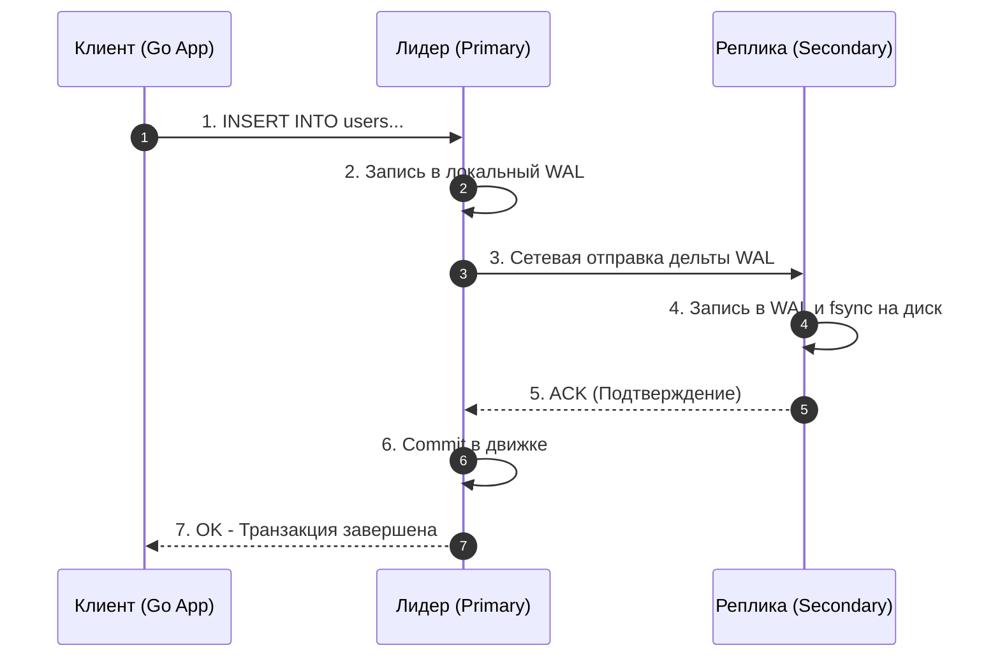
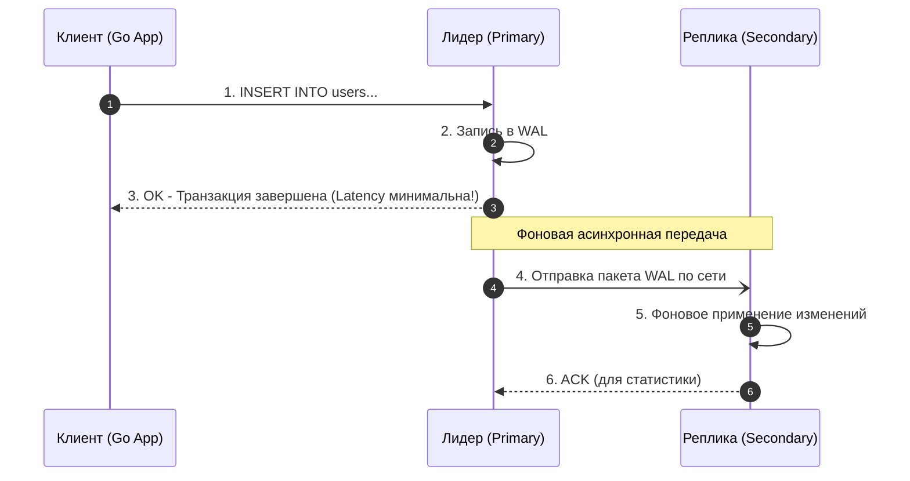

## Введение в репликацию

В архитектуре современных высоконагруженных бэкенд-систем даже самый производительный одиночный сервер — вооруженный терабайтами оперативной памяти и быстрейшими массивами NVMe — представляет собой уязвимую единичную точку отказа (**SPOF — Single Point of Failure**). 

Физический мир полон энтропии: контроллеры накопителей деградируют, в дата-центрах экскаваторы рвут магистральные оптоволоконные кабели, а системные администраторы случайно обесточивают серверные стойки. Единственный фундаментальный способ гарантировать живучесть данных в условиях неизбежных аппаратных сбоев — это **избыточность (Redundancy)**.

**Репликация** — это процесс непрерывного, детерминированного поддержания нескольких актуальных копий одних и тех же данных на географически или физически независимых вычислительных узлах (нодах).

Если в эпоху классических монолитов база данных представляла собой «одну большую железку», то в распределенных системах репликация — это несущая колонна, на которой держатся высокая доступность (**High Availability, HA**), катастрофоустойчивость (**Disaster Recovery**) и горизонтальное масштабирование нагрузки на чтение (**Read Scaling**).

Однако избыточность не дается даром. Главный архитектурный вопрос, определяющий сложность, задержки и гарантии вашей системы, звучит предельно прагматично: **В какой именно момент транзакция считается успешно сохраненной, а реплика — обновленной?**

Ответ на этот вопрос делит мир репликации на два фундаментальных лагеря: **Синхронную** и **Асинхронную**.

---

## Синхронная репликация (Synchronous)

При синхронной репликации основной узел (**Leader / Master**), приняв от прикладного клиента запрос на модификацию данных, категорически отказывается возвращать подтверждение `OK`, пока изменения не будут гарантированно зафиксированы хотя бы на одной или всех подчиненных репликах (**Follower / Replica**).

### Алгоритм работы

1. Клиент (Go-микросервис) отправляет команду `INSERT` или `UPDATE`.
2. Лидер записывает транзакцию в свой локальный журнал предзаписи (**WAL — Write Ahead Log**) и обновляет структуры страниц в памяти.
3. Лидер приостанавливает выполнение транзакции и пересылает пакет изменений по сети на реплику.
4. Реплика принимает пакет, сбрасывает данные в свой локальный WAL/диск и отправляет лидеру сетевое подтверждение (**ACK**).
5. Только после получения ACK лидер фиксирует транзакцию у себя и возвращает клиенту статус «OK — Транзакция завершена».



### Mechanical Sympathy: Цена согласованности

С точки зрения физики полупроводников и законов распространения электромагнитных волн, синхронная репликация — это экстремально дорогая операция.

Чтобы транзакция завершилась, сетевой пакет обязан совершить физический вояж:
- Передача по сетевому стеку ОС лидера в сетевую карту (NIC).
- Прохождение оптоволоконных маршрутов: скорость света в кварцевом стекле составляет около $200\,000$ км/с (примерно 1 мс на 200 км). Если лидер находится во Франкфурте, а реплика — в Вирджинии, одно лишь время полета фотонов туда и обратно (**RTT — Round Trip Time**) составит не менее 70–80 мс!
- Дисковый ввод-вывод на удаленной реплике: вызов системного вызова `fsync` для гарантированного сброса страниц из кэша ОС на пластины или ячейки NAND.
- Обратный сетевой пакет подтверждения ACK.

Синхронная репликация намертво привязывает задержку записи (Write Latency) к задержке самого медленного сетевого узла. Если в мульти-мастер или синхронном кольце один узел испытывает проблемы со сборщиком мусора (GC pause) или ловит дисковый фриз, весь кластер замирает. В межконтинентальных системах пропускная способность одного потока записи физически падает до 10–15 транзакций в секунду.

> [!tip] Собеседование
> **Вопрос:** Когда на практике действительно оправдана чистая синхронная репликация?
> 
> **Ответ:** Исключительно в тех доменах, где потеря даже одной зафиксированной транзакции означает прямой финансовый или юридический крах (банковский биллинг, клиринговые палаты, реестры критических активов).  
> В высоконагруженных промышленных системах вместо синхронной репликации на все узлы используют либо **кворумные консенсусные протоколы** (Raft/Paxos, где достаточно согласия большинства $\frac{N}{2}+1$), либо **полусинхронную репликацию (Semi-Synchronous)**, где лидер ожидает подтверждения строго от одной быстрой реплики в пределах того же дата-центра или Availability Zone.

---

## Асинхронная репликация (Asynchronous)

При асинхронной схеме лидер записывает изменения в свой локальный журнал и **немедленно** возвращает клиенту статус успешного завершения операции. Передача данных репликам делегируется фоновым системным потокам и происходит с некоторой временной задержкой — «по мере физической возможности сети».

### Алгоритм работы

1. Клиент отправляет `INSERT INTO users...`.
2. Лидер сбрасывает транзакцию в локальный WAL и **сразу** возвращает клиенту статус `OK`.
3. Спустя некоторое время (миллисекунды или секунды в зависимости от загрузки сети и CPU) фоновый поток репликации считывает журнал и пересылает байты реплике.
4. Реплика накладывает изменения в фоновом режиме.



### Проблема Lag-а (Replication Lag) и Eventual Consistency

Асинхронная репликация делает операции записи молниеносными, но платит за это возникновением временного рассинхрона — **Replication Lag (Отставание реплики)**. 

В распределенных системах такое состояние называется **Eventual Consistency (Согласованность в конечном счете)**: если поток записей прекратится, через некоторое время все реплики гарантированно догонят лидера и придут в идентичное состояние. Однако пока система находится под нагрузкой, реплика показывает снимок прошлого.

Чтение с отстающей реплики называется **грязным чтением устаревших данных (Stale Read)**.

> [!warning] Ловушка / Gotcha: Аномалия Read-After-Write
> **Сценарий из реальной жизни:**  
> Пользователь меняет имя в профиле и нажимает «Сохранить». Запрос уходит на Leader, транзакция коммитится за 1 мс, браузер получает ответ `201 Created`.  
> Фронтенд делает мгновенный редирект и запрашивает страницу профиля. Балансировщик направляет этот `SELECT` на Follower.  
> 
> **Результат:** Из-за лага репликации в 50 мс реплика еще не получила свежую запись. Пользователь видит свое СТАРОЕ имя! Он решает, что произошел сбой, и начинает судорожно кликать кнопку еще раз, порождая лавину паразитных запросов.  
> 
> **Инженерное решение в Go:**
> 1. **Sticky Master (Сессионная привязка):** Если текущий пользователь совершил операцию записи, все его последующие чтения в течение времени, заведомо превышающего максимальный лаг (например, 2–3 секунды), принудительно направляются на Leader.
> 2. **Причинно-следственная согласованность (Causal / Session Consistency):** Передача в заголовках запроса идентификатора транзакции (LSN в Postgres или GTID в MySQL). Реплика блокирует чтение до тех пор, пока ее локальный LSN не догонит LSN из запроса.

---

## Сравнение и выбор стратегии

Выбор между синхронной и асинхронной репликацией — это классический компромисс теории распределенных систем, фундаментально формализованный в [[7. CAP теорема]].

| Характеристика | Синхронная репликация | Асинхронная репликация |
| :--- | :--- | :--- |
| **Консистентность (Consistency)** | Строгая (**Strong Consistency**). Данные идентичны на всех подтвержденных узлах. | Слабая (**Eventual Consistency**). Реплики отстают на величину Replication Lag. |
| **Доступность (Availability)** | Низкая. Отказ или сетевая изоляция хотя бы одной синхронной реплики блокирует запись на лидере. | Высокая. Лидер продолжает принимать записи, даже если все реплики отключены от сети. |
| **Задержка записи (Write Latency)** | Высокая. Ограничена RTT сети до самой удаленной реплики и временем удаленного `fsync`. | Минимальная. Определяется исключительно скоростью локального диска и кэша лидера. |
| **Риск потери данных (RPO)** | **RPO = 0**. При аварии лидера ни одна подтвержденная клиенту транзакция не теряется. | **RPO > 0**. При внезапном крахе лидера теряются все транзакции, не успевшие улететь по сети. |

### Полусинхронная репликация (Semi-Synchronous)

Чтобы разорвать замкнутый круг между надежностью и скоростью, в индустрии повсеместно применяется **полусинхронная репликация**.

В этом режиме лидер не ждет подтверждения от *всех* реплик кластера. Ему достаточно получить ACK ровно от **одной** реплики. Если выделенная синхронная реплика перестает отвечать по таймауту, система автоматически деградирует до асинхронного режима, сохраняя доступность базы данных для пользователей ценой временного снижения уровня защиты.

* **В PostgreSQL:** Реализуется через потоковую репликацию с директивой `synchronous_commit = on` (лидер ждет сброса на диск реплики) или `synchronous_commit = remote_write` (лидер ждет лишь подтверждения, что реплика приняла байты в память операционной системы).
* **В MySQL:** Реализуется через встроенный плагин `rpl_semi_sync_master` в режиме `AFTER_SYNC`.

---

## Под капотом: Как данные попадают на реплику?

Независимо от того, является репликация синхронной или асинхронной, физический транспорт данных опирается на журнал опережающей записи — подробнее об устройстве журнала читайте в главе [[8. WAL. Write Ahead Log]].

В современной архитектуре СУБД выделяют два основных подхода:

```mermaid
flowchart LR
    subgraph Physical ["1. Physical Replication (Потоковая бинарная)"]
        W1["WAL страницы (байты)"] -->|Битовая копия| W2["WAL страницы реплики"]
    end

    subgraph Logical ["2. Logical Replication (Логическая декодированная)"]
        L1["WAL лидера"] -->|Декодер| SQL["Табличные события: INSERT/UPDATE"]
        SQL -->|Применение| L2["Таблица реплики"]
    end

    style Physical fill:#0f172a,stroke:#38bdf8,stroke-width:2px
    style Logical fill:#0f172a,stroke:#818cf8,stroke-width:2px
```



1. **Physical Replication (Физическая / Потоковая репликация):**  
   Передаются не абстрактные команды SQL, а точные бинарные дельты физических страниц диска из WAL (смещения байтов, заголовки страниц).  
   * *Плюсы:* Максимальная скорость передачи, минимальная нагрузка на процессор (zero-overhead).
   * *Минусы:* Реплика обязана быть абсолютным аппаратным и программным клоном лидера: та же мажорная версия СУБД, та же архитектура CPU (x86-64 / ARM64) и порядок байтов (Endianness). Нельзя реплицировать только одну таблицу.
   * *Пример:* PostgreSQL Streaming Replication.
2. **Logical Replication (Логическая репликация):**  
   Специальный процесс-декодер на лидере считывает WAL и преобразует физические байты в высокоуровневые логические события изменения строк (`INSERT id=1, name='Ivan'`).  
   * *Плюсы:* Кросс-платформенность. Можно реплицировать данные между разными версиями СУБД (для Zero-downtime апгрейда), между x86 и ARM-серверами, а также выборочно реплицировать отдельные таблицы или фильтровать колонки.
   * *Минусы:* Дополнительная нагрузка на CPU лидера для декодирования и сериализации журнала.
   * *Пример:* PostgreSQL Logical Replication, MySQL Row-Based Binlog.

---

## Go и репликация: Практика построения отказоустойчивого клиента

В кодовой базе на Go разработчик не настраивает топологию репликации вручную — это зона ответственности SRE и администраторов баз данных. Однако приложение обязано уметь взаимодействовать с кластером, разделяя операции чтения и записи через раздельные пулы соединений:

```go
package repository

import (
	"context"
	"database/sql"
	"fmt"
	"time"
)

// ClusterDB управляет пулами соединений к лидеру и пулу реплик.
type ClusterDB struct {
	Master  *sql.DB // Предназначен строго для INSERT, UPDATE, DELETE
	Replica *sql.DB // Предназначен для масштабируемых SELECT
}

// NewClusterDB инициализирует пулы с учетом архитектурных рекомендаций.
func NewClusterDB(masterDSN, replicaDSN string) (*ClusterDB, error) {
	masterDB, err := sql.Open("pgx", masterDSN)
	if err != nil {
		return nil, fmt.Errorf("open master: %w", err)
	}
	// Для мастера критичны строгие лимиты открытых соединений
	masterDB.SetMaxOpenConns(20)
	masterDB.SetMaxIdleConns(5)
	masterDB.SetConnMaxLifetime(10 * time.Minute)

	replicaDB, err := sql.Open("pgx", replicaDSN)
	if err != nil {
		return nil, fmt.Errorf("open replica: %w", err)
	}
	// Реплик обычно больше, нагрузка на чтение выше — выделяем более широкий пул
	replicaDB.SetMaxOpenConns(100)
	replicaDB.SetMaxIdleConns(20)
	replicaDB.SetConnMaxLifetime(10 * time.Minute)

	return &ClusterDB{Master: masterDB, Replica: replicaDB}, nil
}

// GetUser с поддержкой защиты от лага репликации (Read-After-Write)
func (db *ClusterDB) GetUser(ctx context.Context, userID int, forceMaster bool) (*User, error) {
	targetDB := db.Replica
	if forceMaster {
		// Если пользователь только что отредактировал данные, читаем с Master
		targetDB = db.Master
	}

	var u User
	err := targetDB.QueryRowContext(ctx, "SELECT id, name, email FROM users WHERE id = $1", userID).
		Scan(&u.ID, &u.Name, &u.Email)
	if err != nil {
		return nil, fmt.Errorf("query user: %w", err)
	}
	return &u, nil
}

// CreateUser всегда модифицирует данные через Leader
func (db *ClusterDB) CreateUser(ctx context.Context, u *User) error {
	query := "INSERT INTO users (name, email) VALUES ($1, $2) RETURNING id"
	err := db.Master.QueryRowContext(ctx, query, u.Name, u.Email).Scan(&u.ID)
	if err != nil {
		return fmt.Errorf("insert user: %w", err)
	}
	return nil
}

type User struct {
	ID    int
	Name  string
	Email string
}
```

> [!info] Под капотом (Network)
> При использовании синхронной репликации вызов `db.ExecContext` в Go-сервисе блокирует выполнение конкретной горутины на все время сетевого обмена (RTT) между узлами базы данных. Планировщик Go в этот момент грациозно переводит горутину в состояние ожидания сетевого полинга (netpoller), освобождая системный тред OS для другой работы.  
> Однако если в межсерверной сети возникнет дрожание задержки (**Jitter**), время ожидания горутин возрастет. Это приведет к лавинообразному исчерпанию лимита пула `SetMaxOpenConns` и росту времени ответа сервиса (Latency degradation).

---

## Резюме

1. **Синхронная репликация** гарантирует нулевую потерю данных (**RPO = 0**), но накладывает жесткий штраф на скорость записи и делает доступность системы заложником стабильности сетевого канала и задержек удаленного `fsync`.
2. **Асинхронная репликация** максимизирует пропускную способность и доступность системы, но платит за это риском потери последних транзакций при отказе лидера и явлением **Replication Lag (Stale Reads)**.
3. **Полусинхронная репликация (Semi-Synchronous)** — доминирующий промышленный стандарт, сочетающий высокую скорость отклика с гарантией сохранности копии данных на выделенном узле.
4. В прикладном коде на Go архитектор обязан разделять пулы соединений (Master для записи, Replicas для чтения) и нейтрализовать аномалии **Read-After-Write** с помощью паттерна Sticky Master или сессионных меток консистентности.

Мы разобрались с временными моделями фиксации данных. Однако в распределенной системе остается открытым фундаментальный вопрос: *каким образом узлы договариваются о том, кто из них имеет право принимать изменения, а кто обязан подчиняться?*

В следующей лекции мы детально исследуем доминирующую топологию распределенных СУБД — [[2. Leader Follower]].