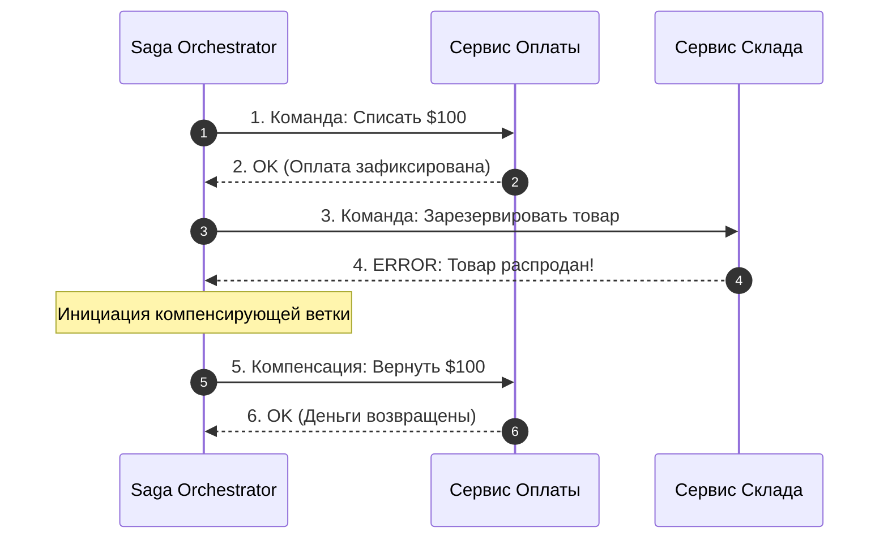

В распределенных системах мы регулярно сталкиваемся с необходимостью обеспечить неделимость бизнес-операций, затрагивающих сразу несколько независимых микросервисов и изолированных баз данных. 

Как мы выяснили в обзорной статье [[8. Distributed transactions]], классический двухфазный коммит [[9. Two Phase Commit]] оказывается непомерно дорогим и нежизнеспособным в масштабируемых облачных системах из-за синхронных блокировок таблиц и риска паралича кластера при падении координатора.

**Saga Pattern (Паттерн Сага)** — это элегантный архитектурный шаблон, впервые сформулированный исследователями Принстонского университета Гектором Гарсия-Молиной и Кеннетом Салемом еще в 1987 году. Сага заменяет одну тяжелую монолитную распределенную транзакцию упорядоченной последовательностью **локальных транзакций**. 

Каждая локальная транзакция обновляет состояние своей изолированной базы данных, фиксирует коммит немедленно и публикует событие (или отправляет сообщение), инициирующее следующий шаг цепочки. Если же на каком-то промежуточном этапе происходит ошибка, Сага запускает в обратном порядке каскад **компенсирующих транзакций (Compensating Transactions)**, которые логически нейтрализуют эффект всех ранее завершенных шагов.

---

## Анатомия Саги: Прощай, Изоляция

Самое важное концептуальное откровение для инженера, переходящего от локальных реляционных баз данных к Сагам: **в Сагах отсутствует свойство Isolation (Изоляция) классического стандарта ACID**.

Поскольку каждый шаг фиксируется в локальной СУБД сразу, промежуточные результаты Саги (например, уже списанные с баланса клиента деньги, но еще не зарезервированный на складе товар) становятся немедленно видны другим параллельным читателям и транзакциям. 

По сути, Сага гарантирует свойства **ACD** (Atomicity, Consistency, Durability) в режиме [[6. Consistency модели|Eventual Consistency (Согласованности в конечном счете)]].

### Типы транзакций в Саге

Чтобы спроектировать отказоустойчивую Сагу, все шаги бизнес-процесса строго делят на три функциональные категории:

```mermaid
flowchart LR
    subgraph SagaSteps ["Анатомия цепочки Саги"]
        T1["<b>1. Compensatable</b><br>Списание денег<br>(Имеет компенсацию C1)"] --> T2["<b>2. Pivot Transaction</b><br>Резервирование на складе<br>(Точка невозврата!)"]
        T2 --> T3["<b>3. Retriable Transaction</b><br>Генерация чека / Push<br>(Гарантированный успех)"]
    end

    style SagaSteps fill:#0f172a,stroke:#38bdf8,stroke-width:2px
    style T1 fill:#1e293b,stroke:#fbbf24,stroke-width:1px
    style T2 fill:#1e293b,stroke:#f43f5e,stroke-width:2px
    style T3 fill:#1e293b,stroke:#34d399,stroke-width:1px
```



1. **Компенсируемые транзакции (Compensatable Transactions):**  
   Шаги, предшествующие точке невозврата. Для каждого такого шага обязательно проектируется парная компенсирующая операция, способная логически вернуть систему в исходное состояние (например, операция зачисления денег обратно на счет в случае сбоя).
2. **Поворотная транзакция (Pivot Transaction):**  
   Критическая точка невозврата во всем бизнес-процессе. Если поворотная транзакция завершилась успешным коммитом, Сага **гарантированно обязана дойти до победного конца**. Она не является ни компенсируемой, ни отменяемой.
3. **Повторяемые транзакции (Retriable Transactions):**  
   Шаги, следующие строго *после* поворотной транзакции. Они спроектированы так, что в случае сетевых сбоев система просто перезапускает их до тех пор, пока они не завершатся триумфом (например, отправка фискального чека клиенту или посылка SMS-уведомления).

---

## 1. Хореография (Choreography)

В модели хореографии центральный координатор отсутствует. Архитектура построена на принципах реактивного событийно-ориентированного взаимодействия (**Event-Driven Architecture**): каждый сервис слушает шину сообщений (Kafka, RabbitMQ, NATS), выполняет свою локальную транзакцию и выбрасывает доменное событие, побуждающее следующий сервис к действию.

```mermaid
flowchart LR
    Orders["Сервис Заказов"] -->|"Заказ Создан"| Payment["Сервис Оплаты"]
    Payment -->|"Оплата Прошла"| Inventory["Сервис Склада"]
    Inventory -->|"Товар Зарезервирован"| Delivery["Сервис Доставки"]
    
    Inventory -.->|"Ошибка Склада"| PaymentComp["Возврат Оплаты"]
    PaymentComp -.->|"Деньги Вернулись"| OrdersComp["Отмена Заказа"]

    style Orders fill:#1e293b,stroke:#38bdf8,stroke-width:1px
    style Payment fill:#1e293b,stroke:#38bdf8,stroke-width:1px
    style Inventory fill:#1e293b,stroke:#38bdf8,stroke-width:1px
    style Delivery fill:#1e293b,stroke:#34d399,stroke-width:1px
    style PaymentComp fill:#1e293b,stroke:#f43f5e,stroke-width:1px
    style OrdersComp fill:#1e293b,stroke:#f43f5e,stroke-width:1px
```



* **Плюсы:** Предельная слабая связанность (Loose Coupling), децентрализация, простота и скорость внедрения для простых сценариев из 2–3 сервисов.
* **Минусы:** По мере роста системы логика цепочки размывается по десяткам микросервисов. Возникает феномен «спагетти-событий» (Event Spaghetti), сложно мониторить статус сквозной операции, а отладка циклов превращается в сущий кошмар.

---

## 2. Оркестрация (Orchestration)

В модели оркестрации процессом руководит выделенный логический компонент — **Оркестратор (Saga Orchestrator)**. 

Оркестратор представляет собой отказоустойчивый конечный автомат (State Machine). Он отправляет прямые синхронные или асинхронные команды сервисам-исполнителям, дожидается их ответов, сохраняет состояние каждого шага в базу и, при возникновении сбоя, централизованно командует запуском компенсирующих действий в строгом порядке LIFO (Last-In, First-Out).



* **Плюсы:** Вся картина бизнес-процесса видна в одном месте, тривиальный мониторинг и трассировка, отсутствие циклических зависимостей, легкое изменение шагов.
* **Минусы:** Оркестратор концентрирует в себе бизнес-логику и может стать единой точкой отказа (**SPOF**), если его состояние не реплицируется в отказоустойчивое хранилище.

---

## Mechanical Sympathy: Outbox и Идемпотентность

Чтобы Сага была по-настоящему надежной на уровне физических серверов и сетевых пакетов, ее невозможно реализовать простым вызовом брокера сообщений посреди Go-функции. 

Если база данных успешно закоммитит локальную транзакцию, а процесс упадет до отправки события в Kafka (или сеть моргнет), состояние системы разорвется: шаг выполнен, но следующий микросервис о нем никогда не узнает!

### 1. Transactional Outbox
Единственный надежный архитектурный паттерн — сохранение доменного события в ту же самую базу данных, в специальную таблицу `outbox`, **в рамках той же локальной ACID-транзакции**.  
Фоновый процесс (Debezium или специализированный воркер на Go) считывает таблицу Outbox через Change Data Capture (CDC) и с гарантией доставляет событие в шину (подробнее см. [[11. Outbox pattern]]).

### 2. Идемпотентность (Idempotency)
В распределенных сетях неизбежны повторные отправки (Retries). Если сервис оплаты из-за кратковременного таймаута получит директиву «Списать 100$» повторно, он обязан вернуть успешный статус, но ни в коем случае не списывать деньги второй раз.  
* **Решение:** Каждый шаг Саги снабжается глобальным идентификатором `SagaID` + `StepID`. Сервис-исполнитель атомарно проверяет наличие этого ключа в своей базе перед обработкой (подробнее см. [[12. Idempotency и БД]]).

---

## Реализация на Go: Принципы построения Оркестратора

В кодовой базе на Go паттерн Сага можно элегантно абстрагировать в виде цепочки функций действия (`Execute`) и отката (`Compensate`):

```go
package saga

import (
	"context"
	"fmt"
	"log"
)

// Step описывает один шаг распределенной Саги
type Step struct {
	Name       string
	Execute    func(ctx context.Context) error
	Compensate func(ctx context.Context) error
}

// Orchestrator выполняет шаги Саги и управляет компенсациями
type Orchestrator struct {
	steps []Step
}

func NewOrchestrator(steps ...Step) *Orchestrator {
	return &Orchestrator{steps: steps}
}

// Run выполняет сагу. При ошибке шага запускает компенсации в обратном порядке (LIFO).
func (o *Orchestrator) Run(ctx context.Context) error {
	var executedSteps []Step

	for _, step := range o.steps {
		log.Printf("Executing step: %s", step.Name)
		if err := step.Execute(ctx); err != nil {
			log.Printf("Step %s failed: %v. Starting compensations...", step.Name, err)
			o.rollback(ctx, executedSteps)
			return fmt.Errorf("saga step %s failed: %w", step.Name, err)
		}
		executedSteps = append(executedSteps, step)
	}

	log.Println("Saga completed successfully")
	return nil
}

func (o *Orchestrator) rollback(ctx context.Context, executedSteps []Step) {
	// Компенсации выполняются строго в обратном хронологическом порядке (LIFO)
	for i := len(executedSteps) - 1; i >= 0; i-- {
		step := executedSteps[i]
		if step.Compensate == nil {
			continue
		}
		log.Printf("Compensating step: %s", step.Name)
		if err := step.Compensate(ctx); err != nil {
			// Критическая ошибка: компенсация упала!
			// В продакшене это событие отправляется в Dead Letter Queue (DLQ) для ручного разбора
			log.Printf("CRITICAL: compensation for step %s failed: %v", step.Name, err)
		}
	}
}
```

> [!warning] Ловушка / Gotcha: Проблема потерянного обновления
> Поскольку изоляция (Isolation) отсутствует, пока Сага находится в промежуточном состоянии ожидания склада, параллельный поток может прочитать запись и затереть ее.  
> 
> **Решение:** Использование **семантических блокировок (Semantic Locking)**.  
> Вместо перевода сущности сразу в состояние `status = 'ACTIVE'`, помечайте ее промежуточными флагами: `status = 'PENDING_PAYMENT'` или `status = 'RESERVING_STOCK'`. Бизнес-логика всех остальных микросервисов должна быть обучена игнорировать строки, находящиеся в статусах `PENDING`.

---

## Инструментарий для Go: Промышленный уровень

Писать сложные многошаговые Саги вручную на `if-else` и самодельных циклах — путь к боли и ошибкам. В промышленной эксплуатации бэкендов на Go доминируют проверенные фреймворки:

1. **Temporal.io / Cadence:** Абсолютный эталон в индустрии. Вы пишете бизнес-логику Саги как линейный Go-код (**Workflow as Code**). Temporal берет на себя сохранение истории событий, таймеры ожидания, отказоустойчивые ретраи и вызовы компенсаций при перезапуске нод.
2. **Watermill (ThreeDotsLabs):** Превосходная легковесная Go-библиотека для построения событийно-ориентированных Саг (Хореографии) поверх Kafka, RabbitMQ или NATS.

> [!tip] Собеседование
> **Вопрос:** Что произойдет, если компенсирующая транзакция сама завершится с сетевой или внутренней ошибкой?
> 
> **Ответ:** Это аварийная ситуация высшего приоритета. По определению паттерна Сага, компенсирующие транзакции обязаны быть **повторяемыми (Retriable) и идемпотентными**.  
> Система обязана бесконечно повторять вызов компенсации с экспоненциальным откатом. Если же произошел программный сбой (баг валидации схемы), транзакция отправляется в очередь недоставленных сообщений (**DLQ — Dead Letter Queue**), и дежурный инженер оповещается через алерты для ручного исправления состояния.

---

## Резюме

1. **Saga Pattern** заменяет распределенный ACID последовательностью локальных транзакций с компенсирующими действиями в случае сбоев.
2. **Хореография** идеальна для простых цепочек из 2–3 сервисов; **Оркестрация** — промышленный стандарт для комплексных многоэтапных бизнес-процессов.
3. Отсутствие свойства **Isolation** компенсируется на прикладном уровне через **семантические блокировки** (`PENDING`-статусы).
4. Надежность Саги опирается на фундамент **Transactional Outbox** и строгую **Идемпотентность** каждого эндпоинта.

Мы научились координировать транзакции между сервисами. Но чтобы оркестраторы и фоновые обработчики на Go не конфликтовали при одновременной работе над одними и теми же учетными записями, нам требуется надежный способ синхронизации в сети.

В финальной лекции этого подраздела мы разберем распределенные мьютексы — [[11. Distributed locks]].