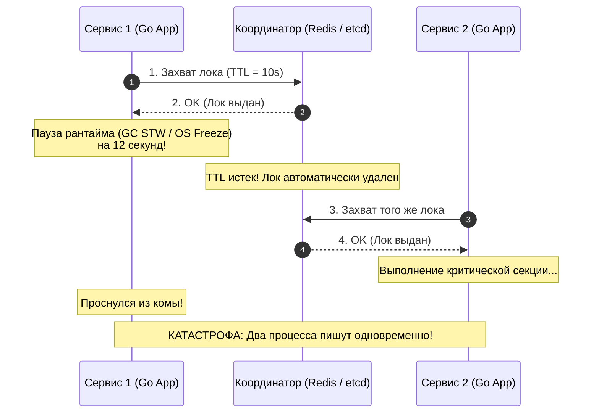

## Распределенные блокировки: Когда одного sync.Mutex недостаточно

В пределах одного процесса Go синхронизация параллельных горутин решается тривиально и изящно: мы используем стандартные примитивы `sync.Mutex` или `sync.RWMutex`. Они опираются на атомарные процессорные инструкции (CAS — Compare-And-Swap) и разделяемую память операционной системы, обеспечивая практически нулевые накладные расходы при отсутствии конкуренции.

Однако в реальной микросервисной архитектуре, где ваш Go-сервис масштабирован на десятки изолированных подов в Kubernetes или развернут на нескольких физических серверах, локальный мьютекс становится абсолютно бесполезным: у независимых процессов нет общей оперативной памяти. 

При этом бизнес-логика часто бескомпромиссно требует эксклюзивности:
- Ровно один воркер во всем кластере должен рассчитывать ежемесячные финансовые начисления в полночь.
- Ровно один инстанс должен списывать бонусы клиента при параллельных кликах.
- Ровно один процесс должен генерировать тяжелый аналитический отчет, не допуская дублирования вычислений.

Для решения этой задачи применяются **Распределенные блокировки (Distributed Locks)** — механизм синхронизации, который выносит состояние взаимного исключения во внешнее отказоустойчивое сетевое хранилище, доступное всем узлам кластера.

---

## 1. Фундаментальная проблема: Время и Паузы

Распределенные блокировки — один из самых коварных разделов computer science. Главная опасность кроется в непонимании физики рантайма операционной системы и непредсказуемости асинхронных сетей (**Mechanical Sympathy**).

> [!warning] Ловушка / Gotcha: Проблема GC и "Стоп-мир" (Process Pauses)
> Представьте типичный сценарий:
> 1. Горутина сервиса А успешно захватывает распределенный лок в Redis с временем жизни (TTL) в 10 секунд.
> 2. Сразу после получения подтверждения в рантайме Go запускается тяжелый цикл сборки мусора **GC (Garbage Collection) Stop The World**, либо гипервизор облака приостанавливает поток ОС (Scheduling Pause) на 11 секунд из-за миграции виртуальной машины.
> 3. Пока сервис А находится в глубокой системной «коме», таймер TTL в 10 секунд на стороне Redis благополучно истекает, и Redis удаляет ключ.
> 4. Сервис Б запрашивает тот же ресурс, видит, что лок свободен, успешно захватывает его и начинает изменять данные в базе.
> 5. Сервис А наконец-то «просыпается» из паузы! Будучи уверенным, что он всё еще монопольно владеет локом, он также начинает писать в базу данных!
> 
> **Итог:** Фатальное состояние гонки (Race Condition), одновременная запись двух независимых процессов и тихое разрушение консистентности данных.



---

## 2. Стратегии реализации

Существует три фундаментальных подхода к организации распределенных блокировок, каждый из которых соотносится с компромиссами [[7. CAP теорема]].

### А. Блокировки на базе реляционной БД (SQL)
Самый простой и прямолинейный подход для монолитных или небольших проектов. В базе создается таблица `locks` с уникальным индексом по названию ресурса:
```sql
CREATE TABLE distributed_locks (
    resource_name VARCHAR(128) PRIMARY KEY,
    owner_id      VARCHAR(64) NOT NULL,
    acquired_at   TIMESTAMP NOT NULL DEFAULT NOW()
);
```
* **Механизм:** Попытка захвата — это `INSERT INTO distributed_locks (resource_name, owner_id) VALUES ('order_123', 'worker-pod-4')`. Если строка уже существует, СУБД возвращает ошибку нарушения уникального ключа (Duplicate Key Error) — значит, ресурс занят. Освобождение — обычный `DELETE`.
* **Плюсы:** Не требует внедрения новых инфраструктурных компонентов.
* **Минусы:** Плохая масштабируемость при частом взятии локов (дисковый I/O на WAL), отсутствие автоматического TTL: если под упадет до вызова `DELETE`, лок навсегда зависнет («мертвая блокировка»), требуя фоновых демонов для очистки устаревших записей.

### Б. Redis и алгоритм Redlock
Экстремально быстрый и популярный подход, часто реализуемый через библиотеки вроде `redsync`:
* **Базовый примитив:** Атомарная команда `SET resource_name my_random_value NX PX 30000` (установить ключ, только если он не существует (`NX`), с миллисекундным временем жизни в 30 секунд (`PX`)).
* **Алгоритм Redlock (Сальваторе Санфилиппо / Antirez):** Захват лока в $N$ независимых инстансах Redis (обычно 5 нод). Лок считается успешно захваченным, если большинство ($N/2 + 1$) ответили согласием за время, существенно меньшее, чем общий TTL.
* **Плюсы:** Сверхвысокая пропускная способность (сотни тысяч операций в секунду из памяти).
* **Минусы:** Известная математическая критика Мартина Клеппманна (Martin Kleppmann): в асинхронных сетях без синхронизированных физических часов Redlock не способен дать строгую математическую гарантию безопасности при системных паузах рантайма.

### В. Консенсус-системы (etcd, Consul, Apache ZooKeeper)
Безоговорочный стандарт для критически важных распределенных систем (**CP-класс** по CAP):
* **Механизм:** Использование протоколов консенсуса (Raft / Paxos) в связке с механизмами **аренд (Leases)** и **наблюдателей (Watchers)**. Клиент создает эфемерный ключ с ассоциированной арендой и фоновым потоком подтверждения жизни (**Heartbeat / Keep-Alive**). Если сервис погибает, etcd автоматически удаляет аренду и ключ по таймауту.
* **Плюсы:** Строгая математическая линеаризуемость. Гарантируется, что лок никогда не будет перехвачен другим процессом, пока жива сессия текущего владельца.

---

## 3. Решение "проблемы заснувшего клиента": Fencing Tokens

Как защитить базу данных от «заснувшего» клиента, который проснулся после паузы GC и наивно считает, что лок все еще принадлежит ему?

Мартин Клеппманн доказал: единственный математически надежный способ решения этой проблемы — использование **Fencing Tokens (Защитных токенов)**.

Суть механизма проста: при каждом успешном захвате блокировки сервер координации (etcd или ZK) возвращает монотонно возрастающее число (Epoch / Revision / Transaction ID). Целевое хранилище (БД, S3 или файловый сервис) обязано проверять этот токен перед выполнением любой записи:

```mermaid
flowchart TD
    App1["Сервис 1<br>(Захватил лок)<br><b>Token = 33</b>"]
    App2["Сервис 2<br>(Перехватил лок)<br><b>Token = 34</b>"]
    Storage[("База данных Storage<br>Last Seen Token: 33")]

    App1 -->|"1. Заснул в GC STW..."| App1
    App2 -->|"2. Успешная запись (Token 34)"| Storage
    Storage -->|"3. Обновлено состояние:<br>Last Seen Token = 34"| Storage
    App1 -->|"4. Проснулся!<br>Попытка записи с устаревшим Token 33"| Storage
    Storage --x|"5. ОТКАЗ!<br>Токен 33 < 34 (Запрос отклонен)"| App1

    style App1 fill:#1e293b,stroke:#f43f5e,stroke-width:1px
    style App2 fill:#1e293b,stroke:#34d399,stroke-width:1px
    style Storage fill:#0f172a,stroke:#38bdf8,stroke-width:2px
```



Любая попытка заснувшего процесса совершить запись отвергается самой базой данных, так как номер токена устарел ($33 < 34$). Целостность данных спасена!

---

## 4. Идиоматичный Go: Промышленная реализация на etcd

В экосистеме Go эталоном надежности является официальный клиент `go.etcd.io/etcd/client/v3` и его пакет `concurrency`. Он берет на себя создание сессии, автоматический фоновый heartbeat для продления аренды (Lease Keep-Alive) и освобождение ресурсов при сбоях:

```go
package main

import (
	"context"
	"fmt"
	"log"
	"time"

	clientv3 "go.etcd.io/etcd/client/v3"
	"go.etcd.io/etcd/client/v3/concurrency"
)

func main() {
	// 1. Подключаемся к отказоустойчивому кластеру etcd
	cli, err := clientv3.New(clientv3.Config{
		Endpoints:   []string{"localhost:2379"},
		DialTimeout: 5 * time.Second,
	})
	if err != nil {
		log.Fatalf("connect to etcd: %v", err)
	}
	defer cli.Close()

	// 2. Создаем сессию с арендой (Lease TTL = 5 секунд).
	// Клиент etcd автоматически запускает горутину, которая шлет Heartbeats в фоне,
	// пока процесс жив. Если процесс рухнет, аренда истечет через 5 секунд.
	session, err := concurrency.NewSession(cli, concurrency.WithTTL(5))
	if err != nil {
		log.Fatalf("create session: %v", err)
	}
	defer session.Close()

	// Создаем распределенный мьютекс
	mutex := concurrency.NewMutex(session, "/distributed-lock/billing-report")

	// 3. Захват блокировки с ограничением по контексту
	ctx, cancel := context.WithTimeout(context.Background(), 10*time.Second)
	defer cancel()

	log.Println("Пытаемся захватить распределенный лок...")
	if err := mutex.Lock(ctx); err != nil {
		log.Fatalf("Не удалось захватить лок: %v", err)
	}

	// 4. КРИТИЧЕСКАЯ СЕКЦИЯ (Выполняется строго одним процессом в кластере)
	log.Printf("Лок успешно захвачен! Header Revision (Fencing Token): %d", session.Lease())
	time.Sleep(2 * time.Second) // Имитация полезной работы

	// 5. Грациозное освобождение блокировки
	if err := mutex.Unlock(context.Background()); err != nil {
		log.Fatalf("unlock error: %v", err)
	}
	log.Println("Лок успешно освобожден")
}
```

> [!tip] Собеседование: Безопасное снятие лока в Redis
> **Вопрос:** Как корректно освобождать распределенный лок в Redis, чтобы случайно не снять чужую блокировку?
> 
> **Ответ:** При установке ключа (`SET NX`) нужно обязательно генерировать уникальный `request_id` (например, UUID).  
> Нельзя просто вызвать команду `DELETE` (`DEL resource_name`), ведь лок мог истечь, и его уже мог занять параллельный воркер!  
> Освобождение обязано выполняться через **атомарный Lua-скрипт**, который сначала проверяет, совпадает ли `request_id` в Redis с тем, что у клиента:
> ```lua
> if redis.call("get", KEYS[1]) == ARGV[1] then
>     return redis.call("del", KEYS[1])
> else
>     return 0
> end
> ```

---

## 5. Выбор инструмента: Шпаргалка архитектора

| Технология | Скорость | Надежность | Когда использовать |
| :--- | :--- | :--- | :--- |
| **MySQL / PostgreSQL** | Низкая | Средняя | Если нагрузка мала, локи берутся редко, и не хочется разворачивать новую инфраструктуру. |
| **Redis (Redlock / Redsync)** | Экстремально высокая | Средняя | Если важна скорость (тысячи локов/сек), а кратковременная накладка из-за GC не приведет к финансовому краху (soft-locking, дедупликация писем). |
| **etcd / Consul** | Средняя | Абсолютная (CP) | Для критических бизнес-процессов (биллинг, лидер-элекшн, миграции схемы), где нарушение взаимного исключения недопустимо. |

---

## Резюме

1. **Распределенный лок** необходим, когда несколько независимых процессов должны монопольно координировать доступ к разделяемому ресурсу без общей оперативной памяти.
2. **Паузы рантайма (GC Stop The World)** и нестабильность сетей делают наивные тайм-ауты (TTL) уязвимыми к состояниям гонки.
3. Единственная математически строгая защита от «заснувшего клиента» — использование **Fencing Tokens** (монотонно возрастающих номеров ревизий).
4. В экосистеме Go библиотека `etcd/clientv3/concurrency` является промышленным эталоном для построения отказоустойчивой синхронизации на базе протокола Raft.

---

Мы полностью завершили фундаментальный восьмой подраздел, посвященный распределенным базам данных, репликации, шардингу, консенсусу и транзакциям. 

Теперь мы готовы перешагнуть границу классического реляционного мира и отправиться в царство нереляционных специализированных хранилищ, принесших в жертву привычный SQL ради колоссальной гибкости и пропускной способности.

В следующем подразделе нас ждет погружение в мир NoSQL: [[09. NoSQL базы/1. Что такое NoSQL]].