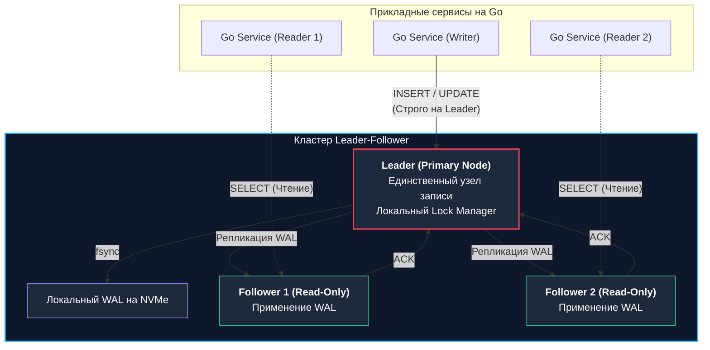
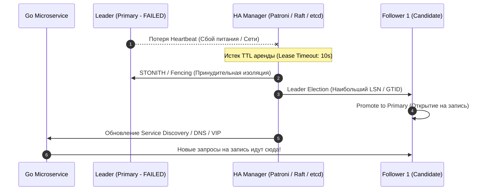

## Архитектура Leader-Follower

В предыдущей лекции ([[1. Репликация. Sync vs Async]]) мы детально исследовали физику передачи байтов по сети: разницу между синхронной фиксацией транзакций и асинхронным сбросом журналов. Теперь пришло время подняться на уровень выше и ответить на фундаментальный топологический вопрос: *кто именно в кластере наделен правом изменять состояние мира, а кто обязан послушно следовать за изменениями?*

В мире реляционных систем управления базами данных (PostgreSQL, MySQL), а также во многих масштабируемых NoSQL-хранилищах (Redis, MongoDB) безусловным стандартом де-факто является топология **Leader-Follower** (исторически именовавшаяся Master-Slave или Primary-Standby).

Это классическая асимметричная архитектура, построенная на жестком, бескомпромиссном разделении ролей:
1. **Leader (Primary / Master):** Единственный, полномочный узел кластера, которому прикладные сервисы имеют право отправлять модифицирующие операции (`INSERT`, `UPDATE`, `DELETE`, `ALTER TABLE`).
2. **Follower (Replica / Slave / Standby):** Подчиненные узлы, непрерывно считывающие поток журналов репликации (WAL / Binlog) с лидера и обслуживающие исключительно запросы на чтение (`SELECT`).

---

## Почему только один Leader?

Естественный инженерный порыв разработчика, столкнувшегося с потолком производительности записи, звучит так: *«Почему бы нам не открыть на запись все узлы кластера сразу? Мы сможем кратно увеличить суммарный входящий RPS!»*

Однако за этой иллюзорной простотой скрывается главный кошмар распределенных систем — **конкурентные конфликты записи (Write Conflicts)**. 

Представьте, что две параллельные горутины в разных концах света одновременно отправляют запрос на списание последних 100 рублей со счета клиента. Если оба узла имеют право писать, узел А успешно спишет деньги в адрес банка Х, а узел Б — в адрес банка Y. Когда эти транзакции попытаются реплицироваться друг на друга, данные разойдутся, а баланс станет неконсистентным. 

Разрешение подобных коллизий постфактум требует либо тяжелых распределенных двухфазных блокировок (что убивает производительность на корню), либо сложных математических моделей вроде бескликовых типов данных (**CRDTs**).

Архитектура с **одним лидером (Single-Leader)** устраняет эту проблему радикально и элегантно:
- Все запросы на модификацию выстраиваются в единую детерминированную очередь на одном узле.
- Лидер накладывает стандартные локальные строчные блокировки ядра ОС и фиксирует хронологический порядок коммитов.
- Лидер становится **единым источником истины (Single Source of Truth)** для глобальной истории изменений.



> [!info] Под капотом
> В классических СУБД (PostgreSQL, MySQL) менеджер блокировок (Lock Manager) и разделяемая память транзакций (`shared_buffers`, `Buffer Pool`) спроектированы для работы строго в рамках одного физического сервера. Попытка вынести строчные блокировки в распределенную сеть (Distributed Locks) потребовала бы сетевого консенсуса (на базе etcd, ZooKeeper или Raft) на каждый чих, увеличив время выполнения простейшего `UPDATE` с 0.2 мс до 15–20 мс.

---

## Жизненный цикл записи и чтения

### 1. Сценарий записи (Write Path)

Прикладной клиент на Go **всегда и без исключений** направляет запросы на изменение данных на текущий Leader-узел. 

Лидер обрабатывает транзакцию, проверяет внешние ключи и уникальные индексы, записывает изменения в свой журнал предзаписи (WAL) и, в зависимости от режима (Sync, Semi-Sync или Async), пересылает события подчиненным узлам. После подтверждения локальной или кластерной фиксации клиент получает статус успеха.

### 2. Сценарий чтения (Read Path)

Запросы на чтение (`SELECT`) могут обрабатываться как лидером, так и распределяться между любым количеством реплик (Followers). Это открывает возможность практически линейного горизонтального масштабирования операций чтения (**Read Scaling**): если одна нода способна отдавать 10 000 SELECT в секунду, кластер из 5 реплик теоретически обслужит до 50 000 RPS.

Однако за масштабирование чтения приходится платить фундаментальным компромиссом распределенных систем: **Replication Lag (Отставание реплики)**.

В асинхронном режиме репликации Follower неизбежно отстает от Leader на несколько миллисекунд (а при тяжелых фоновых миграциях — на секунды или минуты).

> [!warning] Ловушка / Gotcha: Аномалия Read-After-Write Consistency
> **Сценарий сбоя:**  
> Пользователь загружает новую аватарку в профиль. Запрос уходит на Leader, файл сохраняется, транзакция коммитится за 2 мс.  
> Браузер немедленно перегружает страницу и запрашивает URL аватарки. Балансировщик направляет этот `SELECT` на Follower 2.  
> 
> Из-за сетевой задержки или занятости CPU реплика отстает на 40 мс: она еще не применила WAL-запись с новой аватаркой. Пользователь видит пустой экран со старой фотографией, считает, что сервис завис, и начинает повторно загружать файл, перегружая бэкенд.  
> 
> **Решение Senior-уровня:**
> В Go-мидлварях для эндпоинтов профиля реализуется паттерн **Sticky Master**: после любой успешной операции записи в сессию пользователя (или в cookie / JWT / Redis) пишется временная метка `last_write_at`. Все последующие операции чтения этого пользователя в течение ближайших 2–3 секунд принудительно направляются на Leader, минуя отстающие реплики.

---

## Отказоустойчивость и Failover

Что произойдет, если Leader внезапно выйдет из строя (отказ контроллера накопителя, сбой питания серверной стойки, Kernel Panic или потеря сетевой связности)?

Поскольку принимать запись уполномочен только он, весь кластер мгновенно **теряет способность к записи (Write Unavailability)**. Чтобы вернуть систему к жизни, кластер обязан выбрать нового лидера. Этот процесс называется **Failover (Аварийное переключение)**.



### Этапы классического Failover:
1. **Обнаружение сбоя (Failure Detection):** Внешний наблюдатель (Watchdog / HA-оркестратор вроде Patroni, Stolon, Orchestrator или Redis Sentinel) непрерывно опрашивает лидера через «сердцебиения» (**Heartbeats**). Если лидер не отвечает в течение заданного порога (например, 10 секунд), объявляется аварийная ситуация.
2. **Выбор нового лидера (Leader Election):** Среди всех доступных реплик оркестратор проводит аудит состояния. Лидером может стать только тот узел, который обладает наиболее актуальными данными (минимальным лагом). В PostgreSQL для этого сравнивается номер позиции в журнале — **LSN (Log Sequence Number)**, в MySQL — глобальный счетчик **GTID**.
3. **Повышение роли (Promotion):** Выбранный Follower выходит из режима репликации (Standby Mode), накатывает остаток локального журнала и открывается для приема запросов на запись (`Read-Write`).
4. **Переконфигурация (Reconfiguration):** Оставшиеся реплики переподключаются к новому лидеру и начинают получать WAL от него. Прикладные сервисы на Go через механизмы Service Discovery (Consul, DNS, etcd) или переключение плавающего виртуального IP (**VIP**) направляют трафик записи на новый адрес.

### Проблемы Failover

Failover — это момент максимальной уязвимости системы. Здесь возникают сложные распределенные сценарии:

1. **Split-Brain (Расщепление мозга):**  
   Самая опасная катастрофа распределенных систем. Предположим, сетевой сбой разделил дата-центр пополам. Реплики в зоне Б перестали видеть Лидера из зоны А, посчитали его погибшим и выбрали своего нового Лидера.  
   Но старый Лидер в зоне А жив и продолжает принимать запись от локальных клиентов! В этот момент в кластере образуются **два независимых Лидера**, принимающих несогласованные записи. Слить такие данные обратно без ручного вмешательства практически невозможно.  
   *Защита:* Механизм **Fencing** и концепция **STONITH (Shoot The Other Node In The Head)**. Прежде чем активировать нового лидера, распределенный консенсус (etcd/Consul) обязан гарантированно изолировать старого лидера (через аппаратное отключение питания по IPMI, отстрел виртуальной машины через Cloud API или сброс сетевых правил eBPF/iptables).
2. **Потеря последних данных (Data Loss):**  
   Если в кластере использовалась асинхронная репликация, а старый лидер погиб до того, как успел прокачать последние транзакции на реплики, эти данные будут безвозвратно утеряны при промоушене реплики.

---

## Практика в Go: Как проектировать клиент под Leader-Follower

Go-бэкенд не должен быть жестко привязан к одному захардкоженному IP-адресу. Разработчик обязан предусмотреть автоматическое обнаружение ролей и прозрачную обработку смены лидера.

### 1. Разные DSN (Data Source Name) в коде
Самый простой вариант для небольших проектов: в конфигурации приложения заводятся два независимых DSN (Master DSN и Replica DSN), по которым инициализируются два раздельных пула соединений. 
* *Минус:* При смене лидера (Failover) приложению требуется перезапуск или ручное обновление конфига, так как адрес нового мастера код не знает.

### 2. Использование промежуточных прокси (Рекомендуемый подход)
В зрелых Highload-инфраструктурах микросервисы никогда не подключаются к нодам БД напрямую. Между ними ставится отказоустойчивый слой прокси:
* **Для PostgreSQL:** PgBouncer в паре с **HAProxy** или кластерным менеджером **Patroni**.
* **Для MySQL:** **ProxySQL** или MySQL Router.

Приложение подключается к локальному порту прокси: `host=proxy-service port=6432`. При возникновении Failover менеджер кластера обновляет состояние бэкендов в HAProxy за доли секунды. Для Go-сервиса это выглядит как микросекундный сетевой разрыв, который легко парируется стандартным пулом соединений и ретраями.

### 3. Использование умных драйверов (Topology-Aware Drivers)
Если промежуточный прокси отсутствует, современный драйвер PostgreSQL для Go — `jackc/pgx` — умеет самостоятельно опрашивать список хостов и динамически определять текущего лидера с помощью параметра `target_session_attrs`:

```go
package database

import (
	"context"
	"errors"
	"fmt"
	"time"

	"github.com/jackc/pgx/v5/pgxpool"
)

// PostgresCluster инкапсулирует умные пулы pgxpool с разделением ролей.
type PostgresCluster struct {
	WriterPool *pgxpool.Pool
	ReaderPool *pgxpool.Pool
}

// NewPostgresCluster инициализирует отказоустойчивое подключение к кластеру.
func NewPostgresCluster(ctx context.Context, hosts string) (*PostgresCluster, error) {
	// target_session_attrs=read-write заставляет pgx опрашивать переданные хосты
	// и подключаться строго к текущему Primary-узлу.
	writeDSN := fmt.Sprintf("postgres://user:secret@%s/shop_db?target_session_attrs=read-write", hosts)
	writerConfig, err := pgxpool.ParseConfig(writeDSN)
	if err != nil {
		return nil, fmt.Errorf("parse write config: %w", err)
	}
	writerConfig.MaxConns = 25

	writerPool, err := pgxpool.NewWithConfig(ctx, writerConfig)
	if err != nil {
		return nil, fmt.Errorf("connect writer: %w", err)
	}

	// target_session_attrs=read-only направляет запросы на подчиненные реплики.
	readDSN := fmt.Sprintf("postgres://user:secret@%s/shop_db?target_session_attrs=read-only", hosts)
	readerConfig, err := pgxpool.ParseConfig(readDSN)
	if err != nil {
		return nil, fmt.Errorf("parse read config: %w", err)
	}
	readerConfig.MaxConns = 100

	readerPool, err := pgxpool.NewWithConfig(ctx, readerConfig)
	if err != nil {
		return nil, fmt.Errorf("connect reader: %w", err)
	}

	return &PostgresCluster{
		WriterPool: writerPool,
		ReaderPool: readerPool,
	}, nil
}

// ExecWithRetry выполняет запись с экспоненциальным откатом на случай кратковременного Failover
func (c *PostgresCluster) ExecWithRetry(ctx context.Context, query string, args ...any) error {
	const maxAttempts = 3
	backoff := 100 * time.Millisecond

	for attempt := 1; attempt <= maxAttempts; attempt++ {
		_, err := c.WriterPool.Exec(ctx, query, args...)
		if err == nil {
			return nil
		}

		if attempt == maxAttempts {
			return fmt.Errorf("exec failed after %d attempts: %w", maxAttempts, err)
		}

		select {
		case <-ctx.Done():
			return ctx.Err()
		case <-time.After(backoff):
			backoff *= 2 // Экспоненциальный откат
		}
	}

	return errors.New("max retry attempts exceeded")
}
```

> [!tip] Собеседование
> **Вопрос:** Как грамотно обрабатывать ошибки подключения в Go в момент смены лидера (Failover)?
> 
> **Ответ:** В момент смены лидера старый сокет принудительно разрывается, а новый лидер может выбираться в течение 5–15 секунд. Приложение обязано:
> 1. Заворачивать идемпотентные модифицирующие операции в цикл повторных попыток (**Retry with Exponential Backoff и Jitter** с помощью проверенных библиотек вроде `avast/retry-go` или самописных циклов).
> 2. Использовать контексты с явным таймаутом (`context.WithTimeout`), чтобы горутины не зависали навечно при сетевых изоляциях.
> 3. Отслеживать коды сетевых ошибок драйвера (`connection refused`, `read: connection reset by peer`, `driver: bad connection`) для мгновенного сброса сломанных коннектов из пула.

---

## Резюме

1. **Топология Leader-Follower** решает фундаментальную проблему согласованности распределенных данных: один узел берет на себя монопольное упорядочивание операций записи, устраняя риск конфликтов модификации.
2. Множество подчиненных реплик (Followers) позволяют линейно масштабировать чтение, но требуют от архитектора учета феномена **Replication Lag** и реализации паттернов защиты (Sticky Master, причинно-следственная согласованность).
3. Процедура смены лидера (**Failover**) — зона наивысшей уязвимости системы. Для исключения катастрофы **Split-Brain** кластер обязан использовать кворумный консенсус (etcd, Raft) и жесткие механизмы изоляции старого лидера (Fencing / STONITH).
4. В кодовой базе на Go критически важно абстрагировать топологию кластера: использовать интеллектуальные прокси (PgBouncer, HAProxy, ProxySQL) или адаптивные драйверы (`pgx` с `target_session_attrs`), защищая бизнес-логику механизмами повторных попыток (Retry).

Модель Leader-Follower прекрасна, пока весь поток записи способен поместиться в одно физическое горлышко основного лидера. Но что делать, если сервис глобален, а пользователи распределены между Европой, Азией и Америкой? Задержка передачи пакетов через Тихий океан (150–200 мс) сделает запись мучительно долгой для половины планеты.

Чтобы преодолеть эту географическую преграду, инженеры обращаются к более сложной топологии, где узлы записи размещаются в разных дата-центрах: [[3. Multi Leader]].