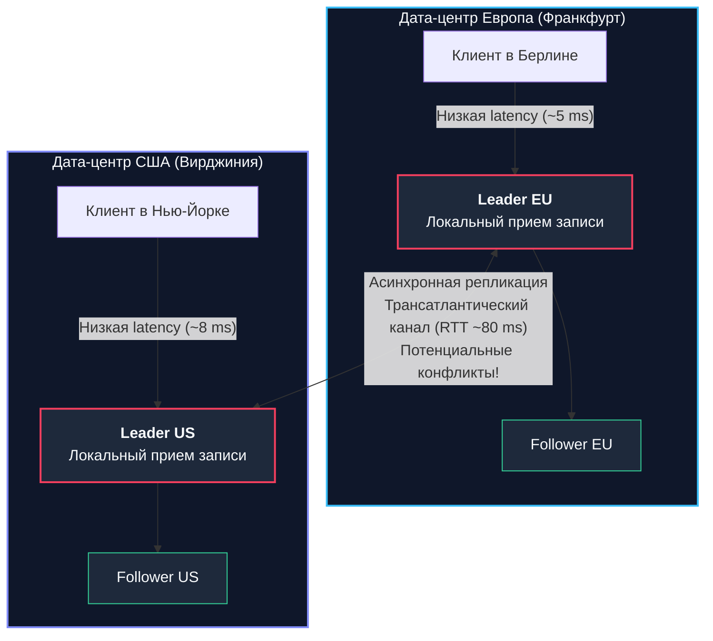
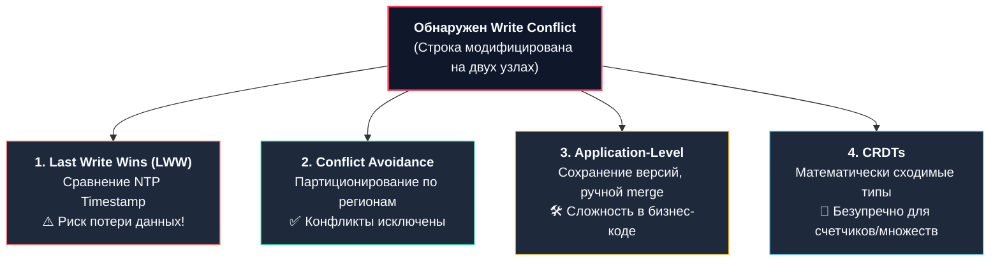

## Масштабирование записи и проблема расстояния

В классической топологии [[2. Leader Follower]] мы уперлись в фундаментальное архитектурное ограничение: **всей полнотой власти на запись наделен один-единственный узел**. Пока база данных обслуживает пользователей в пределах одной страны или континента, эта схема работает превосходно. Однако как только ваш Go-сервис становится глобальным, в игру вступают беспощадные законы физики.

Представьте распределенную систему с клиентами в Берлине, Нью-Йорке и Сингапуре. Если ваш единственный Leader-узел физически расположен в дата-центре Франкфурта:
* Европейские пользователи наслаждаются идеальным откликом на запись: задержка (Latency) составляет скромные 5–15 миллисекунд.
* Пользователи в Сингапуре сталкиваются с мучительной задержкой в 200–300 мс на каждый тривиальный `INSERT` или `UPDATE`. Причина проста: электромагнитный импульс в оптоволокне физически не может двигаться быстрее скорости света в стекле (~$200\,000$ км/с), а с учетом сетевой маршрутизации через десятки промежуточных коммутаторов (Network Hops) один пакет туда и обратно (**RTT — Round Trip Time**) преодолевает почти полмира.

**Multi-Leader репликация** (также известная как **Master-Master** или **Active-Active**) предлагает радикальное решение этой географической дилеммы: она разрешает принимать операции записи **сразу нескольким независимым узлам** кластера, разнесенным по разным континентам.

---

## Как работает Multi-Leader

В архитектуре Multi-Leader каждый крупный регион или дата-центр оснащается собственным полномочным Лидером. Лидеры локально принимают модификации от ближайших клиентов, а затем асинхронно передают поток изменений друг другу.

1. Пользователь в Берлине отправляет запрос на изменение профиля в Leader EU (Франкфурт) — операция фиксируется за 5 мс.
2. Пользователь в Нью-Йорке параллельно обновляет свой статус в Leader US (Вирджиния) — операция завершается за 8 мс.
3. В фоновом режиме Leader EU и Leader US передают друг другу дельты изменений по межконтинентальному сетевому каналу и накладывают их на локальные копии данных.



### Ключевые преимущества топологии
1. **Экстремальная производительность записи:** Задержка записи больше не зависит от географии клиента. Пользователи взаимодействуют с серверами в своем часовом поясе.
2. **Катастрофоустойчивость дата-центров (DC Outage Tolerance):** Если трансатлантический подводный кабель оборвется или один из дата-центров полностью выгорит, оставшиеся регионы продолжат бесперебойно принимать запросы на запись. Кластеру не требуется проводить экстренный глобальный Failover на запись.

> [!warning] Ловушка / Gotcha: Иллюзия простоты Master-Master
> Несмотря на заманчивость вывески «Master-Master», большинство авторитетных инженеров настоятельно не рекомендуют бездумно включать двунаправленную запись в классических реляционных СУБД (MySQL / PostgreSQL). 
> 
> Если вы позволяете изменять одни и те же таблицы одновременно на обоих мастерах без строгой изоляции по ключам, возникновение коллизий — лишь вопрос времени.  
> 
> В энтерпрайзе часто прибегают к прагматичной схеме **Active-Passive**: оба узла готовы к записи, но весь прикладной трафик направляется строго на один узел, а второй держится в горячем резерве с мгновенным переключением при аварии.

---

## Главная проблема: Конфликты записи (Write Conflicts)

В системе с одним лидером параллельные модификации одной строки блокируются локальным менеджером блокировок: второй транзакции приходится ждать завершения первой. 

В Multi-Leader архитектуре запросы на запись приходят в разные изолированные очереди на противоположных сторонах земного шара. Ни один из лидеров не знает о том, что происходит на другом узле прямо сейчас.

### Анатомический сценарий конфликта
Представьте учетную запись общего аккаунта компании:
1. В `12:00:00.000` сотрудник в Берлине меняет имя контакта с `"Alice"` на `"Bob"`. Запрос фиксируется в Leader EU.
2. В `12:00:00.050` (через 50 миллисекунд) коллега в Нью-Йорке, еще не получивший апдейт из Европы из-за задержки репликации, меняет то же имя с `"Alice"` на `"Charlie"`. Запрос фиксируется в Leader US.
3. Спустя 80 мс пакеты репликации долетают через океан:
   * Leader EU получает директиву: *«Установить имя в Charlie»*.
   * Leader US получает встречную директиву: *«Установить имя в Bob»*.

Возникает **конфликт записи (Write Conflict)**. Если движки баз данных просто применят входящие события «как есть», на европейском узле окажется `"Charlie"`, а на американском — `"Bob"`. Данные необратимо разойдутся, а репликация сломается с ошибкой рассинхронизации.

---

## Стратегии разрешения конфликтов

Разрешение распределенных конфликтов — сложнейшая математическая и инженерная задача. Существует несколько базовых стратегий, каждая из которых требует осознанного компромисса:



### 1. Last Write Wins (LWW — Побеждает последняя запись)
Самый популярный, но концептуально самый опасный метод. Каждой операции присваивается временная метка (Timestamp). При конфликте база данных оставляет то значение, чей Timestamp больше, а старое значение молча стирает.
* **Физическая ловушка:** Метод всецело опирается на физические часы серверов. Однако физические кварцевые генераторы неизбежно дрейфуют (Clock Drift). Даже с протоколом NTP рассинхронизация часов между дата-центрами регулярно составляет от 10 до 100 миллисекунд.
* **Результат:** Из-за микросекундного дрейфа часов истинно более поздняя операция в Берлине может быть молча уничтожена ранней операцией из Нью-Йорка. Происходит тихая потеря данных (**Data Loss**).

### 2. Избегание конфликтов (Conflict Avoidance)
Наиболее надежная архитектурная практика. Система проектируется так, чтобы **все операции записи по конкретной сущности всегда направлялись строго на один конкретный Лидер**.  
*Например:* Все европейские пользователи на уровне балансировщика жестко привязаны к Leader EU, а американские — к Leader US. Если пользователь не перемещается между континентами каждую секунду, конфликты одновременного редактирования одного профиля исключены физически.

### 3. Application-level Resolution (Разрешение на уровне приложения)
База данных отказывается делать выбор самостоятельно. Она сохраняет обе конфликтующие версии записи и при следующем запросе возвращает конфликт приложению на Go.  
Бизнес-логика обязана слить данные (например, объединить корзины покупок) и отправить финальную версию обратно.

```go
// Пример обработки конфликта на уровне бизнес-логики в Go
func (s *CartService) MergeCarts(local, remote *Cart) *Cart {
	merged := &Cart{UserID: local.UserID, Items: make(map[string]int)}
	// Объединяем позиции из обеих корзин, суммируя количества
	for item, qty := range local.Items {
		merged.Items[item] += qty
	}
	for item, qty := range remote.Items {
		merged.Items[item] += qty
	}
	return merged
}
```

### 4. CRDTs (Conflict-free Replicated Data Types)
Специализированные бескликовые типы данных, чья операция объединения (Merge) удовлетворяет строгим математическим свойствам: ассоциативности, коммутативности и идемпотентности:
$$A \sqcup B = B \sqcup A$$
$$(A \sqcup B) \sqcup C = A \sqcup (B \sqcup C)$$
$$A \sqcup A = A$$
*Классический пример:* Вместо операции прямого перезаписывающего присваивания (`SET x = 5`), мы используем распределенный коммутативный счетчик (`INCREMENT x by 1`). Независимо от порядка доставки пакетов, результат сойдется гарантированно и детерминированно.  
CRDTs лежат в основе распределенных счетчиков, множеств и очередей в **CockroachDB**, **Redis (Active-Active)** и **Riak**.

---

## Под капотом: Векторные часы (Version Vectors)

Как база данных алгоритмически понимает, что произошел именно конфликт, а не последовательное обновление? Доверять физическим часам (NTP) нельзя.

Для установления строгой причинно-следственной связи (**Causality Tracking**) в распределенных системах используются **Векторные часы (Version Vectors)**.

Каждая запись снабжается вектором логических счетчиков, где каждый элемент отражает количество транзакций конкретного лидера:
```text
Запись X: [LeaderEU: 5, LeaderUS: 2]
```

Когда Leader EU изменяет строку, он инкрементирует собственный счетчик:
`[LeaderEU: 6, LeaderUS: 2]` (или кратко `[EU: 6, US: 2]` — своё локальное обновление).

Когда он получает обновление от Leader US:
`[LeaderEU: 5, LeaderUS: 3]` (или кратко `[EU: 5, US: 3]` — пришло из US).

Если Leader EU видит два таких события:
1. `[EU: 6, US: 2]`
2. `[EU: 5, US: 3]`

Он не может однозначно сказать, какое событие произошло позже, так как `EU:6 > EU:5` (наш счетчик новее), но `US:2 < US:3` (их счетчик новее). Это математическое доказательство: **события произошли параллельно и независимо** $\to$ **Конфликт**. Система защищена от слепой перезаписи и может запустить процедуру разрешения коллизий.

---

## Топологии Multi-Leader

Способ соединения узлов между собой кардинально влияет на устойчивость сети к разделениям:

1. **Circular (Кольцевая топология):**  
   Изменения передаются по цепочке: $A \to B \to C \to A$.  
   * *Слабое место:* Выход из строя одного узла разрывает кольцо и блокирует распространение репликации для всей цепочки.
2. **Star (Звезда):**  
   Один центральный узел ретранслирует изменения на периферийные узлы.  
   * *Слабое место:* Центральный узел представляет собой классическую единичную точку отказа (SPOF).
3. **All-to-All (Полносвязная сеть, Все-ко-всем):**  
   Каждый Лидер напрямую отправляет изменения каждому Лидеру в кластере.  
   * *Плюс:* Максимальная отказоустойчивость. Смерть любого узла не мешает оставшимся обмениваться данными.
   * *Минус:* Проблема сетевых гонок. Запрос `INSERT` может прийти позже запроса `UPDATE` для той же строки, если пакеты пошли по разным сетевым маршрутам. Для предотвращения повторной отправки требуется фильтрация идентификаторов.

---

## Практика в Go: Генерация первичных ключей (ID Generation)

В классической базе данных с одним лидером монотонно возрастающий первичный ключ `AUTO_INCREMENT` (1, 2, 3...) работает безупречно. В Multi-Leader архитектуре автоинкремент превращается в немедленный саботаж:

Если Leader EU и Leader US одновременно вставят новую запись, оба сервера присвоят ей одинаковый идентификатор `ID = 1001`. При попытке репликации база данных выбросит фатальную ошибку нарушения уникального ключа (**Duplicate Key Error**), и репликационный конвейер остановится.

### Решения проблемы распределенных ключей для Go-инженера:

1. **UUID (Universally Unique Identifier):**  
   Генерация 128-битных уникальных идентификаторов прямо на стороне Go-приложения без каких-либо сетевых обращений к БД:
   ```go
   import "github.com/google/uuid"

   // Использование UUID v7 (содержит временную метку, упорядочен во времени)
   id, err := uuid.NewV7()
   ```
   *Плюс:* 100% гарантия глобальной уникальности.  
   *Минус:* Размер в 16 байт и плохая локальность кэшей B+ дерева (для старых UUID v4). Для современных систем рекомендуется исключительно **UUID v7**.
2. **Snowflake ID (Twitter Snowflake):**  
   64-битный целочисленный ключ (`int64`), идеально совместимый с B+ деревьями и типом `BIGINT`:
   - 41 бит: Миллисекунды с момента кастомной эпохи.
   - 10 бит: Идентификатор дата-центра и физической ноды (Machine ID).
   - 12 бит: Локальный инкрементный счетчик последовательности.

Посмотрим на лаконичную реализацию генератора Snowflake в Go:

```go
package idgen

import (
	"errors"
	"sync"
	"time"
)

const (
	epoch          = int64(1704067200000) // Кастомная эпоха (например, 1 января 2024)
	nodeBits       = uint(10)
	stepBits       = uint(12)
	maxNodeID      = int64(-1 ^ (-1 << nodeBits))
	maxStep        = int64(-1 ^ (-1 << stepBits))
	timeShift      = nodeBits + stepBits
	nodeShift      = stepBits
)

// SnowflakeGenerator потокобезопасно генерирует уникальные 64-битные ключи
type SnowflakeGenerator struct {
	mu        sync.Mutex
	lastTime  int64
	nodeID    int64
	step      int64
}

func NewSnowflakeGenerator(nodeID int64) (*SnowflakeGenerator, error) {
	if nodeID < 0 || nodeID > maxNodeID {
		return nil, errors.New("node ID out of range")
	}
	return &SnowflakeGenerator{nodeID: nodeID}, nil
}

func (g *SnowflakeGenerator) NextID() int64 {
	g.mu.Lock()
	defer g.mu.Unlock()

	now := time.Now().UnixMilli()

	if now == g.lastTime {
		g.step = (g.step + 1) & maxStep
		if g.step == 0 {
			// Переполнение последовательности в пределах текущей миллисекунды: ждем следующую
			for now <= g.lastTime {
				now = time.Now().UnixMilli()
			}
		}
	} else {
		g.step = 0
	}

	g.lastTime = now

	return ((now - epoch) << timeShift) | (g.nodeID << nodeShift) | g.step
}
```

> [!tip] Собеседование
> **Вопрос:** Почему PostgreSQL в стандартной поставке не поддерживает мультимастерную репликацию на запись из коробки?
> 
> **Ответ:** Философия ядра PostgreSQL строится на бескомпромиссной гарантии строгой сериализуемости (ACID), изоляции транзакций на базе снимков (MVCC) и предотвращении аномалий.  
> Реализация распределенных строчных блокировок и распределенного MVCC между удаленными дата-центрами неизбежно разрушает производительность классического реляционного движка.  
> Для мультимастерных сценариев в экосистеме PostgreSQL применяются специализированные плагины (например, **BDR — Bi-Directional Replication** от EDB) либо архитектурный переход на распределенные NewSQL-базы данных нового поколения вроде **CockroachDB** или **YugabyteDB**, изначально спроектированные поверх алгоритмов консенсуса Raft.

---

## Резюме

1. **Multi-Leader топология** снимает географические барьеры сетевой задержки, позволяя клиентам по всему миру писать в локальные региональные дата-центры с задержкой в считанные миллисекунды.
2. Платой за распределенную запись является неизбежность **конфликтов параллельной модификации (Write Conflicts)**.
3. Простейшая стратегия **Last Write Wins (LWW)** крайне коварна из-за нестабильности и рассинхронизации физических часов (NTP Clock Drift). Наиболее надежные промышленные подходы — это **избегание конфликтов (Conflict Avoidance)** через гео-партиционирование либо применение математических структур **CRDTs**.
4. Для отслеживания причинно-следственных связей без опоры на физическое время применяются **Векторные часы (Version Vectors)**.
5. Приложение на Go в распределенном кластере обязано отказаться от `AUTO_INCREMENT` в пользу неблокирующей генерации распределенных ключей (**UUID v7** или **Snowflake ID**).

Мы научились реплицировать данные и распределять поток записи по нескольким Лидерам. Однако и Leader-Follower, и Multi-Leader объединяет одно важное допущение: *каждый узел хранит полную копию всей базы данных*. 

Но что делать, если объем данных вашего сервиса превысил десятки терабайт, и таблица физически не помещается на накопители одного сервера? Для преодоления этого рубежа применяется техника фрагментации — [[4. Sharding]].