## Пределы масштабирования вертикали

Рано или поздно каждый ведущий инженер высоконагруженных систем упирается в глухую физическую стену. Вы провели безупречный тюнинг индексов, вычистили медленные запросы, разнесли аналитику на читающие реплики через паттерн [[2. Leader Follower]], но центральный мастер-сервер все равно задыхается под лавиной входящих записей.

В этот момент проект сталкивается с непреложными законами физики — лимитами **вертикального масштабирования (Vertical Scaling / Scaling Up)**. Вы не можете бесконечно добавлять гигабайты памяти в Buffer Pool, наращивать ядра CPU и монтировать сверхбыстрые дисковые массивы NVMe в один физический сервер. 
1. Во-первых, это становится экономически бессмысленным: сервер с 4 сокетами и 4 ТБ RAM стоит не в 4, а в 20–30 раз дороже четырех стандартных двухпроцессорных машин.
2. Во-вторых, наступают физические ограничения архитектуры компьютера: насыщение шин межпроцессорного взаимодействия (UPI/QPI), задержки межъядерной когерентности кэшей и фрагментация памяти на уровне узлов NUMA.

Единственный способ пробить этот потолок — переход к **горизонтальному масштабированию (Horizontal Scaling / Scaling Out)**, архитектурным фундаментом которого является **Шардинг (Sharding)**.

Шардинг — это разделение единого логического массива данных на непересекающиеся независимые подмножества (шарды / партиции), каждое из которых размещается на отдельном физическом узле или независимом кластере баз данных.

В отличие от обычной репликации, где каждый узел хранит полную копию всей базы данных, при шардинге каждый сервер хранит **строго уникальный фрагмент** данных.

---

## Как это работает: Ключ шардирования

Чтобы разбить терабайты или петабайты строк по сотням независимых узлов, нам необходим строгий математический критерий. Мы не имеем права разбрасывать записи случайным образом, иначе для поиска конкретной строки нам пришлось бы непрерывно опрашивать абсолютно все серверы в сети.

Таким критерием выступает **Shard Key (Ключ шардирования)** — одна или несколько колонок в вашей сущности, на основе значения которых алгоритм маршрутизации однозначно вычисляет целевой узел.

```mermaid
flowchart TD
    App["Go Application"] --> Router{"Router Logic<br>Shard Key?"}
    
    Router -- "hash(id) % 3 == 0" --> S1["<b>Shard 1</b><br>User ID: 1, 4, 7"]
    Router -- "hash(id) % 3 == 1" --> S2["<b>Shard 2</b><br>User ID: 2, 5, 8"]
    Router -- "hash(id) % 3 == 2" --> S3["<b>Shard 3</b><br>User ID: 3, 6, 9"]
    
    style Router fill:#0f172a,stroke:#38bdf8,stroke-width:2px
    style S1 fill:#1e293b,stroke:#818cf8,stroke-width:1px
    style S2 fill:#1e293b,stroke:#34d399,stroke-width:1px
    style S3 fill:#1e293b,stroke:#fbbf24,stroke-width:1px
```



### Основные стратегии шардирования

#### 1. Hash Sharding (Хеширование)
Самый распространенный и математически надежный метод. Значение ключа пропускается через равномерную детерминированную хэш-функцию, а индекс шарда вычисляется через остаток от деления на общее число узлов:

$$ \text{Shard ID} = \text{hash}(user\_id) \mod N $$

```go
// Пример логики роутинга в Go
func GetShard(userID int64, shards []string) string {
    // Простой мурмур-хеш или CRC64
    hash := crc64.Checksum([]byte(fmt.Sprintf("%d", userID)), crc64.MakeTable(crc64.ISO))
    shardIndex := hash % uint64(len(shards))
    return shards[shardIndex]
}
```

* **Плюсы:** Превосходное равномерное псевдослучайное распределение (Uniform Write Distribution). Полное отсутствие горячих точек (Hotspots) при случайных ключах.
* **Минусы:** Крах диапазонных выборок. Запрос вида `SELECT * FROM users WHERE id > 100 AND id < 200` превращается в кошмар **Scatter-Gather**: роутер вынужден разослать запрос на абсолютно все шарды, дождаться ответов по сети и объединить их в памяти.

#### 2. Range Sharding (Диапазонное шардирование)
Данные нарезаются на фиксированные или динамические интервалы значений:
* Shard 1: `user_id` от 1 до 1,000,000
* Shard 2: `user_id` от 1,000,001 до 2,000,000

* **Плюсы:** Диапазонные запросы внутри одного интервала выполняются мгновенно на одном конкретном сервере.
* **Минусы:** Чудовищная неравномерность нагрузки. Если новые пользователи регистрируются с монотонно растущими ID, 100% входящего потока записей будет долбить в последний активный шард, в то время как старые шарды будут простаивать вхолостую.

#### 3. Directory Sharding (Справочное шардирование / Lookup Table)
В архитектуру вводится отдельное высокопроизводительное хранилище-каталог (Lookup Table, обычно в Redis или специализированном кластере), хранящее прямую карту соответствий: `ID_пользователя -> Shard_4`.
* **Плюсы:** Абсолютная гибкость. Любого крупного корпоративного клиента («кита») можно в один клик перенести на персональный выделенный физический сервер без миграции остальных клиентов.
* **Минусы:** Каталог становится классической единичной точкой отказа (**SPOF**) и узким местом по задержкам: каждый запрос требует дополнительного сетевого прыжка в lookup-таблицу.

---

## Главная боль: Решеардирование (Resharding)

Представьте, что три ваших первоначальных шарда заполнились на 95% дисковой емкости. Вы закупаете и подключаете в кластер 4-й узел. Что произойдет при наивном хэшировании по формуле $\text{hash} \mod N$?

При замене делителя с $N=3$ на $N=4$ математический остаток деления изменится для **75–80% всех существующих ключей**! 
Вам придется поднять с дисков терабайты данных и перекачать их по сети между серверами. В продакшене эта миграция длится сутками, пожирает полосу пропускания сетевых адаптеров, порождает взаимные блокировки и регулярно приводит к падению сервиса.

```mermaid
flowchart LR
    subgraph HashRing ["Консистентное кольцо хешей (Consistent Hash Ring)"]
        N1["Node A (0°)"]
        N2["Node B (120°)"]
        N3["Node C (240°)"]
        NewNode["New Node D (60°)<br>Забирает только сектор Node B!"]
        
        N1 -.-> NewNode
        NewNode -.-> N2
        N2 -.-> N3
        N3 -.-> N1
    end

    style HashRing fill:#0f172a,stroke:#38bdf8,stroke-width:2px
    style NewNode fill:#1e293b,stroke:#34d399,stroke-width:2px
```



> [!info] Под капотом: Consistent Hashing
> Для решения этой катастрофы было изобретено **Консистентное хеширование (Consistent Hashing)** (алгоритм Каргера).  
> 
> Пространство хэшей представляется в виде замкнутого логического кольца от $0$ до $2^{32}-1$. На это же кольцо отображаются координаты самих физических серверов. Запись сохраняется на первый встретившийся сервер по часовой стрелке от ее хэша.  
> 
> Когда в кольцо добавляется новый узел $D$, он забирает данные **строго у своего ближайшего соседа по кольцу**, оставляя нетронутыми остальные 90% серверов!  
> 
> Чтобы избежать дисбаланса, каждый физический сервер представляют в кольце сотнями «виртуальных узлов» (Virtual Nodes / Vnodes). Этот элегантный механизм лежит в основе **Apache Cassandra**, **Amazon DynamoDB** и **Redis Cluster**.

---

## Проблемы и ловушки в Go-коде

Шардинг — это не просто настройка инфраструктуры. Он наносит разрушительный удар по привычным паттернам прикладного программирования.

### 1. Смерть классических JOIN-ов
В реляционном монолите операция `JOIN` между таблицей пользователей и таблицей заказов выполняется движком базы данных за доли миллисекунды прямо в оперативной памяти.  
В шардированной системе таблица `orders` может физически лежать на Shard 1, а таблица `users` — на Shard 3. Реляционный движок физически не способен выполнить межсерверный `JOIN`.

**Инженерные решения в Go:**
1. **Денормализация (Denormalization):** Осознанное дублирование данных. Если заказ сохраняется на шард пользователя, мы прямо в строку заказа вшиваем имя и email клиента, избавляясь от необходимости соединять таблицы.
2. **Application-Side Joins:** Приложение на Go берет на себя роль распределенного вычислителя: делает параллельные выборки по шардам через горутины и склеивает структуры в памяти:

```go
// Антипаттерн в шардинге (если таблицы на разных шардах):
// SELECT orders.*, users.name FROM orders JOIN users ON orders.user_id = users.id

// Паттерн в Go: Application-side Join
func GetOrderWithUser(ctx context.Context, orderID int64) (*Order, error) {
    // 1. Извлекаем заказ (роутер знает нужный шард по orderID или userID)
    order, err := orderRepo.GetByID(ctx, orderID)
    if err != nil {
        return nil, fmt.Errorf("get order: %w", err)
    }

    // 2. Зная order.UserID, делаем точечный запрос к пользовательскому шарду
    user, err := userRepo.GetByID(ctx, order.UserID)
    if err != nil {
        return nil, fmt.Errorf("get user: %w", err)
    }

    order.UserName = user.Name
    return order, nil
}
```

### 2. Генерация первичных ключей
Как мы разбирали в [[3. Multi Leader]], классический автоинкремент (`SERIAL` в Postgres или `AUTO_INCREMENT` в MySQL) на уровне таблиц приводит к мгновенным коллизиям: Shard 1 и Shard 2 одновременно создадут запись с `id = 105`.  
В шардированных средах генерация ID выносится на уровень прикладного сервиса: используются монотонные **UUID v7** либо 64-битные **Snowflake ID** (или выделенные сервисы TSO — Timestamp Ordering Oracle).

### 3. Транзакции
Транзакционная целостность уровня базы гарантируется только в пределах одного конкретного шарда. Если вам требуется атомарно перевести деньги между двумя клиентами, лежащими на разных серверах, простой конструкции `BEGIN ... COMMIT` больше не существует.  
Вам нужны **Распределенные транзакции** (см. [[8. Distributed transactions]] и [[10. Saga pattern]]), которые сложнее, медленнее и требуют компенсирующих действий.

---

## Инструментарий и прокси-слой

Пытаться реализовать шардинг вручную в Go-коде (через `map[shard]*sql.DB`) — это путь для смелых (или небольших проектов). В энтерпрайзе используют прослойки:

1. **Vitess:** Промышленный стандарт шардинга MySQL планетарного масштаба, разработанный инженерами YouTube и написанный на **Go**. Vitess предстает перед прикладным кодом как обычный одиночный сервер MySQL, прозрачно выполняя под капотом синтаксический разбор SQL, распределенную маршрутизацию, слияние результатов и решеардирование без даунтайма.
2. **ProxySQL:** Высокопроизводительный L7-прокси для MySQL, способный маршрутизировать запросы на основе регулярных выражений и хэшей таблиц.
3. **Redis Cluster:** Встроенная поддержка шардинга на 16 384 хэш-слота (Hash Slots) с автоматическим перенаправлением клиентов через протокол `MOVED`.
4. **MongoDB:** Встроенный распределенный шардинг с выделенными демонами маршрутизации (**mongos**) и серверами конфигурации (**config servers**).

> [!warning] Ловушка / Gotcha: Hot Partition (Горячий шард)
> Выбор неудачного ключа шардирования — смертный приговор для распределенной системы.  
> Если для шардирования логов или аналитических событий вы выберете поле `created_at` (или `DATE`), то 100% входящих записей текущего дня будут направляться на один-единственный активный узел.  
> Этот шард моментально сгорит под нагрузкой, исчерпав IOPS и память, в то время как остальные 99 шардов будут бесполезно простаивать.  
> 
> **Золотое правило архитектора:** Ключ шардирования обязан обладать высокой мощностью (High Cardinality) и гарантировать абсолютно равномерное распределение записей (**Uniform Write Distribution**), например, `hash(tenant_id + user_id)`.

---

## Резюме

1. **Шардинг** — метод горизонтального масштабирования, при котором таблица фрагментируется по уникальным физическим узлам на основе **Shard Key**.
2. **Hash Sharding** обеспечивает равномерное распределение записей, но убивает эффективность диапазонных запросов (**Scatter-Gather**). **Range Sharding** удобен для выборок, но уязвим к горячим точкам (Hotspots).
3. Наивная схема `hash % N` превращает добавление серверов в катастрофу перемещения данных. Решением является **Консистентное хеширование (Consistent Hashing)** с виртуальными нодами.
4. В прикладном Go-коде шардинг требует отказа от межтабличных `JOIN`, перехода на распределенные идентификаторы (**Snowflake / UUID v7**) и компенсационные саги вместо ACID-транзакций.
5. Для минимизации сложности в продакшене рекомендуется опираться на специализированные прокси-системы, такие как **Vitess**.

Инженеры часто путают термины «Шардинг» и «Партиционирование». Если шардинг разносит данные по разным физическим серверам сети, то партиционирование — это логическое разделение таблицы на независимые файлы в пределах **одного физического инстанса СУБД**. 

Чтобы окончательно расставить все точки над i, в следующей главе мы разберем механику дискового секционирования — [[5. Partitioning]].