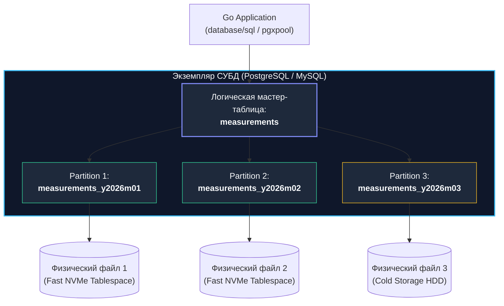

В предыдущих лекциях мы детально исследовали [[4. Sharding]], где массивы данных физически разносились по независимым серверам сети. **Партиционирование (Partitioning / Секционирование)** — это близкая, но концептуально отличная техника. Чаще всего под партиционированием понимают вертикальное или горизонтальное разделение структуры данных в рамках **одного физического экземпляра (инстанса) СУБД**.

Для опытного бэкенд-инженера на Go партиционирование — это главное спасительное оружие против так называемого «проклятия больших таблиц». Когда реляционная таблица переваливает за сотни миллионов или миллиарды строк, традиционная монолитная архитектура начинает деградировать:
- Индексы B+ дерева вырастают до сотен гигабайт и перестают помещаться в оперативную память (`shared_buffers` в PostgreSQL или `innodb_buffer_pool` в MySQL). Каждый точечный поиск начинает вызывать тяжелый случайный ввод-вывод с диска.
- Регламентные операции обслуживания — сборка мусора (`VACUUM`), перестроение индексов (`REINDEX`) и миграции схемы (`ALTER TABLE`) — начинают выполняться часами или сутками, парализуя работу базы данных.

---

## Что такое партиционирование?

**Партиционирование** — это разбиение одной логической мастер-таблицы на несколько физически независимых под-таблиц (секций / партиций), которыми ядро базы данных управляет абсолютно прозрачно для прикладного приложения.

Когда ваш микросервис на Go выполняет стандартный запрос `SELECT` или `INSERT` к таблице `orders`, планировщик СУБД самостоятельно вычисляет, в какую именно физическую секцию направить дисковую операцию, скрывая от разработчика внутреннюю анатомию файлов.



### Типы партиционирования

1. **Horizontal Partitioning (Горизонтальное партиционирование / Секционирование):**  
   Разделение строк по определенному правилу. Например, события за январь 2026 года физически изолируются в одном табличном файле, за февраль — в другом. Это доминирующий сценарий в высоконагруженных бэкендах.
2. **Vertical Partitioning (Вертикальное партиционирование):**  
   Разделение колонок таблицы. Редко запрашиваемые или аномально «тяжелые» поля (например, большие бинарные блобы `BLOB`, тяжелые JSON-документы или тексты статей) выносятся в отдельную физическую таблицу, связанную отношением «один-к-одному». В PostgreSQL этот процесс частично автоматизирован нативно на уровне ядра через подсистему **TOAST** (подробнее см. [[2. Storage engine PostgreSQL]]).

---

## Механизмы распределения данных

Чтобы ядро базы данных знало, в какую именно физическую секцию поместить новую строку, при проектировании схемы задается **Partition Key (Ключ партиционирования)**.

### 1. Range Partitioning (По диапазонам)
Классический выбор для временных рядов (Time-series), логов аудита, финансовых проводок и метрик:
* **Пример:** Секционирование по месяцам: `Jan_2026`, `Feb_2026`.
* **Архитектурный триумф:** Реализация политики хранения данных (**Data Retention**). Чтобы удалить устаревшие логи трехлетней давности, вам больше не нужен мучительный запрос `DELETE FROM logs WHERE created_at < '2023-01-01'`, генерирующий миллионы WAL-записей и раздувающий таблицу мертвыми строками. Достаточно выполнить мгновенную операцию `DROP TABLE` старой секции: операционная система выполнит системный вызов `unlink` на уровне файловой системы за считанные миллисекунды.

### 2. List Partitioning (По списку значений)
Строки распределяются на основе дискретного перечисления ключей:
* **Пример:** Секции по странам или регионам: `orders_ru`, `orders_us`, `orders_eu`.
* **Плюс:** Идеально подходит для многоарендных (Multi-tenant) архитектур, а также строгого соблюдения законодательных норм хранения персональных данных (GDPR, 152-ФЗ), когда данные европейских граждан обязаны физически лежать в изолированных табличных пространствах.

### 3. Hash Partitioning (По хэшу)
Ключ партиционирования пропускается через хэш-функцию, и остаток от деления определяет целевую секцию:
* **Пример:** `hash(user_id) % 4`.
* **Плюс:** Ликвидирует проблему горячих точек (Hotspots). Если при Range-партиционировании все новые записи гарантированно бомбардируют только последнюю партицию текущего дня, то Hash равномерно распределяет параллельный дисковый ввод-вывод по всем доступным секциям.

---

## Mechanical Sympathy: Почему это работает быстрее?

### 1. Исключение партиций (Partition Pruning)
Это главный источник взрывного роста производительности.  
Когда сервис на Go выполняет запрос вида:
```sql
SELECT peaktemp FROM measurements WHERE logdate = '2026-04-20' AND city_id = 77;
```
Планировщик запросов на этапе компиляции плана (или в рантайме) анализирует предикаты `WHERE` и понимает, что данная дата покрывается строго партицией `measurements_y2026m04`. 

Он выполняет **Partition Pruning (Отсечение партиций)**: все остальные 99 секций таблицы и их индексы полностью исключаются из плана выполнения!

Вместо того чтобы совершать спуск по гигантскому B-Tree индексу объемом 150 ГБ, который физически вытеснен из RAM и требует дорогостоящих обращений к диску, база обращается к компактному индексу партиции размером всего 500 МБ. Этот индекс целиком лежит в оперативной памяти L3-кэша и `shared_buffers`, а поиск завершается за микросекунды!

### 2. Локальность данных и ярусное хранение (Storage Tiering)
Поскольку каждая партиция представляет собой отдельный физический файл на диске, база позволяет ассоциировать их с разными табличными пространствами (**Tablespaces**):
* **Горячие данные (Текущий месяц):** Размещаются на сверхбыстрых массивах **NVMe SSD** с максимальным показателем IOPS.
* **Холодный архив (Прошлые годы):** Прозрачно переносятся на дешевые медленные жесткие диски (**HDD**) или смонтированные сетевые тома, экономя десятки тысяч долларов инфраструктурного бюджета.

---

## Реализация в PostgreSQL: Declarative Partitioning

Начиная с версии PostgreSQL 10, секционирование стало декларативным стандартом:

```sql
-- 1. Создаем родительскую партиционированную таблицу
CREATE TABLE measurements (
    city_id         int not null,
    logdate         date not null,
    peaktemp        int
) PARTITION BY RANGE (logdate);

-- 2. Создаем физическую партицию под конкретный диапазон дат
CREATE TABLE measurements_y2026m04 PARTITION OF measurements
    FOR VALUES FROM ('2026-04-01') TO ('2026-05-01');

-- 3. Создаем индекс: он автоматически продублируется на все дочерние секции
CREATE INDEX idx_measurements_city_date ON measurements (city_id, logdate);
```

> [!tip] Собеседование
> **Вопрос:** В чем фундаментальная разница между Partitioning и Sharding?
> 
> **Ответ:** 
> * **Partitioning (Партиционирование):** Это логическое и физическое разделение таблицы на уровне файлов **внутри одного сервера (одного экземпляра СУБД)**. Приложение общается с единым сервером по стандартному порту, а СУБД сама заведует файлами.
> * **Sharding (Шардинг):** Это горизонтальное разделение данных **между независимыми физическими серверами по сети**.
> * **Гибридная синергия:** В высоконагруженных промышленных системах они идеально дополняют друг друга. Например: данные шардируются по пользователям (`user_id`) между 16 независимыми серверами, а на каждом сервере таблицы заказов партиционируются по месяцам (`created_at`) для быстрого отсечения истории.

---

## Проблемы и архитектурные ограничения

1. **Отсутствие глобальных индексов:** В PostgreSQL индексы живут строго внутри своих секций. Вы не можете создать уникальный индекс по полю `email`, если колонка `logdate` (ключ партиционирования) не входит в этот индекс. База данных не может гарантировать уникальность значения между разными физическими файлами без полного сканирования всех партиций.
2. **Ограничения внешних ключей (Foreign Keys):** Исторически ссылки внешних ключей на партиционированные таблицы поддерживались с ограничениями (хотя в современных версиях PG 12+ ситуация значительно улучшилась).
3. **Автоматизация обслуживания (Maintenance):** Если в систему прилетит запись с датой, под которую секция еще не создана, транзакция упадет с фатальной ошибкой `no partition of relation found for row`. В бэкенд-архитектуре эту проблему решают специализированные утилиты (например, расширение `pg_partman`) либо фоновые воркеры на Go, которые по расписанию (`cron`) заранее создают секции на будущие периоды.

> [!warning] Ловушка / Gotcha: Индексный взрыв (Partition Explosion)
> Если неопытный инженер создал 1 000 партиций (например, секционировал таблицу по дням за три года), а затем выполнил запрос без указания ключа партиционирования:
> ```sql
> SELECT * FROM measurements WHERE city_id = 77;
> ```
> Планировщик не сможет применить Partition Pruning. Он будет вынужден открыть, заблокировать и просканировать **1 000 независимых индексов**! Это приведет к лавинообразному расходу оперативной памяти, исчерпанию дескрипторов файлов и падению скорости запроса в десятки раз по сравнению с обычной таблицей.  
> 
> **Железное правило:** Ключ партиционирования всегда обязан присутствовать в блоке фильтрации `WHERE`.

---

## Использование в Go: Прозрачность и дисциплина запросов

Для Go-приложения работа с партиционированной таблицей выглядит полностью прозрачно. Никакой низкоуровневой магии в коде не требуется:

```go
package repository

import (
	"context"
	"database/sql"
	"fmt"
)

type MeasurementRepo struct {
	db *sql.DB
}

func NewMeasurementRepo(db *sql.DB) *MeasurementRepo {
	return &MeasurementRepo{db: db}
}

// GetCityTemperature извлекает данные с гарантированным Partition Pruning
func (r *MeasurementRepo) GetCityTemperature(ctx context.Context, logDate string, cityID int) (int, error) {
	// КРИТИЧЕСКИ ВАЖНО: Мы явно передаем logdate ($1) в WHERE.
	// Это позволяет планировщику PostgreSQL мгновенно отсечь все остальные партиции.
	query := `
		SELECT peaktemp 
		FROM measurements 
		WHERE logdate = $1 AND city_id = $2
	`

	var temp int
	err := r.db.QueryRowContext(ctx, query, logDate, cityID).Scan(&temp)
	if err != nil {
		if err == sql.ErrNoRows {
			return 0, fmt.Errorf("measurement not found")
		}
		return 0, fmt.Errorf("query temperature: %w", err)
	}

	return temp, nil
}
```

---

## Резюме

1. **Partitioning** решает проблему деградации гигантских таблиц, нарезая их на изолированные физические файлы внутри одного инстанса СУБД.
2. **Partition Pruning** ускоряет выборки в сотни раз за счет полного игнорирования нерелевантных секций на уровне планировщика.
3. Это непревзойденный инструмент для организации **Data Retention**: мгновенная утилизация устаревших данных через `DROP TABLE` секции не нагружает процессор и не порождает раздувания (Bloat).
4. Запросы в прикладном Go-коде обязаны всегда содержать ключ партиционирования в предикатах `WHERE`, предотвращая катастрофический индексный взрыв.

Мы досконально изучили способы фрагментации данных как внутри одного сервера, так и по сети. Однако при работе с распределенными копиями и шардами возникает сложнейшая инженерная дилемма: *какие именно гарантии непротиворечивости данных мы можем дать пользователю?*

В следующей лекции мы погрузимся в фундаментальные законы распределенных систем — [[6. Consistency модели]].