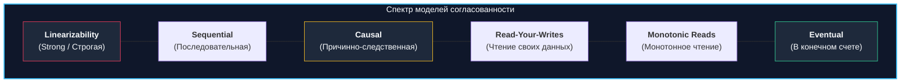
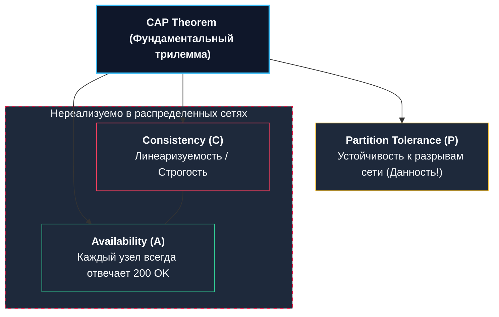

В распределенных инженерных системах на Go, как только данные покидают уютные пределы одного сервера СУБД (вспоминаем [[11. Репликация в PostgreSQL]]), мы немедленно сталкиваемся с фундаментальным барьером физического мира: **информация не способна распространяться мгновенно**. 

Пока сетевой пакет с изменениями летит по коммутаторам и оптоволокну от Лидера к Фолловеру, состояние системы расщепляется: один сервер уже знает о новом состоянии мира, а соседние узлы все еще живут в прошлом.

Прежде чем погружаться в детали, важно устранить терминологическую путаницу, которая сбивает с толку многих инженеров:
* **Consistency в аббревиатуре ACID:** Означает *внутреннюю целостность и соблюдение бизнес-правил* базы данных (не нарушать внешние ключи, уникальные индексы и ограничения `CHECK`).
* **Consistency в распределенных системах (CAP):** Означает *согласованность копий (Coherence / Single-Copy Consistency)* — правила, определяющие, **какую именно свежесть данных и какой хронологический порядок событий видит клиентское приложение на Go**, опрашивая различные узлы распределенного кластера.

---

## Проблема: Иллюзия единого времени

В распределенной системе нет единых абсолютных часов. Физические кварцевые генераторы на разных материнских платах неизбежно тикают с разной скоростью, а сетевые задержки колеблются от микросекунд до сотен миллисекунд. 

Если две независимые горутины в разных дата-центрах практически одновременно отправляют запросы на модификацию записи, распределенная система обязана опираться на строгий математический контракт. Этот контракт и называется **Моделью консистентности (Consistency Model)**.



### 1. Строгая консистентность (Strong Consistency / Linearizability)
Наивысшая планка строгости. Система создает безупречную математическую иллюзию того, что в мире существует **всего один экземпляр данных**, а все операции чтения и записи выполняются атомарно в реальном физическом времени.
* **Гарантия:** Если операция записи успешно завершилась в глобальном физическом времени (клиент получил подтверждение `COMMIT`), абсолютно любой последующий `SELECT` с абсолютно любого узла кластера обязан вернуть это значение или еще более новое. Откат назад во времени невозможен.
* **Цена (Mechanical Sympathy):** Колоссальный штраф по задержкам (Latency). Чтобы зафиксировать запись, координатор обязан собрать кворумное согласие большинства узлов (Quorum consensus) и синхронизировать аппаратные барьеры.
* **Примеры:** **Google Spanner** (с атомными часами TrueTime), протоколы консенсуса **Raft** (etcd) и **Paxos**.

### 2. Eventual Consistency (Согласованность в конечном счете)
Диаметрально противоположная, самая слабая и дешевая модель.
* **Гарантия:** Если в кластер перестанут поступать новые операции записи, то через некоторое конечное время все реплики гарантированно сойдутся к абсолютно одинаковому состоянию.
* **Поведение под нагрузкой:** Вы создаете публикацию в соцсети, получаете HTTP `200 OK`, нажимаете F5 в браузере — а поста нет! Нажимаете F5 еще раз — пост появился. Вы просто попали сначала на отстающую реплику, а затем на обновленную.
* **Примеры:** Служба доменных имен **DNS**, **Apache Cassandra**, **Amazon DynamoDB**, асинхронная репликация PostgreSQL.

---

## Модели, ориентированные на пользователя (Client-Centric Models)

В реальной веб-разработке и проектировании микросервисов на Go погоня за полной линеаризуемостью (Linearizability) часто неоправданна и экономически разорительна. Архитектору достаточно предоставить предсказуемый и комфортный пользовательский опыт (**User Experience**).

### 3. Read Your Writes (Чтение своих записей)
Критически важный контракт для интерактивных пользовательских сценариев.
* **Проблема:** Пользователь меняет аватар в профиле. Приложение перенаправляет его на домашнюю страницу. Если выборка профиля направляется на асинхронную реплику, пользователь видит старый аватар, решает, что произошла ошибка, и начинает повторно отправлять форму.
* **Решение в Go:** 
  1. **Сессионная привязка (Stickiness):** Временно (на 5–10 секунд) перенаправлять все операции чтения конкретного пользователя на Master-узел, где происходила запись.
  2. **Отслеживание LSN (Log Sequence Number):** Приложение передает реплике точный маркер транзакции: *«Выполни мой SELECT только после того, как твой локальный LSN применит транзакцию №123»*.

### 4. Monotonic Reads (Монотонное чтение)
* **Гарантия:** Если клиент однажды прочитал определенное состояние данных $X$, он никогда в будущем не увидит более старое состояние (система не имеет права двигаться «назад во времени»).
* **Проблема без этой модели:** Пользователь читает ленту новостей. Видит свежий пост. Обновляет страницу — и попадает на реплику с большим лагом: пост исчезает. Обновляет еще раз — попадает на быструю реплику: пост снова виден. Это дезориентирует пользователя.

### 5. Causal Consistency (Причинная согласованность)
Система математически гарантирует сохранение хронологического порядка для причинно-зависимых событий (Causally Related Events).
* **Пример:** Сообщение в чате (причина) и ответ на него (следствие). Ни один читатель в мире не имеет права увидеть ответ на вопрос раньше, чем увидит сам вопрос. События же, не связанные причинно-следственной связью (например, сообщения двух независимых пользователей в разных каналах), могут отображаться на репликах в произвольном порядке. Это строже, чем Eventual, но в разы быстрее Strong Consistency.

---

## Теорема CAP: Выбор инженера

Все распределенные модели согласованности подчиняются фундаментальному закону природы — **CAP-теореме** Эрика Брюера.

В любой распределенной системе физически возможен разрыв сетевой связности между стойками или дата-центрами — **Partition Tolerance (P)**. Сетевые аварии неизбежны. Поэтому в момент сетевого разделения инженер обязан выбрать один из двух путей:



1. **CP-системы (Consistency + Partition Tolerance):**  
   Система жертвует доступностью ради абсолютной строгости данных. Если узел изолирован от кворума и не может подтвердить актуальность данных, он возвращает клиенту жесткую ошибку (`HTTP 500` или `Timeout`).  
   *Примеры:* **MongoDB** (с большинством), **etcd**, **ZooKeeper**, **Raft-кластеры**.
2. **AP-системы (Availability + Partition Tolerance):**  
   Система ставит доступность превыше всего. Любой живой узел обязан вернуть ответ клиенту, даже если из-за сетевой изоляции он отдает безнадежно устаревшие данные.  
   *Примеры:* **Apache Cassandra**, **Amazon DynamoDB**, **CouchDB**.

> [!tip] Собеседование
> **Вопрос:** Мы используем классический PostgreSQL с асинхронной потоковой репликацией. Какую модель консистентности мы имеем в терминах распределенных систем и как на бэкенде гарантировать Read-Your-Writes?
> 
> **Ответ:** С точки зрения распределенных систем такая конфигурация представляет собой **Eventual Consistency** (а при сетевом разделении — ближе к AP для чтения).  
> Чтобы гарантировать пользователю **Read-Your-Writes**, мы можем:
> 1. Временно (на 5–10 секунд) после любой успешной операции записи принудительно направлять все последующие `SELECT` этого клиента на Master-узел (паттерн Sticky Master).
> 2. Использовать куки или JWT-токен с меткой времени последней записи и сравнивать ее с метрикой `Replication Lag` на конкретной реплике перед выполнением запроса.

---

## Mechanical Sympathy: Кворум (Quorum)

В распределенных NoSQL и NewSQL базах данных уровень согласованности настраивается математически через формулу кворума:

$$W + R > N$$

Где:
* $N$ — общее число реплик в факторе репликации (Replication Factor).
* $W$ — количество узлов, подтвердивших операцию записи (`Write Quorum`).
* $R$ — количество узлов, опрошенных при операции чтения (`Read Quorum`).

Если $N = 3$, и мы выставляем $W = 2$ и $R = 2$, то условие строго выполняется ($2 + 2 = 4 > 3$). По принципу Дирихле (Pigeonhole Principle), множество записавших узлов и множество прочитавших узлов **гарантированно пересекаются хотя бы на одном узле**, содержащем самую актуальную версию данных. Клиент получает Strong Consistency без необходимости синхронной блокировки всех узлов кластера!

```mermaid
flowchart TD
    subgraph Nodes ["Кластер из N=3 узлов"]
        N1["<b>Node 1</b><br>Версия v2 (Свежая)"]
        N2["<b>Node 2</b><br>Версия v2 (Свежая)"]
        N3["<b>Node 3</b><br>Версия v1 (Устаревшая)"]
    end

    W["Клиент: Запись (W=2)"] --> N1
    W --> N2

    R["Клиент: Чтение (R=2)"] --> N2
    R --> N3
    R -.->|"Пересечение на Node 2:<br>Клиент видит v2 и v1 -> выбирает v2!"] R

    style Nodes fill:#0f172a,stroke:#38bdf8,stroke-width:2px,color:#f8fafc
    style N1 fill:#1e293b,stroke:#34d399,stroke-width:1px,color:#f8fafc
    style N2 fill:#1e293b,stroke:#34d399,stroke-width:2px,color:#f8fafc
    style N3 fill:#1e293b,stroke:#f43f5e,stroke-width:1px,color:#f8fafc
```

> [!warning] Ловушка / Gotcha: Последняя запись побеждает (LWW)
> В системах с Eventual Consistency (например, в Cassandra) для автоматического слияния непересекающихся записей по умолчанию используется алгоритм **Last Write Wins (LWW)**.  
> Если два клиента одновременно обновляют одну и ту же колонку на разных серверах, база сохраняет запись с наибольшей меткой времени (Timestamp).  
> 
> **Проблема:** Физические часы серверов подвержены аппаратному дрейфу (**Clock Drift**). Задержка синхронизации даже в 10 миллисекунд может привести к тому, что транзакция, которая физически произошла позже, будет стерта «старой» транзакцией с убежавших вперед часов. Никогда не используйте LWW для критически важных финансовых операций!

---

## Итог

1. **Strong Consistency (Linearizability)** обеспечивает идеальный порядок и свежесть данных, но делает систему уязвимой к сетевым задержкам и отказам узлов.
2. **Eventual Consistency** обеспечивает фантастическую скорость и масштабируемость, но перекладывает бремя обработки временного рассинхрона данных на плечи бэкенд-разработчика на Go.
3. Для большинства пользовательских веб-сервисов достаточным уровнем является реализация **Read-Your-Writes** и **Monotonic Reads**.
4. **Кворумная модель ($W + R > N$)** позволяет гибко балансировать между скоростью записи и строгостью чтения в зависимости от бизнес-требований.

Понимание моделей согласованности подводит нас к самой фундаментальной и обсуждаемой теореме распределенной инженерии. В следующей лекции мы детально препарируем ее механику и развеем популярные мифы: [[7. CAP теорема]].