## CAP-теорема: Фундаментальный предел распределенных систем

При переходе от классического монолитного сервера СУБД к распределенным кластерам (о которых мы говорили в разделах про [[5. Репликация в MySQL]] и [[8. MariaDB]]) разработчик неизбежно сталкивается с жесткими физическими законами природы. 

В 1998 году профессор Калифорнийского университета в Беркли Эрик Брюэр (Eric Brewer) выдвинул гипотезу, которую в 2002 году математически строго доказали Сет Гилберт и Нэнси Линч из MIT. Это доказательство получило название **CAP-теоремы** и стало фундаментальным законом сохранения для распределенных систем — своеобразным «первым началом термодинамики» для программных архитекторов.

**CAP-теорема** строго утверждает: в любой асинхронной распределенной системе, оперирующей разделяемым состоянием, принципиально невозможно одновременно гарантировать выполнение более двух из трех следующих свойств:

1. **Consistency (Согласованность / Консистентность):** Линеаризуемость (Linearizability). Каждый запрос на чтение с любого узла обязан возвращать результат самой последней завершенной операции записи либо ошибку. Все узлы системы наблюдают единую, строго упорядоченную хронологию событий.
2. **Availability (Доступность):** Каждый запрос к любому не вышедшему из строя (живому) узлу обязан завершаться успешным непустым ответом (без ошибки и без бесконечного ожидания).
3. **Partition Tolerance (Устойчивость к разделению сети):** Система способна продолжать функционирование, даже если произвольное количество сетевых пакетов между узлами теряется или задерживается (сетевое разделение, Network Split / Split-Brain).

```mermaid
graph TD
    C["<b>Consistency (C)</b><br>Линеаризуемость<br>(Все видят одну версию)"] --- A["<b>Availability (A)</b><br>Доступность<br>(Каждый живой узел отвечает)"]
    A --- P["<b>Partition Tolerance (P)</b><br>Устойчивость к разрывам сети<br>(Неизбежная реальность сетей)"]
    P --- C

    subgraph CA ["CA - Классические СУБД (Без сети)"]
        CA_Text["MySQL, PostgreSQL<br>(без шардинга / Single-Node)"]
    end

    subgraph CP ["CP - Согласованность + Partition"]
        CP_Text["MongoDB (Majority), Redis Cluster, Etcd,<br>HBase, CockroachDB"]
    end

    subgraph AP ["AP - Доступность + Partition"]
        AP_Text["Cassandra, DynamoDB,<br>CouchDB, Riak"]
    end

    style C fill:#1e293b,stroke:#f43f5e,stroke-width:2px
    style A fill:#1e293b,stroke:#34d399,stroke-width:2px
    style P fill:#1e293b,stroke:#fbbf24,stroke-width:2px
    style CA fill:#0f172a,stroke:#64748b,stroke-dasharray: 5 5
    style CP fill:#0f172a,stroke:#38bdf8,stroke-width:2px
    style AP fill:#0f172a,stroke:#a855f7,stroke-width:2px
```



---

## 1. Разбор свойств: Что они значат на самом деле

Вокруг терминов CAP витает колоссальное количество заблуждений. Прежде чем проектировать архитектуру, критически важно препарировать каждое свойство:

### Consistency (C) в CAP != Consistency в ACID
В транзакционном стандарте ACID буква **C** означает сохранение бизнес-инвариантов (баланс не отрицательный, внешний ключ указывает на существующую строку).  
В CAP буква **C** означает строго **Linearizability (Линеаризуемость)**: атомарное глобальное чтение. Если горутина в дата-центре Франкфурта успешно записала `X = 42`, то наносекундой позже горутина в Токио обязана прочитать `42`, но ни в коем случае не `41`. Если система использует асинхронную репликацию с ненулевым лагом, свойство **C** математически нарушено.

### Availability (A) в CAP != Высокий Uptime в SLA
В контрактах SLA под доступностью понимают «девяносто девять и девять процентов аптайма сервиса за год».  
В CAP-теореме определение куда жестче: если сетевой запрос долетел до живого физического узла, этот узел **обязан вернуть содержательный успешный ответ**. Ответ вида `500 Internal Server Error`, `Connection Refused` или таймаут ожидания означает **полное крушение свойства Availability**, даже если сам сервер не упал.

### Partition Tolerance (P): Не выбор, а суровая реальность
В распределенной физической инфраструктуре сетевые сбои неизбежны: строительный экскаватор рвет кабель, в стойке коммутатора зависает ASIC-чип, переполняются очереди TCP-буферов (Bufferbloat), или ядро Linux уходит в долгую паузу из-за нехватки памяти.  
В распределенной системе **Partition Tolerance (P) — это не опция, которую можно отключить флажком в конфиге. Это физическая данность реального мира**.

> [!warning] Ловушка / Gotcha: Выбор "CA"
> Во многих упрощенных статьях рисуют диаграмму Венна, где можно «выбрать сторону CA» (Consistency + Availability). **В распределенных системах комбинации CA не существует в природе!**  
> 
> Система может быть «CA» только в одном случае: если она работает на **одном физическом сервере без сети**. Но как только вы соединяете два сервера сетевым кабелем, риск потери связи ($P$) становится ненулевым. В момент сетевого разделения вы физически лишены возможности сохранить и C, и A одновременно. Реальный архитектурный выбор всегда стоит строго между: **CP** или **AP**.

---

## 2. CP против AP: Жизнь во время сбоя

Представим кластер из двух узлов ($N_1$ и $N_2$), между которыми произошел обрыв сетевого канала (**Network Partition**). Клиент отправляет запрос на запись `v=2` на узел $N_1$:

```mermaid
flowchart LR
    Client["Клиент (Go App)"] -->|"1. UPDATE v=2"| N1["Узел N1<br>(Изолирован)"]
    N1 -.x|"2. Сеть порвана!<br>Пакет не долетит"| N2["Узел N2<br>(Изолирован)"]
    
    subgraph Decision ["Архитектурный выбор в момент аварии"]
        CP_Choice["<b>Путь CP</b><br>N1 возвращает ошибку:<br><i>'Cannot reach quorum'</i><br>❌ Availability потеряна<br>✅ Данные консистентны"]
        AP_Choice["<b>Путь AP</b><br>N1 сохраняет локально:<br><i>'200 OK'</i><br>✅ Availability сохранена<br>❌ N2 отдает старый v=1 (Split-Brain)"]
    end

    style N1 fill:#1e293b,stroke:#f43f5e,stroke-width:2px
    style N2 fill:#1e293b,stroke:#f43f5e,stroke-width:2px
    style CP_Choice fill:#0f172a,stroke:#38bdf8,stroke-width:1px
    style AP_Choice fill:#0f172a,stroke:#a855f7,stroke-width:1px
```

### Сценарий CP (Consistency + Partition Tolerance)
Система бескомпромиссно защищает целостность данных ценой отказа в обслуживании:
* Узел $N_1$ видит, что не может связаться с узлом $N_2$ (или собрать кворум большинства). Он категорически отказывается принимать запись и возвращает клиенту жесткую ошибку.
* Клиентское приложение на Go получает статус `500 Internal Server Error` или ошибку отсутствия кворума (`context deadline exceeded`). 
* Зато данные гарантированно защищены от рассинхронизации.
* **Примеры:** **etcd**, **Consul**, **ZooKeeper**, **MongoDB** (с политикой большинства `w: "majority"`).

### Сценарий AP (Availability + Partition Tolerance)
Система ставит непрерывность бизнеса превыше всего:
* Узел $N_1$ принимает запись локально, обновляет свое состояние и рапортует клиенту: `200 OK`.
* Однако параллельный клиент в этот же момент обращается к узлу $N_2$ и считывает старое значение `v=1`.
* Система продолжает работать без единой ошибки, но разные пользователи видят кардинально разные состояния мира (**Eventual Consistency**). После восстановления связи кластеру потребуется сложная процедура слияния данных.
* **Примеры:** **Apache Cassandra**, **Amazon DynamoDB**, **CouchDB**.

---

## 3. PACELC: Расширение CAP для нормальной жизни

Теорема CAP описывает поведение системы исключительно в моменты сетевых катастроф ($P$). Однако в современных дата-центрах сеть функционирует штатно 99.9% времени. Что происходит в моменты, когда сеть здорова?

В 2012 году профессор Даниэль Абади (Daniel Abadi) сформулировал расширение — теорему **PACELC**:
* **If there is a Partition (P):** Как система балансирует между **Availability (A)** и **Consistency (C)**?
* **Else (E):** Когда сеть полностью здорова, как система балансирует между **Latency (L)** и **Consistency (C)**?

```mermaid
flowchart TD
    PACELC["<b>PACELC Теорема</b>"]
    
    PACELC --> P["<b>Если сетевая авария (P)</b>"]
    P --> PA["<b>AP: Доступность</b><br>(Cassandra, DynamoDB)"]
    P --> PC["<b>CP: Согласованность</b><br>(etcd, Spanner, MongoDB)"]

    PACELC --> E["<b>В штатном режиме (Else)</b>"]
    E --> EL["<b>Latency (L):</b><br>Асинхронный ответ<br>Минимальный RTT"]
    E --> EC["<b>Consistency (C):</b><br>Синхронный кворум<br>Плата сетевой задержкой"]

    style PACELC fill:#0f172a,stroke:#38bdf8,stroke-width:2px
    style PA fill:#1e293b,stroke:#a855f7,stroke-width:1px
    style PC fill:#1e293b,stroke:#38bdf8,stroke-width:1px
    style EL fill:#1e293b,stroke:#34d399,stroke-width:1px
    style EC fill:#1e293b,stroke:#f43f5e,stroke-width:1px
```



> [!info] Под капотом: Цена консистентности (Latency Penalty)
> Даже при абсолютном здоровье сети строгая согласованность (**C**) накладывает физический штраф на скорость отклика (**Latency**). Лидер обязан отправить данные по сети и дождаться подтверждений от реплик (RTT), прежде чем ответить приложению на Go. Если бизнес требует ультра-низких задержек в доли миллисекунды (**L**), архитектор обязан пожертвовать строгой синхронностью и перейти на асинхронную репликацию.

---

## 4. Практика в Go: Как это влияет на прикладной код

Архитектурный класс базы данных напрямую диктует то, как вы проектируете слой репозиториев на Go.

### 1. Работа с CP-системами (etcd, Consul, Raft)
В CP-системах отказы сетевого кворума — нормальная часть жизненного цикла. Приложение обязано использовать паттерн **Retry с экспоненциальным откатом и рандомизацией (Jitter)**:

```go
package kv

import (
	"context"
	"fmt"
	"math/rand"
	"time"
)

type KeyValueStore interface {
	Put(ctx context.Context, key, val string) error
}

// SetConfigWithRetry реализует устойчивую запись в CP-систему
func SetConfigWithRetry(ctx context.Context, kv KeyValueStore, key, val string) error {
	const maxRetries = 3
	baseBackoff := 50 * time.Millisecond

	for attempt := 0; attempt < maxRetries; attempt++ {
		err := kv.Put(ctx, key, val)
		if err == nil {
			return nil
		}

		// Вычисляем экспоненциальный откат с рандомизацией (Jitter),
		// чтобы предотвратить шторм запросов (Thundering Herd)
		jitter := time.Duration(rand.Int63n(int64(baseBackoff)))
		sleepDuration := baseBackoff + jitter

		select {
		case <-ctx.Done():
			return fmt.Errorf("context cancelled during retry: %w", ctx.Err())
		case <-time.After(sleepDuration):
			baseBackoff *= 2
		}
	}

	return fmt.Errorf("system unavailable due to partition after %d attempts", maxRetries)
}
```

### 2. Работа с AP-системами (Cassandra, DynamoDB)
В AP-системах запросы на запись почти никогда не падают, но данные гарантированно будут расходиться. Код на Go обязан реализовывать идемпотентность и поддерживать механизмы разрешения конфликтов (Conflict Resolution, CRDTs).

> [!tip] Собеседование: CAP и микросервисы
> **Вопрос:** Мы проектируем сервис интернет-магазина. Какой класс системы выбрать для управления корзиной покупок, а какой — для биллинга и списания денег?
> 
> **Ответ:** Это классический пример разграничения требований по доменам:
> * **Биллинг и остатки товаров на складе (Inventory) $\to$ строго CP.** Недопустимо списать деньги дважды или продать последнюю видеокарту двум покупателям. Лучше показать пользователю ошибку *«Сервис временно недоступен, повторите попытку»*, чем совершить оверселлинг.
> * **Корзина покупок и каталог товаров $\to$ AP.** Покупатель никогда не должен видеть ошибку при попытке положить товар в корзину. Даже если корзины с мобильного телефона и ноутбука временно разойдутся, при оформлении заказа бэкенд на Go выполнит слияние элементов корзины (Merge).

---

## Резюме

1. **CAP-теорема** — объективный предел распределенных вычислений: в условиях неизбежных сетевых сбоев ($P$) невозможно сохранить абсолютную линеаризуемость ($C$) и стопроцентную доступность ($A$) одновременно.
2. Реальный архитектурный выбор всегда формулируется как компромисс между **CP** (жертвуем доступностью ради спасения данных) и **AP** (жертвуем согласованностью ради безотказности).
3. **Модель PACELC** дополняет теорему для штатного режима работы, показывая, что за строгую согласованность всегда приходится платить увеличением задержки отклика (**Latency**).
4. Разработчик на Go обязан проектировать код под конкретную модель: применять ретраи с Jitter для CP-хранилищ и алгоритмы слияния конфликтов для AP-систем.

Если ваш бизнес бескомпромиссно требует строгости класса CP при выполнении операций сразу над несколькими независимыми базами или микросервисами, вы неизбежно сталкиваетесь с концепцией атомарности в распределенной сети.

В следующей лекции мы разберем, как реализовать неделимые операции между разными узлами — [[8. Distributed transactions]].