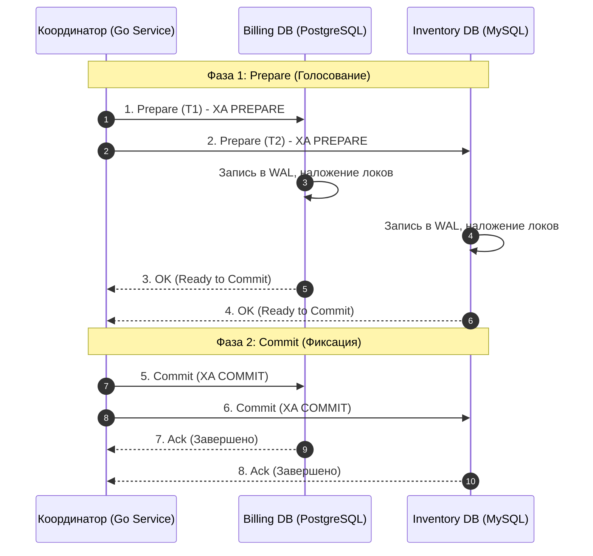

В архитектуре современных распределенных систем на Go рано или поздно наступает момент, когда тривиальная бизнес-операция перерастает границы одной базы данных. 

Представьте стандартный сценарий оформления заказа в современном интернет-гипермаркете:
1. Заблокировать и списать денежные средства в сервисе биллинга (PostgreSQL).
2. Зарезервировать и списать остатки физических товаров в сервисе склада (MySQL).
3. Начислить бонусные баллы и кэшбэк в сервисе лояльности (MongoDB).

В классическом монолите мы бы просто открыли блок `BEGIN TRANSACTION`, выполнили три SQL-запроса и зафиксировали результат через `COMMIT`, переложив всю ответственность на ACID-гарантии локального движка. 

Однако в распределенной микросервисной среде такой магии больше не существует: у каждой базы данных функционирует собственный изолированный журнал [[8. WAL. Write Ahead Log]], независимый менеджер блокировок и раздельная оперативная память.

**Распределенная транзакция** — это архитектурный механизм, координирующий согласованное выполнение группы операций на множестве физически независимых узлов сети так, чтобы вся цепочка обладала свойствами атомарности (Atomicity) и согласованности (Consistency).

---

## Проблема: Частичные отказы

В распределенной системе действует суровый эмпирический закон: всё, что способно сломаться, обязательно сломается в самый неподходящий момент:
* Сетевой стек может моргнуть (Packet Drop) ровно между шагом списания денег и шагом резервирования товара.
* Сервис склада может внезапно упасть под ударом OOM-Killer ядра Linux прямо в процессе выполнения транзакции.
* База данных программы лояльности может отклонить транзакцию из-за конфликта уникального ключа.

Если микросервисы на Go просто выполняют последовательные вызовы по HTTP или gRPC, система гарантированно окажется в катастрофическом **несогласованном состоянии (Inconsistent State)**: деньги с банковской карты клиента списаны, но товар на складе не забронирован, а заказ в системе не существует.

---

## Стратегия 1: Атомарная фиксация (2PC)

**Two-Phase Commit (Двухфазный коммит / 2PC)** — классический протокол распределенного консенсуса, созданный в попытке перенести бескомпромиссные гарантии локального ACID в распределенную сеть. В этой схеме появляется выделенная системная роль — **Координатор транзакции (Transaction Coordinator)**.

### Фазы протокола 2PC:
1. **Фаза 1: Prepare (Подготовка к фиксации):**  
   Координатор отправляет всем базам данных команду: *«Можете ли вы зафиксировать изменения?»*.  
   Каждый узел локально выполняет валидацию, сбрасывает дельту изменений в WAL, накладывает строгие эксклюзивные блокировки (X-Locks) на строки и голосует: `YES` (готов) или `NO` (отказ).
2. **Фаза 2: Commit / Rollback (Фиксация или Откат):**  
   - Если **все до единого** участника проголосовали `YES`, координатор рассылает команду `COMMIT`. Узлы применяют транзакцию и снимают блокировки.
   - Если хотя бы **один** узел проголосовал `NO` (или не ответил по таймауту), координатор рассылает команду `ROLLBACK`. Все узлы откатывают изменения по своим журналам.



> [!warning] Ловушка / Gotcha: Блокировки и SPOF
> 2PC — это **тяжелый синхронно блокирующий протокол**.  
> На всем протяжении между отправкой `Prepare` и получением `Commit` строки в базах данных остаются намертво заблокированными на запись для всех остальных клиентов!  
> Если координатор упадет после фазы Prepare, участвующие базы останутся в подвешенном состоянии (**In-Doubt Transactions**): они не имеют права ни накатить транзакцию, ни откатить ее, удерживая блокировки часами. Из-за чудовищного падения пропускной способности и риска каскадного отказа протокол 2PC практически не используется в современных микросервисных Highload-системах.

---

## Стратегия 2: Sagas (Саги)

В микросервисной индустрии и мире облачных Go-систем золотым стандартом реализации распределенных транзакций стал архитектурный паттерн **Saga (Сага)**, впервые описанный Гектором Гарсия-Молиной еще в 1987 году.

**Сага** — это цепочка независимых локальных транзакций в отдельных сервисах. Каждый шаг саги фиксирует локальную транзакцию немедленно, не удерживая глобальных сетевых блокировок.  
Если на определенном этапе происходит сбой (например, на складе закончился товар), сага запускает в обратном порядке цепочку **компенсирующих транзакций (Compensating Transactions)**, ликвидирующих последствия предыдущих успешных шагов.

```mermaid
flowchart LR
    subgraph HappyPath ["Успешное выполнение"]
        T1["1. Списание денег<br>(Local Commit)"] --> T2["2. Резерв склада<br>(Local Commit)"]
        T2 --> T3["3. Начисление бонусов<br>(Успех)"]
    end

    subgraph CompensationPath ["Откат через компенсации при сбое шага 2"]
        Fail["Сбой шага 2!<br>(Товара нет)"] -.-> C1["<b>Компенсация C1:</b><br>Возврат списанных денег<br>(Новая транзакция!)"]
    end

    style HappyPath fill:#0f172a,stroke:#38bdf8,stroke-width:2px
    style CompensationPath fill:#0f172a,stroke:#f43f5e,stroke-width:2px
    style T1 fill:#1e293b,stroke:#34d399,stroke-width:1px
    style T2 fill:#1e293b,stroke:#34d399,stroke-width:1px
    style T3 fill:#1e293b,stroke:#34d399,stroke-width:1px
    style C1 fill:#1e293b,stroke:#f87171,stroke-width:2px
```



### Архитектурные стили реализации Саг:
1. **Choreography (Хореография):** Сервисы не имеют централизованного координатора. Они реагируют на доменные события, передаваемые через шины сообщений (Kafka, RabbitMQ, NATS). Сервис биллинга опубликовал `PaymentCompleted` $\to$ сервис склада поймал событие и попытался списать товар. Если товар закончился, склад публикует `StockReservationFailed` $\to$ биллинг ловит событие и запускает компенсацию.
2. **Orchestration (Оркестрация):** Выделенный сервис-оркестратор последовательно отправляет gRPC/REST команды участникам саги, сохраняет статус выполнения каждого шага в базу и при необходимости централизованно рассылает компенсирующие команды.

> [!tip] Собеседование
> **Вопрос:** В чем фундаментальное различие между откатом (`ROLLBACK`) в реляционной СУБД и компенсирующей транзакцией в Саге?
> 
> **Ответ:** 
> * **Локальный откат (Rollback):** Стирает следы незакоммиченной транзакции из оперативной памяти и WAL. Ни один сторонний читатель ни на мгновение не видел промежуточных изменений (гарантия изоляции `Isolation`).
> * **Компенсация в Саге:** Это **новая, полноценно закоммиченная транзакция**, которая логически нейтрализует эффект предыдущей операции (например, операция пополнения баланса на ту же сумму).  
> Поскольку локальные транзакции саги коммитятся сразу, система проходит через стадию временного неконсистентного состояния (**Semantic Inconsistency**), которое открыто для наблюдения другим пользователям.

---

## Mechanical Sympathy: Идемпотентность

В любых распределенных транзакциях сетевые сбои делают **повторные запросы (Retries)** математически неизбежными. Если Go-клиент отправил команду списания денег, но сетевое соединение оборвалось до прихода ответа, клиент не знает: выполнилась ли операция на сервере, или запрос даже не покинул сетевой буфер?

При повторной отправке запроса система обязана гарантировать **Идемпотентность**: многократное применение одного и того же запроса дает абсолютно идентичный результат, не приводя к двойному списанию средств.

Для этого каждый распределенный запрос снабжается уникальным ключом идемпотентности — `Request-ID` (или `Transaction-ID` / `Idempotency-Key`):

```go
package billing

import (
	"context"
	"database/sql"
	"fmt"
)

// ChargeAccount выполняет атомарное и идемпотентное списание средств
func ChargeAccount(ctx context.Context, tx *sql.Tx, idempotencyKey string, accountID int, amount int64) error {
	// 1. Проверяем, не обрабатывался ли данный ключ ранее
	var exists bool
	checkQuery := `SELECT EXISTS(SELECT 1 FROM idempotency_keys WHERE key = $1)`
	if err := tx.QueryRowContext(ctx, checkQuery, idempotencyKey).Scan(&exists); err != nil {
		return fmt.Errorf("check idempotency: %w", err)
	}

	if exists {
		// Запрос уже был успешно обработан ранее: повторное списание запрещено!
		return nil
	}

	// 2. Выполняем полезную операцию списания
	updateQuery := `UPDATE accounts SET balance = balance - $1 WHERE id = $2 AND balance >= $1`
	res, err := tx.ExecContext(ctx, updateQuery, amount, accountID)
	if err != nil {
		return fmt.Errorf("debit balance: %w", err)
	}

	rows, err := res.RowsAffected()
	if err != nil || rows == 0 {
		return fmt.Errorf("insufficient funds or account not found")
	}

	// 3. Сохраняем ключ идемпотентности в той же локальной транзакции
	insertKey := `INSERT INTO idempotency_keys (key, account_id, created_at) VALUES ($1, $2, NOW())`
	if _, err := tx.ExecContext(ctx, insertKey, idempotencyKey, accountID); err != nil {
		return fmt.Errorf("store idempotency key: %w", err)
	}

	return nil
}
```

---

## Сравнение подходов

| Характеристика | 2PC (Two-Phase Commit) | Saga Pattern |
| :--- | :--- | :--- |
| **Изоляция (Isolation)** | Высокая (ACID-подобная, строгие локи) | Низкая (промежуточные состояния видны) |
| **Доступность (Availability)** | Низкая (блокировка строк парализует БД) | Высокая (локальные коммиты без удержания локов) |
| **Сложность разработки** | Реализована внутри СУБД (XA-стандарт) | Требует написания кода компенсирующих действий |
| **Модель консистентности** | Строгая (Strong Consistency) | В конечном счете ([[6. Consistency модели|Eventual Consistency]]) |
| **Применимость** | Локальные шарды одной базы, enterprise ERP | Распределенные микросервисы, облачный highload |

---

## Реализация на Go: Инструментарий

Писать сложную логику отслеживания состояний, таймаутов и ретраев саг на голых горутинах и каналах крайне рискованно. В профессиональной экосистеме Go принято использовать специализированные платформы:

* **Temporal.io / Cadence:** Доминирующий промышленный стандарт оркестрации рабочих процессов и саг. Разработчик пишет код распределенной бизнес-логики как обычную линейную функцию на Go, а движок Temporal гарантирует ее детерминированное выполнение, автоматические ретраи и вызовы компенсаций даже при внезапной перезагрузке серверов.
* **DTM (Distributed Transaction Manager):** Высокопроизводительный распределенный координатор транзакций с открытым исходным кодом, созданный специально для Go. Поддерживает паттерны Saga, TCC (Try-Confirm-Cancel) и двухфазный коммит XA.

---

## Резюме

1. **Распределенная транзакция** координирует модификации между изолированными хранилищами, решая проблему неизбежных частичных сетевых отказов.
2. **Протокол 2PC (Двухфазный коммит)** обеспечивает строгую атомарность, но платит за это жесткими блокировками и риском зависания кластера при отказе координатора.
3. **Паттерн Saga** делит процесс на цепочку локальных транзакций с компенсирующими действиями при авариях, являясь де-факто стандартом для микросервисов.
4. **Идемпотентность** — абсолютное обязательное требование для каждого сетевого эндпоинта, участвующего в распределенных цепочках.

Мы рассмотрели общий ландшафт распределенных транзакций. Однако протокол двухфазного коммита заслуживает максимально детального вскрытия: именно на нем исторически строились распределенные транзакции в классических РСУБД (XA-транзакции в MySQL и Postgres).

В следующей лекции мы разберем механику 2PC на уровне системных вызовов и отказов координатора: [[9. Two Phase Commit]].