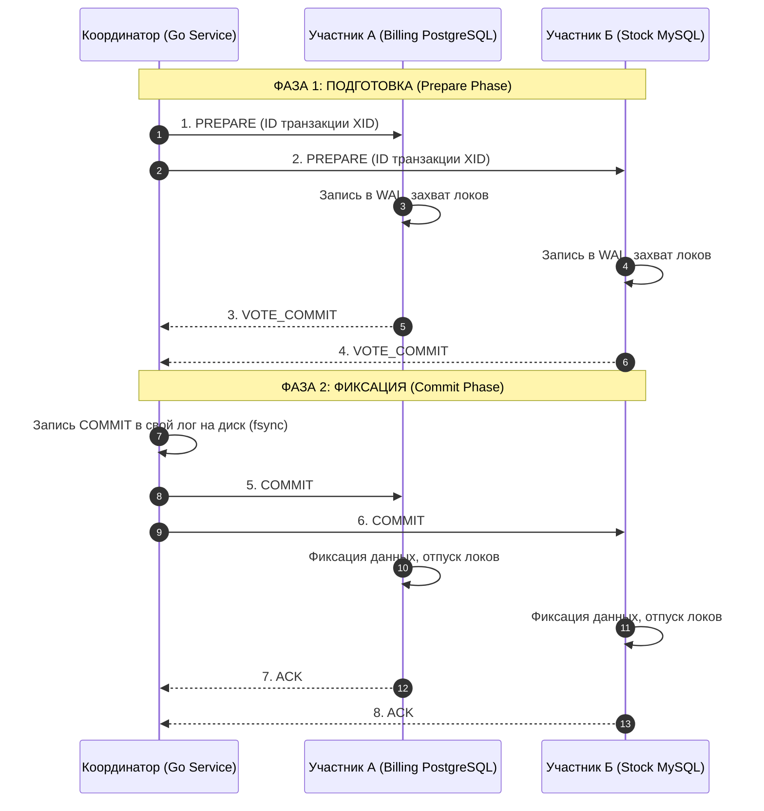

## Two-Phase Commit (2PC): Классика распределенного консенсуса

В предыдущей лекции ([[8. Distributed transactions]]) мы исследовали теоретический ландшафт межузловых транзакций и анатомию частичных отказов. Сегодня мы с инженерной дотошностью разберем исторический «золотой стандарт» (и одновременно «тяжелое проклятие») системной архитектуры — протокол **Двухфазной фиксации (Two-Phase Commit, 2PC)**.

Если вашей распределенной системе жизненно необходимо, чтобы комплексная операция гарантированно применилась на всех гетерогенных узлах (например, синхронно зафиксировалась в PostgreSQL и отправилась в Kafka) либо бесследно испарилась отовсюду при малейшем сбое, 2PC — это первое математическое решение, приходящее на ум архитектору. 

Однако за безупречную строгость атомарности распределенная природа взимает колоссальную дань: драматический рост сетевых задержек (Latency), парализующие блокировки таблиц и уязвимость перед падением узлов.

---

## 1. Роли и сценарий

Архитектура протокола 2PC базируется на стандарте **X/Open DTP (Distributed Transaction Processing)** и делит участников на две строгие роли:
1. **Координатор (Transaction Coordinator / TM — Transaction Manager):** Выделенный компонент (часто сам сервис на Go), который инициирует распределенную транзакцию, дирижирует голосованием и принимает окончательный вердикт.
2. **Участники (Participants / Cohorts / RM — Resource Managers):** Независимые подсистемы хранения (реляционные СУБД, очереди сообщений), выполняющие полезную работу над локальными данными.

Протокол разделен на две последовательные фазы, что и дало ему имя.

### Фаза 1: Голосование (Prepare Phase)
Координатор генерирует глобальный идентификатор транзакции (`XID`) и отправляет всем участникам команду `PREPARE`.  
Каждый участник локально выполняет проверку:
* Проверяет ограничения схемы (Constraints, Foreign Keys, Unique Indexes).
* Выполняет изменения в памяти, сбрасывает дельту в локальный журнал предзаписи (WAL) с пометкой `PREPARED`, но **ни в коем случае не коммитит** данные.
* Навешивает строгие эксклюзивные строчные блокировки (X-Locks) на все модифицируемые записи.
* Отправляет координатору сетевой голос: `VOTE_COMMIT` (готов зафиксировать) или `VOTE_ABORT` (ошибка, отказ).

### Фаза 2: Завершение (Commit Phase)
Координатор анализирует полученные голоса:
* **Если ВСЕ участники ответили «ДА» (`VOTE_COMMIT`):** Координатор делает обязательную синхронную запись в свой локальный журнал и рассылает всем участникам финальную команду `COMMIT`. Участники применяют изменения, открывают видимость данных и снимают блокировки строк.
* **Если ХОТЯ БЫ ОДИН ответил «НЕТ» (`VOTE_ABORT`) или не ответил по таймауту:** Координатор рассылает всем участникам команду `ROLLBACK`. Участники откатывают подготовленные изменения по WAL и освобождают заблокированные строки.



---

## 2. Под капотом: Механика надежности

В терминах классификации [[7. CAP теорема]] протокол 2PC представляет собой строгую **CP-систему**. Он выбирает консистентность любой ценой, жертвуя доступностью при сетевых сбоях.

Чтобы протокол переживал аварии питания и внезапные падения операционной системы, каждый шаг фиксируется в журналах:

> [!info] Под капотом: Лог Координатора
> Самый критический момент во всем протоколе 2PC — **момент записи решения координатора в собственный лог перед рассылкой второй фазы**.  
> Как только координатор сбросил запись `COMMIT` на диск через системный вызов `fsync`, транзакция юридически считается зафиксированной на вечные времена.  
> Если координатор внезапно сгорит или перезагрузится через микросекунду после записи в лог (до отправки сетевых пакетов участникам), при рестарте процесс Crash Recovery прочитает файл лога, обнаружит статус `COMMIT` и «дожмет» участников, повторно отправив им подтверждение фиксации. Без этого журнала система моментально скатилась бы в неконсистентный хаос.

### XA Transactions: Стандарт индустрии
В промышленном сегменте реляционных СУБД протокол 2PC стандартизован спецификацией **XA (eXtended Architecture)**. Практически все взрослые реляционные базы данных — PostgreSQL, MySQL (InnoDB), Oracle и Microsoft SQL Server — нативно поддерживают синтаксис XA. Это позволяет бэкенд-приложению на Go выступать в роли внешнего менеджера транзакций, связывающего две совершенно разные физические СУБД в единую неделимую операцию.

---

## 3. Главная проблема: Блокировки и "Точка отказа"

Почему в среде современных распределенных систем протокол 2PC называют «протоколом-убийцей производительности»?

1. **Длительные блокировки (Lock Amplification):**  
   Участники удерживают эксклюзивные блокировки строк с момента получения команды `PREPARE` вплоть до получения `COMMIT/ROLLBACK`. Если в локальной базе это занимает доли миллисекунды, то в 2PC это время включает в себя сетевой round-trip по всей распределенной инфраструктуре. Пока сеть передает пакеты, все параллельные транзакции, желающие модифицировать те же строки, выстраиваются в мертвую очередь ожидания.
2. **Проблема падения Координатора (In-Doubt State):**  
   Представьте ситуацию: все участники успешно выполнили `PREPARE` и ответили `VOTE_COMMIT`. В этот момент координатор внезапно умирает (Kernel Panic, сбой питания).  
   Участники оказываются в катастрофическом **подвешенном состоянии (In-Doubt State)**: они **не имеют права самостоятельно закоммитить** транзакцию (вдруг координатор упал из-за того, что соседний участник ответил отказом?), но и **не имеют права откатить ее** (вдруг координатор успел закоммитить ее у себя в логе!). Участники вынуждены бесконечно удерживать блокировки строк, парализуя работу всей базы данных, пока упавший координатор не восстановится.

> [!tip] Собеседование: Блокирующий протокол
> **Вопрос:** Является ли протокол Two-Phase Commit блокирующим протоколом и можно ли считать его полностью отказоустойчивым?
> 
> **Ответ:** **Да, 2PC — строго блокирующий протокол.** Это его главный архитектурный изъян. В случае падения координатора в фазе фиксации участники вынуждены ждать его восстановления неопределенное время, блокируя ресурсы операционной системы.  
> Это радикально снижает доступность (**Availability**) кластера. Попытка устранить блокировки привела к созданию протокола Three-Phase Commit (3PC), однако в условиях реальных сетевых разделений (Network Partitions) 3PC не гарантирует консистентность при разорванной сети.

---

## 4. Mechanical Sympathy: Цена сетевых раундов

С точки зрения аппаратных ресурсов и сетевого стека Linux, выполнение 2PC обходится крайне дорого: протокол требует как минимум **два полных сетевых раунда (Round-Trips)** между координатором и всеми узлами кластера.

Если межсерверная задержка (RTT) между дата-центрами составляет 20 мс, то чистый сетевой оверхед на координацию одной транзакции составит не менее:
$$20\text{ мс} \times 2 \times 2 = 80\text{ мс}$$
(плюс время вызовов `fsync` журналов WAL на всех узлах).

В течение этих 80 миллисекунд процессор простаивает в ожидании сетевого ввода-вывода (I/O Wait), горутины в Go висят на сетевых полингах, а соединения в пуле `database/sql` остаются занятыми. В высоконагруженных системах с десятками тысяч RPS это приводит к мгновенному исчерпанию пула соединений СУБД, переполнению дескрипторов файлов ОС и падению всей системы.

---

## 5. 2PC против Sagas

При проектировании архитектуры микросервисов на Go инженеры регулярно сопоставляют классический 2PC и распределенные саги ([[10. Saga pattern]]):

| Характеристика | Two-Phase Commit (2PC) | Saga Pattern |
| :--- | :--- | :--- |
| **Консистентность** | Строгая линеаризуемость (ACID) | В конечном счете (Eventual Consistency) |
| **Изоляция** | Высокая (локи на уровне движков СУБД) | Низкая (эффект «грязного чтения» бизнес-логики) |
| **Сложность** | На уровне инфраструктуры и драйверов (XA) | На уровне прикладного бизнес-кода и компенсаций |
| **Производительность** | Экстремально низкая (из-за блокировок) | Высокая (асинхронная реактивная обработка) |
| **Отказоустойчивость** | Блокируется при отказе координатора | Продолжает работать через очереди сообщений |

> [!warning] Ловушка / Gotcha: 2PC в микросервисах
> Попытка натянуть протокол 2PC на межсервисное взаимодействие микросервисов через HTTP/REST или gRPC — это хрестоматийный архитектурный антипаттерн.  
> 2PC требует глубокого доверия на уровне системных ресурсов: если микросервис склада упадет посреди транзакции, он заблокирует строки в базе данных биллинга, парализовав прием оплат по всему сервису. В распределенной микросервисной среде стандартом де-факто являются **Saga** или **Transactional Outbox pattern**.

---

## Практика в Go: Работа с XA в SQL

Стандартная библиотека `database/sql` в Go не содержит нативных методов для управления фазами XA-транзакций (в интерфейсе `sql.Tx` нет метода `Prepare()` для фиксации двухфазного коммита, а есть только локальные `Commit` и `Rollback`). 

Однако при необходимости связать две базы данных MySQL или PostgreSQL разработчик на Go может управлять XA-состоянием напрямую через сырые SQL-команды протокола XA:

```go
package main

import (
	"context"
	"database/sql"
	"fmt"
	"log"

	_ "github.com/go-sql-driver/mysql"
)

// DistributedTx демонстрирует концептуальное выполнение XA 2PC в Go
func DistributedTx(ctx context.Context, db1, db2 *sql.DB) error {
	const xid = "'tx_order_12345'"

	// 1. Старт транзакций на обеих БД
	if _, err := db1.ExecContext(ctx, "XA START "+xid); err != nil {
		return fmt.Errorf("db1 xa start: %w", err)
	}
	if _, err := db2.ExecContext(ctx, "XA START "+xid); err != nil {
		_, _ = db1.ExecContext(ctx, "XA END "+xid)
		_, _ = db1.ExecContext(ctx, "XA ROLLBACK "+xid)
		return fmt.Errorf("db2 xa start: %w", err)
	}

	// 2. Выполнение полезной бизнес-логики (DML)
	_, err1 := db1.ExecContext(ctx, "UPDATE billing SET balance = balance - 100 WHERE id = 1")
	_, err2 := db2.ExecContext(ctx, "UPDATE stock SET count = count - 1 WHERE id = 42")

	// Переводим транзакции в состояние IDLE
	_, _ = db1.ExecContext(ctx, "XA END "+xid)
	_, _ = db2.ExecContext(ctx, "XA END "+xid)

	if err1 != nil || err2 != nil {
		_, _ = db1.ExecContext(ctx, "XA ROLLBACK "+xid)
		_, _ = db2.ExecContext(ctx, "XA ROLLBACK "+xid)
		return fmt.Errorf("business logic failed: err1=%v, err2=%v", err1, err2)
	}

	// 3. ФАЗА 1: PREPARE (Голосование)
	_, prepErr1 := db1.ExecContext(ctx, "XA PREPARE "+xid)
	_, prepErr2 := db2.ExecContext(ctx, "XA PREPARE "+xid)

	// 4. ФАЗА 2: COMMIT или ROLLBACK
	if prepErr1 == nil && prepErr2 == nil {
		// Оба узла подтвердили готовность: фиксируем изменения
		_, _ = db1.ExecContext(ctx, "XA COMMIT "+xid)
		_, _ = db2.ExecContext(ctx, "XA COMMIT "+xid)
		log.Println("Distributed transaction committed successfully")
		return nil
	}

	// Хотя бы один узел упал или не готов: откатываем обоих
	_, _ = db1.ExecContext(ctx, "XA ROLLBACK "+xid)
	_, _ = db2.ExecContext(ctx, "XA ROLLBACK "+xid)
	return fmt.Errorf("prepare failed: p1=%v, p2=%v", prepErr1, prepErr2)
}
```

Для промышленных задач в экосистеме Go рекомендуется использовать проверенные специализированные менеджеры транзакций, такие как **DTM (Distributed Transaction Manager)**, который берет на себя надежное ведение журнала координатора и разрешение In-Doubt состояний.

---

## Резюме

1. **Two-Phase Commit (2PC)** — классический протокол строгой атомарности распределенных данных, состоящий из фазы голосования (`PREPARE`) и фазы фиксации (`COMMIT`).
2. Это **жестко синхронный и блокирующий** протокол: строки баз данных остаются заблокированными на все время сетевого обмена.
3. Главная архитектурная уязвимость 2PC — **зависание участников в In-Doubt состоянии** при внезапном падении координатора после первой фазы.
4. В современной микросервисной разработке 2PC практически полностью уступил место событийно-ориентированному паттерну **Saga**, который решает проблему распределенной согласованности без блокировок ресурсов.

Теперь мы готовы погрузиться в архитектурный стандарт современных распределенных систем, позволяющий микросервисам жить в гармонии без глобальных блокировок.

В следующей лекции мы досконально разберем проектирование саг — [[10. Saga pattern]].