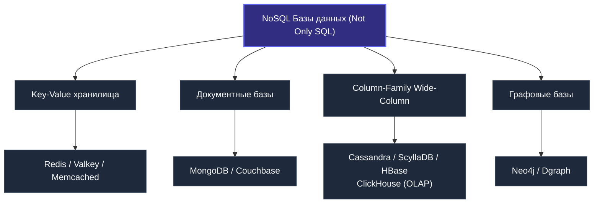
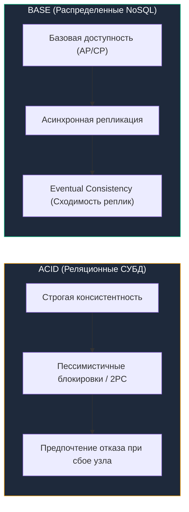

# Что такое NoSQL: архитектура, модели данных и практический выбор

В инженерном сообществе аббревиатура NoSQL породила немало мифов. На заре ее популярности многие энтузиасты наивно полагали, что пришло спасение от реляционной алгебры, а реляционные базы можно списать в архив: «Зачем проектировать таблицы, схемы и нормальные формы, если можно просто сбрасывать сырой JSON в базу как попало?». На практике это заблуждение привело к появлению терабайтов нечитаемых, рассинхронизированных данных и тяжелейшему похмелью на этапе поддержки.

На самом деле **NoSQL = Not Only SQL** («Не только SQL»). Это не отрицание полувекового опыта реляционных систем, а признание прагматичного факта: мир данных неоднороден. Существуют обширные классы задач, где строгая реляционная модель, монолитные транзакции и нормализация становятся архитектурным тупиком.

Когда вы проектируете сервис на Go, который обязан выдерживать сотни тысяч или миллионы запросов в секунду, переваривать петабайты логов, мгновенно отдавать сессии или оперировать динамическими графами связей, вы неизбежно выходите за рамки классических реляционных СУБД.

---

## Исторический контекст: почему SQL стало "not only"

Классические реляционные СУБД безоговорочно правили миром бэкенда на протяжении десятилетий. Они безупречно справляются с задачами [[3. Типы баз данных. OLTP vs OLAP|OLTP]] и OLAP, когда структура данных стабильна, взаимосвязи строго определены внешними ключами, а рост нагрузки компенсируется вертикальным масштабированием (Scale-up) — установкой более производительного процессора, сотен гигабайт RAM и быстрых дисковых массивов.

Но в середине 2000-х годов титаны веб-индустрии (Google с Bigtable, Amazon с Dynamo, Facebook с Cassandra) уперлись в фундаментальные ограничения:

1. **Масштаб и цена вертикального роста.** Серверы с десятками терабайт оперативной памяти и сотнями ядер процессора стоят астрономических денег. Горизонтальное масштабирование (Scale-out) — объединение сотен и тысяч недорогих commodity-серверов в распределенный кластер — требовало пересмотра фундаментальных гарантий ACID (см. [[1. ACID. Основы]]), в первую очередь мгновенной глобальной консистентности.
2. **Скорость продуктовой разработки.** В эпоху гибких методологий продуктовые команды меняют модели данных каждые две недели. Жесткая схема реляционных таблиц, блокирующие DDL-операции и миграции ([[4. Миграции базы данных]]) на таблицах размером в сотни миллионов строк превратились в непреодолимое бутылочное горлышко.
3. **Природа и разнообразие данных.** Появились огромные массивы полуструктурированных и неструктурированных данных: пользовательские сессии, телеметрия IoT-устройств, графы дружбы в социальных сетях, полнотекстовые индексы и матрицы эмбеддингов. Загонять их в прокрустово ложе строгой [[9. Нормализация. Введение|нормализации]] с каскадными `JOIN`-ами означало чудовищно неэффективно тратить ресурсы процессора и памяти.

В ответ на эти вызовы инженеры начали разрабатывать базы данных, сознательно отказавшиеся от строгого SQL-интерфейса, монолитной схемы и классического ACID в пользу горизонтального шардирования, высокой доступности и феноменальной скорости на специализированных профилях нагрузки. Сегодня маятник качнулся к конвергенции: многие NoSQL-базы получили диалекты SQL и транзакции, но их архитектурный фундамент остался специализированным.

> [!info] Под капотом
> Ключевое отличие NoSQL-движков от классического InnoDB/PostgreSQL storage engine лежит в структурах хранения. Вместо строгой row-based модели со страницами фиксированного размера (обычно 8 или 16 КБ) и B-Tree-индексами вы получаете либо LSM-Tree (Log-Structured Merge-tree в Cassandra, RocksDB), либо inverted index (Elasticsearch), либо хранение в оперативной памяти (Redis). Каждая структура оптимизирована под конкретный паттерн доступа к диску и памяти. С точки зрения Go-рантайма это означает совершенно разный профиль syscall-ов и работу с памятью, когда вы, например, держите соединение с Redis или MongoDB.

---

## Классификация NoSQL-баз

Чтобы ориентироваться в огромном разнообразии систем, инженеры классифицируют NoSQL-базы по базовой модели представления данных на четыре фундаментальных семейства:



### 1. Key-Value (Ключ-значение)
Предельно лаконичная модель: каждому уникальному строковому ключу сопоставляется произвольное значение — строка, число, бинарный BLOB или сериализованная структура данных. База данных не вникает в семантику значения, работая как гигантская распределенная хэш-таблица.
- **Представители:** [[3. Redis. Архитектура и применение|Redis]], [[5. Memcached|Memcached]], [[6. Valkey|Valkey]], etcd.
- **Типичные сценарии:** распределенный кэш, хранение сессий пользователей, конфигурации кластера, скользящие счетчики, rate limiting, pub/sub.
- **Преимущество:** предсказуемая latency на уровне десятков микросекунд, так как данные часто лежат полностью в памяти (Redis) и запрос — это простой поиск по хеш-таблице с $O(1)$. Подробнее в [[2. Key Value базы]].

### 2. Document (Документные)
Хранят документы — самодостаточные иерархические структуры данных, обычно в формате JSON, BSON или XML. Каждый документ имеет уникальный первичный ключ (`_id`), а внутри содержит поля, вложенные словари и массивы произвольной глубины. База данных понимает структуру документа и позволяет строить вторичные индексы по любым вложенным полям.
- **Представители:** [[7. Document базы. MongoDB|MongoDB]], Couchbase, Amazon DocumentDB.
- **Типичные сценарии:** профили пользователей с динамическим набором атрибутов, каталоги интернет-магазинов с миллионами разнообразных товаров, CMS, хранение конфигураций.
- **Важное отличие от реляций:** документ объединяет то, что в SQL лежало бы в нескольких таблицах и собиралось JOIN-ом. Это даёт выигрыш на чтении за счёт денормализации. Отличная статья по теме — [[14. Денормализация и когда она оправдана]].

### 3. Column-Family (Колоночные / Wide-Column)
Данные организованы в разреженные двумерные матрицы, где каждая строка имеет уникальный ключ (Row Key), но набор колонок в каждой строке может быть произвольным и динамическим. Колонки группируются в семейства (Column Families), и на диске данные физически хранятся непрерывными блоками по колонкам или семействам.
- **Представители:** [[9. Column базы. Cassandra|Cassandra]], HBase, ScyllaDB, и отчасти [[11. ClickHouse. OLAP база|ClickHouse]] (хотя ClickHouse скорее аналитическая колоночная СУБД).
- **Типичные сценарии:** хранение временных рядов, IoT-телеметрия, финансовые тики, ленты событий, event sourcing (см. [[9. Event sourcing и базы]]).
- **Под капотом:** Cassandra, например, использует LSM-Tree для невероятно быстрой записи на диск — данные пишутся в memtable в памяти и последовательно сбрасываются в SSTables на диске, избегая случайного I/O.

### 4. Graph (Графовые)
В этой модели сущности первого класса — это вершины (узлы) и ребра (направленные связи между ними с атрибутами). Традиционный SQL вынужден моделировать сложные графовые связи через таблицы связок и ресурсоемкие рекурсивные `JOIN`-ы. Графовые СУБД используют структуру Index-free Adjacency: каждый узел напрямую хранит указатели на свои смежные узлы в памяти.
- **Представители:** Neo4j, Dgraph, AWS Neptune.
- **Типичные сценарии:** социальные графы (друзья, подписчики), рекомендательные движки («пользователи, купившие этот товар, также смотрели...»), антифрод-системы (анализ цепочек сомнительных транзакций), графы зависимостей и знаний (Knowledge Graphs).
- **Язык запросов:** Cypher, SPARQL, Gremlin вместо SQL. В Go-экосистеме популярен Dgraph с GraphQL-подобным API.

---

## ACID vs BASE: другая философия консистентности

Революция NoSQL базируется на теореме [[7. CAP теорема|CAP]] (о которой мы поговорим детальнее в распределённых системах), которая утверждает, что в распределенной системе при наличии разделения сети (Partition) вы обязаны выбрать между Consistency и Availability. NoSQL-системы, как правило, жертвуют строгой согласованностью (strong consistency) в пользу доступности и устойчивости к разделению.

Вместо классического ACID ([[1. ACID. Основы]]) в распределенном мире родилась концепция **BASE**:
- **B**asically **A**vailable («Базовая доступность») — система гарантирует ответ на любой запрос даже при сбое части узлов кластера (пусть даже с устаревшими данными).
- **S**oft state («Мягкое состояние») — состояние системы может изменяться с течением времени даже в отсутствие входящих запросов на запись (в процессе фоновой репликации и сходимости узлов).
- **E**ventual consistency («Согласованность в конечном счете») — если в систему перестанут поступать новые обновления, через некоторое время все реплики кластера гарантированно придут к одинаковому непротиворечивому состоянию.



> [!warning] Ловушка / Gotcha
> Eventual consistency совсем не означает, что у вас нет никаких гарантий, и данные могут теряться. Большинство современных NoSQL-баз предоставляют настраиваемые уровни консистентности для каждой операции (например, Cassandra: `QUORUM` на запись и чтение даёт строгую согласованность). Проблема в том, что по умолчанию эти настройки часто щадящие, и новички попадают в ситуацию, когда read-after-write не работает. В Go-клиентах к Cassandra (gocql) эта конфигурация управляется через `Consistency.One` / `Consistency.Quorum`.

---

## Mechanical Sympathy: как NoSQL работает с железом

С точки зрения Go-разработчика, понимающего [[1. Архитектура компьютера|архитектуру процессора]] и устройство ОС, выбор NoSQL-движка — это выбор профиля использования системных ресурсов.

- **Redis / Memcached** — pure in-memory база. Все данные живут в куче процесса в оперативной памяти. Системный вызов `read` вообще не вызывается для получения данных (кроме восстановления из RDB/AOF). Это даёт субмиллисекундную задержку, но требует огромных объёмов RAM.
- **MongoDB (до v4.0)** использовал mmap для отображения файлов БД в виртуальную память, полагаясь на page cache ОС. Это означало, что при холодном старте и чтении с диска процесс уходит в major page fault — дорогой syscall, блокирующий поток ОС. В Go-драйвере mongo-go-driver это влияет на то, как планировщик горутин обрабатывает блокирующие вызовы.
- **Cassandra** и подобные LSM-движки, напротив, оптимизированы под последовательную запись на диск. Последовательный I/O на NVMe дисках даёт пропускную способность гигабайты в секунду при минимуме `fdatasync` и переключений контекста. Это хорошо коррелирует с принципами написания высокопроизводительного Go-кода: буферизация и пакетная запись.

| Модель хранения | Механика работы с диском | Профиль памяти (RAM) | Нагрузка на CPU / Syscalls |
|---|---|---|---|
| **In-Memory (Redis)** | Только append лога (AOF) или снимок (RDB) | 100% данных в оперативной памяти | Минимум syscalls, привязка к одному ядру, важен L3 кэш |
| **Document (MongoDB WiredTiger)** | Запись в журнал (WAL) + контрольные точки каждые 60с | Кэш страниц B-Tree в RAM | Пул рабочих потоков, активная работа с page cache ОС |
| **LSM-Tree (Cassandra)** | Строго последовательный append в CommitLog + SSTables | Memtables в памяти, Bloom-фильтры в RAM | Эффективная утилизация NVMe шины, фоновые компы (compaction) |
| **B-Tree (PostgreSQL/MySQL)** | Случайные модификации 8/16 КБ страниц через WAL | Shared Buffers / InnoDB Buffer Pool | Высокие требования к random IOPS, блокировки страниц в RAM |

> [!tip] Собеседование
> **Вопрос:** Почему MongoDB может быть быстрее PostgreSQL на одном типе нагрузки и медленнее на другом, даже если индексы настроены правильно?
> **Ответ:** MongoDB хранит документ как единое целое (обычно последовательно на диске в BSON-формате внутри коллекции). Если ваш паттерн доступа — «получить пользователя со всеми его адресами и последними заказами», вы читаете один документ (скорее всего, один IO-промах, если нет индекса). В PostgreSQL те же данные из-за нормализации потребуют трёх JOIN-ов и множества случайных чтений страниц. Однако если вам нужен только email пользователя, MongoDB прочитает весь документ (включая большие вложенные массивы), тратя пропускную способность памяти и шины данных. PostgreSQL же аккуратно прочитает только нужный столбец через Index-Only Scan ([[6. Covering индекс]]). Именно поэтому говорят: «NoSQL не лучше и не хуже — он другой».

---

## Go и NoSQL: готовимся к практике

Стандартная библиотека Go, а именно `database/sql` (см. [[1. Работа с БД в Go. database_sql]]), не предназначена для NoSQL-баз. Она спроектирована вокруг концепции реляционного драйвера, строгой типизации столбцов через `Scan` и management-команд типа `BEGIN/COMMIT`.

Для NoSQL вы будете использовать нативные драйверы сообщества:
- **Redis:** `github.com/redis/go-redis/v9`
- **MongoDB:** `go.mongodb.org/mongo-driver`
- **Cassandra:** `github.com/gocql/gocql`
- **ClickHouse:** `github.com/ClickHouse/clickhouse-go/v2`
- **Neo4j:** `github.com/neo4j/neo4j-go-driver/v5`

Эти драйверы реализуют собственные пулы соединений ([[2. Connection pool]]), протоколы сериализации (RESP, MongoDB Wire Protocol) и кластерную маршрутизацию. Обратите внимание: `database/sql` не управляет этими соединениями — используйте настройки самих драйверов.

Взглянем на лаконичный пример работы с Redis и MongoDB в одном Go-сервисе:

```go
package main

import (
	"context"
	"fmt"
	"log"
	"time"

	"github.com/redis/go-redis/v9"
	"go.mongodb.org/mongo-driver/bson"
	"go.mongodb.org/mongo-driver/mongo"
	"go.mongodb.org/mongo-driver/mongo/options"
)

type UserProfile struct {
	ID       string            `bson:"_id"`
	Username string            `bson:"username"`
	Settings map[string]string `bson:"settings"`
}

func main() {
	ctx, cancel := context.WithTimeout(context.Background(), 5*time.Second)
	defer cancel()

	// 1. Подключение к Redis (Key-Value)
	rdb := redis.NewClient(&redis.Options{
		Addr:         "localhost:6379",
		PoolSize:     20,
		MinIdleConns: 5,
	})
	defer rdb.Close()

	if err := rdb.Set(ctx, "session:user:101", "token_abc123", 15*time.Minute).Err(); err != nil {
		log.Fatalf("Redis SET failed: %v", err)
	}
	val, _ := rdb.Get(ctx, "session:user:101").Result()
	fmt.Printf("Redis session token: %s\n", val)

	// 2. Подключение к MongoDB (Document)
	mOpts := options.Client().ApplyURI("mongodb://localhost:27017").SetMaxPoolSize(50)
	mClient, err := mongo.Connect(ctx, mOpts)
	if err != nil {
		log.Fatalf("Mongo connect error: %v", err)
	}
	defer mClient.Disconnect(ctx)

	collection := mClient.Database("shop").Collection("users")
	profile := UserProfile{
		ID:       "usr_101",
		Username: "gopher",
		Settings: map[string]string{"theme": "dark", "lang": "ru"},
	}

	_, err = collection.UpdateOne(ctx, bson.M{"_id": profile.ID}, bson.M{"$set": profile}, options.Update().SetUpsert(true))
	if err != nil {
		log.Fatalf("Mongo upsert failed: %v", err)
	}
	fmt.Println("MongoDB document upserted successfully!")
}
```

---

## Когда выбирать NoSQL, а когда нет

Ниже — прямое практическое руководство, которое стоит держать в голове перед стартом нового сервиса на Go.

**Выбирайте NoSQL, если:**
- Схема данных меняется быстро или не определена заранее (динамические документы).
- Вам нужна запись с огромной скоростью (логи, события, IoT) — смотрите в сторону Cassandra или ClickHouse.
- Доступ всегда идёт по ключу, без сложных аналитических запросов (сессии, кэш) — Redis.
- Данные естественно денормализованы и представляют собой агрегат — документные БД.
- Важнее доступность и работа в условиях сетевых разделов, чем строгая консистентность в реальном времени.

**Выбирайте реляционные БД (PostgreSQL/MySQL), если:**
- Данные строго структурированы и связи критичны (финансы, учёт товаров).
- Нужны сложные ACID-транзакции с участием нескольких таблиц.
- Присутствует развитая аналитика с ad-hoc запросами, JOIN-ами и оконными функциями.
- Команда ещё не готова работать с eventual consistency и хочет гарантий «запрос-ответ» без сюрпризов.

Часто в реальных highload-проектах (см. [[13. Highload базы данных]]) используется комбинация: PostgreSQL как основной источник истины и NoSQL как специализированные прослойки — Redis для кэша ([[7. Кэширование поверх БД]]), Elasticsearch для полнотекстового поиска, Cassandra для быстрой записи событий.

---

## Итог

NoSQL не замена реляционным базам, а расширение арсенала бэкенд-инженера. Каждая категория — key-value, document, column-family, graph — решает конкретную проблему масштаба, скорости или гибкости. Понимание внутреннего устройства этих систем (LSM-Tree, in-memory структуры, mmap) напрямую влияет на способность писать на Go действительно производительные, стабильные и предсказуемые системы.

В следующих статьях мы будем последовательно погружаться в каждый тип NoSQL, начиная с самого простого и невероятно мощного — key-value хранилищ. Мы начнём с обзора архитектуры и применения, а затем залезем под капот самых известных реализаций.

[[2. Key Value базы]]