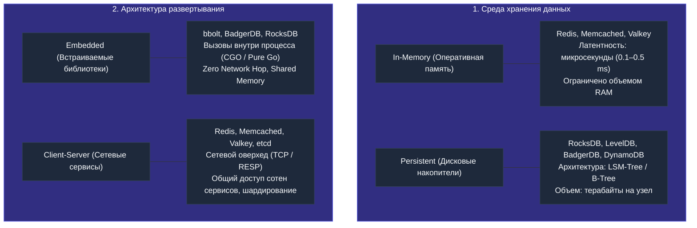
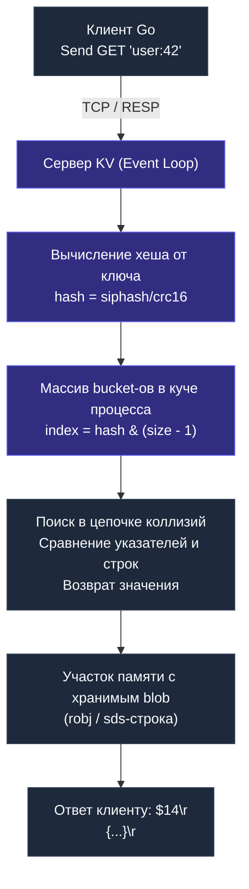

# Key-Value базы данных: архитектура, структуры памяти и паттерны в Go

Key-Value (KV) хранилище — это простейшая и одновременно одна из самых мощных инженерных абстракций в мире баз данных. Вся парадигма вращается вокруг элементарного контракта: по уникальному ключу атомарно сохранить или извлечь значение. Здесь нет таблиц, внешних ключей, колонок, триггеров и тяжеловесных оптимизаторов запросов.

Именно эта радикальная простота позволяет выжать максимум из современного кремния. Когда реляционная СУБД тратит сотни тысяч тактов CPU на парсинг SQL, проверку прав, построение плана выполнения, блокировку страниц и обход B-Tree, KV-хранилище вычисляет хэш ключа и читает данные из памяти за десятки наносекунд.

В экосистеме Go key-value хранилища занимают центральное место: от многоуровневого кэширования ответов API до распределенных блокировок, скользящих счетчиков rate limiting и координации микросервисов.

---

## Модель данных

Математически KV-хранилище представляет собой ассоциативный массив (отображение, хэш-таблицу), где:
- **Ключ (Key)** — уникальный идентификатор, чаще всего текстовая строка произвольного формата, но на уровне движка — непрерывная последовательность байт.
- **Значение (Value)** — неинтерпретируемый набор байтов (opaque BLOB). Хранилище не валидирует внутреннюю структуру данных: для него это просто массив байт в памяти. Вся логика валидации схемы (schema-on-read), сериализации и десериализации полностью возлагается на клиентское приложение.

```go
// Концептуальная ментальная модель KV-хранилища в Go
store := make(map[string][]byte)
store["user:session:abc123"] = []byte(`{"user_id":42,"expires":"2026-04-25T12:00:00Z"}`)
```

Такая лаконичность устраняет целые классы вычислительной сложности:
- Нет синтаксического анализатора SQL и построителя дерева выражений (AST).
- Нет оптимизатора реляционных соединений (`Hash Join`, `Merge Join`, `Nested Loops`).
- Нет накладных расходов на координацию транзакций между несколькими независимыми таблицами.

Взамен мы получаем гарантированный доступ $O(1)$ по ключу с минимальной латентностью и нулевыми накладными расходами на трансляцию абстракций.

---

## Типы Key-Value хранилищ

Хотя концептуальная модель едина, физическая реализация и архитектура KV-движков разделяются по двум ключевым измерениям: среде хранения и топологии развертывания.



### 1. Основное хранилище данных
- **In-memory** — весь активный набор данных постоянно находится в оперативной памяти (DRAM). Примеры: [[3. Redis. Архитектура и применение|Redis]], [[5. Memcached|Memcached]], [[6. Valkey|Valkey]]. Скорость доступа измеряется микросекундами. Персистентность опциональна (периодические RDB-снапшоты, инкрементальный append-only журнал AOF) и не гарантирует мгновенную долговечность каждой транзакции без вызова `fsync`.
- **Persistent (на диске)** — данные упорядоченно сбрасываются на SSD/NVMe. Примеры: RocksDB, LevelDB (встраиваемые библиотеки на C++), BadgerDB (pure Go), Amazon DynamoDB (облачный сервис). Они опираются на структуры LSM-Tree (Log-Structured Merge-tree) или B+Tree, где оперативная память используется в качестве write-буфера (memtable) и блочного кэша. Скорость операций здесь уступает DRAM в сотни раз, но емкость ограничена терабайтами диска, а не объемом планок памяти.

### 2. Архитектура развёртывания
- **Embedded (встраиваемые)** — база данных компилируется прямо в бинарник вашего Go-приложения как обычный Go-пакет. Нет сетевого стека, нет сериализации по TCP. Доступ к данным — это прямой вызов функции в памяти с нулевым копированием (zero-copy). Яркие представители экосистемы Go: `bbolt` (форк BoltDB, лежащий в основе `etcd`), `badger` (от Dgraph Labs). Идеально подходят для локальных хранилищ метаданных, очередей на хосте и граничных вычислений (Edge computing).
- **Client-server (клиент-серверные)** — самостоятельные сетевые демоны, принимающие соединения сотен микросервисов по протоколу TCP. Примеры: Redis, Memcached, Valkey. Появляется накладной расход на сериализацию, сетевой round-trip (RTT) и системные вызовы сокетов, но взамен мы получаем независимое масштабирование, централизованный пул памяти и общий источник состояния для распределенного кластера.

---

## Под капотом: как реализована O(1) магия

С точки зрения Mechanical Sympathy, скорость KV-хранилищ базируется на двух китах: устранении дискового случайного ввода-вывода (Random I/O) и выравнивании структур данных под кэш-линии современных процессоров.

### Хеш-таблица — фундамент

Внутри Redis, Memcached, Valkey и многих других используется классическая хеш-таблица с цепочками (chaining) или открытой адресацией.



Разберём ключевые инженерные элементы этой архитектуры:

1. **Хеш-функция.** Используются быстрые некриптографические функции: SipHash (в Redis), MurmurHash, CityHash. Они спроектированы так, чтобы за несколько десятков тактов CPU давать равномерное распределение по бакетам, избегая коллизий. Для Go-разработчика, знающего [[Устройство и работа ОС]], важно, что вычисление хеша происходит в user space, без syscall’ов, и полностью ложится на АЛУ процессора. Кроме того, SipHash защищает сервис от атак типа HashDoS (умышленная генерация ключей с одинаковым хэшем для деградации поиска в $O(N)$).
2. **Массив бакетов.** Ядро таблицы — это непрерывный кусок памяти, выделенный через `malloc` (в C-реализации Redis) или аналогичный механизм. Обращение по индексу — это O(1) с использованием L1/L2 кэша процессора. Обращение к бакету `table[index]` — это прямое чтение по адресу `base_addr + index * sizeof(pointer)`. Если бакет уже закэширован в L1d-кэше процессора (доступ ~1 нс), процессор тратит минимум тактов.
3. **Разрешение коллизий.** Когда два разных ключа дают одинаковый индекс бакета, они организуются в связный список (chaining). В наихудшем случае цепочка превращает поиск в $O(N)$. Чтобы предотвратить деградацию производительности, движок мониторит коэффициент заполнения (load factor). При превышении порога (обычно 1.0) запускается динамическое рехэширование.

> [!info] Под капотом
> В Redis хеш-таблица — это `dictht`, содержащая массив `dictEntry*`. При рехэшировании Redis использует инкрементальный подход: операция переноса ключей из старой таблицы в новую выполняется понемногу при каждом обращении к базе, чтобы не блокировать сервер на длительный период. Это классический пример избегания «stop-the-world» пауз в конкурентной среде. Во время рехэширования в структуре присутствуют две таблицы (`ht[0]` и `ht[1]`). Новые записи всегда идут в `ht[1]`, а поиск проверяет сначала старую, затем новую.

### Структуры данных для значений

В отличие от Memcached, который хранит только плоские байтовые строки, Redis и Valkey предлагают богатые структуры: строки (SDS — Simple Dynamic Strings), списки (Quicklist / Listpack), множества (Intset / Hashtable), хэши (Dict / Listpack), упорядоченные множества (Sorted Sets на базе SkipList). Но с точки зрения KV-модели — значение остаётся единым blob’ом. Тип структуры — это метаданные, которые говорят серверу, как интерпретировать байты, чтобы выполнить операции вроде `LPUSH` или `ZADD`.

Для Go-разработчика это означает, что даже самый сложный объект нужно сериализовать перед отправкой в KV-хранилище. Чаще всего выбирают JSON, MessagePack, Protobuf. При этом нужно помнить о влиянии на кучу Go: большие аллокации увеличивают давление на GC. Рассмотрите возможность переиспользования буферов через `sync.Pool` при частой сериализации.

---

## Протоколы взаимодействия: как Go общается с KV-хранилищем

Когда ваш Go-сервис выполняет `client.Get(ctx, "key")`, происходит цепочка событий, включающая сокеты, системные вызовы и парсинг.

### RESP (REdis Serialization Protocol)
Классический протокол Redis, используемый также Valkey и многими другими. Он текстовый и бинарно-безопасный (binary safe), так как длина payload всегда явно передается префиксом.
Запрос выглядит как:
```text
*2\r\n$3\r\nGET\r\n$7\r\nuser:42\r\n
```
Разбор по токенам:
- `*2` — массив из 2 аргументов.
- `$3\r\nGET\r\n` — bulk string длиной 3 байта со словом `GET`.
- `$7\r\nuser:42\r\n` — bulk string длиной 7 байт со значением `user:42`.

Ответ — либо bulk string (`$10\r\nvalue_data\r\n`), либо целочисленное значение (`:1\r\n`), либо ошибка (`-ERR ...\r\n`). Парсинг RESP — один из самых горячих путей в драйвере `go-redis`. Библиотека `go-redis/v9` использует пул буферов и zero-copy парсинг, чтобы снизить нагрузку на сборщик мусора Go.

### Memcached протокол
Более простой, текстовый (хотя есть и бинарная спецификация). Базовые команды: `get key\r\n`, `get <key>\r\n`, либо сохранение: `set key flags exptime length\r\n<data>\r\n`. Здесь нет вложенных структур, всё максимально оптимизировано под плоский memcopy в кэш.

### Соединения, пулы и Pipelining в Go

В Go для общения с сетевым KV-хранилищем клиентские библиотеки поддерживают внутренний connection pool. В отличие от `database/sql`, где драйвер оперирует стандартным пулом соединений базы, в `github.com/redis/go-redis/v9` реализован специализированный пул на каналах и мьютексах, поддерживающий безопасное мультиплексирование горутин.

Один из мощнейших инструментов повышения пропускной способности — **Pipelining**. Клиент отправляет пачку команд подряд в один сокет без ожидания подтверждения каждой команды (устраняя Round-Trip Time для каждого сетевого пакета):

```go
package main

import (
	"context"
	"fmt"
	"log"
	"time"

	"github.com/redis/go-redis/v9"
)

func runPipelineDemo(ctx context.Context, rdb *redis.Client) {
	// Создаем пайплайн
	pipe := rdb.Pipeline()

	// Наполняем буфер командами (команды еще не улетели в сеть!)
	getCmd := pipe.Get(ctx, "session:101")
	setCmd := pipe.Set(ctx, "session:102", "token_xyz", 10*time.Minute)
	incrCmd := pipe.Incr(ctx, "counter:global")

	// Отправляем все команды за один системный вызов write()
	_, err := pipe.Exec(ctx)
	if err != nil && err != redis.Nil {
		log.Printf("Сетевая ошибка при исполнении пайплайна: %v", err)
	}

	// Читаем индивидуальные ответы после прогона
	if val, err := getCmd.Result(); err == nil {
		fmt.Println("Значение session:101:", val)
	} else if err == redis.Nil {
		fmt.Println("Ключ session:101 не найден")
	}

	fmt.Println("Результат SET session:102:", setCmd.Val())
	fmt.Println("Новое значение счетчика:", incrCmd.Val())
}
```

---

## Паттерны использования и Mechanical Sympathy

Давайте взглянем на KV-хранилище глазами процессора, планировщика горутин и ядра ОС.

### Кэширование — самый горячий сценарий
Ваш Go-сервис обращается к PostgreSQL за данными пользователя. Запрос занимает 5 мс (дисковый ввод-вывод, парсинг, передача по сети). Если вы сохраните результат в Redis с TTL 60 секунд, последующие запросы будут выполняться за 0.1–0.3 мс (сетевая задержка + поиск в памяти). Разница в 20–50 раз.

С точки зрения процессора: вместо тысяч тактов на ожидание `preadv` (чтение страниц с диска), вы тратите несколько тактов на хеш-функцию и проверку указателя в таблице. Горутина, ожидающая ответ от Redis, блокируется на сетевом I/O (syscall `epoll_wait`), но это уже не дисковое ожидание, а управляемая асинхронная операция, переиспользующая тот же системный вызов, что и встроенный netpoller Go. Подробнее о взаимодействии с ОС — в разделе [[Устройство и работа ОС]].

### Распределённые блокировки и координация
Redis с командой `SET NX EX` (или `SET key val NX PX milliseconds`) предоставляет фундамент для распределенных локов. Когда десятки экземпляров Go-сервиса борются за право выполнить задачу, они обращаются к Redis. Здесь критична не только скорость, но и атомарность: `SETNX` (set if not exists) выполняется на сервере как одна инструкция без гонок.

```go
// Пример надежной установки распределенной блокировки в Go
func acquireLock(ctx context.Context, rdb *redis.Client, lockKey string, token string, ttl time.Duration) bool {
	// Атомарная команда: установить только если ключ отсутствует (NX) с автоматическим TTL (PX)
	ok, err := rdb.SetNX(ctx, lockKey, token, ttl).Result()
	if err != nil {
		log.Printf("Ошибка при взятии блокировки: %v", err)
		return false
	}
	return ok
}
```

> [!warning] Ловушка / Gotcha
> Наивная реализация блокировки: проверить `GET lock`, потом `SET lock` — это классическая race condition. Всегда используйте атомарные команды Redis (`SET NX PX`) или Lua-скрипты, чтобы избежать «разрыва» между проверкой и установкой. В Go клиенте это оборачивается в `client.SetNX(ctx, "lock", "value", expiration)`.

### Rate limiting
Алгоритм Token Bucket или Sliding Window Log легко реализуется с помощью команд `INCR` и `EXPIRE`. За счёт того, что инкремент — атомарная операция, работающая полностью в памяти Redis, он идеально подходит для ограничения запросов на уровне сотен тысяч RPS. Если бы вы попытались делать это в PostgreSQL, каждая проверка оборачивалась бы в транзакцию с `UPDATE ... WHERE` и блокировками — нагрузка, убийственная для базы.

### Очереди задач
Redis позволяет строить простые очереди через `LPUSH` / `BRPOP`. Но для продакшена обычно используют [[13. Очереди, брокеры сообщений и оркестраторы|выделенные брокеры]], так как Redis не гарантирует надёжную доставку при сбоях. Тем не менее, для легковесных задач он прекрасен.

---

## Ограничения и компромиссы

Платой за скорость и простоту становится потеря возможностей, привычных по SQL.

1. **Отсутствие ad-hoc запросов.** Нельзя сделать `SELECT * WHERE name LIKE '%foo%'`. Доступ возможен только по ключу. Если нужно искать по значению, придётся строить вторичные индексы вручную (например, использовать Redis Search, команды `SADD` для множеств и пересечений). Это переносит сложность из базы данных в приложение.
2. **Объём данных.** Память дороже диска. Огромный in-memory KV требует огромного количества RAM, что напрямую влияет на стоимость инфраструктуры. В Go-мире нужно чётко рассчитывать бюджет: хранение 100 млн ключей по 200 байтов — это уже 20 ГБ плюс накладные расходы.
3. **Отсутствие транзакций над несколькими ключами.** Можно собрать пайплайн или Lua-скрипт, который будет выполнен атомарно, но откатить изменения при падении средины скрипта нельзя. ACID не гарантируется. Это фундаментально отличает KV от PostgreSQL с полноценными транзакциями и уровнями изоляции ([[3. Read Committed, Repeatable Read, Serializable]]).
4. **Согласованность в кластере.** В режиме кластера Redis или в распределённых KV (Dynamo) нарушается линеаризуемость. Появляются сценарии, когда прочитанные данные не совпадают с последней записью. См. [[8. Distributed transactions]], [[6. Consistency модели]].

> [!tip] Собеседование
> **Вопрос:** Что происходит, когда оперативная память in-memory KV хранилища (Redis/Memcached) заполняется на 100%, и как это контролировать в Go-приложении?
> **Ответ:** Поведение зависит от настроенной политики вытеснения (`maxmemory-policy`):
> 1. `noeviction` (по умолчанию в Redis): база возвращает ошибку `OOM command not allowed when used memory > 'maxmemory'` на все пишущие команды (`SET`, `HSET`). Приложение на Go обязано быть готово обрабатывать эту ошибку и не падать в panic.
> 2. `allkeys-lru` / `volatile-lru`: база автоматически удаляет наименее используемые (Least Recently Used) ключи — либо среди всех ключей, либо только среди тех, для которых установлен TTL.
> 3. `allkeys-lfu` / `volatile-lfu`: вытеснение по наименьшей частоте обращений (Least Frequently Used) с логарифмическим счетчиком доступа.
> При проектировании кэшей критически важно всегда задавать TTL и настраивать адекватную политику вытеснения, иначе сервис захлебнется ошибками при всплеске нагрузки.

---

## Ключевые представители: куда смотреть дальше

Теперь, когда у вас есть фундаментальное понимание, можно углубляться в конкретные технологии, которые используются в реальных проектах.

- [[3. Redis. Архитектура и применение]] — самая популярная in-memory KV-база, экосистема структур данных, pub/sub, streams.
- [[4. Redis под капотом]] — внутренности: event loop, сжатие, персистентность, сценарии репликации.
- [[5. Memcached]] — легковесный, многопоточный, идеален для простого кэширования без навороченных структур.
- [[6. Valkey]] — форк Redis под управлением Linux Foundation, полностью совместимый, с открытой моделью разработки.

---

## Итог

Key-Value хранилища — это квинтэссенция NoSQL: они сводят задачу к простейшей абстракции, позволяя процессору и памяти работать на пределе возможностей. Для Go-разработчика это означает несколько сценариев, где вы получаете максимальную отдачу: кэши, сессии, координация, счётчики, очереди. Но за скорость и простоту вы расплачиваетесь гибкостью запросов, транзакционностью и стоимостью RAM. Понимание того, как внутри устроены хеш-таблицы, как парсится RESP и как ваш код взаимодействует с сетью через netpoller — это основа для принятия правильных архитектурных решений.

В следующей статье мы начнём детальный разбор самого известного представителя этого семейства — [[3. Redis. Архитектура и применение|Redis]], рассмотрим его архитектуру, богатый набор структур данных и типовые сценарии применения в Go-проектах.