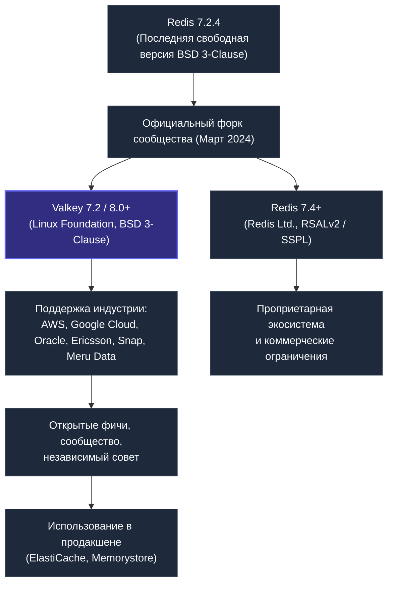

# Valkey: рождение открытого форка Redis, архитектура и миграция в Go

## Введение

В марте 2024 года мир in-memory хранилищ данных пережил тектонический сдвиг. Компания Redis Ltd., стоявшая за разработкой самой популярной key-value базы в мире, объявила о кардинальной смене лицензионной модели: начиная с версии Redis 7.4 исходный код перестал распространяться под классической свободной лицензией BSD и перешел на двойную проприетарную схему RSALv2 / SSPL (Server Side Public License).

Для индустрии облачных провайдеров, дистрибутивов Linux и всего глобального open-source сообщества это решение стало сигналом тревоги. В считанные дни под эгидой некоммерческой организации Linux Foundation родился проект **Valkey** — прямой форк кодовой базы Redis, переданный под независимое открытое управление при поддержке AWS, Google Cloud, Oracle, Ericsson, Snap и других гигантов индустрии.

Valkey — это не очередной любительский форк. Это полноценная, индустриальная замена Redis, сохраняющая 100% обратную совместимость по сетевому протоколу RESP, набору команд и клиентской экосистеме, но распространяемая под истинно свободной лицензией BSD 3-Clause.

Для Go-разработчика, чьи сервисы опираются на Redis, понимание Valkey жизненно необходимо для осознанного проектирования инфраструктуры без лицензионных и эксплуатационных рисков.

---

## История и предпосылки: почему Redis перестал быть «открытым»

Redis изначально создавался итальянским инженером Сальваторе Санфилиппо (Salvatore Sanfilippo, известным как antirez) как чистый BSD-лицензированный open-source проект. В 2020 году antirez отошел от активного руководства разработкой, и контроль над репозиторием полностью перешел к коммерческой компании Redis Ltd.

Компания постепенно усиливала давление на экосистему:
- Сначала внешние модули (RedisJSON, RediSearch, RedisGraph, объединенные в Redis Stack) были переведены на лицензию RSAL.
- Затем, 20 марта 2024 года, было объявлено, что ядро Redis начиная с релиза 7.4 больше не является открытым ПО по стандартам OSI (Open Source Initiative) и переводится под лицензии RSALv2 и SSPL v1.

**Последствия для индустрии оказались катастрофическими:**
- **Облачные провайдеры:** Сервисы вроде Amazon ElastiCache и Google Cloud Memorystore оказались перед реальной угрозой юридических преследований или необходимости отчислять колоссальные лицензионные роялти.
- **Дистрибутивы Linux:** Сообщества Debian, Fedora, Red Hat и Ubuntu заявили о невозможности включения версий Redis 7.4+ в официальные репозитории свободного ПО.
- **Внешние контрибьюторы:** Независимые инженеры потеряли мотивацию вкладывать свои силы в проект, контролируемый одной корпорацией.

28 марта 2024 года Linux Foundation официально анонсировала создание Valkey на основе последней свободной версии **Redis 7.2.4**. В совет проекта вошли ведущие разработчики, долгие годы контрибьютившие в ядро Redis, а также представители AWS, Google Cloud, Oracle и Ericsson.



---

## Архитектура и совместимость

Valkey унаследовал архитектурный фундамент Redis 7.2 в мельчайших деталях:
- Однопоточный event loop для непосредственного исполнения команд над данными.
- Многопоточный ввод-вывод (I/O threads) для вычитывания сокетов и сериализации ответов.
- Все фундаментальные структуры данных в оперативной памяти: строки (SDS), списки (listpack/quicklist), хэши, множества (intset), упорядоченные множества (skiplist + dict) и потоки (streams на radix tree).
- Модель G-M-P внутри сервера (в контексте потоков — main thread + I/O threads), jemalloc-аллокатор, RDB и AOF персистентность.
- Все внутренние механизмы, которые мы разобрали в [[4. Redis под капотом]], актуальны для Valkey без изменений.

**Полная бинарная и протокольная совместимость:**
- **Сетевой протокол RESP (RESP2 и RESP3):** полностью сохранен без малейших изменений.
- **Набор команд:** все команды Redis 7.2 поддерживаются с идентичной семантикой.
- **Конфигурация:** формат файлов `redis.conf` (или `valkey.conf`) и синтаксис команд `CONFIG SET/GET` полностью взаимозаменяемы.
- **Клиентские библиотеки:** любые существующие драйверы для Redis работают с Valkey «из коробки».

Для Go-разработчика это означает ключевой вывод: **весь существующий код, использующий `go-redis/v9` или `rueidis`, будет работать с Valkey без малейших правок.** Достаточно изменить адрес подключения на Valkey-инстанс.

```go
package main

import (
	"context"
	"fmt"
	"log"
	"time"

	"github.com/redis/go-redis/v9"
)

func main() {
	ctx := context.Background()

	// Этот код работает как с Redis, так и с Valkey без единой модификации логики
	rdb := redis.NewClient(&redis.Options{
		Addr:         "valkey-host:6379",
		Password:     "", // если задан пароль
		DB:           0,
		PoolSize:     50,
		MinIdleConns: 10,
	})
	defer rdb.Close()

	// Проверяем соединение
	pong, err := rdb.Ping(ctx).Result()
	if err != nil {
		log.Fatalf("Ошибка подключения к Valkey: %v", err)
	}
	fmt.Printf("Успешное подключение к Valkey! PING -> %s\n", pong)

	// Стандартные операции со структурами данных
	err = rdb.Set(ctx, "framework:name", "Valkey", 10*time.Minute).Err()
	if err != nil {
		log.Fatalf("SET failed: %v", err)
	}

	val, _ := rdb.Get(ctx, "framework:name").Result()
	fmt.Printf("Получено значение из Valkey: %s\n", val)
}
```

---

## Ключевые улучшения и планы

Хотя Valkey начался как идентичный форк, его независимость позволила сообществу быстро вносить изменения, которые давно ждали, но не могли пройти через бюрократию Redis Ltd.

### Уже реализованные улучшения (на момент 2024-2025)
- **Ускорение репликации:** оптимизация передачи RDB-файлов и первичной синхронизации, снижение latency при полном ресинхронизации.
- **Улучшенные сжатие и производительность:** ряд исправлений в SDS и парсере RESP.
- **Улучшенная работа с памятью:** более агрессивный возврат памяти ОС через `jemalloc` при снижении объёма данных.
- **IPv6 и TLS:** полноценная поддержка современных сетевых стеков, включая mTLS для клиент-серверного взаимодействия и межузлового общения в кластере.

### В планах (Roadmap)
- **Многопоточная обработка команд:** эксперименты с настоящим многопоточным выполнением, не только I/O. Это потребует переосмысления модели атомарности, но сулит кратное увеличение throughput на многоядерных машинах.
- **Улучшенное кластерное перебалансирование:** автоматическое перераспределение слотов с минимальным прерыванием обслуживания.
- **Новый протокол дискового хранения:** собственный движок для tiered storage (данные, вытесняемые на SSD).
- **Расширенные структуры данных:** поисковые индексы и JSON с открытой лицензией.

С точки зрения Mechanical Sympathy, Valkey продолжает философию Redis: держать данные в памяти, минимизировать системные вызовы, опираться на эффективный аллокатор, но открытость позволяет внедрять оптимизации уровня ядра свободнее.

---

## Valkey и экосистема Go

Для Go-экосистемы Valkey — это бесшовная замена. Библиотеки `go-redis`, `rueidis`, `redigo` уже добавили поддержку Valkey-специфичных команд (по мере их появления) или просто воспринимают Valkey как Redis 7.2. Клиенты знают, как общаться с кластером Valkey, Sentinel и репликами.

> [!tip] Собеседование
> **Вопрос:** Нужно ли менять код на Go при миграции с Redis на Valkey?
> **Ответ:** Нет, если вы используете стандартные клиенты. Valkey полностью совместим по протоколу RESP. Однако при использовании модулей Redis Stack (RedisJSON, RediSearch) может потребоваться проверка: Valkey предоставляет собственные открытые реализации или совместимые обёртки. Также стоит следить за анонсами новых команд Valkey, которые могут улучшить производительность ваших паттернов (например, `ZRANGESTORE BYLEX` и т.п.).

---

## Сравнение с Redis и Memcached

| Характеристика | Valkey | Redis (7.4+) | Memcached |
|---|---|---|---|
| **Лицензия** | BSD 3-Clause (истинно открытая) | RSALv2 / SSPL (проприетарная) | BSD |
| **Модель управления** | Linux Foundation, открытый комитет | Redis Ltd. (единолично) | Сообщество (Dormando) |
| **Сетевой протокол** | RESP, совместим с Redis 7.2 | RESP | Текстовый / бинарный |
| **Структуры данных** | Все Redis 7.2 + новые | Все, но модули могут быть платными | Только строки |
| **Персистентность** | RDB, AOF | RDB, AOF | Нет |
| **Репликация / Кластер** | Да, улучшается | Да, но часть enterprise | Нет |
| **Многопоточность** | I/O threads (главный поток один) | I/O threads (главный поток один) | Полная многопоточность |
| **Для Go-разработчика** | Полная совместимость с go-redis | Совместимость, но риск лицензии | Подходит для простого кэша |

> [!warning] Ловушка / Gotcha
> **Лицензионная ловушка Redis.** Если ваша компания использует Redis в облачном сервисе, предоставляемом клиентам (SaaS), версии Redis 7.4+ под SSPL могут потребовать открытия исходного кода вашего сервиса. Valkey свободен от этих ограничений. Для стартапов и крупных провайдеров это решающий фактор. Однако учтите: если вы уже завязаны на проприетарные модули Redis Stack, переход на Valkey потребует замены их на открытые аналоги.

---

## Mechanical Sympathy: Valkey под капотом и Go

С точки зрения работы на уровне железа Valkey не меняет основ Redis: данные в RAM, хеш-таблица с инкрементальным рехэшем, jemalloc, event loop на epoll. Однако независимое развитие позволяет сообществу реагировать на проблемы быстрее. Например, исправления, касающиеся уменьшения числа копирований памяти при записи в сокет или оптимизации парсинга RESP, напрямую снижают нагрузку на CPU в Go-сервисах, делающих миллионы `GET` в секунду.

Рассмотрим физический профиль: Valkey-инстанс на 32-ядерном сервере обрабатывает 1.2 млн RPS. Go-сервис с пулом из 100 горутин шлёт запросы на Valkey. Благодаря тому, что Valkey теперь активно использует `SO_REUSEPORT` с несколькими event loop'ами (в экспериментальных сборках), он может масштабироваться на ядра лучше, чем классический Redis. Это означает, что при пиковой нагрузке вам может понадобиться меньше инстансов Valkey, чем Redis, для обслуживания того же трафика, экономя сетевые обмены и память.

---

## Итог

Valkey — это не просто вынужденный форк, а стратегический шаг сообщества к сохранению действительно открытого in-memory хранилища. Для Go-разработчика это означает:
- Нулевые изменения кода при переходе с Redis.
- Гарантию долгосрочной BSD-совместимости.
- Более быстрый цикл инноваций и исправлений, особенно в области производительности и безопасности.

Valkey уже используется в Amazon ElastiCache и Google Cloud Memorystore, что доказывает его enterprise-готовность. Если вы проектируете новые сервисы на Go или планируете миграцию, Valkey — это осознанный выбор в пользу открытости и управляемости.

На этом мы завершаем обзор ключевых игроков в мире key-value хранилищ. Впереди — совершенно иной подход к хранению данных, где мы отказываемся от плоских значений и переходим к работе с богатыми документами. Следующая статья: [[7. Document базы. MongoDB]]