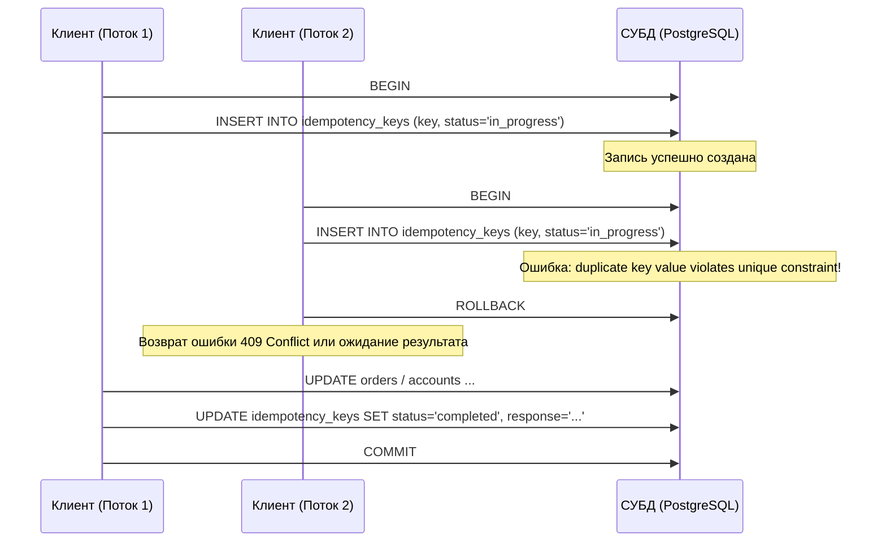

## 1. Что такое идемпотентность (в контексте БД)

Представьте кнопку вызова лифта на этаже. Вы подходите и нажимаете кнопку — она загорается мягким желтым светом, а реле на чердаке отправляет кабину к вам. Если вы от нетерпения нажмете на эту же кнопку еще десять раз подряд, десять лифтов не приедут одновременно, а трос не натянется в десять раз сильнее. Система перешла в состояние «вызов принят» при первом нажатии, а все последующие нажатия не породили никаких побочных эффектов. Это и есть физическая суть идемпотентности.

**Идемпотентность** — это фундаментальное математическое и архитектурное свойство операции: повторный вызов с теми же входными аргументами дает тот же результат и не приводит к дополнительным изменениям состояния системы.

В терминах реляционных и NoSQL баз данных это означает:
*   Несколько повторных вызовов `INSERT/UPDATE/DELETE` с одинаковыми параметрами эквивалентны ровно одному успешному выполнению;
*   Повторная обработка одного и того же сетевого запроса или брокерского сообщения не разрушает консистентность данных и не нарушает бизнес-инварианты.

В протоколе HTTP методы `GET`, `HEAD`, `PUT`, `DELETE` и `OPTIONS` по спецификации обязаны быть идемпотентными. Методы `POST` и `PATCH` по умолчанию **не идемпотентны**. Поэтому именно эндпоинты создания заказов, списания платежей и перевода средств разработчик обязан делать идемпотентными вручную на уровне приложения и СУБД.

> [!info] Под капотом
> В распределенных системах повторная доставка сетевых пакетов и сообщений — это не форс-мажор, а базовое свойство среды (at-least-once доставка). Сетевой сбой между клиентом и сервером оставляет клиента в неведении: выполнилась ли транзакция на сервере перед тем, как оборвался TCP-сокет? Единственный способ сделать повтор безопасным — заложить идемпотентность на уровне схемы базы данных.

---

## 2. Где идемпотентность критична для БД

Типовые сценарии в реальном продакшене:
*   **Платежные шлюзы и процессинг**: повторный `POST /payments` при сетевом таймауте не должен списывать деньги с банковской карты клиента дважды.
*   **Оформление заказов в E-commerce**: случайный двойной клик пользователя по кнопке «Оформить заказ» не должен создавать два одинаковых заказа на складе.
*   **Асинхронная обработка сообщений (Kafka, RabbitMQ, NATS)**: брокер гарантирует доставку `at-least-once`, то есть при ребалансировке партиций или сбое коммита смещения воркер получит одно и то же сообщение повторно.
*   **Ретраи клиентских API и Service Mesh**: Envoy, Istio или HTTP-клиенты на Go с включенным exponential backoff автоматически повторяют неудавшиеся запросы.

В распределённых системах повторы неизбежны. Идемпотентность — единственный надежный способ получить **семантику «точно один раз» по эффекту (effectively once)**, даже если физический запрос или сообщение пришли десять раз.

---

## 3. Идемпотентность на уровне операций БД

### 3.1. Идемпотентные SQL-операции

Сравним две на первый взгляд похожие операции модификации данных:

*   `UPDATE accounts SET balance = balance - 100 WHERE id = 1` — **не идемпотентно**: каждый повторный запуск скрипта списывает очередные 100 единиц со счета.
*   `UPDATE accounts SET balance = 900 WHERE id = 1` — **идемпотентно**: сколько бы раз запрос ни выполнялся, баланс останется равным 900.

Для операций вставки `INSERT` идемпотентность обеспечивается тремя механизмами:
1.  Уникальные ограничения таблицы (unique constraints, первичные ключи);
2.  Атомарные Upsert-операции (`INSERT … ON CONFLICT … DO UPDATE`, `MERGE`);
3.  Перехват и штатная обработка ошибок нарушения уникальности (duplicate key error).

### 3.2. Использование уникальных ограничений

Классический паттерн защиты от дубликатов на уровне реляционной модели:
1. В таблице бизнес-сущности создается уникальный индекс по естественному или синтетическому ключу (например, `order_number` или `transaction_id`).
2. При `INSERT` СУБД проверяет наличие ключа в B-дереве уникального индекса.
3. При конфликте дубликат либо игнорируется, либо возвращает существующую запись.

Пример для MySQL (`ON DUPLICATE KEY UPDATE`):
```sql
INSERT INTO orders (order_number, user_id, amount)
VALUES ('ORD-123', 42, 100.00)
ON DUPLICATE KEY UPDATE order_number = order_number; -- no-op, просто игнорируем повтор
```

Пример для PostgreSQL (`ON CONFLICT DO NOTHING`):
```sql
INSERT INTO orders (order_number, user_id, amount)
VALUES ('ORD-123', 42, 100.00)
ON CONFLICT (order_number) DO NOTHING;
```

> [!tip] Собеседование
> **Вопрос:** В чем разница между проверкой `SELECT` перед `INSERT` и использованием уникального ограничения `UNIQUE`?  
> **Ответ:** Проверка вида «сначала проверь через `SELECT`, а если нет — делай `INSERT`» подвержена состоянию гонки (Time-of-Check to Time-of-Use, TOCTOU). Две параллельные горутины могут одновременно выполнить `SELECT`, увидеть, что записи нет, и обе попытаются вставить данные. Только уникальный индекс на уровне СУБД гарантирует атомарность на уровне страниц B-дерева и блокировок строк.

### 3.3. Идемпотентность через транзакции

Для сложных бизнес-сценариев (изменение баланса, создание заказа, отправка нотификации) требуется строгая транзакционная граница:
*   Все изменения выполняются **внутри одной ACID-транзакции**;
*   Внутри транзакции сохраняется и проверяется уникальный ключ операции;
*   При любой ошибке или конфликте транзакция откатывается через `ROLLBACK`, не оставляя частичных изменений.

---

## 4. Паттерн Idempotency Key и таблица запросов

### 4.1. Общая идея

Клиент генерирует уникальный идентификатор операции — **Idempotency-Key** (обычно `UUIDv4`) — и передает его в HTTP-заголовке `Idempotency-Key` или в метаданных gRPC-вызова.

Сервер выполняет следующий алгоритм:
1. Проверяет в таблице ключей идемпотентности, обрабатывался ли ранее запрос с таким ключом.
2. Если ключ найден и обработка завершена — сервер возвращает сохраненный кэшированный ответ без повторного выполнения бизнес-логики.
3. Если ключ не найден — сервер открывает транзакцию, регистрирует ключ, выполняет операцию, сохраняет результат и фиксирует транзакцию.

Этот паттерн стандартизирован IETF и используется передовыми финансовыми API, такими как Stripe, Adyen и PayPal.

### 4.2. Архитектура с БД

```mermaid
flowchart LR
    classDef process  fill:#1e293b,stroke:#38bdf8,stroke-width:1px,color:#f8fafc
    classDef success  fill:#064e3b,stroke:#34d399,stroke-width:1px,color:#f8fafc
    classDef error    fill:#7f1d1d,stroke:#f87171,stroke-width:1px,color:#f8fafc
    classDef warning  fill:#78350f,stroke:#fbbf24,stroke-width:1px,color:#f8fafc
    classDef entry    fill:#1e3a5f,stroke:#38bdf8,stroke-width:2px,color:#f8fafc
    classDef aux      fill:#334155,stroke:#64748b,stroke-width:1px,color:#f8fafc
    classDef system   fill:#312e81,stroke:#a78bfa,stroke-width:1px,color:#f8fafc
    classDef data     fill:#132d29,stroke:#2dd4bf,stroke-width:1px,color:#f8fafc
    classDef network  fill:#881337,stroke:#fb7185,stroke-width:1px,color:#f8fafc
    classDef accent   fill:#1e1b4b,stroke:#818cf8,stroke-width:1px,color:#f8fafc
  A["Client"]:::entry -->|"POST /pay<br>Idempotency-Key: UUID"| B["API Gateway"]
  B --> C["DB: check idempotency_key"]
  C -->|"found"| D["Return saved response"]
  C -->|"not found"| E["Start transaction"]
  E --> F["Insert idempotency_key + request_hash"]
  F --> G["Business logic: INSERT/UPDATE"]
  G --> H["Commit transaction"]
  H --> I["Return response"]
```



**Таблица идемпотентности (пример производственной структуры PostgreSQL):**

```sql
CREATE TABLE idempotency_keys (
  id            BIGSERIAL PRIMARY KEY,
  key           VARCHAR(255) NOT NULL UNIQUE,
  user_id       BIGINT NOT NULL,
  request_hash  VARCHAR(64) NOT NULL,     -- SHA-256 хеш от тела запроса для защиты от коллизий
  response      JSONB,                    -- сохраненный сериализованный ответ клиенту
  created_at    TIMESTAMPTZ NOT NULL DEFAULT now(),
  expires_at    TIMESTAMPTZ               -- опциональный TTL (например, 24 часа)
);
```

Ключевые инженерные аспекты:
*   Колонка `key` защищена ограничением `UNIQUE` — конкурентная вторая вставка немедленно завершится ошибкой дублирования.
*   Поле `request_hash` проверяет, что клиент не отправил под тем же ключом совершенно другие параметры запроса (защита от багов клиента).
*   Поле `response` хранит точный HTTP-статус и тело ответа, что позволяет повторить ответ байт-в-байт.

### 4.3. Конкурентные запросы с одним ключом

Что происходит, если два одинаковых запроса с одним ключом приходят с интервалом в 1 миллисекунду?



Важно: **INSERT ключа и выполнение бизнес-операции должны быть объединены в единую транзакцию**, чтобы ни один сбой сервера не оставил ключ в «подвешенном» состоянии без реальных данных.

> [!warning] Ловушка / Gotcha
> **Гонка конкурентных дубликатов (Concurrent Double-Click)**  
> Если два запроса пришли одновременно, наивная реализация без статуса `in_progress` может попытаться прочитать кэшированный ответ из таблицы до того, как первая транзакция успела его туда записать.  
> **Решение:** Первая транзакция захватывает ключ со статусом `processing`. Второй запрос видит статус `processing` и возвращает клиенту HTTP `409 Conflict` с рекомендацией подождать (`Retry-After: 1`), либо ожидает освобождения строки через `SELECT ... FOR UPDATE`.

---

## 5. Idempotent Consumer (сообщения, Kafka, RabbitMQ)

Для асинхронных потребителей событий применяется паттерн **Idempotent Consumer** (или Transactional Inbox):

*   В базе данных создается таблица `processed_messages` (или `inbox`), хранящая уникальные идентификаторы сообщений брокера.
*   Внутри одной транзакции:
    1. Вставляется `message_id` в `processed_messages`;
    2. Обновляются доменные бизнес-таблицы.
*   Первичный ключ по `message_id` гарантирует, что повторная доставка того же сообщения завершится откатом транзакции.

```sql
CREATE TABLE processed_messages (
  message_id    VARCHAR(255) PRIMARY KEY,
  processed_at  TIMESTAMPTZ NOT NULL DEFAULT now()
);
```

Обработчик воркера:

```sql
BEGIN;
  INSERT INTO processed_messages (message_id, processed_at)
  VALUES ('msg-123', now());
  
  -- Бизнес-логика: update accounts, create orders и т.д.
  UPDATE accounts SET balance = balance + 500 WHERE id = 42;
COMMIT;
```

При повторной доставке сообщения с `message_id = 'msg-123'` попытка вставки вызовет нарушение первичного ключа, транзакция мгновенно откатится, а баланс останется неизменным.

---

## 6. Практические рекомендации по проектированию

### 6.1. Когда идемпотентность обязательна
*   Любые **финансовые операции** (списания, пополнения, холдирование средств).
*   Операции с **внешними сайд-эффектами** (отправка писем, SMS, фискализация чеков).
*   Создание бизнес-ресурсов, где появление дублей критично (учетные записи, заказы, счета).
*   Все обработчики сообщений из очередей и брокеров (Kafka, RabbitMQ).

### 6.2. Как проектировать API и БД
1.  **Вводите заголовок `Idempotency-Key` для всех критичных мутирующих запросов**:
    *   Генерация надежного UUIDv4 на стороне клиента.
    *   Хранение в БД с уникальным индексом.
    *   Проверка хэша тела запроса (`request_hash`) и кэширование готового ответа.
2.  **Создавайте уникальные ограничения на естественные ключи**:
    *   `order_number`, `transaction_id`, `external_ref`, `payment_intent_id`.
    *   Это первый и самый надежный рубеж обороны.
3.  **Используйте атомарные операции Upsert**:
    *   `INSERT … ON CONFLICT … DO UPDATE` в PostgreSQL;
    *   `INSERT … ON DUPLICATE KEY UPDATE` в MySQL;
    *   `MERGE` в Oracle и MS SQL.
4.  **Связывайте ключ и операцию в единую транзакцию**:
    *   Запись ключа, бизнес-модификации и фиксация должны быть неделимы.
5.  **Настраивайте TTL для таблицы ключей идемпотентности**:
    *   Ключи не должны копиться вечно; фоновый воркер или секционирование по дням удаляет ключи старше 24–72 часов.

---

## 7. Пример: идемпотентное создание заказа (PostgreSQL)

Рассмотрим комплексный пример на уровне схемы и логики приложения:

```sql
CREATE TABLE orders (
  id           BIGSERIAL PRIMARY KEY,
  order_number VARCHAR(255) NOT NULL UNIQUE,
  user_id      BIGINT NOT NULL,
  amount       NUMERIC(10,2) NOT NULL,
  created_at   TIMESTAMPTZ NOT NULL DEFAULT now()
);

CREATE TABLE idempotency_keys (
  id            BIGSERIAL PRIMARY KEY,
  key           VARCHAR(255) NOT NULL UNIQUE,
  order_id      BIGINT,
  request_hash  VARCHAR(64),
  response      JSONB,
  created_at    TIMESTAMPTZ NOT NULL DEFAULT now(),
  expires_at    TIMESTAMPTZ
);
```

Транзакционная логика обработки на стороне сервера:

```sql
BEGIN;

  -- 1. Регистрируем idempotency key и проверяем уникальность
  INSERT INTO idempotency_keys (key, request_hash, created_at)
  VALUES ('uuid-abc-123', 'hash-of-body', now())
  RETURNING id INTO _key_id;

  -- 2. Создаем бизнес-сущность заказа
  INSERT INTO orders (order_number, user_id, amount, created_at)
  VALUES ('ORD-123', 42, 100.00, now())
  RETURNING id INTO _order_id;

  -- 3. Связываем ключ с созданным заказом и сохраняем JSON-ответ
  UPDATE idempotency_keys
  SET order_id = _order_id,
      response = jsonb_build_object('order_id', _order_id, 'status', 'created')
  WHERE id = _key_id;

COMMIT;
```

При повторном вызове с тем же ключом:
*   Шаг 1 падает с ошибкой `duplicate key value violates unique constraint "idempotency_keys_key_key"`;
*   Обработчик перехватывает ошибку, выполняет `SELECT response FROM idempotency_keys WHERE key = 'uuid-abc-123'` и сразу отдает клиенту сохраненный ответ `{"order_id": ..., "status": "created"}` с кодом HTTP 200 OK.

---

## 8. Связь с CAP и распределёнными системами

В распределённых системах идемпотентность — один из главных инструментов парирования сетевой нестабильности:
*   Безопасное выполнение автоматических ретраев при сетевых таймаутах;
*   Нейтрализация дубликатов при доставке сообщений брокерами;
*   Корректное восстановление бизнес-процессов после аварийных перезапусков микросервисов.

Идемпотентность не устраняет фундаментальные компромиссы теоремы CAP, но переводит неизбежные сетевые повторы из категории катастрофических аварий в штатный режим работы.

В следующей статье мы перейдем к методам масштабирования базы данных, когда поток транзакций превышает физические возможности одного сервера: [[13. Highload базы данных]].
