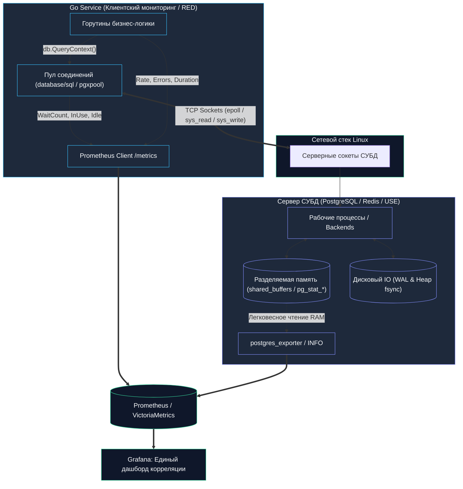
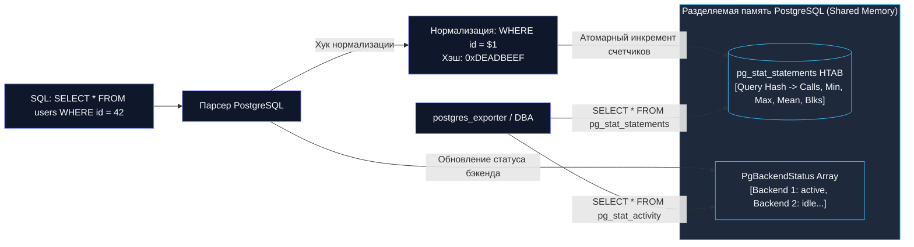
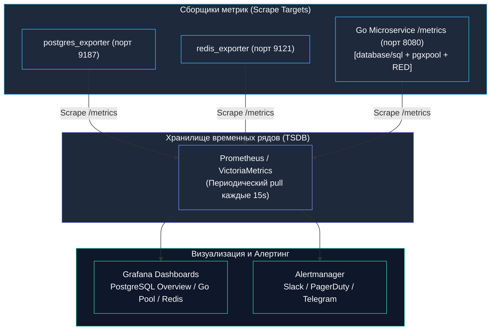

## Введение

Представьте себе пилота современного сверхзвукового лайнера, который решает вести машину вслепую, заклеив все приборы черной изолентой: «Двигатели же гудят, значит, летим нормально!». В программировании мы порой ведем себя точно так же: спроектировав идеальную схему данных, тщательно расставив составные индексы ([[10. План выполнения запроса. EXPLAIN]]) и выстроив многоуровневое кэширование ([[7. Кэширование поверх БД]]), мы наивно полагаем, что система будет работать безупречно вечно. Но однажды в пятницу вечером продакшен внезапно замирает, время отклика подскакивает до десятков секунд, а служба поддержки обрывает чаты. Без качественной телеметрии база данных превращается в абсолютно непроницаемый «черный ящик».

Мониторинг — это органы чувств и диагностическая карта нашей системы. Он трансформирует непредсказуемый «черный ящик» в прозрачную, детерминированную механическую конструкцию.

В отличие от всеобъемлющей концепции Observability ([[19. Observability БД]]), которая включает в себя распределенную трассировку и структурные логи, мониторинг фокусируется на непрерывном измерении **метрик** — числовых временных рядов (Time Series). Они позволяют строить наглядные дашборды, заблаговременно предсказывать насыщение дисков и памяти, а главное — предупреждать инженера о деградации задолго до того, как пострадают реальные пользователи.

Для Go-разработчика, чей сервис тесно связан с хранилищем через стандартный пакет `database/sql` ([[1. Работа с БД в Go. database_sql]]), драйвер `pgx` или клиент `go-redis`, мониторинг обязан быть двусторонним. Мы должны видеть картину как со стороны сервера СУБД (дисковый ввод-вывод, разделяемая память, блокировки), так и со стороны клиентского приложения (состояние пула соединений, задержки сетевых вызовов, очереди ожидания горутин).

В этой главе мы разберем:
- **Что** именно измерять в реляционных, in-memory и распределенных колоночных СУБД с точки зрения методологий USE и RED.
- **Как** Go-драйверы собирают и отдают внутреннюю статистику пулов.
- **Почему** некорректно организованный мониторинг способен положить высоконагруженную базу данных быстрее, чем реальные клиентские запросы.



---

## Ключевые метрики: USE и RED для баз данных

В инженерной практике выработались два фундаментальных и взаимодополняющих подхода к измерению здоровья информационных систем:

1. **USE (Utilization, Saturation, Errors)** — подход Брендана Грегга, оценивающий систему со стороны **ресурсов** (сервера СУБД и аппаратного обеспечения):
   - **Utilization (Утилизация):** процент времени или емкости, в течение которого ресурс был занят полезной работой (загрузка ядер CPU, процент занятости диска, заполнение пула памяти).
   - **Saturation (Насыщение):** объем отложенной работы, скопившейся в очередях, когда ресурс исчерпан (очередь к диску `await`, длина очереди процессов ОС, количество запросов, ожидающих освобождения локов).
   - **Errors (Ошибки):** количество аппаратных или системных сбоев (ошибки контроллера, разрывы сетевых пакетов, исчерпание дескрипторов).

2. **RED (Rate, Errors, Duration)** — подход Тома Уилки, ориентированный на пользовательский опыт со стороны **сервиса** (клиентского приложения):
   - **Rate (Частота):** количество входящих или исходящих запросов в секунду (QPS / TPS).
   - **Errors (Ошибки):** количество или процент неуспешных операций (HTTP 5xx, SQL connection refused, transaction deadlock).
   - **Duration (Длительность):** распределение задержек выполнения запросов (Latency: медиана p50, строгие перцентили p95, p99, p99.9).

Обе группы метрик неразделимы. Если вы фиксируете резкий рост задержек (Duration) в Go-сервисе, но не отслеживаете насыщение дисковой подсистемы (Saturation) на СУБД, вы потратите часы на бессмысленный рефакторинг Go-кода, не заметив, что дисковый массив SSD исчерпал лимит IOPS и захлебнулся в очередях записи. Напротив, видя ошибки на стороне приложения, но не сопоставляя их со счетчиком `too many connections` в СУБД, вы никогда не поймете истинную причину отказа.

### Реляционные БД (PostgreSQL / MySQL)

Реляционные базы данных — сложные механизмы с многоуровневым кэшированием и жесткими гарантиями ACID. Вот минимальный инженерный базис метрик, без которого вывод сервиса в промышленную эксплуатацию сродни русской рулетке:

- **Количество активных сессий / соединений** и их внутреннее состояние: `active` (выполняет запрос прямо сейчас), `idle` (ждет команду клиента), `idle in transaction` (транзакция открыта, но клиент бездействует, удерживая MVCC-снимок и блокировки!), `waiting` (сессия заблокирована в ожидании диска или другого процесса). В PostgreSQL это агрегируется из `pg_stat_activity`. Это ключевой индикатор насыщенности (saturation) пула соединений.
- **Количество транзакций в секунду (TPS)** с обязательным разделением на подтвержденные (`xact_commit`) и откатившиеся (`xact_rollback`). Внезапный всплеск rollback сигнализирует о логических ошибках приложения или серии дедлоков.
- **Среднее и перцентили времени выполнения запросов**. Сам по себе TPS слеп: 10 000 TPS — это триумф, если задержка составляет 0.5 мс, но катастрофа, если время отклика подскакивает до 800 мс.
- **Загрузка процессора, памяти и диска** хоста: `user`, `system`, `iowait`. В облачных инстансах (AWS RDS, GCP Cloud SQL) — критично отслеживать `credit consumption` (исчерпание CPU/IOPS Burst Credits). Высокий `iowait` — верный признак дискового узкого горлышка.
- **Попадания в кэш (cache hit ratio)**: рассчитывается по формуле `blks_hit / (blks_hit + blks_read)`. Для OLTP-нагрузок значение ниже 99% — сигнал тревоги. Это означает, что «горячие» рабочие данные не помещаются в `shared_buffers` и ядру СУБД приходится непрерывно вычитывать страницы с диска.
- **Checkpoint и WAL-активность**: частота контрольных точек (по таймеру или по объему), объем генерируемых журналов упреждающей записи WAL в секунду. Внезапный скачок генерации WAL указывает на массивные пакетные обновления либо неоптимальную конфигурацию фонового процесса Checkpointer ([[8. WAL. Write Ahead Log]]).
- **Блокировки и deadlock'и**: анализ системного представления `pg_locks`, счетчик `deadlocks` в `pg_stat_database`. Рост говорит о нарушении порядка захвата ресурсов в транзакционной бизнес-логике или об отсутствии жизненно важных индексов.
- **Конфликты репликации** (для читающих реплик): `pg_stat_database_conflicts` (ситуации, когда применение WAL с мастера отменяет долгие SELECT-запросы на реплике).
- **Размер базы и таблиц**, включая разрастание индексов (bloat) и TOAST-таблицы. Это позволяет предиктивно планировать емкость дисков за месяцы до аварии.

> [!info] Под капотом
> Мета-запросы к системным представлениям `pg_stat_*` и `pg_locks` не обращаются к файлам на диске. Это быстрые обертки на языке C над структурами разделяемой памяти (`shared memory`) сервера СУБД. При обращении к `pg_stat_activity` СУБД не делает тяжелых системных вызовов ядра ОС для инспекции процессов, а атомарно вычитывает готовый массив структур в оперативной памяти, что делает операцию исключительно дешевой. 
> 
> Однако расширение `pg_stat_statements` работает сложнее: оно перехватывает каждый выполненный SQL-запрос, выполняет его лексическую нормализацию (заменяя литералы на параметры `$1`, `$2`), рассчитывает 64-битный хэш запроса и инкрементирует счетчики в разделяемой хэш-таблице в RAM. Это требует микроскопических накладных расходов CPU, но окупается сторицей, предоставляя детальную статистику по каждому уникальному паттерну запросов.

### In-Memory (Redis / Valkey / Memcached)

В оперативных хранилищах данных оперативная память и процессорное время — главные лимитирующие факторы. Профиль мониторинга здесь кардинально иной:

- **Использование памяти**: `used_memory` (чистые данные), `used_memory_rss` (реально выделенная процессу память ОС), `mem_fragmentation_ratio` (`rss / used`). Коэффициент фрагментации выше 1.5 явно указывает на неэффективность системного аллокатора (`jemalloc`) или последствия интенсивного удаления разнородных ключей ([[4. Redis под капотом]]).
- **Количество ключей** и динамика вытеснения: счетчики `expired_keys` (удалены по TTL) и `evicted_keys` (выброшены принудительно по политике `maxmemory-policy`). Резкий рост `evicted_keys` означает, что кэш переполнен, аллокатор уперся в потолок, и база вынуждена вымывать нужные данные, вызывая кэш-промахи в бэкенде.
- **Количество подключений**: `connected_clients` и заблокированные клиенты `blocked_clients` (ожидающие команд `BLPOP`, `BRPOP`, `XREAD BLOCK`).
- **Latency**: прямое измерение задержек через утилиту `redis-cli --latency`, мониторинг встроенной статистики `commandstats` (p50, p99), а также активация внутреннего монитора задержек командой `LATENCY LATEST`.
- **Хиты и промахи**: соотношение `keyspace_hits / keyspace_misses`. Это фундаментальная метрика эффективности слоя кэширования.
- **Загрузка CPU**: классический Redis исполняет команды в однопоточном цикле событий (`event loop`). Поэтому если одно ядро CPU загружено на 100%, Redis уже парализован, хотя общий дашборд 16-ядерного сервера будет ложно рапортовать о «скромных 6% утилизации CPU». Мониторить нужно именно процессные метрики `used_cpu_sys` и `used_cpu_user`.
- **Сетевая активность**: пропускная способность сокетов `total_net_input_bytes` и `total_net_output_bytes`.

### Документные и колоночные (MongoDB, Cassandra)

Для распределенных горизонтально масштабируемых систем добавляется специфика кластерной координации:

- **MongoDB**: объем кэша движка хранения WiredTiger, количество промахов страниц (`page faults`), состояние очередей `tickets` (`read/write tickets` — системные семафоры, ограничивающие параллельные операции в движке), задержка репликации операций в журнале `oplog`, статус репликационных наборов (`replSetGetStatus`), миграция и балансировка чанков шардирования ([[14. Hot partition и skew]]).
- **Cassandra**: диагностика очередей потоков через `nodetool tpstats` (состояние пулов `MutationStage`, `ReadStage`), объем отложенных задач уплотнения (`compaction pending tasks`), распределение задержек чтения/записи (p99), дисковая нагрузка на каждый узел (`load`), статус фонового антиэнтропийного восстановления (`repair status`) ([[9. Column базы. Cassandra]]).

Общее золотое правило распределенных СУБД: **всегда собирать per-node метрики**. Если вы усредните показатели по 50 узлам Cassandra, вы гарантированно пропустите один единственный перегруженный узел (hot spot), пока он окончательно не откажет по OOM или дисковому таймауту.

---

## Как Go-приложение видит базу данных: метрики на стороне клиента

Ограничиваться метриками сервера базы данных — опасное заблуждение. Клиентское Go-приложение взаимодействует с СУБД не напрямую, а через сложнейшую многоуровневую абстракцию: пул сетевых соединений, буферы сокетов ОС, парсеры бинарных протоколов и планировщик горутин. Для вашего пользователя задержка запроса включает время ожидания свободного коннекта в пуле внутри Go-рантайма!

### database/sql.Stats

Стандартная библиотека Go предоставляет встроенный инструмент интроспекции пула соединений — метод `db.Stats()`, возвращающий структуру `sql.DBStats`:

```go
type DBStats struct {
    MaxOpenConnections int           // максимальный разрешенный лимит открытых соединений
    OpenConnections    int           // суммарное текущее количество установленных соединений
    InUse              int           // соединения, занятые выполнением запросов прямо сейчас
    Idle               int           // соединения, готовые к работе и ожидающие в пуле
    WaitCount          int64         // счетчик: сколько раз горутинам пришлось ждать освобождения соединения
    WaitDuration       time.Duration // суммарное время, проведенное горутинами в ожидании коннекта
    MaxIdleClosed      int64         // соединений закрыто из-за превышения MaxIdleConns
    MaxLifetimeClosed  int64         // соединений закрыто по истечении ConnMaxLifetime
}
```

Критические индикаторы деградации пула:
- **`WaitCount > 0` и непрерывно растет:** пул соединений полностью исчерпан! Горутины встают в очередь и блокируются. Это прямая причина деградации p99 latency вашего HTTP/gRPC API.
- **`WaitDuration` стремительно увеличивается:** время ожидания свободного коннекта начинает превышать сетевое время исполнения самого SQL-запроса. База данных либо не справляется с потоком транзакций, либо размер пула `SetMaxOpenConns` сконфигурирован слишком консервативно.
- **`OpenConnections` постоянно держится около `MaxOpenConnections`:** сервис балансирует на грани исчерпания пула при малейшем колебании входящего трафика.

Эти метрики необходимо экспортировать в Prometheus. Самый простой путь — через встроенный пакет `expvar` или официальный SDK `client_golang`:

```go
package telemetry

import (
	"database/sql"
	"time"

	"github.com/prometheus/client_golang/prometheus"
	"github.com/prometheus/client_golang/prometheus/promauto"
)

var (
	metricDBOpenConnections = promauto.NewGauge(prometheus.GaugeOpts{
		Name: "go_sql_db_open_connections",
		Help: "Текущее количество открытых TCP-соединений с базой данных.",
	})
	metricDBInUse = promauto.NewGauge(prometheus.GaugeOpts{
		Name: "go_sql_db_in_use_connections",
		Help: "Количество соединений, занятых обработкой запросов прямо сейчас.",
	})
	metricDBIdle = promauto.NewGauge(prometheus.GaugeOpts{
		Name: "go_sql_db_idle_connections",
		Help: "Количество свободных соединений, простаивающих в пуле.",
	})
	metricDBWaitCount = promauto.NewCounter(prometheus.CounterOpts{
		Name: "go_sql_db_wait_count_total",
		Help: "Суммарное количество блокировок горутин в ожидании свободного соединения.",
	})
	metricDBWaitDuration = promauto.NewCounter(prometheus.CounterOpts{
		Name: "go_sql_db_wait_duration_seconds_total",
		Help: "Суммарная длительность ожидания соединений горутинами в секундах.",
	})
)

// StartDBStatsCollector запускает периодический сбор телеметрии пула database/sql
func StartDBStatsCollector(db *sql.DB, interval time.Duration) {
	go func() {
		ticker := time.NewTicker(interval)
		defer ticker.Stop()

		var prevWaitCount int64
		var prevWaitDuration time.Duration

		for range ticker.C {
			stats := db.Stats()

			metricDBOpenConnections.Set(float64(stats.OpenConnections))
			metricDBInUse.Set(float64(stats.InUse))
			metricDBIdle.Set(float64(stats.Idle))

			// Prometheus Counter ожидает приращение (delta)
			deltaWaitCount := stats.WaitCount - prevWaitCount
			if deltaWaitCount > 0 {
				metricDBWaitCount.Add(float64(deltaWaitCount))
				prevWaitCount = stats.WaitCount
			}

			deltaWaitDuration := stats.WaitDuration - prevWaitDuration
			if deltaWaitDuration > 0 {
				metricDBWaitDuration.Add(deltaWaitDuration.Seconds())
				prevWaitDuration = stats.WaitDuration
			}
		}
	}()
}
```

### pgxpool.Stat

Специализированный драйвер `pgx` предоставляет через объект пула `*pgxpool.Pool` расширенную структуру `*pgxpool.Stat`:

```go
stat := pool.Stat()
// stat.TotalConns() — общее количество соединений
// stat.IdleConns() — простаивающие соединения
// stat.AcquiredConns() — занятые соединения
// stat.MaxConns() — максимальный лимит соединений
// stat.EmptyAcquireCount() — сколько раз acquire не нашел свободного коннекта и ожидал
// stat.AcquireDuration() — суммарное время ожидания соединений
// stat.AcquireCount() — общее количество захватов соединений
// stat.CanceledAcquireCount() — захваты, отмененные по таймауту контекста context.Canceled
```

Эти данные критически важны для тонкой настройки конфигурационных параметров `MaxConns`, `MinConns`, `MaxConnLifetime` и `HealthCheckPeriod`. Существуют готовые адаптеры (например, `github.com/jackc/pgx/v5/pgxpool/prometheus`), регистрирующие полноценные гистограммы времени захвата соединения.

### go-redis PoolStats

Для кэширующего слоя на базе библиотеки `go-redis` доступен метод `rdb.PoolStats()`:

```go
stats := rdb.PoolStats()
// stats.Hits — соединение взято из пула без создания нового
// stats.Misses — пустых слотов не было, пришлось создавать новый сокет
// stats.Timeouts — таймауты при попытке получить соединение
// stats.TotalConns — всего физических сокетов
// stats.IdleConns — сокетов в резерве
// stats.StaleConns — сокетов, закрытых по возрасту или ошибке
```

Здесь критически важно соотношение `Hits/Misses` — они показывают эффективность пула сетевых соединений на клиенте, но их ни в коем случае нельзя путать с бизнес-попаданиями в кэш самого движка (`keyspace_hits/misses`). Всплеск `Timeouts` — недвусмысленный маркер нехватки соединений в пуле либо заторов в сетевом оборудовании.

### Влияние на планировщик горутин и GC

Взглянем на происходящее с точки зрения аппаратной архитектуры и рантайма Go (Mechanical Sympathy). Вызов `db.Stats()` или `pool.Stat()` абсолютно безопасен: он сводится к атомарному чтению 64-битных регистров процессора или захвату короткого внутреннего мьютекса (`sync.Mutex`), защищающего служебные структуры драйвера. Это единицы процессорных тактов и ровно ноль динамических аллокаций памяти в куче (`heap`).

Однако накладные расходы могут возникнуть на следующем этапе — при отдаче метрик скрейперу Prometheus через HTTP-эндпоинт `/metrics`. Если сервис содержит тысячи метрик с десятками динамических меток (labels), сериализация текстового формата Prometheus порождает сотни временных слайсов байт и строк, создавая паразитное давление на сборщик мусора Go (Garbage Collector). Для высоконагруженных систем рекомендуется использовать буферизованные writer'ы и избегать создания временных строк в горячих путях генерации метрик.

Еще более коварен сценарий истощения пула (`WaitCount` растет). Когда пул пуст, а входящий поток запросов не снижается, вызов захвата коннекта переводит горутину в состояние ожидания через системный вызов рантайма `runtime.gopark`. Сама по себе спящая горутина не сжигает кванты процессорного времени в холостых циклах и не блокирует поток ядра ОС (`OS thread`). Но каждая заблокированная горутина удерживает свой стек (минимум 2–4 КБ) и контекст запроса с полезной нагрузкой. Если при лавине запросов 50 000 горутин повиснут в ожидании свободной сессии к СУБД, сервис легко потребит сотни мегабайт оперативной памяти только на поддержание стеков горутин, а последующее пробуждение всей этой очереди устроит чудовищный шторм планировщика (thundering herd problem).

---

## Под капотом: как БД предоставляют метрики без деградации

### PostgreSQL: pg_stat_activity и pg_stat_statements

Внутри PostgreSQL архитектурно реализован как пул изолированных процессов операционной системы (Fork-модель), координирующих свою работу через общий сегмент разделяемой памяти (`Shared Memory`).

Системное представление `pg_stat_activity` опирается на внутренний массив фиксированного размера `PgBackendStatus`, расположенный в разделяемой памяти. Каждый рабочий процесс (backend), принимая новую команду по протоколу или меняя фазу выполнения транзакции, обновляет собственную ячейку в этом массиве. Чтение `pg_stat_activity` внешним процессом не требует блокировки всей базы данных: считывающий бэкенд проходит по непрерывному массиву структур в ОЗУ, выполняя операцию на скорости процессорного кэша L1/L2.

Иначе обстоит дело с модулем `pg_stat_statements`. Это разделяемая библиотека, загружаемая при старте сервера через директиву `shared_preload_libraries`. Она перехватывает хук планировщика и исполнителя запросов `post_parse_analyze_hook`. Запрос парсится, его константы заменяются на позиционные параметры, генерируется хэш, после чего статистика (число вызовов, суммарное процессорное время, время чтения блоков, объем сгенерированного WAL) накапливается в разделяемой хэш-таблице `HTAB` в памяти.



Единственный подводный камень здесь — вызов процедуры `pg_stat_statements_reset()`. Он требует кратковременного эксклюзивного спинлока на всю разделяемую хэш-таблицу. Если таблица огромна, а частота транзакций составляет десятки тысяч в секунду, это может вызвать микро-задержки в выполнении основных пользовательских транзакций.

### Redis: INFO

Команда `INFO` в Redis формирует ответ, последовательно опрашивая внутренние структуры данных однопоточного ядра сервера (структуру `redisServer`). В большинстве разделов (`INFO STATS`, `INFO CLIENTS`) это сводится к простому форматированию значений счетчиков в текстовый протокол RESP. Это занимает ничтожные доли миллисекунды (порядка нескольких сотен тактов CPU).

Однако вызов команды `INFO` без параметров или опрос секции `INFO MEMORY` при многогигабайтной базе данных заставляет движок обращаться к функции `zmalloc_get_memory_size` и собирать статистику фрагментации у аллокатора `jemalloc`. На гигантских базах данных вызов `INFO ALL` каждую секунду от десятков независимых систем мониторинга создает паразитную нагрузку на единственный поток выполнения Redis. 
Рекомендация: в конфигурации скрейперов опрашивайте только целевые секции: `INFO STATS`, `INFO MEMORY`, `INFO CLIENTS`.

### Инструменты с открытым кодом: exporters

В современной инфраструктурной парадигме мониторинг баз данных опирается на проверенные временем экспортеры экосистемы Prometheus:
- **`postgres_exporter`** — подключается к СУБД как выделенный технический пользователь, с заданным интервалом вычитывает `pg_stat_database`, `pg_stat_activity`, `pg_stat_statements` и экспортирует метрики по протоколу HTTP.
- **`redis_exporter`** — выполняет периодический опрос `INFO`, `CLUSTER INFO`, `SLOWLOG` и метрик ключей.
- **`mongodb_exporter`** — опрашивает `serverStatus`, `replSetGetStatus` и внутреннюю телеметрию движка WiredTiger.
- **`cassandra_exporter`** — подключается через JMX к JVM-процессу Cassandra, собирая метрики очередей и уплотнения таблиц.

Вынесение мониторинга в отдельный процесс изолирует приложение от логики сбора инфраструктурных метрик. Однако для метрик пула соединений клиентской стороны Go-сервиса идеальным дополнением служат встроенные библиотеки, например `pgxprometheus` для драйвера `pgxpool`.

---

## Mechanical Sympathy: мониторинг и железо

С точки зрения операционной системы и кремния, мониторинг — это не абстрактное «наблюдение», а реальный процесс, конкурирующий за системные ресурсы хоста.

Представим, что мы опрашиваем `pg_stat_activity` или размер таблиц каждые 2 секунды. На уровне ОС Linux происходит следующая цепочка событий:
1. Сетевой сокет мониторинга сигнализирует о событии готовности через `epoll_wait`.
2. Ядро ОС передает управление процессу СУБД через переключение контекста (`context switch`), что сбрасывает часть инструкций и данных из процессорного кэша L1/L2.
3. Процесс выполняет системные вызовы `read()` и `write()` для обмена пакетами с экспортером.
4. Процессор тратит циклы на парсинг SQL-текста запроса мониторинга, проверку прав в системном каталоге и сериализацию ответа.

При грамотно настроенном интервале (например, раз в 15–30 секунд) накладные расходы составляют ничтожные доли процента CPU (< 0.1%). Но если неопытная команда настраивает опрос десятка сложных системных представлений с интервалом в 200–500 мс от пяти разных инстансов мониторинга, СУБД начинает тратить до 10–15% времени всех ядер исключительно на обслуживание телеметрии!

> [!warning] Ловушка / Gotcha
> Классическая ловушка начинающих инженеров — самодельный health-check или скрипт мониторинга, выполняющий запрос вида `SELECT COUNT(*) FROM some_table` (или `SELECT count(*) FROM orders WHERE status = 'PENDING'`) каждые 10 секунд. Если таблица большая и без индекса — это и есть дорогая операция, создающая постоянную дисковую нагрузку и вытесняющая полезные данные из page cache. Такой «мониторинг» превращается в беспощадный `Sequential Scan` (Seq Scan). Он бесконечно вычитывает гигабайты страниц с SSD в оперативную память, полностью вымывая из системного дискового кэша ядра Linux (`page cache`) и `shared_buffers` реальные рабочие данные пользователей. Прежде чем внедрить любой мониторинговый запрос, обязательно проверьте его стоимость с помощью `EXPLAIN (ANALYZE, BUFFERS)`!

---

## Практика: Prometheus и Grafana для Go-стека

Промышленный золотой стандарт телеметрии современного Go-стека строится на связке **Prometheus / VictoriaMetrics + Grafana**:



Стандартный продакшен-стек:
- **Сбор метрик:** postgres_exporter, redis_exporter, либо напрямую из Go-сервиса через `promhttp`.
- **Хранение:** Prometheus или VictoriaMetrics.
- **Визуализация:** Grafana с готовыми дашбордами (например, "PostgreSQL Overview", "Redis Dashboard for Prometheus").

### Типовой dashboard для PostgreSQL
Профессиональный дашборд PostgreSQL в Grafana обязательно структурируется по следующим панелям:
- **Transactions & Throughput:** График `xact_commit` и `xact_rollback` в разрезе баз данных (выявление всплеска откатов).
- **Latency Distribution:** Перцентили задержек выполнения запросов p50, p95, p99 на основе `pg_stat_statements`.
- **Cache Hit Ratio:** Доля попадания в буферный кэш (`blks_hit / (blks_hit + blks_read)`). Любое падение ниже 99% подсвечивается желтым/красным индикатором.
- **Write Activity & WAL:** Объем генерации WAL (`pg_wal_lsn_diff`), частота вызовов Checkpoint (по расписанию против экстренных по заполнению `max_wal_size`).
- **Connections Saturation:** Соотношение `active + idle in transaction` к системному пределу `max_connections`.
- **Locks & Deadlocks:** Количество сессий в состоянии блокировки (`pg_locks`), счетчик произошедших взаимных блокировок (`deadlocks`).

### Типовой dashboard для Redis
Дашборд оперативного кэша фокусируется на емкости и задержках:
- **Efficiency:** Соотношение `keyspace_hits` к `keyspace_misses` (Hit Rate в процентах).
- **Memory & Fragmentation:** Абсолютное потребление памяти `used_memory`, предел `maxmemory`, график коэффициента фрагментации `mem_fragmentation_ratio`.
- **Evictions & Expired:** График вытеснения ключей `evicted_keys` в секунду (сигнал о дефиците ОЗУ).
- **Clients & Connections:** Количество активных клиентов `connected_clients` и заблокированных горутин/клиентов `blocked_clients`.
- **Operations Throughput & Latency:** Количество операций в секунду по типам команд (GET, SET, ZADD), время выполнения команд из секции `commandstats`.

### Клиентская панель Go-сервиса
На дашборде самого Go-приложения рядом с графиками RPS и HTTP Latency обязательно размещаются метрики пула:
- `go_sql_stats_*` (wait count, in use, idle, open connections).
- `redis_conn_*` (hits, misses, timeouts).
- Латенси со стороны клиента: гистограммы длительности вызовов `db.ExecContext`, `db.QueryContext`.

Сведение клиентских и серверных графиков на одном временном отрезке позволяет за секунды локализовать корень проблемы: если сетевая задержка в Go выросла, а база данных рапортует о минимальной нагрузке — проблема кроется в сетевом оборудовании или нехватке соединений в локальном пуле приложения.

---

## Ловушки и вопросы с собеседований

> [!tip] Собеседование
> **Вопрос:** В часы пик P99 latency базы данных PostgreSQL подскочила с комфортных 10 мс до катастрофических 500 мс. При этом метрики TPS (Transactions Per Second) и загрузка CPU на сервере базы данных остались абсолютно неизменными. В чем может быть скрытая причина такого поведения и как ее диагностировать?
> 
> **Ответ:** Это классический паттерн скрытого насыщения (Saturation) без роста утилизации (Utilization). Возможные первопричины:
> 1. **Зависание сессий в статусе `idle in transaction`:** Одно из клиентских приложений открыло транзакцию и «заснуло» (например, пошло в сторонний HTTP API, удерживая открытую транзакцию). Это блокирует механизм очистки мусора VACUUM и удерживает эксклюзивные блокировки строк/таблиц. Запросы других клиентов выстраиваются в очередь ожидания.
> 2. **Исчерпание пула соединений на стороне Go-клиента:** Если лимит `SetMaxOpenConns` исчерпан, горутины тратят 490 мс на ожидание освобождения коннекта в очереди внутри Go-рантайма (`WaitCount` растет), тогда как сам запрос исполняется базой за прежние 10 мс.
> 3. **Деградация плана выполнения единичного запроса:** Из-за изменения объема данных планировщик переключился с `Index Scan` на `Seq Scan` для редкого, но тяжелого запроса ([[10. План выполнения запроса. EXPLAIN]]). Так как запрос выполняется редко, общий TPS и средняя загрузка CPU не изменились, но его выполнение тормозит транзакции, создавая всплеск P99.
> 4. **Дисковые микропаузы на контрольных точках (Checkpoint / fsync spikes):** При сбросе грязных буферов на диск подсистема хранения исчерпывает лимит IOPS, из-за чего системные вызовы `fsync` для фиксации WAL кратковременно блокируются ядром Linux.
> 5. **Конфликты защелок (latch contention) или фоновый Autovacuum:** Фоновый процесс чистки блокирует страницы или разделяемые буферы, вызывая микропаузы.
> 
> **План диагностики:**
> 1. Проверить в Go-сервисе метрику `go_sql_db_wait_duration_seconds_total` (исключить клиентский пул).
> 2. Проверить `pg_stat_activity` на наличие waiting сессий (`wait_event_type != NULL`).
> 3. Сравнить `blk_read_time` (время чтения блоков с диска), включить `pg_stat_statements` для детального анализа времени исполнения отдельных запросов.
> 4. Проверить метрики дисковой подсистемы хоста: `iowait`, `await` и утилизацию дисковых очередей через `iostat`.

> [!warning] Ловушка / Gotcha
> - **Мониторинг без сформированного базового уровня (Baseline):** Графики бесполезны, если вы не знаете, как выглядит «здоровая» система. 500 IOPS или 100 активных соединений — это много или мало? Всегда фиксируйте нормальный профиль метрик в спокойные периоды и при штатных пиках.
> - **Оповещения (Alerts) на средние величины (Average):** Оповещение по средней задержке (avg latency) — фатальная ошибка. Если 99% запросов выполняются за 1 мс, а 1% самых важных платежных запросов висит 10 секунд, средняя задержка составит около 100 мс, скрыв от команды факт полной неработоспособности критической функциональности. Оповещения настраиваются исключительно на строгие перцентили: p95, p99, p99.9.
> - **Игнорирование метрик клиентского пула:** Инженеры часто тратят дни на тюнинг параметров ядра PostgreSQL `work_mem` и `shared_buffers`, не подозревая, что их микросервис страдает от утечки соединений в Go (забытый `defer rows.Close()` или `defer tx.Rollback()`), из-за чего пул навечно заблокирован в состоянии `WaitCount > 0`.
> - **Мониторинговые запросы без индексов:** Запуск тяжелых регулярных агрегаций над рабочими таблицами в целях мониторинга создает ту самую проблему производительности, которую мониторинг призван выявлять.

---

## Итог

Мониторинг баз данных — это не разовая задача по установке стандартного дашборда в Grafana, а фундамент инженерной культуры надежности (Site Reliability Engineering). 

Профессиональный подход к мониторингу базируется на трех китах:
1. **Симбиоз USE и RED:** Серверные метрики показывают аппаратное насыщение узлов СУБД, клиентские метрики отражают реальный пользовательский опыт.
2. **Прозрачность пулов Go:** Интроспекция структур `database/sql.Stats`, `pgxpool.Stat` и `go-redis.PoolStats` позволяет контролировать задержки на уровне планировщика горутин задолго до сетевого стека.
3. **Механическое сочувствие (Mechanical Sympathy):** Понимание того, как устроены `pg_stat_activity`, `pg_stat_statements` и разделяемая память СУБД, гарантирует, что сам процесс сбора метрик останется абсолютно прозрачным и не создаст деградации производительности.

Следующий логический шаг на пути к глубокой наблюдаемости — детальный анализ и отлов аномальных запросов с помощью журналов медленных операций, который мы разберем в следующей статье: [[18. Slow query log]].