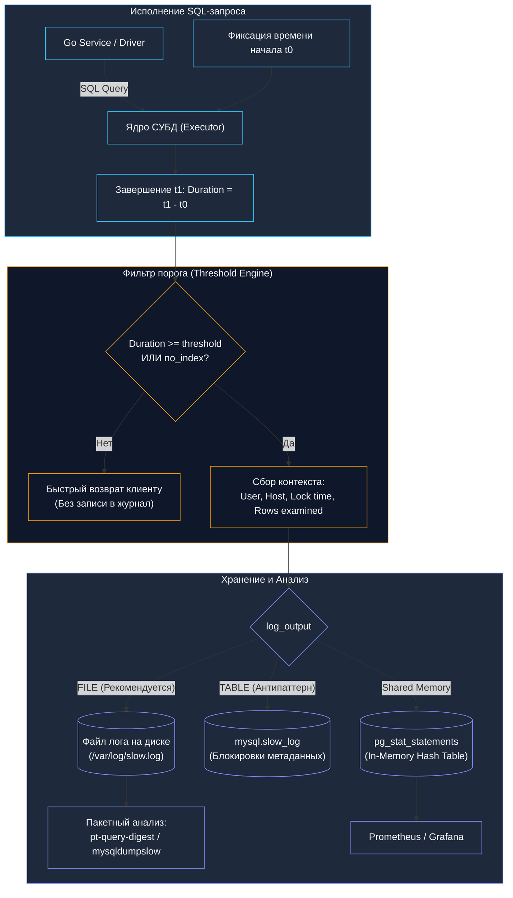

## 🐢 Slow Query Log: выявление и анализ медленных запросов в БД

В механике существует старое мудрое правило: «Машина ломается не там, где шумит, а там, где трение переходит в перегрев». Когда высоконагруженная база данных начинает захлебываться, а среднее время ответа приложения растет, неопытный инженер бросается изучать общую загрузку процессора или наращивать память. Но общие метрики коварны: один-единственный кривой SQL-запрос, выполняющийся раз в секунду и сканирующий 50 миллионов строк в памяти, способен незаметно вытеснить из кэша все рабочие таблицы и поставить дисковую подсистему на колени.

**Slow Query Log (журнал медленных запросов)** — это штатный бортовой самописец СУБД, регистрирующий все операции, время выполнения которых превысило заранее установленный временной порог (threshold). Это фундаментальный хирургический инструмент инженера и DBA, позволяющий отделить тысячи быстрых штатных транзакций от редких «тяжеловесов», отравляющих работу всей системы.

В этой главе мы подробно разберем механику работы журналов медленных запросов в MySQL, PostgreSQL, MS SQL и Oracle, изучим влияние сбора логов на дисковую подсистему (Mechanical Sympathy) и покажем, как Go-разработчикам эффективно связывать медленные запросы со своим кодом.



---

### 📌 Зачем нужен Slow Query Log?

Логирование медленных запросов выполняет пять важнейших стратегических задач:

1. **Выявление узких мест** — находит запросы, которые потребляют больше всего ресурсов и времени (CPU, disk IO, lock wait time).
2. **Оптимизация производительности** — помогает определить, какие запросы нужно оптимизировать (добавить индексы, переписать SQL, применить денормализацию).
3. **Мониторинг и анализ** — позволяет отслеживать изменения производительности со временем при росте объема данных.
4. **Планирование масштабирования** — показывает реальную нагрузку на БД, помогает принимать взвешенные решения о шардировании, партиционировании или переходе на чтение с реплик.
5. **Соответствие SLA** — помогает гарантировать, что время отклика системы соответствует строгим требованиям бизнеса и соглашениям об уровне сервиса.

---

### ⚙️ Как работает Slow Query Log

Механизм логирования встроен непосредственно в цикл выполнения команд движка СУБД:

1. **Пороговое время (threshold)** — запросы, выполняющиеся дольше этого времени, записываются в лог. Порог задается в миллисекундах или секундах (например, `0.1` с или `100ms`).
2. **Запись в лог** — в лог сохраняется исчерпывающая метаинформация о запросе: точный текст SQL-оператора, время выполнения (`Query_time`), время удержания блокировок (`Lock_time`), имя пользователя и хост, имя базы данных, метка времени начала, количество возвращенных строк (`Rows_sent`) и количество просканированных строк (`Rows_examined`).
3. **Хранение логов** — в файле, таблице (в MySQL) или системном каталоге (в PostgreSQL).

> [!info] Под капотом: Rows Sent vs Rows Examined
> Главный маркер катастрофы в логе медленных запросов — гигантский разрыв между `Rows_sent` и `Rows_examined`. 
> 
> Если запрос вернул клиенту 5 строк (`Rows_sent: 5`), но для этого движку пришлось просканировать 2 000 000 строк таблицы (`Rows_examined: 2000000`), это классический `Full Table Scan`. Вся таблица была поднята с диска в ОЗУ только для того, чтобы отбросить 99.999% данных. Это явный кандидат на создание индекса ([[10. План выполнения запроса. EXPLAIN]]).

---

### 🛠️ Настройка и использование в разных СУБД

Каждая промышленная СУБД обладает собственной спецификой и архитектурными компромиссами при регистрации медленных операций.

#### **1. MySQL / MariaDB**

В экосистеме MySQL журнал медленных запросов исторически является основным средством профилирования.

**Ключевые параметры:**
- `slow_query_log` — включить/выключить логирование (`ON`/`OFF`).
- `long_query_time` — пороговое время в секундах (может быть с дробной частью, например, 0.1 для отлова запросов длиннее 100 мс).
- `log_queries_not_using_indexes` — записывать запросы, не использующие индексы, даже если они быстрее порога (позволяет поймать скрытые table scan на маленьких таблицах до того, как они вырастут).
- `slow_query_log_file` — абсолютный путь к файлу лога на файловой системе.
- `log_output` — куда писать: `FILE`, `TABLE` (в таблицу `mysql.slow_log`) или `NONE`.

**Пример настройки:**
```sql
SET GLOBAL slow_query_log = 'ON';
SET GLOBAL long_query_time = 2;
SET GLOBAL log_queries_not_using_indexes = 'ON';
```

> [!warning] Ловушка / Gotcha: log_output = TABLE
> Никогда не используйте параметр `log_output = 'TABLE'` на высоконагруженном продакшене! 
> 
> Запись в таблицу `mysql.slow_log` использует стандартные механизмы транзакционного движка. Если база начинает деградировать и генерировать сотни медленных запросов в секунду, каждый поток пытается заблокировать таблицу `mysql.slow_log` для вставки записи. Возникает каскадный коллапс блокировок (`lock contention`), и сам логгер добивает упавшую базу данных. Всегда направляйте лог в файл (`log_output = 'FILE'`), где запись выполняется через последовательный буферизованный системный вызов `write()`.

**Инструменты анализа:**
- `mysqldumpslow` — утилита для агрегации и суммирования медленных запросов (показывает похожие запросы, их количество, общее время, заменяя числа и строки абстрактными `N` и `'S'`).
- `pt-query-digest` (Percona Toolkit) — промышленный золотой стандарт анализа: строит сводный отчет по закону Парето (ранжирует запросы по суммарному времени потребления ресурсов), выявляет тренды и распределения.

**Пример использования mysqldumpslow:**
```bash
mysqldumpslow -s t /var/log/mysql/mysql-slow.log
```
(Показывает топ запросов по времени выполнения.)

**Рекомендации:**
- Включать на продакшене, но с аккуратным порогом (например, 1-2 секунды, постепенно снижая до 0.2–0.5 с по мере оптимизации).
- Анализировать регулярно, особенно после изменений в данных или схеме.
- Для высоконагруженных систем: можно использовать семплирование (логировать только часть запросов) через `log_slow_rate_limit` (в Percona Server).

---

#### **2. PostgreSQL**

Философия PostgreSQL отдает предпочтение модульности и минимальному влиянию на дисковый ввод-вывод.

**Ключевые параметры:**
- `log_min_duration_statement` — минимальное время выполнения в миллисекундах, при котором запрос попадает в лог (значение `1000` логирует запросы от 1 с, `250` — от 250 мс, `-1` выключает логирование, `0` логирует вообще все запросы).
- `log_line_prefix` — формат строки лога (можно добавить информацию о запросе: идентификатор процесса `%p`, имя пользователя `%u`, имя базы `%d`, метку времени `%m`, идентификатор транзакции `%x`).
- `log_statement` — можно логировать все запросы (`all`), но это создает большую нагрузку.

**Пример настройки:**
```sql
ALTER SYSTEM SET log_min_duration_statement = '1000';  -- 1 секунда
SELECT pg_reload_conf();
```

**Расширения:**
- `pg_stat_statements` — собирает статистику по всем выполненным запросам: количество вызовов, общее время, строки, планирование и выполнение. Это более современный и эффективный способ анализа, чем логи, так как он накапливает данные в оперативной памяти без дисковых операций.
- `auto_explain` — расширение, автоматически записывающее в журнал реальные планы выполнения (`EXPLAIN`) запросов, превысивших заданный порог `auto_explain.log_min_duration`.

**Пример использования pg_stat_statements:**
```sql
SELECT query, calls, total_exec_time, mean_exec_time, rows
FROM pg_stat_statements
ORDER BY total_exec_time DESC
LIMIT 10;
```
(Показывает топ-10 запросов по общему времени выполнения.)

**Рекомендации:**
- Использовать `pg_stat_statements` для постоянного мониторинга.
- Настройка `log_min_duration_statement` полезна для разового анализа, но создает нагрузку на диск при слишком низком пороге.

---

#### **3. Microsoft SQL Server**

В MS SQL Server исторические профайлеры уступили место легковесным событийным движкам.

**Инструменты:**
- **Extended Events (XEvents)** — современный высокопроизводительный механизм ядра для отслеживания системных событий, включая длительные запросы. Работает с микроскопическими накладными расходами памяти. Можно настроить сессию для перехвата запросов с длительностью больше порога.
- **Query Store** — встроенный функционал для автоматического сбора статистики по запросам, планам выполнения и ресурсам. Позволяет видеть историю запросов и их производительности прямо в SQL Server Management Studio (SSMS), а также фиксировать стабильные планы («plan pinning»).
- **SQL Trace / SQL Server Profiler** — устаревшие, но все еще используемые инструменты для трассировки запросов, создающие заметную нагрузку на сервер.

**Пример настройки Extended Events:**
```sql
CREATE EVENT SESSION [LongRunningQueries] ON SERVER
ADD EVENT sqlserver.sql_statement_completed(
    ACTION(sqlserver.sql_text, sqlserver.database_name)
    WHERE ([duration] > 1000000))  -- 1 секунда в микросекундах
ADD TARGET package0.event_file(SET filename = N'C:\temp\LongRunningQueries.xel');
GO
ALTER EVENT SESSION [LongRunningQueries] ON SERVER STATE = START;
```

**Рекомендации:**
- Использовать Query Store для постоянного мониторинга.
- Extended Events — для детального анализа и отладки конкретных инцидентов.

---

#### **4. Oracle Database**

В СУБД Oracle профилирование тесно интегрировано с системным представлением сессий.

**Инструменты:**
- **AWR (Automatic Workload Repository)** — собирает статистику по работе БД, включая снимки производительности SQL-запросов каждые 60 минут.
- **ASH (Active Session History)** — поминутная история активных сессий, опрашивающая память каждую секунду. Позволяет видеть, какие запросы выполнялись в конкретные моменты времени в прошлом без включения тяжелых логов.
- **SQL Trace / TKPROF** — классическая трассировка SQL-запросов на уровне отдельного процесса сессии с последующим форматированием сырого файла трассировки консольной утилитой `tkprof`.

**Пример включения трассировки для сессии:**
```sql
ALTER SESSION SET SQL_TRACE = TRUE;
-- или
EXEC DBMS_SESSION.SESSION_TRACE_ENABLE(waits => TRUE, binds => TRUE);
```
Затем отчет можно сгенерировать утилитой `tkprof`.

**Рекомендации:**
- Использовать AWR и ASH для регулярного мониторинга.
- SQL Trace — для детального анализа конкретных сессий.

---

### 📊 Анализ логов и инструменты

Сырой лог медленных запросов на миллион строк бесполезен для человека. Для извлечения пользы применяются специализированные конвейеры:

1. **Сбор и агрегация:**
   - Консольные утилиты: `mysqldumpslow`, `pt-query-digest` (позволяют сгруппировать миллионы записей в 10–20 уникальных шаблонов).
   - Системы мониторинга: Prometheus + Grafana, Zabbix, Nagios (с плагинами анализа логов).
   - Облачные решения: AWS RDS Performance Insights, Google Cloud SQL Insights (автоматически визуализируют нагрузку на CPU в разрезе конкретных SQL-запросов и ожиданий `Wait Events`).

2. **Выявление проблем:**
   - Запросы с высоким временем выполнения (Latency outliers).
   - Запросы с высоким количеством сканируемых строк (full table scan, дефицит индексов).
   - Запросы с неэффективными планами выполнения (отсутствие индексов, неоптимальные join, Hash Join вместо Index Scan).

3. **Анализ планов выполнения:**
   - Использовать `EXPLAIN` (MySQL, PostgreSQL) или `EXPLAIN ANALYZE` для просмотра плана.
   - Искать: Full Table Scan, Nested Loop с большим количеством строк, неэффективные фильтры.

4. **Действия после анализа:**
   - Добавление/изменение индексов (покрывающие индексы, B-Tree, GIN).
   - Переписывание SQL (избегать подзапросов, использовать правильные join, заменять `SELECT *` на конкретные колонки).
   - Обновление статистики таблиц (`ANALYZE`, `UPDATE STATISTICS`), чтобы оптимизатор не ошибался в кардинальности.
   - Изменение конфигурации БД (например, увеличение буферов `shared_buffers` или `innodb_buffer_pool_size`).

---

### 📈 Лучшие практики работы с Slow Query Log

Для того чтобы журнал медленных запросов приносил пользу, а не превращался в кладбище терабайтов дискового пространства, придерживайтесь проверенных инженерных правил:

1. **Регулярный анализ** — настроить еженедельный или ежедневный просмотр логов командой разработки.
2. **Автоматизация** — использовать CI/CD скрипты для генерации регулярных отчетов `pt-query-digest` и отправки сводки топ-10 запросов по email или в корпоративный мессенджер.
3. **Тестирование изменений** — после оптимизации запроса проверять его производительность на реалистичном тестовом стенде с боевым объемом данных.
4. **Мониторинг в реальном времени** — интеграция с системами мониторинга для алертинга при появлении медленных запросов, выбивающихся за критический порог (например, запросы дольше 10 секунд).
5. **Документирование** — вести журнал оптимизаций и их результатов (какой индекс был добавлен и насколько снизился `Rows_examined`).
6. **Баланс между детализацией и нагрузкой** — не включать логирование всех запросов на высоконагруженных системах, использовать семплирование.
7. **Использование sqlcommenter (Связь с Go):** Внедряйте в SQL-запросы метаданные о вызвающей горутине и эндпоинте в виде комментариев:
   ```go
   // Go: добавление контекста для Slow Query Log
   query := fmt.Sprintf("SELECT id, name FROM users WHERE tenant_id = $1 /* handler=%s, trace_id=%s */", 
       handlerName, traceID)
   ```
   Когда запрос попадет в Slow Query Log, DBA или инженер мгновенно увидит имя HTTP-хэндлера и `TraceID`, не гадая, какой из 50 микросервисов сгенерировал этот SQL.

---

### 🔗 Связь с другими темами архитектуры БД

Slow Query Log не существует в вакууме — он связан со всеми слоями архитектуры данных:

- **Индексы** — многие медленные запросы решаются добавлением правильных индексов ([[10. План выполнения запроса. EXPLAIN]]).
- **Репликация и шардирование** — если запросы медленные из-за объема данных, возможно, пора подумать о масштабировании ([[13. Highload базы данных]], [[14. Hot partition и skew]]).
- **Кэширование** — некоторые запросы можно кэшировать на уровне приложения или БД ([[7. Кэширование поверх БД]]).
- **Транзакции и блокировки** — медленные запросы могут быть вызваны блокировками, что требует анализа конкурентного доступа ([[8. CQRS и базы данных]]).

---

### 💡 Пример быстрой настройки в MySQL

Пошаговый сценарий оптимизации на реальном стенде:

1. Включить лог:
   ```sql
   SET GLOBAL slow_query_log = 'ON';
   SET GLOBAL long_query_time = 1;
   SET GLOBAL log_queries_not_using_indexes = 'ON';
   ```
2. Выполнить типичные запросы на продакшене (или запустить нагрузочное тестирование).
3. Проанализировать лог:
   ```bash
   mysqldumpslow -s t /var/log/mysql/mysql-slow.log | head -20
   ```
4. Для топ-10 запросов выполнить `EXPLAIN` и найти узкие места.
5. Оптимизировать: добавить индексы, переписать запросы, обновить статистику.

---

## Ловушки и вопросы с собеседований

> [!tip] Собеседование
> **Вопрос:** Мы настроили `long_query_time = 1` в MySQL, но сервис работает невыносимо медленно. При этом файл Slow Query Log абсолютно пуст! Как такое возможно?
> 
> **Ответ:** Это классическая ловушка «множества быстрых запросов» (Death by a thousand cuts):
> 1. **Проблема N+1:** Приложение выполняет 10 000 микро-запросов по 200 микросекунд каждый в цикле (например, загрузка связанных сущностей в ORM). Ни один из них не превышает порог 1 секунды, поэтому лог пуст, но суммарно страница грузится 2 секунды из-за сетевых задержек.
> 2. **Блокировки строк на клиенте:** Запрос может быстро выполниться на сервере БД, но приложение тратит время на десериализацию или долго удерживает открытую транзакцию.
> 3. **Неверный порог:** Порог в 1 секунду слишком велик для современного веба. Запрос, длящийся 800 мс — катастрофа для SLA, но он невидим для лога с порогом в 1 с.
> 4. **Инструмент решения:** Использовать `pg_stat_statements` или `pt-query-digest` с более агрессивным порогом (например, 50 мс), либо смотреть на суммарный показатель `total_exec_time` (частота вызовов $\times$ среднее время), а не на максимальное время отдельного вызова.

> [!warning] Ловушка / Gotcha
> - **Слишком низкий порог на продакшене:** Установка `long_query_time = 0` (логировать все) на сервере с 20 000 QPS мгновенно забьет диск терабайтами логов за считанные часы и вызовет остановку базы из-за дискового переполнения (Disk Full).
> - **Отсутствие ротации логов (logrotate):** Если медленный лог не ротируется, он вырастает до десятков гигабайт. Попытка открыть или распарсить такой файл утилитой `mysqldumpslow` приведет к нехватке памяти на хосте мониторинга.

---

## Итог

Slow Query Log — это первый и важнейший шаг в оптимизации производительности базы данных. Его правильная настройка и регулярный анализ позволяют значительно улучшить отклик системы и предотвратить проблемы до того, как они станут критическими.

В следующей лекции мы объединим метрики, логи и трассировку в единую стройную систему: [[19. Observability БД]].