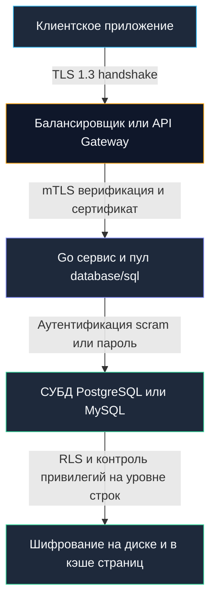

## Введение: Многоуровневая защита и нулевое доверие

В старой фортификационной архитектуре средневековые замки строились по принципу концентрических колец: глубокий ров, внешняя крепостная стена, внутренние башни и, наконец, цитадель — донжон. Если враг пробивал внешние ворота, он оказывался в узком каменном коридоре под перекрестным обстрелом лучников. В компьютерной безопасности мы слишком долго верили в иллюзию «неприступного внешнего периметра»: дескать, если сервис находится за корпоративным VPN или закрытым контуром Kubernetes, то внутри все свои и можно передавать пароли открытым текстом, подключаться к базе под пользователем `postgres` или `root` и пренебрегать шифрованием сетевого трафика.

Современная инженерная парадигма **нулевого доверия (Zero Trust)** беспощадно отбрасывает эту наивность. Мы обязаны проектировать архитектуру, исходя из постулата: *внешний периметр уже скомпрометирован, сеть прослушивается злоумышленником, а любой соседний микросервис может быть захвачен*. 

База данных — это сокровищница и последний рубеж обороны любого бизнеса. Если скомпрометирован веб-сервер, его можно изолировать и пересоздать за секунды; если украдена или уничтожена производственная база данных — бизнес перестает существовать. Безопасность баз данных — это не галочка в конфигурационном файле, а сквозная инженерная дисциплина, связывающая криптографические инструкции центрального процессора (AES-NI), управление кучей в рантайме Go, системные вызовы ядра Linux и внутренние механизмы СУБД (Row-Level Security, RBAC).

В этой главе мы разберем:
- Управление секретами и механику аутентификации в рантайме Go без утечек в дампы памяти (`/proc/<pid>/mem`).
- Шифрование в транзите: TLS 1.3, взаимная аутентификация mTLS, сессионные тикеты и аппаратное ускорение CPU.
- Защиту от инъекций на уровне грамматического разбора СУБД: почему серверные подготовленные выражения (`PREPARE` + `EXECUTE`) фундаментально защищают систему, а строковая конкатенация разрушает абстракцию кода и данных.
- Принцип наименьших привилегий, ролевой доступ (RBAC) и изоляцию строк (Row-Level Security).
- Взаимодействие криптографии с Garbage Collector: очистку памяти, постоянное время сравнения (`crypto/subtle`) и защиту от timing-атак.
- Аудит (`pgaudit`), маскирование данных и безопасное логирование без просадки дискового IOPS.



---

1. **Управление секретами и аутентификация в рантайме Go**

Строка подключения (DSN — Data Source Name) содержит конфиденциальные учетные данные: логин, пароль, хост и параметры шифрования. В Go строка — это неизменяемый заголовок `reflect.StringHeader`, указывающий на массив байт в куче (`heap`). Сборщик мусора (GC), освобождая память, не затирает ее нулями. Байт-буфер с паролем может часами оставаться в физической оперативной памяти процесса. Это создает реальный вектор атаки через инспекцию адресного пространства процесса `/proc/<pid>/mem`, аварийные дампы ядра (`core-dumps`) или аллокации в shared memory.

При подключении к базе данных придерживайтесь строгих правил изоляции:

```go
package database

import (
	"database/sql"
	"fmt"
	"log"
	"os"
	"time"

	_ "github.com/jackc/pgx/v5/stdlib"
)

func OpenSecureDB() (*sql.DB, error) {
	// ❌ Опасно: жестко закодированные креды или передача из env без контроля
	// dsn := fmt.Sprintf("postgres://admin:SuperSecret123@db:5432/prod")
	
	// ✅ Безопасно: загрузка из защищенного источника (Vault, Kubernetes Secrets), валидация, быстрый сброс
	password := os.Getenv("DB_PASSWORD")
	if password == "" {
		return nil, fmt.Errorf("DB_PASSWORD not set")
	}
	
	// Явное указание строгого режима проверки сертификатов и таймаутов
	dsn := fmt.Sprintf(
		"postgres://app_user:%s@db-prod.internal:5432/appdb?sslmode=verify-full&sslrootcert=/etc/ssl/certs/ca.crt&connect_timeout=5",
		password,
	)
	
	// После создания пула переменную рекомендуется очистить (хотя это не панацея в Go)
	// password = "" // Сборщик мусора позже освободит память, но содержимое может остаться в куче
	
	db, err := sql.Open("pgx", dsn)
	if err != nil {
		return nil, fmt.Errorf("open db: %w", err)
	}
	
	// Ограничиваем время ожидания установления соединения
	ctx, cancel := context.WithTimeout(context.Background(), 5*time.Second)
	defer cancel()

	// Обязательно проверяем соединение с таймаутом, чтобы не держать висящие горутины
	if err := db.PingContext(ctx); err != nil {
		db.Close()
		return nil, fmt.Errorf("ping db: %w", err)
	}
	
	return db, nil
}
```

> [!warning] Ловушка / Gotcha: Пароли в логах и метриках
> Драйверы СУБД и пулеры соединений при сбоях сети по умолчанию логируют исходную строку подключения целиком. Если ваш логгер выводит текст ошибки без маскирования, пароль учетной записи окажется в `stdout`, системном журнале `journald` или распределенном хранилище логов (Loki / ELK), доступ к которому имеет широкая группа разработчиков (см. [[17. Мониторинг баз данных]]). Всегда используйте безопасные адаптеры логов или типы данных, реализующие интерфейс `fmt.Stringer`, маскирующий секреты звездочками `********`.

---

2. **Шифрование в транзите: TLS 1.3, mTLS и аппаратное ускорение**

Шифрование сетевого трафика между микросервисом и СУБД обязательно даже внутри изолированного частного облака. Современный промышленный стандарт — протокол **TLS 1.3**. В сравнении с TLS 1.2 он устранил устаревшие небезопасные шифры, сократил фазу рукопожатия (Handshake) до одного кругового путешествия пакетов (1 RTT, либо 0 RTT при повторном подключении) и стандартизировал алгоритмы аутентифицированного шифрования с присоединенными данными (AEAD).

В Go конфигурация шифрования управляется структурой `tls.Config` из пакета `crypto/tls`. При использовании пула `database/sql` или `pgxpool` TLS-рукопожатие выполняется только один раз при установке физического TCP-сокета, после чего шифрованный канал переиспользуется сотнями горутин:

```go
package database

import (
	"crypto/tls"
	"crypto/x509"
	"database/sql"
	"fmt"
	"os"
	"time"
	
	"github.com/lib/pq"
)

func setupTLS(dsn string) (*sql.DB, error) {
	rootCAs, _ := x509.SystemCertPool()
	if rootCAs == nil {
		rootCAs = x509.NewCertPool()
	}
	
	// Загрузка доверенного корневого сертификата CA базы данных
	certs, err := os.ReadFile("/etc/ssl/certs/db-ca.pem")
	if err != nil {
		return nil, fmt.Errorf("read ca cert: %w", err)
	}
	if ok := rootCAs.AppendCertsFromPEM(certs); !ok {
		return nil, fmt.Errorf("failed to append CA cert")
	}
	
	tlsConfig := &tls.Config{
		RootCAs:            rootCAs,
		MinVersion:         tls.VersionTLS12, // TLS 1.3 предпочтительнее, но 1.2 часто требуется для совместимости
		CipherSuites: []uint16{
			tls.TLS_AES_128_GCM_SHA256,
			tls.TLS_CHACHA20_POLY1305_SHA256,
		},
		SessionTicketsDisabled: false, // Ресумпшн сессий снижает CPU нагрузку при реконнектах
	}
	
	// Регистрация кастомной конфигурации в драйвере lib/pq
	pq.RegisterTLSConfig("secure", tlsConfig)
	
	dsnWithTLS := dsn + "&sslmode=verify-full&sslinline=true&tlsconfig=secure"
	return sql.Open("postgres", dsnWithTLS)
}
```

> [!info] Под капотом: Mechanical Sympathy и AES-NI
> Фаза рукопожатия TLS требует асимметричной криптографии (RSA или ECDSA для аутентификации узлов, Diffie-Hellman / ECDHE для генерации общего сессионного ключа). Это ресурсоемкие операции для ALU процессора. После согласования ключа трафик шифруется симметричными алгоритмами.
> 
> Современные процессоры Intel и AMD поддерживают набор инструкций **AES-NI** и **SHA-NI** (а ARMv8 — инструкции криптографического расширения), которые реализуют раунды шифрования AES и хэширования непосредственно в кремнии, ускоряя обработку в 5–10 раз без нагрузки на универсальные регистры. 
> 
> Если ваш сервис запускается на виртуальных машинах без поддержки AES-NI, шифрование AES способно потреблять до 25–30% циклов CPU. В таких средах предпочтительнее использовать поточный шифр `ChaCha20-Poly1305` (`tls.TLS_CHACHA20_POLY1305_SHA256`), оптимизированный под быструю чисто программную реализацию. На современных серверах x86_64 шифр `AES-128-GCM` является эталоном по энергоэффективности и пропускной способности.

---

3. **SQL-инъекции: Парсеры, подготовленные выражения и риски ORM**

SQL-инъекция возникает тогда, когда пользовательские входные данные ошибочно интерпретируются грамматическим парсером СУБД как управляющие инструкции SQL. Строковая конкатенация разрушает границу между кодом и данными.

Единственная математически надежная защита — серверные подготовленные выражения (**Server-side Prepared Statements**): вызовы `PREPARE` и `EXECUTE`. При вызове `PREPARE` СУБД выполняет лексический и синтаксический анализ SQL-текста, строит абстрактное синтаксическое дерево (AST), формирует план выполнения запроса и компилирует его в бинарную форму. При последующем вызове `EXECUTE` аргументы передаются в бинарном формате протокола и подставляются в готовые слоты плана. Никакие специальные символы (`'`, `;`, `--`) в аргументах не могут изменить структуру скомпилированного AST!

```go
// ❌ Критически опасно: конкатенация или форматирование строк
query := fmt.Sprintf("SELECT * FROM users WHERE email = '%s'", userInput)
rows, err := db.QueryContext(ctx, query) // user может передать: ' OR 1=1 --

// ✅ Безопасно: параметризация через $1, $2 (передача данных отдельно от AST)
query := "SELECT id, name FROM users WHERE email = $1 AND status = $2"
rows, err := db.QueryContext(ctx, query, userInput, "active")
```

> [!warning] Ловушка / Gotcha: Динамические идентификаторы (ORDER BY, имена колонок и таблиц)
> Подготовленные выражения (`PREPARE`) параметризуют исключительно **значения данных** в выражениях фильтрации или вставки (`WHERE col = $1`, `VALUES ($1)`). Они принципиально не могут параметризовать структурные элементы запроса: имена таблиц, названия колонок или направление сортировки.
> 
> Попытка выполнить:
> ```sql
> SELECT * FROM orders ORDER BY $1;
> ```
> приведет либо к синтаксической ошибке, либо к бессмысленной сортировке по строковому литералу `'name'` вместо сортировки по значению колонки `name`.
> 
> **Решение:** Для динамических структур используйте белый список (whitelist) допустимых значений. Никогда не подставляйте ввод пользователя напрямую в SQL-структуру. Если требуется гибкая сортировка, используйте `sql.Named` или маппинг в коде:
> ```go
> allowedCols := map[string]string{
>     "name": "last_name", 
>     "date": "created_at",
> }
> col, ok := allowedCols[userInput]
> if !ok { 
>     col = "created_at" // Безопасное значение по умолчанию
> }
> // Безопасно, так как col гарантированно взят из нашего whitelist
> query := fmt.Sprintf("SELECT id, total FROM orders ORDER BY %s ASC", col)
> ```

Подробный анализ всех векторов инъекций и защиты от них мы разберем в отдельной главе: [[21. SQL Injection]].

---

4. **Принцип наименьших привилегий и изоляция на уровне СУБД**

Архитектурный грех номер один — подключение приложения к СУБД под учетной записью администратора (`SUPERUSER`, `postgres`, `root`). В этом случае любая уязвимость в коде позволяет атакующему читать системные файлы ОС (`COPY ... FROM PROGRAM`), вызывать внешние библиотеки C или стереть всю базу данных командой `DROP DATABASE`.

Принцип наименьших привилегий (Principle of Least Privilege) требует гранулярного разграничения прав:
- **Разделение ролей по обязанностям:**
  - `app_reader` — доступ только к операциям чтения (`SELECT`).
  - `app_writer` — доступ к модификации данных (`INSERT`, `UPDATE`, `DELETE`).
  - `app_migrator` — роль с правами DDL (`CREATE`, `ALTER`, `DROP`), используемая исключительно в процессе CI/CD деплоя и запуска миграций ([[4. Миграции базы данных]]). Приложение в runtime не должно иметь прав DDL!
- **Row-Level Security (RLS):** Включение механизма изоляции строк командой `ALTER TABLE ... ENABLE ROW LEVEL SECURITY`. СУБД на уровне ядра принудительно фильтрует возвращаемые и обновляемые строки на основе контекста текущей сессии (`current_user` или переменной сессии `tenant_id`). Это исключает утечку данных между арендаторами в мультитенантных системах даже при ошибке в условии `WHERE` в коде Go!
- **Изоляция схем (Schema Isolation):** Настройка параметра `search_path` и распределение таблиц по изолированным схемам для разных сервисов исключает доступ к таблицам платежей из сервиса комментариев.

> [!tip] Собеседование
> **Вопрос:** Представьте, что учетные данные сервиса к СУБД скомпрометированы. Какие архитектурные механизмы на уровне базы данных позволят минимизировать ущерб и предотвратить утечку всех данных компании?
> 
> **Ответ:** Защита строится на эшелонированной обороне:
> 1. **Ограничение прав роли:** Учетная запись не должна быть владельцем таблиц, не должна иметь прав `CREATE`, `DROP`, `TRUNCATE`, а также привилегий работы с файлами ОС (`FILE`, `COPY TO/FROM`).
> 2. **Политики Row-Level Security (RLS):** Ограничивают выборку только строками текущего клиента (тенантная изоляция).
> 3. **Шифрование колонок на стороне приложения (Application-Side Envelope Encryption):** Критические данные (паспортные данные, токены карт) хранятся в базе в зашифрованном виде. Ключи дешифрования находятся в KMS / Vault и отсутствуют в СУБД.
> 4. **Аудит аномалий:** Расширение `pgaudit` и системный мониторинг `pg_stat_statements` фиксируют нетипичные массовые `SELECT *` запросы и поднимают тревогу в SIEM-системе.
> 
> Подробно реализацию ролевых моделей мы разберем в лекции: [[22. RBAC в БД]].

---

5. **Механика памяти, GC и криптографические примитивы**

В Go рантайм берет на себя управление памятью, что создает скрытые угрозы для криптографических секретов:
1. **Timing-атаки при сравнении токенов:** Стандартный оператор `==` или функция `bytes.Equal` прерывают выполнение на первом несовпадающем байте. Если первый байт не совпал, функция завершается за 2 такта CPU; если не совпал 16-й байт — за 20 тактов. Измеряя сетевые наносекундные задержки (Timing Attack), злоумышленник может посимвольно подобрать секретный токен или сигнатуру HMAC!
   
   В Go для любых криптографических проверок обязательно используется пакет `crypto/subtle`:
   ```go
   package security

   import "crypto/subtle"

   func VerifyToken(input, expected []byte) bool {
       // subtle.ConstantTimeCompare выполняется за строго фиксированное число тактов CPU
       // независимо от содержимого и позиции первого несовпадающего байта
       return subtle.ConstantTimeCompare(input, expected) == 1
   }
   ```

2. **Очистка секретов в ОЗУ:** Сборщик мусора Go перемещает объекты, создавая их копии в куче. Если в коде хранится закрытый ключ или пароль в виде слайса `[]byte`, после использования его необходимо немедленно перезаписать нулями (`for i := range secret { secret[i] = 0 }`).
3. **Запрет своппинга:** В Linux для высокочувствительных данных рассмотрите `mlock()` через `unix.Mlock`, чтобы заблокировать страницы в RAM и запретить своппинг на диск.
4. **Переиспользование буферов:** Использование пула `sync.Pool` снижает частоту выделения памяти под криптографические операции и ограничивает размазывание секретов по куче.

> [!info] Под капотом: Нагрузка криптографии на планировщик Go
> Функция `bcrypt.GenerateFromPassword` или `argon2.IDKey` создают большие буферы (по умолчанию 32 КБ для argon2). При высокой нагрузке это создает `Gen 0` аллокации, которые быстро продвигаются в `Gen 1`. Если хеширование вызывается синхронно в HTTP-обработчике, горутина блокируется, а буферы висят в памяти. Оптимальный паттерн: асинхронная обработка через воркер-пул, переиспользование буферов и строгие лимиты на параллельные вычисления (`runtime.GOMAXPROCS`).

---

6. **Аудит, маскирование и безопасное логирование**

Журналирование операций — обязательное требование регуляторов (PCI DSS, HIPAA, GDPR). В СУБД PostgreSQL для этого используется расширение `pgaudit` или системные таблицы `pg_log`. Однако аудит создает значительный I/O-оверхед, так как каждое событие записывается в журнал синхронно.

Однако на стороне Go-сервиса необходимо соблюдать гигиену логирования:
- Никаких паролей, токенов сессий и номеров кредитных карт в логах!
- Использование структурированного логгера `log/slog` с явным разделением уровней: `slog.LevelInfo` для бизнес-событий, `slog.LevelDebug` только для локальной отладки.
- Обязательное маскирование персональных данных (PII): `card_number=************4242`.

```go
package logging

import (
	"context"
	"log/slog"
	"strings"
)

func LogQueryStart(ctx context.Context, logger *slog.Logger, query string) {
	// Безопасное логирование метаинформации без тела запроса и аргументов
	queryType := extractQueryType(query)
	
	correlationID, _ := ctx.Value("request_id").(string)

	logger.InfoContext(ctx, "database transaction initiated",
		slog.String("query_type", queryType),
		slog.String("correlation_id", correlationID),
	)
}

func extractQueryType(q string) string {
	parts := strings.Fields(strings.TrimSpace(q))
	if len(parts) > 0 {
		return strings.ToUpper(parts[0])
	}
	return "UNKNOWN"
}
```

> [!warning] Ловушка / Gotcha: Аудит и производительность
> Включение полного режима аудита `pgaudit.log = 'read, write'` на высоконагруженной OLTP-базе данных способно уронить пропускную способность СУБД на 20–40%! 
> 
> Каждый выполняемый `SELECT` приводит к синхронной записи текстовой строки в системный журнал и вызову дискового сброса `fsync`. 
> 
> **Решение:** Включайте детальный аудит только для критичных таблиц (`pgaudit.log_relation`), используйте асинхронную доставку логов через `syslog` или JSON-потоки, и периодически ротируйте файлы. Для compliance (PCI DSS, GDPR) часто достаточно аудита DDL и изменений в таблицах пользователей.

---

7. **Ловушки, антипаттерны и вопросы с собеседований**

Разберем распространенные архитектурные ловушки:

1. **TLS в пуле соединений:**
   - *Проблема:* Разработчик настраивает `tls.Config` для `database/sql`, но драйвер создает новое соединение при каждом `Open`, а пул не переиспользует TLS-контекст правильно. Не пересоздавайте `*tls.Config` при каждом запросе.
   - *Решение:* Убедитесь, что конфигурация TLS инициализируется один раз при старте приложения и переиспользуется пулом соединений (современные `pgx` и `lib/pq` делают это). Не пересоздавайте `*tls.Config` при каждом запросе.
2. **Хранение хешей паролей:**
   - *Проблема:* Приложение сохраняет пароли с использованием устаревших алгоритмов `MD5` или `SHA1`, либо отправляет пароль в базу данных в открытом виде для сверки там.
   - *Решение:* Используйте стойкие функции деривации ключей: `Argon2id` или `bcrypt`. Для аутентификации самого приложения к PostgreSQL используйте метод `SCRAM-SHA-256`, исключающий передачу пароля в открытом виде даже при компрометации TLS.
3. **Уязвимости в ORM:**
   - *Проблема:* Использование ORM создает ложное чувство защищенности. Метод `.Where("name = ?", userInput)` безопасен, однако конкатенация вида `.Where(fmt.Sprintf("name = '%s'", userInput))` по-прежнему уязвима для инъекций.
   - *Решение:* Внедрите в конвейер CI/CD анализатор статической безопасности `gosec`. Он автоматически находит подозрительные конкатенации строк перед вызовами `QueryContext` и методами ORM.
4. **Сравнение с другими экосистемами:**
   - *Java:* Традиционно использует `JDBC` с тяжелыми пулами (`HikariCP`). Настройка TLS выполняется через свойства JVM или `SSLContext`. Экосистема богата готовыми решениями, но отличается высоким потреблением памяти.
   - *.NET / C#:* Работает через `System.Data.SqlClient` и `Npgsql`, отлично интегрируется с облачной технологией `Always Encrypted` и Azure Key Vault.
   - *Go:* Предоставляет прозрачный, низкоуровневый контроль над `crypto/tls` и пулами соединений. Отсутствие скрытой фоновой магии требует от инженера явного написания кода, но взамен гарантирует предсказуемое потребление памяти, отсутствие неконтролируемых пауз и исключительную надежность.

> [!tip] Собеседование
> **Вопрос:** В чем заключается физическая природа timing-атаки при проверке API-токена, и почему оператор `==` в Go небезопасен для криптографических проверок?
> 
> **Ответ:** Оператор `==` для строк и срезов байт реализован в рантайме Go как оптимизированный ассемблерный цикл: он сравнивает байты по порядку и возвращает `false` немедленно при обнаружении первого несовпадения. Если злоумышленник передает токен, первый байт которого неверен, процессор выполняет 1 итерацию цикла. Если первый байт угадан верно, а второй ошибочен — 2 итерации, и так далее. Измеряя статистическое распределение времени отклика сервера (в микро- и наносекундах), атакующий может посимвольно восстановить весь секретный токен. 
> 
> Для предотвращения атаки необходимо использовать `crypto/subtle.ConstantTimeCompare`, который всегда проходит по всем байтам буфера независимо от результата, используя битовые побитовые операции `XOR` и `OR` для накопления флага различия. Время его работы строго константно.

---

## Итог

Безопасность баз данных в Go — это многоуровневая инженерная крепость. Она строится не на надежде на внешний периметр, а на бескомпромиссных технических гарантиях:
- **Шифрование в транзите:** TLS 1.3 с проверкой сертификатов (`sslmode=verify-full`), защитой сессий и аппаратным ускорением AES-NI.
- **Математическое разделение кода и данных:** Строгое использование подготовленных выражений (`PREPARE` / `EXECUTE`) и белых списков для динамических идентификаторов.
- **Минимальные привилегии:** Отдельные системные роли СУБД для чтения, записи и миграций, изоляция схем и Row-Level Security.
- **Криптографическая гигиена в памяти:** Использование `crypto/subtle`, быстрый сброс секретов и контроль за нагрузкой от хэширования паролей.
- **Осознанный аудит:** Направленный сбор логов критических таблиц без убийства дискового ввода-вывода СУБД.

Мы заложили прочный фундамент общей безопасности. Теперь пришло время погрузиться в анатомию самой коварной и разрушительной угрозы реляционного мира — SQL-инъекций. В следующей лекции мы детально изучим механику синтаксического разбора запросов и разберем все сценарии атак: [[21. SQL Injection]].