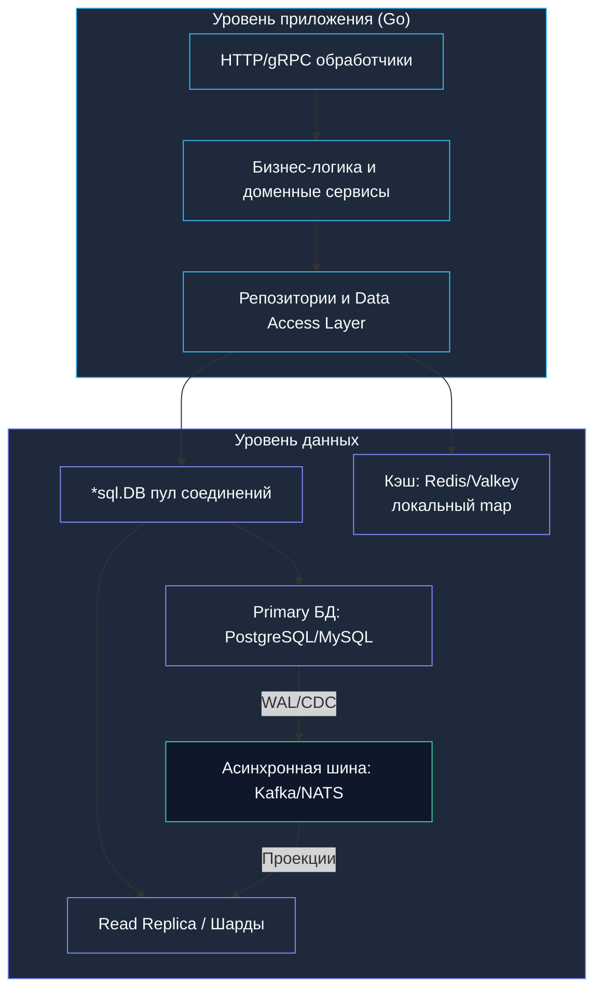
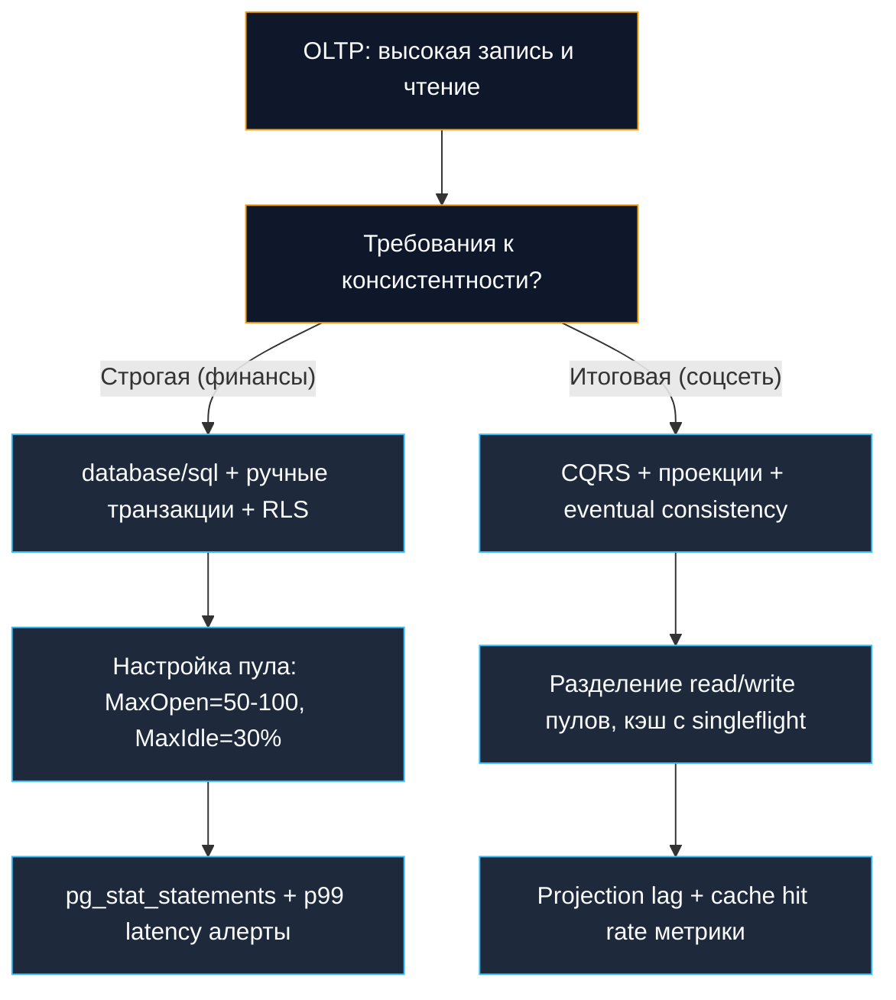
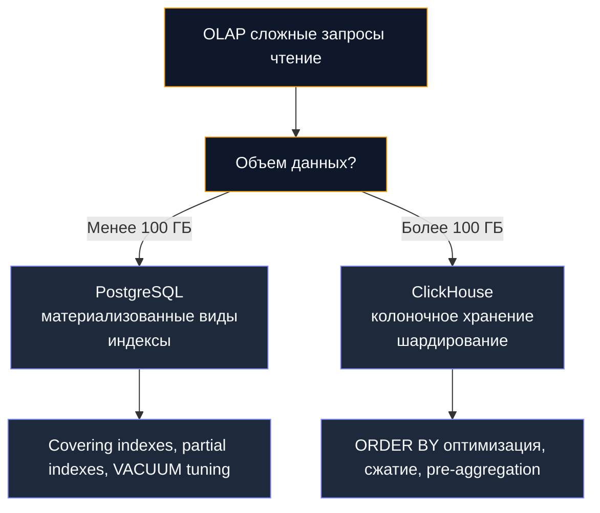
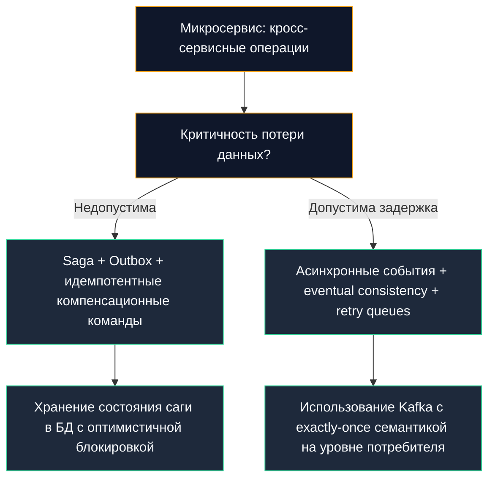

## Введение: От отдельных компонентов к целостной системе

В строительстве готических соборов средневековые мастера следовали неписаному правилу: устойчивость исполинского каменного свода зависит не от прочности отдельных камней, а от того, как аркбутаны, контрфорсы и замковые камни распределяют колоссальное давление между собой. В программировании и архитектуре баз данных действует тот же непреложный закон. Вы можете досконально знать бинарное устройство B-Tree страниц ([[1. B-Tree индексы]]), виртуозно жонглировать уровнями изоляции транзакций ([[1. ACID и уровни изоляции]]), настраивать пулы соединений ([[2. Connection pool]]) и виртуозно ловить медленные запросы в логах ([[18. Slow query log]]). Но настоящая инженерная зрелость уровня Senior и Staff/Lead начинается тогда, когда разрозненные детали складываются в вашей голове в единую, живую, работающую систему.

Завершая наш фундаментальный 10-й подраздел «Практика и архитектура» и весь грандиозный раздел по базам данных, мы собираем все детали мозаики воедино.

В этой итоговой главе мы:
*   Синтезируем ключевые принципы работы с БД в Go от низкоуровневого сокета до глобально распределенных транзакций.
*   Предоставим архитектурные чеклисты и decision framework для осознанного выбора инструментов и паттернов под конкретные сценарии бизнеса.
*   Разберем, как физическая механика рантайма Go (планировщик G-M-P, сборщик мусора GC, сетевой поллер netpoll) взаимодействует с ядром СУБД.
*   Обобщим сквозные паттерны надежности: от строгой идемпотентности и Outbox до катастрофоустойчивости (Disaster Recovery).
*   Сформулируем практические вопросы для собеседований и наметим вектор дальнейшего профессионального развития.

> [!info] Под капотом
> Работа с базами данных в Go — это непрерывный поиск баланса между прозрачной явностью и гибкой абстракцией, бескомпромиссной производительностью и железобетонной безопасностью. Понимание того, как структура `*sql.DB` маппируется на системные дескрипторы сокетов ОС, как вызов `rows.Scan` аллоцирует память в куче (`heap`), и как `context.Context` прерывает зависшие сетевые системные вызовы через ядровый селектор `epoll`, позволяет инженеру принимать обоснованные архитектурные решения, опираясь на физику вычислений, а не на слепую веру в документацию.

---

## Архитектурная матрица: Компоненты и их взаимодействие

Современная высоконагруженная бэкенд-система на Go, интенсивно работающая с данными, проектируется как многоуровневая распределенная конструкция:



Каждый слой архитектурной матрицы решает строго изолированную задачу:

1.  **HTTP/gRPC слой**: Принимает входящие запросы из внешней сети, проверяет форматы данных, генерирует или извлекает сквозной `context.Context` (W3C Trace Context) для прецизионного управления временем жизни операции и отмены сетевого ожидания при обрыве клиентского соединения.
2.  **Бизнес-логика**: Инкапсулирует чистые инварианты предметной области, управляет оркестрацией сценариев, диктует транзакционные границы и координирует вызовы репозиториев.
3.  **Data Access Layer (DAL)**: Изолирует приложение от диалектов конкретных СУБД, инкапсулирует SQL-запросы и выполняет типобезопасный маппинг между доменными сущностями и строками реляционных таблиц.
4.  **Пул соединений (`*sql.DB`)**: Управляет жизненным циклом физических TCP-подключений, балансирует параллельные вызовы горутин, защищает СУБД от лавины соединений через параметры `SetMaxOpenConns`, `SetMaxIdleConns` и `SetConnMaxLifetime`.
5.  **Кэш**: Разгружает дисковую подсистему базы данных от частых горячих чтений, требуя продуманных стратегий инвалидации (Cache-Aside, Write-Through) и защиты от эффекта толпы (`stampede`).
6.  **Primary БД**: Единый источник истины (Single Source of Truth) для операций записи, обеспечивающий строгие ACID-гарантии и целостность реляционных связей.
7.  **Read Replica / Шарды**: Обеспечивают горизонтальное масштабирование нагрузки на чтение, работают в модели согласованности в конечном счете (eventual consistency) и требуют прозрачной маршрутизации запросов со стороны клиента.
8.  **Асинхронная шина**: Развязывает потоки записи и чтения через публикацию доменных событий, обеспечивает обновление проекций в CQRS-архитектурах и координацию компенсирующих транзакций в распределенных сагах (Saga).

> [!tip] Собеседование
> **Вопрос:** Почему в Go-сервисах под высокой нагрузкой категорически не рекомендуется использовать один общий экземпляр `*sql.DB` для операций чтения и записи?
> 
> **Ответ:** 
> 1. **Разные профили нагрузки и таймаутов:** Транзакционная запись на Primary требует консервативного размера пула (чтобы не перегрузить процессорные процессы СУБД) и строгих коротких таймаутов (`context.WithTimeout`), исключающих удержание строчных блокировок. Чтение с реплик, напротив, выигрывает от широкого пула соединений, допускает длинные аналитические выборки и активное кэширование планов запросов.
> 2. **Изоляция сбоев:** При всплеске медленных запросов на чтение общий пул полностью исчерпает лимит соединений (`WaitCount` начнет расти). В результате сервис потеряет возможность выполнять критические финансовые транзакции записи, хотя сама Primary база абсолютно свободна.
> 3. **Отказоустойчивость:** Раздельные пулы позволяют при временном сбое или отставании реплики динамически деградировать или перенаправлять чтение, не затрагивая контур критической записи.

---

## Принципы работы с данными в Go: Сводная таблица

Инженерный манифест надежной работы с хранилищами данных в Go можно свести к семи фундаментальным законам:

| Принцип | Реализация в Go | Механика «под капотом» | Когда нарушать |
|---|---|---|---|
| **Явность превыше магии** | `database/sql` + ручной SQL / `sqlc` | Прямой контроль над запросами, планами, аллокациями | При прототипировании, внутренних инструментах |
| **Контекст для всего** | `QueryContext`, `ExecContext`, `BeginTx` | `context.Done()` интегрирован с `netpoll`, паркует горутины без блокировки тредов | Только для фоновых задач с собственным управлением отменой |
| **Пул — это ресурс** | `SetMaxOpenConns`, `SetMaxIdleConns`, `Stats()` | Мьютексы, атомарные счетчики, каналы ожидания в `*sql.DB` | Для одноразовых скриптов миграции/сидинга |
| **Транзакции — короткие** | `tx, err := db.BeginTx(ctx, opts)` + быстрый `Commit` | Удержание соединения в `inUse`, блокировки в БД, рост `temp_buffers` | Для batch-загрузок, где атомарность важнее латентности |
| **Идемпотентность — закон** | `ON CONFLICT`, `idempotency_key`, `event_id` | Уникальные индексы, хеши, проверки перед вставкой | Для чисто аппенд-логов, где дубли допустимы и отфильтровываются позже |
| **Кэш — оптимизация, не хранилище** | `singleflight`, `TTL + jitter`, `Redis Pipeline` | Аллокации при десериализации, давление на GC, сетевые RTT | Для критичных данных, где консистентность важнее скорости |
| **Безопасность по умолчанию** | Параметризация, `crypto/subtle`, `tls.Config` | Парсер СУБД разделяет код и данные, постоянное время сравнения | Для внутренних инструментов в изолированном контуре с доверенным вводом |

> [!warning] Ловушка / Gotcha: Игнорирование rows.Close() и tx.Rollback()
> Классическая и самая разрушительная утечка ресурсов в Go-бэкендах — забытый возврат соединений в пул. 
> 
> Если вы вызвали `db.QueryContext`, но забыли закрыть `*sql.Rows`, физическое TCP-соединение навечно зависает в статусе `inUse`. При наплыве 100 запросов пул соединений полностью блокируется, горутины выстраиваются в бесконечную очередь, и приложение падает по таймаутам.
> 
> **Золотой паттерн:**
> ```go
> rows, err := db.QueryContext(ctx, query, args...)
> if err != nil {
>     return err
> }
> defer rows.Close() // Гарантирует возврат сокета в пул даже при панике!
> ```
> Аналогично для транзакций:
> ```go
> tx, err := db.BeginTx(ctx, opts)
> if err != nil {
>     return err
> }
> defer tx.Rollback() // Безопасно: если Commit уже выполнен, Rollback вернет sql.ErrTxDone
> ```

---

## Механика рантайма: Как Go влияет на работу с БД

Высокая производительность Go обусловлена не магией компилятора, а глубоким механическим сочувствием (Mechanical Sympathy) к аппаратному обеспечению и системным вызовам операционной системы.

### Конкурентность: Горутины, треды и netpoll

Когда горутина вызывает `db.QueryContext`:
1.  Из локального пула запрашивается свободное соединение с захватом мьютекса `db.mu` (или атомарным вызовом).
2.  Драйвер сериализует запрос и отправляет байты в сокет через системный вызов `write()` ядра ОС.
3.  Если база данных не может ответить мгновенно, рантайм Go не блокирует поток ОС (`M`). Вместо этого сетевой дескриптор регистрируется в подсистеме **`netpoll`** (построенной на системных вызовах `epoll` в Linux или `kqueue` в macOS/BSD), а сама горутина переводится в спящее состояние (`_Gwaiting`) через вызов `runtime.gopark`.
4.  Освободившийся системный поток `M` немедленно берет на исполнение другую готовую горутину из локальной очереди планировщика `runq`.
5.  Когда сетевая карта получает пакет от СУБД, ядро Linux через `epoll_wait` пробуждает поллер рантайма, горутина переводится в состояние `_Grunnable` и возвращается в очередь исполнения процессора `P`.

> [!info] Под капотом: Thundering Herd в планировщике
> Модель `netpoll` позволяет нескольким потокам ОС обслуживать десятки тысяч одновременных соединений к базе данных. Однако системные вызовы `epoll_wait` и частые пробуждения горутин создают накладные расходы на переключение контекста процессора. 
> 
> Если 20 000 горутин одновременно ожидают освобождения пула соединений, в момент освобождения одного коннекта может возникнуть эффект «громоподобного стада» (Thundering Herd) на уровне мьютекса пула. Для предотвращения этой проблемы:
> - Держите размер пула соединений адекватным ресурсам сервера СУБД (например, 50–100 коннектов).
> - Используйте `sync.Pool` для переиспользования буферов аргументов.
> - Настраивайте параметр `GOMAXPROCS` в строгом соответствии с квотами CPU вашего контейнера.

### Garbage Collector и аллокации при работе с данными

Каждая операция с базой данных неизбежно порождает нагрузку на память:
*   `rows.Scan(&var)`: передача указателей в интерфейсные параметры приводит к тому, что переменные «убегают» в кучу (Escape Analysis), требуя динамических аллокаций.
*   Десериализация строк и JSON: вызовы `json.Unmarshal` или конвертация структур драйвера `pgtype` порождают тысячи короткоживущих структур в молодом поколении кучи (`Gen 0`).
*   Сетевые буферы: промежуточные слайсы байт `[]byte` для сетевого ввода-вывода.

При нагрузке в 10 000 RPS с ответами среднего размера в 2 КБ сервис генерирует более 20 МБ нового мусора каждую секунду. Это провоцирует частые микропаузы сборщика мусора Go (GC), который при переполнении продвигает выжившие объекты в старшее поколение (`Gen 1`), увеличивая длительность фазы Mark.

**Инженерные оптимизации:**
*   Переиспользуйте буферы через `sync.Pool` при чтении объемных блобов данных из `rows`.
*   Используйте бинарные форматы (Protobuf) вместо JSON для минимизации промежуточных аллокаций при парсинге.
*   Избегайте `interface{}` в горячих путях обработки — статическая типизация позволяет компилятору аллоцировать память на стеке горутины.
*   Регулярно профилируйте память с помощью `go tool pprof -alloc_space`.

> [!tip] Собеседование
> **Вопрос:** Почему сканирование бинарных данных через `rows.Scan(&[]byte)` в цикле по миллиону строк может вызвать колоссальную просадку производительности сервиса?
> 
> **Ответ:** 
> При передаче среза `[]byte` в метод `Scan` стандартный драйвер обязан выделить новый независимый слайс байт в куче для каждой сканируемой строки, чтобы защитить данные от последующей перезаписи внутренним буфером сокета. При миллионе строк это порождает миллион динамических аллокаций в `heap`, создавая гигантское давление на Garbage Collector. 
> 
> **Оптимизация:** При использовании `pgx` применять прямой доступ к сырому сетевому буферу (`conn.PgConn().ReadBuffer()`) для zero-copy парсинга, либо повторно использовать один и тот же предварительно выделенный буфер фиксированного размера.

---

## Паттерны надежности: От идемпотентности до Disaster Recovery

Настоящая надежность высоконагруженной системы строится не на надежде на безотказность серверов, а на композиции проверенных архитектурных паттернов:


1.  **Идемпотентность**: Математическая гарантия того, что многократное повторение операции приводит к тому же результату, что и однократное. В базах данных реализуется через уникальные составные ключи, заголовки `idempotency_key`, конструкции `ON CONFLICT DO UPDATE / NOTHING` и версионирование `event_id` ([[12. Idempotency и БД]]).
2.  **Безопасные ретраи**: Повторные попытки только идемпотентных запросов с экспоненциальной задержкой (Exponential Backoff) и случайным разбросом (Full Jitter), предотвращающим резонансные перегрузки СУБД.
3.  **Таймауты на всех уровнях**: Жесткий контроль времени выполнения: `context.WithTimeout` на уровне HTTP/gRPC, параметр `statement_timeout` на уровне СУБД и `read_timeout` на уровне TCP-сокетов драйвера.
4.  **Circuit Breaker**: Автоматический размыкатель цепи (Sonyflake, gobreaker), мгновенно блокирующий вызовы к деградировавшей СУБД, спасая пул горутин от взаимной блокировки.
5.  **Fallback**: Запасной сценарий обслуживания: отдача устаревших данных из Redis-кэша, упрощенный алгоритм ранжирования или безопасное сообщение об ошибке вместо падения с кодом HTTP 500.
6.  **Мониторинг и наблюдаемость**: Сквозной сбор метрик `db.Stats()`, профилирование через `pg_stat_statements`, трассировка через OpenTelemetry и алертинг на аномалии перцентилей p99 ([[17. Мониторинг баз данных]], [[19. Observability БД]]).
7.  **Disaster Recovery**: Регулярные физические и логические бэкапы, непрерывная репликация WAL с поддержкой Point-in-Time Recovery (PITR), автоматический failover и обязательные учения по аварийному восстановлению ([[15. Бэкапы и восстановление]], [[16. Disaster recovery]]).

> [!warning] Ловушка / Gotcha: Ретраи без идемпотентности = дублирование данных
> Если сетевой шлюз получил таймаут при вставке платежа (`INSERT INTO payments`), это вовсе не значит, что запрос не выполнился на сервере: пакет мог успешно дойти до СУБД, зафиксироваться в WAL, а потерялся лишь ответный TCP ACK пакет.
> 
> Наивный повтор вызова `INSERT` без уникального индекса приведет к двойному списанию денег у клиента! Всегда защищайте транзакции записи уникальным ключом идемпотентности или конструкцией `INSERT ... ON CONFLICT DO NOTHING`.

---

## Decision Framework: Какой подход выбрать?

В реальной инженерной практике не существует «серебряных пуль». Выбор архитектуры хранения определяется конкретными компромиссами бизнеса.

### Сценарий 1: Высоконагруженный OLTP-сервис (10 000+ RPS)



**Рекомендации:**
*   Используйте производительный драйвер `pgx` вместо устаревшего `lib/pq` для поддержки бинарного протокола и быстрого пакетного импорта `COPY`.
*   Настройте параметр `SetConnMaxLifetime=15-30m` для ротации соединений и предотвращения `stale connections`.
*   Применяйте партиционирование таблиц по времени для исторических логов и заказов ([[13. Highload базы данных]]).
*   Непрерывно контролируйте метрику `WaitDuration` в `db.Stats()`: ее рост — первый сигнал о скрытом дефиците соединений в пуле.

### Сценарий 2: Аналитика и отчетность (сложные SELECT, малая запись)



**Рекомендации:**
*   Выносите аналитические выборки исключительно на физические читающие реплики (Read Replica), изолируя Primary от истощения процессорных ядер.
*   Используйте `EXPLAIN ANALYZE` для каждого нового запроса, проверяйте `Buffers: hit/read` ([[10. План выполнения запроса. EXPLAIN]]).
*   Для регулярных агрегаций создавайте материализованные представления (`MATERIALIZED VIEW`) с периодическим фоновым обновлением.
*   Кэшируйте результаты аналитических отчетов в Redis с коротким TTL и защитой через `singleflight` ([[7. Кэширование поверх БД]]).

### Сценарий 3: Микросервис с распределенными транзакциями



**Рекомендации:**
*   Проектируйте каждый шаг распределенной саги как идемпотентную операцию с общим сквозным `correlation_id` ([[10. Data consistency в микросервисах]]).
*   Используйте паттерн Transactional Outbox для атомарной фиксации бизнес-сущности и исходящего доменного события в единой локальной ACID-транзакции ([[11. Outbox pattern]]).
*   Отслеживайте метрики отставания проекций `projection_lag` и общее время исполнения саги `saga_execution_time`.
*   Тщательно документируйте и тестируйте компенсирующие действия для каждого шага бизнес-процесса.

---

## Чеклист для продакшена: Готовность к нагрузке и сбоям

Перед тем как нажать кнопку финального релиза, убедитесь, что ваша система соответствует инженерному чек-листу:

### Конфигурация и подключение
- [ ] Экземпляр `*sql.DB` (или `*pgxpool.Pool`) инициализируется строго один раз при старте сервиса и передается в репозитории через внедрение зависимостей.
- [ ] Параметры пула `SetMaxOpenConns`, `SetMaxIdleConns`, `SetConnMaxLifetime` рассчитаны с учетом аппаратных лимитов СУБД и сетевой топологии.
- [ ] Для всех операций с БД используется `context.Context` с явными таймаутами отсечки.
- [ ] Для систем с тысячами параллельных клиентов настроен транзакционный пулер `pgbouncer` или `Odyssey`.

### Запросы и транзакции
- [ ] 100% запросов параметризованы; строковая конкатенация пользовательского ввода полностью исключена.
- [ ] Транзакции максимально компактны: внутри блоков транзакций отсутствуют сетевые вызовы к внешним API, отправка писем или долгие вычисления.
- [ ] Конструкции `defer rows.Close()` и `defer tx.Rollback()` установлены немедленно после проверки ошибок.
- [ ] Массовые операции выполняются пакетами (Batching) через `COPY` или множественные `INSERT ... VALUES (...), (...)`.

### Надежность и отказоустойчивость
- [ ] Все операции модификации данных защищены механизмами идемпотентности (`idempotency_key`, `ON CONFLICT`).
- [ ] Клиентские повторные попытки (Retries) сконфигурированы с экспоненциальным backoff и случайным джиттером.
- [ ] Внедрен паттерн Circuit Breaker для предотвращения каскадных сбоев при деградации СУБД.
- [ ] Предусмотрен безопасный fallback-сценарий при недоступности хранилища.

### Безопасность
- [ ] Сетевой трафик к СУБД защищен протоколом TLS с валидацией корневого сертификата (`sslmode=verify-full`).
- [ ] Сервисная учетная запись БД обладает строго минимальными привилегиями (DML без прав на DDL и работу с файловой системой).
- [ ] Конфиденциальные персональные данные (PII) шифруются на стороне приложения.
- [ ] Секреты и пароли маскируются в логах и спанах трассировки.

### Мониторинг и наблюдаемость
- [ ] Экспортируются ключевые метрики `db.Stats()`: `InUse`, `Idle`, `WaitCount`, `WaitDuration`.
- [ ] На сервере СУБД активировано расширение `pg_stat_statements` для анализа медленных запросов.
- [ ] Настроены алерты на рост `p99 latency`, `error rate`, `connection pool exhaustion`.
- [ ] Внедрена сквозная распределенная трассировка OpenTelemetry для корреляции HTTP-вызовов и SQL-спанов.

### Аварийное восстановление
- [ ] Настроено автоматическое регулярное резервное копирование с обязательной валидацией целостности восстановления.
- [ ] Включена непрерывная архивация WAL-журналов для обеспечения Point-in-Time Recovery (PITR).
- [ ] Разработан и протестирован пошаговый регламент (Runbook) переключения на реплику (Failover) и возврата назад (Failback).
- [ ] Команда регулярно проводит практические учения по катастрофоустойчивости (Disaster Recovery Drill).

> [!tip] Собеседование
> **Вопрос:** Внезапно посреди рабочего дня приложение начало сыпать ошибками `connection pool exhausted`, хотя количество входящих запросов к сервису не изменилось. Каков ваш четкий пошаговый план локализации аварии?
> 
> **Ответ:** 
> 1. **Анализ метрик клиента:** Проверяем графики `db.Stats()`. Если `WaitCount` и `WaitDuration` улетели вверх, а `InUse` застыл на уровне `MaxOpenConns`, пул физически забит.
> 2. **Инспекция активных процессов СУБД:** Выполняем запрос к `pg_stat_activity`. Смотрим колонку `state`:
>    - Если видим сессии в статусе `idle in transaction` — в коде приложения есть утечка незакрытой транзакции (забытый `Commit` или `Rollback`).
>    - Если видим сессии в статусе `active` с долгим `query_start` — запрос завис в ожидании диска или блокировки (`wait_event_type = 'Lock'`).
> 3. **Проверка логов и трассировки:** По `trace_id` находим проблемный запрос. Часто виновником оказывается внешний HTTP-вызов, который разработчик случайно поместил внутрь открытой транзакции БД. Когда сторонний API завис на 30 секунд, все транзакции встали, удерживая соединения пула.
> 4. **Анализ горутин:** Снимаем стек горутин через `go tool pprof http://.../debug/pprof/goroutine`. Если тысячи горутин запаркованы на `db.connRequest`, подтверждается блокировка ожидания коннекта.
> 5. **Меры локализации:** Перезагрузка сервиса (или отстрел зависших бэкендов в `pg_terminate_backend`), временное увеличение `statement_timeout` и экстренный хотфикс с выносом внешних вызовов из транзакций.

---

## Направления для углубленного изучения

Изучение баз данных — это бесконечный и захватывающий путь. Для перехода на уровень Principal Engineer рекомендуется углубиться в следующие области:

1.  **Внутреннее устройство СУБД**: Изучите исходный код PostgreSQL (`src/backend`), чтобы своими глазами увидеть реализацию буферного менеджера, алгоритмов обхода B-Tree и многоверсионности MVCC.
2.  **Низкоуровневое системное профилирование**: Освойте утилиты `pprof`, `go tool trace` и технологию `eBPF` для исследования задержек на уровне планировщика ядра Linux и дисковых драйверов.
3.  **Теория и практика распределенных систем**: Погрузитесь в алгоритмы консенсуса (Raft, Paxos), распределенные транзакции (2PC, Calvin, Spanner), строгие модели согласованности (Linearizability, Sequential Consistency) и практические следствия теоремы CAP.
4.  **Специализированные движки данных**: Изучите ClickHouse (колоночное сжатие и векторизованные вычисления), TimescaleDB (гипертаблицы временных рядов) и CockroachDB (распределенный геореплицируемый SQL).
5.  **Аппаратная конфиденциальность**: Исследуйте технологии конфиденциальных вычислений (Intel SGX, AMD SEV, аппаратные модули безопасности TPM) для защиты критических баз данных непосредственно в памяти процессора.

---

## Итог: Путь от кода к архитектуре

Работа с базами данных в экосистеме Go — это путь от написания первых незамысловатых SQL-запросов к проектированию отказоустойчивых, математически предсказуемых и масштабируемых систем планетарного масштаба.

Пять фундаментальных заповедей Senior/Lead Go-инженера:
*   **Понимайте механику железа и рантайма**: Знание того, как `*sql.DB` управляет сокетами, как `rows.Scan` взаимодействует с кучей и GC, и как `netpoll` интегрируется с `epoll`, защищает систему от деградации под реальной нагрузкой.
*   **Балансируйте инженерные компромиссы**: Прозрачность против слепой абстракции, латентность против строгой консистентности, скорость разработки против надежности. Идеальных решений нет — есть контекстно-оптимальные.
*   **Проектируйте в расчете на неизбежный отказ**: Сеть моргнет, диск переполнится, мастер упадет по OOM. Идемпотентность, изоляция пулов, таймауты, circuit breakers и бэкапы — обязательные элементы каждого сервиса.
*   **Опирайтесь на измерения, а не на интуицию**: Логи, перцентили задержек p99, распределенные спаны OpenTelemetry — ваши единственные объективные глаза в промышленной эксплуатации.
*   **Автоматизируйте и тестируйте**: Архитектурные runbooks, тесты на сбои (Chaos Engineering) и регулярные учения по восстановлению данных — гарантия спокойного сна дежурного инженера.

Освоив эти принципы, вы перестаете быть просто «разработчиком бэкенда» — вы становитесь Архитектором, создающим надежные цифровые фундаменты, выдерживающие любые штормы.

---

На этом грандиозный 12-й модуль «Базы данных», охватывающий 138 фундаментальных лекций от физических транзисторов и структур индексов до распределенных саг и безопасности, успешно и полностью завершен! 

Следующий логический шаг на пути построения распределенных масштабируемых архитектур — раздел [[14. Распределенные системы на Go]], где мы разберем, как обеспечивать согласованность, консенсус и доступность в масштабах кластеров из сотен серверов.