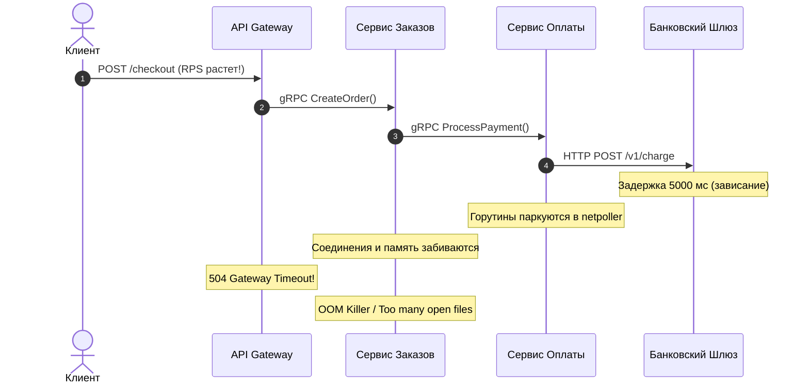

# 1. Обзор раздела. Асинхронность как основа масштабирования

> *«Цель вычислений — понимание сути, а не просто числа. А цель асинхронной архитектуры — выживание системы, а не дань моде».*    
> — Вольная инженерная мудрость

Знакомство с распределенными системами у большинства инженеров начинается с обманчиво простого шага. Разработчик берет аккуратный монолит, распиливает его на десяток микросервисов и... заменяет обычные вызовы функций языка Go (`result, err := service.DoWork()`) на сетевые синхронные вызовы HTTP/REST или gRPC. 

Первые несколько недель в тестовой среде всё выглядит сказочно. Сервис `A` вызывает сервис `B`, дожидается ответа за 15 миллисекунд и рапортует клиенту об успехе. Но как только проект выходит в реальный мир с миллионами пользователей, рекламными акциями и неизбежными сетевыми сбоями, эта идиллия мгновенно рушится. Архитектура превращается в хрупкий карточный домик: стоит одной удаленной базе данных задуматься на 5 секунд, как вся система складывается по принципу домино.

В этом разделе мы заложим несокрушимый фундамент проектирования отказоустойчивых, масштабируемых HighLoad-систем — **асинхронное взаимодействие**. Мы разберем теорию очередей, анатомию брокеров (RabbitMQ, Kafka, NATS) и оркестрацию бизнес-процессов на платформе Temporal. 

Но прежде чем настраивать кластеры, давайте разберемся с точки зрения железа и операционной системы: почему синхронный мир неизбежно упирается в потолок при масштабировании?

---

## 1. Анатомия каскадного сбоя (Cascading Failure)

Представим классическую синхронную цепочку интернет-магазина в момент распродажи:

```
[ Клиент / Браузер ]
         │
         ▼ (HTTP)
   [ API Gateway ]
         │
         ▼ (gRPC)
 [ Сервис Заказов ] ───────► [ Сервис Склада ]
                                    │
                                    ▼ (HTTP)
                            [ Сервис Оплаты ]
                                    │
                                    ▼ (REST)
                        [ Внешний Шлюз Банка ] ──⏳ (Тормозит 5 секунд)
```

Что произойдет, если партнерский банковский шлюз под нагрузкой увеличит время ответа с нормальных 50 мс до 5 секунд? 

С точки зрения бизнес-логики — платежи просто идут медленнее. Но с точки зрения архитектуры рантайма Go и ядра Linux на серверах разворачивается настоящая катастрофа.



> [!info] Под капотом: Смерть от исчерпания ресурсов (Resource Exhaustion)
> В Go сетевой ввод-вывод кажется блокирующим («синхронным»), но рантайм исполняет его кооперативно. На каждый входящий HTTP или gRPC запрос рантайм порождает горутину — легковесную структуру `g` размером от 2 КБ.
> 
> Когда удаленный сервис перестает отвечать:
> 1. **Зависание в netpoller:** Рантайм паркует горутины в подсистеме `netpoller` (в Linux это механизм ядра `epoll`, в macOS/BSD — `kqueue`). Сами горутины не сжигают кванты CPU в пустых циклах, но остаются живыми в памяти.
> 2. **Лавинообразный рост памяти:** При трафике всего в 5 000 RPS пятисекундная задержка означает, что одновременно зависает $5\,000 \times 5 = 25\,000$ горутин. С учетом стеков, буферов запроса и структур, попавших в кучу (Heap) из-за Escape Analysis, это десятки гигабайт памяти.
> 3. **Удушье GC (Garbage Collection):** Сборщик мусора в Go обязан сканировать все живые указатели на стеках приостановленных горутин. Фаза Mark начинает отнимать до 25% всех ядер CPU только на проверку замороженных запросов.
> 4. **Сетевой паралич (Port & FD Exhaustion):** Каждый открытый сетевой сокет — это файловый дескриптор в ядре Linux. Рано или поздно сервис упирается в лимит процесса `ulimit -n` (`too many open files`) или исчерпывает диапазон локальных эфемерных портов (`/proc/sys/net/ipv4/ip_local_port_range`), порождая проблему `port exhaustion`, после чего сервер теряет способность даже подключиться к базе данных.
> 5. **OOM Killer:** Ядро Linux видит критическое падение свободной памяти и хладнокровно присылает сигнал `SIGKILL` процессу «Сервиса Заказов», который сам по себе был абсолютно исправен.

Синхронное межсервисное взаимодействие намертво сковывает систему двумя видами жесткой связанности (Coupling):
- **Связанность во времени (Temporal Coupling):** Все участники транзакции обязаны находиться в работоспособном состоянии и отвечать в одну и ту же миллисекунду. Если хотя бы один узел из цепочки упал или залагал — падает вся операция.
- **Связанность в пространстве (Spatial Coupling):** Сервис-отправитель `A` обязан знать конкретный сетевой адрес (IP-адрес или DNS-имя) сервиса `B`, формат его сокета и следить за балансировкой нагрузки на конкретные инстансы.

---

## 2. Асинхронность как инструмент изоляции

Главная цель внедрения брокеров сообщений — разорвать временную и пространственную связность. Сервисы больше не звонят друг другу напрямую по «телефону», рискуя нарваться на гудки «занято». Вместо этого они обмениваются письмами через надежное «почтовое отделение» — **очередь (Queue)** или **распределенный лог (Append-only Log)**.

```mermaid
flowchart TD
    subgraph Synchronous["Синхронный подход (Прямой вызов)"]
        direction TB
        A["Сервис Заказов"] -->|"HTTP / gRPC<br>Жесткая блокировка"| B["Сервис Оплаты"]
        B -.->|"Задержка 5 секунд"| A
    end

    subgraph Asynchronous["Асинхронный подход (Через брокер)"]
        direction TB
        C["Сервис Заказов"] -->|"1. Быстрый Publish<br>(< 2 мс)"| D[("Брокер сообщений<br>Kafka / RabbitMQ / NATS")]
        D -->|"2. Независимый Fetch / Push<br>со скоростью БД"| E["Сервис Оплаты"]
    end

    style Synchronous fill:#1e1e2e,stroke:#f38ba8,stroke-width:2px
    style Asynchronous fill:#181825,stroke:#a6e3a1,stroke-width:2px
    style D fill:#313244,stroke:#89b4fa,stroke-width:2px
```



В асинхронной схеме «Сервису Заказов» безразлично, жив ли сейчас «Сервис Оплаты», обновляется ли он деплоем или его база данных перестраивает тяжелые индексы:
1. Заказ валидируется и сохраняется локально.
2. В брокер отправляется событие: `OrderCreated`. Брокер подтверждает запись за доли миллисекунды.
3. Сервис Заказов немедленно возвращает клиенту ответ: `202 Accepted` («Заказ принят в обработку»).
4. Пользователь видит быстрый отклик интерфейса, а «Сервис Оплаты» вычитает событие из очереди ровно тогда, когда освободит ресурсы.

---

## 3. Mechanical Sympathy: Буферизация и Backpressure

Посмотрим на асинхронность глазами системного инженера, помнящего об устройстве физического кремния:

```
[ Регистры CPU ]  ~0.5 нс   ═════╗
[ L1/L2 Кэши   ]  ~1–4 нс        ║  Аппаратные буферы и очереди
[ L3 Кэш       ]  ~10–20 нс      ║  (сглаживают колоссальную
[ RAM          ]  ~60–100 нс     ║   разницу в скорости шин)
[ SSD (NVMe)   ]  ~20–100 мкс    ║
[ Сеть (LAN)   ]  ~0.5–2 мс ═════╝
```

Процессор в миллиарды раз быстрее диска и сети. Чтобы вычислительные ядра не простаивали в постоянных ожиданиях, инженеры кремния придумали многоуровневую буферизацию: Store Buffers, Line Fill Buffers, кэши L1–L3.

Брокер сообщений в распределенной системе выполняет абсолютно ту же роль — это **гигантский системный буфер (амортизатор ударов)**, вынесенный на уровень архитектуры приложений.

```
       Пиковый всплеск (Spiky Load)
             30 000 RPS
                 │││││
                 ▼▼▼▼▼
        ┌─────────────────────┐
        │   Брокер (Буфер)    │ ─── Проглатывает пик за счет быстрой записи
        │  [■■■■■■■■■■■■■■■]  │     (в Page Cache или RAM)
        └─────────────────────┘
                 │
                 ▼ (Ровный поток: 1 500 RPS)
        ┌─────────────────────┐
        │  Консьюмер (Сервис) │ ─── Обрабатывает данные комфортно,
        │       + База        │     без троттлинга, зависаний и OOM
        └─────────────────────┘
```

Когда наступает «Черная пятница» или выходит долгожданный релиз, трафик возрастает скачкообразно (Spiky Load). Синхронный сервис под таким цунами гарантированно падает: база данных захлебывается в пуле соединений, потоки блокируются, CPU уходит в 100% троттлинг.

В асинхронной системе брокер берет кинетическую энергию этого удара на себя:
- Продьюсер выполняет сверхдешевую операцию: сериализует сообщение (например, бинарный Protobuf) и отправляет пакет в TCP-сокет брокера.
- Консьюмер забирает сообщения **с той скоростью, с которой способна работать его подсистема хранения** (например, 1 500 транзакций в секунду). 

Это фундаментальный принцип **Backpressure (Обратного давления)**: консьюмер сам управляет своим темпом и никогда не захлебнется входящим потоком.

> [!tip] Собеседование: Go-каналы (`chan`) против брокеров сообщений
> **Вопрос:** В стандартной библиотеке Go есть прекрасные буферизованные каналы (`chan Message`, `sync.Pool`). Зачем тащить в проект тяжелую инфраструктуру вроде Kafka или RabbitMQ, если можно распределять задачи между горутинами через каналы?
> 
> **Ответ:** 
> 1. **Границы адресного пространства и изоляция процесса:** Канал Go живет исключительно в оперативной памяти **одного процесса ОС**. Если приложение упадет из-за критической `panic`, сегфолта в cgo или будет уничтожено `OOM Killer` в Kubernetes-поде, абсолютно все данные в буфере канала будут стерты без следа.
> 2. **Персистентность и Durability:** Брокеры сообщений сбрасывают данные на диск (FSync / Page Cache) и реплицируют их между независимыми серверами кластера по сети (через консенсусы Raft или KRaft). Смерть одного узла не приводит к потере ни единого байта.
> 3. **Независимое масштабирование:** Канал ограничен ресурсами одной виртуальной машины. Брокер позволяет распределять сообщения между сотнями независимых инстансов-обработчиков (Consumer Groups), динамически масштабируемых через HPA (Horizontal Pod Autoscaler).

---

## 4. Смена парадигмы: От Request-Driven к Event-Driven

Переход к асинхронности — это не просто смена сетевого протокола с HTTP на AMQP. Это тектонический сдвиг в мышлении разработчика:

| Критерий | Request-Driven (RPC / Команды) | Event-Driven (Событийная модель) |
|---|---|---|
| **Семантика** | Повелительное наклонение: *«Сделай это!»* | Совершенный вид: *«Это произошло!»* |
| **Знание адресата** | Отправитель знает, кто именно должен выполнить команду. | Отправитель публикует факт в мир и не знает, кто его слушает. |
| **Связность** | Высокая (добавление нового шага требует правки вызывающего кода). | Минимальная (новые сервисы просто подписываются на топик). |
| **Масштабирование** | Ограничено самым медленным сервисом в цепочке. | Каждый консьюмер масштабируется независимо. |

В событийной архитектуре (Event-Driven Architecture) событие становится фактом истории: *«Заказ №42 оплачен»*. Сервису доставки, сервису аналитики и сервису отправки SMS больше не нужно просить «Сервис Оплаты» уведомить их лично. Они независимо подписываются на события топика. 

Это открывает путь к фундаментальным паттернам корпоративных систем: **Pub/Sub**, **Event Sourcing** и **CQRS (Command Query Responsibility Segregation)**, детально изучаемым в следующих главах.

> [!warning] Ловушка / Gotcha: Иллюзия бесплатного сыра
> Асинхронность элегантно лечит инфраструктурную перегрузку, но взамен приносит **проблемы консистентности данных (Data Consistency)**.
> 
> В синхронном мире на одной базе вы имели строгий ACID. В асинхронном мире распределенные двухфазные транзакции (2PC) в продакшене практически неприменимы из-за гигантских задержек и риска глобальных блокировок. 
> 
> На сцену выходит **Eventual Consistency (согласованность в конечном счете)**:
> 1. **Проблема двойной записи (Dual Write):** Что произойдет, если мы записали строку заказа в PostgreSQL, но перед вызовом брокера сеть моргнула или упал под? Данные в базе есть, а сообщения в Kafka нет. Или наоборот. Решать это приходится паттернами **Transactional Outbox** и Change Data Capture (Debezium).
> 2. **Потеря порядка и дублирование:** Сеть ненадежна. Сообщения могут приходить не по порядку или дублироваться при сетевых таймаутах. Ваша бизнес-логика обязана быть строго **идемпотентной**.

---

## 5. Дорожная карта Раздела 13: Что ждет нас впереди?

Этот раздел спроектирован как цельный практический курс: от математических основ теории доставки до исходного кода на Go, готового к суровым реалиям Production.

```mermaid
flowchart TD
    subgraph S1["1. Фундамент асинхронности"]
        F1["Синхронность vs Асинхронность"] --> F2["Модели доставки: At-least / Exactly-once"]
        F2 --> F3["Ordering & Backpressure"]
        F3 --> F4["DLQ, Retry & Идемпотентность"]
    end

    subgraph S2["2. Брокеры под капотом"]
        B1["RabbitMQ: Exchanges & Queues"]
        B2["Kafka: Partitions, Log & Zero-Copy"]
        B3["NATS: In-memory & JetStream"]
    end

    subgraph S3["3. Паттерны и Оркестрация"]
        P1["Outbox & Inbox Pattern"]
        P2["Event Sourcing & Saga"]
        P3["Temporal: Durable Execution"]
    end

    subgraph S4["4. Практика на Go"]
        G1["Graceful Shutdown консьюмеров"]
        G2["Батчинг, ретраи и каналы"]
        G3["Интеграционное тестирование с Testcontainers"]
    end

    S1 --> S2 --> S3 --> S4
    
    style S1 fill:#1e1e2e,stroke:#89b4fa,stroke-width:1px
    style S2 fill:#181825,stroke:#a6e3a1,stroke-width:1px
    style S3 fill:#1e1e2e,stroke:#f9e2af,stroke-width:1px
    style S4 fill:#181825,stroke:#cba6f7,stroke-width:1px
```



1. **Фундамент асинхронности (текущий блок):**
   - Разберем компромиссы в [[2. Синхронное vs асинхронное взаимодействие]] и анатомию очередей в [[3. Очереди сообщений. Зачем они нужны]].
   - Досконально исследуем гарантии доставки в [[4. Модели доставки. At most once, at least once, exactly once]] и цену сохранения строгой последовательности в [[5. Ordering сообщений и его цена]].
   - Научимся защищать сервисы в [[6. Backpressure и контроль нагрузки]] и гарантировать сохранность байтов в [[7. Message durability и persistence]].
   - Настроим спасательные круги инфраструктуры: [[8. Dead Letter Queue]], стратегии повторов в [[9. Retry стратегии и exponential backoff]] и математическую строгость в [[10. Idempotency в message processing]].
2. **Брокеры под капотом:**
   - **[[1. RabbitMQ. Архитектура и концепции]]:** Философия *Smart Broker / Dumb Consumer*, обменники (Exchanges), биндинги и протокол AMQP 0-9-1.
   - **[[1. Kafka. Архитектура и модель log based системы]]:** Философия *Dumb Broker / Smart Consumer*, партиции, коммит смещений (Offsets), системный вызов `sendfile` (Zero-copy) ядра Linux и магия Page Cache, выдающая миллионы сообщений в секунду.
   - **[[1. NATS. Легковесный брокер]]:** Экстремально низкие задержки, легковесный Pub/Sub и персистентный движок JetStream.
3. **Паттерны и архитектура:** Разрешение дуальных записей через Transactional Outbox, транзакционные саги и борьба со спагетти из событий.
4. **Оркестрация процессов:** Когда хореография превращается в неуправляемый хаос, мы разберем [[1. Что такое workflow orchestration]] и платформу Temporal на базе парадигмы Durable Execution.
5. **Практика на Go:** Написание надежных воркеров, батчинг с контролем контекстов (`context.Context`), перехват сигналов завершения ОС и тестирование асинхронных контуров без «костылей» со сном (`time.Sleep`).

Переходим к первому практическому сравнению архитектур: **[[2. Синхронное vs асинхронное взаимодействие]]**.