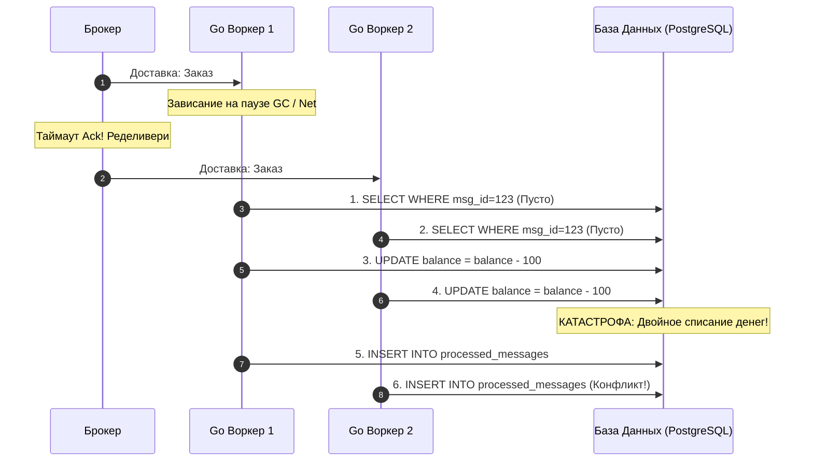
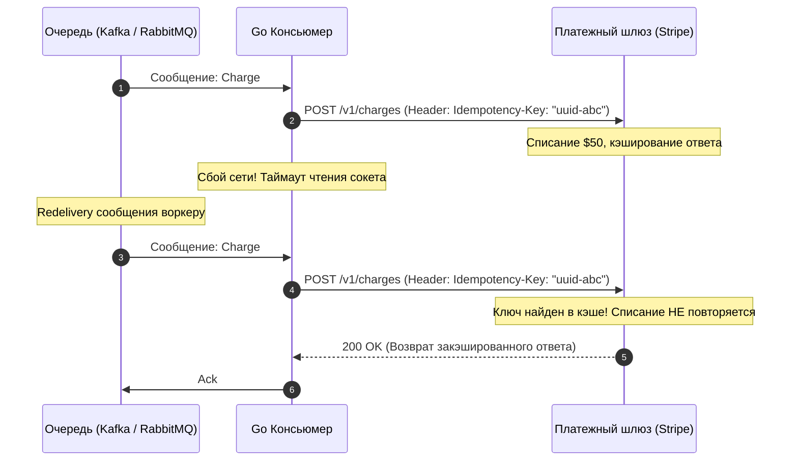

# 10. Idempotency в message processing

> *«В математике операция идемпотентна, если ее многократное применение дает ровно тот же результат, что и однократное: $f(f(x)) = f(x)$. Кнопка вызова лифта восхитительно идемпотентна: нажав ее двадцать раз, вы не вызовете двадцать кабин и не заставите лифт приехать в двадцать раз быстрее».*    
> — Архитектурная аналогия

На протяжении всего вводного подраздела «Фундамент асинхронности» мы последовательно возводили здание отказоустойчивой распределенной архитектуры:
- Мы выбрали семантику гарантированной доставки **At-least-once** ([[4. Модели доставки. At most once, at least once, exactly once]]), чтобы ни один байт не потерялся при сбоях сети.
- Мы внедрили **Exponential Backoff с Jitter** ([[9. Retry стратегии и exponential backoff]]), чтобы переживать временную недоступность баз данных.

Но за эту неуязвимость мы заплатили неизбежную цену: **наши консьюмеры гарантированно и регулярно будут получать дубликаты сообщений**.

Сеть может моргнуть ровно через одну миллисекунду после того, как база данных закоммитила транзакцию списания денег, но за миллисекунду *до* того, как пакет подтверждения `Ack` от Go-сервиса долетит до брокера. Брокер сочтет консьюмер погибшим и немедленно перешлет это же сообщение соседнему воркеру.

Если ваша бизнес-логика выполняет наивный запрос `UPDATE balance = balance - 100`, клиент потеряет деньги дважды, а бизнес понесет финансовые и репутационные убытки.

Единственный математический способ выжить и обеспечить целостность данных в модели At-least-once — сделать абсолютно все операции **идемпотентными**.

---

## Неизбежность двойника

Любая надежная асинхронная архитектура вынуждена мириться с тем, что сеть ненадежна, а повторные попытки (ретраи) неизбежно порождают дубликаты. Прежде чем проектировать защиту, разберем математическую суть этого явления.

---

## 1. Что такое Идемпотентность?

В распределенных вычислениях идемпотентность формулируется так: **многократная обработка одного и того же сообщения (1, 2, 10 или 100 раз) приводит систему ровно к тому же результирующему состоянию, что и однократная.**

### Естественная идемпотентность (Natural Idempotency)

Некоторые операции в архитектуре обладают идемпотентностью от природы:
- **Не идемпотентно (дельта-мутация):**  
  Увеличить счетчик просмотров статьи: `UPDATE views = views + 1`.  
  Списать деньги: `UPDATE balance = balance - 100`.  
  Каждое повторное выполнение искажает реальность.
- **Естественно идемпотентно (фиксация состояния):**  
  Установить финальный статус сущности: `UPDATE orders SET status = 'paid' WHERE id = 123`.  
  Сколько бы сотен раз мы ни повторяли этот запрос, статус заказа в базе останется `'paid'`.  
  Удалить запись по первичному ключу: `DELETE FROM users WHERE id = 42`. После первого удаления запись исчезнет, а повторные вызовы завершатся успехом без изменения состояния мира.

К сожалению, большинство реальных бизнес-операций (списание денег, начисление бонусов, генерация инвойсов, отправка SMS) по своей сути не являются естественно идемпотентными. Их необходимо проектировать таковыми искусственно.

---

## 2. Механика дубликатов: Состояние гонки (Race Condition)

Самая коварная ловушка для инженера — иллюзия того, что дубликаты приходят строго последовательно с большой паузой во времени.

Начинающие разработчики часто пишут наивную проверку:
1. `SELECT * FROM processed_messages WHERE msg_id = 123`
2. Если запись найдена $\rightarrow$ `return nil` (сообщение уже обработано, выходим).
3. Иначе $\rightarrow$ списываем деньги с баланса клиента.
4. `INSERT INTO processed_messages (msg_id) VALUES (123)`

> [!warning] Ловушка / Gotcha: Катастрофа Check-Then-Act
> Этот код неизбежно сломается под нагрузкой в HighLoad-системе!
> 
> В распределенной сети дубликат сообщения очень часто прилетает **в ту же самую миллисекунду**, что и оригинал. Например:
> - Воркер №1 вычитывает оригинал и зависает на длинной паузе сборщика мусора (GC Pause) или сбросе дискового Page Cache.
> - Брокер решает, что Воркер №1 умер, и пересылает сообщение Воркеру №2.
> - Воркер №1 просыпается, и оба воркера **одновременно** выполняют запрос `SELECT` к базе данных.
> - Оба воркера видят пустой результат!
> - Оба воркера списывают по 100 рублей с баланса клиента!
> - И оба воркера пытаются сделать `INSERT`.



Паттерн *«Проверь, затем действуй» (Check-Then-Act)* в распределенных системах без атомарных блокировок абсолютно несостоятелен.

---

## 3. Паттерны реализации Идемпотентности

Чтобы полностью исключить состояние гонки, **проверка на дубликат и мутация бизнес-данных обязаны быть строго атомарными**.

### Паттерн 1: Idempotency Key и Уникальные Индексы (БД)

Это самый надежный, проверенный временем золотой стандарт индустрии.

1. **Генерация ключа:** Продюсер при формировании бизнес-события генерирует детерминированный или уникальный ключ — `Idempotency-Key` (например, строковый UUIDv4 или составной ключ `order-create-user42-cart99`).
2. Этот ключ передается в метаданных (заголовках сообщения или теле JSON).
3. В базе данных консьюмера создается таблица входящих сообщений (Inbox / Processed Events) с ограничением уникальности: `UNIQUE CONSTRAINT (idempotency_key)`.

#### Идиоматичный Go и PostgreSQL (`ON CONFLICT`):
Вместо связки SELECT + INSERT мы перекладываем разрешение гонки на ядро реляционной СУБД:

```go
package consumer

import (
	"context"
	"database/sql"
	"errors"
	"fmt"
)

type Message struct {
	IdempotencyKey string
	UserID         int64
	Amount         int64
}

// ProcessPayment атомарно проверяет ключ идемпотентности и обновляет баланс
func ProcessPayment(ctx context.Context, db *sql.DB, msg Message) error {
	// 1. Открываем транзакцию базы данных
	tx, err := db.BeginTx(ctx, &sql.TxOptions{Isolation: sql.LevelReadCommitted})
	if err != nil {
		return fmt.Errorf("begin tx: %w", err)
	}
	defer tx.Rollback()

	// 2. Атомарная вставка с блокировкой на уровне индекса:
	// Если idempotency_key уже существует, ON CONFLICT DO NOTHING не вставит строку,
	// и RETURNING ничего не вернет (sql.ErrNoRows).
	var returnedKey string
	err = tx.QueryRowContext(ctx, `
		INSERT INTO processed_events (idempotency_key, created_at)
		VALUES ($1, NOW())
		ON CONFLICT (idempotency_key) DO NOTHING
		RETURNING idempotency_key
	`, msg.IdempotencyKey).Scan(&returnedKey)

	if err != nil {
		if errors.Is(err, sql.ErrNoRows) {
			// RETURNING вернул пустоту -> ключ уже был вставлен ранее -> ДУБЛИКАТ!
			// Мы мягко завершаем работу и возвращаем nil (для отправки брокеру Ack)
			return nil
		}
		return fmt.Errorf("check idempotency key: %w", err)
	}

	// 3. Выполняем бизнес-логику строго внутри ТОЙ ЖЕ САМОЙ транзакции
	_, err = tx.ExecContext(ctx, `
		UPDATE balances 
		SET amount = amount - $1 
		WHERE user_id = $2
	`, msg.Amount, msg.UserID)
	if err != nil {
		return fmt.Errorf("deduct balance: %w", err)
	}

	// 4. Фиксируем транзакцию: и факт списания, и факт обработки ключа
	if err := tx.Commit(); err != nil {
		return fmt.Errorf("commit payment: %w", err)
	}

	return nil
}
```

> [!info] Под капотом: Транзакции и блокировки
> Что происходит внутри ядра PostgreSQL, когда два консьюмера одновременно пытаются сделать `INSERT ... ON CONFLICT`?
> Первый запрос захватывает эксклюзивную блокировку на уникальную страницу индекса (B-Tree). Второй запрос блокируется на уровне ядра СУБД, ожидая завершения транзакции первого воркера.
> - Если первая транзакция завершается успехом (`Commit`), второй запрос просыпается, видит запись, срабатывает `DO NOTHING`, и запрос возвращает 0 строк.
> - Если первая транзакция аварийно откатилась (`Rollback`), второй запрос просыпается и беспрепятственно вставляет ключ, завершая бизнес-логику.
> 
> Никакого состояния гонки на уровне прикладного Go-кода не возникает физически!

---

### Паттерн 2: Оптимистичные блокировки (Optimistic Concurrency Control)

Если вы проектируете Event Sourcing или обновляете агрегаты со строгой историей изменений, вы можете опираться на монотонные версии сущностей.

Вместо отдельной таблицы ключей сообщение содержит ожидаемую версию: `ExpectedVersion`.

SQL-запрос выглядит следующим образом:
```sql
UPDATE orders 
SET status = 'shipped', version = version + 1 
WHERE id = 123 AND version = 2;
```

В коде на Go вы проверяете количество обновленных строк через метод `result.RowsAffected()`:
```go
res, err := tx.ExecContext(ctx, query, orderID, expectedVersion)
if err != nil {
    return err
}

affected, err := res.RowsAffected()
if err != nil {
    return err
}

if affected == 0 {
    // Версия уже изменилась (дубликат уже был применен) либо сущность отсутствует.
    // Завершаем обработку как успешную.
    return nil
}
```

Это сверхбыстрый способ, не требующий создания вспомогательных таблиц и накладных расходов на хранение миллионов ключей.

---

### Паттерн 3: Дедупликация через распределенный кэш (Redis SETNX)

Иногда бизнес-логика не работает с реляционной базой данных (например, отправка push-уведомлений, генерация превью видео или отправка вебхуков). В таких сценариях поднимать транзакцию в PostgreSQL для каждого события слишком накладно по IOPS.

В качестве легковесного фильтра дубликатов используется Redis и атомарная команда **`SETNX` (Set if Not eXists)**:

```go
package deduplicator

import (
	"context"
	"fmt"
	"time"

	"github.com/redis/go-redis/v9"
)

type RedisDeduplicator struct {
	client *redis.Client
}

func (d *RedisDeduplicator) TryAcquire(ctx context.Context, key string, ttl time.Duration) (bool, error) {
	// SETNX возвращает true, если ключ был успешно установлен.
	// Если ключ уже существовал, возвращается false.
	acquired, err := d.client.SetNX(ctx, "idemp:"+key, "processing", ttl).Result()
	if err != nil {
		return false, fmt.Errorf("redis setnx: %w", err)
	}

	return acquired, nil
}
```

> [!warning] Ловушка / Gotcha: Иллюзия надежности дедупликации в Redis
> Дедупликация через Redis **не гарантирует строгой консистентности**!
> 
> Представьте сценарий:
> 1. Воркер успешно выполнил `SETNX` в Redis с TTL 24 часа.
> 2. Воркер начал отправку Push-уведомления через внешний шлюз Firebase (FCM).
> 3. В этот момент процесс падает из-за `OOM Killer` ядра Linux.
> 4. Брокер не получил `Ack` и пересылает сообщение другому воркеру.
> 5. Второй воркер делает `SETNX` в Redis, видит, что ключ уже занят, и... **отбрасывает сообщение как дубликат!**
> 
> В итоге push-уведомление не ушло, а система считает его отправленным.
> 
> **Фундаментальное правило:** Дедупликация через Redis допустима только для некритичных операций (уведомления, аналитика). Для финансовых транзакций и критических данных ключ идемпотентности **обязан сохраняться в ту же транзакционную базу данных в рамках единого ACID-коммита**, что и обновляемые бизнес-сущности!

---

## 4. Идемпотентность и внешние API (Pass-Through Idempotency)

Самый популярный архитектурный вопрос на системных интервью: *«Наш Go-консьюмер читает событие из очереди и обязан списать деньги через внешний HTTP API платежного шлюза (Stripe, Adyen, CloudPayments). Мы не можем открыть распределенную транзакцию с чужим сервером в интернете! Как обеспечить идемпотентность?»*

**Решение: Сквозной ключ идемпотентности (Pass-Through Idempotency Key).**

Все современные финансовые API поддерживают стандартизированный HTTP-заголовок: `Idempotency-Key`:



Если по вине сетевого таймаута консьюмер повторит HTTP-запрос с тем же самым `Idempotency-Key`, шлюз Stripe не станет списывать деньги во второй раз: он достанет из своего распределенного хранилища закэшированный результат первой успешной операции и вернет его консьюмеру.

> [!tip] Собеседование: Зачем таблица ключей в БД, если есть брокер?
> **Вопрос:** Если мы передаем `Idempotency-Key` при каждом сообщении, зачем нам вообще заводить таблицу для ключей в нашей реляционной базе данных? Разве брокер не может сам фильтровать дубликаты?
> 
> **Ответ:** 
> Брокеры сообщений (как RabbitMQ) удаляют подтвержденные сообщения из памяти сразу после получения `Ack` — они не хранят бесконечную историю всех событий за прошлый год. 
> 
> Если из-за сбоя в стороннем сервисе произойдет двойная публикация одного и того же заказа с интервалом в 2 часа, брокер воспримет второе сообщение как абсолютно новое! И только наша база данных с постоянным `UNIQUE` ограничением по `idempotency_key` способна защитить бизнес от повторного списания средств на длинной дистанции.

---

## 5. Итог раздела «Фундамент асинхронности»

Этой статьей мы завершаем первый, фундаментальный модуль нашего раздела. Мы исследовали архитектуру распределенного взаимодействия и осознали четыре главных компромисса:

1. **Масштабируемость:** За высокую производительность и разрыв временной связности мы платим отказом от привычных локальных транзакций в пользу Eventual Consistency.
2. **Надежность доставки:** Выбирая модель **At-least-once**, мы гарантируем сохранность данных, но берем на себя обязанность делать каждый обработчик строго **идемпотентным**.
3. **Параллелизм:** За отказ от Head-of-Line Blocking и использование всех ядер процессора мы платим переходом от глобального порядка к **частичному порядку по ключу (Partial Ordering)**.
4. **Устойчивость к катастрофам:** Защита от перегрузок требует согласованной работы механизмов **Backpressure**, очередей **DLQ** и экспоненциальных ретраев с **Jitter**.

Фундаментальные концепции заложены. Теперь мы вооружены математическим аппаратом и готовы спуститься в машинное отделение конкретных лидеров индустрии. 

В следующей лекции мы начинаем детальный разбор внутреннего устройства легендарного AMQP-брокера: **[[1. RabbitMQ. Архитектура и концепции]]**.