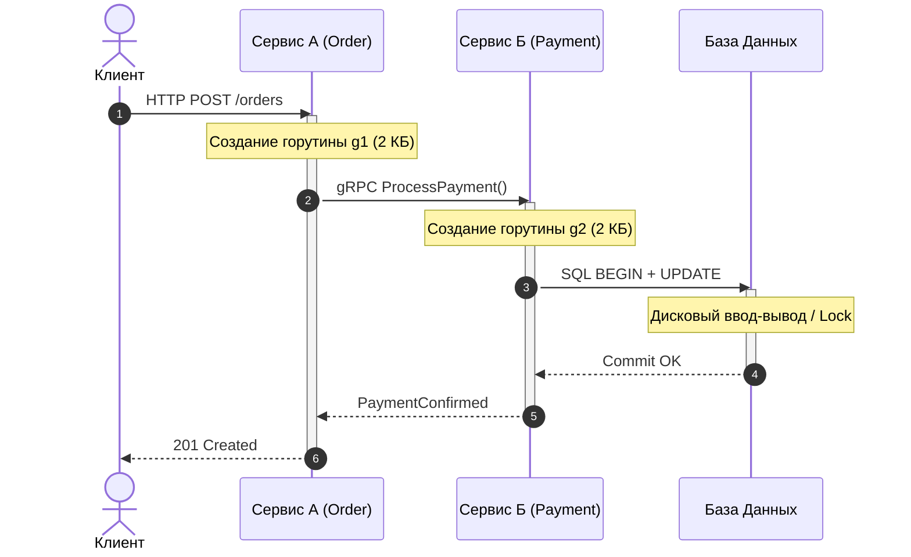

# 2. Синхронное vs асинхронное взаимодействие

> *«Первое заблуждение о распределенных вычислениях гласит, что сеть надежна. Второе — что задержка равна нулю».*    
> — Питер Дойч (L. Peter Deutsch), Fallacies of Distributed Computing

Среди всех абстракций, придуманных инженерами за последние полвека, концепция удаленного вызова процедур (RPC — Remote Procedure Call) оказалась одновременно самой привлекательной и самой коварной. 

Она родилась из благородного стремления: стереть ментальную границу между вызовом функции в одном процессе и вызовом сервиса на другом конце планеты. Синтаксически строчка `user, err := client.GetUser(ctx, id)` выглядит точно так же, как вызов локального метода структуры. Но за этим элегантным синтаксическим сахаром скрывается колоссальная пропасть физической реальности: если чтение из локального L1-кэша процессора занимает меньше наносекунды, то пакет, отправленный в соседнюю стойку дата-центра, летит миллисекунды. 

В масштабах человеческого восприятия эта разница эквивалентна тому, чтобы сравнить чтение слова с экрана (1 секунда) с путешествием пешком до Владивостока и обратно (несколько месяцев).

В этой главе мы досконально разберем, что происходит под капотом рантайма Go и ядра Linux при синхронных сетевых вызовах, почему синхронность порождает каскадные отказы и как асинхронный подход через очереди сообщений радикально меняет поведение системы на уровне кремния.

---

## 1. Иллюзия локального вызова и закон Лики Абстракций

Когда инженер пишет классический синхронный код на Go с использованием `net/http` или gRPC, взаимодействие строится по схеме **Request-Response (Запрос — Ответ)**:



В идеальном мире эта цепочка кажется безупречной. Но закон дырявых абстракций Джоэла Спольски неумолим: любая нетривиальная абстракция протекает. Сеть — это не надежная шина материнской платы:
1. Сетевые пакеты теряются на перегруженных коммутаторах (Packet Drop).
2. Задержка сети (Latency) колеблется от единиц миллисекунд до десятков секунд (Jitter).
3. Процессы на удаленной стороне испытывают паузы сборщика мусора (GC Stop-the-World), троттлинг ядер CPU и блокировки на дисковом вводе-выводе.

Пока нагрузка невелика (десятки или сотни `RPS`), система прощает синхронность. Но как только нагрузка возрастает, иллюзия локального вызова мгновенно разрушается.

---

## 2. Синхронное сетевое взаимодействие под капотом Go

Давайте заглянем под капот рантайма Go и ядра Linux при выполнении типичного HTTP-запроса через клиент из стандартной библиотеки:

```go
// Типичный синхронный HTTP-вызов
func fetchUser(ctx context.Context, client *http.Client, userID string) (*User, error) {
    req, err := http.NewRequestWithContext(ctx, http.MethodGet, "http://user-service/api/v1/users/"+userID, nil)
    if err != nil {
        return nil, fmt.Errorf("build request: %w", err)
    }

    // Горутина внешне "блокируется" здесь в ожидании сетевого ответа
    resp, err := client.Do(req)
    if err != nil {
        return nil, fmt.Errorf("execute request: %w", err)
    }
    defer resp.Body.Close()

    var u User
    if err := json.NewDecoder(resp.Body).Decode(&u); err != nil {
        return nil, fmt.Errorf("decode user: %w", err)
    }
    return &u, nil
}
```

Что физически происходит в рантайме Go на строке `client.Do(req)`?

1. **Сериализация и системный вызов:** Рантайм сериализует HTTP-заголовки и тело в буфер памяти, после чего вызывает системный вызов `write` в сетевой сокет.
2. **Переход в неблокирующий режим:** В Go все сетевые сокеты переводятся в неблокирующий режим (`O_NONBLOCK`). Рантайм пытается прочитать ответ вызовом `read`. Поскольку удаленный сервис еще не прислал ни одного байта, ядро Linux не блокирует поток ОС, а немедленно возвращает код ошибки `EAGAIN` (или `EWOULDBLOCK` — «ресурс временно недоступен, повторите попытку позже»).
3. **Парковка горутины в netpoll:** Вместо того чтобы жечь процессорные такты в пустом цикле проверки сокета или усыплять системный поток ОС (структура `m`), планировщик Go меняет статус текущей горутины (`g`) на `_Gwaiting` и регистрирует дескриптор сокета в сетевом поллере **`netpoll`** (в Linux это механизм `epoll`, в macOS — `kqueue`).
4. **Освобождение потока m:** Поток операционной системы `m`, привязанный к логическому процессору рантайма `p`, освобождается. Он тут же берет из локальной очереди выполнения `runq` следующую готовую горутину и исполняет её.
5. **Пробуждение через epoll_wait:** Когда сетевая карта принимает пакет от `user-service`, ядро ОС обновляет готовность сокета. Рантайм Go (в цикле фонового потока `sysmon` или при периодическом вызове `runtime.netpoll` другими воркерами `m`) получает уведомление от `epoll_wait`. Спящая горутина `g` извлекается из `netpoll`, переводится в статус `_Grunnable` и возвращается в очередь `p` на выполнение.

```
                  Входящий сокет пуст (EAGAIN)
                        ┌──────────────────┐
Горутина (g) ──────────►│ runtime.netpoll  │ ── (зарегистрирована в epoll)
                        └──────────────────┘
                                 │
                 (Горутина ждет сетевой ответ)
                                 │
                     Ядро Linux шлет сигнал epoll
                                 ▼
Поток ОС (m) ◄────────── Возврат в очередь runq (p)
```

Казалось бы, рантайм Go идеален: процессор не простаивает, переключение между горутинами стоит считаные наносекунды! Где же подвох?

> [!info] Под капотом: GC Pressure и утечки памяти при сетевых задержках
> Хотя парковка горутины в `netpoll` освобождает вычислительные ядра CPU от пустых циклов, она **абсолютно не освобождает оперативную память**.
> 
> 1. **Стековая память:** Каждая запаркованная структура `g` удерживает собственный динамический стек. Начальный размер стека составляет 2 КБ, но если горутина успела выполнить вложенные вызовы функций или выделить буферы, её стек мог вырасти до 8–32 КБ. При 100 000 зависших горутин только стеки отнимают от 200 МБ до 3 ГБ RAM.
> 2. **Удержание графа объектов в Heap:** Хуже всего то, что каждая зависшая горутина удерживает сильные ссылки на замыкания, структуры запросов, контексты `context.Context` и буферы, которые в ходе Escape Analysis утекли в кучу (Heap). Эти объекты считаются живыми (Live Objects).
> 3. **Катастрофа сборщика мусора (GC CPU fraction):** Когда запускается сборщик мусора Go, его фаза разметки (**Mark phase**) обязана обойти все корневые объекты (Root Set) — включая стеки всех 100 000 запаркованных горутин! 
>    Вместо полезной бизнес-логики до 25% ресурсов всех ядер CPU начинает сжигаться на сканирование памяти замороженных горутин. Это вызывает скачок задержки (GC Pacer начинает паниковать, инициируя Mark Assist), и сервис окончательно перестает отвечать на запросы.

---

## 3. Фундаментальные проблемы синхронного подхода

```
Цепочка вызовов:
Client ──► Service A ──► Service B ──► Service C ──► DB
Availability: 99.9%    ×   99.9%    ×   99.9%    ×  99.9%  =  99.6%
(Каждый синхронный шаг экспоненциально снижает общую надежность системы)
```

1. **Временная связанность (Temporal Coupling):** Все участники цепочки вызовов обязаны находиться в живом и работоспособном состоянии в одну и ту же миллисекунду. Если из пяти сервисов хотя бы один лег на перезагрузку или перегружен — вся бизнес-транзакция аварийно прерывается.
2. **Сложение задержек (Latency Accumulation):** Общая задержка синхронного ответа клиенту равна сумме задержек всех сервисов в цепочке:
   $$T_{total} = T_{A} + T_{B} + T_{C} + T_{DB}$$
   Если один узел начинает отвечать за 2 секунды вместо 20 мс, клиент получает двухсекундную задержку на всей операции.
3. **Каскадные сбои и амплификация трафика:** Когда вызывающий сервис не получает ответ вовремя, он запускает повторный запрос (Retry). Если тысячи клиентов начинают одновременно повторять запросы к уставшему сервису, возникает лавина повторов (**Retry Storm**), которая намертво добивает упавший узел и тянет за собой вызывающие сервисы.

---

## 4. Асинхронное взаимодействие: Разделяй и властвуй

Асинхронный подход разрывает эту жесткую связку, вводя в систему центральный архитектурный компонент — **Брокер сообщений (Message Broker)** или **Очередь (Queue)**.

Сервис-отправитель (Producer) больше не вызывает сервис-получатель (Consumer) напрямую. Он публикует факт произошедшего (Event) или задание на обработку (Command) в брокер и мгновенно возвращает управление.

```mermaid
flowchart TD
    subgraph Sync["Синхронный RPC / HTTP"]
        direction TB
        C1["Order API"] -->|"HTTP POST<br>(Ждет ответ до 5 сек)"| S1["Payment Service"]
        S1 -.->|"504 Timeout / Блокировка"| C1
    end

    subgraph Async["Асинхронный Event-Driven"]
        direction TB
        C2["Order API"] -->|"1. Быстрый Publish<br>(< 1 мс в буфер)"| B[("Брокер сообщений<br>(Kafka / RabbitMQ / NATS)")]
        B -->|"2. Персистентная запись<br>(Page Cache / WAL)"| B
        B -->|"3. Pull / Push в темпе БД"| S2["Payment Service"]
    end

    style Sync fill:#1e1e2e,stroke:#f38ba8,stroke-width:2px
    style Async fill:#181825,stroke:#a6e3a1,stroke-width:2px
    style B fill:#313244,stroke:#89b4fa,stroke-width:2px
```



### Как асинхронность меняет работу с железом (Mechanical Sympathy)

Посмотрим на отправку сообщения в брокер с точки зрения сетевого стека ядра Linux:

1. **Сетевые сокеты и Keep-Alive:** Продьюсер держит пул постоянных, предварительно прогретых TCP-соединений с брокером. Никакого рукопожатия TCP 3-way handshake или TLS-handshake на каждый запрос не происходит.
2. **Запись в сокетный буфер ядра:** Метод публикации сообщения сводится к тому, чтобы сериализовать батч байтов и записать их в системный сокетный буфер (`SO_SNDBUF`). В современных брокерах (например, Apache Kafka) отправка сообщений батчится прямо в памяти приложения.
3. **Гарантии подтверждения (Acks):**
   - При `acks=0` продьюсер вообще не ждет ответа от брокера (огонь и забыл — fire and forget), сетевой вызов занимает единицы микросекунд.
   - При `acks=1` мы дожидаемся подтверждения того, что сообщение легло в Page Cache лидера партиции.
4. **Немедленная смерть горутины:** Горутина в сервисе заказов не висит секундами в `netpoll`. Она сделала запись в локальный сетевой буфер, вернула клиенту статус `202 Accepted` и благополучно завершилась. Память стека мгновенно освобождается, в куче не накапливаются мертвые хвосты, сборщик мусора дышит свободно, а приложение готово переваривать десятки тысяч запросов в секунду.

> [!warning] Ловушка / Gotcha: Потеря локальной транзакционности
> Переход на асинхронное взаимодействие кардинально меняет правила игры с транзакциями.
> 
> В синхронном монолите вы открывали транзакцию базы данных: если удаленный метод возвращал ошибку, выполнялся простой `tx.Rollback()`. 
> 
> В асинхронной архитектуре запись в локальную БД и отправка сообщения в брокер — это **две независимые распределенные системы**:
> 1. Если вы сначала сохранили заказ в PostgreSQL, а перед отправкой сообщения в Kafka узел потерял питание — база зафиксировала заказ, но событие в брокер так и не ушло. Бизнес-процесс завис навсегда.
> 2. Если вы сначала отправили событие в Kafka, а коммит в базу упал из-за нарушения внешнего ключа — событие улетело подписчикам, деньги с клиента спишутся, но заказа в базе не существует!
> 
> Попытка подружить их «в лоб» приводит к классической **проблеме двойной записи (Dual Write Problem)**. В продакшене она решается исключительно паттернами **Transactional Outbox**, вычитыванием WAL-логов базы (CDC через Debezium) или компенсационными транзакциями в рамках паттерна **Saga**.

---

## 5. Преимущества асинхронности

1. **Изоляция сбоев (Fault Isolation):** Если сервис оплаты или внешняя платежная система упала, сервис заказов этого даже не заметит. Заказы продолжают надежно приниматься и буферизоваться в брокере. Когда платежный сервис восстановит работоспособность, он спокойно вычитает накопленную очередь. Пользователи интернет-магазина не видят ошибок `502 Bad Gateway`.
2. **Амортизация пиков нагрузки ([[6. Backpressure и контроль нагрузки]]):** Брокер работает как массивный маховик или демпфер. Во время пика трафика очередь просто вырастает в глубину (Message Lag), защищая базу данных и слабые внутренние сервисы от взрывного роста соединений и падения по `OOM`.
3. **Низкая связанность и масштабируемость (Decoupling):** Чтобы подключить к системе аналитику, антифрод-систему или отправку push-уведомлений, вам не нужно менять код сервиса заказов. Новые сервисы просто подписываются на уже существующий топик событий `OrderCreated` в качестве независимых консьюмер-групп.

> [!tip] Собеседование: Когда синхронный вызов оправдан, а когда — категорически противопоказан?
> **Вопрос:** Если асинхронность так эффективна, почему индустрия не переведет абсолютно всё общение между микросервисами на очереди и Kafka?
> 
> **Ответ:** 
> За избавление от временной связности приходится расплачиваться переходом на **Eventual Consistency (согласованность в конечном счете)** и резким усложнением пользовательского опыта (UX) и инфраструктуры:
> 1. **UX и семантика чтения (Queries):** Если пользователь запрашивает баланс своего счета или карточку товара, он не может ждать, пока фоновый воркер дойдет до его сообщения. Запросы на чтение (Queries) обязаны быть синхронными (HTTP / gRPC).
> 2. **Сложность отладки и трассировки:** В синхронном стеке стек-трейс и распределенный `trace_id` прямо связывают вызовы. В асинхронной цепочке сообщение может часами лежать в очереди, повторно обрабатываться после ретраев или попадать в DLQ.
> 
> *Золотое правило архитектора:* 
> - **Синхронно (gRPC / HTTP):** Чтение данных (Queries), операции с жестким требованием немедленного детерминированного ответа пользователю, а также взаимодействие на уровне API Gateway с внешними браузерами и мобильными клиентами.
> - **Асинхронно (Очереди / Брокеры):** Мутации состояния (Commands), порождение бизнес-фактов (Events), фоновая тяжелая обработка, интеграция между независимыми контекстами (Bounded Contexts) и операции, зависящие от ненадежных внешних систем.

---

## 6. Сравнительный анализ подходов

| Архитектурный критерий | Синхронное взаимодействие (HTTP, gRPC) | Асинхронное взаимодействие (Очереди, Брокеры) |
|---|---|---|
| **Тип связности** | Жесткая (Temporal & Spatial Coupling) | Слабая (Decoupling во времени и пространстве) |
| **Устойчивость к пикам (Spikes)** | Низкая (риск каскадного отказа и переполнения пулов соединений) | Превосходная (брокер буферизует сообщения и защищает базы) |
| **Пропускная способность** | Лимитируется самым медленным звеном в цепочке вызовов | Максимальная (батчинг, асинхронная запись в сокет) |
| **Поведение рантайма Go** | Парковка тысяч горутин в `netpoll`, рост стеков, перегрузка сборщика мусора (GC Pressure) | Короткий жизненный цикл горутин, плоские стеки, минимальная нагрузка на аллокатор |
| **Сложность архитектуры** | Минимальная (легко писать, легко тестировать локально) | Высокая (необходимость Outbox, идемпотентности, DLQ, мониторинга лага) |
| **Модель транзакций** | Локальный ACID (в пределах одного узла) | Eventual Consistency, Saga Pattern, распределенная компенсация |
| **Потеря сообщений** | Ошибка возвращается сразу в вызывающий код | Требует настройки персистентности (`acks`, fsync, репликация) |

---

## Резюме

Синхронные сетевые вызовы создают обманчивое впечатление простоты, но на поверку связывают микросервисы в единый хрупкий распределенный монолит, где сбой одного узла размножается по всей системе. 

Асинхронный подход разрывает эти цепи, превращая систему в гибкую сеть независимых компонентов, общающихся через защищенные буферы. В следующей лекции мы детально препарируем само понятие очереди, разберем структуры данных очередей в памяти и на диске, а также выясним: **[[3. Очереди сообщений. Зачем они нужны]]**.