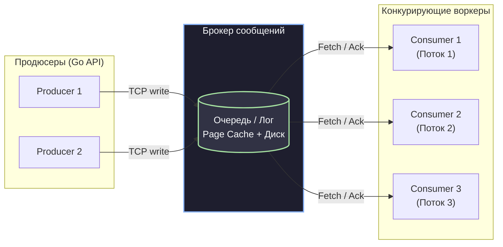

# 3. Очереди сообщений. Зачем они нужны

> *«Конвейер — это просто очередь между двумя процессами. Магия кроется не в самой трубе, а в той свободе, которую она дает обоим концам: трудиться в своем естественном темпе».*    
> — Размышления о наследии Unix и Bell Labs

В далеком 1972 году Дуглас Макилрой предложил революционную идею для операционной системы Unix: соединять независимые программы конвейерами (Pipes) — `cat data.txt | grep error | wc -l`. Программы больше не обязаны были знать друг о друге, договариваться о форматах дисковых файлов или запускаться строго синхронно. Конвейер стал первой в истории вычислительной техники стандартизированной **очередью сообщений в оперативной памяти**.

Спустя полвека в микросервисной архитектуре мы решаем ту же фундаментальную задачу, но уже в масштабе распределенных дата-центров. Когда разработчик на Go впервые сталкивается с необходимостью асинхронного взаимодействия, у него неизбежно возникает соблазн: 

*«Зачем разворачивать в Kubernetes тяжелый кластер RabbitMQ или Kafka, настраивать репликацию и мониторинг, если в стандартной библиотеке Go есть элегантные, сверхбыстрые каналы (`chan`)? Разве нельзя просто передавать структуры между горутинами?»*

Чтобы ответить на этот вопрос с позиции Senior-инженера, заглянем в исходный код рантайма Go, разберем анатомию канала `hchan` и сравним его с устройством промышленных брокеров.

---

## 1. Анатомия очереди: от `chan` к Брокеру

Любая очередь сообщений в своей математической основе реализует дисциплину обслуживания **FIFO (First In, First Out — первым пришел, первым ушел)**. Разница кроется в том, где физически живут данные и что с ними происходит при аппаратных сбоях.

```
       ┌─────────────────────────────────────────────────────────┐
       │             Процесс ОС (Go Application)                 │
       │                                                         │
       │  Горутина (g1) ──► [ hchan: Кольцевой буфер RAM ] ──► g2 │
       │                                 ▲                       │
       └─────────────────────────────────┼───────────────────────┘
                                         │ OOM Killer / Panic / Restart
                                         ▼
                             (100% данных уничтожено)
```

> [!info] Под капотом: Как устроен Go Channel (`hchan`)
> Если заглянуть в исходный код рантайма Go (`runtime/chan.go`), мы увидим, что вызов `make(chan Task, 100)` аллоцирует в куче (Heap) структуру `hchan`:
> 
> ```go
> type hchan struct {
>     qcount   uint           // Текущее количество элементов в очереди
>     dataqsiz uint           // Размерность буфера (емкость)
>     buf      unsafe.Pointer // Указатель на непрерывный кольцевой буфер в RAM
>     elemsize uint16         // Размер одного элемента в байтах
>     closed   uint32         // Флаг закрытия канала
>     elemtype *_type         // Информация о типе данных (для GC)
>     sendx    uint           // Индекс слота для следующей записи
>     recvx    uint           // Индекс слота для следующего чтения
>     recvq    waitq          // Список запаркованных читателей (горутины sudog)
>     sendq    waitq          // Список запаркованных писателей (горутины sudog)
>     lock     mutex          // Спинлок/мьютекс для защиты полей от Data Race
> }
> ```
> 
> Когда горутина пишет в буферизованный канал, рантайм захватывает `lock` структуры `hchan`, копирует байты в ячейку массива `buf[sendx]`, сдвигает индекс `sendx` по модулю емкости и освобождает блокировку. 
> 
> Если канал небуферизован или в очереди уже ждет читатель (`recvq`), рантайм применяет гениальную оптимизацию: он **напрямую копирует байты со стека пишущей горутины на стек читающей горутины**, минуя промежуточный буфер! 
> 
> Это занимает считаные десятки наносекунд. Но эта красота оплачена жесткими физическими ограничениями: `hchan` всецело заперт в памяти одного процесса.

### Почему `hchan` непригоден для межсервисного взаимодействия?

1. **Волатильность (Отсутствие Durability):** Канал живет исключительно в RAM. Если контейнер упадет с критической `panic`, сегфолтом в сишной библиотеке через cgo или будет хладнокровно прибит ядром Linux из-за `OOM` (Out Of Memory), весь кольцевой буфер со всеми накопленными заказами сотрется за микросекунду.
2. **Отсутствие сетевой изоляции:** Канал принципиально не умеет передавать байты через границу операционной системы или по сети.
3. **Отсутствие транзакционных подтверждений (Acknowledgements):** В Go-канале операция чтения `task := <-ch` безвозвратно извлекает элемент из буфера. Если горутина-воркер начала выполнять задачу и упала посреди работы, задача утеряна. Нет штатного способа вернуть её в очередь без ручного костылестроения с дополнительными структурами.

Именно поэтому распределенным системам необходим **внешний брокер сообщений**. Это выделенный сервис (или отказоустойчивый кластер), который берет на себя роль «распределенного супер-канала», обогащенного персистентностью, репликацией по сети и продвинутой маршрутизацией.

---

## 2. Главные функции брокеров сообщений (Зачем они нужны?)

Брокеры сообщений в современной архитектуре выполняют три фундаментальные миссии.

### 1. Буферизация и сглаживание пиков (Shock Absorber)

В реальном мире пользовательский трафик не подчиняется плавной синусоиде. Маркетинговая рассылка, всплеск активности в прайм-тайм или атака ботов вызывают резкие скачки нагрузки (Spikes).

```
   Входящий трафик (Пик): 5 000 RPS
          ││││││││
          ▼▼▼▼▼▼▼▼
   ┌────────────────────┐
   │  Брокер сообщений  │ ── Быстро принимает байты в сокет
   │ [■■■■■■■■■■■■■■■■] │    (Буфер на диске и в Page Cache)
   └────────────────────┘
             │
             ▼ Постоянный поток: 1 000 RPS
   ┌────────────────────┐
   │ Воркеры / БД (Max) │ ── Спокойно обрабатывают данные
   └────────────────────┘    без падений и деградации
```

Если база данных и воркеры рассчитаны максимум на 1 000 RPS, синхронная система при пике в 5 000 RPS гарантированно упадет: кончатся соединения в пуле базы, начнут расти таймауты и сервер рухнет.

Брокер работает как **гидравлический амортизатор**:
- Он быстро принимает все 5 000 сообщений в секунду, сохраняет их и немедленно подтверждает прием продюсеру.
- Консьюмеры забирают задачи с комфортной скоростью 1 000 RPS. Очередь временно накапливает лаг (Message Lag), а после спада пика постепенно рассасывается. База данных даже не замечает, что на входе был пятикратный шторм.

### 2. Гарантия доставки (Reliability & Acknowledgement)

Брокеры реализуют строгий протокол подтверждения приема и обработки:
- **`Ack` (Positive Acknowledgement):** Воркер успешно выполнил бизнес-логику и сохранил результат. Брокер навсегда удаляет сообщение из очереди или сдвигает оффсет.
- **`Nack` (Negative Acknowledgement) / Requeue:** Воркер столкнулся с временной ошибкой (например, сетевой таймаут к внешней API). Брокер возвращает сообщение обратно в очередь для повторной попытки.
- **Dead Mans Switch (Обрыв соединения):** Если контейнер с воркером внезапно умер во время обработки задачи, TCP-сокет закрывается. Брокер мгновенно замечает разрыв, возвращает сообщение из состояния *Unacknowledged* обратно в очередь и передает его другому живому воркеру. Ни одно бизнес-действие не теряется.

### 3. Декоплинг (Decoupling) и независимое масштабирование

В архитектуре очередей отправители и получатели полностью изолированы друг от друга:
- Продюсер не знает, сколько воркеров слушает очередь (1, 10 или 100), на каких IP-адресах они запущены и на каком языке написаны.
- Реализуется классический паттерн **Competing Consumers (Конкурирующие потребители)**: множество воркеров читают из одной очереди, разделяя между собой нагрузку. 

Если очередь начинает расти быстрее, чем воркеры успевают её разгребать, DevOps-инженер (или KEDA Autoscaler в Kubernetes) просто увеличивает число реплик пода с консьюмерами. Код продюсера при этом не меняется ни на одну строчку.



---

## 3. Mechanical Sympathy: Память vs Диск

> [!warning] Ловушка / Gotcha: Миф о медлительности дисковых очередей
> Самый частый предрассудок среди разработчиков:  
> *«Брокер сообщений с сохранением на диск заведомо медленнее синхронных вызовов в память, потому что дисковый ввод-вывод (I/O) невероятно медленный»*.
> 
> Это утверждение верно лишь отчасти. Да, случайный дисковый ввод-вывод (Random I/O) с постоянным поиском дорожек (Seek time) на HDD или обновлением B-Tree индексов на SSD действительно медленный. Но современные лог-ориентированные брокеры (такие как Apache Kafka) работают принципиально иначе!

Давайте разберем, как брокеры достигают миллионной пропускной способности (миллионы событий в секунду на одной ноде) за счет синергии с архитектурой ядра Linux:

### 1. Последовательный ввод-вывод (Sequential I/O)
В архитектуре Append-only Log новые сообщения всегда дописываются **строго в конец файла**. 
- Скорость случайной перезаписи на диске может падать до сотен килобайт в секунду.
- Но последовательная запись (Sequential Write) на современных NVMe SSD достигает 3–7 ГБ/с, что практически сравнимо со скоростью оперативной памяти и многократно превышает пропускную способность сетевых интерфейсов 10GbE/40GbE.

### 2. Кэш страниц операционной системы (OS Page Cache)
При вызове системного вызова `write` брокер не ждет, пока головка диска или ячейка флеш-памяти физически запишет байты. Данные записываются в **Page Cache** — страницы оперативной памяти, которыми распоряжается само ядро Linux.
- Для прикладного процесса запись завершается мгновенно со скоростью RAM.
- Ядро ОС в фоновом режиме (посредством потоков `kswapd` и настроек `dirty_ratio` / `dirty_background_ratio`) сбрасывает грязные страницы на физический диск.
- Принудительный сброс на диск вызывается системным вызовом `fsync`, частоту которого можно настраивать в зависимости от требуемого уровня отказоустойчивости.

### 3. Механизм Zero-Copy через системный вызов `sendfile`
Когда консьюмер запрашивает пачку сообщений, традиционному приложению пришлось бы:
1. Выполнить системный вызов `read`: ядро копирует данные с диска/Page Cache в буфер ядра, а затем копирует в User Space приложения.
2. Выполнить системный вызов `write`: приложение копирует данные из User Space обратно в сокетный буфер ядра.
3. Это требует 4 переключений контекста (Context Switches) и 4 копирований данных через оперативную память и процессор!

Современные брокеры используют системный вызов Linux **`sendfile` (Zero-Copy)**:
Ядро напрямую перекладывает страницы из Page Cache в сетевой буфер сетевой карты (NIC Buffer) через механизм DMA (Direct Memory Access), вообще не поднимая байты в пространство пользователя (User Space) брокера и не нагружая ядра процессора!

```
[ Традиционный путь: 4 копирования, 4 переключения контекста ]
Page Cache ──► Буфер Ядра ──► Буфер Приложения ──► Буфер Сокета ──► Сетка

[ Zero-Copy (sendfile): Данные не покидают ядро ]
Page Cache ───────────────────(DMA)────────────────────► Сетевая карта (NIC)
```

> [!tip] Собеседование: RabbitMQ in-memory против буферизованного Go-канала
> **Вопрос:** Если мы создадим в RabbitMQ временную очередь без флага `durable` (она живет только в RAM и не сбрасывается на диск), чем она будет принципиально отличаться от буферизованного Go-канала большого размера (`make(chan Message, 100000)`)?
> 
> **Ответ:**
> 1. **Сетевой и сериализационный оверхед:** Передача данных через Go-канал — это копирование байтов в памяти одного процесса (десятки наносекунд). Очередь RabbitMQ требует сетевого обмена по протоколу AMQP 0-9-1, сериализации в байты (JSON/Protobuf), системных вызовов ввода-вывода ядра и сетевых задержек (миллисекунды).
> 2. **Изоляция сбоев (Failure Domain):** Если процесс на Go упадет, все сообщения в `chan` погибнут. В случае RabbitMQ, если падает сервис-консьюмер, очередь в брокере остается нетронутой: новое поднявшееся приложение просто переподключится и продолжит обработку.
> 3. **Маршрутизация и конкурентность:** Go-канал не поддерживает сложную логику маршрутизации (Direct, Topic, Fanout, Headers Exchanges), Dead Letter Exchanges, гибкие таймауты TTL на сообщения и не умеет распределять задачи между разнородными сервисами, написанными на разных языках программирования.

---

## Резюме

Очередь сообщений — это не просто хранилище байтов, а **архитектурный балансир** и амортизатор распределенной системы. Она снимает временную и пространственную связность, защищает медленные базы данных от взрывных пиков нагрузки и обеспечивает сохранность бизнес-транзакций при падении серверов через строгие механизмы `Ack/Nack`.

Однако с появлением очередей на инженера обрушивается новый фундаментальный вопрос: *какие гарантии дает брокер при передаче сообщения?* Что произойдет, если сообщение доставлено, но подтверждение `Ack` потерялось в сети? 

В следующей лекции мы разберем священный грааль распределенных систем: **[[4. Модели доставки. At most once, at least once, exactly once]]**.