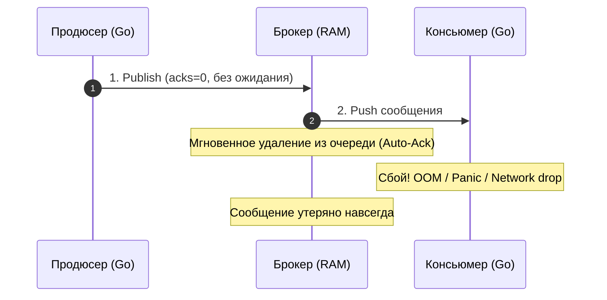

# 4. Модели доставки. At most once, at least once, exactly once

> *«В компьютерных науках есть только две сложные вещи: инвалидация кэша и придумывание имен. Но в распределенных системах есть и третья: знать наверняка, дошел ли ваш пакет до адресата или тихо сгинул во тьме».*    
> — Инженерный афоризм

В распределенных системах нет ничего более обманчивого, чем слово «гарантия». Когда разработчик отправляет байты в сокет, он надеется на надежность протокола TCP. Но TCP гарантирует доставку пакетов только в пределах одного физического соединения между двумя живыми процессами. Стоит серверу внезапно потерять питание, сетевому кабелю надломиться, а контейнеру в Kubernetes превысить квоту памяти и словить `panic` или `SIGKILL`, как вся стройная иллюзия надежности рассыпается.

В таких экстремальных условиях перед архитектором встает центральный вопрос: **как обеспечить передачу и обработку сообщения между сервисами, если ни один узел и ни один сегмент сети не застрахованы от катастрофы?**

Математика распределенных систем дает строгий ответ: существует ровно три базовые модели доставки (Delivery Semantics). Каждая из них представляет собой фундаментальный инженерный компромисс между производительностью (Throughput/Latency), сложностью кода и готовностью к потере или дублированию данных.

---

## 1. Почему доставка сообщений — это сложно?

Прежде чем разбирать протоколы, обратимся к классическому мысленному эксперименту computer science — **«Задаче двух генералов» (Two Generals' Problem)**, сформулированной еще в 1975 году.

Две армии под командованием Генерала 1 и Генерала 2 готовятся штурмовать крепость. Они победят только в том случае, если атакуют одновременно. Единственный способ координации — отправить вестового через вражескую долину, где его могут перехватить. 
- Первый генерал отправляет сообщение: *«Атакуем на рассвете»*. Дошел ли вестовой? Первый генерал не знает, пока не получит подтверждение.
- Второй генерал получает письмо и отправляет гонца с ответом: *«Вас понял, атакую на рассвете»*. Но теперь второй генерал не знает, дошел ли его гонец! Должен ли первый генерал отправить подтверждение на подтверждение?

```
[ Генерал 1 ] ──( Вестовой 1: "Атакуем!" )──► [ Долина врага ] ──?──► [ Генерал 2 ]
     ▲                                                                        │
     │                                                                        ▼
     └──────?────── [ Долина врага ] ◄──( Вестовой 2: "Принято!" )────────────┘
         (И так до бесконечности: 100% консенсус по ненадежному каналу невозможен)
```

Математически доказано, что в условиях ненадежной среды передачи достичь абсолютной взаимной уверенности за конечное число сообщений **невозможно**.

Когда сервис на Go отправляет сообщение в Брокер (или Брокер пытается доставить его Консьюмеру), операция может завершиться тремя исходами:
1. **Явный успех (Success):** Пакет дошел, брокер ответил положительным подтверждением (`Ack`).
2. **Явный отказ (Explicit Failure):** Ядро Linux немедленно вернуло ошибку (например, пришел TCP-пакет `RST` или сокет закрыт — `ECONNRESET`). Мы точно знаем, что данные отвергнуты.
3. **Неизвестность (Timeout / Gray Failure):** Самый коварный сценарий. Мы отправили байты в сокет и не получили ответ за отведенный таймаут (Context Deadline Exceeded). Что произошло на самом деле?
   - Пакет потерялся по пути к брокеру?
   - Брокер успешно сохранил сообщение, но ответный `Ack` был уничтожен сбоем сети?
   - Брокер завис на длинной паузе сборщика мусора (GC Pause) или сбросе страниц на диск (`fsync`) и ответит через секунду?

Именно из-за существования состояния «Неизвестности» инженерам приходится выбирать одну из трех семантик доставки.

---

## 2. At-most-once (Не более одного раза)

> **Кредо:** *«Выстрелил и забыл (Fire and Forget). Лучше потерять часть данных, чем притормозить хоть на микросекунду»*.

При такой семантике сообщение гарантированно обрабатывается либо один раз, либо **не обрабатывается вовсе**. Дубликаты исключены на корню, но потеря данных считается допустимым явлением.



### Механика работы
1. **На стороне продюсера:** Продюсер сбрасывает сериализованные байты в сетевой буфер сокета и немедленно продолжает выполнение бизнес-логики, не дожидаясь ответа от брокера (режим `acks=0` в Kafka).
2. **На стороне брокера:** Брокер не тратит такты на запись в журнал упреждающей записи (WAL) и сброс страниц на диск через `fsync`. Сообщение держится в оперативной памяти.
3. **На стороне консьюмера:** Брокер использует стратегию **Auto-Ack**: как только байты отданы в сокет консьюмера, брокер мгновенно удаляет сообщение из своей очереди. Если консьюмер упадет с `panic` за миллисекунду до записи в базу данных — сообщение утрачено безвозвратно.

> [!info] Под капотом: Экстремальный Throughput
> Семантика At-most-once демонстрирует самую высокую пропускную способность, которую способно выдать «железо»:
> - Нулевое количество системных вызовов `fsync` для каждого сообщения.
> - Отсутствие обратных подтверждений: TCP-окно не тормозится ожиданием прикладных ответов.
> - Минимальное использование CPU и контекстных переключений. 
> На одном узле скорость может достигать нескольких миллионов событий в секунду, упираясь исключительно в ширину полосы сетевой карты (NIC).

**Сфера применения:**
- Сбор высокочастотных метрик и телеметрии (Prometheus / InfluxDB).
- Логирование действий пользователей (Clickstream).
- Трассировка запросов (OpenTelemetry спаны).
- Геолокация курьеров и IoT-датчиков, где свежие координаты, пришедшие через 100 мс, обесценивают предыдущие потерянные точки.

---

## 3. At-least-once (Не менее одного раза) — Индустриальный стандарт

> **Кредо:** *«Ни единой потери байтов. Лучше сделать работу трижды, чем забыть сделать её хотя бы раз»*.

Это рабочая лошадка современного финтеха, e-commerce и распределенных систем. Данная семантика установлена по умолчанию в RabbitMQ, Apache Kafka, NATS JetStream и AWS SQS.

Сообщение гарантированно будет доставлено и обработано. Однако в случае сетевых сбоев, таймаутов или перезагрузок консьюмер может получить **одно и то же сообщение два, три или десять раз**.

### Как это работает: протокол подтверждений
1. **Продюсер:** Публикует сообщение и ожидает явного ответа `Ack` от брокера. Если истек таймаут или вернулась ошибка, продюсер повторяет отправку (Retry) до победного конца.
2. **Брокер:** Приняв сообщение, фиксирует его в персистентном хранилище (реплицированный лог или диск) и выдает консьюмеру. Но брокер **не удаляет** сообщение, а помечает его как находящееся в обработке (*In-Flight / Unacknowledged*).
3. **Консьюмер:** Вычитывает сообщение, выполняет бизнес-логику (проводит транзакцию в PostgreSQL, списывает баланс, формирует заказ).
4. **Фиксация:** Исключительно после успешного завершения всех операций консьюмер отправляет брокеру команду `Ack`.
5. **Удаление:** Получив `Ack`, брокер окончательно удаляет запись из очереди или сдвигает оффсет коммита.

### Анатомия дубликата: рождение фантома

Почему дубликаты неизбежны? Проследим типичный сбой на стыке сети и базы данных:

```mermaid
flowchart TD
    A[("Брокер")] -->|"1. Доставка сообщения<br>(Заказ #42)"| B["Консьюмер (Go)"]
    B -->|"2. SQL BEGIN + COMMIT"| C[("PostgreSQL")]
    Note1["Деньги списаны,<br>заказ сохранен!"] -.-> C
    B -.->|"3. Сеть моргнула!<br>Ack потерян в полете"| A
    A -->|"4. Таймаут Ack истек!<br>Возврат в очередь"| A
    A -->|"5. Повторная доставка воркеру"| B
    B -->|"6. ОШИБКА: Повторное списание денег!"| C

    style A fill:#1e1e2e,stroke:#89b4fa,stroke-width:2px
    style B fill:#313244,stroke:#f9e2af,stroke-width:2px
    style C fill:#181825,stroke:#a6e3a1,stroke-width:2px
```



Воркер выполнил всю работу: записал строку в таблицу базы данных и закоммитил транзакцию. Но в момент отправки подтверждения брокеру сетевой кабель моргнул, или процесс воркера мгновенно уничтожил Kubernetes из-за исчерпания памяти соседней горутины. 

Брокер не получил `Ack` за отведенный интервал (`ack_timeout`). С его точки зрения воркер погиб, не успев сделать ничего полезного. Брокер честно возвращает сообщение в очередь и отдает его соседнему воркеру. Второй воркер получает то же самое сообщение и, если код написан наивно, списывает деньги клиента во второй раз!

> [!warning] Ловушка / Gotcha: Опасность неидемпотентных операций
> Использовать семантику At-least-once в продакшене без проектирования **строго идемпотентных консьюмеров** — это гарантированное самоубийство системы.
> 
> Если сообщение приказывает: *«Уменьшить баланс счета на 500 рублей»* — повторная доставка приведет к двойному списанию и юридическим искам. 
> 
> Любая операция в модели At-least-once обязана обладать свойством математической идемпотентности:
> $$f(f(x)) = f(x)$$
> Повторное выполнение одного и того же события должно приводить систему в то же состояние, что и однократное. Подробные инженерные техники мы изучим в лекции [[10. Idempotency в message processing]].

---

## 4. Exactly-once (Ровно один раз) — Святой Грааль и суровая реальность

> **Кредо:** *«Каждое сообщение доставляется и обрабатывается строго один раз. Ни единого дубликата, ни единой потери»*.

Каждый начинающий разработчик мечтает включить в конфигурационном файле волшебный флаг `delivery.mode: exactly-once` и забыть обо всех проблемах синхронизации.

Но суровая математическая реальность неумолима: из-за Задачи двух генералов **чистый Exactly-once в произвольной открытой распределенной системе невозможен**. То, что производители брокеров (включая Apache Kafka) гордо именуют Exactly-once Processing — это на самом деле **Effectively-once (Эффективно один раз)**.

Это хитроумная иллюзия, собранная поверх проверенной модели **At-least-once** при помощи автоматической дедупликации на стороне инфраструктуры.

### Как достигается Effectively-once?

Чтобы создать иллюзию однократной обработки, распределенная система обязана защитить два критических участка сетевого пути:

```
[ Продюсер ] ──( 1. Идемпотентный продюсер )──► [ Брокер ] ──( 2. Транзакционный процессинг )──► [ База данных ]
```

#### Участок 1: Продюсер $\rightarrow$ Брокер (Идемпотентный Продюсер)
Что произойдет, если продюсер отправил сообщение, брокер записал его в лог, но ответный `Ack` растворился в сети? Продюсер выполнит ретрай и пришлет дубликат.
- В Kafka при включении `enable.idempotence=true` каждому инстансу продюсера при подключении невидимо назначается уникальный 64-битный идентификатор `ProducerID` (PID).
- Каждому сообщению в рамках сессии продюсер присваивает строго монотонный порядковый номер: `SequenceNumber` (0, 1, 2, ...).
- Брокер хранит в оперативной памяти последний подтвержденный `SequenceNumber` для каждой комбинации `PID + Partition`.
- Если брокер получает сообщение с номером, который он уже зафиксировал в логе, он **не дописывает дубликат в файл**, но возвращает продюсеру успешный `Ack`. Продюсер счастлив, а в логе брокера нет мусора.

#### Участок 2: Консьюмер $\rightarrow$ Хранилище (Транзакционный барьер)
Если консьюмер прочитал данные, изменил состояние базы данных, но упал до сдвига оффсета в брокере, при перезапуске он вычитает то же сообщение. Здесь есть два пути решения:
1. **Транзакции внутри брокера (Kafka Transactions / 2PC):** Консьюмер вычитывает сообщение из топика `A`, трансформирует его и атомарно записывает результат в топик `B`, одновременно фиксируя свой оффсет в служебном топике `__consumer_offsets` в рамках единой распределенной двухфазной транзакции под контролем Transaction Coordinator. (Подробно в [[6. Exactly once в Kafka]]).
2. **Транзакционный Inbox/Outbox в базе данных:** Оффсет брокера или бизнес-идентификатор сообщения сохраняется **в ту же самую транзакцию локальной базы данных**, где обновляются бизнес-сущности.

> [!tip] Собеседование: Иллюзия Exactly-once при внешних вызовах
> **Вопрос:** Мы активировали семантику Exactly-once в Kafka (`processing.guarantee=exactly_once_v2`). Наш сервис вычитывает событие заказа, отправляет HTTP-запрос в платежный шлюз (Stripe / CloudPayments) и отправляет SMS клиенту. Защищены ли мы теперь от двойного списания денег?
> 
> **Ответ:** **Категорически нет!** 
> Гарантия Exactly-once в любых брокерах действует **исключительно внутри замкнутой экосистемы этого брокера** (схема *Read-Process-Write*, когда входные и выходные данные находятся в топиках брокера). 
> 
> Как только ваша горутина делает побочный эффект (Side-Effect) во внешний мир — отправляет сетевой HTTP-запрос стороннему API, шлет письмо или пишет в нереляционный Redis без поддержки двухфазного коммита — вы мгновенно выпадаете из зоны безопасности брокера. Сетевой вызов к Stripe может зависнуть по таймауту, брокер перезапустит транзакцию, и консьюмер вызовет Stripe повторно. Для внешнего мира вы всегда остаетесь в парадигме **At-least-once**, требующей уникальных ключей идемпотентности (`Idempotency-Key`).

---

## 5. Памятка по реализации в Go: Идиоматичный консьюмер

При реализации консьюмера в модели **At-least-once** на Go крайне важно соблюдать последовательность операций, разграничивать транзиентные и фатальные ошибки, а также правильно управлять контекстами:

```go
package consumer

import (
	"context"
	"encoding/json"
	"errors"
	"fmt"
	"log/slog"
)

// Ошибки бизнес-логики
var (
	ErrTransient = errors.New("transient infrastructure failure (database lock/timeout)")
	ErrPoison    = errors.New("poison message (corrupted payload or business violation)")
)

type OrderEvent struct {
	OrderID string `json:"order_id"`
	Amount  int64  `json:"amount"`
}

// Message — интерфейс входящего сообщения от брокера (RabbitMQ / NATS JetStream)
type Message interface {
	Payload() []byte
	Ack() error
	Nack(requeue bool) error
}

// ProcessMessage демонстрирует канонический жизненный цикл обработки сообщения
func ProcessMessage(ctx context.Context, msg Message, logger *slog.Logger) {
	// 1. ДЕСЕРИАЛИЗАЦИЯ
	// Если входящие байты повреждены, повторная попытка бессмысленна (Poison Message).
	var event OrderEvent
	if err := json.Unmarshal(msg.Payload(), &event); err != nil {
		logger.ErrorContext(ctx, "failed to unmarshal message, routing to DLQ", "err", err)
		// Nack(false) указывает брокеру НЕ возвращать сообщение в ту же очередь,
		// а сбросить его или отправить в Dead Letter Queue.
		_ = msg.Nack(false)
		return
	}

	// 2. БИЗНЕС-ЛОГИКА С ПРОВЕРКОЙ ИДЕМПОТЕНТНОСТИ
	err := handleBusinessLogic(ctx, event)
	if err != nil {
		if errors.Is(err, ErrTransient) {
			// Временная ошибка инфраструктуры (например, таймаут к БД).
			// Возвращаем сообщение в очередь для последующего повтора (Retry).
			logger.WarnContext(ctx, "transient error, requeuing message", "order_id", event.OrderID, "err", err)
			_ = msg.Nack(true)
			return
		}

		// Фатальная логическая ошибка (например, несуществующий пользователь).
		// Ретраи не помогут — отправляем в DLQ без повторной постановки в очередь.
		logger.ErrorContext(ctx, "unrecoverable business error, rejecting", "order_id", event.OrderID, "err", err)
		_ = msg.Nack(false)
		return
	}

	// 3. ПОДТВЕРЖДЕНИЕ ДОСТАВКИ (ACK)
	// Отправляется СТРОГО ПОСЛЕ успешного коммита всех побочных эффектов!
	if err := msg.Ack(); err != nil {
		logger.ErrorContext(ctx, "failed to acknowledge message to broker", "order_id", event.OrderID, "err", err)
	}
}

func handleBusinessLogic(ctx context.Context, event OrderEvent) error {
	// В реальном коде здесь:
	// 1. Открытие транзакции БД (tx).
	// 2. Проверка, не обрабатывался ли event.OrderID ранее (Inbox table).
	// 3. Выполнение операции и INSERT в Inbox.
	// 4. tx.Commit().
	return nil
}
```

---

## 6. Итоговая матрица сравнения семантик доставки

| Критерий | At-most-once | At-least-once | Effectively-once (Kafka Streams) |
|---|---|---|---|
| **Гарантия потери** | Данные могут теряться | **Потери исключены** (при наличии диска) | **Потери исключены** |
| **Гарантия дубликатов** | **Дубликаты исключены** | Возможны дубликаты (при ретраях и сбоях) | Дубликаты фильтруются брокером |
| **Требование к коду** | Минимальное | **Обязательная идемпотентность** | Поддержка транзакционного API |
| **Влияние на Latency** | Минимальное (< 1 мс) | Умеренное (1–10 мс) | Заметное (из-за 2PC и коммитов транзакций) |
| **Влияние на Throughput** | Максимальное (миллионы RPS) | Высокое (сотни тысяч RPS) | Среднее (десятки тысяч RPS) |
| **Типичные брокеры** | Любые с Auto-Ack / UDP | RabbitMQ, Kafka, NATS JetStream, SQS | Apache Kafka Transactions |

---

## Резюме

В распределенном мире нет бесплатных гарантий:
1. **At-most-once** дает предельную скорость ценой риска потери данных.
2. **At-least-once** дает надежность ценой риска дубликатов, перекладывая бремя обеспечения идемпотентности на плечи разработчика бизнес-логики.
3. **Exactly-once** — это тщательно сконструированная иллюзия, работающая только внутри закрытого периметра брокера и требующая высокой вычислительной платы.

Определившись с тем, *дойдет ли* сообщение, мы обязаны задать следующий ключевой вопрос: *в каком порядке оно придет?* Если событие создания заказа обгонит событие добавления товара, система рухнет с логической ошибкой. В следующей лекции мы детально исследуем: **[[5. Ordering сообщений и его цена]]**.